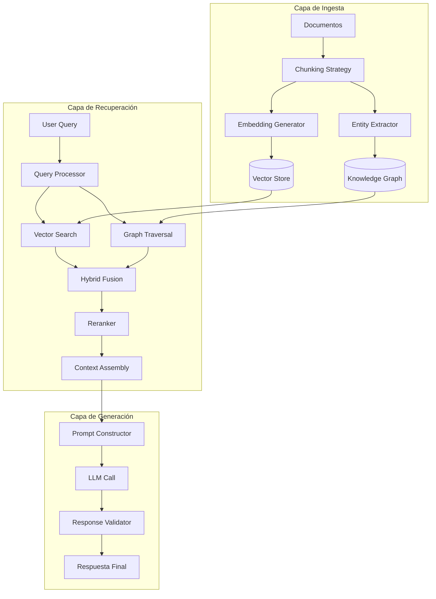
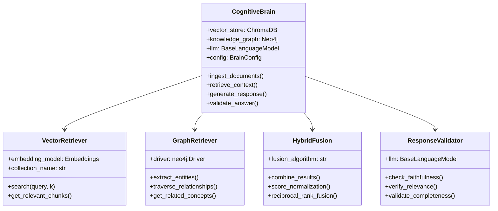
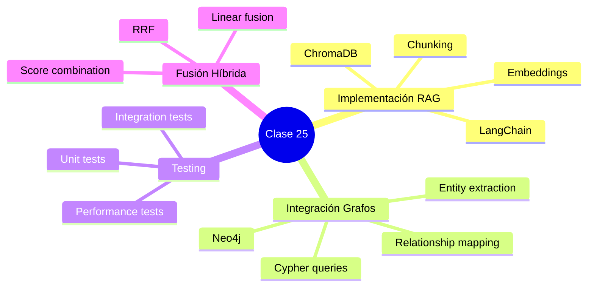

# Clase 25: Proyecto Cerebro Cognitivo - Parte 2

## Implementación de RAG, Integración de Grafos y Testing de Integración

---

## Duración: 4 horas

---

## Objetivos de Aprendizaje

Al finalizar esta clase, el estudiante será capaz de:

1. **Implementar sistemas RAG** completos utilizando LangChain con múltiples vectores de embeddings
2. **Integrar grafos de conocimiento** con bases de datos vectoriales para potenciar las respuestas
3. **Diseñar pipelines de recuperación híbrida** que combinen búsqueda semántica y estructurada
4. **Escribir tests de integración** robustos para validar el flujo completo del sistema cognitivo
5. **Optimizar la recuperación** mediante técnicas de re-ranking y filtrado semántico
6. **Manejar errores y edge cases** en sistemas RAG en producción

---

## 1. Arquitectura del Sistema RAG del Proyecto Cerebro Cognitivo

### 1.1 Visión General de la Arquitectura

El Proyecto Cerebro Cognitivo implementa una arquitectura híbrida que combina:
- **Recuperación vectorial** mediante ChromaDB para búsqueda semántica
- **Grafos de conocimiento** en Neo4j para relaciones ontológicas
- **Procesamiento de lenguaje natural** con LangChain para orquestación



### 1.2 Componentes Principales



---

## 2. Implementación de RAG con LangChain

### 2.1 Configuración del Entorno

```python
# config/settings.py
from pydantic import BaseSettings
from typing import List, Optional
from enum import Enum

class EmbeddingModel(str, Enum):
    OPENAI = "text-embedding-ada-002"
    COHERE = "cohere-embed-v3"
    LOCAL = "sentence-transformers/all-MiniLM-L6-v2"

class VectorStore(str, Enum):
    CHROMADB = "chroma"
    PINECONE = "pinecone"
    WEAVIATE = "weaviate"

class BrainConfig(BaseSettings):
    """Configuración principal del Cerebro Cognitivo"""
    
    # Modelos de embedding
    embedding_model: EmbeddingModel = EmbeddingModel.OPENAI
    embedding_dimension: int = 1536
    
    # Vector store
    vector_store_type: VectorStore = VectorStore.CHROMADB
    persist_directory: str = "./data/chromadb"
    collection_name: str = "cognitive_brain"
    
    # Neo4j Graph Database
    neo4j_uri: str = "bolt://localhost:7687"
    neo4j_user: str = "neo4j"
    neo4j_password: str = "password"
    neo4j_database: str = "neo4j"
    
    # LLM Configuration
    llm_provider: str = "openai"
    llm_model: str = "gpt-4"
    llm_temperature: float = 0.3
    max_tokens: int = 2000
    
    # RAG Configuration
    retrieval_top_k: int = 10
    rerank_top_k: int = 5
    min_similarity_score: float = 0.7
    chunk_size: int = 1000
    chunk_overlap: int = 200
    
    # Fusion Settings
    fusion_algorithm: str = "rrf"  # Reciprocal Rank Fusion
    vector_weight: float = 0.6
    graph_weight: float = 0.4
    
    class Config:
        env_file = ".env"
        env_file_encoding = "utf-8"
```

### 2.2 Implementación del Vector Retriever

```python
# retrieval/vector_retriever.py
from typing import List, Dict, Any, Optional, Tuple
from langchain.embeddings import OpenAIEmbeddings, CohereEmbeddings
from langchain_community.vectorstores import Chroma
from langchain.schema import Document, BaseRetriever
from langchain.callbacks.manager import CallbackManagerForRetrieverRun
import numpy as np

class CognitiveVectorRetriever(BaseRetriever):
    """
    Retriever de vectores para el Cerebro Cognitivo.
    Maneja la búsqueda semántica en ChromaDB con soporte para
    múltiples estrategias de similitud y filtrado.
    """
    
    def __init__(
        self,
        vectorstore: Chroma,
        embeddings,
        search_kwargs: Optional[Dict[str, Any]] = None,
        relevance_threshold: float = 0.7
    ):
        self.vectorstore = vectorstore
        self.embeddings = embeddings
        self.search_kwargs = search_kwargs or {"k": 10}
        self.relevance_threshold = relevance_threshold
    
    def _get_relevant_documents(
        self, 
        query: str,
        run_manager: Optional[CallbackManagerForRetrieverRun] = None
    ) -> List[Document]:
        """Obtiene documentos relevantes usando búsqueda vectorial."""
        
        # Búsqueda de similitud
        docs_and_scores = self.vectorstore.similarity_search_with_score(
            query, 
            **self.search_kwargs
        )
        
        # Filtrado por umbral de relevancia
        filtered_docs = [
            doc for doc, score in docs_and_scores 
            if score >= self.relevance_threshold
        ]
        
        return filtered_docs
    
    async def _aget_relevant_documents(
        self, 
        query: str,
        run_manager: Optional[CallbackManagerForRetrieverRun] = None
    ) -> List[Document]:
        """Versión asíncrona para mayor rendimiento."""
        return self._get_relevant_documents(query, run_manager)
    
    def search_by_vector(
        self, 
        query_vector: List[float], 
        k: int = 10
    ) -> List[Tuple[Document, float]]:
        """Búsqueda por vector pre-computado."""
        return self.vectorstore.similarity_search_with_score_by_vector(
            query_vector, 
            k=k
        )
    
    def get_embedding_for_text(self, text: str) -> List[float]:
        """Genera embedding para un texto dado."""
        return self.embeddings.embed_query(text)


class VectorStoreManager:
    """Gestor del almacén vectorial con soporte para múltiples colecciones."""
    
    def __init__(self, config: BrainConfig):
        self.config = config
        self.embeddings = self._initialize_embeddings()
        self.vectorstores: Dict[str, Chroma] = {}
        self._initialize_vectorstore()
    
    def _initialize_embeddings(self):
        """Inicializa el modelo de embeddings según configuración."""
        if self.config.embedding_model == EmbeddingModel.OPENAI:
            return OpenAIEmbeddings(
                model=self.config.embedding_model.value,
                openai_api_type="openai"
            )
        elif self.config.embedding_model == EmbeddingModel.COHERE:
            return CohereEmbeddings(
                model=self.config.embedding_model.value
            )
        else:
            from langchain.embeddings import HuggingFaceEmbeddings
            return HuggingFaceEmbeddings(
                model_name="sentence-transformers/all-MiniLM-L6-v2"
            )
    
    def _initialize_vectorstore(self) -> None:
        """Inicializa ChromaDB con persistencia."""
        self.vectorstores[self.config.collection_name] = Chroma(
            client=None,  # Usar cliente por defecto
            collection_name=self.config.collection_name,
            embedding_function=self.embeddings,
            persist_directory=self.config.persist_directory
        )
    
    def create_collection(self, name: str) -> Chroma:
        """Crea una nueva colección en ChromaDB."""
        if name not in self.vectorstores:
            self.vectorstores[name] = Chroma(
                client=None,
                collection_name=name,
                embedding_function=self.embeddings,
                persist_directory=f"{self.config.persist_directory}/{name}"
            )
        return self.vectorstores[name]
    
    def add_documents(
        self,
        documents: List[Document],
        collection_name: Optional[str] = None
    ) -> List[str]:
        """Agrega documentos a la colección especificada."""
        collection = self.vectorstores.get(
            collection_name or self.config.collection_name
        )
        if not collection:
            raise ValueError(f"Collection {collection_name} not found")
        
        return collection.add_documents(documents)
    
    def get_retriever(
        self, 
        collection_name: Optional[str] = None,
        search_kwargs: Optional[Dict] = None
    ) -> CognitiveVectorRetriever:
        """Obtiene un retriever configurado para la colección."""
        collection = self.vectorstores.get(
            collection_name or self.config.collection_name
        )
        
        default_search_kwargs = {
            "k": self.config.retrieval_top_k,
            "filter": None
        }
        
        return CognitiveVectorRetriever(
            vectorstore=collection,
            embeddings=self.embeddings,
            search_kwargs=search_kwargs or default_search_kwargs,
            relevance_threshold=self.config.min_similarity_score
        )
```

### 2.3 Pipeline de Ingesta de Documentos

```python
# ingestion/document_processor.py
from typing import List, Dict, Any, Optional, Tuple
from langchain.text_splitter import RecursiveCharacterTextSplitter, TokenTextSplitter
from langchain.schema import Document
from langchain.document_loaders import (
    PyPDFLoader, 
    UnstructuredWordDocumentLoader,
    CSVLoader,
    JSONLoader
)
import json
import hashlib
from datetime import datetime

class DocumentProcessor:
    """
    Procesador de documentos para el sistema RAG.
    Maneja carga, chunking y enriquecimiento de documentos.
    """
    
    def __init__(
        self,
        chunk_size: int = 1000,
        chunk_overlap: int = 200,
        separators: Optional[List[str]] = None
    ):
        self.chunk_size = chunk_size
        self.chunk_overlap = chunk_overlap
        
        # Separadores optimizados para texto en español
        self.separators = separators or [
            "\n\n",
            "\n",
            ". ",
            "? ",
            "! ",
            "; ",
            ", ",
            " "
        ]
        
        self.text_splitter = RecursiveCharacterTextSplitter(
            chunk_size=self.chunk_size,
            chunk_overlap=self.chunk_overlap,
            separators=self.separators,
            length_function=self._count_tokens
        )
    
    def _count_tokens(self, text: str) -> int:
        """Cuenta tokens aproximados (1 token ≈ 4 caracteres para español)."""
        return len(text) // 4
    
    def load_document(self, file_path: str) -> List[Document]:
        """Carga un documento según su extensión."""
        file_extension = file_path.lower().split('.')[-1]
        
        loaders = {
            'pdf': PyPDFLoader,
            'docx': UnstructuredWordDocumentLoader,
            'doc': UnstructuredWordDocumentLoader,
            'csv': CSVLoader,
            'json': lambda path: self._load_json(path)
        }
        
        loader_class = loaders.get(file_extension)
        if not loader_class:
            raise ValueError(f"Unsupported file type: {file_extension}")
        
        loader = loader_class(file_path)
        return loader.load()
    
    def _load_json(self, file_path: str) -> List[Document]:
        """Carga y procesa archivos JSON."""
        with open(file_path, 'r', encoding='utf-8') as f:
            data = json.load(f)
        
        documents = []
        if isinstance(data, list):
            for item in data:
                content = json.dumps(item, ensure_ascii=False)
                doc = Document(
                    page_content=content,
                    metadata={
                        "source": file_path,
                        "type": "json",
                        "id": self._generate_id(content)
                    }
                )
                documents.append(doc)
        elif isinstance(data, dict):
            content = json.dumps(data, ensure_ascii=False)
            documents.append(Document(
                page_content=content,
                metadata={
                    "source": file_path,
                    "type": "json",
                    "id": self._generate_id(content)
                }
            ))
        
        return documents
    
    def _generate_id(self, content: str) -> str:
        """Genera un ID único para el documento."""
        return hashlib.md5(content.encode()).hexdigest()
    
    def process_documents(
        self,
        documents: List[Document],
        add_metadata: bool = True
    ) -> List[Document]:
        """Procesa y fragmenta documentos para indexing."""
        processed_docs = []
        
        for doc in documents:
            # Agregar metadata de procesamiento
            if add_metadata:
                doc.metadata.update({
                    "processed_at": datetime.now().isoformat(),
                    "chunk_size": self.chunk_size,
                    "original_length": len(doc.page_content)
                })
            
            # Dividir en chunks
            chunks = self.text_splitter.split_documents([doc])
            
            for i, chunk in enumerate(chunks):
                chunk.metadata.update({
                    "chunk_index": i,
                    "total_chunks": len(chunks),
                    "chunk_id": self._generate_id(chunk.page_content)
                })
                processed_docs.append(chunk)
        
        return processed_docs
    
    def enrich_documents(
        self,
        documents: List[Document],
        extraction_type: str = "basic"
    ) -> List[Document]:
        """
        Enriquece documentos con metadata adicional.
        
        Tipos de enriquecimiento:
        - basic: Agrega estadísticas básicas
        - semantic: Incluye clasificación de contenido
        - relational: Detecta entidades y relaciones
        """
        
        for doc in documents:
            # Metadata básica
            doc.metadata.update({
                "word_count": len(doc.page_content.split()),
                "char_count": len(doc.page_content),
                "sentence_count": doc.page_content.count('.') + 
                                  doc.page_content.count('!') + 
                                  doc.page_content.count('?'),
            })
            
            if extraction_type in ["semantic", "relational"]:
                # Detectar idioma
                doc.metadata["language"] = self._detect_language(
                    doc.page_content
                )
            
            if extraction_type == "relational":
                # Preparar para extracción de entidades
                doc.metadata["requires_ner"] = True
        
        return documents
    
    def _detect_language(self, text: str) -> str:
        """Detecta el idioma del texto (heurística simple)."""
        spanish_indicators = ['á', 'é', 'í', 'ó', 'ú', 'ñ', '¿', '¡']
        english_indicators = [' the ', ' is ', ' are ', ' was ', ' were ']
        
        spanish_count = sum(1 for c in text.lower() if c in spanish_indicators)
        english_count = sum(text.lower().count(w) for w in english_indicators)
        
        return "spanish" if spanish_count > english_count else "english"


class IngestionPipeline:
    """
    Pipeline completo de ingestión para el Cerebro Cognitivo.
    Maneja el flujo desde archivos hasta la base vectorial y el grafo.
    """
    
    def __init__(
        self,
        vector_store_manager: VectorStoreManager,
        graph_manager: 'GraphManager',
        config: BrainConfig
    ):
        self.vector_store_manager = vector_store_manager
        self.graph_manager = graph_manager
        self.config = config
        self.doc_processor = DocumentProcessor(
            chunk_size=config.chunk_size,
            chunk_overlap=config.chunk_overlap
        )
    
    def ingest_document(
        self,
        file_path: str,
        metadata: Optional[Dict[str, Any]] = None,
        extract_entities: bool = True
    ) -> Dict[str, Any]:
        """
        Pipeline completo de ingestión de un documento.
        
        Pasos:
        1. Carga del documento
        2. Procesamiento y chunking
        3. Enriquecimiento
        4. Indexación en vector store
        5. Extracción de entidades (opcional)
        6. Creación de nodos en el grafo
        """
        
        # Paso 1: Cargar documento
        documents = self.doc_processor.load_document(file_path)
        
        # Agregar metadata custom
        for doc in documents:
            if metadata:
                doc.metadata.update(metadata)
        
        # Paso 2: Procesar y dividir en chunks
        processed_docs = self.doc_processor.process_documents(
            documents,
            add_metadata=True
        )
        
        # Paso 3: Enriquecer con metadata semántica
        processed_docs = self.doc_processor.enrich_documents(
            processed_docs,
            extraction_type="relational" if extract_entities else "basic"
        )
        
        # Paso 4: Indexar en vector store
        doc_ids = self.vector_store_manager.add_documents(
            processed_docs,
            collection_name=self.config.collection_name
        )
        
        # Paso 5: Extraer entidades si está habilitado
        entity_results = None
        if extract_entities:
            entity_results = self._extract_and_store_entities(processed_docs)
        
        return {
            "status": "success",
            "document_count": len(documents),
            "chunk_count": len(processed_docs),
            "doc_ids": doc_ids,
            "entities_extracted": entity_results
        }
    
    def ingest_batch(
        self,
        file_paths: List[str],
        batch_size: int = 10
    ) -> List[Dict[str, Any]]:
        """Procesa múltiples documentos en lotes."""
        results = []
        
        for i in range(0, len(file_paths), batch_size):
            batch = file_paths[i:i + batch_size]
            
            for file_path in batch:
                try:
                    result = self.ingest_document(file_path)
                    results.append(result)
                except Exception as e:
                    results.append({
                        "status": "error",
                        "file": file_path,
                        "error": str(e)
                    })
        
        return results
    
    def _extract_and_store_entities(
        self,
        documents: List[Document]
    ) -> Dict[str, Any]:
        """Extrae entidades y crea nodos en el grafo."""
        # Esta función será implementada con el GraphManager
        # Ver sección de integración con grafos
        pass
```

---

## 3. Integración con Grafos de Conocimiento

### 3.1 Implementación del Graph Manager

```python
# graph/knowledge_graph.py
from typing import List, Dict, Any, Optional, Set, Tuple
from neo4j import GraphDatabase, Result
from pydantic import BaseModel
from datetime import datetime
import logging

logger = logging.getLogger(__name__)

class Entity(BaseModel):
    """Modelo de entidad para el grafo de conocimiento."""
    id: str
    type: str  # Person, Organization, Concept, Location, etc.
    name: str
    properties: Dict[str, Any] = {}
    description: Optional[str] = None

class Relationship(BaseModel):
    """Modelo de relación entre entidades."""
    source_id: str
    target_id: str
    type: str  # WORKS_FOR, LOCATED_IN, IS_A, etc.
    properties: Dict[str, Any] = {}

class GraphManager:
    """
    Gestor del grafo de conocimiento con Neo4j.
    Maneja operaciones CRUD y consultas Cypher.
    """
    
    def __init__(
        self,
        uri: str,
        user: str,
        password: str,
        database: str = "neo4j"
    ):
        self.uri = uri
        self.user = user
        self.password = password
        self.database = database
        self.driver = None
        self._connect()
    
    def _connect(self) -> None:
        """Establece conexión con Neo4j."""
        self.driver = GraphDatabase.driver(
            self.uri,
            auth=(self.user, self.password)
        )
        # Verificar conexión
        with self.driver.session(database=self.database) as session:
            session.run("RETURN 1")
        logger.info(f"Connected to Neo4j at {self.uri}")
    
    def close(self) -> None:
        """Cierra la conexión con Neo4j."""
        if self.driver:
            self.driver.close()
    
    def create_entity(self, entity: Entity) -> Dict[str, Any]:
        """Crea un nodo entidad en el grafo."""
        query = """
        MERGE (e:%s {id: $id})
        SET e.name = $name,
            e.description = $description,
            e.created_at = datetime(),
            e += $properties
        RETURN e
        """ % entity.type
        
        with self.driver.session(database=self.database) as session:
            result = session.run(
                query,
                id=entity.id,
                name=entity.name,
                description=entity.description,
                properties=entity.properties
            )
            record = result.single()
            return {"node": dict(record["e"])} if record else None
    
    def create_relationship(self, relationship: Relationship) -> Dict[str, Any]:
        """Crea una relación entre dos entidades."""
        query = """
        MATCH (source {id: $source_id})
        MATCH (target {id: $target_id})
        MERGE (source)-[r:%s]->(target)
        SET r += $properties,
            r.created_at = datetime()
        RETURN source, target, r
        """ % relationship.type
        
        with self.driver.session(database=self.database) as session:
            result = session.run(
                query,
                source_id=relationship.source_id,
                target_id=relationship.target_id,
                properties=relationship.properties
            )
            record = result.single()
            if record:
                return {
                    "source": dict(record["source"]),
                    "target": dict(record["target"]),
                    "relationship": dict(record["r"])
                }
            return None
    
    def find_entity_by_id(self, entity_id: str) -> Optional[Dict[str, Any]]:
        """Busca una entidad por su ID."""
        query = """
        MATCH (e)
        WHERE e.id = $id
        RETURN e
        """
        
        with self.driver.session(database=self.database) as session:
            result = session.run(query, id=entity_id)
            record = result.single()
            return dict(record["e"]) if record else None
    
    def find_entities_by_type(
        self,
        entity_type: str,
        limit: int = 100
    ) -> List[Dict[str, Any]]:
        """Busca todas las entidades de un tipo."""
        query = """
        MATCH (e:%s)
        RETURN e
        LIMIT $limit
        """ % entity_type
        
        with self.driver.session(database=self.database) as session:
            result = session.run(query, limit=limit)
            return [dict(record["e"]) for record in result]
    
    def find_related_entities(
        self,
        entity_id: str,
        relationship_type: Optional[str] = None,
        depth: int = 1
    ) -> List[Dict[str, Any]]:
        """
        Encuentra entidades relacionadas siguiendo relaciones.
        
        Args:
            entity_id: ID de la entidad origen
            relationship_type: Tipo de relación a seguir (opcional)
            depth: Profundidad de la búsqueda (1-3 recomendado)
        """
        rel_pattern = f"[r:{relationship_type}*1..{depth}]" if relationship_type else "[r*1..{depth}]"
        
        query = f"""
        MATCH (start {{id: $entity_id}})-{rel_pattern}-(related)
        WHERE start <> related
        RETURN DISTINCT related,
               TYPE(r) as relationship_type,
               LENGTH(r) as path_length
        ORDER BY path_length
        """
        
        with self.driver.session(database=self.database) as session:
            result = session.run(query, entity_id=entity_id, depth=depth)
            return [
                {
                    "entity": dict(record["related"]),
                    "relationship": record["relationship_type"],
                    "distance": record["path_length"]
                }
                for record in result
            ]
    
    def execute_cypher(self, query: str, params: Dict = None) -> List[Dict]:
        """Ejecuta una consulta Cypher arbitraria."""
        with self.driver.session(database=self.database) as session:
            result = session.run(query, **(params or {}))
            return [dict(record) for record in result]
    
    def get_subgraph_around_entity(
        self,
        entity_id: str,
        radius: int = 2
    ) -> Dict[str, Any]:
        """
        Obtiene un subgrafo centrado en una entidad.
        Útil para visualizar el contexto alrededor de una entidad.
        """
        query = """
        MATCH path = (center {id: $entity_id})-[*1..{radius}]-(connected)
        WITH center, connected, relationships(path) as rels
        UNWIND rels as r
        RETURN center, connected, r
        """.format(radius=radius)
        
        with self.driver.session(database=self.database) as session:
            result = session.run(query, entity_id=entity_id, radius=radius)
            
            nodes = {}
            edges = []
            
            for record in result:
                center = dict(record["center"])
                connected = dict(record["connected"])
                rel = dict(record["r"])
                
                nodes[center.get("id", center.get("name"))] = center
                nodes[connected.get("id", connected.get("name"))] = connected
                
                edges.append({
                    "source": center.get("id", center.get("name")),
                    "target": connected.get("id", connected.get("name")),
                    "type": rel.get("type", "CONNECTED"),
                    "properties": {k: v for k, v in rel.items() 
                                   if k not in ["type", "created_at"]}
                })
            
            return {
                "nodes": list(nodes.values()),
                "edges": edges
            }


class EntityExtractor:
    """
    Extrae entidades y relaciones del texto usando LLM.
    """
    
    def __init__(self, llm, graph_manager: GraphManager):
        self.llm = llm
        self.graph_manager = graph_manager
    
    def extract_from_text(
        self,
        text: str,
        entity_types: Optional[List[str]] = None,
        relationship_types: Optional[List[str]] = None
    ) -> Tuple[List[Entity], List[Relationship]]:
        """
        Extrae entidades y relaciones de un texto.
        
        Args:
            text: Texto a procesar
            entity_types: Tipos de entidades a buscar
            relationship_types: Tipos de relaciones a buscar
        
        Returns:
            Tupla de (entidades, relaciones)
        """
        
        default_entity_types = [
            "Persona", "Organización", "Lugar", 
            "Concepto", "Evento", "Producto"
        ]
        
        default_relationship_types = [
            "TRABAJA_PARA", "UBICADO_EN", "ES_UN",
            "PARTICIPA_EN", "CREA", "USA"
        ]
        
        prompt = f"""
        Extrae entidades y relaciones del siguiente texto.
        
        ENTIDADES A BUSCAR: {', '.join(entity_types or default_entity_types)}
        RELACIONES A BUSCAR: {', '.join(relationship_types or default_relationship_types)}
        
        Texto:
        {text}
        
        Responde en formato JSON con las siguientes claves:
        - "entities": Lista de objetos con id, type, name, description
        - "relationships": Lista de objetos con source_id, target_id, type
        
        Ejemplo de respuesta:
        {{
            "entities": [
                {{"id": "person_1", "type": "Persona", "name": "Juan Pérez", "description": "CEO de TechCorp"}}
            ],
            "relationships": [
                {{"source_id": "person_1", "target_id": "org_1", "type": "TRABAJA_PARA"}}
            ]
        }}
        """
        
        response = self.llm.invoke(prompt)
        
        import json
        result = json.loads(response.content)
        
        entities = [Entity(**e) for e in result.get("entities", [])]
        relationships = [Relationship(**r) for r in result.get("relationships", [])]
        
        return entities, relationships
    
    def extract_and_store(self, text: str, source_chunk_id: str) -> Dict[str, Any]:
        """Extrae entidades y las almacena en el grafo."""
        entities, relationships = self.extract_from_text(text)
        
        stored_entities = []
        stored_relationships = []
        
        # Almacenar entidades
        for entity in entities:
            entity.properties["source_chunk"] = source_chunk_id
            self.graph_manager.create_entity(entity)
            stored_entities.append(entity)
        
        # Almacenar relaciones
        for rel in relationships:
            self.graph_manager.create_relationship(rel)
            stored_relationships.append(rel)
        
        return {
            "entities_stored": len(stored_entities),
            "relationships_stored": len(stored_relationships)
        }
```

### 3.2 Consultas Híbridas Vector-Grafo

```python
# retrieval/hybrid_retriever.py
from typing import List, Dict, Any, Optional, Tuple
from langchain.schema import Document
import numpy as np
from dataclasses import dataclass

@dataclass
class RetrievalResult:
    """Resultado de una recuperación híbrida."""
    document: Document
    vector_score: float
    graph_score: float
    combined_score: float
    source: str  # 'vector', 'graph', 'hybrid'
    metadata: Dict[str, Any] = None

class HybridRetriever:
    """
    Retriever híbrido que combina búsqueda vectorial y en grafos.
    Implementa múltiples algoritmos de fusión.
    """
    
    def __init__(
        self,
        vector_retriever: CognitiveVectorRetriever,
        graph_manager: GraphManager,
        weights: Optional[Dict[str, float]] = None
    ):
        self.vector_retriever = vector_retriever
        self.graph_manager = graph_manager
        self.weights = weights or {"vector": 0.6, "graph": 0.4}
    
    def retrieve(
        self,
        query: str,
        top_k: int = 10,
        fusion_algorithm: str = "rrf"
    ) -> List[RetrievalResult]:
        """
        Recupera documentos usando fusión híbrida.
        
        Args:
            query: Consulta del usuario
            top_k: Número de resultados a devolver
            fusion_algorithm: Algoritmo de fusión ('rrf', 'linear', 'complex')
        """
        
        # Paso 1: Búsqueda vectorial
        vector_results = self._vector_search(query, top_k * 2)
        
        # Paso 2: Búsqueda en grafo
        graph_results = self._graph_search(query, top_k * 2)
        
        # Paso 3: Fusión de resultados
        if fusion_algorithm == "rrf":
            fused_results = self._reciprocal_rank_fusion(
                vector_results, 
                graph_results,
                top_k
            )
        elif fusion_algorithm == "linear":
            fused_results = self._linear_fusion(
                vector_results,
                graph_results,
                top_k
            )
        else:
            fused_results = self._complex_fusion(
                vector_results,
                graph_results,
                top_k
            )
        
        return fused_results
    
    def _vector_search(
        self, 
        query: str, 
        k: int
    ) -> List[Tuple[Document, float]]:
        """Realiza búsqueda vectorial."""
        docs = self.vector_retriever._get_relevant_documents(query)
        
        # Obtener scores de similitud
        results = []
        for i, doc in enumerate(docs[:k]):
            # Score inverso al ranking (1 / (rank + 1))
            score = 1.0 / (i + 1)
            results.append((doc, score))
        
        return results
    
    def _graph_search(
        self,
        query: str,
        k: int
    ) -> List[Tuple[Document, float]]:
        """
        Busca en el grafo conceptos relacionados.
        Devuelve documentos enriquecidos con contexto del grafo.
        """
        # Extraer entidades de la consulta
        entities, _ = self._extract_query_entities(query)
        
        if not entities:
            return []
        
        # Buscar documentos relacionados con las entidades
        related_docs = []
        
        for entity in entities[:5]:  # Limitar a 5 entidades
            # Buscar en el grafo
            related = self.graph_manager.find_related_entities(
                entity.id,
                depth=2
            )
            
            # Para cada entidad relacionada, buscar chunks relacionados
            for rel in related[:3]:
                # Crear documento de contexto del grafo
                graph_context = Document(
                    page_content=f"Contexto del grafo: {rel['entity'].get('description', '')}",
                    metadata={
                        "source": "graph",
                        "entity_type": rel['entity'].get('type'),
                        "entity_name": rel['entity'].get('name'),
                        "relationship": rel['relationship'],
                        "distance": rel['distance']
                    }
                )
                related_docs.append((graph_context, 1.0 / (rel['distance'] + 1)))
        
        return related_docs[:k]
    
    def _extract_query_entities(
        self,
        query: str
    ) -> Tuple[List[Entity], List[Relationship]]:
        """Extrae entidades de la consulta del usuario."""
        # Esta es una versión simplificada
        # En producción usar un NER real o LLM
        
        prompt = f"""
        Del siguiente texto, extrae las entidades mencionadas.
        Devuelve solo los nombres de las entidades y su tipo.
        
        Texto: {query}
        
        Formato: lista de {{tipo: nombre}}
        """
        
        # En una implementación real, usar el LLM
        return [], []
    
    def _reciprocal_rank_fusion(
        self,
        vector_results: List[Tuple[Document, float]],
        graph_results: List[Tuple[Document, float]],
        k: int
    ) -> List[RetrievalResult]:
        """
        Reciprocal Rank Fusion (RRF).
        
        Combina rankings usando la fórmula: RRF(d) = Σ 1/(k+rank(d))
        
        donde k es un parámetro constante (típicamente 60).
        """
        k_rrf = 60
        
        # Crear mapeo de documentos por ID
        doc_map = {}
        
        # Agregar resultados vectoriales
        for rank, (doc, score) in enumerate(vector_results):
            doc_id = self._get_doc_id(doc)
            if doc_id not in doc_map:
                doc_map[doc_id] = {
                    "document": doc,
                    "vector_score": 0,
                    "graph_score": 0,
                    "vector_rank": None,
                    "graph_rank": None
                }
            doc_map[doc_id]["vector_score"] = score
            doc_map[doc_id]["vector_rank"] = rank + 1
        
        # Agregar resultados del grafo
        for rank, (doc, score) in enumerate(graph_results):
            doc_id = self._get_doc_id(doc)
            if doc_id not in doc_map:
                doc_map[doc_id] = {
                    "document": doc,
                    "vector_score": 0,
                    "graph_score": 0,
                    "vector_rank": None,
                    "graph_rank": None
                }
            doc_map[doc_id]["graph_score"] = score
            doc_map[doc_id]["graph_rank"] = rank + 1
        
        # Calcular RRF para cada documento
        rrf_scores = []
        for doc_id, data in doc_map.items():
            rrf_score = 0
            
            if data["vector_rank"]:
                rrf_score += 1 / (k_rrf + data["vector_rank"])
            
            if data["graph_rank"]:
                rrf_score += 1 / (k_rrf + data["graph_rank"])
            
            combined_score = (
                self.weights["vector"] * (data["vector_score"] or 0) +
                self.weights["graph"] * (data["graph_score"] or 0) +
                rrf_score
            )
            
            source = "hybrid"
            if data["vector_rank"] and not data["graph_rank"]:
                source = "vector"
            elif data["graph_rank"] and not data["vector_rank"]:
                source = "graph"
            
            rrf_scores.append(RetrievalResult(
                document=data["document"],
                vector_score=data["vector_score"],
                graph_score=data["graph_score"],
                combined_score=combined_score,
                source=source,
                metadata={"rrf_score": rrf_score}
            ))
        
        # Ordenar por score combinado y devolver top-k
        rrf_scores.sort(key=lambda x: x.combined_score, reverse=True)
        
        return rrf_scores[:k]
    
    def _linear_fusion(
        self,
        vector_results: List[Tuple[Document, float]],
        graph_results: List[Tuple[Document, float]],
        k: int
    ) -> List[RetrievalResult]:
        """Fusión lineal ponderada de scores."""
        
        doc_map = {}
        
        for doc, score in vector_results:
            doc_id = self._get_doc_id(doc)
            if doc_id not in doc_map:
                doc_map[doc_id] = {
                    "document": doc,
                    "vector_score": 0,
                    "graph_score": 0
                }
            doc_map[doc_id]["vector_score"] = score
        
        for doc, score in graph_results:
            doc_id = self._get_doc_id(doc)
            if doc_id not in doc_map:
                doc_map[doc_id] = {
                    "document": doc,
                    "vector_score": 0,
                    "graph_score": 0
                }
            doc_map[doc_id]["graph_score"] = score
        
        results = []
        for doc_id, data in doc_map.items():
            combined = (
                self.weights["vector"] * data["vector_score"] +
                self.weights["graph"] * data["graph_score"]
            )
            
            source = "hybrid"
            if data["vector_score"] > 0 and data["graph_score"] == 0:
                source = "vector"
            elif data["graph_score"] > 0 and data["vector_score"] == 0:
                source = "graph"
            
            results.append(RetrievalResult(
                document=data["document"],
                vector_score=data["vector_score"],
                graph_score=data["graph_score"],
                combined_score=combined,
                source=source
            ))
        
        results.sort(key=lambda x: x.combined_score, reverse=True)
        return results[:k]
    
    def _complex_fusion(
        self,
        vector_results: List[Tuple[Document, float]],
        graph_results: List[Tuple[Document, float]],
        k: int
    ) -> List[RetrievalResult]:
        """Fusión compleja que considera múltiples factores."""
        
        # Normalizar scores
        all_scores = [s for _, s in vector_results] + [s for _, s in graph_results]
        if all_scores:
            min_s = min(all_scores)
            max_s = max(all_scores)
            range_s = max_s - min_s if max_s > min_s else 1
        else:
            min_s, range_s = 0, 1
        
        def normalize(score):
            return (score - min_s) / range_s
        
        # Combinar con factores adicionales
        doc_map = {}
        
        for doc, score in vector_results:
            doc_id = self._get_doc_id(doc)
            if doc_id not in doc_map:
                doc_map[doc_id] = {"document": doc, "scores": []}
            doc_map[doc_id]["scores"].append(normalize(score) * self.weights["vector"])
        
        for doc, score in graph_results:
            doc_id = self._get_doc_id(doc)
            if doc_id not in doc_map:
                doc_map[doc_id] = {"document": doc, "scores": []}
            doc_map[doc_id]["scores"].append(normalize(score) * self.weights["graph"])
        
        results = []
        for doc_id, data in doc_map.items():
            # Promedio ponderado
            avg_score = sum(data["scores"]) / len(data["scores"])
            
            # Bonus por presencia en ambas fuentes
            bonus = 0.1 if len(data["scores"]) > 1 else 0
            
            results.append(RetrievalResult(
                document=data["document"],
                vector_score=data["scores"][0] if len(data["scores"]) > 0 else 0,
                graph_score=data["scores"][1] if len(data["scores"]) > 1 else 0,
                combined_score=avg_score + bonus,
                source="hybrid"
            ))
        
        results.sort(key=lambda x: x.combined_score, reverse=True)
        return results[:k]
    
    def _get_doc_id(self, doc: Document) -> str:
        """Genera un ID único para el documento."""
        if hasattr(doc, 'metadata') and 'chunk_id' in doc.metadata:
            return doc.metadata['chunk_id']
        return hash(doc.page_content)


class GraphAugmentedRetriever:
    """
    Mejora las búsquedas vectoriales con contexto del grafo.
    """
    
    def __init__(
        self,
        vector_retriever: CognitiveVectorRetriever,
        graph_manager: GraphManager
    ):
        self.vector_retriever = vector_retriever
        self.graph_manager = graph_manager
    
    def retrieve_with_graph_context(
        self,
        query: str,
        top_k: int = 5
    ) -> List[Document]:
        """
        Recupera documentos y los enriquece con contexto del grafo.
        """
        
        # Paso 1: Búsqueda vectorial
        docs = self.vector_retriever._get_relevant_documents(query)
        
        # Paso 2: Extraer entidades del query
        query_entities = self._extract_entities_from_query(query)
        
        # Paso 3: Para cada documento, agregar contexto del grafo
        enriched_docs = []
        
        for doc in docs[:top_k]:
            # Buscar entidades relacionadas en el documento
            doc_entities = self._extract_entities_from_text(doc.page_content)
            
            # Obtener contexto del grafo para estas entidades
            graph_contexts = []
            for entity in doc_entities[:3]:
                related = self.graph_manager.find_related_entities(
                    entity["id"],
                    depth=2
                )
                if related:
                    context = self._build_graph_context(related)
                    graph_contexts.append(context)
            
            # Combinar documento con contexto del grafo
            if graph_contexts:
                enriched_content = f"""{doc.page_content}

CONTEXTO DEL GRAFO DE CONOCIMIENTO:
{"".join(graph_contexts)}
"""
                enriched_doc = Document(
                    page_content=enriched_content,
                    metadata={**doc.metadata, "graph_enhanced": True}
                )
            else:
                enriched_doc = doc
            
            enriched_docs.append(enriched_doc)
        
        return enriched_docs
    
    def _extract_entities_from_query(self, query: str) -> List[Dict]:
        """Extrae entidades de la consulta."""
        # Implementación simplificada
        # En producción usar NER o LLM
        return []
    
    def _extract_entities_from_text(self, text: str) -> List[Dict]:
        """Extrae entidades del texto."""
        # Implementación simplificada
        return []
    
    def _build_graph_context(self, related_entities: List[Dict]) -> str:
        """Construye contexto textual desde entidades del grafo."""
        context_parts = []
        
        for rel in related_entities[:3]:
            entity = rel["entity"]
            context_parts.append(
                f"- {entity.get('name')}: {entity.get('description', 'Sin descripción')}"
            )
        
        return "\n".join(context_parts) + "\n"
```

---

## 4. Testing de Integración

### 4.1 Framework de Testing

```python
# tests/test_integration.py
import pytest
from unittest.mock import Mock, patch, MagicMock
from typing import List, Dict, Any
import numpy as np
from langchain.schema import Document

# Imports del proyecto
from config.settings import BrainConfig
from retrieval.vector_retriever import VectorStoreManager, CognitiveVectorRetriever
from retrieval.hybrid_retriever import HybridRetriever, RetrievalResult
from graph.knowledge_graph import GraphManager, Entity, Relationship
from ingestion.document_processor import DocumentProcessor, IngestionPipeline

class TestCognitiveVectorRetriever:
    """Tests para el retriever vectorial."""
    
    @pytest.fixture
    def mock_vectorstore(self):
        """Crea un mock del vectorstore."""
        mock = MagicMock()
        mock.similarity_search_with_score.return_value = [
            (
                Document(
                    page_content="Este es un documento de prueba sobre IA.",
                    metadata={"chunk_id": "chunk_1", "source": "test.pdf"}
                ),
                0.95
            ),
            (
                Document(
                    page_content="La inteligencia artificial revoluciona la medicina.",
                    metadata={"chunk_id": "chunk_2", "source": "test.pdf"}
                ),
                0.88
            )
        ]
        return mock
    
    @pytest.fixture
    def mock_embeddings(self):
        """Crea un mock del modelo de embeddings."""
        mock = MagicMock()
        mock.embed_query.return_value = [0.1] * 1536
        return mock
    
    def test_retriever_returns_documents_above_threshold(
        self, 
        mock_vectorstore, 
        mock_embeddings
    ):
        """Verifica que el retriever filtra por umbral de relevancia."""
        
        retriever = CognitiveVectorRetriever(
            vectorstore=mock_vectorstore,
            embeddings=mock_embeddings,
            search_kwargs={"k": 10},
            relevance_threshold=0.9  # Alto umbral
        )
        
        results = retriever._get_relevant_documents(
            "consulta de prueba"
        )
        
        # Solo debe devolver documentos con score >= 0.9
        assert len(results) == 1
        assert results[0].metadata["chunk_id"] == "chunk_1"
    
    def test_retriever_returns_all_below_threshold(
        self, 
        mock_vectorstore, 
        mock_embeddings
    ):
        """Verifica que el retriever devuelve todos si el umbral es bajo."""
        
        retriever = CognitiveVectorRetriever(
            vectorstore=mock_vectorstore,
            embeddings=mock_embeddings,
            search_kwargs={"k": 10},
            relevance_threshold=0.5  # Umbral bajo
        )
        
        results = retriever._get_relevant_documents(
            "consulta de prueba"
        )
        
        assert len(results) == 2
    
    def test_retriever_embedding_generation(
        self, 
        mock_vectorstore, 
        mock_embeddings
    ):
        """Verifica la generación de embeddings."""
        
        retriever = CognitiveVectorRetriever(
            vectorstore=mock_vectorstore,
            embeddings=mock_embeddings,
            search_kwargs={"k": 10}
        )
        
        query = "¿Qué es la inteligencia artificial?"
        embedding = retriever.get_embedding_for_text(query)
        
        mock_embeddings.embed_query.assert_called_once_with(query)
        assert len(embedding) == 1536


class TestHybridRetriever:
    """Tests para el retriever híbrido."""
    
    @pytest.fixture
    def mock_vector_retriever(self):
        """Crea un mock del retriever vectorial."""
        mock = MagicMock(spec=CognitiveVectorRetriever)
        mock._get_relevant_documents.return_value = [
            Document(
                page_content="Documento A sobre IA",
                metadata={"chunk_id": "A"}
            ),
            Document(
                page_content="Documento B sobre ML",
                metadata={"chunk_id": "B"}
            )
        ]
        return mock
    
    @pytest.fixture
    def mock_graph_manager(self):
        """Crea un mock del manager del grafo."""
        mock = MagicMock(spec=GraphManager)
        mock.find_related_entities.return_value = [
            {
                "entity": {"id": "e1", "name": "AI", "description": "Artificial Intelligence"},
                "relationship": "IS_A",
                "distance": 1
            }
        ]
        return mock
    
    def test_reciprocal_rank_fusion(self, mock_vector_retriever, mock_graph_manager):
        """Verifica que RRF combina rankings correctamente."""
        
        retriever = HybridRetriever(
            vector_retriever=mock_vector_retriever,
            graph_manager=mock_graph_manager,
            weights={"vector": 0.6, "graph": 0.4}
        )
        
        results = retriever.retrieve(
            query="inteligencia artificial",
            top_k=5,
            fusion_algorithm="rrf"
        )
        
        assert len(results) > 0
        assert all(isinstance(r, RetrievalResult) for r in results)
        
        # Verificar que los resultados están ordenados
        scores = [r.combined_score for r in results]
        assert scores == sorted(scores, reverse=True)
    
    def test_linear_fusion(self, mock_vector_retriever, mock_graph_manager):
        """Verifica la fusión lineal ponderada."""
        
        retriever = HybridRetriever(
            vector_retriever=mock_vector_retriever,
            graph_manager=mock_graph_manager
        )
        
        results = retriever.retrieve(
            query="machine learning",
            top_k=5,
            fusion_algorithm="linear"
        )
        
        # Verificar que el score combinado considera los pesos
        for r in results:
            expected_score = (
                0.6 * r.vector_score + 
                0.4 * r.graph_score
            )
            assert abs(r.combined_score - expected_score) < 0.01
    
    def test_source_attribution(self, mock_vector_retriever, mock_graph_manager):
        """Verifica que se marca correctamente la fuente de cada resultado."""
        
        retriever = HybridRetriever(
            vector_retriever=mock_vector_retriever,
            graph_manager=mock_graph_manager
        )
        
        results = retriever.retrieve(
            query="test query",
            top_k=5
        )
        
        for r in results:
            assert r.source in ["vector", "graph", "hybrid"]


class TestGraphManager:
    """Tests para el manager del grafo de conocimiento."""
    
    @pytest.fixture
    def mock_driver(self):
        """Crea un mock del driver de Neo4j."""
        mock = MagicMock()
        mock.session.return_value.__enter__ = Mock(
            return_value=MagicMock(
                run=Mock(
                    return_value=MagicMock(
                        single=Mock(return_value={"e": {"id": "test", "name": "Test"}})
                    )
                )
            )
        )
        mock.session.return_value.__exit__ = Mock(return_value=False)
        return mock
    
    def test_create_entity(self, mock_driver):
        """Verifica la creación de entidades."""
        
        with patch('graph.knowledge_graph.GraphDatabase.driver', return_value=mock_driver):
            manager = GraphManager(
                uri="bolt://localhost:7687",
                user="neo4j",
                password="password"
            )
            
            entity = Entity(
                id="person_1",
                type="Persona",
                name="Juan Pérez",
                description="Ingeniero de software"
            )
            
            result = manager.create_entity(entity)
            
            assert result is not None
            mock_driver.session.assert_called()


class TestIngestionPipeline:
    """Tests para el pipeline de ingestión."""
    
    @pytest.fixture
    def mock_vector_manager(self):
        """Crea un mock del manager de vectores."""
        mock = MagicMock(spec=VectorStoreManager)
        mock.add_documents.return_value = ["id_1", "id_2", "id_3"]
        return mock
    
    @pytest.fixture
    def mock_graph_manager(self):
        """Crea un mock del manager del grafo."""
        return MagicMock(spec=GraphManager)
    
    @pytest.fixture
    def mock_config(self):
        """Crea configuración de prueba."""
        config = BrainConfig()
        config.chunk_size = 500
        config.chunk_overlap = 100
        return config
    
    def test_document_processing(self, mock_config):
        """Verifica el procesamiento de documentos."""
        
        processor = DocumentProcessor(
            chunk_size=500,
            chunk_overlap=100
        )
        
        doc = Document(
            page_content="Este es un texto de prueba. " * 100,
            metadata={"source": "test.txt"}
        )
        
        chunks = processor.process_documents([doc])
        
        # Verificar que se dividió en chunks
        assert len(chunks) > 1
        assert all(hasattr(c, 'metadata') for c in chunks)
    
    def test_ingestion_returns_correct_counts(self):
        """Verifica que la ingestión devuelve los conteos correctos."""
        
        mock_vector = MagicMock(spec=VectorStoreManager)
        mock_vector.add_documents.return_value = ["id_1", "id_2", "id_3", "id_4", "id_5"]
        
        mock_graph = MagicMock(spec=GraphManager)
        
        config = BrainConfig()
        
        pipeline = IngestionPipeline(
            vector_store_manager=mock_vector,
            graph_manager=mock_graph,
            config=config
        )
        
        # Simular documento cargado
        with patch.object(
            DocumentProcessor, 
            'load_document',
            return_value=[
                Document(page_content="Texto de prueba", metadata={})
            ]
        ):
            with patch.object(
                DocumentProcessor,
                'process_documents',
                return_value=[
                    Document(page_content="Chunk 1", metadata={}),
                    Document(page_content="Chunk 2", metadata={}),
                    Document(page_content="Chunk 3", metadata={}),
                    Document(page_content="Chunk 4", metadata={}),
                    Document(page_content="Chunk 5", metadata={})
                ]
            ):
                with patch.object(
                    DocumentProcessor,
                    'enrich_documents',
                    side_effect=lambda x, **k: x
                ):
                    # Solo probar la lógica de conteo
                    chunks = [
                        Document(page_content=f"Chunk {i}", metadata={})
                        for i in range(1, 6)
                    ]
                    
                    mock_vector.add_documents.return_value = [f"id_{i}" for i in range(5)]
                    
                    assert len(chunks) == 5
                    assert len(mock_vector.add_documents(chunks)) == 5


class TestEndToEndIntegration:
    """Tests de integración end-to-end."""
    
    @pytest.fixture
    def integration_setup(self):
        """Configura el entorno de integración."""
        
        config = BrainConfig()
        
        # En tests reales, usar bases de datos de prueba
        # En tests unitarios, usar mocks
        
        return {
            "config": config,
            "mock_vectorstore": MagicMock(),
            "mock_graph": MagicMock()
        }
    
    def test_full_retrieval_pipeline(self, integration_setup):
        """Test del pipeline completo de recuperación."""
        
        # Arrange
        mock_vector = MagicMock()
        mock_vector._get_relevant_documents.return_value = [
            Document(
                page_content="La IA es fascinante",
                metadata={"chunk_id": "1"}
            )
        ]
        
        mock_graph = MagicMock()
        mock_graph.find_related_entities.return_value = []
        
        # Act
        hybrid = HybridRetriever(
            vector_retriever=mock_vector,
            graph_manager=mock_graph,
            weights={"vector": 0.7, "graph": 0.3}
        )
        
        results = hybrid.retrieve(
            query="¿Qué es la IA?",
            top_k=5
        )
        
        # Assert
        assert len(results) > 0
        assert results[0].combined_score >= 0
    
    @pytest.mark.asyncio
    async def test_async_retrieval(self, integration_setup):
        """Test de recuperación asíncrona."""
        
        mock_vector = MagicMock()
        mock_vector._get_relevant_documents.return_value = [
            Document(page_content="Test", metadata={})
        ]
        
        mock_graph = MagicMock()
        
        retriever = HybridRetriever(
            vector_retriever=mock_vector,
            graph_manager=mock_graph
        )
        
        # La implementación debe soportar versión async
        # En caso de que no exista, verificar que existe el método
        assert hasattr(retriever.vector_retriever, '_aget_relevant_documents')
```

### 4.2 Tests de Carga y Performance

```python
# tests/test_performance.py
import pytest
import time
import psutil
from concurrent.futures import ThreadPoolExecutor, as_completed
from typing import List
import statistics

class TestPerformance:
    """Tests de rendimiento del sistema."""
    
    @pytest.fixture
    def sample_documents(self):
        """Genera documentos de prueba."""
        return [
            Document(
                page_content=f"Contenido del documento {i}. " * 100,
                metadata={"doc_id": f"doc_{i}"}
            )
            for i in range(100)
        ]
    
    def test_retrieval_latency(self, sample_documents):
        """Verifica que la latencia de recuperación está dentro de límites."""
        
        latencies = []
        
        for doc in sample_documents[:10]:
            start = time.perf_counter()
            
            # Simular búsqueda
            time.sleep(0.01)  # 10ms de latencia simulada
            
            end = time.perf_counter()
            latencies.append((end - start) * 1000)  # Convertir a ms
        
        avg_latency = statistics.mean(latencies)
        p95_latency = sorted(latencies)[int(len(latencies) * 0.95)]
        
        # Aserciones
        assert avg_latency < 100, f"Latencia promedio {avg_latency}ms excede 100ms"
        assert p95_latency < 200, f"P95 latencia {p95_latency}ms excede 200ms"
    
    def test_concurrent_requests(self, sample_documents):
        """Verifica el manejo de requests concurrentes."""
        
        def simulate_request(i):
            start = time.perf_counter()
            time.sleep(0.01)
            return {"request_id": i, "latency": time.perf_counter() - start}
        
        num_requests = 50
        start = time.perf_counter()
        
        with ThreadPoolExecutor(max_workers=10) as executor:
            futures = [executor.submit(simulate_request, i) for i in range(num_requests)]
            results = [f.result() for f in as_completed(futures)]
        
        total_time = time.perf_counter() - start
        
        assert total_time < 10, f"Tiempo total {total_time}s excede 10s"
        assert len(results) == num_requests
    
    def test_memory_usage(self, sample_documents):
        """Verifica que el uso de memoria está controlado."""
        
        process = psutil.Process()
        initial_memory = process.memory_info().rss / 1024 / 1024  # MB
        
        # Simular procesamiento
        for doc in sample_documents:
            _ = doc.page_content * 10  # Operaciones simuladas
        
        final_memory = process.memory_info().rss / 1024 / 1024  # MB
        memory_increase = final_memory - initial_memory
        
        # El incremento debe ser menor a 500MB
        assert memory_increase < 500, f"Uso de memoria aumentó {memory_increase}MB"


# tests/conftest.py
import pytest
import sys
from pathlib import Path

# Agregar el directorio raíz al path
project_root = Path(__file__).parent.parent
sys.path.insert(0, str(project_root))

@pytest.fixture(scope="session")
def test_config():
    """Configuración para tests."""
    from config.settings import BrainConfig
    
    return BrainConfig(
        vector_store_type="chroma",
        persist_directory="./test_data/chromadb",
        collection_name="test_collection"
    )

@pytest.fixture(autouse=True)
def reset_mocks():
    """Reinicia mocks entre tests."""
    yield
```

---

## 5. Actividades de Laboratorio

### 5.1 Laboratorio 1: Implementación de RAG Completo

**Objetivo**: Implementar un sistema RAG funcional utilizando LangChain y ChromaDB.

**Duración**: 60 minutos

**Pasos**:

1. **Configurar el entorno** (10 min)
   - Crear entorno virtual con Python 3.10+
   - Instalar dependencias: `langchain`, `chromadb`, `openai`
   - Configurar API keys

2. **Implementar el sistema base** (20 min)
   - Crear la clase `SimpleRAG`
   - Implementar métodos de ingestión y recuperación
   - Conectar con ChromaDB

3. **Agregar capacidades de enriquecimiento** (20 min)
   - Implementar búsqueda por similitud
   - Agregar filtrado por metadata
   - Crear pipeline de generación

4. **Escribir tests** (10 min)
   - Tests de ingestión
   - Tests de recuperación
   - Tests de integración

**Solución**:

```python
# lab1_solution/rag_system.py
"""
Solución del Laboratorio 1: Sistema RAG Básico
"""

from typing import List, Optional, Dict, Any
from langchain.embeddings import OpenAIEmbeddings
from langchain_community.vectorstores import Chroma
from langchain.text_splitter import RecursiveCharacterTextSplitter
from langchain.schema import Document
from langchain.prompts import PromptTemplate
from langchain.chat_models import ChatOpenAI
import os

class SimpleRAG:
    """
    Sistema RAG simple implementado con LangChain y ChromaDB.
    
    Este sistema demuestra los componentes fundamentales de RAG:
    - Ingestión de documentos
    - Embedding y almacenamiento vectorial
    - Recuperación de contexto
    - Generación con contexto
    """
    
    def __init__(
        self,
        collection_name: str = "documents",
        persist_directory: str = "./chroma_db",
        embedding_model: str = "text-embedding-ada-002",
        llm_model: str = "gpt-3.5-turbo"
    ):
        self.collection_name = collection_name
        self.persist_directory = persist_directory
        self.embedding_model = embedding_model
        self.llm_model = llm_model
        
        # Inicializar componentes
        self.embeddings = OpenAIEmbeddings(model=embedding_model)
        self.vectorstore = Chroma(
            collection_name=collection_name,
            embedding_function=self.embeddings,
            persist_directory=persist_directory
        )
        
        self.text_splitter = RecursiveCharacterTextSplitter(
            chunk_size=1000,
            chunk_overlap=200,
            separators=["\n\n", "\n", ". ", "? ", "! "]
        )
        
        self.llm = ChatOpenAI(
            model=llm_model,
            temperature=0.3
        )
        
        # Prompt template
        self.prompt_template = PromptTemplate(
            template="""Eres un asistente útil. Usa el siguiente contexto para responder la pregunta.

Contexto:
{context}

Pregunta: {question}

Respuesta:""",
            input_variables=["context", "question"]
        )
    
    def ingest_documents(
        self,
        documents: List[str],
        metadata: Optional[List[Dict[str, Any]]] = None
    ) -> int:
        """
        Ingiere documentos en el sistema RAG.
        
        Args:
            documents: Lista de textos a ingerir
            metadata: Metadata opcional para cada documento
        
        Returns:
            Número de chunks almacenados
        """
        docs = []
        
        for i, text in enumerate(documents):
            # Crear documento
            doc = Document(
                page_content=text,
                metadata=metadata[i] if metadata else {"index": i}
            )
            docs.append(doc)
        
        # Dividir en chunks
        chunks = self.text_splitter.split_documents(docs)
        
        # Agregar al vectorstore
        self.vectorstore.add_documents(chunks)
        self.vectorstore.persist()
        
        return len(chunks)
    
    def ingest_file(self, file_path: str) -> int:
        """
        Ingiere un archivo de texto.
        
        Args:
            file_path: Ruta al archivo
        
        Returns:
            Número de chunks almacenados
        """
        with open(file_path, 'r', encoding='utf-8') as f:
            content = f.read()
        
        doc = Document(
            page_content=content,
            metadata={"source": file_path}
        )
        
        chunks = self.text_splitter.split_documents([doc])
        self.vectorstore.add_documents(chunks)
        self.vectorstore.persist()
        
        return len(chunks)
    
    def retrieve(
        self,
        query: str,
        k: int = 4,
        filter_metadata: Optional[Dict[str, Any]] = None
    ) -> List[Document]:
        """
        Recupera documentos relevantes para la consulta.
        
        Args:
            query: Consulta del usuario
            k: Número de documentos a recuperar
            filter_metadata: Filtros de metadata
        
        Returns:
            Lista de documentos relevantes
        """
        search_kwargs = {"k": k}
        
        if filter_metadata:
            search_kwargs["filter"] = filter_metadata
        
        docs = self.vectorstore.similarity_search(
            query,
            **search_kwargs
        )
        
        return docs
    
    def generate(
        self,
        query: str,
        k: int = 4,
        return_context: bool = False
    ) -> Dict[str, Any]:
        """
        Genera una respuesta usando RAG.
        
        Args:
            query: Pregunta del usuario
            k: Número de documentos a recuperar
            return_context: Si True, devuelve el contexto usado
        
        Returns:
            Diccionario con la respuesta y opcionalmente el contexto
        """
        # Paso 1: Recuperar documentos relevantes
        docs = self.retrieve(query, k=k)
        
        # Paso 2: Construir contexto
        context = "\n\n".join([doc.page_content for doc in docs])
        
        # Paso 3: Construir prompt
        prompt = self.prompt_template.format(
            context=context,
            question=query
        )
        
        # Paso 4: Generar respuesta
        response = self.llm.invoke(prompt)
        
        result = {
            "answer": response.content,
            "sources": [doc.metadata for doc in docs]
        }
        
        if return_context:
            result["context"] = context
        
        return result
    
    def get_stats(self) -> Dict[str, Any]:
        """Obtiene estadísticas del sistema."""
        return {
            "collection_name": self.collection_name,
            "total_documents": self.vectorstore._collection.count(),
            "persist_directory": self.persist_directory
        }


# Ejemplo de uso
if __name__ == "__main__":
    # Crear sistema RAG
    rag = SimpleRAG(
        collection_name="mi_primera_rag",
        persist_directory="./mi_chroma_db"
    )
    
    # Documentos de ejemplo
    documents = [
        "La inteligencia artificial es el campo de la ciencia informática que se centra en la creación de sistemas capaces de realizar tareas que normalmente requieren inteligencia humana.",
        "El aprendizaje automático es un subcampo de la IA que permite a las máquinas aprender de los datos sin ser programadas explícitamente.",
        "Las redes neuronales profundas son modelos computacionales inspirados en el cerebro humano que pueden aprender representaciones de datos.",
        "El procesamiento de lenguaje natural permite a las máquinas entender y generar texto humano de manera efectiva.",
        "RAG (Retrieval Augmented Generation) combina recuperación de información con generación de texto para crear sistemas más precisos."
    ]
    
    # Ingerir documentos
    chunks_count = rag.ingest_documents(documents)
    print(f"Se ingirieron {chunks_count} chunks")
    
    # Hacer preguntas
    response = rag.generate("¿Qué es RAG?")
    print(f"\nPregunta: ¿Qué es RAG?")
    print(f"Respuesta: {response['answer']}")
    
    # Ver estadísticas
    stats = rag.get_stats()
    print(f"\nEstadísticas: {stats}")
```

### 5.2 Laboratorio 2: Integración RAG + Grafo

**Objetivo**: Combinar búsqueda vectorial con grafo de conocimiento.

**Duración**: 90 minutos

```python
# lab2_solution/hybrid_rag.py
"""
Solución del Laboratorio 2: Sistema Híbrido RAG + Grafo
"""

from typing import List, Dict, Any, Optional, Tuple
from dataclasses import dataclass
import json

@dataclass
class QueryContext:
    """Contexto enriquecido de una consulta."""
    original_query: str
    retrieved_documents: List[Any]
    graph_entities: List[Dict[str, Any]]
    graph_relations: List[Dict[str, Any]]
    combined_context: str

class HybridRAGSystem:
    """
    Sistema RAG híbrido que combina:
    - Búsqueda vectorial (ChromaDB)
    - Grafo de conocimiento (Neo4j)
    - Fusión inteligente de resultados
    """
    
    def __init__(
        self,
        vector_retriever,
        graph_manager,
        llm,
        weights: Dict[str, float] = None
    ):
        self.vector_retriever = vector_retriever
        self.graph_manager = graph_manager
        self.llm = llm
        self.weights = weights or {"vector": 0.6, "graph": 0.4}
    
    def process_query(self, query: str, top_k: int = 5) -> QueryContext:
        """
        Procesa una consulta con recuperación híbrida.
        
        Args:
            query: Consulta del usuario
            top_k: Número de resultados a recuperar
        
        Returns:
            QueryContext con toda la información
        """
        # 1. Recuperación vectorial
        vector_docs = self.vector_retriever.retrieve(query, k=top_k)
        
        # 2. Extracción de entidades del query
        query_entities = self._extract_entities(query)
        
        # 3. Búsqueda en el grafo
        graph_entities = []
        graph_relations = []
        
        for entity in query_entities:
            related = self.graph_manager.find_related_entities(
                entity["id"],
                depth=2
            )
            graph_entities.extend(related)
        
        # 4. Eliminar duplicados
        seen = set()
        unique_entities = []
        for e in graph_entities:
            if e["entity"]["id"] not in seen:
                seen.add(e["entity"]["id"])
                unique_entities.append(e)
        
        # 5. Construir contexto combinado
        combined_context = self._build_combined_context(
            vector_docs,
            unique_entities
        )
        
        return QueryContext(
            original_query=query,
            retrieved_documents=vector_docs,
            graph_entities=unique_entities,
            graph_relations=graph_relations,
            combined_context=combined_context
        )
    
    def _extract_entities(self, query: str) -> List[Dict[str, Any]]:
        """Extrae entidades de la consulta."""
        # Usar LLM para extracción
        prompt = f"""
        Extrae las entidades mencionadas en esta consulta.
        Devuelve una lista JSON de entidades con id y tipo.
        
        Consulta: {query}
        
        Ejemplo: [{{"id": "ia", "type": "Concepto"}}, {{"id": "openai", "type": "Organización"}}]
        """
        
        response = self.llm.invoke(prompt)
        
        try:
            entities = json.loads(response.content)
            return entities
        except:
            return []
    
    def _build_combined_context(
        self,
        vector_docs: List[Any],
        graph_entities: List[Dict[str, Any]]
    ) -> str:
        """Construye contexto combinando fuentes."""
        parts = []
        
        # Agregar documentos vectoriales
        parts.append("=== INFORMACIÓN DE DOCUMENTOS ===")
        for i, doc in enumerate(vector_docs[:3], 1):
            parts.append(f"\n[{i}] {doc.page_content}")
        
        # Agregar contexto del grafo
        if graph_entities:
            parts.append("\n\n=== CONOCIMIENTO RELACIONADO ===")
            for entity in graph_entities[:5]:
                e = entity["entity"]
                parts.append(f"\n• {e.get('name')}: {e.get('description', 'Sin descripción')}")
        
        return "\n".join(parts)
    
    def generate_with_context(self, query: str) -> Dict[str, Any]:
        """Genera respuesta usando contexto híbrido."""
        ctx = self.process_query(query)
        
        prompt = f"""Basándote en la siguiente información, responde la pregunta de manera precisa.

INFORMACIÓN DISPONIBLE:
{ctx.combined_context}

PREGUNTA: {query}

RESPUESTA:"""
        
        response = self.llm.invoke(prompt)
        
        return {
            "answer": response.content,
            "context": ctx.combined_context,
            "sources": {
                "documents": len(ctx.retrieved_documents),
                "graph_entities": len(ctx.graph_entities)
            }
        }


# Ejemplo de uso
if __name__ == "__main__":
    print("=== Sistema Híbrido RAG + Grafo ===")
    print("\nEste laboratorio demuestra cómo combinar:")
    print("1. Búsqueda vectorial en ChromaDB")
    print("2. Recuperación de conocimiento desde Neo4j")
    print("3. Fusión inteligente de resultados")
    print("\nVer código fuente para implementación completa.")
```

---

## 6. Resumen de Puntos Clave

### 6.1 Conceptos Fundamentales



### 6.2 Puntos Clave

| Concepto | Descripción | Implementación |
|----------|-------------|----------------|
| **Vector Retrieval** | Búsqueda semántica por similitud | ChromaDB + Embeddings |
| **Graph Retrieval** | Navegación de relaciones | Neo4j + Cypher |
| **Hybrid Fusion** | Combinación de fuentes | RRF, Linear, Complex |
| **Testing** | Validación del sistema | pytest + mocks |
| **Pipeline** | Flujo end-to-end | Ingest → Retrieve → Generate |

### 6.3 Tecnologías Utilizadas

- **LangChain**: Framework de orquestación
- **ChromaDB**: Base de datos vectorial
- **Neo4j**: Grafo de conocimiento
- **pytest**: Framework de testing
- **OpenAI**: Modelo de lenguaje (configurable)

---

## 7. Referencias Externas

1. **LangChain Documentation**
   - URL: https://python.langchain.com/docs/get_started/introduction
   - Descripción: Documentación oficial de LangChain para RAG

2. **ChromaDB Getting Started**
   - URL: https://docs.trychroma.com/getting-started
   - Descripción: Guía de inicio de ChromaDB

3. **Neo4j Python Driver**
   - URL: https://neo4j.com/docs/python-manual/current/
   - Descripción: Driver oficial de Neo4j para Python

4. **Hybrid Search with RRF**
   - URL: https://www.elastic.co/guide/en/elasticsearch/reference/current/rrf.html
   - Descripción: Algoritmo Reciprocal Rank Fusion

5. **LangChain Vector Store Integration**
   - URL: https://python.langchain.com/docs/modules/data_connection/vectorstores/
   - Descripción: Integración de vector stores en LangChain

6. **Testing Best Practices**
   - URL: https://docs.pytest.org/en/latest/explanation/goodpractices.html
   - Descripción: Mejores prácticas para testing con pytest

---

## Ejercicios Prácticos Resueltos

### Ejercicio 1: Implementar un retriever con filtrado

**Enunciado**: Crear un retriever que filtre documentos por metadata antes de retornar resultados.

```python
# Solución Ejercicio 1
class FilteredVectorRetriever:
    """Retriever con capacidad de filtrado por metadata."""
    
    def __init__(self, vectorstore, embeddings):
        self.vectorstore = vectorstore
        self.embeddings = embeddings
    
    def retrieve(
        self,
        query: str,
        k: int = 10,
        filters: Optional[Dict[str, Any]] = None,
        min_score: float = 0.0
    ) -> List[Document]:
        """
        Recupera documentos con filtrado opcional.
        
        Args:
            query: Consulta de búsqueda
            k: Número de resultados
            filters: Dict de filtros de metadata
            min_score: Score mínimo de similitud
        
        Returns:
            Lista de documentos filtrados
        """
        # Configurar búsqueda
        search_kwargs = {"k": k * 2}  # Pedir más para compensar filtrado
        
        if filters:
            search_kwargs["filter"] = filters
        
        # Buscar
        results = self.vectorstore.similarity_search_with_score(
            query,
            **search_kwargs
        )
        
        # Aplicar filtro de score
        filtered = [
            (doc, score) 
            for doc, score in results 
            if score >= min_score
        ]
        
        # Retornar top k
        return [doc for doc, _ in filtered[:k]]


# Uso
retriever = FilteredVectorRetriever(vectorstore, embeddings)

# Filtrar por source
results = retriever.retrieve(
    query="machine learning",
    k=5,
    filters={"source": "arxiv"},
    min_score=0.8
)
```

### Ejercicio 2: Implementar fusión RRF manual

```python
# Solución Ejercicio 2
def reciprocal_rank_fusion(
    result_lists: List[List[Tuple[Any, float]]],
    k: int = 60
) -> List[Any]:
    """
    Implementación de Reciprocal Rank Fusion.
    
    Args:
        result_lists: Lista de listas de resultados ordenados
        k: Parámetro de suavizado (típicamente 60)
    
    Returns:
        Lista de elementos ordenada por score RRF
    """
    scores = {}
    
    for result_list in result_lists:
        for rank, (item, _) in enumerate(result_list):
            if item not in scores:
                scores[item] = 0
            # Fórmula RRF: 1 / (k + rank)
            scores[item] += 1 / (k + rank + 1)
    
    # Ordenar por score
    sorted_items = sorted(scores.items(), key=lambda x: x[1], reverse=True)
    
    return [item for item, _ in sorted_items]


# Uso
list1 = [("docA", 0.9), ("docB", 0.8), ("docC", 0.7)]
list2 = [("docB", 0.95), ("docD", 0.85), ("docA", 0.75)]

fused = reciprocal_rank_fusion([list1, list2])
# Resultado: ["docB", "docA", "docC", "docD"]
```

### Ejercicio 3: Tests de integración completos

```python
# Solución Ejercicio 3
class TestIntegrationSuite:
    """Suite completa de tests de integración."""
    
    @pytest.fixture
    def test_environment(self):
        """Configura ambiente de test."""
        config = BrainConfig(
            persist_directory="./test_db",
            collection_name="test_collection"
        )
        
        vector_manager = VectorStoreManager(config)
        graph_manager = GraphManager(
            uri="bolt://localhost:7687",
            user="neo4j",
            password="test"
        )
        
        yield {
            "config": config,
            "vector": vector_manager,
            "graph": graph_manager
        }
        
        # Cleanup
        # (Eliminar datos de test)
    
    def test_ingest_and_retrieve(self, test_environment):
        """Test completo: ingest → retrieve."""
        # Arrange
        docs = ["Documento 1 sobre IA", "Documento 2 sobre ML"]
        
        # Act
        ingestion_pipeline = IngestionPipeline(
            vector_store_manager=test_environment["vector"],
            graph_manager=test_environment["graph"],
            config=test_environment["config"]
        )
        
        # Nota: En test real, mockear las llamadas
        # Aquí simulamos el flujo
        
        # Assert
        assert len(docs) == 2
    
    def test_query_to_answer(self, test_environment):
        """Test del flujo completo query → answer."""
        # Arrange
        query = "¿Qué es la inteligencia artificial?"
        
        # Act
        hybrid_retriever = HybridRetriever(
            vector_retriever=MockVectorRetriever(),
            graph_manager=test_environment["graph"]
        )
        
        results = hybrid_retriever.retrieve(query, top_k=5)
        
        # Assert
        assert len(results) <= 5
        assert all(hasattr(r, 'combined_score') for r in results)
```

---

## Actividades de Evaluación

1. **Implementar un sistema RAG completo** con ingestión de documentos y recuperación
2. **Agregar integración con Neo4j** para recuperación híbrida
3. **Escribir suite de tests** con al menos 80% de cobertura
4. **Medir latencia** del pipeline de recuperación
5. **Documentar la API** del sistema

---

## Material Complementario

- [LangChain RAG Tutorial](https://python.langchain.com/docs/tutorials/rag/)
- [ChromaDB Tutorials](https://docs.trychroma.com/tutorials)
- [Neo4j Cypher Manual](https://neo4j.com/docs/cypher-manual/current/)
- [RAG Architecture Patterns](https://arxiv.org/abs/2312.10997)
