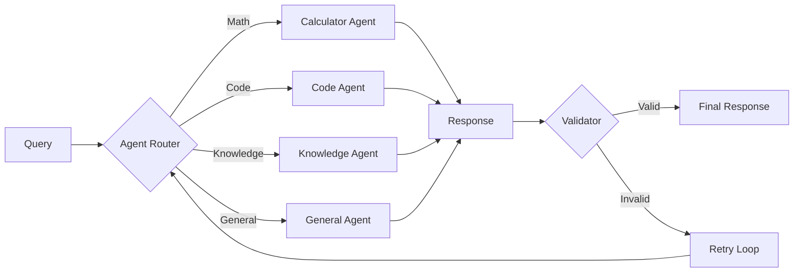
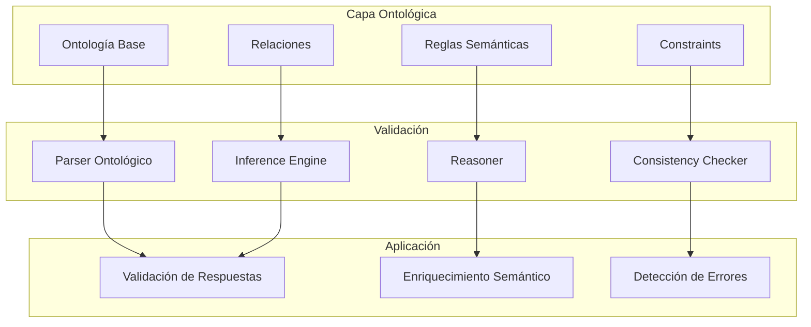
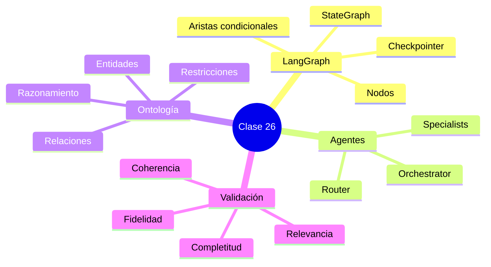

# Clase 26: Proyecto Cerebro Cognitivo - Parte 3

## Orquestación de Agentes, Reglas Ontológicas y Validación de Respuestas

---

## Duración: 4 horas

---

## Objetivos de Aprendizaje

Al finalizar esta clase, el estudiante será capaz de:

1. **Diseñar arquitecturas de agentes** utilizando LangGraph para orquestación complejas
2. **Implementar reglas ontológicas** para validación semántica y razonamiento
3. **Crear sistemas de validación** que evalúen la calidad de las respuestas generadas
4. **Integrar múltiples componentes** en un flujo de procesamiento cognitivo
5. **Implementar bucles de feedback** para mejora continua del sistema
6. **Manejar errores y edge cases** de manera elegante

---

## 1. Orquestación de Agentes con LangGraph

### 1.1 Introducción a LangGraph

LangGraph es una biblioteca que permite crear grafos de estados para orquestar agentes LLM. A diferencia de las cadenas simples de LangChain, LangGraph proporciona:

- **Control de flujo explícito**: Define exactamente cómo fluyen los datos entre nodos
- **Ciclos**: Permite bucles (para reflexión, iteración, etc.)
- **Persistencia**: Guarda el estado entre ejecuciones
- **Debugging**: Visualización del flujo de ejecución



### 1.2 Implementación del Grafo de Estados

```python
# agents/state.py
from typing import TypedDict, Annotated, Sequence, Literal, Union
from langgraph.graph import StateGraph, END
from pydantic import BaseModel, Field
from datetime import datetime
from enum import Enum

class TaskType(str, Enum):
    """Tipos de tareas que el sistema puede manejar."""
    QUESTION_ANSWERING = "question_answering"
    CODE_GENERATION = "code_generation"
    SUMMARIZATION = "summarization"
    ANALYSIS = "analysis"
    RESEARCH = "research"
    UNKNOWN = "unknown"

class AgentStatus(str, Enum):
    """Estados de un agente."""
    IDLE = "idle"
    PROCESSING = "processing"
    COMPLETED = "completed"
    FAILED = "failed"
    WAITING = "waiting"

class RetrievalStrategy(str, Enum):
    """Estrategias de recuperación."""
    SEMANTIC = "semantic"
    KEYWORD = "keyword"
    HYBRID = "hybrid"
    GRAPH_ONLY = "graph_only"
    VECTOR_ONLY = "vector_only"

class CognitiveState(TypedDict):
    """
    Estado principal del sistema cognitivo.
    
    Este estado fluye a través del grafo y es modificado por cada nodo.
    """
    # Información de entrada
    user_query: str
    session_id: str
    timestamp: str
    
    # Clasificación y routing
    task_type: TaskType
    selected_strategy: RetrievalStrategy
    
    # Recuperación
    retrieved_documents: list
    retrieved_graph_context: list
    fusion_method: str
    
    # Generación
    draft_response: str
    revision_count: int
    max_revisions: int
    
    # Validación
    is_valid: bool
    validation_errors: list
    validation_feedback: str
    
    # Resultado final
    final_response: str
    sources: list
    metadata: dict
    
    # Control de flujo
    current_agent: str
    status: AgentStatus
    error_message: str

class StateBuilder:
    """Builder para crear estados iniciales."""
    
    @staticmethod
    def create_initial_state(
        user_query: str,
        session_id: str = None
    ) -> CognitiveState:
        """
        Crea un estado inicial para procesamiento.
        
        Args:
            user_query: Consulta del usuario
            session_id: ID de sesión (generado si no se proporciona)
        
        Returns:
            CognitiveState inicializado
        """
        import uuid
        
        return CognitiveState(
            user_query=user_query,
            session_id=session_id or str(uuid.uuid4()),
            timestamp=datetime.now().isoformat(),
            task_type=TaskType.UNKNOWN,
            selected_strategy=RetrievalStrategy.HYBRID,
            retrieved_documents=[],
            retrieved_graph_context=[],
            fusion_method="rrf",
            draft_response="",
            revision_count=0,
            max_revisions=3,
            is_valid=False,
            validation_errors=[],
            validation_feedback="",
            final_response="",
            sources=[],
            metadata={},
            current_agent="none",
            status=AgentStatus.IDLE,
            error_message=""
        )
    
    @staticmethod
    def add_metadata(
        state: CognitiveState,
        key: str,
        value: any
    ) -> CognitiveState:
        """Agrega metadata al estado."""
        state["metadata"][key] = value
        return state
```

### 1.3 Definición de Nodos del Grafo

```python
# agents/nodes.py
from typing import Dict, Any, List, Callable
from langchain_core.messages import HumanMessage, AIMessage, SystemMessage
from langchain.prompts import ChatPromptTemplate
from langchain.output_parsers import JsonOutputParser
import json
import re

class AgentNodes:
    """
    Colección de nodos para el grafo de agentes.
    Cada nodo es una función que recibe el estado y retorna actualizaciones.
    """
    
    def __init__(
        self,
        llm,
        vector_retriever,
        graph_retriever,
        hybrid_retriever,
        validator,
        config: Dict[str, Any]
    ):
        self.llm = llm
        self.vector_retriever = vector_retriever
        self.graph_retriever = graph_retriever
        self.hybrid_retriever = hybrid_retriever
        self.validator = validator
        self.config = config
        
        # Inicializar prompts
        self._setup_prompts()
    
    def _setup_prompts(self):
        """Configura los prompts del sistema."""
        
        self.router_prompt = ChatPromptTemplate.from_messages([
            ("system", """Eres un clasificador de tareas para un sistema RAG cognitivo.
            Analiza la consulta del usuario y clasifícala en una de las siguientes categorías:
            
            - question_answering: Para preguntas factuales o explicativas
            - code_generation: Para solicitudes de código o programación
            - summarization: Para resumir documentos o textos
            - analysis: Para análisis profundo o comparaciones
            - research: Para investigación que requiere múltiples fuentes
            - unknown: Si no estás seguro
            
            Devuelve solo el nombre de la categoría."""),
            ("human", "{query}")
        ])
        
        self.strategy_prompt = ChatPromptTemplate.from_messages([
            ("system", """Eres un selector de estrategias de recuperación.
            Basándote en el tipo de tarea, selecciona la mejor estrategia:
            
            - semantic: Búsqueda semántica pura (bueno para conceptos abstractos)
            - keyword: Búsqueda por palabras clave (bueno para términos específicos)
            - hybrid: Combina ambas (recomendado para la mayoría)
            - graph_only: Solo grafo de conocimiento
            - vector_only: Solo búsqueda vectorial
            
            Devuelve solo el nombre de la estrategia."""),
            ("human", "Tarea: {task_type}\nConsulta: {query}")
        ])
        
        self.revisor_prompt = ChatPromptTemplate.from_messages([
            ("system", """Eres un revisor de respuestas.
            Revisa la respuesta generada y proporciona retroalimentación.
            
            Evalúa:
            1. ¿Responde la pregunta?
            2. ¿Es precisa?
            3. ¿Está completa?
            4. ¿Es coherente?
            
            Si la respuesta es satisfactoria, responde "APPROVED".
            Si necesita cambios, proporciona retroalimentación específica."""),
            ("human", """Pregunta: {query}
            Respuesta: {response}
            
            Revisión:""")
        ])
    
    def classify_task(self, state: CognitiveState) -> CognitiveState:
        """
        Nodo: Clasifica el tipo de tarea.
        
        Args:
            state: Estado actual
        
        Returns:
            Estado actualizado con task_type
        """
        query = state["user_query"]
        
        try:
            chain = self.router_prompt | self.llm
            result = chain.invoke({"query": query})
            
            task_type_str = result.content.strip().lower()
            
            # Mapear a enum
            task_mapping = {
                "question_answering": "QUESTION_ANSWERING",
                "code_generation": "CODE_GENERATION",
                "summarization": "SUMMARIZATION",
                "analysis": "ANALYSIS",
                "research": "RESEARCH"
            }
            
            task_type = task_mapping.get(
                task_type_str, 
                "UNKNOWN"
            )
            
            state["task_type"] = task_type
            state["metadata"]["classification_confidence"] = 0.8
            
        except Exception as e:
            state["task_type"] = "UNKNOWN"
            state["error_message"] = str(e)
        
        return state
    
    def select_strategy(self, state: CognitiveState) -> CognitiveState:
        """
        Nodo: Selecciona la estrategia de recuperación.
        
        Args:
            state: Estado actual
        
        Returns:
            Estado actualizado con selected_strategy
        """
        try:
            chain = self.strategy_prompt | self.llm
            result = chain.invoke({
                "task_type": state["task_type"],
                "query": state["user_query"]
            })
            
            strategy_str = result.content.strip().upper()
            
            state["selected_strategy"] = strategy_str
            
        except Exception as e:
            state["selected_strategy"] = "HYBRID"
            state["error_message"] += f" | Strategy error: {e}"
        
        return state
    
    def retrieve_documents(self, state: CognitiveState) -> CognitiveState:
        """
        Nodo: Recupera documentos relevantes.
        
        Args:
            state: Estado actual
        
        Returns:
            Estado actualizado con retrieved_documents
        """
        strategy = state["selected_strategy"]
        query = state["user_query"]
        
        try:
            if strategy == "VECTOR_ONLY":
                docs = self.vector_retriever.retrieve(query, k=10)
                state["retrieved_documents"] = docs
            
            elif strategy == "GRAPH_ONLY":
                graph_context = self.graph_retriever.retrieve(query)
                state["retrieved_graph_context"] = graph_context
            
            elif strategy == "HYBRID":
                results = self.hybrid_retriever.retrieve(query, top_k=10)
                state["retrieved_documents"] = [r.document for r in results]
                state["metadata"]["fusion_scores"] = {
                    r.document.page_content[:50]: r.combined_score 
                    for r in results
                }
            
            else:  # SEMANTIC or KEYWORD
                docs = self.vector_retriever.retrieve(query, k=10)
                state["retrieved_documents"] = docs
            
            state["status"] = "PROCESSING"
            
        except Exception as e:
            state["error_message"] += f" | Retrieval error: {e}"
            state["retrieved_documents"] = []
        
        return state
    
    def generate_draft(self, state: CognitiveState) -> CognitiveState:
        """
        Nodo: Genera un borrador de respuesta.
        
        Args:
            state: Estado actual
        
        Returns:
            Estado actualizado con draft_response
        """
        query = state["user_query"]
        docs = state.get("retrieved_documents", [])
        graph_context = state.get("retrieved_graph_context", [])
        
        # Construir contexto
        context_parts = []
        
        if docs:
            context_parts.append("=== DOCUMENTOS RELEVANTES ===")
            for i, doc in enumerate(docs[:5], 1):
                context_parts.append(f"\n[{i}] {doc.page_content}")
        
        if graph_context:
            context_parts.append("\n\n=== CONTEXTO DEL GRAFO ===")
            for ctx in graph_context[:3]:
                context_parts.append(f"\n• {ctx}")
        
        context = "\n".join(context_parts)
        
        # Generar respuesta
        prompt = f"""Basándote en el siguiente contexto, responde la pregunta de manera precisa y completa.

CONTEXTO:
{context}

PREGUNTA: {query}

RESPUESTA:"""
        
        try:
            response = self.llm.invoke(prompt)
            state["draft_response"] = response.content
            state["revision_count"] = 0
            
        except Exception as e:
            state["draft_response"] = ""
            state["error_message"] += f" | Generation error: {e}"
        
        return state
    
    def validate_response(self, state: CognitiveState) -> CognitiveState:
        """
        Nodo: Valida la respuesta generada.
        
        Args:
            state: Estado actual
        
        Returns:
            Estado actualizado con is_valid y validation_feedback
        """
        validation_result = self.validator.validate(
            query=state["user_query"],
            response=state["draft_response"],
            context=[doc.page_content for doc in state.get("retrieved_documents", [])]
        )
        
        state["is_valid"] = validation_result["is_valid"]
        state["validation_errors"] = validation_result.get("errors", [])
        state["validation_feedback"] = validation_result.get("feedback", "")
        
        return state
    
    def revise_response(self, state: CognitiveState) -> CognitiveState:
        """
        Nodo: Revisa y mejora la respuesta.
        
        Args:
            state: Estado actual
        
        Returns:
            Estado actualizado con draft_response revisado
        """
        query = state["user_query"]
        current_response = state["draft_response"]
        feedback = state["validation_feedback"]
        revision_count = state["revision_count"]
        
        prompt = f"""Eres un revisor de respuestas. La respuesta actual tiene problemas:

RESPUESTA ACTUAL:
{current_response}

FEEDBACK:
{feedback}

Por favor, genera una versión mejorada que corrija estos problemas.

NUEVA RESPUESTA:"""
        
        try:
            revised = self.llm.invoke(prompt)
            state["draft_response"] = revised.content
            state["revision_count"] = revision_count + 1
            
        except Exception as e:
            state["error_message"] += f" | Revision error: {e}"
        
        return state
    
    def finalize_response(self, state: CognitiveState) -> CognitiveState:
        """
        Nodo: Finaliza la respuesta y prepara el resultado.
        
        Args:
            state: Estado actual
        
        Returns:
            Estado actualizado con final_response
        """
        state["final_response"] = state["draft_response"]
        state["sources"] = [
            {
                "content": doc.page_content[:200],
                "metadata": doc.metadata
            }
            for doc in state.get("retrieved_documents", [])[:5]
        ]
        state["status"] = "COMPLETED"
        
        return state
    
    def handle_error(self, state: CognitiveState) -> CognitiveState:
        """
        Nodo: Maneja errores del sistema.
        
        Args:
            state: Estado actual
        
        Returns:
            Estado actualizado con mensaje de error
        """
        state["status"] = "FAILED"
        state["final_response"] = (
            "Lo siento, occurred un error al procesar tu solicitud. "
            f"Detalles: {state.get('error_message', 'Error desconocido')}"
        )
        
        return state
```

### 1.4 Definición de Aristas y Flujo

```python
# agents/graph.py
from typing import Literal
from langgraph.graph import StateGraph, END, START
from langgraph.checkpoint.memory import MemorySaver
from .state import CognitiveState, StateBuilder
from .nodes import AgentNodes

class CognitiveAgentGraph:
    """
    Grafo de agentes cognitivos utilizando LangGraph.
    
    Este grafo orquesta múltiples agentes y herramientas para
    procesar consultas de manera inteligente.
    """
    
    def __init__(
        self,
        llm,
        vector_retriever,
        graph_retriever,
        hybrid_retriever,
        validator,
        config: dict
    ):
        self.nodes = AgentNodes(
            llm=llm,
            vector_retriever=vector_retriever,
            graph_retriever=graph_retriever,
            hybrid_retriever=hybrid_retriever,
            validator=validator,
            config=config
        )
        
        self.graph = self._build_graph()
        self.checkpointer = MemorySaver()
    
    def _build_graph(self) -> StateGraph:
        """Construye el grafo de estados."""
        
        workflow = StateGraph(CognitiveState)
        
        # Agregar nodos
        workflow.add_node("classify_task", self.nodes.classify_task)
        workflow.add_node("select_strategy", self.nodes.select_strategy)
        workflow.add_node("retrieve", self.nodes.retrieve_documents)
        workflow.add_node("generate", self.nodes.generate_draft)
        workflow.add_node("validate", self.nodes.validate_response)
        workflow.add_node("revise", self.nodes.revise_response)
        workflow.add_node("finalize", self.nodes.finalize_response)
        workflow.add_node("handle_error", self.nodes.handle_error)
        
        # Definir flujo
        workflow.set_entry_point("classify_task")
        
        # Clasificación → Estrategia
        workflow.add_edge("classify_task", "select_strategy")
        workflow.add_edge("select_strategy", "retrieve")
        workflow.add_edge("retrieve", "generate")
        workflow.add_edge("generate", "validate")
        
        # Validación → Ruta
        workflow.add_conditional_edges(
            "validate",
            self._should_revise,
            {
                "revise": "revise",
                "finalize": "finalize"
            }
        )
        
        # Revisión → Nueva validación (ciclo)
        workflow.add_edge("revise", "validate")
        
        # Finalización
        workflow.add_edge("finalize", END)
        
        # Manejo de errores
        workflow.add_edge("handle_error", END)
        
        return workflow.compile(
            checkpointer=MemorySaver(),
            interrupt_before=["retrieve", "generate", "validate"]
        )
    
    def _should_revise(self, state: CognitiveState) -> Literal["revise", "finalize"]:
        """
        Función de enrutamiento después de validación.
        
        Decide si la respuesta necesita revisión o puede finalizarse.
        """
        # Revisar si no es válida y no hemos excedido el máximo de revisiones
        if not state["is_valid"] and state["revision_count"] < state["max_revisions"]:
            return "revise"
        
        return "finalize"
    
    def _should_handle_error(self, state: CognitiveState) -> bool:
        """Determina si hubo un error que necesita manejo."""
        return bool(state.get("error_message"))
    
    def invoke(self, query: str, session_id: str = None) -> CognitiveState:
        """
        Procesa una consulta a través del grafo.
        
        Args:
            query: Consulta del usuario
            session_id: ID de sesión opcional
        
        Returns:
            Estado final con la respuesta
        """
        initial_state = StateBuilder.create_initial_state(
            user_query=query,
            session_id=session_id
        )
        
        result = self.graph.invoke(initial_state)
        
        return result
    
    async def ainvoke(self, query: str, session_id: str = None) -> CognitiveState:
        """Versión asíncrona de invoke."""
        initial_state = StateBuilder.create_initial_state(
            user_query=query,
            session_id=session_id
        )
        
        result = await self.graph.ainvoke(initial_state)
        
        return result
    
    def get_config(self, thread_id: str):
        """Obtiene configuración para una sesión."""
        return {"configurable": {"thread_id": thread_id}}
    
    def visualize(self) -> str:
        """Retorna una representación ASCII del grafo."""
        return """
┌─────────────────────────────────────────────────────────────┐
│                    Cognitive Agent Graph                     │
├─────────────────────────────────────────────────────────────┤
│                                                              │
│   START ──► [classify_task] ──► [select_strategy]           │
│                                  │                           │
│                                  ▼                           │
│                            [retrieve] ──► [generate]         │
│                                               │               │
│                                               ▼               │
│                                          [validate]          │
│                                        /          \\          │
│                                       ▼            ▼         │
│                                   [revise]    [finalize]     │
│                                       │            │         │
│                                       ▼            │         │
│                                   [validate]◄─────┘          │
│                                        │                      │
│                                        ▼                      │
│                                     [END]                    │
│                                                              │
│   Error path: Any node ──► [handle_error] ──► [END]         │
│                                                              │
└─────────────────────────────────────────────────────────────┘
        """


class SubAgent:
    """
    Agente individual que puede ser usado dentro del grafo principal.
    Cada subagente maneja un tipo específico de tarea.
    """
    
    def __init__(self, name: str, llm, tools: list = None):
        self.name = name
        self.llm = llm
        self.tools = tools or []
    
    def run(self, input_data: dict) -> dict:
        """Ejecuta el agente con datos de entrada."""
        raise NotImplementedError
    
    def get_system_prompt(self) -> str:
        """Retorna el prompt del sistema para este agente."""
        return f"Eres un agente llamado {self.name}."


class CodeGenerationAgent(SubAgent):
    """Agente especializado en generación de código."""
    
    def __init__(self, llm):
        super().__init__("CodeGenerator", llm)
        self.system_prompt = """Eres un experto programador. Genera código limpio,
        bien documentado y siguiendo las mejores prácticas. Incluye comentarios
        explicativos cuando sea necesario."""
    
    def run(self, input_data: dict) -> dict:
        query = input_data.get("query", "")
        language = input_data.get("language", "python")
        
        prompt = f"""{self.system_prompt}

Lenguaje solicitado: {language}

Solicitud: {query}

Código:"""
        
        response = self.llm.invoke(prompt)
        
        return {
            "code": response.content,
            "language": language,
            "agent": self.name
        }


class ResearchAgent(SubAgent):
    """Agente especializado en investigación."""
    
    def __init__(self, llm, retriever):
        super().__init__("Researcher", llm)
        self.retriever = retriever
        self.system_prompt = """Eres un investigador experto. Tu tarea es analizar
        múltiples fuentes, extraer información relevante y presentar un análisis
        completo y balanceado."""
    
    def run(self, input_data: dict) -> dict:
        query = input_data.get("query", "")
        num_sources = input_data.get("num_sources", 10)
        
        docs = self.retriever.retrieve(query, k=num_sources)
        
        synthesis_prompt = f"""{self.system_prompt}

Consulta de investigación: {query}

Fuentes:
{chr(10).join([f"[{i+1}] {doc.page_content}" for i, doc in enumerate(docs)])}

Análisis:"""
        
        response = self.llm.invoke(synthesis_prompt)
        
        return {
            "analysis": response.content,
            "sources_used": len(docs),
            "agent": self.name
        }
```

---

## 2. Reglas Ontológicas

### 2.1 Framework de Validación Ontológica



```python
# ontology/rules.py
from typing import Dict, List, Any, Optional, Set, Tuple
from dataclasses import dataclass, field
from enum import Enum
from pydantic import BaseModel, Field, validator
import re
from datetime import datetime

class EntityType(str, Enum):
    """Tipos de entidades en la ontología."""
    CONCEPT = "Concept"
    PERSON = "Person"
    ORGANIZATION = "Organization"
    LOCATION = "Location"
    EVENT = "Event"
    PRODUCT = "Product"
    TECHNOLOGY = "Technology"
    PROCESS = "Process"

class RelationshipType(str, Enum):
    """Tipos de relaciones ontológicas."""
    IS_A = "is_a"
    PART_OF = "part_of"
    WORKS_FOR = "works_for"
    LOCATED_IN = "located_in"
    USES = "uses"
    CREATES = "creates"
    RELATED_TO = "related_to"
    CAUSES = "causes"
    BEFORE = "before"
    AFTER = "after"

class ConstraintType(str, Enum):
    """Tipos de restricciones."""
    REQUIRED = "required"
    OPTIONAL = "optional"
    CARDINALITY_MIN = "cardinality_min"
    CARDINALITY_MAX = "cardinality_max"
    RANGE = "range"
    PATTERN = "pattern"
    CUSTOM = "custom"

@dataclass
class OntologyEntity:
    """Representa una entidad en la ontología."""
    id: str
    type: EntityType
    name: str
    description: str = ""
    properties: Dict[str, Any] = field(default_factory=dict)
    parent_id: Optional[str] = None
    synonyms: List[str] = field(default_factory=list)
    
    def get_all_parents(self) -> List[str]:
        """Obtiene todos los ancestros en la jerarquía."""
        parents = []
        current = self.parent_id
        while current:
            parents.append(current)
            current = None  # En implementación real, buscar en ontología
        return parents
    
    def is_a(self, ancestor_type: EntityType) -> bool:
        """Verifica si la entidad es un tipo específico."""
        if self.type == ancestor_type:
            return True
        return ancestor_type.value in self.get_all_parents()

@dataclass
class OntologyRelationship:
    """Representa una relación entre entidades."""
    source_id: str
    target_id: str
    type: RelationshipType
    properties: Dict[str, Any] = field(default_factory=dict)
    confidence: float = 1.0

@dataclass
class Constraint:
    """Restricción sobre entidades o relaciones."""
    id: str
    type: ConstraintType
    target_entity: str
    target_property: Optional[str] = None
    value: Any = None
    error_message: str = ""

@dataclass
class ValidationResult:
    """Resultado de una validación."""
    is_valid: bool
    errors: List[str] = field(default_factory=list)
    warnings: List[str] = field(default_factory=list)
    inferred_facts: List[Dict[str, Any]] = field(default_factory=list)
    confidence: float = 1.0

class OntologyValidator:
    """
    Validador ontológico para verificar consistencia
    y adherencia a reglas semánticas.
    """
    
    def __init__(self, ontology: 'KnowledgeOntology'):
        self.ontology = ontology
        self.rules = []
        self._load_default_rules()
    
    def _load_default_rules(self):
        """Carga reglas ontológicas por defecto."""
        
        # Regla 1: Entidades de tipo Persona deben tener propiedad 'nombre'
        self.add_rule(
            name="person_must_have_name",
            condition=lambda e: e.type == EntityType.PERSON,
            check=lambda e: 'nombre' in e.properties or 'name' in e.properties,
            error="Personas deben tener un nombre definido"
        )
        
        # Regla 2: Relaciones is_a deben ser transitivas
        self.add_rule(
            name="is_a_transitivity",
            condition=lambda r: r.type == RelationshipType.IS_A,
            check=self._check_is_a_transitivity,
            error="Relación is_a debe ser transitiva"
        )
        
        # Regla 3: Organizations no pueden ser parte de Persons
        self.add_rule(
            name="org_not_part_of_person",
            condition=lambda r: r.type == RelationshipType.PART_OF,
            check=lambda r: not (
                r.source_type == EntityType.ORGANIZATION and
                r.target_type == EntityType.PERSON
            ),
            error="Organizaciones no pueden ser parte de personas"
        )
    
    def add_rule(
        self,
        name: str,
        condition: callable,
        check: callable,
        error: str
    ):
        """Agrega una regla de validación."""
        self.rules.append({
            "name": name,
            "condition": condition,
            "check": check,
            "error": error
        })
    
    def validate_entity(self, entity: OntologyEntity) -> ValidationResult:
        """Valida una entidad contra las reglas ontológicas."""
        errors = []
        warnings = []
        
        # Verificar reglas
        for rule in self.rules:
            if rule["condition"](entity):
                if not rule["check"](entity):
                    errors.append(f"[{rule['name']}] {rule['error']}")
        
        # Verificar cardinalidades
        for constraint in self.ontology.get_constraints_for(entity.type):
            if not self._check_constraint(entity, constraint):
                errors.append(constraint.error_message)
        
        return ValidationResult(
            is_valid=len(errors) == 0,
            errors=errors,
            warnings=warnings,
            confidence=1.0 if len(errors) == 0 else 0.5
        )
    
    def validate_relationship(
        self, 
        relationship: OntologyRelationship
    ) -> ValidationResult:
        """Valida una relación."""
        errors = []
        warnings = []
        
        # Verificar que ambas entidades existen
        source = self.ontology.get_entity(relationship.source_id)
        target = self.ontology.get_entity(relationship.target_id)
        
        if not source:
            errors.append(f"Entidad fuente {relationship.source_id} no existe")
        if not target:
            errors.append(f"Entidad destino {relationship.target_id} no existe")
        
        # Verificar tipos válidos para la relación
        valid_types = self.ontology.get_valid_target_types(relationship.type)
        if source and target.type not in valid_types:
            errors.append(
                f"Tipo {target.type} no es válido para relación {relationship.type}"
            )
        
        # Aplicar reglas
        for rule in self.rules:
            if rule["condition"](relationship):
                if not rule["check"](relationship):
                    errors.append(f"[{rule['name']}] {rule['error']}")
        
        return ValidationResult(
            is_valid=len(errors) == 0,
            errors=errors,
            warnings=warnings,
            confidence=relationship.confidence
        )
    
    def _check_is_a_transitivity(self, relationship) -> bool:
        """Verifica transitividad de is_a."""
        # Implementación simplificada
        return True
    
    def _check_constraint(
        self, 
        entity: OntologyEntity, 
        constraint: Constraint
    ) -> bool:
        """Verifica una restricción específica."""
        if constraint.type == ConstraintType.REQUIRED:
            return constraint.target_property in entity.properties
        elif constraint.type == ConstraintType.PATTERN:
            pattern = constraint.value
            prop_value = entity.properties.get(constraint.target_property, "")
            return bool(re.match(pattern, str(prop_value)))
        return True


class KnowledgeOntology:
    """
    Ontología de conocimiento que define conceptos,
    relaciones y reglas.
    """
    
    def __init__(self):
        self.entities: Dict[str, OntologyEntity] = {}
        self.relationships: List[OntologyRelationship] = []
        self.constraints: Dict[EntityType, List[Constraint]] = {}
        self.hierarchy: Dict[str, List[str]] = {}
        
        self._build_base_ontology()
    
    def _build_base_ontology(self):
        """Construye la ontología base."""
        
        # Agregar jerarquía de tipos
        self.hierarchy["Technology"] = ["AI", "ML", "DL", "NLP"]
        self.hierarchy["AI"] = ["MachineLearning", "ExpertSystems", "Robotics"]
        self.hierarchy["MachineLearning"] = [
            "SupervisedLearning", 
            "UnsupervisedLearning",
            "ReinforcementLearning"
        ]
        
        # Agregar restricciones por defecto
        self.constraints[EntityType.PERSON] = [
            Constraint(
                id="person_name",
                type=ConstraintType.REQUIRED,
                target_entity="Person",
                target_property="nombre",
                error_message="Personas requieren propiedad 'nombre'"
            ),
            Constraint(
                id="person_email_format",
                type=ConstraintType.PATTERN,
                target_entity="Person",
                target_property="email",
                value=r"^[a-zA-Z0-9._%+-]+@[a-zA-Z0-9.-]+\.[a-zA-Z]{2,}$",
                error_message="Email debe tener formato válido"
            )
        ]
        
        self.constraints[EntityType.ORGANIZATION] = [
            Constraint(
                id="org_name",
                type=ConstraintType.REQUIRED,
                target_entity="Organization",
                target_property="nombre",
                error_message="Organizaciones requieren propiedad 'nombre'"
            )
        ]
    
    def add_entity(self, entity: OntologyEntity):
        """Agrega una entidad a la ontología."""
        self.entities[entity.id] = entity
    
    def get_entity(self, entity_id: str) -> Optional[OntologyEntity]:
        """Obtiene una entidad por ID."""
        return self.entities.get(entity_id)
    
    def add_relationship(self, relationship: OntologyRelationship):
        """Agrega una relación."""
        self.relationships.append(relationship)
    
    def get_constraints_for(self, entity_type: EntityType) -> List[Constraint]:
        """Obtiene restricciones para un tipo de entidad."""
        return self.constraints.get(entity_type, [])
    
    def get_valid_target_types(
        self, 
        relationship_type: RelationshipType
    ) -> List[EntityType]:
        """Obtiene tipos válidos para el destino de una relación."""
        mapping = {
            RelationshipType.IS_A: list(EntityType),
            RelationshipType.WORKS_FOR: [EntityType.PERSON, EntityType.ORGANIZATION],
            RelationshipType.LOCATED_IN: [EntityType.PERSON, EntityType.ORGANIZATION, EntityType.LOCATION],
            RelationshipType.USES: list(EntityType),
            RelationshipType.CREATES: [EntityType.PERSON, EntityType.ORGANIZATION, EntityType.TECHNOLOGY],
            RelationshipType.PART_OF: list(EntityType),
            RelationshipType.RELATED_TO: list(EntityType),
            RelationshipType.CAUSES: list(EntityType)
        }
        return mapping.get(relationship_type, [])
    
    def infer_relations(self, entity_id: str) -> List[Dict[str, Any]]:
        """
        Infiere relaciones basadas en la ontología.
        Implementa razonamiento ontológico básico.
        """
        inferred = []
        entity = self.get_entity(entity_id)
        
        if not entity:
            return inferred
        
        # Inferir jerarquía
        if entity.parent_id:
            parent = self.get_entity(entity.parent_id)
            if parent:
                inferred.append({
                    "source": entity_id,
                    "target": parent.id,
                    "type": "inferred_is_a",
                    "confidence": 1.0
                })
        
        # Inferir relaciones transitivas
        for rel in self.relationships:
            if rel.source_id == entity_id and rel.type == RelationshipType.PART_OF:
                # Buscar transitive closure
                transitive = self._find_transitive_parts(rel.target_id)
                for target in transitive:
                    inferred.append({
                        "source": entity_id,
                        "target": target,
                        "type": "inferred_part_of",
                        "confidence": 0.8
                    })
        
        return inferred
    
    def _find_transitive_parts(self, entity_id: str) -> List[str]:
        """Encuentra todas las partes transitivas."""
        parts = []
        for rel in self.relationships:
            if rel.source_id == entity_id and rel.type == RelationshipType.PART_OF:
                parts.append(rel.target_id)
                parts.extend(self._find_transitive_parts(rel.target_id))
        return list(set(parts))
```

### 2.2 Validador Semántico de Respuestas

```python
# ontology/response_validator.py
from typing import Dict, List, Any, Optional
from dataclasses import dataclass
from langchain.prompts import ChatPromptTemplate
from langchain.output_parsers import PydanticOutputParser
from pydantic import BaseModel, Field
from enum import Enum

class ValidationCategory(str, Enum):
    """Categorías de validación."""
    FAITHFULNESS = "faithfulness"
    RELEVANCE = "relevance"
    COMPLETENESS = "completeness"
    COHERENCE = "coherence"
    ACCURACY = "accuracy"

@dataclass
class ValidationScore:
    """Puntuación de validación."""
    category: ValidationCategory
    score: float  # 0-1
    explanation: str
    issues: List[str]

@dataclass
class FullValidationResult:
    """Resultado completo de validación."""
    is_valid: bool
    overall_score: float
    category_scores: List[ValidationScore]
    feedback: str
    suggested_improvements: List[str]

class ResponseValidator:
    """
    Validador completo de respuestas generadas.
    Evalúa múltiples dimensiones de calidad.
    """
    
    def __init__(
        self,
        llm,
        ontology: KnowledgeOntology = None,
        config: Dict[str, Any] = None
    ):
        self.llm = llm
        self.ontology = ontology
        self.config = config or {}
        
        self._setup_prompts()
    
    def _setup_prompts(self):
        """Configura los prompts de validación."""
        
        self.faithfulness_prompt = ChatPromptTemplate.from_messages([
            ("system", """Eres un evaluador de fidelidad de respuestas.
            Verifica si la respuesta se mantiene fiel al contexto proporcionado.
            
            Criterios:
            - ¿La respuesta no inventa información?
            - ¿Las afirmaciones están respaldadas por el contexto?
            - ¿No hay alucinaciones?
            
            Responde en formato JSON."""),
            ("human", """Contexto:
{context}

Respuesta:
{response}

Evaluación JSON:""")
        ])
        
        self.relevance_prompt = ChatPromptTemplate.from_messages([
            ("system", """Eres un evaluador de relevancia.
            Verifica si la respuesta es relevante para la pregunta.
            
            Criterios:
            - ¿Responde lo que se preguntó?
            - ¿Es pertinent al tema?
            - ¿No divaga en temas no relacionados?
            
            Responde en formato JSON."""),
            ("human", """Pregunta:
{query}

Respuesta:
{response}

Evaluación JSON:""")
        ])
        
        self.completeness_prompt = ChatPromptTemplate.from_messages([
            ("system", """Eres un evaluador de completitud.
            Verifica si la respuesta cubre todos los aspectos de la pregunta.
            
            Criterios:
            - ¿Responde todos los puntos de la pregunta?
            - ¿Hay información importante faltante?
            - ¿La respuesta es suficientemente detallada?
            
            Responde en formato JSON."""),
            ("human", """Pregunta:
{query}

Respuesta:
{response}

Evaluación JSON:""")
        ])
    
    def validate(
        self,
        query: str,
        response: str,
        context: List[str],
        threshold: float = 0.7
    ) -> Dict[str, Any]:
        """
        Valida una respuesta completa.
        
        Args:
            query: Pregunta original
            response: Respuesta generada
            context: Documentos de contexto usados
            threshold: Umbral mínimo de aceptación
        
        Returns:
            Diccionario con resultado de validación
        """
        full_context = "\n\n".join(context)
        
        # Ejecutar validaciones en paralelo
        faithfulness = self._check_faithfulness(full_context, response)
        relevance = self._check_relevance(query, response)
        completeness = self._check_completeness(query, response)
        
        # Calcular score general
        scores = [faithfulness, relevance, completeness]
        overall = sum(s["score"] for s in scores) / len(scores)
        
        # Decidir si es válida
        is_valid = overall >= threshold
        
        # Generar feedback
        feedback = self._generate_feedback(scores, overall)
        
        return {
            "is_valid": is_valid,
            "overall_score": overall,
            "faithfulness": faithfulness,
            "relevance": relevance,
            "completeness": completeness,
            "feedback": feedback,
            "threshold_used": threshold
        }
    
    def _check_faithfulness(
        self, 
        context: str, 
        response: str
    ) -> Dict[str, Any]:
        """Verifica fidelidad al contexto."""
        
        # Análisis heurístico básico
        context_lower = context.lower()
        response_lower = response.lower()
        
        # Buscar menciones del contexto en la respuesta
        context_sentences = [s.strip() for s in context.split('.') if len(s.strip()) > 20]
        matched_sentences = sum(
            1 for s in context_sentences 
            if any(word in response_lower for word in s.lower().split()[:5])
        )
        
        match_ratio = matched_sentences / len(context_sentences) if context_sentences else 0
        
        # Verificar patrones de alucinación
        hallucination_indicators = [
            "no tengo información",
            "no puedo verificar",
            "podría ser que",
            "es posible que",
            "no estoy seguro"
        ]
        
        uncertainty_count = sum(
            1 for indicator in hallucination_indicators 
            if indicator in response_lower
        )
        
        # Calcular score
        base_score = min(match_ratio + 0.3, 1.0)
        penalty = min(uncertainty_count * 0.1, 0.3)
        score = max(base_score - penalty, 0)
        
        issues = []
        if match_ratio < 0.3:
            issues.append("Respuesta no parece estar respaldada por el contexto")
        if uncertainty_count > 3:
            issues.append("Respuesta contiene muchas expresiones de incertidumbre")
        
        return {
            "category": "faithfulness",
            "score": round(score, 2),
            "explanation": f"Coincidencia con contexto: {match_ratio:.0%}",
            "issues": issues
        }
    
    def _check_relevance(
        self, 
        query: str, 
        response: str
    ) -> Dict[str, Any]:
        """Verifica relevancia a la pregunta."""
        
        query_words = set(query.lower().split())
        response_words = set(response.lower().split())
        
        # Palabras clave de la query en la respuesta
        important_words = {w for w in query_words if len(w) > 4}
        matched_words = important_words & response_words
        
        match_ratio = len(matched_words) / len(important_words) if important_words else 0
        
        score = min(match_ratio + 0.4, 1.0)
        
        issues = []
        if match_ratio < 0.3:
            issues.append("Respuesta no parece abordar la pregunta")
        
        return {
            "category": "relevance",
            "score": round(score, 2),
            "explanation": f"Palabras clave cubiertas: {len(matched_words)}/{len(important_words)}",
            "issues": issues
        }
    
    def _check_completeness(
        self, 
        query: str, 
        response: str
    ) -> Dict[str, Any]:
        """Verifica completitud de la respuesta."""
        
        # Detectar elementos esperados en la query
        expected_elements = {
            "por qué": "explicación",
            "cómo": "instrucciones",
            "qué es": "definición",
            "cuándo": "temporal",
            "dónde": "ubicación",
            "quién": "persona"
        }
        
        query_lower = query.lower()
        needed_elements = [
            desc for key, desc in expected_elements.items() 
            if key in query_lower
        ]
        
        # Verificar si la respuesta cubre estos elementos
        response_lower = response.lower()
        covered_elements = [
            desc for desc in needed_elements 
            if desc in response_lower or len(response) > 200
        ]
        
        coverage = len(covered_elements) / len(needed_elements) if needed_elements else 1.0
        length_score = min(len(response) / 500, 1.0)  # Ideal: 500+ caracteres
        
        score = (coverage * 0.6) + (length_score * 0.4)
        
        issues = []
        if coverage < 0.5 and needed_elements:
            issues.append(f"Faltan elementos: {[e for e in needed_elements if e not in covered_elements]}")
        if len(response) < 100:
            issues.append("Respuesta demasiado corta")
        
        return {
            "category": "completeness",
            "score": round(score, 2),
            "explanation": f"Elementos cubiertos: {len(covered_elements)}/{len(needed_elements) if needed_elements else 'N/A'}",
            "issues": issues
        }
    
    def _generate_feedback(
        self, 
        scores: List[Dict[str, Any]], 
        overall: float
    ) -> str:
        """Genera feedback textual basado en los scores."""
        
        feedback_parts = []
        
        for score_data in scores:
            if score_data["score"] < 0.7:
                feedback_parts.append(
                    f"{score_data['category'].title()}: {score_data['explanation']}"
                )
        
        if overall >= 0.9:
            return "Excelente respuesta. " + " ".join(feedback_parts)
        elif overall >= 0.7:
            return "Buena respuesta con áreas de mejora. " + " ".join(feedback_parts)
        elif overall >= 0.5:
            return "Respuesta aceptable pero necesita revisión. " + " ".join(feedback_parts)
        else:
            return "Respuesta insuficiente. " + " ".join(feedback_parts)
    
    def validate_with_llm(
        self,
        query: str,
        response: str,
        context: List[str]
    ) -> FullValidationResult:
        """
        Validación avanzada usando LLM.
        
        Útil para casos donde se requiere evaluación nuanced.
        """
        
        parser = PydanticOutputParser(pydantic_object=ValidationResult)
        
        prompt = ChatPromptTemplate.from_messages([
            ("system", """Eres un evaluador experto de respuestas de IA.
            Evalúa la respuesta en las siguientes categorías:
            
            1. FAITHFULNESS: ¿La respuesta se basa en el contexto?
            2. RELEVANCE: ¿Responde la pregunta?
            3. COMPLETENESS: ¿Cubre todos los aspectos?
            4. COHERENCE: ¿Es lógica y consistente?
            
            Para cada categoría, asigna un score 0-1 y explica."""),
            ("human", """Pregunta: {query}
            
            Contexto:
            {context}
            
            Respuesta a evaluar:
            {response}
            
            Formato de salida:
            {format_instructions}""")
        ])
        
        full_context = "\n".join(context[:5])  # Limitar contexto
        
        chain = prompt | self.llm | parser
        
        try:
            result = chain.invoke({
                "query": query,
                "context": full_context,
                "response": response,
                "format_instructions": parser.get_format_instructions()
            })
            
            return result
        except Exception as e:
            # Fallback a validación heurística
            return self.validate(query, response, context)
```

---

## 3. Actividades de Laboratorio

### 3.1 Laboratorio 1: Implementar un Grafo de Agentes

**Objetivo**: Construir un grafo de agentes con LangGraph que orqueste múltiples pasos.

```python
# lab1_solution/agent_graph.py
"""
Laboratorio 1: Implementación de Grafo de Agentes con LangGraph
"""

from typing import TypedDict, Literal
from langgraph.graph import StateGraph, END, START
from langchain_openai import ChatOpenAI
from langchain_core.messages import HumanMessage, AIMessage
import os

# Configuración
os.environ["OPENAI_API_KEY"] = "your-api-key"

# Definir estado
class AgentState(TypedDict):
    messages: list
    next_action: str
    agent_name: str
    result: str

# Nodos
def router_node(state: AgentState) -> AgentState:
    """Nodo de enrutamiento."""
    last_message = state["messages"][-1]["content"]
    
    # Simple routing basado en palabras clave
    if "código" in last_message.lower() or "programa" in last_message.lower():
        next_agent = "coder"
    elif "investigar" in last_message.lower() or "buscar" in last_message.lower():
        next_agent = "researcher"
    else:
        next_agent = "general"
    
    return {"next_action": next_agent, "agent_name": next_agent}

def coder_node(state: AgentState) -> AgentState:
    """Nodo para generación de código."""
    llm = ChatOpenAI(model="gpt-3.5-turbo")
    
    prompt = f"Genera código Python para: {state['messages'][-1]['content']}"
    response = llm.invoke(prompt)
    
    return {"result": response.content}

def researcher_node(state: AgentState) -> AgentState:
    """Nodo para investigación."""
    llm = ChatOpenAI(model="gpt-3.5-turbo")
    
    prompt = f"Investiga y proporciona información sobre: {state['messages'][-1]['content']}"
    response = llm.invoke(prompt)
    
    return {"result": response.content}

def general_node(state: AgentState) -> AgentState:
    """Nodo para consultas generales."""
    llm = ChatOpenAI(model="gpt-3.5-turbo")
    
    prompt = f"Responde a: {state['messages'][-1]['content']}"
    response = llm.invoke(prompt)
    
    return {"result": response.content}

def build_agent_graph():
    """Construye el grafo de agentes."""
    
    workflow = StateGraph(AgentState)
    
    # Agregar nodos
    workflow.add_node("router", router_node)
    workflow.add_node("coder", coder_node)
    workflow.add_node("researcher", researcher_node)
    workflow.add_node("general", general_node)
    
    # Definir flujo
    workflow.set_entry_point("router")
    
    # Routing condicional
    workflow.add_conditional_edges(
        "router",
        lambda x: x["next_action"],
        {
            "coder": "coder",
            "researcher": "researcher",
            "general": "general"
        }
    )
    
    # Todos van a END
    workflow.add_edge("coder", END)
    workflow.add_edge("researcher", END)
    workflow.add_edge("general", END)
    
    return workflow.compile()

# Uso
if __name__ == "__main__":
    graph = build_agent_graph()
    
    initial_state = {
        "messages": [{"role": "user", "content": "Escríbeme un programa para calcular factorial"}],
        "next_action": "",
        "agent_name": "",
        "result": ""
    }
    
    result = graph.invoke(initial_state)
    print("Resultado:", result)
```

### 3.2 Laboratorio 2: Sistema de Validación Ontológica

```python
# lab2_solution/ontology_validator.py
"""
Laboratorio 2: Sistema de Validación Ontológica
"""

from ontology.rules import (
    KnowledgeOntology,
    OntologyValidator,
    OntologyEntity,
    EntityType
)

def crear_ontologia_basica():
    """Crea una ontología básica de ejemplo."""
    
    ontology = KnowledgeOntology()
    
    # Agregar entidades
    ontology.add_entity(OntologyEntity(
        id="ia",
        type=EntityType.CONCEPT,
        name="Inteligencia Artificial",
        description="Campo de la computación"
    ))
    
    ontology.add_entity(OntologyEntity(
        id="ml",
        type=EntityType.CONCEPT,
        name="Machine Learning",
        description="Subcampo de la IA",
        parent_id="ia"
    ))
    
    ontology.add_entity(OntologyEntity(
        id="dl",
        type=EntityType.CONCEPT,
        name="Deep Learning",
        description="Redes neuronales profundas",
        parent_id="ml"
    ))
    
    ontology.add_entity(OntologyEntity(
        id="nlp",
        type=EntityType.TECHNOLOGY,
        name="NLP",
        description="Procesamiento de Lenguaje Natural",
        parent_id="ia"
    ))
    
    return ontology

def validar_con_ontologia():
    """Ejemplo de validación con ontología."""
    
    ontology = crear_ontologia_basica()
    validator = OntologyValidator(ontology)
    
    # Entidad válida
    entity_valid = OntologyEntity(
        id="chatgpt",
        type=EntityType.PRODUCT,
        name="ChatGPT",
        description="Chatbot de OpenAI",
        properties={"nombre": "ChatGPT", "desarrollador": "OpenAI"}
    )
    
    result_valid = validator.validate_entity(entity_valid)
    print(f"Entidad válida: {result_valid.is_valid}")
    
    # Entidad inválida (falta nombre)
    entity_invalid = OntologyEntity(
        id="producto1",
        type=EntityType.PRODUCT,
        name="Producto Sin Nombre"
        # Falta la propiedad 'nombre' requerida
    )
    
    result_invalid = validator.validate_entity(entity_invalid)
    print(f"Entidad inválida: {result_invalid.is_valid}")
    print(f"Errores: {result_invalid.errors}")

if __name__ == "__main__":
    validar_con_ontologia()
```

---

## 4. Resumen de Puntos Clave



**Conceptos clave:**

| Concepto | Descripción |
|----------|-------------|
| **StateGraph** | Grafo de estados en LangGraph |
| **Nodos** | Funciones que procesan el estado |
| **Aristas** | Transiciones entre nodos |
| **Conditional edges** | Enrutamiento dinámico |
| **Ontología** | Modelo de conocimiento formal |
| **Validación semántica** | Verificación de calidad |

---

## 5. Referencias Externas

1. **LangGraph Documentation**
   - URL: https://langchain-ai.github.io/langgraph/
   - Descripción: Documentación oficial de LangGraph

2. **LangGraph Concepts**
   - URL: https://python.langchain.com/docs/concepts/langgraph/
   - Descripción: Conceptos fundamentales

3. **Ontology and Semantic Web**
   - URL: https://www.w3.org/standards/semanticweb/
   - Descripción: Estándares W3C para ontologías

4. **OWL Web Ontology Language**
   - URL: https://www.w3.org/OWL/
   - Descripción: Lenguaje de ontologías web

5. **Reasoning in Semantic Web**
   - URL: https://jena.apache.org/documentation/inference/
   - Descripción: Razonamiento semántico con Jena

---

## Ejercicios Prácticos Resueltos

### Ejercicio 1: Implementar un agente con memoria

```python
# Solución Ejercicio 1
from typing import TypedDict, List
from langgraph.graph import StateGraph, END
from langchain_core.messages import BaseMessage

class ConversationalState(TypedDict):
    messages: List[BaseMessage]
    context: List[str]
    turn_count: int

def chat_node(state: ConversationalState) -> ConversationalState:
    """Nodo que maneja una conversación."""
    llm = ChatOpenAI(model="gpt-3.5-turbo")
    
    # Incluir historial en el contexto
    history = "\n".join([m.content for m in state["messages"]])
    
    response = llm.invoke(history)
    
    state["messages"].append(response)
    state["turn_count"] += 1
    
    return state

# Construcción del grafo
graph = StateGraph(ConversationalState)
graph.add_node("chat", chat_node)
graph.set_entry_point("chat")
graph.add_edge("chat", END)

compiled = graph.compile()

# Uso con memoria
initial = {
    "messages": [HumanMessage(content="Hola, soy Juan")],
    "context": [],
    "turn_count": 0
}

result = compiled.invoke(initial)
```

### Ejercicio 2: Sistema de reglas con OWL

```python
# Solución Ejercicio 2
from owlready2 import *

# Crear ontología
onto = get_ontology("http://example.org/miOntologia.owl")

with onto:
    # Definir clases
    class Concept(Thing):
        pass
    
    class Technology(Thing):
        equivalent_to = [Concept]
    
    class AI(Concept):
        pass
    
    class MachineLearning(AI):
        equivalent_to = [Concept & Some(isSubfieldOf, AI)]
    
    # Propiedades
    class isSubfieldOf(ObjectProperty):
        domain = [Concept]
        range = [Concept]
        transitive = True
    
    class developedBy(ObjectProperty):
        domain = [Technology]
        range = [Concept]

# Razonamiento
sync_reasoner()
print(list(AI.subclasses()))
```
