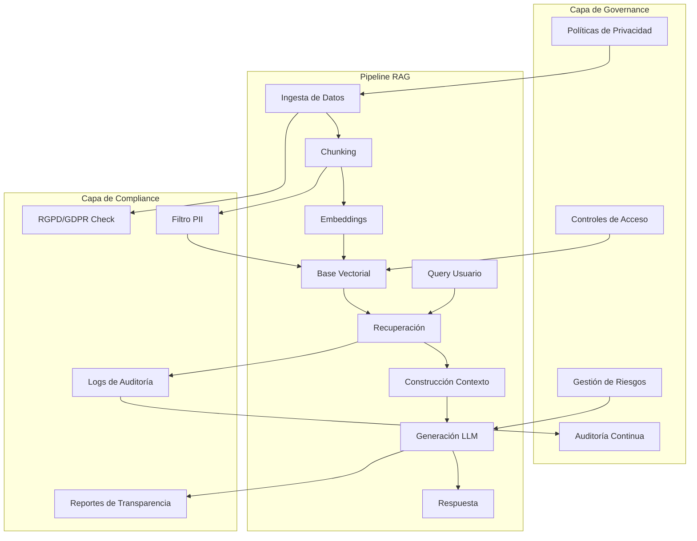
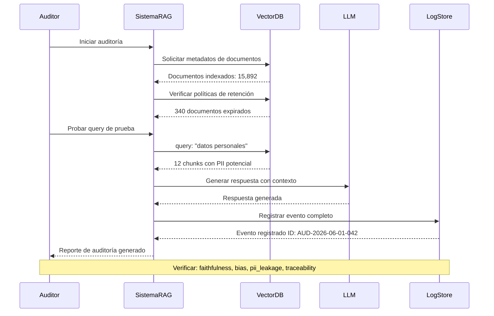
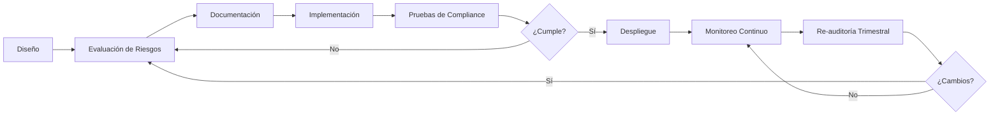

# Clase 23: Governance y Compliance para IA

**Duración:** 4 horas

---

## Objetivos de aprendizaje

Al finalizar esta clase, los estudiantes serán capaces de:

1. Comprender el marco regulatorio europeo (RGPD/GDPR) y su aplicación en sistemas de IA
2. Implementar procesos de auditoría para modelos de lenguaje y sistemas RAG
3. Documentar decisiones algorítmicas siguiendo estándares de compliance
4. Diseñar mecanismos de transparencia y explicabilidad en sistemas multi-agente
5. Utilizar herramientas de governance para mantener trazabilidad en pipelines de IA

---

## Contenidos Detallados

### Módulo 1: Marco Regulatorio y Protección de Datos (60 min)

#### 1.1 RGPD y su impacto en sistemas de IA

El Reglamento General de Protección de Datos (RGPD/GDPR) de la Unión Europea establece requisitos fundamentales que afectan directamente a cualquier sistema de IA que procese datos personales. Los principios clave incluyen:

**Principios fundamentales del RGPD aplicados a IA:**

- **Licitud, lealtad y transparencia (Art. 5.1.a):** El procesamiento de datos por sistemas de IA debe ser legal, justo y transparente para los usuarios. Esto implica que cuando un agente RAG recupera información personal, debe hacerlo bajo una base legal válida y el usuario debe ser informado.

- **Limitación de la finalidad (Art. 5.1.b):** Los datos personales solo pueden recogerse con fines determinados, explícitos y legítimos. Un sistema RAG entrenado para soporte técnico no puede reutilizarse para análisis de perfiles sin nuevo consentimiento.

- **Minimización de datos (Art. 5.1.c):** Solo deben procesarse los datos estrictamente necesarios. En sistemas RAG, esto implica filtrar documentos que contengan datos personales innecesarios para la consulta.

- **Exactitud (Art. 5.1.d):** Los datos deben ser exactos y estar actualizados. Los sistemas RAG deben implementar mecanismos de verificación de frescura de datos.

- **Limitación del plazo de conservación (Art. 5.1.e):** Los datos deben mantenerse solo el tiempo necesario. Las bases vectoriales deben implementar políticas de expiración.

- **Integridad y confidencialidad (Art. 5.1.f):** Seguridad técnica y organizativa apropiada. Cifrado de embeddings, control de acceso a bases vectoriales.

**Derechos de los ciudadanos afectados:**

| Derecho | Aplicación en IA | Implementación Técnica |
|---------|-----------------|----------------------|
| Acceso (Art. 15) | Usuario puede solicitar qué datos personales tiene el sistema | API de auditoría que liste documentos personales indexados |
| Rectificación (Art. 16) | Corregir datos personales erróneos en fuentes | Pipeline de actualización con versionado |
| Supresión (Art. 17) | Derecho al olvido | Mecanismo de eliminación selectiva de embeddings |
| Oposición (Art. 21) | Usuario puede oponerse al procesamiento | Filtros de exclusión por usuario |
| No ser sujeto a decisiones automatizadas (Art. 22) | Derecho a revisión humana de decisiones | Interruptor humano-en-el-bucle (Human-in-the-loop) |

#### 1.2 EU AI Act - Regulación de IA

La Ley de IA de la UE clasifica los sistemas de IA en categorías de riesgo:

- **Riesgo inaceptable:** Prohibidos (puntuación social, manipulación conductual)
- **Riesgo alto:** Sistemas RAG en salud, justicia, contratación, educación
- **Riesgo limitado:** Obligaciones de transparencia (chatbots, deepfakes)
- **Riesgo mínimo:** Sin obligaciones adicionales

**Requisitos para sistemas de alto riesgo:**

```
1. Sistema de gestión de riesgos continuo
2. Gobernanza de datos (procedencia, sesgos, representatividad)
3. Documentación técnica detallada
4. Registro automático de eventos (logs)
5. Transparencia e información a usuarios
6. Supervisión humana
7. Precisión, robustez y ciberseguridad
```

### Módulo 2: Auditoría de Modelos de IA (60 min)

#### 2.1 Framework de auditoría para sistemas RAG

Una auditoría de IA evalúa la conformidad, el rendimiento y los riesgos de un sistema. Para sistemas RAG, la auditoría cubre:

**Componentes auditables en un sistema RAG:**

```
┌─────────────────────────────────────────────────────────┐
│                   SISTEMA RAG AUDITABLE                  │
├────────────┬──────────────┬──────────────┬───────────────┤
│  INGESTA   │   ÍNDICE     │  RECUPERACIÓN │  GENERACIÓN   │
│            │              │              │               │
│• Fuentes   │• Embeddings  │• Algoritmo   │• Modelo       │
│• Filtros   │• Metadatos   │• Top-K       │• Prompt       │
│• Chunking  │• Almacén     │• Re-ranking  │• Alucinación  │
└────────────┴──────────────┴──────────────┴───────────────┘
```

**Checklist de auditoría:**

1. **Fuentes de datos:**
   - ¿De dónde provienen los documentos?
   - ¿Hay consentimiento para su uso?
   - ¿Están actualizados?
   - ¿Se han identificado sesgos potenciales?

2. **Pipeline de ingesta:**
   - ¿Qué chunking se aplica?
   - ¿Se filtran datos personales?
   - ¿Hay trazabilidad origen → chunk?

3. **Base vectorial:**
   - ¿Qué modelo de embeddings se usa?
   - ¿Hay control de acceso?
   - ¿Los embeddings son reversibles?

4. **Recuperación:**
   - ¿Qué métricas de similitud se usan?
   - ¿Hay sesgos en la recuperación?
   - ¿Se documentan los resultados?

5. **Generación:**
   - ¿Qué LLM se usa?
   - ¿Hay fine-tuning o prompt engineering?
   - ¿Cómo se miden las alucinaciones?

#### 2.2 Herramientas de auditoría automatizada

**AI Audit Toolkit (ejemplo práctico):**

```python
# auditor_rag.py - Herramienta de auditoría para sistemas RAG
import hashlib
import json
from datetime import datetime
from typing import List, Dict, Optional
from dataclasses import dataclass, asdict

@dataclass
class AuditEntry:
    timestamp: str
    component: str
    event_type: str
    description: str
    severity: str  # INFO, WARNING, CRITICAL
    data_hash: Optional[str] = None
    user_id: Optional[str] = None

class RAGAuditor:
    """
    Sistema de auditoría para pipelines RAG.
    Registra cada operación del sistema para compliance.
    """
    
    def __init__(self, log_path: str = "audit_log.json"):
        self.log_path = log_path
        self.entries: List[AuditEntry] = []
    
    def _hash_data(self, data: str) -> str:
        """Genera hash SHA-256 de datos para integridad"""
        return hashlib.sha256(data.encode()).hexdigest()
    
    def log_ingestion(self, source: str, num_chunks: int, 
                     has_pii: bool = False) -> None:
        """Audita el proceso de ingesta de documentos"""
        entry = AuditEntry(
            timestamp=datetime.utcnow().isoformat(),
            component="ingestion",
            event_type="document_ingested",
            description=f"Documento '{source}' dividido en {num_chunks} chunks. "
                       f"PII detectado: {has_pii}",
            severity="WARNING" if has_pii else "INFO",
            data_hash=self._hash_data(f"{source}:{num_chunks}")
        )
        self.entries.append(entry)
        self._persist()
    
    def log_retrieval(self, query: str, num_results: int, 
                     sources: List[str]) -> None:
        """Audita consultas de recuperación"""
        entry = AuditEntry(
            timestamp=datetime.utcnow().isoformat(),
            component="retrieval",
            event_type="query_executed",
            description=f"Query recuperó {num_results} documentos de "
                       f"{len(sources)} fuentes: {sources[:3]}",
            severity="INFO",
            data_hash=self._hash_data(query)
        )
        self.entries.append(entry)
        self._persist()
    
    def log_generation(self, prompt: str, response: str, 
                      model: str, confidence: float) -> None:
        """Audita generación de respuestas"""
        entry = AuditEntry(
            timestamp=datetime.utcnow().isoformat(),
            component="generation",
            event_type="response_generated",
            description=f"Modelo '{model}' generó respuesta "
                       f"(confianza: {confidence:.2f})",
            severity="WARNING" if confidence < 0.5 else "INFO",
            data_hash=self._hash_data(f"{prompt}:{response}")
        )
        self.entries.append(entry)
        self._persist()
    
    def _persist(self) -> None:
        """Persiste el log de auditoría"""
        with open(self.log_path, "w") as f:
            json.dump([asdict(e) for e in self.entries], f, indent=2)
    
    def generate_audit_report(self) -> Dict:
        """Genera reporte de auditoría resumido"""
        total = len(self.entries)
        warnings = sum(1 for e in self.entries if e.severity == "WARNING")
        criticals = sum(1 for e in self.entries if e.severity == "CRITICAL")
        
        return {
            "total_events": total,
            "warnings": warnings,
            "critical": criticals,
            "period": {
                "from": self.entries[0].timestamp if self.entries else None,
                "to": self.entries[-1].timestamp if self.entries else None
            },
            "components": list(set(e.component for e in self.entries))
        }


# Uso del auditor
auditor = RAGAuditor()

# Simular operaciones auditables
auditor.log_ingestion(
    source="manual_empleado_2024.pdf", 
    num_chunks=45,
    has_pii=True  # Se detectaron datos personales
)

auditor.log_retrieval(
    query="¿Cuál es el salario del empleado Juan Pérez?",
    num_results=5,
    sources=["manual_empleado_2024.pdf", "contratos/"]
)

auditor.log_generation(
    prompt="¿Cuál es el salario del empleado Juan Pérez?",
    response="El salario de Juan Pérez es confidencial. Consulta con RRHH.",
    model="gpt-4",
    confidence=0.92
)

print(json.dumps(auditor.generate_audit_report(), indent=2))
```

### Módulo 3: Documentación de Decisiones Algorítmicas (60 min)

#### 3.1 Estándares de documentación

La documentación de decisiones algorítmicas es un requisito del EU AI Act y del RGPD. Los estándares emergentes incluyen:

**Model Cards (Google):** Documentos estandarizados que describen el propósito, rendimiento, limitaciones y sesgos de un modelo.

**Datasheets for Datasets (Microsoft):** Documentación detallada sobre el origen, composición, recolección y usos previstos de datasets.

**System Cards (OpenAI):** Documentación técnica de sistemas complejos incluyendo arquitectura, seguridad y comportamiento esperado.

**Plantilla de Model Card para sistema RAG:**

```markdown
# Model Card: Sistema RAG - Asistente Corporativo

## Model Details
- **Nombre:** TIA-RAG-v1
- **Tipo:** Retrieval-Augmented Generation
- **Fecha:** 2026-06-01
- **Versión:** 1.2.0
- **Desarrollado por:** Equipo TIA

## Intended Use
- **Propósito:** Responder preguntas sobre documentación interna
- **Usuarios:** Empleados de la organización
- **Dominio:** Recursos Humanos, IT, Compliance
- **No usar para:** Decisiones de contratación, evaluaciones de desempeño

## Model Architecture
- **Embeddings:** text-embedding-3-large (OpenAI, dim=3072)
- **Vector Store:** ChromaDB con filtros por metadatos
- **Retrieval:** Hybrid search (vectorial + keyword)
- **LLM:** GPT-4o-mini (temperatura=0.1)
- **Chunking:** RecursiveCharacterTextSplitter (chunk=512, overlap=50)

## Training Data
- **Fuentes:** Manual de empleado, políticas corporativas, FAQs
- **Volumen:** 2,340 documentos, 15,892 chunks
- **Idiomas:** Español (95%), Inglés (5%)
- **Última actualización:** 2026-05-15

## Performance
- **Faithfulness:** 0.87 (RAGAS)
- **Answer Relevance:** 0.92 (RAGAS)
- **Context Precision:** 0.84 (RAGAS)
- **Latencia promedio:** 1.2s por consulta

## Limitations
- No tiene acceso a información en tiempo real
- Puede alucinar si no encuentra contexto relevante
- No verifica automáticamente la exactitud de los documentos fuente
- Sesgo potencial hacia documentación más reciente

## Ethical Considerations
- Los logs de consultas se almacenan por 90 días
- No se almacenan consultas PII identificables
- Revisión humana requerida para respuestas con confianza < 0.6
- Sesgo evaluado: no significativo en pruebas de equidad

## Maintenance
- Responsable: equipo-ia@empresa.com
- Frecuencia de actualización: Mensual
- Re-auditoría: Trimestral
```

#### 3.2 Trazabilidad de decisiones

La trazabilidad permite reconstruir el proceso de decisión de principio a fin. En un sistema RAG, cada respuesta debe ser trazable hasta:

```
Consulta Usuario
    ↓
┌─ Query Processing ──────────────────────────┐
│ • Query original: "¿Qué política aplica?"    │
│ • Query reescrita: "política vacaciones 2026"│
│ • Filtros aplicados: [departamento=IT]       │
└──────────────────────────────────────────────┘
    ↓
┌─ Retrieval ─────────────────────────────────┐
│ • Top-K solicitado: 5                        │
│ • Documentos recuperados:                    │
│   [1] Politica_Vacaciones_2026.pdf (0.92)   │
│   [2] Manual_Empleado_2024.pdf (0.87)       │
│   [3] FAQ_RRHH.md (0.76)                    │
└──────────────────────────────────────────────┘
    ↓
┌─ Generation ────────────────────────────────┐
│ • Prompt template: prompt_rag_v2.txt         │
│ • Modelo: gpt-4o-mini (temp=0.1)            │
│ • Contexto utilizado: Documentos [1, 2]      │
│ • Respuesta generada: "Aplica..."            │
└──────────────────────────────────────────────┘
```

**Implementación de trazabilidad con LangChain:**

```python
from langchain.callbacks import BaseCallbackHandler
from langchain.schema import LLMResult
from typing import Dict, Any, List

class TraceabilityHandler(BaseCallbackHandler):
    """
    Callback de LangChain que registra toda la trazabilidad
    de cada consulta para propósitos de auditoría.
    """
    
    def __init__(self):
        self.traces: List[Dict[str, Any]] = []
        self.current_run: Dict[str, Any] = {}
    
    def on_llm_start(self, serialized: Dict, prompts: List[str], **kwargs) -> None:
        self.current_run["prompt_enviado"] = prompts[0]
        self.current_run["timestamp_inicio"] = __import__("datetime").datetime.utcnow().isoformat()
    
    def on_llm_end(self, response: LLMResult, **kwargs) -> None:
        self.current_run["respuesta"] = response.generations[0][0].text
        self.current_run["modelo"] = response.llm_output.get("model_name", "unknown")
        self.current_run["timestamp_fin"] = __import__("datetime").datetime.utcnow().isoformat()
        self.current_run["tokens_usados"] = response.llm_output.get("token_usage", {})
        self.traces.append(self.current_run)
    
    def on_retriever_start(self, query: str, **kwargs) -> None:
        self.current_run["query_recuperacion"] = query
    
    def on_retriever_end(self, documents, **kwargs) -> None:
        self.current_run["documentos_recuperados"] = [
            {
                "fuente": doc.metadata.get("source", "unknown"),
                "score": doc.metadata.get("score", 0),
                "pagina": doc.metadata.get("page", 0)
            }
            for doc in documents
        ]
```

#### 3.3 Registro de decisiones (Decision Logs)

Formato estandarizado para registro de decisiones algorítmicas:

```json
{
  "decision_id": "dec_20260601_001",
  "timestamp": "2026-06-01T14:30:00Z",
  "user_id": "usr_anon_123",
  "query": "¿Cuál es el proceso de onboarding?",
  "pipeline_version": "rag_pipeline_v2",
  "retrieval": {
    "strategy": "hybrid_search",
    "top_k": 5,
    "results": [
      {"doc_id": "doc_451", "score": 0.92, "source": "onboarding_guide.pdf"},
      {"doc_id": "doc_203", "score": 0.88, "source": "hr_handbook_2026.pdf"}
    ],
    "latency_ms": 340
  },
  "generation": {
    "model": "gpt-4o-mini",
    "temperature": 0.1,
    "max_tokens": 500,
    "prompt_template": "rag_template_v3",
    "latency_ms": 890,
    "tokens_input": 1240,
    "tokens_output": 312
  },
  "response": "El proceso de onboarding consta de 4 fases: ...",
  "confidence_score": 0.94,
  "human_review_required": false,
  "compliance_tags": ["hr_process", "non_pii"]
}
```

### Módulo 4: Transparencia y Explicabilidad (60 min)

#### 4.1 Mecanismos de transparencia

La transparencia en IA implica que los usuarios sepan que están interactuando con un sistema automatizado y comprendan sus capacidades y limitaciones.

**Requisitos de transparencia del EU AI Act (Art. 50):**

1. **Revelación:** Informar que se interactúa con un sistema de IA
2. **Capacidades:** Describir qué puede y no puede hacer el sistema
3. **Limitaciones:** Advertir sobre posibles errores o alucinaciones
4. **Fuentes:** Indicar el origen de la información recuperada
5. **Alternativas:** Ofrecer opción de contacto humano

**Implementación de transparencia en sistemas RAG:**

```python
class TransparentRAGResponse:
    """
    Envuelve respuestas RAG con metadatos de transparencia.
    """
    
    def __init__(self, response_text: str, sources: List[str], 
                 confidence: float, model: str, latency: float):
        self.response_text = response_text
        self.sources = sources
        self.confidence = confidence
        self.model = model
        self.latency = latency
    
    def to_transparent_dict(self) -> Dict:
        return {
            "response": self.response_text,
            "metadata": {
                "disclaimer": "Esta respuesta fue generada por un "
                             "sistema de IA asistido por recuperación "
                             "de documentos. Verifique la información "
                             "con las fuentes originales.",
                "sources": [
                    {"title": s, "accessed_at": datetime.utcnow().isoformat()}
                    for s in self.sources
                ],
                "confidence_score": self.confidence,
                "ai_model": self.model,
                "response_time_s": round(self.latency, 2),
                "can_request_human": True,
                "human_support_endpoint": "/api/request-human"
            }
        }
    
    def __str__(self) -> str:
        header = "--- RESPONSABLE IA ---\n"
        info = f"[Confianza: {self.confidence:.0%}] "
        info += f"[Modelo: {self.model}] "
        info += f"[Fuentes: {len(self.sources)} documentos]\n\n"
        footer = f"\n---\nℹ️ Respuesta generada por IA. "
        footer += "Solicita revisión humana si lo necesitas."
        return header + info + self.response_text + footer
```

#### 4.2 Explicabilidad en recuperación

La explicabilidad permite entender por qué se recuperaron ciertos documentos:

```python
import numpy as np
from sklearn.feature_extraction.text import TfidfVectorizer
from sklearn.metrics.pairwise import cosine_similarity

class RetrievalExplainer:
    """
    Explica por qué cada documento fue recuperado,
    mostrando fragmentos relevantes y su similitud.
    """
    
    def __init__(self, documents: List[str], doc_metadata: List[Dict]):
        self.documents = documents
        self.doc_metadata = doc_metadata
        self.vectorizer = TfidfVectorizer(max_features=1000, 
                                         ngram_range=(1, 2))
        self.doc_vectors = self.vectorizer.fit_transform(documents)
    
    def explain_retrieval(self, query: str, top_k: int = 3) -> List[Dict]:
        query_vector = self.vectorizer.transform([query])
        similarities = cosine_similarity(query_vector, self.doc_vectors)[0]
        
        top_indices = np.argsort(similarities)[-top_k:][::-1]
        
        explanations = []
        for idx in top_indices:
            doc_text = self.documents[idx]
            score = similarities[idx]
            
            # Encontrar fragmento más relevante
            relevant_terms = self._get_relevant_terms(query, doc_text)
            
            explanations.append({
                "document_index": idx,
                "metadata": self.doc_metadata[idx],
                "similarity_score": round(float(score), 4),
                "why_retrieved": f"Contiene términos clave: {relevant_terms}",
                "relevant_snippet": doc_text[:300] + "..."
            })
        
        return explanations
    
    def _get_relevant_terms(self, query: str, doc: str) -> List[str]:
        query_terms = set(query.lower().split())
        doc_terms = set(doc.lower().split())
        return list(query_terms & doc_terms)[:10]
```

#### 4.3 SHAP y LIME para explicabilidad de modelos

```python
# Ejemplo conceptual de SHAP para explicar decisiones del recuperador
import shap

def explainer_rag_shap(embedding_model, query, candidate_docs):
    """
    Usa SHAP para explicar qué palabras contribuyeron más
    a la recuperación de cada documento.
    """
    explainer = shap.Explainer(embedding_model, candidate_docs)
    shap_values = explainer([query])
    
    # Visualización conceptual
    shap.plots.text(shap_values)
    # Muestra: "La palabra 'política' contribuyó +0.15 a recuperar doc1"
    #          "La palabra 'vacaciones' contribuyó +0.22 a recuperar doc2"
    return shap_values
```

---

## Diagramas en Mermaid

### Diagrama 1: Arquitectura de Governance para Sistemas RAG



### Diagrama 2: Flujo de Auditoría de un Sistema RAG



### Diagrama 3: Ciclo de Vida de Compliance para Modelos de IA



---

## Referencias Externas

### Regulaciones y Estándares
- **EU AI Act (Texto completo):** https://eur-lex.europa.eu/eli/reg/2024/1689
- **RGDP/GDPR:** https://gdpr.eu/
- **NIST AI Risk Management Framework:** https://www.nist.gov/itl/ai-risk-management-framework
- **ISO/IEC 42001 (Sistema de Gestión de IA):** https://www.iso.org/standard/81230.html
- **OECD AI Principles:** https://oecd.ai/en/ai-principles

### Herramientas y Frameworks
- **AI Fairness 360 (IBM):** https://aif360.mybluemix.net/
- **Model Cards Toolkit (Google):** https://modelcards.withgoogle.com/
- **SHAP (Explainability):** https://shap.readthedocs.io/
- **LIME:** https://github.com/marcotcr/lime
- **Great Expectations (Data Quality):** https://greatexpectations.io/

### Guías y Documentación
- **Datasheets for Datasets:** https://arxiv.org/abs/1803.09010
- **OpenAI System Card Guide:** https://cdn.openai.com/papers/gpt-4-system-card.pdf
- **MLOps y Governance (Google):** https://cloud.google.com/architecture/mlops-continuous-delivery-and-automation-pipelines-in-machine-learning
- **Responsible AI Practices (Google):** https://ai.google/responsibilities/responsible-ai-practices/

---

## Ejercicios Prácticos Resueltos

### Ejercicio 1: Implementar un Filtro de Datos Personales (PII)

**Problema:** Diseñar un filtro que detecte y anonimice datos personales en chunks antes de indexarlos en la base vectorial.

**Solución:**

```python
import re
import hashlib
from typing import List, Tuple

class PIIFilter:
    """
    Filtro de datos personales para pipelines RAG.
    Detecta y anonimiza PII antes de indexación.
    """
    
    # Patrones de PII comunes
    PATTERNS = {
        "email": r'\b[A-Za-z0-9._%+-]+@[A-Za-z0-9.-]+\.[A-Z|a-z]{2,}\b',
        "phone": r'\b(?:\+?\d{1,3}[\s-]?)?\(?\d{3}\)?[\s.-]?\d{3}[\s.-]?\d{4}\b',
        "dni": r'\b\d{8}[A-Z]\b',  # Formato DNI español
        "ssn": r'\b\d{3}-\d{2}-\d{4}\b',  # Formato SSN USA
        "credit_card": r'\b(?:\d{4}[-\s]?){3}\d{4}\b',
        "ip_address": r'\b\d{1,3}\.\d{1,3}\.\d{1,3}\.\d{1,3}\b'
    }
    
    def __init__(self, 
                 anonymization_mode: str = "mask",
                 pii_log_path: str = "pii_detections.json"):
        self.mode = anonymization_mode  # "mask", "hash", "remove"
        self.detections_log = []
        self.pii_log_path = pii_log_path
    
    def detect_pii(self, text: str) -> List[Tuple[str, str, int, int]]:
        """
        Detecta instancias de PII en texto.
        Retorna: [(tipo, valor, start_pos, end_pos), ...]
        """
        detections = []
        for pii_type, pattern in self.PATTERNS.items():
            for match in re.finditer(pattern, text):
                detections.append((
                    pii_type,
                    match.group(),
                    match.start(),
                    match.end()
                ))
        return detections
    
    def anonymize(self, text: str) -> str:
        """
        Anonimiza el texto según el modo configurado.
        """
        result = text
        detections = self.detect_pii(text)
        
        for pii_type, value, start, end in detections:
            if self.mode == "mask":
                # Preserva primeros y últimos caracteres
                if len(value) > 4:
                    masked = value[:2] + "*" * (len(value) - 4) + value[-2:]
                else:
                    masked = "****"
                replacement = f"[PII:{pii_type}:{masked}]"
                
            elif self.mode == "hash":
                # Reemplaza con hash SHA-256 truncado
                hash_val = hashlib.sha256(value.encode()).hexdigest()[:8]
                replacement = f"[PII:{pii_type}:{hash_val}]"
                
            elif self.mode == "remove":
                replacement = f"[PII_REMOVED:{pii_type}]"
            
            result = result[:start] + replacement + result[end:]
            
            # Ajustar posiciones para el resto de detecciones
            shift = len(replacement) - len(value)
            for i in range(len(detections)):
                d = detections[i]
                if d[2] > end:
                    detections[i] = (d[0], d[1], d[2] + shift, d[3] + shift)
        
        # Registrar detecciones
        if detections:
            self.detections_log.append({
                "detections": detections,
                "mode": self.mode,
                "timestamp": __import__("datetime").datetime.utcnow().isoformat()
            })
        
        return result
    
    def get_pii_report(self) -> Dict:
        """Genera reporte de PII detectado"""
        report = {}
        for entry in self.detections_log:
            for pii_type, value, _, _ in entry["detections"]:
                report[pii_type] = report.get(pii_type, 0) + 1
        return {
            "total_detections": sum(report.values()),
            "by_type": report,
            "mode_used": self.mode
        }


# === DEMOSTRACIÓN ===
if __name__ == "__main__":
    filter_pii = PIIFilter(anonymization_mode="mask")
    
    texto_con_pii = """
    DATOS DEL EMPLEADO:
    Nombre: Juan Pérez (contacto: juan.perez@empresa.com)
    Teléfono: +34 612 345 678
    DNI: 12345678Z
    Salario: 45,000€
    Dirección IP: 192.168.1.100
    """
    
    print("=== TEXTO ORIGINAL ===")
    print(texto_con_pii)
    
    # Detectar PII
    detecciones = filter_pii.detect_pii(texto_con_pii)
    print("\n=== PII DETECTADO ===")
    for tipo, valor, start, end in detecciones:
        print(f"  [{tipo}] pos {start}-{end}: '{valor}'")
    
    # Anonimizar
    texto_anonimo = filter_pii.anonymize(texto_con_pii)
    print("\n=== TEXTO ANONIMIZADO ===")
    print(texto_anonimo)
    
    # Reporte
    print("\n=== REPORTE PII ===")
    import json
    print(json.dumps(filter_pii.get_pii_report(), indent=2))
```

### Ejercicio 2: Generar Reporte de Auditoría RAG

**Problema:** Crear un sistema que genere reportes de auditoría automáticos para sistemas RAG, evaluando conformidad con RGPD.

**Solución:**

```python
import json
from datetime import datetime, timedelta
from typing import List, Dict

class ComplianceReportGenerator:
    """
    Genera reportes de compliance para sistemas RAG.
    Evalúa conformidad con requisitos RGPD.
    """
    
    REQUISITOS_RGPD = {
        "data_minimization": {
            "description": "Minimización de datos personales",
            "checks": ["pii_filter_active", "retention_policy", "purpose_limitation"]
        },
        "transparency": {
            "description": "Transparencia con usuarios",
            "checks": ["ai_disclosure", "source_citation", "confidence_indicators"]
        },
        "access_right": {
            "description": "Derecho de acceso del usuario",
            "checks": ["user_data_portability", "query_history_access"]
        },
        "erasure_right": {
            "description": "Derecho al olvido",
            "checks": ["embedding_deletion", "document_removal", "cache_clear"]
        },
        "accuracy": {
            "description": "Exactitud de datos",
            "checks": ["source_freshness", "hallucination_monitoring", "factual_consistency"]
        }
    }
    
    def __init__(self, system_config: Dict):
        self.config = system_config
        self.audit_history: List[Dict] = []
        self.start_date = datetime.utcnow()
    
    def check_data_minimization(self) -> Dict:
        """Verifica minimización de datos"""
        results = {}
        
        # Check 1: Filtro PII activo
        results["pii_filter_active"] = {
            "status": self.config.get("pii_filter", False),
            "required": True,
            "severity": "CRITICAL"
        }
        
        # Check 2: Política de retención
        has_retention = "retention_days" in self.config
        results["retention_policy"] = {
            "status": has_retention,
            "required": True,
            "details": f"Retención: {self.config.get('retention_days', 'No configurada')} días",
            "severity": "HIGH"
        }
        
        # Check 3: Limitación de propósito
        has_purpose = "processing_purpose" in self.config
        results["purpose_limitation"] = {
            "status": has_purpose,
            "required": True,
            "details": f"Propósito: {self.config.get('processing_purpose', 'No definido')}",
            "severity": "HIGH"
        }
        
        return results
    
    def check_transparency(self) -> Dict:
        """Verifica transparencia"""
        results = {}
        
        results["ai_disclosure"] = {
            "status": self.config.get("disclose_ai", False),
            "required": True,
            "severity": "HIGH"
        }
        
        results["source_citation"] = {
            "status": self.config.get("cite_sources", False),
            "required": True,
            "details": "Citar documentos fuente en respuestas",
            "severity": "MEDIUM"
        }
        
        results["confidence_indicators"] = {
            "status": self.config.get("show_confidence", False),
            "required": False,
            "severity": "LOW"
        }
        
        return results
    
    def check_erasure_right(self) -> Dict:
        """Verifica capacidad de eliminar datos"""
        results = {}
        
        results["embedding_deletion"] = {
            "status": self.config.get("supports_embedding_delete", False),
            "required": True,
            "severity": "CRITICAL"
        }
        
        results["cache_clear"] = {
            "status": True,  # Asumimos que se puede limpiar caché
            "required": True,
            "severity": "HIGH"
        }
        
        return results
    
    def generate_full_report(self) -> Dict:
        """Genera reporte completo de compliance"""
        
        report = {
            "report_metadata": {
                "generated_at": datetime.utcnow().isoformat(),
                "system_name": self.config.get("system_name", "Sistema RAG"),
                "version": self.config.get("version", "unknown"),
                "audit_period_days": (datetime.utcnow() - self.start_date).days
            },
            "compliance_summary": {
                "total_checks": 0,
                "passed": 0,
                "failed": 0,
                "compliance_score": 0.0
            },
            "requirement_checks": {}
        }
        
        total_checks = 0
        passed_checks = 0
        
        for req_name, req_config in self.REQUISITOS_RGPD.items():
            check_method = getattr(self, f"check_{req_name}", None)
            if check_method:
                results = check_method()
                report["requirement_checks"][req_name] = {
                    "description": req_config["description"],
                    "checks": results
                }
                
                for check_name, check_result in results.items():
                    total_checks += 1
                    if check_result["status"]:
                        passed_checks += 1
        
        compliance_score = (passed_checks / total_checks * 100) if total_checks > 0 else 0
        
        report["compliance_summary"]["total_checks"] = total_checks
        report["compliance_summary"]["passed"] = passed_checks
        report["compliance_summary"]["failed"] = total_checks - passed_checks
        report["compliance_summary"]["compliance_score"] = round(compliance_score, 1)
        
        # Recomendaciones
        report["recommendations"] = self._generate_recommendations(report)
        
        return report
    
    def _generate_recommendations(self, report: Dict) -> List[str]:
        """Genera recomendaciones basadas en resultados"""
        recommendations = []
        
        for req_name, req_data in report["requirement_checks"].items():
            for check_name, check_result in req_data["checks"].items():
                if not check_result["status"]:
                    severity = check_result.get("severity", "MEDIUM")
                    recommendations.append(
                        f"[{severity}] {req_data['description']} - "
                        f"{check_name}: {check_result.get('details', 'No implementado')}"
                    )
        
        return recommendations


# === DEMOSTRACIÓN ===
if __name__ == "__main__":
    # Configuración del sistema a auditar
    config = {
        "system_name": "TIA-RAG-Asistente",
        "version": "1.2.0",
        "pii_filter": True,
        "retention_days": 90,
        "processing_purpose": "Soporte interno de RRHH",
        "disclose_ai": True,
        "cite_sources": True,
        "show_confidence": True,
        "supports_embedding_delete": True,
        "human_review_available": True
    }
    
    auditor = ComplianceReportGenerator(config)
    report = auditor.generate_full_report()
    
    print("=== REPORTE DE COMPLIANCE RGPD ===")
    print(f"Sistema: {report['report_metadata']['system_name']}")
    print(f"Versión: {report['report_metadata']['version']}")
    print(f"Generado: {report['report_metadata']['generated_at']}")
    print(f"\nPuntaje de Compliance: {report['compliance_summary']['compliance_score']}%")
    print(f"Checks Pasados: {report['compliance_summary']['passed']}/{report['compliance_summary']['total_checks']}")
    
    print("\n=== RECOMENDACIONES ===")
    for rec in report.get("recommendations", []):
        print(f"  ⚠️  {rec}")
    
    # Guardar reporte
    with open("compliance_report.json", "w") as f:
        json.dump(report, f, indent=2, ensure_ascii=False)
    print("\nReporte guardado en 'compliance_report.json'")
```

---

## Actividades de Laboratorio

### Laboratorio 1: Auditoría de un Sistema RAG Simulado

**Duración:** 1 hora

**Objetivo:** Auditar un sistema RAG simulado y generar un reporte de compliance.

**Pasos:**
1. Configurar un `RAGAuditor` con parámetros de compliance
2. Simular 20 operaciones de ingesta, recuperación y generación
3. Analizar los logs generados
4. Identificar violaciones de privacidad potenciales
5. Generar reporte de auditoría con recomendaciones

### Laboratorio 2: Implementación de Transparencia

**Duración:** 45 minutos

**Objetivo:** Modificar un pipeline RAG para incluir metadatos de transparencia en todas las respuestas.

**Pasos:**
1. Crear wrapper `TransparentRAGResponse` para respuestas
2. Incluir fuentes, confianza, y disclaimer en cada respuesta
3. Implementar endpoint para solicitar revisión humana
4. Probar con consultas de ejemplo

### Laboratorio 3: Documentación de Modelos

**Duración:** 45 minutos

**Objetivo:** Crear Model Cards completas para sistemas RAG.

**Pasos:**
1. Documentar la arquitectura del sistema
2. Identificar limitaciones y sesgos
3. Definir métricas de rendimiento
4. Establecer plan de mantenimiento

---

## Resumen de Puntos Clave

1. **RGPD y EU AI Act** son los marcos regulatorios principales que afectan a sistemas de IA en Europa, con requisitos específicos para transparencia, minimización de datos y auditoría.

2. **La auditoría de sistemas RAG** debe cubrir toda la cadena: ingesta, chunking, embeddings, recuperación y generación, verificando cada componente contra requisitos regulatorios.

3. **La trazabilidad de decisiones** requiere registrar cada paso del pipeline (query original, documentos recuperados, prompt, respuesta, confianza) para reconstruir el proceso de decisión.

4. **Los mecanismos de transparencia** deben informar al usuario que interactúa con IA, citar fuentes, mostrar niveles de confianza y ofrecer alternativa humana.

5. **La anonimización de datos personales** (PII filtering) es crítica antes de indexar documentos en bases vectoriales para cumplir con minimización de datos.

6. **Model Cards y Datasheets** son estándares de documentación que facilitan la auditoría y el cumplimiento normativo.

7. **Herramientas como SHAP y LIME** permiten explicar decisiones de modelos, mientras que **RAGAuditor** y **ComplianceReportGenerator** automatizan procesos de compliance.
