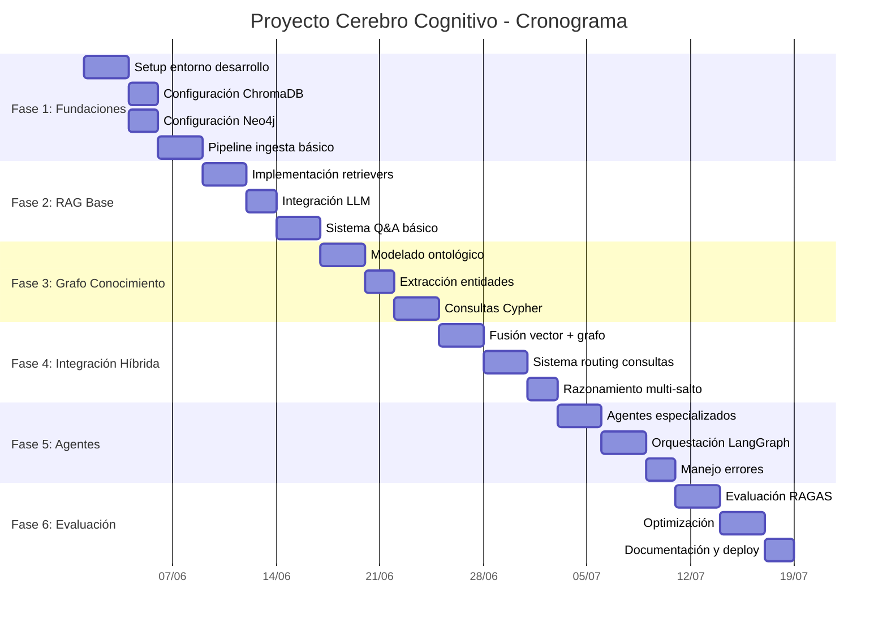
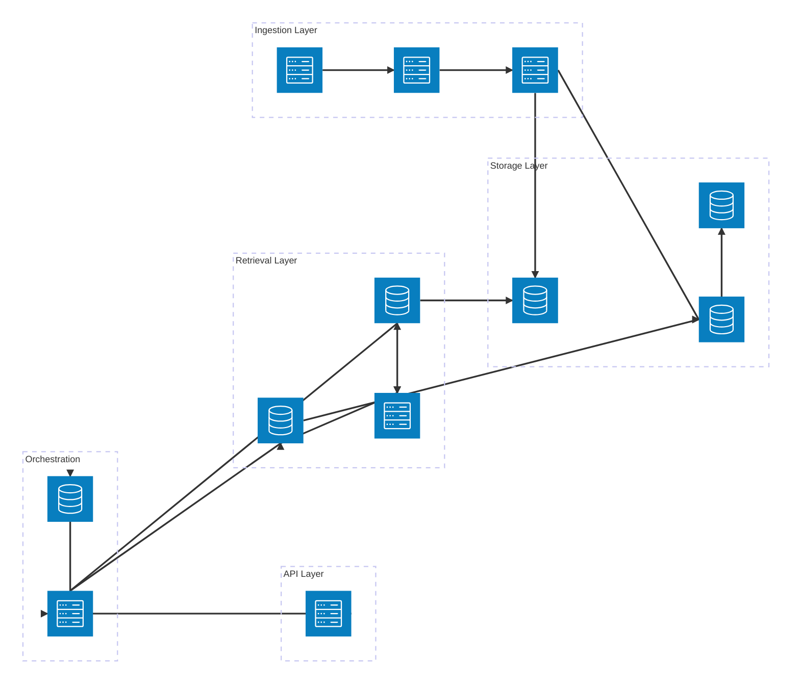
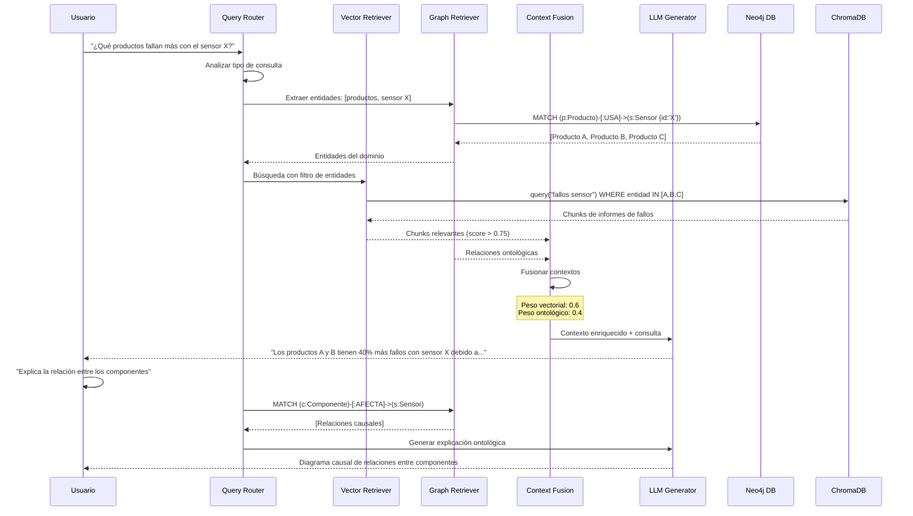
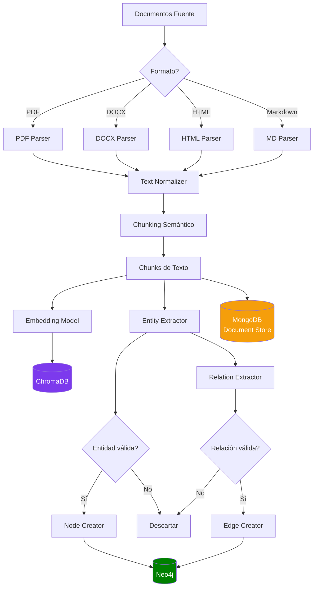

# Clase 24: Proyecto Cerebro Cognitivo - Diseño

**Duración:** 4 horas

---

## Objetivos de Aprendizaje

Al finalizar esta clase, los estudiantes serán capaces de:

1. Diseñar una arquitectura integral que combine RAG con Grafos de Conocimiento
2. Seleccionar tecnologías y componentes apropiados según requisitos del proyecto
3. Elaborar un plan de implementación con cronograma detallado y milestones
4. Definir métricas de éxito cuantitativas y cualitativas para el sistema cognitivo
5. Evaluar trade-offs arquitectónicos entre diferentes stack tecnológicos

---

## Contenidos Detallados

### Módulo 1: Arquitectura Integral RAG + Grafos (60 min)

#### 1.1 Fundamentos del Cerebro Cognitivo

El concepto "Cerebro Cognitivo" representa un sistema de IA que integra múltiples paradigmas de representación del conocimiento:

- **Memoria Episódica (RAG Vectorial):** Recupera fragmentos específicos de documentos relevantes a una consulta. Corresponde a la memoria de hechos y eventos.

- **Memoria Semántica (Grafo de Conocimiento):** Representa relaciones conceptuales entre entidades. Permite razonamiento sobre conexiones implícitas.

- **Memoria Procedimental (Agentes):** Orquestación de flujos de trabajo y pipelines de procesamiento.

```
┌─────────────────────────────────────────────────────────┐
│                 CEREBRO COGNITIVO                        │
├──────────────┬──────────────────┬───────────────────────┤
│ Memoria      │ Memoria          │ Memoria               │
│ Episódica    │ Semántica        │ Procedimental         │
│ (RAG        │ (Grafo          │ (Agentes             │
│  Vectorial)  │  Conocimiento)   │  Orquestados)         │
├──────────────┼──────────────────┼───────────────────────┤
│ • ChromaDB   │ • Neo4j          │ • LangGraph           │
│ • FAISS      │ • ArangoDB       │ • CrewAI              │
│ • Pinecone   │ • RDF/OWL        │ • AutoGen             │
│ • Qdrant     │ • SPARQL         │ • Semantic Kernel     │
└──────────────┴──────────────────┴───────────────────────┘
```

#### 1.2 Patrones Arquitectónicos

**Patrón 1: RAG → Graph Enrichment**

La recuperación vectorial alimenta al grafo para enriquecer el contexto:

```
Query → Vector Search → Documents → Entity Extraction → Graph Query
                                                              ↓
Respuesta ← LLM Generation ← Context Fusion ←────────────────┘
```

**Ventajas:** Combina semántica densa (vectores) con relaciones estructuradas (grafos). Útil cuando las respuestas requieren理解 relaciones entre múltiples entidades.

**Patrón 2: Graph → RAG Constraint**

El grafo guía y restringe la recuperación vectorial:

```
Query → Graph Query → Entity Constraints → Filtered Vector Search
                                                ↓
Respuesta ← LLM Generation ← Constrained Context ←┘
```

**Ventajas:** Reduce el espacio de búsqueda, mejora precisión, evita recuperar documentos irrelevantes.

**Patrón 3: Hybrid Multi-Hop Reasoning**

Razonamiento multi-salto alternando entre vectores y grafos:

```
Query → Hop 1: Vector Search → Entities → Hop 2: Graph Traversal
                                              ↓
Respuesta ← Milti-Hop Context ← LLM ←─────────────────┘
```

#### 1.3 Arquitectura de Referencia

```python
# arquitectura_cerebro.py - Esquema de la arquitectura del sistema
from dataclasses import dataclass, field
from typing import List, Optional
from enum import Enum

class RetrievalStrategy(Enum):
    VECTOR_ONLY = "vector_only"
    GRAPH_ONLY = "graph_only"
    HYBRID_SEQUENTIAL = "hybrid_sequential"
    HYBRID_FUSION = "hybrid_fusion"

@dataclass
class ComponentConfig:
    """Configuración de un componente de la arquitectura"""
    name: str
    technology: str
    version: str
    purpose: str
    dependencies: List[str] = field(default_factory=list)
    config_params: dict = field(default_factory=dict)

@dataclass
class ArchitectureBlueprint:
    """Blueprint completo de la arquitectura del Cerebro Cognitivo"""
    
    # Capas del sistema
    ingestion_layer: List[ComponentConfig]
    storage_layer: List[ComponentConfig]
    retrieval_layer: List[ComponentConfig]
    reasoning_layer: List[ComponentConfig]
    orchestration_layer: List[ComponentConfig]
    presentation_layer: List[ComponentConfig]
    
    # Estrategias
    retrieval_strategy: RetrievalStrategy
    fusion_method: str  # "concat", "weighted", "rerank", "graph_boosted"
    
    # Integración
    graph_vector_bridge: str  # Cómo se comunican grafo y vectores
    
    def describe(self) -> str:
        """Genera descripción textual de la arquitectura"""
        lines = ["## ARQUITECTURA DEL CEREBRO COGNITIVO", ""]
        lines.append(f"Estrategia de recuperación: {self.retrieval_strategy.value}")
        lines.append(f"Método de fusión: {self.fusion_method}")
        lines.append(f"Puente Grafo-Vector: {self.graph_vector_bridge}")
        lines.append("")
        
        capas = [
            ("Ingesta", self.ingestion_layer),
            ("Almacenamiento", self.storage_layer),
            ("Recuperación", self.retrieval_layer),
            ("Razonamiento", self.reasoning_layer),
            ("Orquestación", self.orchestration_layer),
            ("Presentación", self.presentation_layer),
        ]
        
        for nombre_capa, componentes in capas:
            lines.append(f"--- {nombre_capa} ---")
            for comp in componentes:
                lines.append(f"  • {comp.name}: {comp.technology} {comp.version}")
                lines.append(f"    Propósito: {comp.purpose}")
            lines.append("")
        
        return "\n".join(lines)


# Ejemplo: Blueprint para sistema de soporte técnico
blueprint_soporte = ArchitectureBlueprint(
    ingestion_layer=[
        ComponentConfig("Document Parser", "Unstructured", "0.14",
                       "Parseo de PDFs, DOCX, HTML"),
        ComponentConfig("Chunker", "LangChain RecursiveSplitter", "0.3",
                       "División semántica de documentos",
                       config_params={"chunk_size": 512, "chunk_overlap": 50}),
        ComponentConfig("Entity Extractor", "spaCy NER", "3.8",
                       "Extracción de entidades para el grafo"),
    ],
    storage_layer=[
        ComponentConfig("Vector Store", "ChromaDB", "0.5",
                       "Almacenamiento de embeddings",
                       config_params={"distance": "cosine", "dimension": 3072}),
        ComponentConfig("Graph DB", "Neo4j", "5.20",
                       "Grafo de conocimiento",
                       config_params={"db": "neo4j://localhost:7687"}),
        ComponentConfig("Document Store", "MongoDB", "7.0",
                       "Almacenamiento de documentos originales"),
    ],
    retrieval_layer=[
        ComponentConfig("Vector Retriever", "LangChain Chroma", "0.3",
                       "Búsqueda por similitud coseno"),
        ComponentConfig("Graph Retriever", "Neo4j Cypher", "5.20",
                       "Consultas al grafo de conocimiento"),
        ComponentConfig("Hybrid Fusion", "Custom", "1.0",
                       "Fusión ponderada de resultados",
                       config_params={"vector_weight": 0.6, "graph_weight": 0.4}),
    ],
    reasoning_layer=[
        ComponentConfig("LLM Engine", "OpenAI GPT-4o-mini", "2024",
                       "Generación de respuestas"),
        ComponentConfig("Reasoning Chain", "LangGraph", "0.2",
                       "Cadenas de razonamiento multi-paso"),
    ],
    orchestration_layer=[
        ComponentConfig("Agent Orchestrator", "LangGraph", "0.2",
                       "Orquestación de agentes especializados"),
        ComponentConfig("Query Router", "Custom Classifier", "1.0",
                       "Enrutamiento de consultas al pipeline adecuado"),
    ],
    presentation_layer=[
        ComponentConfig("REST API", "FastAPI", "0.111",
                       "API para consultas"),
        ComponentConfig("Web UI", "Streamlit", "1.35",
                       "Interfaz de usuario"),
    ],
    retrieval_strategy=RetrievalStrategy.HYBRID_FUSION,
    fusion_method="weighted",
    graph_vector_bridge="entity_linking"
)
```

### Módulo 2: Selección de Componentes y Tecnologías (60 min)

#### 2.1 Criterios de Selección

**Matriz de evaluación tecnológica:**

| Criterio | Peso | Descripción |
|----------|------|-------------|
| Rendimiento | 25% | Latencia, throughput, escalabilidad |
| Madurez | 20% | Comunidad, documentación, estabilidad |
| Costo | 20% | Licencias, infraestructura, operación |
| Integración | 15% | Compatibilidad con otros componentes |
| Mantenibilidad | 10% | Curva de aprendizaje, debugging |
| Seguridad | 10% | Autenticación, cifrado, compliance |

#### 2.2 Comparativa de Tecnologías

**Bases Vectoriales:**

| Tecnología | Tipo | Escalabilidad | Costo | Ideal para |
|------------|------|---------------|-------|------------|
| ChromaDB | Embedding DB | Media | Gratuito | Prototipado, equipos pequeños |
| Pinecone | SaaS | Alta | $$$ | Producción empresarial |
| Qdrant | Self-hosted/SaaS | Alta | $$ | Producción flexible |
| Weaviate | Self-hosted/SaaS | Alta | $$ | Búsqueda híbrida nativa |
| Milvus | Self-hosted | Muy Alta | Gratuito | Escala masiva |

**Bases de Grafos:**

| Tecnología | Modelo | Query | Escalabilidad | Ideal para |
|------------|--------|-------|---------------|------------|
| Neo4j | Property Graph | Cypher | Alta | Aplicaciones empresariales |
| ArangoDB | Multi-modelo | AQL | Alta | Grafos + Documentos |
| Amazon Neptune | RDF/Property | SPARQL/Gremlin | Muy Alta | AWS nativo |
| Apache Jena | RDF | SPARQL | Media | Ontologías semánticas |

**Modelos de Embeddings:**

| Modelo | Dimensión | Rendimiento | Costo |
|--------|-----------|-------------|-------|
| text-embedding-3-large (OpenAI) | 3072 | Excelente | $$ |
| text-embedding-3-small (OpenAI) | 1536 | Muy bueno | $ |
| BGE-M3 (BAAI) | 1024 | Excelente | Gratuito |
| Sentence-Transformers (all-MiniLM) | 384 | Bueno | Gratuito |
| Cohere Embed v3 | 1024 | Excelente | $$ |

**LLMs para Generación:**

| Modelo | Calidad | Latencia | Costo | Contexto |
|--------|---------|----------|-------|----------|
| GPT-4o | Excelente | Media | $$$ | 128K |
| GPT-4o-mini | Muy buena | Baja | $ | 128K |
| Claude 3.5 Sonnet | Excelente | Media | $$$ | 200K |
| Llama 3.1 70B | Muy buena | Baja | $ | 128K |
| Mistral Large | Excelente | Media | $$ | 32K |

#### 2.3 Decisión Arquitectónica Documentada

```python
# decision_engine.py - Motor de selección de tecnologías

class TechnologyDecision:
    """Documenta una decisión tecnológica con su justificación"""
    
    def __init__(self, component: str, selected: str, 
                 alternatives: List[str], criteria: dict):
        self.component = component
        self.selected = selected
        self.alternatives = alternatives
        self.criteria = criteria
        self.rationale = []
    
    def add_rationale(self, point: str):
        self.rationale.append(point)
    
    def to_markdown(self) -> str:
        lines = [f"### Decisión: {self.component}"]
        lines.append(f"**Seleccionado:** {self.selected}")
        lines.append(f"**Alternativas consideradas:** {', '.join(self.alternatives)}")
        lines.append("")
        lines.append("**Justificación:**")
        for r in self.rationale:
            lines.append(f"- {r}")
        lines.append("")
        lines.append(f"**Criterios de evaluación:**")
        for k, v in self.criteria.items():
            lines.append(f"  - {k}: {v}")
        return "\n".join(lines)


# Documentación de decisiones
decisiones = [
    TechnologyDecision(
        component="Vector Store",
        selected="ChromaDB",
        alternatives=["Pinecone", "Qdrant", "Weaviate"],
        criteria={
            "Rendimiento": "Suficiente para prototipo",
            "Costo": "Gratuito / Open Source",
            "Integración": "Excelente con LangChain",
            "Setup": "Zero-config, embedding management incluido"
        }
    ),
    TechnologyDecision(
        component="Graph DB",
        selected="Neo4j",
        alternatives=["ArangoDB", "Amazon Neptune"],
        criteria={
            "Madurez": "Líder del mercado, documentación extensa",
            "Query Language": "Cypher intuitivo y poderoso",
            "Integración": "Drivers oficiales Python, LangChain integración",
            "Comunidad": "Activa, miles de recursos"
        }
    )
]

for d in decisiones:
    d.add_rationale("Cumple con requisitos de rendimiento para volumen esperado")
    d.add_rationale("Equipo con experiencia previa en la tecnología")
    d.add_rationale("Documentación extensa y comunidad activa")

for d in decisiones:
    print(d.to_markdown())
```

### Módulo 3: Plan de Implementación y Cronograma (60 min)

#### 3.1 Metodología y Fases

El proyecto se divide en 6 fases siguiendo una metodología ágil con entregas incrementales:

**Fase 1: Fundaciones (Semanas 1-2)**
- Setup del entorno de desarrollo
- Configuración de bases de datos (ChromaDB + Neo4j)
- Pipeline de ingesta básico
- **Entregable:** Datos cargados en ambas bases

**Fase 2: RAG Base (Semanas 3-4)**
- Implementación de recuperación vectorial
- Integración con LLM para generación
- Sistema básico de preguntas y respuestas
- **Entregable:** RAG funcional con consultas simples

**Fase 3: Grafo de Conocimiento (Semanas 5-6)**
- Modelado ontológico del dominio
- Extracción de entidades y relaciones
- Consultas al grafo vía Cypher
- **Entregable:** Grafo poblado con consultas funcionales

**Fase 4: Integración Híbrida (Semanas 7-8)**
- Fusión de recuperación vectorial + grafo
- Sistema de routing de consultas
- Razonamiento multi-salto
- **Entregable:** Sistema híbrido operativo

**Fase 5: Agentes y Orquestación (Semanas 9-10)**
- Implementación de agentes especializados
- Orquestación con LangGraph
- Manejo de errores y fallbacks
- **Entregable:** Sistema multi-agente funcional

**Fase 6: Evaluación y Despliegue (Semanas 11-12)**
- Evaluación con RAGAS y métricas definidas
- Optimización de rendimiento
- Documentación y despliegue
- **Entregable:** Sistema completo desplegado

#### 3.2 Cronograma Detallado (Gantt)



#### 3.3 Hitos y Entregables

| Hito | Fecha | Entregable | Criterio de Aceptación |
|------|-------|------------|----------------------|
| M1: Prototipo RAG | Semana 2 | Pipeline RAG con ChromaDB + GPT-4o-mini | Responde 80% preguntas prueba correctamente |
| M2: Grafo Poblado | Semana 4 | Neo4j con entidades y relaciones del dominio | Consultas Cypher retornan resultados correctos |
| M3: Sistema Híbrido | Semana 6 | Fusión RAG + Grafo operativa | Responde preguntas que requieren ambos paradigmas |
| M4: Agentes Activos | Semana 8 | LangGraph orquestando 3+ agentes | Flujos multi-paso ejecutan sin errores |
| M5: Sistema Validado | Semana 10 | Reporte de evaluación RAGAS | Faithfulness > 0.85, Precision > 0.80 |
| M6: Despliegue Final | Semana 12 | Sistema completo documentado y desplegado | Demo funcional con casos de uso reales |

### Módulo 4: Definición de Métricas de Éxito (60 min)

#### 4.1 Métricas Cuantitativas

**Métricas de rendimiento del sistema:**

```python
# metricas_exito.py - Definición de KPIs del proyecto

class ProjectKPIs:
    """
    Define y calcula las métricas clave de éxito del proyecto.
    """
    
    def __init__(self):
        self.metrics = {
            # Calidad de respuestas
            "faithfulness": {
                "target": 0.85,
                "minimum": 0.75,
                "description": "Proporción de claims en respuesta soportados por contexto",
                "measurement": "RAGAS Faithfulness"
            },
            "answer_relevancy": {
                "target": 0.90,
                "minimum": 0.80,
                "description": "Qué tan relevante es la respuesta a la pregunta",
                "measurement": "RAGAS Answer Relevancy"
            },
            "context_precision": {
                "target": 0.85,
                "minimum": 0.70,
                "description": "Proporción de chunks recuperados que son relevantes",
                "measurement": "RAGAS Context Precision @k"
            },
            "context_recall": {
                "target": 0.80,
                "minimum": 0.65,
                "description": "Capacidad de recuperar todos los chunks relevantes",
                "measurement": "RAGAS Context Recall"
            },
            
            # Rendimiento técnico
            "latency_p50": {
                "target": 2.0,  # segundos
                "maximum": 5.0,
                "description": "Latencia mediana de respuesta",
                "measurement": "Promedio móvil 1h"
            },
            "latency_p95": {
                "target": 5.0,
                "maximum": 10.0,
                "description": "Latencia percentil 95",
                "measurement": "Promedio móvil 1h"
            },
            "throughput": {
                "target": 10,  # consultas/minuto
                "minimum": 5,
                "description": "Consultas por minuto",
                "measurement": "QPM (Queries Per Minute)"
            },
            "availability": {
                "target": 99.5,  # porcentaje
                "minimum": 99.0,
                "description": "Disponibilidad del sistema",
                "measurement": "Uptime percentage"
            },
            
            # Precisión de recuperación
            "mrr": {
                "target": 0.85,
                "minimum": 0.70,
                "description": "Mean Reciprocal Rank",
                "measurement": "MRR @10"
            },
            "ndcg": {
                "target": 0.80,
                "minimum": 0.65,
                "description": "Normalized Discounted Cumulative Gain",
                "measurement": "NDCG @10"
            },
            
            # Cobertura ontológica
            "graph_coverage": {
                "target": 0.90,
                "minimum": 0.80,
                "description": "Proporción de entidades del dominio en el grafo",
                "measurement": "Entidades en grafo / Entidades totales del dominio"
            }
        }
    
    def evaluate(self, measurements: dict) -> dict:
        """Evalúa métricas contra targets"""
        results = {}
        
        for metric_name, config in self.metrics.items():
            if metric_name in measurements:
                value = measurements[metric_name]
                
                # Determinar si cumple
                if "target" in config:
                    if "maximum" in config:
                        # Menor es mejor (latencia)
                        status = "✅ EXCEED" if value <= config["target"] else \
                                "⚠️ WARNING" if value <= config.get("maximum", float('inf')) else \
                                "❌ FAIL"
                    else:
                        # Mayor es mejor
                        status = "✅ EXCEED" if value >= config["target"] else \
                                "⚠️ WARNING" if value >= config.get("minimum", 0) else \
                                "❌ FAIL"
                else:
                    status = "⚠️ NO TARGET"
                
                results[metric_name] = {
                    "value": value,
                    "target": config.get("target", "N/A"),
                    "status": status,
                    "description": config["description"]
                }
        
        return results
    
    def generate_scorecard(self, measurements: dict) -> str:
        """Genera scorecard visual"""
        results = self.evaluate(measurements)
        
        lines = ["## SCORECARD - PROYECTO CEREBRO COGNITIVO", ""]
        
        for metric, data in results.items():
            lines.append(f"{data['status']} | {metric:25s} | "
                        f"Valor: {data['value']:<8.3f} | "
                        f"Target: {data['target']}")
        
        # Score global
        total = len(results)
        passed = sum(1 for d in results.values() 
                    if d['status'] in ['✅ EXCEED', '⚠️ WARNING'])
        lines.append(f"\n**Score Global:** {passed}/{total} métricas dentro de rango")
        
        return "\n".join(lines)


# Ejemplo de uso
kpis = ProjectKPIs()

# Mediciones simuladas
mediciones = {
    "faithfulness": 0.88,
    "answer_relevancy": 0.92,
    "context_precision": 0.82,
    "context_recall": 0.78,
    "latency_p50": 1.8,
    "latency_p95": 4.2,
    "throughput": 12,
    "availability": 99.7,
    "mrr": 0.87,
    "ndcg": 0.83,
    "graph_coverage": 0.85
}

print(kpis.generate_scorecard(mediciones))
```

#### 4.2 Métricas Cualitativas

**Evaluación cualitativa del sistema:**

1. **Utilidad percibida** (Encuestas NPS a usuarios)
   - "La respuesta resolvió mi consulta" (Escala 1-5)
   - "Confío en la información proporcionada" (Escala 1-5)

2. **Experiencia de usuario**
   - Claridad de las respuestas
   - Transparencia (citación de fuentes)
   - Velocidad percibida

3. **Cobertura funcional**
   - % de tipos de consulta que el sistema puede manejar
   - % de consultas que requieren escalamiento humano

4. **Calidad del conocimiento modelado**
   - Precisión de entidades extraídas
   - Completitud de relaciones ontológicas

#### 4.3 Trade-offs y Decisiones de Diseño

```mermaid
graph TD
    subgraph "Decisiones de Arquitectura"
        D1[Vector Store: ChromaDB vs Pinecone]
        D2[Graph DB: Neo4j vs ArangoDB]
        D3[Embeddings: OpenAI vs Open Source]
        D4[LLM: GPT-4o vs Local]
        D5[Orquestación: LangGraph vs CrewAI]
    end

    subgraph "Trade-offs"
        D1 -->|"Costo vs Escalabilidad"| T1[ChromaDB: +Setup, -Costo\nPinecone: +Escala, -Costo]
        D2 -->|"Riqueza vs Simplicidad"| T2[Neo4j: +Ecosistema\nArangoDB: +Multi-modelo]
        D3 -->|"Calidad vs Privacidad"| T3[OpenAI: +Calidad, -Privacidad\nLocal: +Privacidad, -Calidad]
        D4 -->|"Calidad vs Costo"| T4[GPT-4o: +Calidad, $${\\text{costo}}\nLocal: -Costo, -Calidad]
        D5 -->|"Flexibilidad vs Simplicidad"| T5[LangGraph: +Control\nCrewAI: +Simplicidad]
    end

    subgraph "Recomendación"
        T1 --> R1[ChromaDB para prototipo\nPinecone para producción]
        T2 --> R2[Neo4j por ecosistema]
        T3 --> R3[OpenAI embeddings + cifrado]
        T4 --> R4[GPT-4o-mini para balance]
        T5 --> R5[LangGraph para control fino]
    end
```

---

## Diagramas en Mermaid

### Diagrama 1: Arquitectura de Alto Nivel del Cerebro Cognitivo



### Diagrama 2: Flujo de Consulta Híbrida (RAG + Grafo)



### Diagrama 3: Pipeline de Ingesta Híbrida



---

## Referencias Externas

### Arquitectura y Diseño
- **LangChain Architecture Guide:** https://python.langchain.com/docs/expression_language/
- **Neo4j Graph Data Science:** https://neo4j.com/docs/graph-data-science/current/
- **ChromaDB Getting Started:** https://docs.trychroma.com/getting-started
- **Microsoft GraphRAG:** https://www.microsoft.com/en-us/research/project/graphrag/
- **RAG vs Graph RAG Comparison:** https://neo4j.com/blog/graphrag/

### Selección de Tecnologías
- **Vector Database Comparison:** https://vdbs.superlinked.com/
- **LLM Leaderboard (Hugging Face):** https://huggingface.co/spaces/lmsys/chatbot-arena-leaderboard
- **Embedding Model Leaderboard (MTEB):** https://huggingface.co/spaces/mteb/leaderboard
- **LangGraph Documentation:** https://langchain-ai.github.io/langgraph/
- **CrewAI vs LangGraph Comparison:** https://docs.crewai.com/

### Metodologías Ágiles para IA
- **CRISP-ML(Q):** https://ml-ops.org/content/crisp-ml
- **MLOps Maturity Model (Google):** https://cloud.google.com/architecture/mlops-continuous-delivery-and-automation-pipelines-in-machine-learning
- **TDSP (Team Data Science Process, Microsoft):** https://learn.microsoft.com/en-us/azure/architecture/data-science-process/overview

### Ejemplos de Implementación
- **LangChain RAG from Scratch:** https://github.com/langchain-ai/rag-from-scratch
- **Neo4j + LangChain Integration:** https://neo4j.com/labs/genai-ecosystem/langchain/
- **GraphRAG Implementation (Microsoft):** https://github.com/microsoft/graphrag

---

## Ejercicios Prácticos Resueltos

### Ejercicio 1: Diseño del Modelo Ontológico

**Problema:** Diseñar el modelo ontológico (esquema de grafo) para un dominio de soporte técnico de productos electrónicos. Definir nodos, relaciones y propiedades.

**Solución:**

```cypher
// ==========================================
// ESQUEMA ONTOLÓGICO - SOPORTE TÉCNICO
// ==========================================

// --- Creación de constraints de unicidad ---
CREATE CONSTRAINT unique_product IF NOT EXISTS 
    FOR (p:Producto) REQUIRE p.id IS UNIQUE;
CREATE CONSTRAINT unique_component IF NOT EXISTS 
    FOR (c:Componente) REQUIRE c.id IS UNIQUE;
CREATE CONSTRAINT unique_issue IF NOT EXISTS 
    FOR (i:Incidencia) REQUIRE i.id IS UNIQUE;
CREATE CONSTRAINT unique_solution IF NOT EXISTS 
    FOR (s:Solucion) REQUIRE s.id IS UNIQUE;

// --- Creación de índices para búsqueda rápida ---
CREATE INDEX product_name_index IF NOT EXISTS 
    FOR (p:Producto) ON (p.nombre);
CREATE INDEX component_type_index IF NOT EXISTS 
    FOR (c:Componente) ON (c.tipo);

// --- Población del grafo con datos de ejemplo ---

// Productos
CREATE (p1:Producto {
    id: "PROD-001",
    nombre: "Laptop ProBook X1",
    linea: "Professional",
    fecha_lanzamiento: "2025-03-01",
    garantia_meses: 24
});

CREATE (p2:Producto {
    id: "PROD-002",
    nombre: "Tablet TabTech A10",
    linea: "Consumer",
    fecha_lanzamiento: "2025-06-15",
    garantia_meses: 12
});

// Componentes
CREATE (c1:Componente {
    id: "COMP-001",
    nombre: "Sensor Térmico ST-200",
    tipo: "Sensor",
    fabricante: "SensoTech",
    especificaciones: "Rango: -20°C a 100°C, Precisión: ±0.5°C"
});

CREATE (c2:Componente {
    id: "COMP-002",
    nombre: "Batería Li-Ion 5000mAh",
    tipo: "Batería",
    fabricante: "PowerCell",
    especificaciones: "5000mAh, 11.4V, Li-Ion"
});

CREATE (c3:Componente {
    id: "COMP-003",
    nombre: "Pantalla OLED 13.3\"",
    tipo: "Pantalla",
    fabricante: "DisplayPro",
    especificaciones: "13.3\", 2560x1600, 60Hz"
});

// Incidencias
CREATE (i1:Incidencia {
    id: "ISS-001",
    titulo: "Sobrecalentamiento en reposo",
    descripcion: "El dispositivo se calienta anormalmente cuando está en reposo",
    severidad: "Alta",
    frecuencia: "30% de usuarios reportan",
    fecha_reporte: "2025-09-01"
});

CREATE (i2:Incidencia {
    id: "ISS-002",
    titulo: "Batería no carga completamente",
    descripcion: "La batería solo carga hasta 60%",
    severidad: "Media",
    frecuencia: "15% de usuarios reportan",
    fecha_reporte: "2025-10-15"
});

// Soluciones
CREATE (s1:Solucion {
    id: "SOL-001",
    titulo: "Actualizar firmware sensor térmico",
    pasos: ["Descargar firmware v2.1", "Ejecutar actualizador", "Reiniciar dispositivo"],
    efectividad: 0.85,
    tiempo_implementacion_min: 15
});

CREATE (s2:Solucion {
    id: "SOL-002",
    titulo: "Reemplazo de batería",
    pasos: ["Solicitar batería de reemplazo", "Apagar dispositivo", 
            "Retirar tapa inferior", "Desconectar batería vieja", 
            "Conectar nueva batería", "Verificar carga"],
    efectividad: 0.95,
    tiempo_implementacion_min: 30
});

// --- Creación de relaciones ---

// Producto usa Componentes
MATCH (p:Producto {id: "PROD-001"}), (c:Componente {id: "COMP-001"})
CREATE (p)-[:USA {desde: "2025-03-01", version: "A2"}]->(c);

MATCH (p:Producto {id: "PROD-001"}), (c:Componente {id: "COMP-002"})
CREATE (p)-[:USA {desde: "2025-03-01"}]->(c);

MATCH (p:Producto {id: "PROD-001"}), (c:Componente {id: "COMP-003"})
CREATE (p)-[:USA {desde: "2025-03-01"}]->(c);

// Componentes causan Incidencias
MATCH (c:Componente {id: "COMP-001"}), (i:Incidencia {id: "ISS-001"})
CREATE (c)-[:CAUSA {probabilidad: 0.75, evidencia: "Reportes de campo"}]->(i);

MATCH (c:Componente {id: "COMP-002"}), (i:Incidencia {id: "ISS-002"})
CREATE (c)-[:CAUSA {probabilidad: 0.80, evidencia: "Análisis de laboratorio"}]->(i);

// Soluciones resuelven Incidencias
MATCH (s:Solucion {id: "SOL-001"}), (i:Incidencia {id: "ISS-001"})
CREATE (s)-[:RESUELVE {efectividad_esperada: 0.85}]->(i);

MATCH (s:Solucion {id: "SOL-002"}), (i:Incidencia {id: "ISS-002"})
CREATE (s)-[:RESUELVE {efectividad_esperada: 0.95}]->(i);

// --- Consultas de ejemplo ---

// 1. ¿Qué componentes usa un producto específico?
MATCH (p:Producto {nombre: "Laptop ProBook X1"})-[:USA]->(c:Componente)
RETURN p.nombre AS Producto, 
       collect(c.nombre) AS Componentes,
       count(c) AS Total_Componentes;

// 2. ¿Qué incidencias causa un componente?
MATCH (c:Componente {nombre: "Sensor Térmico ST-200"})-[:CAUSA]->(i:Incidencia)
RETURN c.nombre AS Componente,
       i.titulo AS Incidencia,
       i.severidad AS Severidad,
       i.frecuencia AS Frecuencia;

// 3. ¿Qué soluciones hay para incidencias de un producto?
MATCH (p:Producto {nombre: "Laptop ProBook X1"})-[:USA]->(c:Componente)-[:CAUSA]->(i:Incidencia)
MATCH (s:Solucion)-[:RESUELVE]->(i)
RETURN p.nombre AS Producto,
       i.titulo AS Incidencia,
       collect(s.titulo) AS Soluciones,
       round(avg(s.efectividad), 2) AS Efectividad_Promedio;

// 4. Camino completo: Producto → Componente → Incidencia → Solución
MATCH path = (p:Producto)-[:USA]->(c:Componente)-[:CAUSA]->(i:Incidencia)<-[:RESUELVE]-(s:Solucion)
RETURN path
LIMIT 10;
```

### Ejercicio 2: Pipeline de Ingesta Híbrida

**Problema:** Implementar un pipeline que ingiera documentos, los divida en chunks, genere embeddings para ChromaDB, y simultáneamente extraiga entidades para Neo4j.

**Solución:**

```python
import os
from typing import List, Dict, Optional
from dataclasses import dataclass
from datetime import datetime

# Simulación de dependencias (en producción se importarían)
# from langchain.text_splitter import RecursiveCharacterTextSplitter
# from langchain_community.embeddings import OpenAIEmbeddings
# from langchain_community.vectorstores import Chroma
# from neo4j import GraphDatabase

@dataclass
class Document:
    """Documento fuente"""
    content: str
    metadata: Dict
    source: str

@dataclass
class Chunk:
    """Fragmento de documento"""
    text: str
    metadata: Dict
    chunk_id: str
    doc_source: str

@dataclass
class Entity:
    """Entidad extraída para el grafo"""
    name: str
    type: str
    properties: Dict
    source_chunk: str

class HybridIngestionPipeline:
    """
    Pipeline de ingesta que procesa documentos para:
    1. ChromaDB (chunks + embeddings)
    2. Neo4j (entidades + relaciones)
    """
    
    def __init__(self, 
                 chunk_size: int = 512,
                 chunk_overlap: int = 50,
                 embedding_model: str = "text-embedding-3-small"):
        self.chunk_size = chunk_size
        self.chunk_overlap = chunk_overlap
        self.embedding_model = embedding_model
        self.stats = {
            "documents_processed": 0,
            "chunks_created": 0,
            "entities_extracted": 0,
            "errors": 0
        }
    
    def load_document(self, file_path: str) -> Document:
        """Carga un documento desde archivo"""
        # En producción: usar Unstructured, PyPDF2, etc.
        try:
            with open(file_path, "r", encoding="utf-8") as f:
                content = f.read()
            
            metadata = {
                "source": os.path.basename(file_path),
                "path": file_path,
                "extension": os.path.splitext(file_path)[1],
                "size_bytes": len(content),
                "ingested_at": datetime.utcnow().isoformat()
            }
            
            return Document(content=content, metadata=metadata, source=file_path)
        
        except Exception as e:
            self.stats["errors"] += 1
            raise IOError(f"Error cargando {file_path}: {e}")
    
    def chunk_document(self, doc: Document) -> List[Chunk]:
        """Divide documento en chunks semánticos"""
        # Simulación de RecursiveCharacterTextSplitter
        text = doc.content
        chunks = []
        
        # División por párrafos
        paragraphs = text.split("\n\n")
        current_chunk = ""
        chunk_index = 0
        
        for para in paragraphs:
            if len(current_chunk) + len(para) < self.chunk_size:
                current_chunk += para + "\n\n"
            else:
                if current_chunk:
                    chunk_id = f"{doc.metadata['source']}#chunk-{chunk_index}"
                    chunks.append(Chunk(
                        text=current_chunk.strip(),
                        metadata={**doc.metadata, "chunk_index": chunk_index},
                        chunk_id=chunk_id,
                        doc_source=doc.source
                    ))
                    chunk_index += 1
                
                # Overlap: mantener últimas líneas
                overlap_text = ""
                if self.chunk_overlap > 0 and chunks:
                    prev_lines = chunks[-1].text.split("\n")
                    overlap_text = "\n".join(prev_lines[-3:]) + "\n\n"
                
                current_chunk = overlap_text + para + "\n\n"
        
        # Último chunk
        if current_chunk:
            chunk_id = f"{doc.metadata['source']}#chunk-{chunk_index}"
            chunks.append(Chunk(
                text=current_chunk.strip(),
                metadata={**doc.metadata, "chunk_index": chunk_index},
                chunk_id=chunk_id,
                doc_source=doc.source
            ))
        
        self.stats["chunks_created"] += len(chunks)
        return chunks
    
    def extract_entities(self, chunks: List[Chunk]) -> List[Entity]:
        """
        Extrae entidades de los chunks usando NER simulado.
        En producción usar spaCy, Stanford NER, o LLM.
        """
        entities = []
        
        # Reglas simples de extracción (simulación)
        import re
        
        for chunk in chunks:
            text = chunk.text
            
            # Patrones de entidades según dominio
            patterns = {
                "Producto": r'\b(Laptop|Tablet|Monitor|Teclado|Mouse)\s+\w+\b',
                "Componente": r'\b(Sensor|Batería|Pantalla|Procesador|Memoria)\s+\w+\b',
                "Incidencia": r'\b(fallo|error|incidencia|problema|bug)\s+\w*\b',
                "Versión": r'\bv?\d+\.\d+\.\d+\b',
                "Fecha": r'\b\d{4}-\d{2}-\d{2}\b'
            }
            
            for ent_type, pattern in patterns.items():
                for match in re.finditer(pattern, text, re.IGNORECASE):
                    entity = Entity(
                        name=match.group(),
                        type=ent_type,
                        properties={
                            "source_chunk": chunk.chunk_id,
                            "context": text[max(0, match.start()-50):match.end()+50]
                        },
                        source_chunk=chunk.chunk_id
                    )
                    entities.append(entity)
        
        self.stats["entities_extracted"] += len(entities)
        return entities
    
    def index_to_chromadb(self, chunks: List[Chunk]) -> None:
        """
        Indexa chunks en ChromaDB.
        En producción:
            embeddings = OpenAIEmbeddings(model=self.embedding_model)
            vectorstore = Chroma(
                collection_name="documentos",
                embedding_function=embeddings,
                persist_directory="./chroma_db"
            )
            vectorstore.add_texts(
                texts=[c.text for c in chunks],
                metadatas=[c.metadata for c in chunks],
                ids=[c.chunk_id for c in chunks]
            )
        """
        # Simulación
        print(f"Indexando {len(chunks)} chunks en ChromaDB...")
        for chunk in chunks:
            print(f"  ✓ {chunk.chunk_id} ({len(chunk.text)} chars)")
    
    def index_to_neo4j(self, entities: List[Entity], 
                       uri: str = "bolt://localhost:7687",
                       user: str = "neo4j", 
                       password: str = "password") -> None:
        """
        Indexa entidades en Neo4j.
        En producción:
            driver = GraphDatabase.driver(uri, auth=(user, password))
            with driver.session() as session:
                for entity in entities:
                    session.run(
                        "MERGE (e:Entity {name: $name}) "
                        "SET e.type = $type, e.properties = $props",
                        name=entity.name, type=entity.type, props=entity.properties
                    )
        """
        # Simulación
        print(f"Indexando {len(entities)} entidades en Neo4j...")
        for entity in entities[:5]:  # Mostrar primeras 5
            print(f"  ✓ {entity.type}: '{entity.name}'")
    
    def process_document(self, file_path: str, 
                        index_chroma: bool = True,
                        index_neo4j: bool = True) -> Dict:
        """Procesa un documento completo"""
        try:
            # 1. Cargar
            doc = self.load_document(file_path)
            print(f"Documento cargado: {doc.source} ({len(doc.content)} chars)")
            
            # 2. Chunking
            chunks = self.chunk_document(doc)
            print(f"Chunks creados: {len(chunks)}")
            
            # 3. Extraer entidades
            entities = self.extract_entities(chunks)
            print(f"Entidades extraídas: {len(entities)}")
            
            # 4. Indexar
            if index_chroma:
                self.index_to_chromadb(chunks)
            if index_neo4j:
                self.index_to_neo4j(entities)
            
            # Estadísticas
            self.stats["documents_processed"] += 1
            
            return {
                "status": "success",
                "document": doc.source,
                "chunks": len(chunks),
                "entities": len(entities),
                "total_stats": self.stats
            }
        
        except Exception as e:
            self.stats["errors"] += 1
            return {"status": "error", "error": str(e), "file": file_path}


# === DEMOSTRACIÓN ===
if __name__ == "__main__":
    # Crear pipeline
    pipeline = HybridIngestionPipeline(
        chunk_size=512,
        chunk_overlap=50,
        embedding_model="text-embedding-3-small"
    )
    
    # Simular documentos de ejemplo
    docs_ejemplo = [
        {
            "path": "informe_sensores.md",
            "content": """# Informe de Sensores Térmicos
            
            El Sensor Térmico ST-200 se utiliza en la Laptop ProBook X1 
            desde marzo de 2025. Se han reportado incidencias de 
            sobrecalentamiento en reposo (versión firmware 1.3.2).
            
            La solución propuesta es actualizar el firmware a la 
            versión 2.1.0, que corrige el error de calibración.
            
            Fecha del informe: 2025-09-15
            """
        },
        {
            "path": "manual_bateria.md",
            "content": """# Manual de Batería PowerCell 5000mAh
            
            La Batería Li-Ion 5000mAh (modelo PC-5000) es compatible 
            con la Tablet TabTech A10 y la Laptop ProBook X1.
            
            Incidencia conocida: La batería no carga completamente 
            después de 500 ciclos. Solución: reemplazo de batería.
            
            Versión del manual: 2.0.1
            Fecha: 2025-10-01
            """
        }
    ]
    
    # Crear archivos temporales y procesarlos
    import tempfile
    import os
    
    for doc in docs_ejemplo:
        filepath = os.path.join(tempfile.gettempdir(), doc["path"])
        with open(filepath, "w", encoding="utf-8") as f:
            f.write(doc["content"])
        
        print(f"\n{'='*60}")
        print(f"Procesando: {doc['path']}")
        print('='*60)
        
        result = pipeline.process_document(filepath)
        print(f"Resultado: {result['status']}")
    
    print(f"\n{'='*60}")
    print(f"ESTADÍSTICAS FINALES DEL PIPELINE")
    print('='*60)
    for k, v in pipeline.stats.items():
        print(f"  {k}: {v}")
```

---

## Actividades de Laboratorio

### Laboratorio 1: Diseño Arquitectónico (45 min)

**Objetivo:** Diseñar la arquitectura completa del Cerebro Cognitivo para un dominio específico.

**Pasos:**
1. Elegir un dominio (salud, legal, educación, finanzas)
2. Definir el modelo ontológico (tipos de nodos, relaciones)
3. Seleccionar tecnologías para cada capa
4. Documentar decisiones usando `TechnologyDecision`
5. Crear diagrama Mermaid de la arquitectura

### Laboratorio 2: Prototipo de Pipeline de Ingesta (45 min)

**Objetivo:** Implementar un pipeline de ingesta que procese documentos reales.

**Pasos:**
1. Extender `HybridIngestionPipeline` con parsers reales (PDF, DOCX)
2. Configurar ChromaDB local con embeddings
3. Configurar Neo4j local (Docker o AuraDB)
4. Indexar 5-10 documentos de ejemplo
5. Verificar datos en ambas bases

### Laboratorio 3: Definición de KPIs y Scorecard (30 min)

**Objetivo:** Definir métricas de éxito y generar scorecard.

**Pasos:**
1. Personalizar `ProjectKPIs` con métricas del dominio elegido
2. Simular mediciones iniciales (baseline)
3. Generar scorecard visual
4. Identificar métricas por debajo del target
5. Proponer acciones correctivas

---

## Resumen de Puntos Clave

1. **Arquitectura integral** combina RAG vectorial (memoria episódica), grafos de conocimiento (memoria semántica) y agentes orquestados (memoria procedimental).

2. **La selección tecnológica** debe balancear rendimiento, costo, madurez e integración. ChromaDB + Neo4j + OpenAI embeddings + LangGraph es el stack recomendado para prototipos.

3. **El plan de implementación** en 6 fases (12 semanas) permite entregas incrementales con hitos claros: RAG base → Grafo → Integración híbrida → Agentes → Evaluación → Despliegue.

4. **Las métricas de éxito** incluyen calidad de respuestas (RAGAS: faithfulness > 0.85, relevancy > 0.90), rendimiento (latencia p50 < 2s) y cobertura (graph coverage > 0.90).

5. **El modelo ontológico** debe definir constraints de unicidad, índices y relaciones tipadas entre nodos (Producto, Componente, Incidencia, Solución).

6. **El pipeline de ingesta híbrida** procesa documentos → chunks → embeddings → ChromaDB, y simultáneamente extrae entidades → Neo4j.

7. **Los trade-offs arquitectónicos** (costo vs calidad, control vs simplicidad) deben documentarse explícitamente con justificación.
