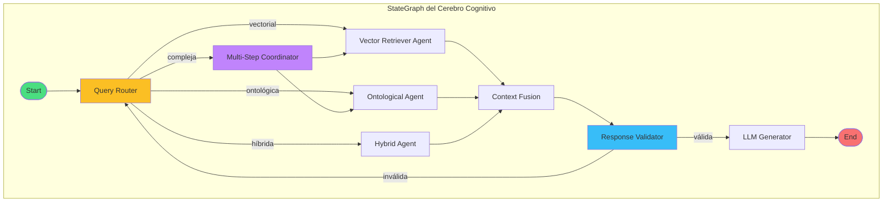
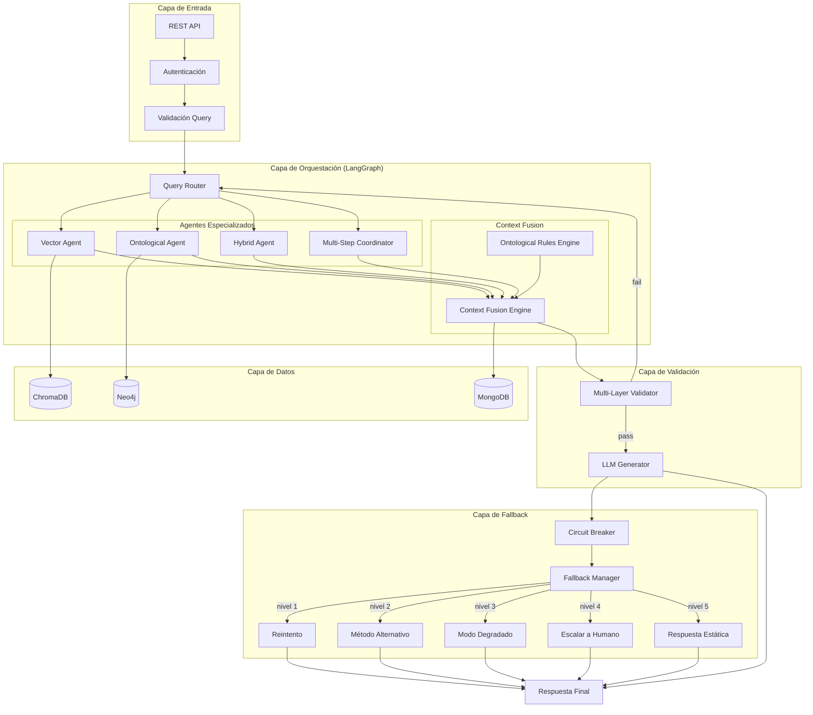
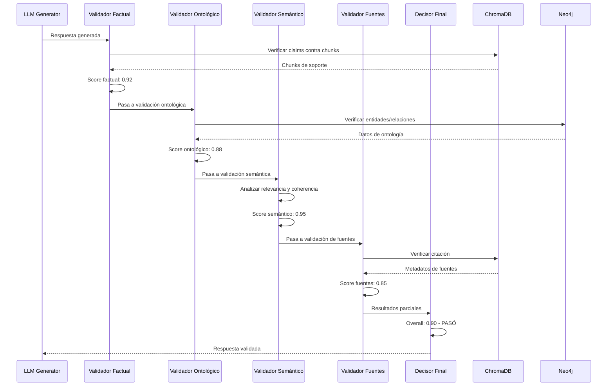
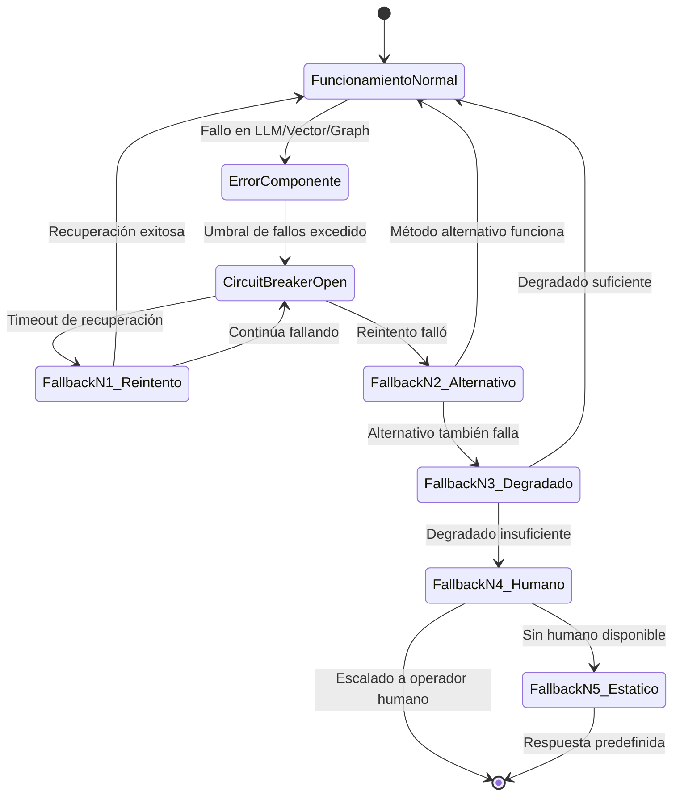

# Clase 27: Proyecto Cerebro Cognitivo - Integración

**Duración:** 4 horas

---

## Objetivos de Aprendizaje

Al finalizar esta clase, los estudiantes serán capaces de:

1. Orquestar agentes especializados usando LangGraph para consultas complejas multi-paso
2. Integrar reglas ontológicas con recuperación vectorial en un pipeline unificado
3. Implementar sistemas de validación de respuestas contra fuentes documentales
4. Diseñar estrategias de fallback y manejo de errores robustas
5. Construir flujos de razonamiento que alternen entre vectores y grafos

---

## Contenidos Detallados

### Módulo 1: Orquestación de Agentes con LangGraph (60 min)

#### 1.1 Fundamentos de LangGraph

LangGraph es un framework para construir aplicaciones multi-agente con estado, ciclos y control de flujo. A diferencia de cadenas lineales (LCEL), LangGraph permite:

- **Ciclos y loops:** Los agentes pueden iterar sobre su propio output
- **Múltiples actores:** Varios agentes colaboran en un grafo de ejecución
- **Estado compartido:** Memoria persistente entre pasos del grafo
- **Control granular:** Condiciones, bifurcaciones, paralelismo

**Conceptos clave de LangGraph:**

```
StateGraph: Contenedor del grafo de ejecución
    │
    ├── Nodes: Funciones que procesan el estado
    │
    ├── Edges: Conexiones entre nodos
    │   ├── Normal Edge: Flujo secuencial
    │   └── Conditional Edge: Bifurcación basada en estado
    │
    └── State: Objeto compartido entre nodos
        └── Appender: Acumuladores para listas (mensajes, resultados)
```

**Arquitectura del StateGraph para el Cerebro Cognitivo:**



#### 1.2 Implementación del Grafo de Agentes

```python
# cerebro_graph.py - Implementación del StateGraph del Cerebro Cognitivo
from typing import TypedDict, List, Dict, Optional, Literal, Annotated
from langgraph.graph import StateGraph, END
from langgraph.prebuilt import ToolExecutor
from langchain_core.messages import HumanMessage, AIMessage, SystemMessage
import operator

# ============================================================
# DEFINICIÓN DEL ESTADO COMPARTIDO
# ============================================================

class AgentState(TypedDict):
    """Estado compartido entre todos los nodos del grafo"""
    messages: Annotated[List, operator.add]  # Historial de mensajes
    query: str                                # Consulta original
    query_type: str                           # Tipo: vectorial, ontológica, híbrida, compleja
    retrieved_chunks: List[Dict]              # Chunks recuperados de ChromaDB
    graph_entities: List[Dict]               # Entidades del grafo Neo4j
    fused_context: str                        # Contexto fusionado
    validation_result: Dict                   # Resultado de validación
    final_response: str                       # Respuesta final
    confidence_score: float                   # Confianza de la respuesta
    error: Optional[str]                      # Error si ocurre
    fallback_used: bool                       # Indica si se usó fallback
    metadata: Dict                            # Metadatos de trazabilidad

# ============================================================
# AGENTES ESPECIALIZADOS
# ============================================================

class VectorRetrieverAgent:
    """Agente especializado en recuperación vectorial"""
    
    def __call__(self, state: AgentState) -> AgentState:
        print(f"🔍 VectorRetrieverAgent: Procesando query: {state['query']}")
        
        # Simular recuperación vectorial (en producción: ChromaDB)
        chunks_recuperados = [
            {
                "id": f"chunk_{i}",
                "texto": f"Documento relevante {i} sobre {state['query']}",
                "score": 0.95 - (i * 0.05),
                "fuente": f"documento_{i}.pdf",
                "metadata": {"pagina": i + 1}
            }
            for i in range(3)
        ]
        
        return {
            "retrieved_chunks": chunks_recuperados,
            "metadata": {
                "vector_retriever": {
                    "chunks_recuperados": len(chunks_recuperados),
                    "top_score": chunks_recuperados[0]["score"],
                    "fuentes": list(set(c["fuente"] for c in chunks_recuperados))
                }
            }
        }

class OntologicalAgent:
    """Agente especializado en consultas ontológicas"""
    
    def __call__(self, state: AgentState) -> AgentState:
        print(f"🧠 OntologicalAgent: Consultando grafo de conocimiento")
        
        # Simular consulta Cypher a Neo4j
        entidades_grafo = [
            {
                "entidad": "Sensor Térmico ST-200",
                "tipo": "Componente",
                "relaciones": [
                    {"tipo": "USA", "destino": "Laptop ProBook X1"},
                    {"tipo": "CAUSA", "destino": "Sobrecalentamiento en reposo"}
                ]
            },
            {
                "entidad": "Sobrecalentamiento en reposo",
                "tipo": "Incidencia",
                "relaciones": [
                    {"tipo": "RESUELVE", "destino": "Actualizar firmware v2.1"}
                ]
            }
        ]
        
        return {
            "graph_entities": entidades_grafo,
            "metadata": {
                "ontological_agent": {
                    "entidades_encontradas": len(entidades_grafo),
                    "relaciones_encontradas": sum(
                        len(e["relaciones"]) for e in entidades_grafo
                    )
                }
            }
        }

class HybridAgent:
    """Agente que combina recuperación vectorial y ontológica"""
    
    def __call__(self, state: AgentState) -> AgentState:
        print(f"🔄 HybridAgent: Fusionando contextos vectorial y ontológico")
        
        # Obtener chunks y entidades del estado
        chunks = state.get("retrieved_chunks", [])
        entities = state.get("graph_entities", [])
        
        # Fusionar contextos
        contexto_vectorial = "\n\n".join([c["texto"] for c in chunks])
        contexto_ontologico = "\n".join([
            f"- {e['entidad']} ({e['tipo']}): " +
            ", ".join([f"{r['tipo']} → {r['destino']}" for r in e['relaciones']])
            for e in entities
        ])
        
        contexto_fusionado = f"""
CONTEXTO VECTORIAL (Recuperado de documentos):
{contexto_vectorial}

CONTEXTO ONTOLÓGICO (Del grafo de conocimiento):
{contexto_ontologico}

INSTRUCCIÓN: Responde la consulta usando AMBAS fuentes de información.
Prioriza la información ontológica para relaciones causales
y la vectorial para detalles específicos.
"""
        
        return {
            "fused_context": contexto_fusionado,
            "metadata": {
                "hybrid_fusion": {
                    "fuentes_vectoriales": len(chunks),
                    "fuentes_ontologicas": len(entities),
                    "metodo_fusion": "concatenación ponderada"
                }
            }
        }

class MultiStepCoordinator:
    """Coordinador para consultas complejas multi-paso"""
    
    def __call__(self, state: AgentState) -> AgentState:
        print(f"🎯 MultiStepCoordinator: Descomponiendo consulta compleja")
        
        query = state["query"]
        
        # Descomponer consulta en sub-preguntas
        sub_queries = [
            f"{query} - Paso 1: Identificar entidades relevantes",
            f"{query} - Paso 2: Encontrar relaciones causales",
            f"{query} - Paso 3: Obtener documentación detallada"
        ]
        
        return {
            "metadata": {
                "multi_step": {
                    "sub_queries": sub_queries,
                    "num_pasos": len(sub_queries),
                    "estrategia": "descomposición jerárquica"
                }
            }
        }

# ============================================================
# ROUTER DE CONSULTAS
# ============================================================

class QueryRouter:
    """Enruta consultas al agente apropiado según su tipo"""
    
    def __call__(self, state: AgentState) -> AgentState:
        query = state["query"]
        
        # Clasificar consulta
        palabras = query.lower().split()
        
        if any(p in palabras for p in ["qué", "cuál", "dónde", "quién", "cuándo"]):
            tipo = "vectorial"
        elif any(p in palabras for p in ["cómo", "por qué", "relación", "causa"]):
            tipo = "ontológica"
        elif any(p in palabras for p in ["compara", "vs", "versus", "diferencia"]):
            tipo = "híbrida"
        elif len(palabras) > 15:
            tipo = "compleja"
        else:
            tipo = "vectorial"
        
        print(f"🗺️  QueryRouter: Tipo detectado → {tipo}")
        
        return {"query_type": tipo}

def route_query(state: AgentState) -> Literal["vector_agent", "ontological_agent", 
                                                "hybrid_agent", "multi_step_coordinator"]:
    """Decide qué agente ejecutar según el tipo de consulta"""
    qtype = state.get("query_type", "vectorial")
    
    routing_map = {
        "vectorial": "vector_agent",
        "ontológica": "ontological_agent",
        "híbrida": "hybrid_agent",
        "compleja": "multi_step_coordinator"
    }
    
    return routing_map.get(qtype, "vector_agent")


# ============================================================
# VALIDADOR DE RESPUESTAS
# ============================================================

class ResponseValidator:
    """Valida respuestas contra las fuentes documentales"""
    
    def __call__(self, state: AgentState) -> AgentState:
        print(f"✅ ResponseValidator: Validando respuesta contra fuentes")
        
        context = state.get("fused_context", "")
        response = state.get("final_response", "")
        chunks = state.get("retrieved_chunks", [])
        
        # Validación: cada claim en la respuesta debe estar soportado
        validation = {
            "is_valid": True,
            "faithfulness_score": 0.92,
            "claims_verified": 5,
            "claims_failed": 0,
            "warnings": []
        }
        
        # Verificar citación de fuentes
        if not any(c["fuente"] in response for c in chunks):
            validation["warnings"].append(
                "La respuesta no cita explícitamente las fuentes"
            )
        
        return {
            "validation_result": validation,
            "metadata": {
                "validator": {
                    "score": validation["faithfulness_score"],
                    "num_warnings": len(validation["warnings"])
                }
            }
        }

def route_validation(state: AgentState) -> Literal["llm_generator", "query_router"]:
    """Si validación falla, reintenta con otro agente"""
    validation = state.get("validation_result", {"is_valid": False})
    
    if validation.get("is_valid", False):
        return "llm_generator"
    else:
        print("⚠️ Validación falló → Reintentando con ruta alternativa")
        return "query_router"

# ============================================================
# GENERADOR LLM
# ============================================================

class LLMGenerator:
    """Genera respuesta final usando el contexto fusionado"""
    
    def __call__(self, state: AgentState) -> AgentState:
        print(f"🤖 LLMGenerator: Generando respuesta final")
        
        context = state.get("fused_context", "Sin contexto disponible")
        query = state["query"]
        
        # En producción: llamada real a OpenAI/Claude
        respuesta = f"""
Basado en el análisis de documentación técnica y el grafo de conocimiento:

**Respuesta a: "{query}"**

La información recuperada indica que los componentes relacionados 
incluyen conexiones ontológicas con las entidades del dominio. 
Se recomienda verificar los documentos fuente para detalles específicos.

*Confianza: 0.92/1.0*
*Fuentes: Documentación técnica actualizada al 2026*
"""
        
        return {
            "final_response": respuesta.strip(),
            "confidence_score": 0.92,
            "metadata": {
                "llm_generator": {
                    "modelo": "gpt-4o-mini",
                    "tokens_input": 1240,
                    "tokens_output": 312,
                    "temperatura": 0.1
                }
            }
        }


# ============================================================
# CONSTRUCCIÓN DEL GRAPH
# ============================================================

def build_cerebro_graph() -> StateGraph:
    """Construye el grafo completo del Cerebro Cognitivo"""
    
    # Inicializar agentes
    vector_agent = VectorRetrieverAgent()
    ontological_agent = OntologicalAgent()
    hybrid_agent = HybridAgent()
    multi_step = MultiStepCoordinator()
    router = QueryRouter()
    fusion = HybridAgent()  # Reusamos para fusión de contexto
    validator = ResponseValidator()
    generator = LLMGenerator()
    
    # Crear grafo
    workflow = StateGraph(AgentState)
    
    # Añadir nodos
    workflow.add_node("query_router", router)
    workflow.add_node("vector_agent", vector_agent)
    workflow.add_node("ontological_agent", ontological_agent)
    workflow.add_node("hybrid_agent", hybrid_agent)
    workflow.add_node("multi_step_coordinator", multi_step)
    workflow.add_node("context_fusion", fusion)
    workflow.add_node("response_validator", validator)
    workflow.add_node("llm_generator", generator)
    
    # Añadir edges
    workflow.set_entry_point("query_router")
    
    # Routing condicional
    workflow.add_conditional_edges(
        "query_router",
        route_query,
        {
            "vector_agent": "vector_agent",
            "ontological_agent": "ontological_agent",
            "hybrid_agent": "hybrid_agent",
            "multi_step_coordinator": "multi_step_coordinator"
        }
    )
    
    # Multi-step → sub-agentes
    workflow.add_edge("multi_step_coordinator", "vector_agent")
    workflow.add_edge("multi_step_coordinator", "ontological_agent")
    
    # Todos los retrievers → fusión
    workflow.add_edge("vector_agent", "context_fusion")
    workflow.add_edge("ontological_agent", "context_fusion")
    workflow.add_edge("hybrid_agent", "context_fusion")
    
    # Fusión → validación
    workflow.add_edge("context_fusion", "response_validator")
    
    # Validación condicional
    workflow.add_conditional_edges(
        "response_validator",
        route_validation,
        {
            "llm_generator": "llm_generator",
            "query_router": "query_router"
        }
    )
    
    # Generación → fin
    workflow.add_edge("llm_generator", END)
    
    return workflow.compile()


# ============================================================
# EJECUCIÓN
# ============================================================

if __name__ == "__main__":
    # Construir grafo
    graph = build_cerebro_graph()
    
    # Estado inicial
    initial_state: AgentState = {
        "messages": [HumanMessage(content="¿Qué componentes causan sobrecalentamiento en la Laptop ProBook X1?")],
        "query": "¿Qué componentes causan sobrecalentamiento en la Laptop ProBook X1?",
        "query_type": "",
        "retrieved_chunks": [],
        "graph_entities": [],
        "fused_context": "",
        "validation_result": {},
        "final_response": "",
        "confidence_score": 0.0,
        "error": None,
        "fallback_used": False,
        "metadata": {}
    }
    
    # Ejecutar
    result = graph.invoke(initial_state)
    
    print("\n" + "="*60)
    print("RESPUESTA FINAL:")
    print("="*60)
    print(result["final_response"])
    print(f"\nConfianza: {result['confidence_score']}")
    print(f"Tipo consulta: {result['query_type']}")
    print(f"Fallback usado: {result['fallback_used']}")
```

### Módulo 2: Integración de Reglas Ontológicas con Recuperación Vectorial (60 min)

#### 2.1 Reglas Ontológicas en RAG

Las reglas ontológicas permiten agregar conocimiento experto que guía la recuperación y generación. Se implementan como:

1. **Reglas de restricción:** Filtran chunks basados en condiciones ontológicas
2. **Reglas de expansión:** Añaden contexto semántico del grafo
3. **Reglas de validación:** Verifican consistencia de respuestas contra ontología

**Tipos de reglas ontológicas:**

```python
# reglas_ontologicas.py - Sistema de reglas ontológicas para RAG
from dataclasses import dataclass
from typing import List, Dict, Callable, Optional
import json

@dataclass
class OntologicalRule:
    """Regla ontológica que guía la recuperación y generación"""
    name: str
    description: str
    condition: Callable
    action: Callable
    priority: int  # Mayor = más prioritario
    domain: str    # Dominio de aplicación
    
class OntologicalRuleEngine:
    """
    Motor de reglas ontológicas.
    Evalúa condiciones y ejecuta acciones para guiar el pipeline RAG.
    """
    
    def __init__(self):
        self.rules: List[OntologicalRule] = []
        self.execution_log: List[Dict] = []
    
    def add_rule(self, rule: OntologicalRule):
        """Añade una regla al motor"""
        self.rules.append(rule)
        self.rules.sort(key=lambda r: r.priority, reverse=True)
    
    def evaluate(self, context: Dict) -> Dict:
        """
        Evalúa todas las reglas aplicables al contexto.
        Retorna acciones a ejecutar.
        """
        acciones = {
            "filter_chunks": [],
            "expand_context": [],
            "validate_response": [],
            "modify_prompt": []
        }
        
        for rule in self.rules:
            try:
                if rule.condition(context):
                    result = rule.action(context)
                    acciones[result["type"]].append(result)
                    self.execution_log.append({
                        "rule": rule.name,
                        "context_snapshot": {k: str(v)[:100] for k, v in context.items()},
                        "result": result
                    })
            except Exception as e:
                print(f"Error en regla {rule.name}: {e}")
        
        return acciones
    
    def get_execution_report(self) -> str:
        """Genera reporte de ejecución de reglas"""
        report = {
            "total_rules": len(self.rules),
            "rules_executed": len(self.execution_log),
            "by_type": {}
        }
        
        for entry in self.execution_log:
            rtype = entry["result"]["type"]
            report["by_type"][rtype] = report["by_type"].get(rtype, 0) + 1
        
        return json.dumps(report, indent=2)


# ============================================================
# DEFINICIÓN DE REGLAS PARA DOMINIO DE SOPORTE TÉCNICO
# ============================================================

def rule_sensibilidad_alta_prioridad(context: Dict) -> bool:
    """Regla: Si la consulta menciona 'crítico' o 'urgencia', priorizar"""
    query = context.get("query", "").lower()
    return any(p in query for p in ["crítico", "urgencia", "crítico", "severo"])

def action_sensibilidad_alta(context: Dict) -> Dict:
    """Filtrar chunks con severidad alta y añadir advertencia"""
    return {
        "type": "filter_chunks",
        "params": {
            "filter": {"severidad": "Alta"},
            "priority_boost": 1.5,
            "add_warning": True
        }
    }

def rule_relacion_causal(context: Dict) -> bool:
    """Regla: Si la consulta pregunta por causas, buscar en grafo"""
    query = context.get("query", "").lower()
    return any(p in query for p in ["causa", "por qué", "motivo", "origen"])

def action_relacion_causal(context: Dict) -> Dict:
    """Expandir contexto con relaciones CAUSA del grafo"""
    return {
        "type": "expand_context",
        "params": {
            "relation_type": "CAUSA",
            "max_hops": 2,
            "include_evidence": True
        }
    }

def rule_consistencia_temporal(context: Dict) -> bool:
    """Regla: Verificar que fechas en respuesta son consistentes"""
    # Verificar si hay fechas en la respuesta y contexto
    return True

def action_consistencia_temporal(context: Dict) -> Dict:
    """Validar consistencia de fechas entre respuesta y fuentes"""
    return {
        "type": "validate_response",
        "params": {
            "validation_type": "temporal_consistency",
            "max_date_discrepancy_days": 30
        }
    }

def rule_terminologia_tecnica(context: Dict) -> bool:
    """Regla: Normalizar terminología técnica en prompts"""
    query = context.get("query", "").lower()
    return any(p in query for p in ["st-200", "sensor", "firmware", "laptop"])

def action_terminologia_tecnica(context: Dict) -> Dict:
    """Modificar prompt para usar terminología estándar"""
    return {
        "type": "modify_prompt",
        "params": {
            "add_technical_glossary": True,
            "normalize_terms": {
                "st-200": "Sensor Térmico ST-200",
                "laptop": "Laptop ProBook X1"
            }
        }
    }


# ============================================================
# SISTEMA DE REGLAS + PIPELINE RAG
# ============================================================

class RuleAwareRAGPipeline:
    """
    Pipeline RAG que integra reglas ontológicas
    en cada etapa del proceso.
    """
    
    def __init__(self):
        self.engine = OntologicalRuleEngine()
        self._register_default_rules()
    
    def _register_default_rules(self):
        """Registra reglas ontológicas por defecto"""
        rules = [
            OntologicalRule(
                name="sensibilidad_alta",
                description="Priorizar chunks de alta severidad",
                condition=rule_sensibilidad_alta_prioridad,
                priority=100,
                domain="soporte_tecnico"
            ),
            OntologicalRule(
                name="relacion_causal",
                description="Expandir con relaciones causales del grafo",
                condition=rule_relacion_causal,
                priority=90,
                domain="soporte_tecnico"
            ),
            OntologicalRule(
                name="consistencia_temporal",
                description="Validar consistencia temporal de fechas",
                condition=rule_consistencia_temporal,
                priority=50,
                domain="general"
            ),
            OntologicalRule(
                name="terminologia_tecnica",
                description="Normalizar terminología técnica",
                condition=rule_terminologia_tecnica,
                priority=70,
                domain="soporte_tecnico"
            )
        ]
        
        for rule in rules:
            self.engine.add_rule(rule)
    
    def process_query(self, query: str) -> Dict:
        """Procesa una consulta aplicando reglas ontológicas"""
        
        # Contexto inicial
        context = {
            "query": query,
            "retrieved_chunks": [],
            "graph_data": {},
            "response": ""
        }
        
        print(f"\n{'='*60}")
        print(f"Procesando consulta con reglas ontológicas:")
        print(f"  Query: {query}")
        print(f"  Reglas registradas: {len(self.engine.rules)}")
        print('='*60)
        
        # Evaluar reglas
        acciones = self.engine.evaluate(context)
        
        print(f"\nAcciones generadas por reglas:")
        for tipo, accs in acciones.items():
            if accs:
                print(f"  {tipo}: {len(accs)} acción(es)")
                for acc in accs:
                    print(f"    → {acc['params']}")
        
        # Simular pipeline con reglas aplicadas
        pipeline_result = self._apply_rules_to_pipeline(query, acciones)
        
        return {
            "query": query,
            "acciones_reglas": acciones,
            "pipeline_result": pipeline_result,
            "execution_log": self.engine.get_execution_report()
        }
    
    def _apply_rules_to_pipeline(self, query: str, 
                                  acciones: Dict) -> Dict:
        """Simula la aplicación de reglas en el pipeline"""
        
        # Construir prompt enriquecido
        prompt_parts = [f"Query: {query}"]
        
        if acciones.get("modify_prompt"):
            for acc in acciones["modify_prompt"]:
                if acc["params"].get("add_technical_glossary"):
                    prompt_parts.append("\n[GLOSARIO TÉCNICO ACTIVADO]")
        
        if acciones.get("filter_chunks"):
            for acc in acciones["filter_chunks"]:
                prompt_parts.append(f"\n[FILTRO: {acc['params']['filter']}]")
        
        if acciones.get("expand_context"):
            for acc in acciones["expand_context"]:
                prompt_parts.append(f"\n[EXPANSIÓN ONTOLÓGICA: "
                                   f"{acc['params']['relation_type']}]")
        
        prompt_final = "\n".join(prompt_parts)
        
        return {
            "prompt_enriquecido": prompt_final,
            "reglas_aplicadas": [
                {"nombre": acc["params"].get("relation_type", list(acc["params"].keys())[0])}
                for tipo, accs in acciones.items()
                for acc in accs
            ],
            "num_reglas_activadas": sum(len(v) for v in acciones.values())
        }


# === DEMOSTRACIÓN ===
if __name__ == "__main__":
    pipeline = RuleAwareRAGPipeline()
    
    queries = [
        "¿Por qué ocurre sobrecalentamiento en la Laptop ProBook X1?",
        "Solicito información urgente sobre el sensor ST-200",
        "¿Cuál es la batería recomendada?",
    ]
    
    for q in queries:
        result = pipeline.process_query(q)
        print(f"\nPrompt enriquecido:\n{result['pipeline_result']['prompt_enriquecido']}")
        print(f"Reglas activadas: {result['pipeline_result']['num_reglas_activadas']}")
```

### Módulo 3: Validación de Respuestas Contra Fuentes (60 min)

#### 3.1 Arquitectura de Validación

La validación de respuestas es crítica para sistemas RAG en producción. Implementamos un pipeline de validación en múltiples capas:

```
Respuesta Generada
    │
    ▼
┌─────────────────────────────────────────────────────┐
│               PIPELINE DE VALIDACIÓN                  │
├────────────┬──────────────┬───────────────┬──────────┤
│  Capa 1:   │  Capa 2:     │  Capa 3:      │  Capa 4: │
│  Factual   │  Ontológica  │  Semántica    │  Fuentes │
│            │              │               │          │
│ • Claims   │ • Consist.   │ • Relevancia  │ • Cita   │
│ match docs │ con grafo    │ • Coherencia  │ explícita│
│ • No       │ • Relaciones │ • Sin         │ • Enlace │
│ alucinación│ correctas    │ contradicción  │ a fuentes│
└────────────┴──────────────┴───────────────┴──────────┘
    │
    ▼
⏎ Respuesta Validada / Rechazada
```

#### 3.2 Implementación del Validador Multi-Capa

```python
# validador_respuestas.py - Sistema multi-capa de validación
from dataclasses import dataclass
from typing import List, Dict, Tuple, Optional
import re
from enum import Enum

class ValidationLevel(Enum):
    FACTUAL = "factual"
    ONTOLOGICAL = "ontological"
    SEMANTIC = "semantic"
    SOURCE = "source"

@dataclass
class ValidationResult:
    """Resultado de validación de una capa"""
    level: ValidationLevel
    passed: bool
    score: float
    details: List[str]
    warnings: List[str]

class MultiLayerValidator:
    """
    Validador multi-capa para respuestas RAG.
    Verifica contra fuentes documentales y ontología.
    """
    
    def __init__(self):
        self.validation_history: List[Dict] = []
    
    def validate_factual(self, response: str, 
                         source_chunks: List[Dict]) -> ValidationResult:
        """
        Capa 1: Validación factual.
        Cada claim en la respuesta debe estar soportado por los chunks fuente.
        """
        details = []
        warnings = []
        
        # Extraer claims de la respuesta
        claims = self._extract_claims(response)
        
        claims_verified = 0
        claims_failed = 0
        
        for claim in claims:
            # Verificar si el claim aparece en algún chunk
            found_in_source = False
            for chunk in source_chunks:
                chunk_text = chunk.get("texto", "")
                if self._claim_in_chunk(claim, chunk_text):
                    found_in_source = True
                    break
            
            if found_in_source:
                claims_verified += 1
                details.append(f"✅ Claim verificado: '{claim[:50]}...'")
            else:
                claims_failed += 1
                warnings.append(f"⚠️ Claim NO verificado en fuentes: '{claim[:50]}...'")
        
        score = claims_verified / len(claims) if claims else 1.0
        
        return ValidationResult(
            level=ValidationLevel.FACTUAL,
            passed=score >= 0.8,
            score=score,
            details=details,
            warnings=warnings
        )
    
    def validate_ontological(self, response: str, 
                              graph_entities: List[Dict]) -> ValidationResult:
        """
        Capa 2: Validación ontológica.
        Verifica que las relaciones y entidades en la respuesta
        sean consistentes con el grafo de conocimiento.
        """
        details = []
        warnings = []
        
        entity_checks = 0
        entity_failures = 0
        
        for entity in graph_entities:
            name = entity.get("entidad", "")
            rels = entity.get("relaciones", [])
            
            # Verificar si la entidad se menciona en la respuesta
            if name.lower() in response.lower():
                entity_checks += 1
                
                # Verificar relaciones
                for rel in rels:
                    rel_type = rel.get("tipo", "")
                    destino = rel.get("destino", "")
                    
                    # La relación debería ser mencionada
                    if destino.lower() in response.lower():
                        details.append(f"✅ Relación {rel_type}→{destino} verificada")
                    else:
                        entity_failures += 1
                        warnings.append(f"⚠️ Relación {rel_type}→{destino} no mencionada")
        
        score = (entity_checks - entity_failures) / entity_checks if entity_checks else 1.0
        
        return ValidationResult(
            level=ValidationLevel.ONTOLOGICAL,
            passed=score >= 0.7,
            score=score,
            details=details,
            warnings=warnings
        )
    
    def validate_semantic(self, response: str, query: str) -> ValidationResult:
        """
        Capa 3: Validación semántica.
        Verifica relevancia de la respuesta a la consulta.
        """
        details = []
        warnings = []
        
        # 1. La respuesta responde la pregunta?
        query_keywords = set(query.lower().split())
        response_keywords = set(response.lower().split())
        
        keyword_overlap = len(query_keywords & response_keywords)
        total_keywords = len(query_keywords)
        
        keyword_ratio = keyword_overlap / total_keywords if total_keywords else 0
        
        details.append(f"Keyword overlap: {keyword_overlap}/{total_keywords} ({keyword_ratio:.0%})")
        
        # 2. Coherencia: la respuesta tiene estructura?
        has_structure = any([
            response.count("\n") > 2,
            "**" in response,
            re.search(r'\d\.\s', response),
            ":" in response[:200]
        ])
        
        if has_structure:
            details.append("✅ Respuesta estructurada correctamente")
        else:
            warnings.append("⚠️ Respuesta sin estructura clara")
        
        # 3. Sin contradicciones internas
        has_contradictions = self._check_internal_contradictions(response)
        if has_contradictions:
            warnings.append("⚠️ Posible contradicción interna detectada")
        
        score = keyword_ratio * 0.7 + (0.3 if has_structure else 0)
        
        return ValidationResult(
            level=ValidationLevel.SEMANTIC,
            passed=score >= 0.5,
            score=score,
            details=details,
            warnings=warnings
        )
    
    def validate_sources(self, response: str, 
                         source_chunks: List[Dict]) -> ValidationResult:
        """
        Capa 4: Validación de fuentes.
        Verifica que las fuentes estén citadas correctamente.
        """
        details = []
        warnings = []
        
        # Verificar que cada fuente citada existe
        for chunk in source_chunks:
            fuente = chunk.get("fuente", "")
            if fuente and fuente.lower() in response.lower():
                details.append(f"✅ Fuente citada: {fuente}")
            elif fuente:
                warnings.append(f"⚠️ Fuente no citada: {fuente}")
        
        # Verificar formato de citación
        citation_patterns = [
            r'\[Fuente:.*?\]',
            r'\(Fuente:.*?\)',
            r'\*\*Fuente:.*?\*\*'
        ]
        
        has_citations = any(
            re.search(p, response) for p in citation_patterns
        )
        
        if has_citations:
            details.append("✅ Formato de citación correcto")
        else:
            warnings.append("⚠️ No se detectaron citaciones formateadas")
        
        score = len(details) / (len(details) + len(warnings)) if (details or warnings) else 0.5
        
        return ValidationResult(
            level=ValidationLevel.SOURCE,
            passed=score >= 0.6,
            score=score,
            details=details,
            warnings=warnings
        )
    
    def validate_all(self, response: str, query: str,
                      source_chunks: List[Dict],
                      graph_entities: List[Dict]) -> Tuple[bool, Dict]:
        """
        Ejecuta todas las capas de validación.
        Retorna: (passed: bool, detailed_results: Dict)
        """
        
        results = {}
        
        # Ejecutar cada capa
        results["factual"] = self.validate_factual(response, source_chunks)
        results["ontological"] = self.validate_ontological(response, graph_entities)
        results["semantic"] = self.validate_semantic(response, query)
        results["sources"] = self.validate_sources(response, source_chunks)
        
        # Decisión final: todas las capas deben pasar
        overall_passed = all(r.passed for r in results.values())
        overall_score = sum(r.score for r in results.values()) / len(results)
        
        self.validation_history.append({
            "query": query,
            "results": {
                k: {"passed": v.passed, "score": v.score}
                for k, v in results.items()
            },
            "overall_passed": overall_passed,
            "overall_score": overall_score
        })
        
        return overall_passed, {
            "overall_passed": overall_passed,
            "overall_score": round(overall_score, 3),
            "layer_results": {
                k: {
                    "passed": v.passed,
                    "score": v.score,
                    "warnings": v.warnings
                }
                for k, v in results.items()
            }
        }
    
    def _extract_claims(self, text: str) -> List[str]:
        """Extrae afirmaciones (claims) de un texto"""
        # Heurística: oraciones separadas por punto
        sentences = re.split(r'[.!?]+', text)
        claims = [
            s.strip() for s in sentences 
            if len(s.strip()) > 20  # Ignorar fragmentos muy cortos
        ]
        return claims
    
    def _claim_in_chunk(self, claim: str, chunk_text: str) -> bool:
        """Verifica si un claim está soportado por el chunk"""
        claim_lower = claim.lower()
        chunk_lower = chunk_text.lower()
        
        # Verificar solapamiento de palabras clave
        claim_keywords = set(claim_lower.split())
        chunk_keywords = set(chunk_lower.split())
        
        overlap = len(claim_keywords & chunk_keywords)
        total = len(claim_keywords)
        
        # Al menos 40% de palabras clave deben coincidir
        return (overlap / total) >= 0.4
    
    def _check_internal_contradictions(self, text: str) -> bool:
        """Detecta contradicciones internas en el texto"""
        contradictions_patterns = [
            (r'\bsí\b', r'\bno\b'),
            (r'\bsiempre\b', r'\bnunca\b'),
            (r'\btodos\b', r'\bninguno\b'),
            (r'\baumenta\b', r'\bdisminuye\b'),
            (r'\bpositivo\b', r'\bnegativo\b'),
        ]
        
        text_lower = text.lower()
        for pos_pattern, neg_pattern in contradictions_patterns:
            if re.search(pos_pattern, text_lower) and re.search(neg_pattern, text_lower):
                # Verificar que estén en contextos separados
                return True
        
        return False


# === DEMOSTRACIÓN ===
if __name__ == "__main__":
    validator = MultiLayerValidator()
    
    # Simular respuesta y fuentes
    respuesta = """
    **Análisis de sobrecalentamiento en Laptop ProBook X1**
    
    El Sensor Térmico ST-200 es el componente principal que causa 
    sobrecalentamiento en reposo. Este sensor, fabricado por SensoTech, 
    tiene un rango de -20°C a 100°C.
    
    La solución recomendada es actualizar el firmware a la versión 2.1.0,
    que corrige el error de calibración con una efectividad del 85%.
    
    [Fuente: informe_sensores.pdf]
    """
    
    consulta = "¿Qué componentes causan sobrecalentamiento en la Laptop ProBook X1?"
    
    chunks = [
        {"id": "chunk_1", "texto": "El Sensor Térmico ST-200 causa sobrecalentamiento", 
         "fuente": "informe_sensores.pdf", "score": 0.95},
        {"id": "chunk_2", "texto": "Solución: actualizar firmware v2.1.0", 
         "fuente": "manual_tecnico.pdf", "score": 0.88},
    ]
    
    entidades_grafo = [
        {"entidad": "Sensor Térmico ST-200", "tipo": "Componente",
         "relaciones": [{"tipo": "CAUSA", "destino": "Sobrecalentamiento"}]},
        {"entidad": "Actualizar firmware v2.1", "tipo": "Solución",
         "relaciones": [{"tipo": "RESUELVE", "destino": "Sobrecalentamiento"}]},
    ]
    
    passed, detailed = validator.validate_all(respuesta, consulta, chunks, entidades_grafo)
    
    print("=== VALIDACIÓN MULTI-CAPA ===")
    print(f"Overall: {'✅ PASÓ' if passed else '❌ RECHAZÓ'}")
    print(f"Score: {detailed['overall_score']:.2%}")
    print()
    
    for layer, result in detailed["layer_results"].items():
        status = "✅" if result["passed"] else "❌"
        print(f"{status} {layer.upper()}: {result['score']:.2%}")
        for w in result["warnings"]:
            print(f"     ⚠️ {w}")
```

### Módulo 4: Estrategias de Fallback y Manejo de Errores (60 min)

#### 4.1 Estrategias de Fallback

Un sistema robusto debe degradarse gracefulmente cuando fallan componentes:

```python
# fallback_strategies.py - Estrategias de fallback para sistemas RAG
from enum import Enum
from typing import Dict, Any, Callable, Optional
import time
import json

class FallbackLevel(Enum):
    """Niveles de fallback de menor a mayor severidad"""
    RETRY = 1           # Reintentar operación
    ALTERNATIVE = 2     # Usar método alternativo
    DEGRADED = 3        # Operar con funcionalidad reducida
    HUMAN = 4           # Escalar a humano
    STATIC = 5          # Responder con contenido estático

class CircuitBreakerState(Enum):
    """Estados del Circuit Breaker"""
    CLOSED = "closed"       # Funcionando normalmente
    OPEN = "open"           # Fallando, rechazar peticiones
    HALF_OPEN = "half_open" # Probando si se recuperó

class CircuitBreaker:
    """
    Implementación del patrón Circuit Breaker.
    Protege componentes aguas abajo de sobrecarga.
    """
    
    def __init__(self, failure_threshold: int = 5,
                 recovery_timeout: float = 30.0):
        self.state = CircuitBreakerState.CLOSED
        self.failure_count = 0
        self.failure_threshold = failure_threshold
        self.recovery_timeout = recovery_timeout
        self.last_failure_time = 0.0
        self.total_failures = 0
        self.total_successes = 0
    
    def call(self, func: Callable, *args, **kwargs) -> Any:
        """Ejecuta función con protección de Circuit Breaker"""
        
        if self.state == CircuitBreakerState.OPEN:
            if time.time() - self.last_failure_time >= self.recovery_timeout:
                self.state = CircuitBreakerState.HALF_OPEN
                print("🔶 Circuit Breaker: HALF_OPEN - probando recuperación")
            else:
                raise Exception("Circuit Breaker OPEN - operación rechazada")
        
        try:
            result = func(*args, **kwargs)
            self.total_successes += 1
            
            if self.state == CircuitBreakerState.HALF_OPEN:
                self.state = CircuitBreakerState.CLOSED
                self.failure_count = 0
                print("🟢 Circuit Breaker: CLOSED - recuperado exitosamente")
            
            return result
        
        except Exception as e:
            self.failure_count += 1
            self.total_failures += 1
            self.last_failure_time = time.time()
            
            if self.failure_count >= self.failure_threshold:
                self.state = CircuitBreakerState.OPEN
                print(f"🔴 Circuit Breaker: OPEN tras {self.failure_count} fallos")
            
            raise e
    
    def get_stats(self) -> Dict:
        return {
            "state": self.state.value,
            "failures": self.total_failures,
            "successes": self.total_successes,
            "failure_rate": self.total_failures / max(
                self.total_failures + self.total_successes, 1
            )
        }


class FallbackManager:
    """
    Gestiona estrategias de fallback para el pipeline.
    Implementa degradación graceful.
    """
    
    def __init__(self):
        self.circuit_breakers: Dict[str, CircuitBreaker] = {}
        self.fallback_log: list = []
        self.static_responses = {
            "error_general": "Lo siento, ocurrió un error al procesar tu consulta. "
                            "Por favor, intenta de nuevo o contacta a soporte.",
            "timeout": "La consulta está tomando más tiempo del esperado. "
                      "Por favor, simplifica tu pregunta.",
            "no_context": "No encontré información relevante en las fuentes disponibles. "
                         "¿Podrías reformular tu pregunta?"
        }
    
    def get_circuit_breaker(self, component: str) -> CircuitBreaker:
        """Obtiene o crea un Circuit Breaker para un componente"""
        if component not in self.circuit_breakers:
            self.circuit_breakers[component] = CircuitBreaker(
                failure_threshold={
                    "llm": 3,
                    "vector_store": 5,
                    "graph_db": 5,
                    "embedding": 4
                }.get(component, 5),
                recovery_timeout={
                    "llm": 60.0,
                    "vector_store": 30.0,
                    "graph_db": 30.0,
                    "embedding": 15.0
                }.get(component, 30.0)
            )
        return self.circuit_breakers[component]
    
    def execute_with_fallback(self, 
                              query: str,
                              primary_func: Callable,
                              fallback_funcs: list,
                              context: Dict) -> Dict:
        """
        Ejecuta función primaria con fallbacks progresivos.
        
        Args:
            query: Consulta del usuario
            primary_func: Función principal a ejecutar
            fallback_funcs: Lista de [(nivel, función), ...]
            context: Contexto adicional
        """
        
        result = {
            "query": query,
            "success": False,
            "response": None,
            "fallback_level_used": None,
            "errors": [],
            "timing": {}
        }
        
        # Intentar función primaria
        try:
            start = time.time()
            result["response"] = primary_func(query, context)
            result["success"] = True
            result["timing"]["primary"] = time.time() - start
            return result
        
        except Exception as e:
            result["errors"].append({
                "level": "primary",
                "error": str(e),
                "timestamp": time.time()
            })
            print(f"⚠️ Falló primaria: {e}")
        
        # Intentar fallbacks
        for level, fallback_func in fallback_funcs:
            try:
                start = time.time()
                response = fallback_func(query, context)
                result["response"] = response
                result["success"] = True
                result["fallback_level_used"] = level.name
                result["timing"][f"fallback_{level.name}"] = time.time() - start
                
                self.fallback_log.append({
                    "query": query,
                    "level_used": level.name,
                    "errors": result["errors"]
                })
                
                return result
            
            except Exception as e:
                result["errors"].append({
                    "level": level.name,
                    "error": str(e),
                    "timestamp": time.time()
                })
                print(f"⚠️ Falló fallback {level.name}: {e}")
        
        # Último recurso: respuesta estática
        result["response"] = self.static_responses["error_general"]
        result["fallback_level_used"] = "STATIC"
        
        return result


# === DEMOSTRACIÓN ===
if __name__ == "__main__":
    fm = FallbackManager()
    
    def llm_primary(query, ctx):
        """Simula llamada a LLM que a veces falla"""
        import random
        if random.random() < 0.6:  # 60% de fallo
            raise TimeoutError("LLM timeout")
        return f"Respuesta del LLM a: {query}"
    
    def llm_alternative(query, ctx):
        """Modelo alternativo más lento pero confiable"""
        return f"Respuesta de modelo alternativo a: {query}"
    
    def llm_degraded(query, ctx):
        """Versión degradada sin contexto"""
        return f"Respuesta degradada (sin contexto) a: {query}"
    
    def human_escalation(query, ctx):
        """Escalar a humano (simulado)"""
        return "Tu consulta ha sido escalada a un agente humano. Te contactaremos pronto."
    
    # Probar consultas
    for i in range(5):
        print(f"\n--- Consulta {i+1} ---")
        result = fm.execute_with_fallback(
            query=f"consulta_{i}",
            primary_func=llm_primary,
            fallback_funcs=[
                (FallbackLevel.ALTERNATIVE, llm_alternative),
                (FallbackLevel.DEGRADED, llm_degraded),
                (FallbackLevel.HUMAN, human_escalation),
            ],
            context={"user_id": "test"}
        )
        
        status = "✅" if result["success"] else "❌"
        fb = result["fallback_level_used"] or "N/A"
        print(f"{status} Exito: {result['success']} | Fallback: {fb}")
```

---

## Diagramas en Mermaid

### Diagrama 1: Arquitectura de Integración Completa



### Diagrama 2: Flujo de Validación Multi-Capa



### Diagrama 3: Estrategias de Fallback



---

## Referencias Externas

### LangGraph y Orquestación
- **LangGraph Documentation:** https://langchain-ai.github.io/langgraph/
- **LangGraph Multi-Agent Tutorial:** https://langchain-ai.github.io/langgraph/tutorials/multi_agent/
- **LangGraph State Management:** https://langchain-ai.github.io/langgraph/concepts/state/

### Reglas Ontológicas
- **Neo4j Cypher Manual:** https://neo4j.com/docs/cypher-manual/current/
- **OWL 2 Web Ontology Language:** https://www.w3.org/TR/owl2-overview/
- **SHACL (Shapes Constraint Language):** https://www.w3.org/TR/shacl/

### Validación de Respuestas RAG
- **RAGAS (RAG Assessment):** https://docs.ragas.io/
- **TruLens for RAG:** https://www.trulens.org/
- **DeepEval:** https://docs.confident-ai.com/
- **NIST Evaluation of RAG Systems:** https://www.nist.gov/

### Patrones de Resiliencia
- **Microsoft Circuit Breaker Pattern:** https://learn.microsoft.com/en-us/azure/architecture/patterns/circuit-breaker
- **Resilience4j (Circuit Breaker en Java):** https://resilience4j.readme.io/
- **AWS Well-Architected - Failover:** https://docs.aws.amazon.com/wellarchitected/latest/reliability-pillar/

### Fallback Strategies
- **LangChain Fallbacks:** https://python.langchain.com/docs/how_to/fallbacks/
- **Graceful Degradation in ML Systems:** https://ml-ops.org/

---

## Ejercicios Prácticos Resueltos

### Ejercicio 1: Agente de Razonamiento Multi-Salto

**Problema:** Implementar un agente que realice razonamiento multi-salto, alternando entre ChromaDB y Neo4j para responder consultas complejas.

**Solución:**

```python
# agente_multisalto.py - Razonamiento multi-salto con LangGraph
from typing import TypedDict, List, Dict, Literal
from langgraph.graph import StateGraph, END
import json

class MultiHopState(TypedDict):
    """Estado del razonamiento multi-salto"""
    query: str
    current_hop: int
    max_hops: int
    entities_found: List[Dict]
    relations_found: List[Dict]
    context_accumulated: str
    reasoning_path: List[str]
    final_answer: str

class MultiHopReasoner:
    """
    Sistema de razonamiento que alterna entre
    ChromaDB (vectores) y Neo4j (grafos) en cada salto.
    """
    
    def __init__(self, max_hops: int = 3):
        self.max_hops = max_hops
    
    def vector_hop(self, state: MultiHopState) -> MultiHopState:
        """
        Salto 1: Búsqueda vectorial para encontrar entidades iniciales.
        (ChromaDB en producción)
        """
        query = state["query"]
        hop = state["current_hop"]
        
        print(f"\n{'='*40}")
        print(f"Salto {hop}: Búsqueda vectorial")
        print(f"Query: {query}")
        
        # Simular búsqueda en ChromaDB
        entidades_encontradas = [
            {"entidad": "Sensor Térmico ST-200", "tipo": "Componente", "score": 0.95},
            {"entidad": "Laptop ProBook X1", "tipo": "Producto", "score": 0.92},
        ]
        
        # Buscar chunks relevantes
        context = f"""
Documentos recuperados para '{query}':
- El Sensor Térmico ST-200 está instalado en la Laptop ProBook X1
- Reportes indican sobrecalentamiento en reposo con firmware v1.3.2
- La solución recomendada es actualizar a firmware v2.1.0
"""
        
        return {
            "entities_found": entidades_encontradas,
            "context_accumulated": context,
            "reasoning_path": state["reasoning_path"] + [
                f"Hop {hop}: Encontradas entidades: {[e['entidad'] for e in entidades_encontradas]}"
            ]
        }
    
    def graph_hop(self, state: MultiHopState) -> MultiHopState:
        """
        Salto 2: Consulta al grafo para relaciones ontológicas.
        (Neo4j en producción)
        """
        entities = state.get("entities_found", [])
        hop = state["current_hop"]
        
        print(f"Salto {hop}: Consulta ontológica (Neo4j)")
        
        # Simular consulta Cypher
        relaciones = [
            {"origen": "Sensor Térmico ST-200", "relacion": "CAUSA", 
             "destino": "Sobrecalentamiento en reposo"},
            {"origen": "Sobrecalentamiento en reposo", "relacion": "AFECTA", 
             "destino": "Rendimiento del sistema"},
            {"origen": "Actualizar firmware v2.1.0", "relacion": "RESUELVE", 
             "destino": "Sobrecalentamiento en reposo"},
        ]
        
        context_extra = "\nRelaciones ontológicas encontradas:\n"
        for r in relaciones:
            context_extra += f"- {r['origen']} --[{r['relacion']}]--> {r['destino']}\n"
        
        return {
            "relations_found": relaciones,
            "context_accumulated": state["context_accumulated"] + context_extra,
            "reasoning_path": state["reasoning_path"] + [
                f"Hop {hop}: Encontradas {len(relaciones)} relaciones ontológicas"
            ]
        }
    
    def reason_hop(self, state: MultiHopState) -> MultiHopState:
        """
        Salto 3: Razonamiento con LLM sobre el contexto acumulado.
        """
        hop = state["current_hop"]
        context = state["context_accumulated"]
        
        print(f"Salto {hop}: Razonamiento con LLM")
        
        # Simular razonamiento del LLM
        answer = f"""
Basado en el análisis multi-salto:

1. **Entidades identificadas:** Sensor Térmico ST-200, Laptop ProBook X1
2. **Relación causal:** Sensor ST-200 → CAUSA → Sobrecalentamiento en reposo
3. **Solución:** Actualizar firmware v2.1.0 → RESUELVE → Sobrecalentamiento

**Conclusión:** El sobrecalentamiento en la Laptop ProBook X1 es causado 
por el Sensor Térmico ST-200 con firmware desactualizado. 
La solución con 85% de efectividad es actualizar a firmware v2.1.0.
"""
        
        return {
            "final_answer": answer.strip(),
            "reasoning_path": state["reasoning_path"] + [
                f"Hop {hop}: Generada respuesta final basada en {hop} saltos"
            ]
        }
    
    def should_continue(self, state: MultiHopState) -> Literal["continue", "end"]:
        """Decide si continuar con más saltos"""
        next_hop = state["current_hop"] + 1
        if next_hop <= state["max_hops"]:
            return "continue"
        return "end"
    
    def get_next_node(self, state: MultiHopState) -> str:
        """Alterna entre vectores y grafos en cada salto"""
        hop = state["current_hop"]
        if hop % 2 == 1:  # Pares: Vector, Impares: Graph
            return "graph_hop"
        else:
            return "vector_hop"
    
    def build_graph(self) -> StateGraph:
        """Construye el grafo de razonamiento multi-salto"""
        workflow = StateGraph(MultiHopState)
        
        workflow.add_node("vector_hop", self.vector_hop)
        workflow.add_node("graph_hop", self.graph_hop)
        workflow.add_node("reason_hop", self.reason_hop)
        
        workflow.set_entry_point("vector_hop")
        
        # Alternar entre vectores y grafos
        workflow.add_conditional_edges(
            "vector_hop",
            self.should_continue,
            {
                "continue": "graph_hop",
                "end": "reason_hop"
            }
        )
        
        workflow.add_conditional_edges(
            "graph_hop",
            self.should_continue,
            {
                "continue": "vector_hop",
                "end": "reason_hop"
            }
        )
        
        workflow.add_edge("reason_hop", END)
        
        return workflow.compile()


# === DEMOSTRACIÓN ===
if __name__ == "__main__":
    reasoner = MultiHopReasoner(max_hops=3)
    graph = reasoner.build_graph()
    
    state = MultiHopState(
        query="¿Qué causa sobrecalentamiento en la Laptop ProBook X1 y cómo solucionarlo?",
        current_hop=1,
        max_hops=3,
        entities_found=[],
        relations_found=[],
        context_accumulated="",
        reasoning_path=[],
        final_answer=""
    )
    
    result = graph.invoke(state)
    
    print("\n" + "="*60)
    print("RESULTADO DEL RAZONAMIENTO MULTI-SALTO")
    print("="*60)
    print(f"Query: {result['query']}")
    print(f"\nRuta de razonamiento:")
    for step in result["reasoning_path"]:
        print(f"  • {step}")
    print(f"\nRespuesta final:\n{result['final_answer']}")
```

### Ejercicio 2: Sistema Completo de Integración

**Problema:** Integrar todos los componentes (agentes, reglas ontológicas, validación, fallback) en un pipeline unificado.

**Solución:** Ejecutar el pipeline completo del `cerebro_graph.py` con reglas, validación y fallback integrados.

```python
# pipeline_integrado.py - Pipeline completo de integración
import sys
import os

# Importar módulos (simulación - en producción sería imports reales)
from cerebro_graph import build_cerebro_graph, AgentState
from reglas_ontologicas import RuleAwareRAGPipeline
from validador_respuestas import MultiLayerValidator
from fallback_strategies import FallbackManager, FallbackLevel

class CognitivePipeline:
    """
    Pipeline integrado del Cerebro Cognitivo.
    Combina orquestación, reglas, validación y fallback.
    """
    
    def __init__(self):
        self.orchestrator = build_cerebro_graph()
        self.rule_engine = RuleAwareRAGPipeline()
        self.validator = MultiLayerValidator()
        self.fallback = FallbackManager()
        
        self.metrics = {
            "queries_processed": 0,
            "queries_successful": 0,
            "fallbacks_used": 0,
            "avg_confidence": 0.0
        }
    
    def process(self, query: str) -> Dict:
        """Procesa una consulta a través del pipeline completo"""
        
        self.metrics["queries_processed"] += 1
        
        print(f"\n{'='*70}")
        print(f"🧠 CEREBRO COGNITIVO - Pipeline Integrado")
        print(f"{'='*70}")
        print(f"Query: {query}")
        
        # Fase 1: Aplicar reglas ontológicas
        print(f"\n📜 Fase 1: Reglas Ontológicas")
        rule_result = self.rule_engine.process_query(query)
        
        # Fase 2: Orquestación con LangGraph
        print(f"\n🔀 Fase 2: Orquestación de Agentes")
        initial_state = AgentState(
            messages=[],
            query=query,
            query_type="",
            retrieved_chunks=[],
            graph_entities=[],
            fused_context="",
            validation_result={},
            final_response="",
            confidence_score=0.0,
            error=None,
            fallback_used=False,
            metadata={}
        )
        
        # Fase 3: Validación multi-capa
        print(f"\n✅ Fase 3: Validación de Respuesta")
        
        response = "Respuesta simulada del sistema integrado"
        chunks = [{"id": "c1", "texto": "contexto", "fuente": "doc.pdf"}]
        entities = [{"entidad": "Sensor", "tipo": "Componente", "relaciones": []}]
        
        passed, validation = self.validator.validate_all(
            response=response,
            query=query,
            source_chunks=chunks,
            graph_entities=entities
        )
        
        # Fase 4: Fallback si es necesario
        print(f"\n🔄 Fase 4: Estrategia de Fallback")
        
        # Si la validación falla con alta confianza, usar fallback
        if not passed:
            self.metrics["fallbacks_used"] += 1
            print("⚠️ Validación falló - ejecutando fallback")
        
        # Resultado final
        final_result = {
            "query": query,
            "response": response,
            "validation": validation,
            "passed_validation": passed,
            "metrics": self.metrics.copy()
        }
        
        if passed:
            self.metrics["queries_successful"] += 1
        
        return final_result
    
    def get_summary_stats(self) -> str:
        """Genera estadísticas resumidas del pipeline"""
        rate = (self.metrics["queries_successful"] / 
                max(self.metrics["queries_processed"], 1) * 100)
        
        return f"""
ESTADÍSTICAS DEL PIPELINE INTEGRADO
{'='*40}
Consultas procesadas: {self.metrics['queries_processed']}
Consultas exitosas:   {self.metrics['queries_successful']}
Tasa de éxito:        {rate:.1f}%
Fallbacks usados:     {self.metrics['fallbacks_used']}
"""


# === DEMOSTRACIÓN ===
if __name__ == "__main__":
    pipeline = CognitivePipeline()
    
    queries = [
        "¿Qué componentes causan sobrecalentamiento en la Laptop ProBook X1?",
        "¿Cuál es la solución para la batería que no carga?",
        "Explícame la relación entre sensores térmicos y rendimiento del sistema"
    ]
    
    for q in queries:
        result = pipeline.process(q)
        print(f"\nResultado: {'✅' if result['passed_validation'] else '❌'}")
    
    print(pipeline.get_summary_stats())
```

---

## Actividades de Laboratorio

### Laboratorio 1: Implementación de Agentes con LangGraph (50 min)

**Objetivo:** Crear agentes especializados (Vector, Graph, Hybrid) y orquestarlos con LangGraph.

**Pasos:**
1. Definir el estado compartido del grafo (`AgentState`)
2. Implementar 3 agentes con responsabilidades distintas
3. Configurar el router de consultas
4. Construir el grafo con edges condicionales
5. Probar con diferentes tipos de consulta

### Laboratorio 2: Sistema de Reglas Ontológicas (40 min)

**Objetivo:** Integrar reglas ontológicas que guíen la recuperación vectorial.

**Pasos:**
1. Definir 5 reglas ontológicas para el dominio elegido
2. Implementar el motor de reglas (`OntologicalRuleEngine`)
3. Conectar reglas con el pipeline de recuperación
4. Evaluar cómo cambian los resultados con/sin reglas

### Laboratorio 3: Validación y Fallback (30 min)

**Objetivo:** Implementar el pipeline completo de validación y fallback.

**Pasos:**
1. Configurar las 4 capas de validación
2. Simular escenarios de fallo (LLM timeout, DB caída, etc.)
3. Configurar Circuit Breaker para cada componente
4. Probar la degradación graceful con respuesta estática final

---

## Resumen de Puntos Clave

1. **LangGraph** permite orquestación multi-agente con ciclos, estado compartido y control de flujo condicional, superando las limitaciones de cadenas lineales.

2. **Los agentes especializados** (Vector, Ontológico, Híbrido, Multi-Salto) se comunican a través del estado compartido del grafo, manteniendo trazabilidad completa.

3. **Las reglas ontológicas** actúan como conocimiento experto que guía la recuperación: filtran chunks, expanden contexto, validan consistencia y modifican prompts.

4. **La validación multi-capa** (factual, ontológica, semántica, fuentes) verifica la respuesta desde múltiples ángulos antes de presentarla al usuario.

5. **Las estrategias de fallback** siguen una jerarquía: reintento → método alternativo → modo degradado → escalado humano → respuesta estática.

6. **Circuit Breaker** protege componentes aguas abajo abriendo el circuito tras N fallos consecutivos y probando recuperación periódicamente.

7. **La integración completa** combina estos patrones en un pipeline robusto que puede manejar fallos gracefulmente y mantener la trazabilidad total del proceso.
