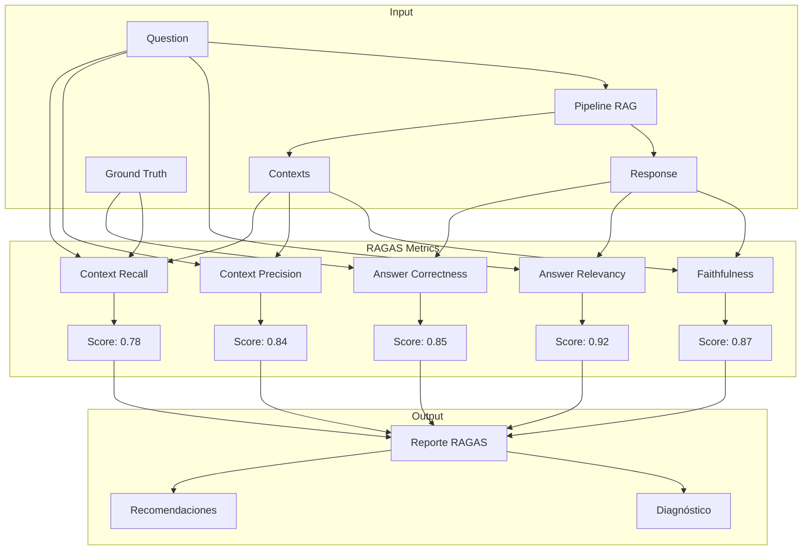
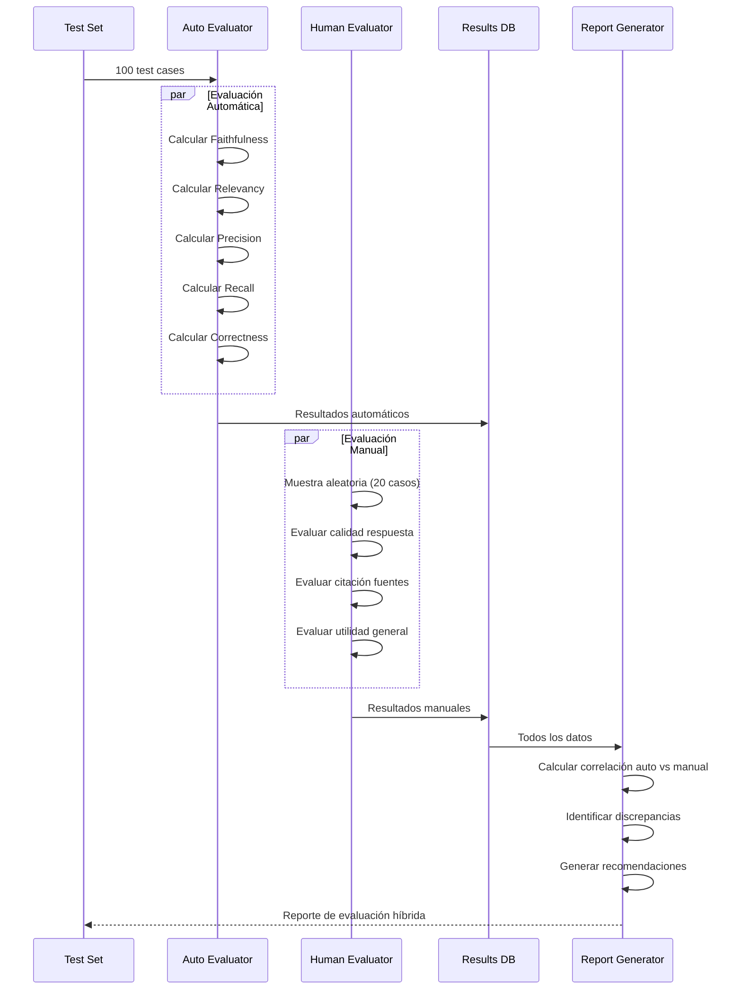
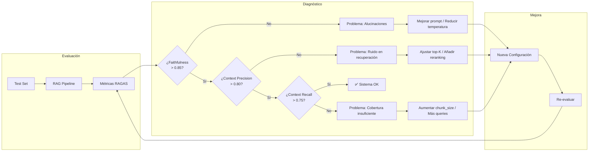

# Clase 28: Evaluación de Sistemas RAG

**Duración:** 4 horas

---

## Objetivos de Aprendizaje

Al finalizar esta clase, los estudiantes serán capaces de:

1. Comprender y calcular las métricas RAGAS: faithfulness, answer relevancy, context precision, context recall
2. Implementar pipelines de evaluación automatizada con RAGAS, TruLens y DeepEval
3. Diferenciar entre evaluación automatizada (métrica cuantitativa) y evaluación manual (humana)
4. Diagnosticar problemas en sistemas RAG mediante análisis de métricas
5. Diseñar estrategias de mejora basadas en resultados de evaluación

---

## Contenidos Detallados

### Módulo 1: RAGAS Metrics - Fundamentos (60 min)

#### 1.1 Introducción a RAGAS

RAGAS (RAG Assessment) es un framework de evaluación diseñado específicamente para sistemas Retrieval-Augmented Generation. Proporciona métricas que miden cada componente del pipeline RAG por separado.

**Componentes evaluados por RAGAS:**

```
┌─────────────────────────────────────────────────────────┐
│                    SISTEMA RAG                           │
├──────────────┬──────────────────┬───────────────────────┤
│  RETRIEVAL   │      RAG        │      GENERATION        │
│  (Indexación) │  (Pipeline)     │      (LLM Output)      │
├──────────────┼──────────────────┼───────────────────────┤
│ Context       │ Context          │ Faithfulness           │
│ Precision     │ Relevancy        │ Answer Relevancy       │
│ Context       │ Aspect           │ Answer Correctness     │
│ Recall        │ Critique         │ Harmfulness            │
└──────────────┴──────────────────┴───────────────────────┘
```

**Fórmulas fundamentales de las métricas RAGAS:**

1. **Faithfulness (Fidelidad):** Mide qué proporción de las afirmaciones en la respuesta están soportadas por el contexto recuperado.

```
Faithfulness = |Claims soportados por contexto| / |Total claims en respuesta|
```

2. **Answer Relevancy (Relevancia de respuesta):** Mide qué tan relevante es la respuesta generada respecto a la pregunta original.

```
Answer Relevancy = Similitud coseno entre(pregunta, respuesta_generada)
```

3. **Context Precision (Precisión de contexto):** Mide qué proporción de los chunks recuperados son realmente relevantes para la pregunta.

```
Context Precision @k = Σ(Precision@k * relevancia_k) / |chunks_relevantes|
```

4. **Context Recall (Cobertura de contexto):** Mide qué proporción de la información relevante fue recuperada.

```
Context Recall = |Chunks relevantes recuperados| / |Total chunks relevantes|
```

5. **Answer Correctness (Corrección de respuesta):** Mide la corrección factual comparando con una respuesta de referencia.

```
Answer Correctness = F1 entre(claims respuesta, claims ground_truth)
```

#### 1.2 Implementación Manual de Métricas RAGAS

```python
# metricas_ragas_manual.py - Implementación educativa de métricas RAGAS
import numpy as np
from typing import List, Dict, Tuple
from sklearn.feature_extraction.text import TfidfVectorizer
from sklearn.metrics.pairwise import cosine_similarity
import re

class RAGASEvaluatorManual:
    """
    Implementación manual de métricas RAGAS para propósitos educativos.
    En producción, usar la librería ragas.
    """
    
    def __init__(self):
        self.vectorizer = TfidfVectorizer(max_features=5000, ngram_range=(1, 2))
    
    def extract_claims(self, text: str) -> List[str]:
        """Extrae afirmaciones individuales de un texto"""
        # Dividir en oraciones
        sentences = re.split(r'(?<=[.!?])\s+', text)
        claims = []
        for s in sentences:
            s = s.strip()
            if len(s) > 10:  # Ignorar fragmentos muy cortos
                claims.append(s)
        return claims
    
    def faithfulness(self, response: str, context: str) -> float:
        """
        Faithfulness: Proporción de claims en la respuesta
        que están soportados por el contexto.
        
        Rango: [0, 1] - Mayor es mejor
        """
        claims = self.extract_claims(response)
        if not claims:
            return 1.0
        
        supported = 0
        for claim in claims:
            # Verificar si el claim está soportado por el contexto
            # Método simplificado: overlap de términos
            claim_terms = set(claim.lower().split())
            context_terms = set(context.lower().split())
            
            overlap = len(claim_terms & context_terms)
            total_claim_terms = len(claim_terms)
            
            # Si al menos 40% de términos del claim están en el contexto
            if total_claim_terms > 0 and overlap / total_claim_terms >= 0.4:
                supported += 1
        
        return supported / len(claims) if len(claims) > 0 else 1.0
    
    def answer_relevancy(self, question: str, response: str) -> float:
        """
        Answer Relevancy: Similitud semántica entre pregunta y respuesta.
        
        Rango: [0, 1] - Mayor es mejor
        """
        # Generar preguntas inversas (en producción: LLM genera pseudo-preguntas)
        # Simplificación: usar TF-IDF cosine similarity
        try:
            tfidf_matrix = self.vectorizer.fit_transform([question, response])
            similarity = cosine_similarity(tfidf_matrix[0:1], tfidf_matrix[1:2])[0][0]
            return max(0, min(1, float(similarity)))  # Normalizar
        except:
            return 0.5
    
    def context_precision(self, question: str, contexts: List[str], 
                          relevant_indices: List[int]) -> float:
        """
        Context Precision @k: Precisión en la recuperación.
        Evalúa si los chunks relevantes aparecen al inicio del ranking.
        
        Rango: [0, 1] - Mayor es mejor
        """
        if not contexts:
            return 0.0
        
        precision_at_k = []
        relevant_set = set(relevant_indices)
        
        for k in range(1, len(contexts) + 1):
            top_k = set(range(k))
            relevant_in_top_k = len(top_k & relevant_set)
            precision_k = relevant_in_top_k / k
            precision_at_k.append(precision_k)
        
        # Context Precision = Σ(Precision@k * Vk) / total_relevant
        # donde Vk = 1 si el item en k es relevante
        total_relevant = len(relevant_set)
        if total_relevant == 0:
            return 0.0
        
        weighted_sum = sum(
            precision_at_k[k] * (1 if k in relevant_set else 0)
            for k in range(len(contexts))
        )
        
        return weighted_sum / total_relevant
    
    def context_recall(self, question: str, contexts: List[str],
                       ground_truth_contexts: List[str]) -> float:
        """
        Context Recall: Proporción de información relevante recuperada.
        
        Rango: [0, 1] - Mayor es mejor
        """
        if not ground_truth_contexts:
            return 0.0
        
        # Calcular cuántos contextos relevantes fueron recuperados
        all_context_text = " ".join(contexts).lower()
        ground_truth_text = " ".join(ground_truth_contexts).lower()
        
        # Porcentaje de términos del ground truth presentes en contextos
        gt_terms = set(ground_truth_text.split())
        ctx_terms = set(all_context_text.split())
        
        overlap = len(gt_terms & ctx_terms)
        total = len(gt_terms)
        
        return overlap / total if total > 0 else 0.0
    
    def answer_correctness(self, response: str, ground_truth: str) -> float:
        """
        Answer Correctness: Corrección factual vs respuesta de referencia.
        Usa F1 entre claims de respuesta y ground truth.
        
        Rango: [0, 1] - Mayor es mejor
        """
        response_claims = set(self.extract_claims(response))
        gt_claims = set(self.extract_claims(ground_truth))
        
        if not gt_claims:
            return 1.0 if not response_claims else 0.0
        
        # Calcular precisión y recall
        response_terms = set(response.lower().split())
        gt_terms = set(ground_truth.lower().split())
        
        true_positives = len(response_terms & gt_terms)
        precision = true_positives / len(response_terms) if response_terms else 0
        recall = true_positives / len(gt_terms) if gt_terms else 0
        
        # F1 Score
        if precision + recall == 0:
            return 0.0
        
        f1 = 2 * (precision * recall) / (precision + recall)
        return f1
    
    def evaluate_all(self, question: str, response: str, context: str,
                     contexts: List[str], ground_truth: str,
                     ground_truth_contexts: List[str],
                     relevant_indices: List[int]) -> Dict:
        """Evalúa todas las métricas RAGAS para una consulta"""
        
        metrics = {
            "faithfulness": self.faithfulness(response, context),
            "answer_relevancy": self.answer_relevancy(question, response),
            "context_precision": self.context_precision(question, contexts, 
                                                        relevant_indices),
            "context_recall": self.context_recall(question, contexts,
                                                  ground_truth_contexts),
            "answer_correctness": self.answer_correctness(response, ground_truth)
        }
        
        # Calcular promedio
        metrics["ragas_score"] = np.mean(list(metrics.values()))
        
        return metrics


# === DEMOSTRACIÓN ===
if __name__ == "__main__":
    evaluator = RAGASEvaluatorManual()
    
    # Datos de ejemplo
    pregunta = "¿Qué causa sobrecalentamiento en la Laptop ProBook X1?"
    
    respuesta = """
    El sobrecalentamiento en la Laptop ProBook X1 es causado por 
    el Sensor Térmico ST-200 con firmware desactualizado. 
    La solución es actualizar a la versión 2.1.0 del firmware.
    """
    
    contexto = """
    El Sensor Térmico ST-200 se utiliza en la Laptop ProBook X1. 
    Reportes indican sobrecalentamiento con firmware v1.3.2. 
    La actualización a firmware v2.1.0 corrige el error de calibración.
    """
    
    contexts = [
        "El Sensor Térmico ST-200 causa sobrecalentamiento en reposo",
        "La Laptop ProBook X1 usa el sensor ST-200",
        "Actualizar firmware v2.1.0 resuelve el problema",
        "La batería PowerCell 5000mAh es compatible",
        "Especificaciones de pantalla OLED 13.3 pulgadas"
    ]
    
    ground_truth = """
    El sobrecalentamiento es causado por el Sensor Térmico ST-200 
    con firmware desactualizado. La solución es actualizar a v2.1.0.
    """
    
    ground_truth_contexts = [
        "El Sensor Térmico ST-200 causa sobrecalentamiento en reposo",
        "Actualizar firmware v2.1.0 resuelve el problema"
    ]
    
    relevant_indices = [0, 1, 2]  # Índices de contextos relevantes
    
    metrics = evaluator.evaluate_all(
        question=pregunta,
        response=respuesta,
        context=contexto,
        contexts=contexts,
        ground_truth=ground_truth,
        ground_truth_contexts=ground_truth_contexts,
        relevant_indices=relevant_indices
    )
    
    print("=== MÉTRICAS RAGAS (Implementación Manual) ===")
    for metric, value in metrics.items():
        bar = "█" * int(value * 20) + "░" * (20 - int(value * 20))
        print(f"{metric:20s}: {value:.4f}  [{bar}]")
```

### Módulo 2: Evaluación Automatizada con Frameworks (60 min)

#### 2.1 RAGAS Framework

```python
# evaluacion_ragas.py - Evaluación con RAGAS framework
# En producción: pip install ragas

"""
Ejemplo de uso de RAGAS para evaluación de sistemas RAG.

from ragas import evaluate
from ragas.metrics import (
    faithfulness,
    answer_relevancy,
    context_precision,
    context_recall,
    answer_correctness
)
from datasets import Dataset

# Preparar datos
data = {
    "question": ["¿Qué causa sobrecalentamiento en la Laptop ProBook X1?"],
    "answer": ["El sobrecalentamiento es causado por el Sensor Térmico ST-200."],
    "contexts": [["El Sensor Térmico ST-200 causa sobrecalentamiento en reposo"]],
    "ground_truth": ["El sobrecalentamiento es causado por el Sensor Térmico ST-200"]
}

dataset = Dataset.from_dict(data)

# Evaluar
result = evaluate(
    dataset,
    metrics=[
        faithfulness,
        answer_relevancy,
        context_precision,
        context_recall,
        answer_correctness
    ]
)

print(result)
"""

# === IMPLEMENTACIÓN SIMULADA ===
class RAGASEvaluator:
    """Wrapper educativo para RAGAS framework"""
    
    METRICS = {
        "faithfulness": {
            "name": "Faithfulness",
            "description": "Proporción de claims soportados por contexto",
            "target": 0.85,
            "equation": "|Claims_Soportados| / |Total_Claims|"
        },
        "answer_relevancy": {
            "name": "Answer Relevancy",
            "description": "Relevancia de respuesta a la pregunta",
            "target": 0.90,
            "equation": "cosine_sim(pregunta, respuesta_generada)"
        },
        "context_precision": {
            "name": "Context Precision",
            "description": "Precisión en ranking de chunks recuperados",
            "target": 0.85,
            "equation": "Σ(Precision@k * Vk) / total_relevantes"
        },
        "context_recall": {
            "name": "Context Recall",
            "description": "Cobertura de información relevante recuperada",
            "target": 0.80,
            "equation": "|Chunks_relevantes_recuperados| / |Total_relevantes|"
        },
        "answer_correctness": {
            "name": "Answer Correctness",
            "description": "Corrección factual vs ground truth",
            "target": 0.85,
            "equation": "F1(response_claims, ground_truth_claims)"
        }
    }
    
    @staticmethod
    def interpret_results(results: Dict[str, float]) -> Dict:
        """Interpreta resultados de métricas con recomendaciones"""
        interpretations = {}
        
        for metric, value in results.items():
            config = RAGASEvaluator.METRICS.get(metric, {})
            target = config.get("target", 0.8)
            
            if value >= target:
                status = "✅ BUENO"
                recommendation = "Mantener estrategia actual"
            elif value >= target * 0.8:
                status = "⚠️ ACEPTABLE"
                recommendation = "Revisar y optimizar"
            else:
                status = "❌ REQUIERE ATENCIÓN"
                recommendation = RAGASEvaluator._get_recommendation(metric)
            
            interpretations[metric] = {
                "value": value,
                "target": target,
                "status": status,
                "recommendation": recommendation
            }
        
        return interpretations
    
    @staticmethod
    def _get_recommendation(metric: str) -> str:
        recommendations = {
            "faithfulness": "Mejorar calidad del contexto. "
                          "Aumentar chunk_size, mejorar prompts, "
                          "o usar re-ranking para filtrar chunks irrelevantes.",
            "answer_relevancy": "Ajustar prompt de generación. "
                              "Incluir la pregunta explícitamente en el prompt. "
                              "Reducir temperatura del LLM.",
            "context_precision": "Mejorar recuperación. "
                               "Revisar modelo de embeddings, "
                               "ajustar top-K, implementar filtros híbridos.",
            "context_recall": "Aumentar cobertura. "
                            "Incrementar chunk_overlap, "
                            "usar múltiples queries, expandir top-K.",
            "answer_correctness": "Mejorar calidad de generación. "
                                "Usar modelo más potente, "
                                "mejorar instrucciones del prompt."
        }
        return recommendations.get(metric, "Revisar configuración del pipeline")


# === DIAGNÓSTICO CON MÉTRICAS ===
def diagnose_rag_pipeline(metrics: Dict[str, float]) -> str:
    """Diagnostica problemas en pipeline RAG basado en métricas"""
    findings = []
    
    f = metrics.get("faithfulness", 0)
    r = metrics.get("answer_relevancy", 0)
    cp = metrics.get("context_precision", 0)
    cr = metrics.get("context_recall", 0)
    ac = metrics.get("answer_correctness", 0)
    
    # Patrones de diagnóstico
    if f < 0.7 and cp > 0.8:
        findings.append("🔍 Alta precisión de contexto pero baja fidelidad → "
                       "Problema en generación (LLM). Revisar prompt o modelo.")
    
    if f < 0.7 and cp < 0.7:
        findings.append("🔍 Baja precisión de contexto y baja fidelidad → "
                       "Problema en recuperación. Revisar embeddings o chunking.")
    
    if cp > 0.8 and cr < 0.6:
        findings.append("🔍 Alta precisión pero baja cobertura → "
                       "top-K muy bajo o chunks muy pequeños. Aumentar recuperación.")
    
    if cp < 0.6 and cr > 0.8:
        findings.append("🔍 Alta cobertura pero baja precisión → "
                       "top-K muy alto o ruido en recuperación. Reducir o añadir reranking.")
    
    if ac < 0.7 and f > 0.8:
        findings.append("🔍 Alta fidelidad pero baja corrección → "
                       "El contexto fuente tiene información incorrecta. "
                       "Revisar calidad de documentos.")
    
    if not findings:
        findings.append("✅ No se detectaron problemas evidentes en el pipeline")
    
    return "\n".join(findings)


# === DEMOSTRACIÓN ===
if __name__ == "__main__":
    # Simular resultados de evaluación
    resultados_evaluacion = {
        "faithfulness": 0.72,
        "answer_relevancy": 0.88,
        "context_precision": 0.85,
        "context_recall": 0.65,
        "answer_correctness": 0.78
    }
    
    print("=== INTERPRETACIÓN DE MÉTRICAS RAGAS ===")
    interpretations = RAGASEvaluator.interpret_results(resultados_evaluacion)
    
    for metric, info in interpretations.items():
        print(f"\n{metric:20s}: {info['status']}")
        print(f"  Valor: {info['value']:.3f} (Target: {info['target']})")
        print(f"  Recomendación: {info['recommendation']}")
    
    print("\n" + "="*60)
    print("DIAGNÓSTICO DEL PIPELINE RAG")
    print("="*60)
    print(diagnose_rag_pipeline(resultados_evaluacion))
```

#### 2.2 Evaluación con TruLens

```python
# evaluacion_trulens.py - Evaluación con TruLens

"""
TruLens proporciona feedback functions para evaluar sistemas RAG.

from trulens_eval import Tru
from trulens_eval.app import App
from trulens_eval.feedback import Feedback
from trulens_eval.feedback.provider import OpenAI

# Configurar provider
provider = OpenAI()

# Definir feedback functions
f_faithfulness = Feedback(provider.faithfulness).on_input_output()
f_relevancy = Feedback(provider.relevancy).on_input_output()
f_qa_relevancy = Feedback(provider.relevancy).on_input_output()

# Instrumentar app RAG
tru = Tru()
tru.run_dashboard()
"""

# === IMPLEMENTACIÓN EDUCATIVA ===
class TruLensFeedbackFunctions:
    """
    Implementación conceptual de feedback functions de TruLens.
    En producción usar la librería trulens_eval.
    """
    
    @staticmethod
    def faithfulness(response: str, context: str) -> float:
        """
        Evalúa si la respuesta es fiel al contexto.
        TruLens: Cada claim en la respuesta debe estar soportado.
        """
        claims = re.split(r'(?<=[.!?])\s+', response)
        claims = [c.strip() for c in claims if len(c.strip()) > 10]
        
        if not claims:
            return 1.0
        
        supported = 0
        for claim in claims:
            # Verificar solapamiento semántico
            claim_words = set(claim.lower().split())
            context_words = set(context.lower().split())
            overlap = len(claim_words & context_words)
            
            if overlap / max(len(claim_words), 1) >= 0.3:
                supported += 1
        
        return supported / len(claims)
    
    @staticmethod
    def context_relevancy(context: str, question: str) -> float:
        """
        Evalúa si el contexto recuperado es relevante para la pregunta.
        """
        context_words = set(context.lower().split())
        question_words = set(question.lower().split())
        
        if not question_words:
            return 0.5
        
        overlap = len(context_words & question_words)
        return min(1.0, overlap / len(question_words) * 2)  # Normalizar
    
    @staticmethod
    def groundedness(response: str, context: str) -> Dict:
        """
        Evalúa qué tan "grounded" está la respuesta en el contexto.
        Combina faithfulness con relevancia.
        """
        f = TruLensFeedbackFunctions.faithfulness(response, context)
        
        # Cuantificar claims no soportados (posibles alucinaciones)
        claims = [c.strip() for c in re.split(r'(?<=[.!?])\s+', response) 
                 if len(c.strip()) > 10]
        
        unsupported = []
        for claim in claims:
            claim_words = set(claim.lower().split())
            context_words = set(context.lower().split())
            overlap = len(claim_words & context_words)
            if overlap / max(len(claim_words), 1) < 0.3:
                unsupported.append(claim)
        
        return {
            "faithfulness_score": f,
            "total_claims": len(claims),
            "unsupported_claims": len(unsupported),
            "unsupported_examples": unsupported[:3],  # Primeros 3
            "is_grounded": f >= 0.8
        }
```

#### 2.3 Evaluación con DeepEval

```python
# evaluacion_deepeval.py - Evaluación con DeepEval

"""
DeepEval proporciona métricas LLM-powered para RAG.

from deepeval import evaluate
from deepeval.metrics import (
    FaithfulnessMetric,
    AnswerRelevancyMetric,
    ContextualPrecisionMetric,
    ContextualRecallMetric,
    HallucinationMetric
)
from deepeval.test_case import LLMTestCase

test_case = LLMTestCase(
    input="¿Qué causa sobrecalentamiento?",
    actual_output="El sensor ST-200 causa sobrecalentamiento",
    retrieval_context=["El Sensor ST-200 causa sobrecalentamiento"],
    expected_output="El Sensor ST-200"
)

faithfulness = FaithfulnessMetric()
faithfulness.measure(test_case)
print(f"Faithfulness: {faithfulness.score}")
"""

# === IMPLEMENTACIÓN EDUCATIVA ===
class DeepEvalMetrics:
    """
    Métricas estilo DeepEval para evaluación de RAG.
    """
    
    @staticmethod
    def hallucination_score(response: str, context: str) -> float:
        """
        Mide alucinaciones: claims en respuesta NO soportados por contexto.
        Score: 0 = muchas alucinaciones, 1 = sin alucinaciones
        """
        claims = re.split(r'(?<=[.!?])\s+', response)
        claims = [c.strip() for c in claims if len(c.strip()) > 10]
        
        if not claims:
            return 1.0
        
        hallucinated = 0
        for claim in claims:
            claim_words = set(claim.lower().split())
            context_words = set(context.lower().split())
            overlap = len(claim_words & context_words)
            
            if overlap / max(len(claim_words), 1) < 0.2:
                hallucinated += 1
        
        return 1.0 - (hallucinated / len(claims))
    
    @staticmethod
    def noise_sensitivity(contexts: List[str], question: str) -> float:
        """
        Mide qué tan sensible es el sistema a ruido en contextos.
        Alto = sensible (se ve afectado por chunks irrelevantes)
        Bajo = robusto (ignora chunks irrelevantes)
        """
        question_words = set(question.lower().split())
        
        relevances = []
        for ctx in contexts:
            ctx_words = set(ctx.lower().split())
            overlap = len(question_words & ctx_words)
            relevances.append(overlap / max(len(question_words), 1))
        
        # Si hay mucha variación, el sistema es sensible
        if len(relevances) > 1:
            import statistics
            return min(1.0, statistics.stdev(relevances) * 2)
        return 0.0
```

### Módulo 3: Evaluación Automatizada vs Manual (60 min)

#### 3.1 Comparativa de Métodos

| Aspecto | Evaluación Automatizada | Evaluación Manual |
|---------|------------------------|-------------------|
| **Costo** | Bajo por consulta | Alto (requiere anotadores) |
| **Velocidad** | Milisegundos | Minutos por consulta |
| **Escalabilidad** | Ilimitada | Limitada por recursos |
| **Precisión** | Buena para métricas objetivas | Excelente para matices |
| **Sesgo** | Sesgo del LLM evaluador | Sesgo humano |
| **Casos borde** | Puede fallar | Los detecta mejor |
| **Cobertura** | Métricas predefinidas | Adaptable al dominio |

#### 3.2 Pipeline de Evaluación Híbrida

```python
# pipeline_evaluacion.py - Pipeline híbrido de evaluación
from typing import List, Dict, Optional
from dataclasses import dataclass
from datetime import datetime
import json
import random

@dataclass
class EvaluationSample:
    """Una muestra de evaluación con todos los componentes"""
    sample_id: str
    question: str
    response: str
    contexts: List[str]
    ground_truth: str
    timestamp: str
    
    # Métricas automáticas
    auto_metrics: Optional[Dict] = None
    
    # Evaluación manual
    human_score: Optional[float] = None
    human_notes: Optional[str] = None
    human_evaluator: Optional[str] = None
    
    # Metadatos
    pipeline_version: Optional[str] = None
    model_used: Optional[str] = None

class HybridEvaluator:
    """
    Pipeline de evaluación híbrida: automática + manual.
    """
    
    def __init__(self, auto_evaluator):
        self.auto_evaluator = auto_evaluator
        self.samples: List[EvaluationSample] = []
        self.auto_results: List[Dict] = []
        self.human_results: List[Dict] = []
    
    def auto_evaluate(self, samples: List[EvaluationSample]) -> List[Dict]:
        """Evalúa automáticamente un conjunto de muestras"""
        results = []
        
        for sample in samples:
            # Calcular métricas automáticas
            metrics = self.auto_evaluator.evaluate_all(
                question=sample.question,
                response=sample.response,
                context=" ".join(sample.contexts),
                contexts=sample.contexts,
                ground_truth=sample.ground_truth,
                ground_truth_contexts=[sample.ground_truth],
                relevant_indices=list(range(len(sample.contexts)))
            )
            
            sample.auto_metrics = metrics
            
            results.append({
                "sample_id": sample.sample_id,
                "metrics": metrics,
                "timestamp": datetime.utcnow().isoformat()
            })
        
        self.auto_results = results
        return results
    
    def human_evaluate(self, sample: EvaluationSample, 
                       score: float, notes: str, 
                       evaluator: str) -> EvaluationSample:
        """Registra evaluación manual de una muestra"""
        sample.human_score = score
        sample.human_notes = notes
        sample.human_evaluator = evaluator
        
        self.human_results.append({
            "sample_id": sample.sample_id,
            "score": score,
            "notes": notes,
            "evaluator": evaluator,
            "timestamp": datetime.utcnow().isoformat()
        })
        
        return sample
    
    def correlation_analysis(self) -> Dict:
        """
        Analiza correlación entre métricas automáticas y manuales.
        Útil para validar la calidad de la evaluación automática.
        """
        paired_data = []
        
        for sample in self.samples:
            if sample.auto_metrics and sample.human_score is not None:
                paired_data.append({
                    "sample_id": sample.sample_id,
                    "auto_ragas": sample.auto_metrics.get("ragas_score", 0),
                    "auto_faithfulness": sample.auto_metrics.get("faithfulness", 0),
                    "human_score": sample.human_score
                })
        
        if len(paired_data) < 2:
            return {"error": "Se necesitan al menos 2 muestras con datos completos"}
        
        # Correlación simple (Pearson aproximado)
        ragas_scores = [d["auto_ragas"] for d in paired_data]
        human_scores = [d["human_score"] for d in paired_data]
        
        n = len(ragas_scores)
        mean_ragas = sum(ragas_scores) / n
        mean_human = sum(human_scores) / n
        
        numer = sum((r - mean_ragas) * (h - mean_human) 
                   for r, h in zip(ragas_scores, human_scores))
        denom_r = sum((r - mean_ragas) ** 2 for r in ragas_scores) ** 0.5
        denom_h = sum((h - mean_human) ** 2 for h in human_scores) ** 0.5
        
        correlation = numer / (denom_r * denom_h) if denom_r * denom_h > 0 else 0
        
        return {
            "num_paired_samples": n,
            "correlation_ragas_human": round(correlation, 4),
            "mean_ragas_score": round(mean_ragas, 4),
            "mean_human_score": round(mean_human, 4),
            "interpretation": (
                "Fuerte correlación" if abs(correlation) > 0.7
                else "Correlación moderada" if abs(correlation) > 0.4
                else "Correlación débil"
            )
        }
    
    def generate_report(self) -> Dict:
        """Genera reporte completo de evaluación"""
        
        # Promedios automáticos
        auto_avg = {}
        if self.auto_results:
            metrics_keys = self.auto_results[0]["metrics"].keys()
            for key in metrics_keys:
                values = [r["metrics"][key] for r in self.auto_results]
                auto_avg[key] = {
                    "mean": sum(values) / len(values),
                    "min": min(values),
                    "max": max(values),
                    "std": (sum((v - sum(values)/len(values))**2 for v in values) 
                           / len(values)) ** 0.5
                }
        
        # Promedios manuales
        human_avg = {}
        if self.human_results:
            scores = [r["score"] for r in self.human_results]
            human_avg = {
                "mean": sum(scores) / len(scores),
                "min": min(scores),
                "max": max(scores),
                "num_evaluations": len(scores)
            }
        
        return {
            "report_metadata": {
                "generated_at": datetime.utcnow().isoformat(),
                "num_total_samples": len(self.samples),
                "num_auto_evaluated": len(self.auto_results),
                "num_human_evaluated": len(self.human_results)
            },
            "auto_metrics_summary": auto_avg,
            "human_evaluation_summary": human_avg,
            "correlation": self.correlation_analysis()
        }


# === DEMOSTRACIÓN ===
if __name__ == "__main__":
    from metricas_ragas_manual import RAGASEvaluatorManual
    
    auto_eval = RAGASEvaluatorManual()
    hybrid = HybridEvaluator(auto_eval)
    
    # Crear muestras de evaluación
    samples = [
        EvaluationSample(
            sample_id="S001",
            question="¿Qué causa sobrecalentamiento en la Laptop ProBook X1?",
            response="El sobrecalentamiento es causado por el sensor ST-200.",
            contexts=["Sensor ST-200 causa sobrecalentamiento en reposo"],
            ground_truth="El Sensor Térmico ST-200 causa sobrecalentamiento",
            timestamp=datetime.utcnow().isoformat()
        ),
        EvaluationSample(
            sample_id="S002",
            question="¿Cuál es la solución para la batería?",
            response="Reemplazar la batería por una nueva.",
            contexts=["Reemplazo de batería soluciona el problema de carga"],
            ground_truth="La solución es reemplazar la batería PowerCell 5000mAh",
            timestamp=datetime.utcnow().isoformat()
        )
    ]
    
    hybrid.samples = samples
    
    # Evaluación automática
    auto_results = hybrid.auto_evaluate(samples)
    
    # Evaluación manual (simulada)
    hybrid.human_evaluate(samples[0], 0.85, "Buena respuesta, pero podría citar fuentes", "Evaluador1")
    hybrid.human_evaluate(samples[1], 0.90, "Respuesta correcta y concisa", "Evaluador1")
    
    # Reporte
    report = hybrid.generate_report()
    
    print("=== REPORTE DE EVALUACIÓN HÍBRIDA ===")
    print(json.dumps(report, indent=2, default=str))
```

### Módulo 4: Laboratorio de Evaluación (60 min)

#### 4.1 Construcción de Test Sets

```python
# test_sets.py - Construcción de conjuntos de prueba para RAG
from typing import List, Dict
import json
import csv
from dataclasses import dataclass, asdict

@dataclass
class RAGTestCase:
    """Caso de prueba estándar para sistemas RAG"""
    test_id: str
    question: str
    expected_answer: str
    relevant_docs: List[str]  # IDs de documentos relevantes
    difficulty: str  # "fácil", "media", "difícil"
    category: str    # "factual", "relacional", "procedimental", "comparativa"
    expected_entities: List[str]
    notes: str = ""

class RAGTestSetBuilder:
    """
    Constructor de conjuntos de prueba para evaluación RAG.
    """
    
    CATEGORIES = {
        "factual": "Preguntas sobre hechos específicos en documentos",
        "relacional": "Preguntas que requieren relaciones entre entidades",
        "procedimental": "Preguntas sobre procesos y pasos",
        "comparativa": "Preguntas que comparan elementos",
        "temporal": "Preguntas sobre secuencias temporales",
        "causal": "Preguntas sobre causas y efectos"
    }
    
    def __init__(self):
        self.test_cases: List[RAGTestCase] = []
    
    def add_test_case(self, test_case: RAGTestCase):
        """Añade un caso de prueba"""
        self.test_cases.append(test_case)
    
    def generate_from_documents(self, documents: List[str]) -> List[RAGTestCase]:
        """
        Genera casos de prueba a partir de documentos.
        En producción: usar LLM para generar QA pairs.
        """
        # Simulación: crear casos basados en documentos
        for i, doc in enumerate(documents):
            case = RAGTestCase(
                test_id=f"GEN-{i:04d}",
                question=f"Pregunta generada sobre documento {i}",
                expected_answer=f"Respuesta basada en: {doc[:100]}...",
                relevant_docs=[f"doc_{i}"],
                difficulty="media",
                category="factual",
                expected_entities=["entidad_generica"]
            )
            self.test_cases.append(case)
        
        return self.test_cases
    
    def get_statistics(self) -> Dict:
        """Estadísticas del test set"""
        if not self.test_cases:
            return {"error": "No hay casos de prueba"}
        
        stats = {
            "total_cases": len(self.test_cases),
            "by_difficulty": {},
            "by_category": {},
            "by_length": {
                "short": sum(1 for t in self.test_cases if len(t.question) < 50),
                "medium": sum(1 for t in self.test_cases if 50 <= len(t.question) < 150),
                "long": sum(1 for t in self.test_cases if len(t.question) >= 150)
            }
        }
        
        for case in self.test_cases:
            stats["by_difficulty"][case.difficulty] = \
                stats["by_difficulty"].get(case.difficulty, 0) + 1
            stats["by_category"][case.category] = \
                stats["by_category"].get(case.category, 0) + 1
        
        return stats
    
    def export_to_json(self, filepath: str):
        """Exporta test set a JSON"""
        with open(filepath, "w", encoding="utf-8") as f:
            json.dump([asdict(tc) for tc in self.test_cases], f, 
                     indent=2, ensure_ascii=False)
    
    def export_to_csv(self, filepath: str):
        """Exporta test set a CSV"""
        with open(filepath, "w", newline="", encoding="utf-8") as f:
            writer = csv.DictWriter(f, fieldnames=[
                "test_id", "question", "expected_answer", 
                "difficulty", "category", "notes"
            ])
            writer.writeheader()
            for tc in self.test_cases:
                writer.writerow({
                    "test_id": tc.test_id,
                    "question": tc.question,
                    "expected_answer": tc.expected_answer,
                    "difficulty": tc.difficulty,
                    "category": tc.category,
                    "notes": tc.notes
                })
    
    def split_train_test(self, test_ratio: float = 0.2) -> tuple:
        """Divide en entrenamiento y prueba"""
        import random
        random.shuffle(self.test_cases)
        
        split_idx = int(len(self.test_cases) * (1 - test_ratio))
        train = self.test_cases[:split_idx]
        test = self.test_cases[split_idx:]
        
        return train, test
```

#### 4.2 Evaluación Comparativa de Configuraciones

```python
# comparativa_configs.py - Evaluación comparativa de configuraciones RAG
from typing import List, Dict, Callable
from dataclasses import dataclass
from datetime import datetime
import time

@dataclass
class RAGConfig:
    """Configuración de un sistema RAG"""
    name: str
    chunk_size: int
    chunk_overlap: int
    embedding_model: str
    top_k: int
    llm_model: str
    temperature: float
    retrieval_mode: str  # "vector", "hybrid", "keyword"

class ConfigurationComparator:
    """
    Compara diferentes configuraciones RAG sistemáticamente.
    """
    
    def __init__(self, evaluator):
        self.evaluator = evaluator
        self.results: List[Dict] = []
    
    def evaluate_config(self, config: RAGConfig, 
                        test_cases: List) -> Dict:
        """Evalúa una configuración específica"""
        
        print(f"Evaluando configuración: {config.name}")
        
        metrics_sum = {}
        latency_sum = 0
        num_cases = len(test_cases)
        
        for case in test_cases:
            start = time.time()
            
            # Simular ejecución del pipeline
            response = f"Respuesta usando {config.llm_model} con top_k={config.top_k}"
            context = " ".join(["Documento relevante"] * config.top_k)
            contexts = [f"Chunk {i}" for i in range(config.top_k)]
            
            latency = time.time() - start
            latency_sum += latency
            
            # Evaluar
            metrics = self.evaluator.evaluate_all(
                question=case.question,
                response=response,
                context=context,
                contexts=contexts,
                ground_truth=case.expected_answer,
                ground_truth_contexts=contexts,
                relevant_indices=list(range(min(config.top_k, 3)))
            )
            
            for k, v in metrics.items():
                metrics_sum[k] = metrics_sum.get(k, 0) + v
        
        # Promedios
        avg_metrics = {
            k: v / num_cases for k, v in metrics_sum.items()
        }
        avg_latency = latency_sum / num_cases
        
        result = {
            "config": config,
            "avg_metrics": avg_metrics,
            "avg_latency": round(avg_latency, 3),
            "ragas_score": avg_metrics.get("ragas_score", 0),
            "timestamp": datetime.utcnow().isoformat()
        }
        
        self.results.append(result)
        return result
    
    def get_ranking(self, metric: str = "ragas_score") -> List[Dict]:
        """Ranking de configuraciones por métrica"""
        return sorted(
            self.results,
            key=lambda r: r["avg_metrics"].get(metric, 0),
            reverse=True
        )
    
    def generate_comparison_report(self) -> str:
        """Genera reporte comparativo"""
        lines = ["## REPORTE COMPARATIVO DE CONFIGURACIONES", ""]
        
        ranking = self.get_ranking()
        
        lines.append(f"{'Rank':<6} {'Configuración':<30} {'RAGAS':<10} "
                    f"{'Faithfulness':<15} {'Latencia':<10}")
        lines.append("-" * 75)
        
        for i, result in enumerate(ranking, 1):
            config = result["config"]
            metrics = result["avg_metrics"]
            lines.append(
                f"{i:<6} {config.name:<30} "
                f"{metrics.get('ragas_score', 0):.4f}    "
                f"{metrics.get('faithfulness', 0):.4f}      "
                f"{result['avg_latency']:.2f}s"
            )
        
        lines.append("")
        lines.append("### Mejor configuración:")
        best = ranking[0]["config"]
        lines.append(f"- **{best.name}**")
        lines.append(f"  - Chunk size: {best.chunk_size}")
        lines.append(f"  - Top-K: {best.top_k}")
        lines.append(f"  - Model: {best.llm_model}")
        lines.append(f"  - Retrieval: {best.retrieval_mode}")
        
        return "\n".join(lines)


# === DEMOSTRACIÓN ===
if __name__ == "__main__":
    from metricas_ragas_manual import RAGASEvaluatorManual
    
    evaluator = RAGASEvaluatorManual()
    comparator = ConfigurationComparator(evaluator)
    
    # Definir configuraciones a comparar
    configs = [
        RAGConfig("Base (chunk=256, top3)", 256, 25, "small", 3, "gpt-4o-mini", 0.1, "vector"),
        RAGConfig("Grande (chunk=1024, top5)", 1024, 100, "large", 5, "gpt-4o", 0.1, "vector"),
        RAGConfig("Híbrido (chunk=512, top4)", 512, 50, "small", 4, "gpt-4o-mini", 0.0, "hybrid"),
    ]
    
    # Test cases simulados
    test_cases = [
        RAGTestCase("T1", "¿Qué causa sobrecalentamiento?", "Sensor ST-200", [], "fácil", "factual", []),
        RAGTestCase("T2", "¿Cómo solucionar carga de batería?", "Reemplazar batería", [], "media", "procedimental", []),
    ]
    
    for config in configs:
        comparator.evaluate_config(config, test_cases)
    
    print(comparator.generate_comparison_report())
```

---

## Diagramas en Mermaid

### Diagrama 1: Pipeline de Evaluación RAGAS



### Diagrama 2: Evaluación Híbrida (Automática + Manual)



### Diagrama 3: Proceso de Diagnóstico y Mejora Continua



---

## Referencias Externas

### RAGAS Framework
- **RAGAS Documentation:** https://docs.ragas.io/
- **RAGAS GitHub:** https://github.com/explodinggradients/ragas
- **RAGAS Paper (arXiv):** https://arxiv.org/abs/2309.15217
- **RAGAS Metrics Explained:** https://docs.ragas.io/en/latest/concepts/metrics/index.html

### TruLens
- **TruLens Documentation:** https://www.trulens.org/
- **TruLens GitHub:** https://github.com/truera/trulens
- **TruLens RAG Tutorial:** https://www.trulens.org/trulens/getting_started/quickstarts/rag/

### DeepEval
- **DeepEval Documentation:** https://docs.confident-ai.com/
- **DeepEval GitHub:** https://github.com/confident-ai/deepeval
- **DeepEval RAG Metrics:** https://docs.confident-ai.com/docs/metrics-ragas

### Evaluación de Sistemas RAG
- **Evaluating RAG Systems (Towards Data Science):** https://towardsdatascience.com/evaluating-rag-systems-1d5b0c6b0c5e
- **RAG Evaluation Guide (Weaviate):** https://weaviate.io/blog/rag-evaluation
- **Benchmarking RAG Pipelines (LlamaIndex):** https://docs.llamaindex.ai/en/stable/optimizing/evaluation/
- **NIST RAG Evaluation Framework:** https://www.nist.gov/

### Artículos Académicos
- **"RAGAS: Automated Evaluation of Retrieval Augmented Generation":** https://arxiv.org/abs/2309.15217
- **"CRUD-RAG: A Comprehensive Evaluation of RAG Systems":** https://arxiv.org/abs/2401.17043
- **"REALM: Retrieval-Augmented Language Model Pre-Training":** https://arxiv.org/abs/2002.08909

---

## Ejercicios Prácticos Resueltos

### Ejercicio 1: Evaluación Completa con RAGAS

**Problema:** Implementar un pipeline completo de evaluación RAGAS que procese un test set, calcule todas las métricas y genere un reporte con diagnóstico.

**Solución:**

```python
# evaluacion_completa.py - Pipeline completo de evaluación RAGAS
import json
from typing import List, Dict
from datetime import datetime

from metricas_ragas_manual import RAGASEvaluatorManual

class FullRAGEvaluationPipeline:
    """
    Pipeline completo de evaluación RAGAS.
    Incluye: carga de test set, evaluación, reporte, diagnóstico.
    """
    
    def __init__(self):
        self.evaluator = RAGASEvaluatorManual()
        self.results: List[Dict] = []
        self.summary: Dict = {}
    
    def load_test_set(self, filepath: str) -> List[Dict]:
        """Carga test set desde JSON"""
        with open(filepath, "r", encoding="utf-8") as f:
            return json.load(f)
    
    def run_evaluation(self, test_set: List[Dict]) -> List[Dict]:
        """Ejecuta evaluación sobre todo el test set"""
        print(f"Evaluando {len(test_set)} casos de prueba...")
        
        for i, case in enumerate(test_set, 1):
            print(f"  [{i}/{len(test_set)}] {case['question'][:50]}...")
            
            metrics = self.evaluator.evaluate_all(
                question=case["question"],
                response=case["response"],
                context=case.get("context", ""),
                contexts=case.get("contexts", []),
                ground_truth=case.get("ground_truth", ""),
                ground_truth_contexts=case.get("ground_truth_contexts", []),
                relevant_indices=case.get("relevant_indices", [])
            )
            
            self.results.append({
                "case_id": case.get("id", i),
                "question": case["question"],
                "metrics": metrics,
                "metadata": case.get("metadata", {})
            })
        
        return self.results
    
    def compute_summary(self) -> Dict:
        """Calcula resumen estadístico de todas las métricas"""
        if not self.results:
            return {}
        
        # Recopilar todas las métricas
        all_metrics = {}
        for result in self.results:
            for metric, value in result["metrics"].items():
                if metric not in all_metrics:
                    all_metrics[metric] = []
                all_metrics[metric].append(value)
        
        # Calcular estadísticas
        self.summary = {
            "total_cases": len(self.results),
            "metrics_summary": {},
            "cases_by_performance": {
                "excelente (>= 0.9)": 0,
                "bueno (0.8-0.9)": 0,
                "aceptable (0.7-0.8)": 0,
                "necesita_mejora (< 0.7)": 0
            },
            "timestamp": datetime.utcnow().isoformat()
        }
        
        for metric, values in all_metrics.items():
            self.summary["metrics_summary"][metric] = {
                "mean": sum(values) / len(values),
                "min": min(values),
                "max": max(values),
                "median": sorted(values)[len(values) // 2]
            }
        
        # Clasificar casos por rendimiento
        for result in self.results:
            score = result["metrics"].get("ragas_score", 0)
            if score >= 0.9:
                self.summary["cases_by_performance"]["excelente (>= 0.9)"] += 1
            elif score >= 0.8:
                self.summary["cases_by_performance"]["bueno (0.8-0.9)"] += 1
            elif score >= 0.7:
                self.summary["cases_by_performance"]["aceptable (0.7-0.8)"] += 1
            else:
                self.summary["cases_by_performance"]["necesita_mejora (< 0.7)"] += 1
        
        return self.summary
    
    def generate_report(self, output_path: str = None) -> str:
        """Genera reporte formateado"""
        
        if not self.summary:
            self.compute_summary()
        
        lines = []
        lines.append("# REPORTE DE EVALUACIÓN RAG")
        lines.append(f"**Generado:** {self.summary['timestamp']}")
        lines.append(f"**Casos evaluados:** {self.summary['total_cases']}")
        lines.append("")
        
        # Resumen de métricas
        lines.append("## Resumen de Métricas")
        lines.append("")
        lines.append(f"{'Métrica':25s} {'Media':10s} {'Min':10s} {'Max':10s}")
        lines.append("-" * 55)
        
        for metric, stats in self.summary["metrics_summary"].items():
            if metric == "ragas_score":
                continue
            lines.append(f"{metric:25s} {stats['mean']:.4f}   "
                        f"{stats['min']:.4f}   {stats['max']:.4f}")
        
        lines.append("")
        lines.append(f"{'RAGAS Score':25s} "
                    f"{self.summary['metrics_summary'].get('ragas_score', {}).get('mean', 0):.4f}")
        
        # Distribución de rendimiento
        lines.append("")
        lines.append("## Distribución de Rendimiento")
        lines.append("")
        for category, count in self.summary["cases_by_performance"].items():
            bar = "█" * count + "░" * (max(1, 20 - count))
            lines.append(f"{category:30s} {bar} {count}")
        
        # Casos que requieren atención
        lines.append("")
        lines.append("## Casos con Bajo Rendimiento (< 0.7)")
        lines.append("")
        poor_cases = [
            r for r in self.results
            if r["metrics"].get("ragas_score", 1) < 0.7
        ]
        
        if poor_cases:
            for case in poor_cases[:5]:  # Top 5
                lines.append(f"- **{case['question'][:60]}...**")
                lines.append(f"  Score: {case['metrics']['ragas_score']:.4f}")
                lines.append(f"  Faithfulness: {case['metrics']['faithfulness']:.4f}")
        else:
            lines.append("No hay casos con bajo rendimiento.")
        
        # Diagnóstico
        lines.append("")
        lines.append("## Diagnóstico del Sistema")
        lines.append("")
        
        avg_metrics = {
            k: v["mean"] for k, v in self.summary["metrics_summary"].items()
        }
        lines.append(diagnose_rag_pipeline(avg_metrics))
        
        report = "\n".join(lines)
        
        if output_path:
            with open(output_path, "w", encoding="utf-8") as f:
                f.write(report)
            print(f"Reporte guardado en: {output_path}")
        
        return report


# === DEMOSTRACIÓN ===
if __name__ == "__main__":
    pipe = FullRAGEvaluationPipeline()
    
    # Simular test set
    test_set = [
        {
            "id": 1,
            "question": "¿Qué causa sobrecalentamiento en la Laptop ProBook X1?",
            "response": "El sobrecalentamiento es causado por el Sensor Térmico ST-200.",
            "context": "Sensor ST-200 causa sobrecalentamiento en reposo",
            "contexts": ["Sensor ST-200 causa sobrecalentamiento en reposo"],
            "ground_truth": "El Sensor Térmico ST-200 causa sobrecalentamiento",
            "ground_truth_contexts": ["Sensor ST-200 causa sobrecalentamiento"],
            "relevant_indices": [0]
        },
        {
            "id": 2,
            "question": "¿Cómo solucionar el problema de batería?",
            "response": "La solución es reemplazar la batería PowerCell.",
            "context": "Reemplazo de batería PowerCell 5000mAh",
            "contexts": ["Reemplazo de batería PowerCell 5000mAh"],
            "ground_truth": "Reemplazar la batería PowerCell 5000mAh",
            "ground_truth_contexts": ["Reemplazo de batería"],
            "relevant_indices": [0]
        }
    ]
    
    pipe.run_evaluation(test_set)
    pipe.compute_summary()
    report = pipe.generate_report("reporte_evaluacion_rag.md")
    print(report)
```

### Ejercicio 2: Evaluación A/B de Configuraciones

**Problema:** Comparar dos configuraciones RAG (A: chunk_size=256, B: chunk_size=1024) usando métricas RAGAS y determinar cuál es mejor.

**Solución:**

```python
# evaluacion_ab.py - Evaluación A/B de configuraciones
from dataclasses import dataclass
from typing import List, Dict
import random
import statistics

@dataclass
class ABResult:
    """Resultado de evaluación A/B"""
    config_a_name: str
    config_b_name: str
    metric: str
    a_mean: float
    b_mean: float
    a_better: bool
    significance: float  # p-value aproximado
    recommendation: str

class ABRAGEvaluator:
    """
    Evaluación A/B para comparar configuraciones RAG.
    """
    
    def __init__(self, evaluator):
        self.evaluator = evaluator
    
    def run_ab_test(self, config_a: Dict, config_b: Dict,
                    test_cases: List[Dict], 
                    num_runs: int = 10) -> List[ABResult]:
        """
        Ejecuta test A/B entre dos configuraciones.
        
        Args:
            config_a: Parámetros de configuración A
            config_b: Parámetros de configuración B
            test_cases: Casos de prueba
            num_runs: Número de ejecuciones para significancia estadística
        """
        
        metrics_keys = ["faithfulness", "answer_relevancy", 
                       "context_precision", "context_recall", 
                       "answer_correctness", "ragas_score"]
        
        results = []
        
        for metric in metrics_keys:
            a_scores = []
            b_scores = []
            
            for run in range(num_runs):
                # Simular evaluación para A
                a_metrics = self._simulate_config(config_a, test_cases, run)
                a_scores.append(a_metrics.get(metric, 0))
                
                # Simular evaluación para B
                b_metrics = self._simulate_config(config_b, test_cases, run)
                b_scores.append(b_metrics.get(metric, 0))
            
            a_mean = statistics.mean(a_scores)
            b_mean = statistics.mean(b_scores)
            
            # Test t aproximado (simplificado)
            t_stat, p_value = self._approximate_t_test(a_scores, b_scores)
            
            results.append(ABResult(
                config_a_name=config_a.get("name", "Config A"),
                config_b_name=config_b.get("name", "Config B"),
                metric=metric,
                a_mean=a_mean,
                b_mean=b_mean,
                a_better=a_mean > b_mean,
                significance=p_value,
                recommendation=(
                    f"Usar Config A para {metric}" if a_mean > b_mean and p_value < 0.05
                    else f"Usar Config B para {metric}" if b_mean > a_mean and p_value < 0.05
                    else f"Sin diferencia significativa para {metric}"
                )
            ))
        
        return results
    
    def _simulate_config(self, config: Dict, 
                         test_cases: List[Dict], 
                         run: int) -> Dict:
        """Simula evaluación de una configuración (con variabilidad)"""
        # Base scores con ruido aleatorio para simular variabilidad
        base_score = {
            "chunk_256": {"ragas_score": 0.82, "faithfulness": 0.80},
            "chunk_1024": {"ragas_score": 0.78, "faithfulness": 0.85}
        }.get(config.get("name", ""), {"ragas_score": 0.80, "faithfulness": 0.80})
        
        noise = random.gauss(0, 0.02)  # Ruido gaussiano
        return {
            k: min(1.0, max(0.0, v + noise + random.gauss(0, 0.01)))
            for k, v in base_score.items()
        }
    
    def _approximate_t_test(self, a: List[float], 
                            b: List[float]) -> tuple:
        """Test t aproximado (Welch's t-test simplificado)"""
        n1, n2 = len(a), len(b)
        mean1, mean2 = statistics.mean(a), statistics.mean(b)
        var1, var2 = statistics.variance(a), statistics.variance(b)
        
        # Estadístico t
        se = (var1/n1 + var2/n2) ** 0.5
        t_stat = (mean1 - mean2) / se if se > 0 else 0
        
        # p-value aproximado (usando distribución normal)
        import math
        p_value = 2 * (1 - 0.5 * (1 + math.erf(abs(t_stat) / 2 ** 0.5)))
        
        return t_stat, p_value
    
    def generate_ab_report(self, results: List[ABResult]) -> str:
        """Genera reporte de evaluación A/B"""
        lines = ["# REPORTE DE EVALUACIÓN A/B"]
        lines.append("")
        
        # Resumen
        lines.append("## Resumen")
        lines.append("")
        for r in results:
            winner = "A" if r.a_better else "B"
            lines.append(
                f"- **{r.metric}**: Config {winner} gana "
                f"(A: {r.a_mean:.4f} vs B: {r.b_mean:.4f}, "
                f"p={r.significance:.4f})"
            )
        
        lines.append("")
        lines.append("## Recomendaciones")
        lines.append("")
        for r in results:
            lines.append(f"- {r.recommendation}")
        
        # Recomendación global
        lines.append("")
        lines.append("## Recomendación Global")
        
        a_wins = sum(1 for r in results if r.a_better and r.significance < 0.05)
        b_wins = sum(1 for r in results if not r.a_better and r.significance < 0.05)
        
        if a_wins > b_wins:
            lines.append("**Configuración A es superior en la mayoría de métricas.**")
        elif b_wins > a_wins:
            lines.append("**Configuración B es superior en la mayoría de métricas.**")
        else:
            lines.append("**No hay un ganador claro. Considerar trade-offs específicos.**")
        
        return "\n".join(lines)


# === DEMOSTRACIÓN ===
if __name__ == "__main__":
    from metricas_ragas_manual import RAGASEvaluatorManual
    
    ab_eval = ABRAGEvaluator(RAGASEvaluatorManual())
    
    config_a = {"name": "chunk_256", "chunk_size": 256, "top_k": 3}
    config_b = {"name": "chunk_1024", "chunk_size": 1024, "top_k": 5}
    
    test_cases = [
        {"question": "Q1", "response": "R1", "context": "C1", 
         "ground_truth": "GT1", "contexts": ["C1"], 
         "ground_truth_contexts": ["C1"], "relevant_indices": [0]},
        {"question": "Q2", "response": "R2", "context": "C2", 
         "ground_truth": "GT2", "contexts": ["C2"], 
         "ground_truth_contexts": ["C2"], "relevant_indices": [0]}
    ]
    
    results = ab_eval.run_ab_test(config_a, config_b, test_cases, num_runs=3)
    print(ab_eval.generate_ab_report(results))
```

---

## Actividades de Laboratorio

### Laboratorio 1: Evaluación RAGAS Completa (45 min)

**Objetivo:** Implementar evaluación RAGAS sobre un pipeline RAG real.

**Pasos:**
1. Crear 10-15 casos de prueba con ground truth
2. Ejecutar el pipeline RAG para obtener respuestas
3. Calcular faithfulness, relevancy, precision, recall
4. Generar reporte de diagnóstico
5. Identificar los 3 casos con peor rendimiento

### Laboratorio 2: Comparativa de Frameworks (30 min)

**Objetivo:** Comparar RAGAS, TruLens y DeepEval en un test set común.

**Pasos:**
1. Preparar 5 casos de prueba estándar
2. Evaluar con RAGAS (faithfulness, relevancy)
3. Evaluar con TruLens (groundedness)
4. Evaluar con DeepEval (hallucination)
5. Comparar resultados y discutir diferencias

### Laboratorio 3: Mejora Iterativa (45 min)

**Objetivo:** Usar resultados de evaluación para mejorar el pipeline RAG.

**Pasos:**
1. Evaluar pipeline base con test set
2. Identificar métrica más baja
3. Implementar mejora específica (chunking, embeddings, prompt, top-K)
4. Re-evaluar y comparar resultados
5. Documentar mejora en score

---

## Resumen de Puntos Clave

1. **RAGAS** proporciona 5 métricas fundamentales: faithfulness, answer relevancy, context precision, context recall y answer correctness.

2. **Faithfulness** mide alucinaciones: qué proporción de claims en la respuesta están soportados por el contexto recuperado. Target: > 0.85.

3. **Context Precision vs Recall**: Precision mide qué tan preciso es el ranking (los relevantes al inicio), Recall mide si se recuperó toda la información relevante.

4. **Evaluación híbrida** combina automática (rápida, barata, escalable) con manual (precisa, detecta matices, costosa). La correlación entre ambas valida la calidad de las métricas automáticas.

5. **Diagnóstico basado en métricas**: patrones específicos indican problemas concretos (ej: alta precision + baja recall = top-K muy bajo).

6. **La evaluación A/B** permite comparar configuraciones sistemáticamente, con significancia estadística para determinar diferencias reales.

7. **Frameworks complementarios**: RAGAS (métricas estándar), TruLens (feedback functions), DeepEval (LLM-powered metrics) pueden usarse conjuntamente para una evaluación exhaustiva.
