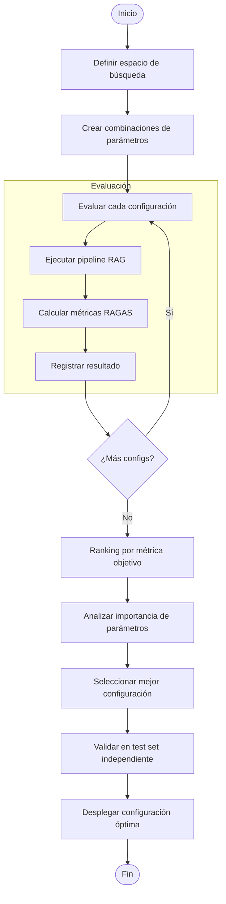
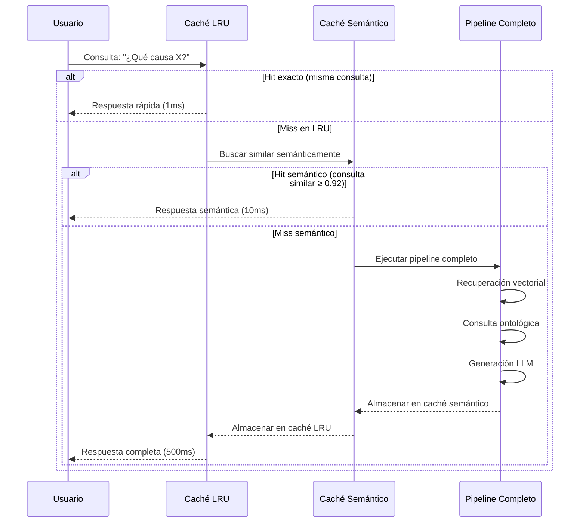
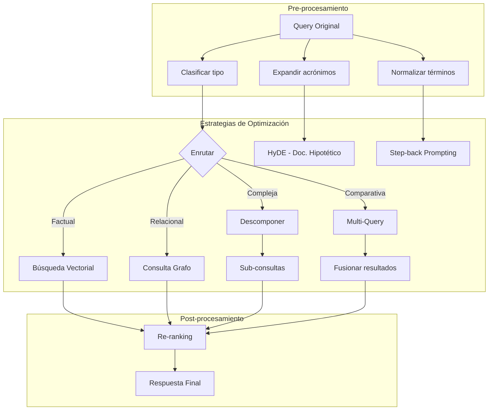

# Clase 29: Optimización de RAG

**Duración:** 4 horas

---

## Objetivos de Aprendizaje

Al finalizar esta clase, los estudiantes serán capaces de:

1. Ajustar hyperparameters de sistemas RAG (chunk size, overlap, top-K) para maximizar precisión y recall
2. Optimizar índices vectoriales mediante selección de embeddings, metadatos y filtros
3. Implementar estrategias de optimización de consultas: rewriting, routing, descomposición
4. Diseñar sistemas de caché para reducir latencia y costos operativos
5. Utilizar herramientas como Weights & Biases para tracking de experimentos de optimización

---

## Contenidos Detallados

### Módulo 1: Hyperparameter Tuning (60 min)

#### 1.1 Parámetros Críticos en RAG

Los hyperparameters más importantes en un sistema RAG se agrupan en tres categorías:

**Parámetros de Chunking:**

| Parámetro | Rango típico | Impacto | Trade-off |
|-----------|-------------|---------|-----------|
| chunk_size | 128 - 2048 tokens | Precisión vs Contexto | Pequeño = preciso, Grande = contexto rico |
| chunk_overlap | 10 - 200 tokens | Continuidad semántica | Más overlap = mejor contexto, más tokens |
| splitter_type | recursive, semantic, character | Calidad de división | Recursivo es buena opción general |

**Parámetros de Recuperación:**

| Parámetro | Rango típico | Impacto | Trade-off |
|-----------|-------------|---------|-----------|
| top_k | 2 - 20 chunks | Recall vs Ruido | Más K = mejor recall, peor precisión |
| similarity_threshold | 0.5 - 0.95 | Filtro de ruido | Más alto = menos ruido, posible pérdida |
| retrieval_mode | vector, keyword, hybrid | Estrategia de búsqueda | Hybrid balancea precisión y recall |

**Parámetros de Generación:**

| Parámetro | Rango típico | Impacto | Trade-off |
|-----------|-------------|---------|-----------|
| temperature | 0.0 - 1.0 | Creatividad vs Precisión | Bajo = factual, Alto = creativo |
| max_tokens | 128 - 2048 | Longitud de respuesta | Corto = conciso, Largo = detallado |
| model | gpt-4o-mini a gpt-4o | Calidad vs Costo | Mejor modelo = mejor calidad, más costo |

#### 1.2 Grid Search para RAG

```python
# hyperparameter_tuning.py - Grid Search para optimización de RAG
from typing import List, Dict, Callable
from dataclasses import dataclass, asdict
from itertools import product
import json
import random
import time
from datetime import datetime

@dataclass
class RAGHyperparameters:
    """Hyperparameters del sistema RAG"""
    chunk_size: int = 512
    chunk_overlap: int = 50
    top_k: int = 4
    embedding_model: str = "text-embedding-3-small"
    llm_model: str = "gpt-4o-mini"
    temperature: float = 0.1
    retrieval_mode: str = "hybrid"  # "vector", "keyword", "hybrid"
    similarity_threshold: float = 0.7
    max_tokens: int = 512
    
    def name(self) -> str:
        """Nombre descriptivo de esta configuración"""
        return (f"CS{self.chunk_size}_CO{self.chunk_overlap}_"
                f"K{self.top_k}_EM{self.embedding_model[:5]}_"
                f"T{self.temperature}")

class RAGHyperparameterTuner:
    """
    Tuner de hyperparameters para sistemas RAG.
    Implementa Grid Search y Random Search.
    """
    
    def __init__(self, evaluation_fn: Callable):
        """
        Args:
            evaluation_fn: Función que recibe config y retorna {metric: score}
        """
        self.eval_fn = evaluation_fn
        self.results: List[Dict] = []
        self.best_config: Dict = {}
    
    def grid_search(self, param_grid: Dict[str, List], 
                    optimize_metric: str = "ragas_score") -> List[Dict]:
        """
        Grid Search sobre el espacio de parámetros.
        
        Args:
            param_grid: Diccionario {param: [valores_a_probar]}
            optimize_metric: Métrica a optimizar
        
        Returns:
            Resultados ordenados por métrica objetivo
        """
        # Generar todas las combinaciones
        keys = param_grid.keys()
        values = param_grid.values()
        combinations = list(product(*values))
        
        print(f"Grid Search: {len(combinations)} combinaciones a evaluar")
        
        for i, combo in enumerate(combinations, 1):
            config = RAGHyperparameters(**dict(zip(keys, combo)))
            
            print(f"\n[{i}/{len(combinations)}] Evaluando: {config.name()}")
            start = time.time()
            
            # Evaluar configuración
            try:
                metrics = self.eval_fn(config)
                elapsed = time.time() - start
                
                result = {
                    "config": asdict(config),
                    "config_name": config.name(),
                    "metrics": metrics,
                    "eval_time_s": round(elapsed, 2),
                    "timestamp": datetime.utcnow().isoformat()
                }
                
                self.results.append(result)
                
                # Mostrar progreso
                score = metrics.get(optimize_metric, 0)
                print(f"  Score ({optimize_metric}): {score:.4f} "
                      f"[{elapsed:.1f}s]")
            
            except Exception as e:
                print(f"  ❌ Error: {e}")
        
        # Ordenar por métrica objetivo
        self.results.sort(
            key=lambda r: r["metrics"].get(optimize_metric, 0),
            reverse=True
        )
        
        if self.results:
            self.best_config = self.results[0]
        
        return self.results
    
    def random_search(self, param_distributions: Dict, 
                      n_iter: int = 20,
                      optimize_metric: str = "ragas_score") -> List[Dict]:
        """
        Random Search: muestrea n_iter configuraciones aleatorias.
        Más eficiente que Grid Search para espacios grandes.
        """
        results = []
        
        for i in range(n_iter):
            # Muestrear aleatoriamente
            config_dict = {}
            for param, values in param_distributions.items():
                config_dict[param] = random.choice(values)
            
            config = RAGHyperparameters(**config_dict)
            
            print(f"\n[{i+1}/{n_iter}] Evaluando: {config.name()}")
            start = time.time()
            
            try:
                metrics = self.eval_fn(config)
                elapsed = time.time() - start
                
                result = {
                    "config": asdict(config),
                    "config_name": config.name(),
                    "metrics": metrics,
                    "eval_time_s": round(elapsed, 2),
                    "timestamp": datetime.utcnow().isoformat()
                }
                
                results.append(result)
                
                score = metrics.get(optimize_metric, 0)
                print(f"  Score ({optimize_metric}): {score:.4f} "
                      f"[{elapsed:.1f}s]")
            
            except Exception as e:
                print(f"  ❌ Error: {e}")
        
        results.sort(
            key=lambda r: r["metrics"].get(optimize_metric, 0),
            reverse=True
        )
        
        self.results.extend(results)
        if results:
            if not self.best_config or \
               results[0]["metrics"].get(optimize_metric, 0) > \
               self.best_config["metrics"].get(optimize_metric, 0):
                self.best_config = results[0]
        
        return results
    
    def analyze_results(self, top_n: int = 5) -> Dict:
        """Analiza resultados del tuning"""
        
        if not self.results:
            return {"error": "No hay resultados"}
        
        analysis = {
            "total_configs": len(self.results),
            "best_configs": [],
            "parameter_importance": {},
            "recommendations": []
        }
        
        # Top N configuraciones
        for i, result in enumerate(self.results[:top_n], 1):
            analysis["best_configs"].append({
                "rank": i,
                "config": result["config"],
                "metrics": result["metrics"]
            })
        
        # Analizar importancia de parámetros
        param_ranges = {}
        for result in self.results:
            for param, value in result["config"].items():
                if param not in param_ranges:
                    param_ranges[param] = set()
                if isinstance(value, (int, float)):
                    param_ranges[param].add(value)
        
        # Correlación simple entre cada parámetro y score
        for param in param_ranges:
            if len(param_ranges[param]) > 1:
                values = []
                scores = []
                for result in self.results:
                    v = result["config"].get(param)
                    if isinstance(v, (int, float)):
                        values.append(v)
                        ragas = result["metrics"].get("ragas_score", 0)
                        scores.append(ragas)
                
                if values and scores:
                    n = len(values)
                    mean_v = sum(values) / n
                    mean_s = sum(scores) / n
                    
                    numer = sum((v - mean_v) * (s - mean_s) 
                              for v, s in zip(values, scores))
                    denom_v = sum((v - mean_v) ** 2 for v in values) ** 0.5
                    denom_s = sum((s - mean_s) ** 2 for s in scores) ** 0.5
                    
                    correlation = numer / (denom_v * denom_s) if denom_v * denom_s > 0 else 0
                    
                    analysis["parameter_importance"][param] = {
                        "correlation_with_score": round(correlation, 4),
                        "values_tested": sorted(param_ranges[param]),
                        "impact": "Alto" if abs(correlation) > 0.5 else \
                                 "Medio" if abs(correlation) > 0.3 else "Bajo"
                    }
        
        # Recomendaciones
        if self.best_config:
            bc = self.best_config["config"]
            analysis["recommendations"] = [
                f"Mejor chunk_size: {bc.get('chunk_size', 'N/A')}",
                f"Mejor chunk_overlap: {bc.get('chunk_overlap', 'N/A')}",
                f"Mejor top_k: {bc.get('top_k', 'N/A')}",
                f"Mejor modelo embedding: {bc.get('embedding_model', 'N/A')}",
                f"Mejor temperatura: {bc.get('temperature', 'N/A')}"
            ]
        
        return analysis
    
    def export_results(self, filepath: str):
        """Exporta resultados a JSON"""
        with open(filepath, "w", encoding="utf-8") as f:
            json.dump({
                "results": self.results,
                "best_config": self.best_config,
                "analysis": self.analyze_results()
            }, f, indent=2, ensure_ascii=False)


# === FUNCIÓN DE EVALUACIÓN SIMULADA ===
def simulated_evaluate(config: RAGHyperparameters) -> Dict:
    """Simula evaluación de una configuración RAG"""
    
    # Simular que chunk_size afecta precision y recall
    cs = config.chunk_size
    base_faithfulness = 0.80 + 0.05 * (1 - abs(cs - 512) / 1500)
    base_relevancy = 0.85 - 0.02 * (config.temperature * 10)
    
    # top_k afecta precision negativamente y recall positivamente
    k = config.top_k
    precision_penalty = 0.02 * max(0, k - 5)
    recall_bonus = 0.03 * min(k, 8)
    
    # Simular ruido
    import random
    noise = random.gauss(0, 0.02)
    
    metrics = {
        "faithfulness": min(1.0, max(0.0, base_faithfulness - precision_penalty + noise)),
        "answer_relevancy": min(1.0, max(0.0, base_relevancy + noise)),
        "context_precision": min(1.0, max(0.0, 0.85 - precision_penalty + noise)),
        "context_recall": min(1.0, max(0.0, 0.70 + recall_bonus + noise)),
    }
    metrics["ragas_score"] = sum(metrics.values()) / len(metrics)
    
    # Simular latencia
    time.sleep(0.05)
    
    return metrics


# === DEMOSTRACIÓN ===
if __name__ == "__main__":
    tuner = RAGHyperparameterTuner(simulated_evaluate)
    
    # Grid Search
    param_grid = {
        "chunk_size": [256, 512, 1024],
        "chunk_overlap": [0, 50, 100],
        "top_k": [2, 4, 8],
        "temperature": [0.0, 0.1, 0.3]
    }
    
    print("=== GRID SEARCH ===")
    results = tuner.grid_search(param_grid)
    
    analysis = tuner.analyze_results()
    
    print("\n=== MEJORES CONFIGURACIONES ===")
    for i, config in enumerate(analysis["best_configs"][:3], 1):
        print(f"\n#{i}: {config['config']['chunk_size']}chunk, "
              f"K={config['config']['top_k']}, "
              f"T={config['config']['temperature']}")
        print(f"  Score: {config['metrics']['ragas_score']:.4f}")
    
    print("\n=== IMPORTANCIA DE PARÁMETROS ===")
    for param, info in analysis["parameter_importance"].items():
        print(f"  {param:20s}: correlación={info['correlation_with_score']:.3f} "
              f"[Impacto: {info['impact']}]")
```

### Módulo 2: Index Optimization (60 min)

#### 2.1 Selección de Modelos de Embeddings

La elección del modelo de embeddings impacta directamente en la calidad de recuperación:

```python
# embedding_optimization.py - Optimización de embeddings
from typing import List, Dict, Tuple
import numpy as np

class EmbeddingOptimizer:
    """
    Optimización de embeddings para RAG.
    Compara diferentes modelos y estrategias.
    """
    
    EMBEDDING_MODELS = {
        "text-embedding-3-large": {
            "dimensions": 3072,
            "max_tokens": 8191,
            "cost_per_1k_tokens": 0.00013,
            "quality": "excelente"
        },
        "text-embedding-3-small": {
            "dimensions": 1536,
            "max_tokens": 8191, 
            "cost_per_1k_tokens": 0.00002,
            "quality": "muy_buena"
        },
        "BGE-M3": {
            "dimensions": 1024,
            "max_tokens": 8192,
            "cost_per_1k_tokens": 0.0,  # Open source
            "quality": "excelente"
        },
        "all-MiniLM-L6-v2": {
            "dimensions": 384,
            "max_tokens": 256,
            "cost_per_1k_tokens": 0.0,
            "quality": "buena"
        },
        "Cohere-embed-v3": {
            "dimensions": 1024,
            "max_tokens": 512,
            "cost_per_1k_tokens": 0.0001,
            "quality": "excelente"
        }
    }
    
    @staticmethod
    def recommend_embedding(doc_volume: int, 
                           query_complexity: str,
                           budget_daily: float,
                           latency_requirement: str) -> Dict:
        """
        Recomienda el mejor modelo de embedding según requisitos.
        """
        candidates = []
        
        for model, specs in EmbeddingOptimizer.EMBEDDING_MODELS.items():
            score = 0
            
            # Volumen de documentos
            if doc_volume > 100000 and specs["quality"] == "excelente":
                score += 3
            elif doc_volume > 10000 and specs["quality"] != "buena":
                score += 2
            
            # Presupuesto
            daily_cost_est = doc_volume * 0.001 * specs["cost_per_1k_tokens"]
            if daily_cost_est <= budget_daily:
                score += 2
            else:
                score -= 1
            
            # Latencia
            if latency_requirement == "baja" and specs["dimensions"] <= 768:
                score += 2
            elif latency_requirement == "media":
                score += 1
            
            candidates.append({
                "model": model,
                "score": score,
                "daily_cost_est": round(daily_cost_est, 4),
                "dimensions": specs["dimensions"],
                "quality": specs["quality"]
            })
        
        candidates.sort(key=lambda c: c["score"], reverse=True)
        
        return {
            "recommendation": candidates[0],
            "alternatives": candidates[1:3] if len(candidates) > 1 else [],
            "reasoning": (
                f"Considerando {doc_volume} docs, "
                f"presupuesto ${budget_daily}/día, "
                f"latencia {latency_requirement}"
            )
        }
    
    @staticmethod
    def dimension_reduction(embeddings: np.ndarray, 
                           target_dim: int = 256) -> np.ndarray:
        """
        Reduce dimensionalidad de embeddings usando PCA.
        Útil para reducir costos de almacenamiento y latencia.
        """
        from sklearn.decomposition import PCA
        
        pca = PCA(n_components=target_dim)
        reduced = pca.fit_transform(embeddings)
        
        variance_retained = sum(pca.explained_variance_ratio_)
        
        print(f"Dimensión original: {embeddings.shape[1]}")
        print(f"Dimensión reducida: {target_dim}")
        print(f"Varianza retenida: {variance_retained:.2%}")
        
        return reduced
    
    @staticmethod
    def matryoshka_embedding(embeddings: np.ndarray) -> Dict[int, np.ndarray]:
        """
        Simula embeddings Matryoshka (diferentes dimensiones anidadas).
        Permite usar la misma representación con diferentes granularidades.
        """
        dims = embeddings.shape[1]
        representations = {}
        
        for target_dim in [64, 128, 256, 512, dims]:
            # Truncar (simplificación - en producción usar modelos nativos)
            representations[target_dim] = embeddings[:, :target_dim]
        
        return representations


# === DEMOSTRACIÓN ===
if __name__ == "__main__":
    print("=== RECOMENDACIÓN DE EMBEDDINGS ===")
    
    for scenario in [
        {"docs": 50000, "complexity": "alta", "budget": 10.0, "latency": "media"},
        {"docs": 5000, "complexity": "media", "budget": 1.0, "latency": "baja"},
    ]:
        print(f"\nEscenario: {scenario}")
        rec = EmbeddingOptimizer.recommend_embedding(
            scenario["docs"], scenario["complexity"], 
            scenario["budget"], scenario["latency"]
        )
        print(f"Recomendación: {rec['recommendation']['model']}")
        print(f"Costo diario est.: ${rec['recommendation']['daily_cost_est']}")
        print(f"Alternativas: {[a['model'] for a in rec['alternatives']]}")
```

#### 2.2 Metadatos y Filtros

```python
# metadata_optimization.py - Optimización de metadatos y filtros
from typing import List, Dict, Any
from dataclasses import dataclass
from datetime import datetime

@dataclass
class MetadataSchema:
    """Esquema de metadatos para optimización de filtros"""
    fields: Dict[str, Dict[str, Any]]
    
    def validate(self, metadata: Dict) -> bool:
        """Valida metadatos contra el esquema"""
        for field, rules in self.fields.items():
            if field in metadata:
                value = metadata[field]
                field_type = rules.get("type", "str")
                
                if field_type == "str" and not isinstance(value, str):
                    return False
                elif field_type == "int" and not isinstance(value, int):
                    return False
                elif field_type == "float" and not isinstance(value, (int, float)):
                    return False
                elif field_type == "date":
                    try:
                        datetime.fromisoformat(str(value))
                    except:
                        return False
            
            elif rules.get("required", False):
                return False
        
        return True
    
    def get_filterable_fields(self) -> List[str]:
        """Retorna campos que soportan filtrado"""
        return [
            field for field, rules in self.fields.items()
            if rules.get("filterable", False)
        ]

class MetadataIndexer:
    """
    Estrategias de indexación de metadatos para mejorar filtros.
    """
    
    def __init__(self):
        self.indexes: Dict[str, Dict] = {}
    
    def create_inverted_index(self, documents: List[Dict], 
                              field: str) -> Dict:
        """
        Crea índice invertido para un campo de metadatos.
        Útil para filtros rápidos por categoría.
        """
        index = {}
        
        for i, doc in enumerate(documents):
            value = doc.get(field)
            if value:
                if value not in index:
                    index[value] = []
                index[value].append(i)
        
        self.indexes[field] = {
            "type": "inverted",
            "size_bytes": len(str(index).encode()),
            "unique_values": len(index)
        }
        
        return index
    
    def create_range_index(self, documents: List[Dict],
                           field: str) -> Dict:
        """
        Crea índice de rango para campos numéricos/fechas.
        Útil para filtros por rango (fechas, precios, scores).
        """
        sorted_docs = sorted(
            enumerate(documents),
            key=lambda x: x[1].get(field, 0)
        )
        
        values = [doc.get(field) for _, doc in sorted_docs]
        indices = [idx for idx, _ in sorted_docs]
        
        index = {
            "type": "range",
            "sorted_values": values,
            "sorted_indices": indices,
            "min": min(values) if values else None,
            "max": max(values) if values else None
        }
        
        self.indexes[field] = index
        
        return index
    
    def query_with_filters(self, query_vector: List[float], 
                           filters: Dict,
                           documents: List[Dict],
                           top_k: int = 10) -> List[int]:
        """
        Búsqueda vectorial con filtros de metadatos.
        Aplica filtros ANTES de la búsqueda de similitud.
        """
        # Aplicar filtros primero (pre-filtering)
        candidate_indices = set(range(len(documents)))
        
        for field, condition in filters.items():
            if field in self.indexes:
                index = self.indexes[field]
                
                if index["type"] == "inverted":
                    if isinstance(condition, str):
                        matching = set(index.get(condition, []))
                        candidate_indices &= matching
                
                elif index["type"] == "range":
                    if isinstance(condition, dict):
                        min_val = condition.get("min", float("-inf"))
                        max_val = condition.get("max", float("inf"))
                        
                        # Búsqueda binaria en sorted_values
                        import bisect
                        start = bisect.bisect_left(index["sorted_values"], min_val)
                        end = bisect.bisect_right(index["sorted_values"], max_val)
                        
                        matching = set(index["sorted_indices"][start:end])
                        candidate_indices &= matching
        
        # Simular búsqueda vectorial sobre candidatos
        candidates = list(candidate_indices)
        
        # Ordenar por score simulado y tomar top_k
        import random
        scored = [(idx, random.random()) for idx in candidates]
        scored.sort(key=lambda x: x[1], reverse=True)
        
        return [idx for idx, _ in scored[:top_k]]


# === DEMOSTRACIÓN ===
if __name__ == "__main__":
    indexer = MetadataIndexer()
    
    # Documentos de ejemplo
    docs = [
        {"categoria": "hardware", "fecha": "2026-01-15", "importancia": 5},
        {"categoria": "software", "fecha": "2026-02-20", "importancia": 3},
        {"categoria": "hardware", "fecha": "2026-03-10", "importancia": 4},
        {"categoria": "redes", "fecha": "2026-01-05", "importancia": 2},
    ]
    
    # Crear índices
    cat_index = indexer.create_inverted_index(docs, "categoria")
    date_index = indexer.create_range_index(docs, "fecha")
    imp_index = indexer.create_range_index(docs, "importancia")
    
    # Consulta con filtros
    results = indexer.query_with_filters(
        query_vector=[0.1] * 384,
        filters={
            "categoria": "hardware",
            "importancia": {"min": 3, "max": 5}
        },
        documents=docs,
        top_k=5
    )
    
    print("=== FILTRADO POR METADATOS ===")
    print(f"Filtros: categoría=hardware, importancia 3-5")
    print(f"Documentos que pasan filtros:")
    for idx in results:
        print(f"  [{idx}] {docs[idx]}")
```

### Módulo 3: Query Optimization (60 min)

#### 3.1 Query Rewriting

```python
# query_optimization.py - Optimización de consultas RAG
from typing import List, Dict, Optional
from dataclasses import dataclass
import re

class QueryOptimizer:
    """
    Optimización de consultas para mejorar recuperación RAG.
    Incluye rewriting, expansión, y descomposición.
    """
    
    @staticmethod
    def expand_acronyms(query: str, glossary: Dict[str, str]) -> str:
        """Expande acrónimos en la consulta"""
        expanded = query
        for acronym, full in glossary.items():
            pattern = rf'\b{acronym}\b'
            expanded = re.sub(pattern, f"{acronym} ({full})", expanded, 
                             flags=re.IGNORECASE)
        return expanded
    
    @staticmethod
    def hyde_query(query: str, hypothetical_answer: str) -> str:
        """
        HyDE (Hypothetical Document Embeddings):
        Genera un documento hipotético y lo usa para la búsqueda.
        """
        # Combinar query con respuesta hipotética para búsqueda
        return f"{query}\n\nDocumento relevante:\n{hypothetical_answer}"
    
    @staticmethod
    def multi_query(query: str, num_variations: int = 3) -> List[str]:
        """
        Genera múltiples variaciones de la misma consulta.
        Útil para mejorar recall combinando resultados.
        """
        variations = [query]
        
        # Simplificar
        variations.append(query.lower().strip("?¡!¿"))
        
        # Expandir con sinónimos
        synonyms = {
            "causa": ["motivo", "origen", "razón"],
            "solución": ["arreglo", "reparación", "respuesta"],
            "problema": ["error", "fallo", "incidencia"],
            "cómo": ["de qué manera", "cuál es el proceso"],
            "qué": ["cuál", "cuáles son"]
        }
        
        for word, syn_list in synonyms.items():
            if word in query.lower():
                for syn in syn_list[:num_variations - 1]:
                    variations.append(
                        re.sub(rf'\b{word}\b', syn, query, 
                              flags=re.IGNORECASE)
                    )
        
        return variations[:num_variations]
    
    @staticmethod
    def decompose_complex_query(query: str) -> List[str]:
        """
        Descompone consultas complejas en sub-consultas simples.
        """
        sub_queries = []
        
        # Detectar conectores y dividir
        connectors = [" y ", " además ", " también ", ",", ";"]
        
        for conn in connectors:
            if conn in query:
                parts = query.split(conn)
                sub_queries.extend([p.strip() for p in parts if p.strip()])
                break
        
        if not sub_queries:
            sub_queries = [query]
        
        # Si es una comparación, dividir en dos consultas
        if " vs " in query or " versus " in query or " comparado con " in query:
            parts = re.split(r'\b(vs|versus|comparado con)\b', query, 
                           flags=re.IGNORECASE)
            sub_queries = [parts[0].strip(), parts[2].strip()]
        
        return sub_queries
    
    @staticmethod
    def step_back_query(query: str) -> str:
        """
        Step-back prompting: genera una pregunta más abstracta/ general.
        """
        # Patrones: convertir preguntas específicas a genéricas
        step_back_patterns = [
            (r'¿Qué (.+) en (.+)\?', r'¿Qué es \1?'),
            (r'¿Cómo (.+) en (.+)\?', r'¿Cómo funciona \1?'),
            (r'¿Por qué (.+) (?:en|para) (.+)\?', r'¿Qué causa \1?'),
            (r'¿Cuál es (?:el|la) (.+) de (.+)\?', r'¿Qué es \1?'),
        ]
        
        for pattern, replacement in step_back_patterns:
            if re.match(pattern, query, re.IGNORECASE):
                return re.sub(pattern, replacement, query, 
                            flags=re.IGNORECASE)
        
        # Fallback: añadir "en general"
        return f"{query.rstrip('?')} en general?"

class QueryRouter:
    """
    Enruta consultas al pipeline más apropiado según su naturaleza.
    """
    
    ROUTES = {
        "factual": {
            "description": "Hechos específicos en documentos",
            "pipeline": "vector_search",
            "examples": ["¿Cuándo se lanzó?", "¿Qué dice la política sobre...?"]
        },
        "relational": {
            "description": "Relaciones entre entidades",
            "pipeline": "graph_search",
            "examples": ["¿Qué relación hay entre X e Y?", "¿Qué causa Z?"]
        },
        "procedimental": {
            "description": "Pasos y procesos",
            "pipeline": "vector_search + rerank",
            "examples": ["¿Cómo se instala?", "¿Cuáles son los pasos para...?"]
        },
        "comparative": {
            "description": "Comparación entre elementos",
            "pipeline": "multi_query + fusion",
            "examples": ["¿Cuál es mejor, X o Y?", "Diferencias entre A y B"]
        },
        "summarization": {
            "description": "Resumen de información extensa",
            "pipeline": "vector_search + map_reduce",
            "examples": ["Resume el documento", "¿Cuáles son los puntos principales?"]
        }
    }
    
    @staticmethod
    def classify_query(query: str) -> str:
        """Clasifica consulta para determinar ruta óptima"""
        q = query.lower()
        
        # Reglas de clasificación
        if any(w in q for w in ["cómo", "pasos", "proceso", "procedimiento", "instalar"]):
            return "procedimental"
        elif any(w in q for w in ["vs", "versus", "comparado", "diferencia", "mejor"]):
            return "comparative"
        elif any(w in q for w in ["resume", "resumen", "puntos principales", "en resumen"]):
            return "summarization"
        elif any(w in q for w in ["relación", "causa", "afecta", "conecta", "depende"]):
            return "relational"
        else:
            return "factual"
    
    def route(self, query: str) -> Dict:
        """Determina la ruta óptima para la consulta"""
        route_type = self.classify_query(query)
        route_info = self.ROUTES.get(route_type, self.ROUTES["factual"])
        
        return {
            "query": query,
            "type": route_type,
            "pipeline": route_info["pipeline"],
            "confidence": 0.85
        }


# === DEMOSTRACIÓN ===
if __name__ == "__main__":
    queries = [
        "¿Cómo se actualiza el firmware del sensor ST-200?",
        "¿Qué relación hay entre el sensor térmico y el sobrecalentamiento?",
        "vs ProBook X1 vs TabTech A10, ¿cuál tiene mejor batería?",
        "Resume los pasos para reemplazar la batería",
        "¿Cuándo se lanzó la Laptop ProBook X1?"
    ]
    
    router = QueryRouter()
    optimizer = QueryOptimizer()
    
    print("=== OPTIMIZACIÓN DE CONSULTAS ===\n")
    
    for query in queries:
        print(f"Original: {query}")
        
        # Clasificar
        route = router.route(query)
        print(f"  Tipo: {route['type']} → Pipeline: {route['pipeline']}")
        
        # Descomponer si es compleja
        sub_queries = optimizer.decompose_complex_query(query)
        if len(sub_queries) > 1:
            print(f"  Sub-consultas:")
            for sq in sub_queries:
                print(f"    - {sq}")
        
        # Step-back para consultas específicas
        if route['type'] == "factual":
            stepback = optimizer.step_back_query(query)
            print(f"  Step-back: {stepback}")
        
        print()
```

### Módulo 4: Caching Strategies (60 min)

#### 4.1 Estrategias de Caché

```python
# caching_strategies.py - Estrategias de caché para RAG
from typing import Dict, Any, Callable, Optional, List
from collections import OrderedDict
import hashlib
import json
import time
from datetime import datetime, timedelta

class LRUCache:
    """
    Caché LRU (Least Recently Used) para respuestas RAG.
    Útil para consultas frecuentes similares.
    """
    
    def __init__(self, capacity: int = 1000, ttl_seconds: int = 3600):
        self.cache = OrderedDict()
        self.capacity = capacity
        self.ttl = ttl_seconds
        self.hits = 0
        self.misses = 0
    
    def _make_key(self, query: str, context: Optional[Dict] = None) -> str:
        """Genera clave única para una consulta"""
        key_material = query
        if context:
            key_material += json.dumps(context, sort_keys=True)
        return hashlib.sha256(key_material.encode()).hexdigest()
    
    def get(self, query: str, context: Optional[Dict] = None) -> Optional[Dict]:
        """Obtiene respuesta del caché si existe y es válida"""
        key = self._make_key(query, context)
        
        if key in self.cache:
            entry = self.cache[key]
            
            # Verificar TTL
            if time.time() - entry["timestamp"] < self.ttl:
                self.cache.move_to_end(key)
                self.hits += 1
                return entry["response"]
            else:
                # Expirado
                del self.cache[key]
                return None
        
        self.misses += 1
        return None
    
    def set(self, query: str, response: Dict, 
            context: Optional[Dict] = None):
        """Almacena respuesta en caché"""
        key = self._make_key(query, context)
        
        # Verificar capacidad
        if len(self.cache) >= self.capacity:
            self.cache.popitem(last=False)
        
        self.cache[key] = {
            "response": response,
            "timestamp": time.time(),
            "query": query,
            "context": context
        }
    
    def invalidate(self, query: str, context: Optional[Dict] = None):
        """Invalida entrada específica"""
        key = self._make_key(query, context)
        if key in self.cache:
            del self.cache[key]
    
    def invalidate_pattern(self, pattern: str):
        """Invalida entradas que coinciden con patrón"""
        to_delete = []
        for key, entry in self.cache.items():
            if pattern.lower() in entry["query"].lower():
                to_delete.append(key)
        for key in to_delete:
            del self.cache[key]
    
    def get_stats(self) -> Dict:
        total = self.hits + self.misses
        hit_rate = self.hits / total if total > 0 else 0
        
        return {
            "size": len(self.cache),
            "capacity": self.capacity,
            "hits": self.hits,
            "misses": self.misses,
            "hit_rate": round(hit_rate, 4),
            "ttl_seconds": self.ttl
        }

class SemanticCache:
    """
    Caché semántico: detecta consultas similares semánticamente.
    Usa embeddings para encontrar respuestas a consultas parecidas.
    """
    
    def __init__(self, similarity_threshold: float = 0.92):
        self.cache: List[Dict] = []
        self.threshold = similarity_threshold
    
    def _get_embedding(self, text: str) -> List[float]:
        """Simula obtención de embedding (en producción: modelo real)"""
        # Hash simple como embedding simulado
        hash_val = hashlib.sha256(text.encode()).hexdigest()
        return [int(hash_val[i:i+2], 16) / 255 for i in range(0, 32, 2)]
    
    def _cosine_similarity(self, a: List[float], b: List[float]) -> float:
        """Similitud coseno entre dos vectores"""
        dot = sum(x * y for x, y in zip(a, b))
        norm_a = sum(x * x for x in a) ** 0.5
        norm_b = sum(x * x for x in b) ** 0.5
        return dot / (norm_a * norm_b) if norm_a * norm_b > 0 else 0
    
    def find_similar(self, query: str) -> Optional[Dict]:
        """Busca respuesta para consulta semánticamente similar"""
        query_emb = self._get_embedding(query)
        
        best_match = None
        best_score = 0
        
        for entry in self.cache:
            similarity = self._cosine_similarity(query_emb, entry["embedding"])
            if similarity > best_score and similarity >= self.threshold:
                best_score = similarity
                best_match = entry
        
        if best_match:
            return {
                "response": best_match["response"],
                "similarity": best_score,
                "cached_query": best_match["query"]
            }
        return None
    
    def store(self, query: str, response: Dict):
        """Almacena respuesta en caché semántico"""
        self.cache.append({
            "query": query,
            "response": response,
            "embedding": self._get_embedding(query),
            "timestamp": time.time()
        })
    
    def get_stats(self) -> Dict:
        return {
            "size": len(self.cache),
            "threshold": self.threshold
        }

class MultiLevelCache:
    """
    Caché multi-nivel: LRU → Semántico → Full Pipeline
    """
    
    def __init__(self, lru_capacity: int = 500, 
                 semantic_capacity: int = 200):
        self.lru = LRUCache(capacity=lru_capacity)
        self.semantic = SemanticCache()
        self.level_hits = {"lru": 0, "semantic": 0, "full_pipeline": 0}
    
    def get_response(self, query: str, 
                     full_pipeline_fn: Callable) -> Dict:
        """
        Obtiene respuesta probando niveles de caché de menor a mayor costo.
        """
        # Nivel 1: LRU Cache (exact match)
        cached = self.lru.get(query)
        if cached:
            self.level_hits["lru"] += 1
            return {
                **cached,
                "cache_level": "lru",
                "cached": True
            }
        
        # Nivel 2: Semantic Cache (similar match)
        semantic = self.semantic.find_similar(query)
        if semantic:
            self.level_hits["semantic"] += 1
            return {
                "response": semantic["response"],
                "cache_level": "semantic",
                "similarity": semantic["similarity"],
                "cached_query": semantic["cached_query"],
                "cached": True
            }
        
        # Nivel 3: Full Pipeline (costo completo)
        self.level_hits["full_pipeline"] += 1
        
        result = full_pipeline_fn(query)
        
        # Almacenar en cachés
        self.lru.set(query, result)
        self.semantic.store(query, result)
        
        return {
            **result,
            "cache_level": "full_pipeline",
            "cached": False
        }
    
    def get_stats(self) -> Dict:
        total = sum(self.level_hits.values())
        return {
            "hits": {
                k: {"count": v, "rate": round(v / total, 3) if total > 0 else 0}
                for k, v in self.level_hits.items()
            },
            "total_queries": total,
            "lru_stats": self.lru.get_stats(),
            "semantic_stats": self.semantic.get_stats()
        }


# === DEMOSTRACIÓN ===
if __name__ == "__main__":
    # Simular pipeline costoso
    def expensive_pipeline(query: str) -> Dict:
        time.sleep(0.5)  # Simular latencia
        return {
            "answer": f"Respuesta para: {query}",
            "sources": ["doc1.pdf", "doc2.pdf"],
            "latency_ms": 500
        }
    
    cache = MultiLevelCache()
    
    queries = [
        "¿Qué causa sobrecalentamiento?",
        "¿Qué causa sobrecalentamiento?",  # Repetida → LRU hit
        "¿Por qué se calienta el dispositivo?",  # Similar → Semantic hit
        "¿Qué solución hay para la batería?"  # Nueva → Full pipeline
    ]
    
    print("=== CACHÉ MULTI-NIVEL ===\n")
    
    for q in queries:
        result = cache.get_response(q, expensive_pipeline)
        level = result["cache_level"]
        symbol = {"lru": "⚡", "semantic": "🔶", "full_pipeline": "🔴"}[level]
        print(f"{symbol} [{level:15s}] {q}")
    
    print(f"\n=== ESTADÍSTICAS ===")
    stats = cache.get_stats()
    for level, info in stats["hits"].items():
        print(f"  {level:15s}: {info['count']} ({info['rate']:.1%})")
```

---

## Diagramas en Mermaid

### Diagrama 1: Proceso de Hyperparameter Tuning



### Diagrama 2: Estrategias de Caché Multi-Nivel



### Diagrama 3: Optimización de Consultas



---

## Referencias Externas

### Hyperparameter Tuning
- **Weights & Biases (RAG Tuning):** https://wandb.ai/site/experiments
- **Optuna (Hyperparameter Optimization):** https://optuna.org/
- **Grid Search vs Random Search (Bengio):** https://www.jmlr.org/papers/volume13/bergstra12a/bergstra12a.pdf

### Embedding Optimization
- **MTEB Leaderboard:** https://huggingface.co/spaces/mteb/leaderboard
- **OpenAI Embeddings Guide:** https://platform.openai.com/docs/guides/embeddings
- **Matryoshka Embeddings (Nomic):** https://www.nomic.ai/blog/posts/matryoshka-embedding

### Query Optimization
- **HyDE (Hypothetical Document Embeddings):** https://arxiv.org/abs/2212.10496
- **Step-back Prompting (Google):** https://arxiv.org/abs/2310.06117
- **Query Routing in RAG:** https://blog.langchain.dev/query-routing/

### Caching
- **Redis Cache Documentation:** https://redis.io/docs/
- **Semantic Caching (GPTCache):** https://github.com/zilliztech/GPTCache
- **Caching Strategies for LLMs:** https://www.anyscale.com/blog/llm-caching-strategies

### Experiment Tracking
- **Weights & Biases (wandb):** https://wandb.ai/
- **MLflow:** https://mlflow.org/
- **LangSmith (LangChain):** https://smith.langchain.com/

---

## Ejercicios Prácticos Resueltos

### Ejercicio 1: Experimentos con Weights & Biases

**Problema:** Usar W&B para trackear experimentos de optimización de RAG, comparando diferentes configuraciones de chunking y recuperación.

**Solución:**

```python
# wandb_tracking.py - Tracking de experimentos con W&B (simulado)

"""
En producción:
import wandb

wandb.init(project="rag-optimization", name="experimento-chunking")

config = {
    "chunk_size": 512,
    "chunk_overlap": 50,
    "top_k": 4,
    "embedding_model": "text-embedding-3-small",
    "llm_model": "gpt-4o-mini"
}

wandb.config.update(config)

# Durante entrenamiento/evaluación
for epoch in range(10):
    metrics = evaluate_rag(config)
    wandb.log({
        "faithfulness": metrics["faithfulness"],
        "answer_relevancy": metrics["answer_relevancy"],
        "context_precision": metrics["context_precision"],
        "context_recall": metrics["context_recall"],
        "ragas_score": metrics["ragas_score"],
        "latency": metrics["latency"]
    })

wandb.finish()
"""

class ExperimentTracker:
    """
    Simulación de W&B para tracking de experimentos RAG.
    """
    
    def __init__(self, project: str = "rag-optimization"):
        self.project = project
        self.runs = []
        self.current_run = None
    
    def init_run(self, name: str, config: Dict):
        """Inicia un nuevo experimento"""
        self.current_run = {
            "name": name,
            "config": config,
            "metrics_history": [],
            "start_time": datetime.utcnow().isoformat()
        }
        print(f"\n🚀 Iniciando experimento: {name}")
        print(f"   Config: {config}")
    
    def log_metrics(self, metrics: Dict):
        """Registra métricas del paso actual"""
        if self.current_run:
            self.current_run["metrics_history"].append({
                **metrics,
                "timestamp": datetime.utcnow().isoformat()
            })
            
            # Mostrar progreso
            ragas = metrics.get("ragas_score", 0)
            print(f"   📊 RAGAS: {ragas:.4f} | "
                  f"Faith: {metrics.get('faithfulness', 0):.4f}")
    
    def finish_run(self):
        """Finaliza el experimento actual"""
        if self.current_run:
            # Calcular promedios
            history = self.current_run["metrics_history"]
            if history:
                avg_metrics = {}
                for metric in history[0].keys():
                    if metric != "timestamp":
                        values = [h[metric] for h in history if metric in h]
                        avg_metrics[metric] = sum(values) / len(values) if values else 0
                
                self.current_run["avg_metrics"] = avg_metrics
                self.current_run["end_time"] = datetime.utcnow().isoformat()
            
            self.runs.append(self.current_run)
            print(f"   ✅ Experimento finalizado")
            print(f"   Promedio RAGAS: {avg_metrics.get('ragas_score', 0):.4f}")
    
    def compare_runs(self) -> str:
        """Compara todos los experimentos realizados"""
        if not self.runs:
            return "No hay experimentos para comparar"
        
        lines = ["# REPORTE DE EXPERIMENTOS", ""]
        lines.append(f"Proyecto: {self.project}")
        lines.append(f"Total experimentos: {len(self.runs)}")
        lines.append("")
        
        # Tabla comparativa
        header = f"{'Experimento':30s} {'RAGAS':10s} {'Faith':10s} {'Prec':10s} {'Recall':10s}"
        lines.append(header)
        lines.append("-" * 70)
        
        for run in self.runs:
            avg = run.get("avg_metrics", {})
            lines.append(
                f"{run['name']:30s} "
                f"{avg.get('ragas_score', 0):.4f}    "
                f"{avg.get('faithfulness', 0):.4f}    "
                f"{avg.get('context_precision', 0):.4f}    "
                f"{avg.get('context_recall', 0):.4f}"
            )
        
        # Mejor configuración
        best_run = max(self.runs, 
                      key=lambda r: r.get("avg_metrics", {}).get("ragas_score", 0))
        
        lines.append("")
        lines.append("## Mejor Configuración")
        lines.append(f"**{best_run['name']}**")
        for k, v in best_run["config"].items():
            lines.append(f"- {k}: {v}")
        
        return "\n".join(lines)


# === DEMOSTRACIÓN ===
if __name__ == "__main__":
    tracker = ExperimentTracker()
    
    # Experimento 1: chunk pequeño
    tracker.init_run("chunk_256_top3", {"chunk_size": 256, "top_k": 3})
    for i in range(3):
        tracker.log_metrics({
            "ragas_score": 0.80 + 0.02 * i,
            "faithfulness": 0.78 + 0.01 * i,
            "context_precision": 0.85 - 0.01 * i,
            "context_recall": 0.75 + 0.02 * i
        })
    tracker.finish_run()
    
    # Experimento 2: chunk grande
    tracker.init_run("chunk_1024_top5", {"chunk_size": 1024, "top_k": 5})
    for i in range(3):
        tracker.log_metrics({
            "ragas_score": 0.82 + 0.01 * i,
            "faithfulness": 0.88 + 0.01 * i,
            "context_precision": 0.78 - 0.02 * i,
            "context_recall": 0.82 + 0.01 * i
        })
    tracker.finish_run()
    
    print(tracker.compare_runs())
```

### Ejercicio 2: Pipeline de Optimización Completo

**Problema:** Implementar un pipeline que optimice automáticamente un sistema RAG usando las cuatro estrategias (tuning, index, query, cache).

**Solución:**

```python
# pipeline_optimizacion.py - Pipeline completo de optimización RAG
from typing import Dict, List

class RAGOptimizationPipeline:
    """
    Pipeline completo de optimización RAG.
    Integra tuning, indexación, consultas y caché.
    """
    
    def __init__(self, base_config: Dict):
        self.config = base_config
        self.optimizations_applied: List[str] = []
        self.performance_log: List[Dict] = []
    
    def optimize_chunking(self, test_set: List[Dict]) -> Dict:
        """Optimiza parámetros de chunking"""
        print("\n🔧 1. OPTIMIZANDO CHUNKING...")
        
        from hyperparameter_tuning import RAGHyperparameterTuner, RAGHyperparameters
        
        best_config = None
        best_score = 0
        
        for chunk_size in [256, 512, 1024]:
            for overlap in [0, 50, 100]:
                config = RAGHyperparameters(
                    chunk_size=chunk_size,
                    chunk_overlap=overlap,
                    top_k=self.config.get("top_k", 4)
                )
                
                # Evaluar
                metrics = simulated_evaluate(config)
                score = metrics.get("ragas_score", 0)
                
                if score > best_score:
                    best_score = score
                    best_config = (chunk_size, overlap)
        
        self.config["chunk_size"], self.config["chunk_overlap"] = best_config
        self.optimizations_applied.append(
            f"Chunking: size={best_config[0]}, overlap={best_config[1]} "
            f"(RAGAS={best_score:.4f})"
        )
        
        return {"chunk_size": best_config[0], "chunk_overlap": best_config[1]}
    
    def optimize_index(self) -> Dict:
        """Optimiza estrategia de indexación"""
        print("🔧 2. OPTIMIZANDO INDEXACIÓN...")
        
        from embedding_optimization import EmbeddingOptimizer
        
        rec = EmbeddingOptimizer.recommend_embedding(
            doc_volume=self.config.get("doc_volume", 10000),
            query_complexity="alta",
            budget_daily=self.config.get("budget", 10.0),
            latency_requirement="media"
        )
        
        self.config["embedding_model"] = rec["recommendation"]["model"]
        self.optimizations_applied.append(
            f"Index: {rec['recommendation']['model']} "
            f"(dim={rec['recommendation']['dimensions']})"
        )
        
        return rec["recommendation"]
    
    def optimize_query(self) -> Dict:
        """Configura estrategias de optimización de consultas"""
        print("🔧 3. OPTIMIZANDO CONSULTAS...")
        
        from query_optimization import QueryRouter, QueryOptimizer
        
        self.config["query_optimization"] = {
            "hyde_enabled": True,
            "multi_query_enabled": True,
            "step_back_enabled": True,
            "router_enabled": True,
            "num_query_variations": 3
        }
        
        self.optimizations_applied.append(
            "Query: HyDE + Multi-Query + Step-Back + Router"
        )
        
        return self.config["query_optimization"]
    
    def optimize_cache(self) -> Dict:
        """Configura estrategias de caché"""
        print("🔧 4. OPTIMIZANDO CACHÉ...")
        
        from caching_strategies import MultiLevelCache
        
        cache_config = {
            "strategy": "multi_level",
            "lru_capacity": 1000,
            "semantic_threshold": 0.92,
            "ttl_seconds": 3600
        }
        
        self.config["cache"] = cache_config
        self.optimizations_applied.append(
            f"Cache: Multi-level LRU+Semántico "
            f"(LRU={cache_config['lru_capacity']}, "
            f"sem_threshold={cache_config['semantic_threshold']})"
        )
        
        return cache_config
    
    def run_full_optimization(self, test_set: List[Dict]) -> Dict:
        """Ejecuta optimización completa"""
        print("=" * 60)
        print("🔄 PIPELINE DE OPTIMIZACIÓN RAG")
        print("=" * 60)
        
        results = {}
        
        # Fase 1: Chunking
        results["chunking"] = self.optimize_chunking(test_set)
        
        # Fase 2: Index
        results["index"] = self.optimize_index()
        
        # Fase 3: Query
        results["query"] = self.optimize_query()
        
        # Fase 4: Cache
        results["cache"] = self.optimize_cache()
        
        # Reporte final
        results["optimizations_applied"] = self.optimizations_applied
        results["final_config"] = self.config
        
        print("\n" + "=" * 60)
        print("✅ OPTIMIZACIÓN COMPLETADA")
        print("=" * 60)
        for opt in self.optimizations_applied:
            print(f"  • {opt}")
        
        return results


# === DEMOSTRACIÓN ===
if __name__ == "__main__":
    from hyperparameter_tuning import simulated_evaluate
    
    config_base = {
        "doc_volume": 50000,
        "budget": 5.0,
        "top_k": 4,
        "llm_model": "gpt-4o-mini"
    }
    
    pipeline = RAGOptimizationPipeline(config_base)
    results = pipeline.run_full_optimization([])
```

---

## Actividades de Laboratorio

### Laboratorio 1: Grid Search para Chunking (40 min)

**Objetivo:** Encontrar la combinación óptima de chunk_size y chunk_overlap para un dominio específico.

**Pasos:**
1. Definir un test set de 10 consultas con ground truth
2. Probar chunk_sizes: [128, 256, 512, 1024, 2048]
3. Probar chunk_overlaps: [0, 25, 50, 100, 200]
4. Evaluar cada combinación con RAGAS
5. Identificar la mejor configuración y documentar trade-offs

### Laboratorio 2: Implementación de Caché Semántico (35 min)

**Objetivo:** Implementar y evaluar un caché semántico para reducir latencia.

**Pasos:**
1. Implementar `SemanticCache` con embeddings reales
2. Generar 20 consultas de prueba, 10 similares entre sí
3. Medir hit rate del caché semántico
4. Comparar latencia con vs sin caché
5. Ajustar threshold de similitud para balancear hits vs precisión

### Laboratorio 3: Optimización de Consultas (45 min)

**Objetivo:** Implementar y evaluar estrategias de optimización de consultas.

**Pasos:**
1. Implementar HyDE para 5 consultas
2. Implementar Multi-Query con 3 variaciones por consulta
3. Implementar Step-Back Prompting
4. Evaluar cada estrategia individualmente vs combinadas
5. Determinar qué estrategias mejoran más las métricas RAGAS

---

## Resumen de Puntos Clave

1. **Hyperparameter tuning** debe priorizar: chunk_size (impacto en precisión/recall), top_k (balance entre ruido y cobertura), y temperatura (creatividad vs factualidad).

2. **Grid Search** es exhaustivo pero costoso; **Random Search** es más eficiente para espacios grandes. La correlación entre parámetros y métrica objetivo revela importancia relativa.

3. **Optimización de índices**: elegir embeddings según volumen (grande → BGE-M3/text-embedding-3-large, pequeño → text-embedding-3-small/all-MiniLM). Los metadatos con índices invertidos y de rango mejoran filtros.

4. **Optimización de consultas**: HyDE mejora recall, Multi-Query compensa variabilidad, Step-Back ayuda con consultas específicas, y Query Routing dirige al pipeline adecuado.

5. **Caché multi-nivel** (LRU → Semántico → Pipeline completo) reduce latencia drásticamente: LRU para consultas exactas repetidas, semántico para consultas similares, pipeline completo para nuevas.

6. **W&B y experiment tracking** permiten comparar sistemáticamente configuraciones, identificar la mejor combinación y reproducir resultados.

7. **La optimización es iterativa**: cada mejora debe validarse con el mismo test set para medir impacto real.
