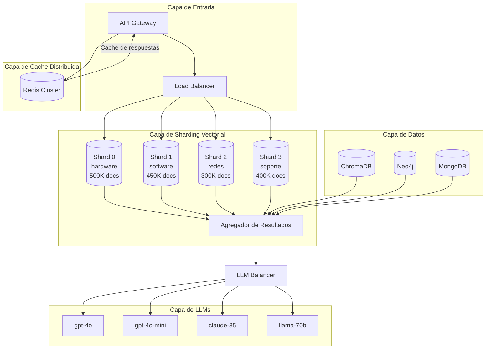
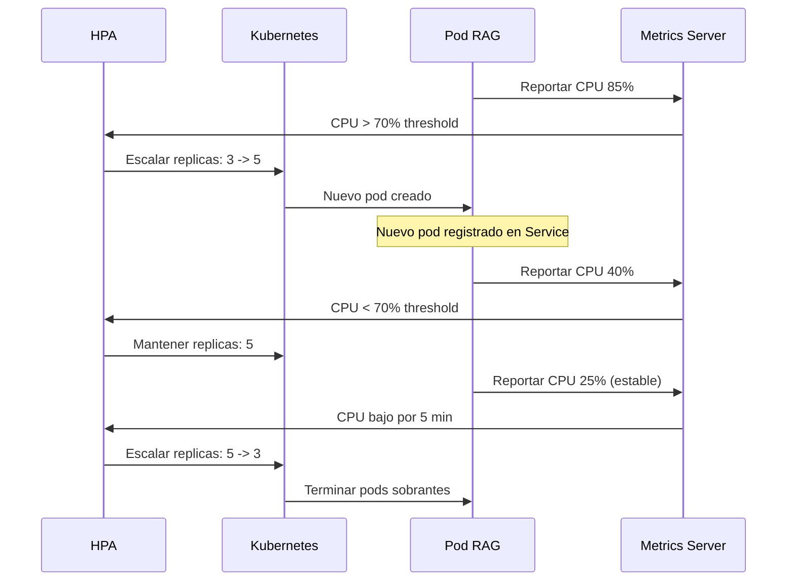
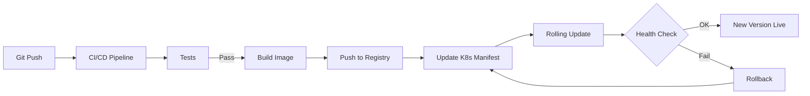

# Clase 30: Escalabilidad y Performance

**Duración:** 4 horas

---

## Objetivos de Aprendizaje

Al finalizar esta clase, los estudiantes serán capaces de:

1. Implementar sharding de bases vectoriales para escalar horizontalmente
2. Diseñar estrategias de caché distribuida con Redis para sistemas RAG
3. Configurar load balancing para APIs de LLM y optimizar costos
4. Monitorear costos operativos y performance con dashboards
5. Desplegar sistemas RAG escalables usando Kubernetes

---

## Contenidos Detallados

### Módulo 1: Sharding de Bases Vectoriales (60 min)

#### 1.1 Fundamentos de Sharding

El sharding distribuye datos a través de múltiples nodos para escalar horizontalmente. Las estrategias principales son:

- **Sharding por Hash:** `hash(doc_id) % N` → distribución uniforme pero sin control semántico
- **Sharding por Contenido:** Partición por categoría, fecha o departamento → consultas filtradas consultan menos shards
- **Sharding por Rango:** Rangos de IDs → útil cuando hay patrones de acceso por segmentos
- **Sharding Geográfico:** Nodos en distintas regiones → baja latencia para usuarios globales

**Implementación:**

```python
import hashlib, random
from typing import List, Dict, Optional, Tuple
from dataclasses import dataclass

@dataclass
class VectorShard:
    shard_id: int
    host: str
    port: int
    documents: Dict[str, List[float]] = None
    def __post_init__(self):
        self.documents = self.documents or {}

class ShardedVectorStore:
    def __init__(self, num_shards: int = 4, strategy: str = "hash"):
        self.num_shards = num_shards
        self.strategy = strategy
        self.shards = [VectorShard(i, f"node-{i}", 8000+i) for i in range(num_shards)]
        self.content_routing: Dict[str, int] = {}

    def add_document(self, doc_id: str, embedding: List[float], metadata: Optional[Dict] = None):
        if self.strategy == "hash":
            sid = int(hashlib.sha256(doc_id.encode()).hexdigest(), 16) % self.num_shards
        elif self.strategy == "content":
            cat = (metadata or {}).get("category", "default")
            if cat not in self.content_routing:
                self.content_routing[cat] = len(self.content_routing) % self.num_shards
            sid = self.content_routing[cat]
        else:
            sid = random.randint(0, self.num_shards - 1)
        self.shards[sid].documents[doc_id] = embedding

    def search(self, query_emb: List[float], top_k: int = 10, metadata_filter: Optional[Dict] = None) -> List[Tuple[str, float]]:
        if self.strategy == "content" and metadata_filter:
            cat = metadata_filter.get("category", "default")
            target = self.content_routing.get(cat)
            if target is not None:
                return self._search_shard(self.shards[target], query_emb, top_k)
        results = []
        for shard in self.shards:
            results.extend(self._search_shard(shard, query_emb, top_k))
        results.sort(key=lambda x: x[1], reverse=True)
        return results[:top_k]

    def _search_shard(self, shard, query_emb, top_k):
        scores = [(did, sum(a*b for a,b in zip(query_emb, demb)) / (sum(a*a for a in query_emb)**0.5 * sum(b*b for b in demb)**0.5 + 1e-10)) for did, demb in shard.documents.items()]
        scores.sort(key=lambda x: x[1], reverse=True)
        return scores[:top_k]

    def get_stats(self):
        return [{"shard_id": s.shard_id, "doc_count": len(s.documents)} for s in self.shards]


if __name__ == "__main__":
    store = ShardedVectorStore(4, "content")
    for i in range(100):
        store.add_document(f"doc_{i}", [random.random() for _ in range(384)], {"category": random.choice(["hw","sw","net","support"])})
    print("=== SHARD STATS ===")
    for s in store.get_stats():
        print(f"  Shard {s['shard_id']}: {s['doc_count']} docs")
    print("\nRouting:"))
    for c, s in store.content_routing.items():
        print(f"  {c} -> Shard {s}")
```

**Ventajas del sharding por contenido:**
- Consultas filtradas solo tocan 1 shard (menos latency, menos costo)
- Escalado horizontal natural: añadir shards = más capacidad
- Aislamiento de fallos: un shard caído no afecta a los demás

**Desventajas:**
- Datos calientes (hot shards): si una categoría es mucho más consultada
- Rebalanceo complejo al añadir/eliminar shards
- Consultas sin filtro requieren scatter-gather (consultar todos los shards)

### Módulo 2: Caché Distribuida con Redis (60 min)

#### 2.1 Redis para Sistemas RAG

Redis es un almacén de estructura de datos en memoria, ideal para:

1. **Caché de embeddings:** Evita regenerar embeddings para textos frecuentes
2. **Caché de respuestas LLM:** Consultas repetidas → respuesta instantánea
3. **Rate limiting:** Control de consultas por usuario/API key
4. **Session state:** Historial de conversaciones multi-turno
5. **Message queue:** Cola de procesamiento asíncrono

```python
import hashlib, time, json
from typing import *

class RedisRAGCache:
    def __init__(self, default_ttl: int = 3600):
        self.default_ttl = default_ttl
        self._store: Dict[str, dict] = {}
        self.hits = self.misses = 0

    def _key(self, prefix, *parts):
        return f"rag:{prefix}:" + ":".join(parts)

    def get(self, prefix: str, *parts) -> Optional[Any]:
        k = self._key(prefix, *parts)
        if k in self._store:
            e = self._store[k]
            if time.time() - e["t"] < e["ttl"]:
                self.hits += 1
                return e["v"]
            del self._store[k]
        self.misses += 1
        return None

    def set(self, v: Any, prefix: str, *parts, ttl: int = None):
        k = self._key(prefix, *parts)
        self._store[k] = {"v": v, "t": time.time(), "ttl": ttl or self.default_ttl}

    def get_response(self, q: str) -> Optional[Dict]:
        return self.get("resp", hashlib.sha256(q.encode()).hexdigest()[:16])

    def set_response(self, q: str, resp: Dict, ttl: int = 3600):
        self.set(resp, "resp", hashlib.sha256(q.encode()).hexdigest()[:16], ttl=ttl)

    def check_rate_limit(self, uid: str, max_r: int = 10, window: int = 60) -> bool:
        k = self._key("rl", uid)
        now = time.time()
        if k not in self._store or now - self._store[k]["t"] > window:
            self._store[k] = {"v": 1, "t": now, "ttl": window}
            return True
        self._store[k]["v"] += 1
        return self._store[k]["v"] <= max_r

    def stats(self) -> dict:
        total = self.hits + self.misses
        return {"keys": len(self._store), "hits": self.hits, "misses": self.misses,
                "hit_rate": round(self.hits/total, 4) if total else 0}


if __name__ == "__main__":
    cache = RedisRAGCache()
    queries = ["Q1?", "Q1?", "Q2?", "Q1?", "Q3?"]
    for q in queries:
        r = cache.get_response(q)
        if r:
            print(f"  HIT | {q}")
        else:
            time.sleep(0.05)
            cache.set_response(q, {"ans": f"R: {q}"})
            print(f"  MISS| {q}")
    print(f"\nHit rate: {cache.stats()['hit_rate']:.1%}")
    
    print("\nRate limit:")
    for i in range(12):
        ok = cache.check_rate_limit("user1", max_r=10)
        print(f"  {i+1}: {'OK' if ok else 'BLOCKED'}")
```

### Módulo 3: Load Balancing para APIs de LLM (60 min)

#### 3.1 Estrategias de Balanceo

Las estrategias de load balancing determinan cómo se distribuyen las requests entre múltiples endpoints de LLM:

| Estrategia | Descripción | Cuándo usarla |
|-----------|-------------|---------------|
| Round Robin | Distribución equitativa secuencial | Endpoints homogéneos |
| Least Connections | Al de menos carga actual | Cargas variables |
| Weighted | Pesos según capacidad/costo | Endpoints heterogéneos |
| Latency-based | Al de menor latencia | Sensibilidad a velocidad |
| Cost-optimized | Balance costo-rendimiento | Presupuesto limitado |

```python
import time, random
from enum import Enum
from dataclasses import dataclass
from typing import *

Strategy = Enum("Strategy", "ROUND_ROBIN LEAST_CONNECTIONS WEIGHTED LATENCY_BASED COST_OPTIMIZED")

@dataclass
class Endpoint:
    name: str; model: str; cost_per_1k: float; max_con: int
    load: int = 0; total_req: int = 0; avg_lat: float = 0.0; errors: int = 0; healthy: bool = True

class LLMBalancer:
    def __init__(self, endpoints: List[Endpoint], strategy: Strategy = Strategy.COST_OPTIMIZED):
        self.eps = endpoints; self.strategy = strategy; self.idx = 0

    def select(self) -> Optional[Endpoint]:
        healthy = [e for e in self.eps if e.healthy]
        if not healthy: return None
        s = self.strategy
        if s == Strategy.ROUND_ROBIN:
            e = healthy[self.idx % len(healthy)]; self.idx += 1; return e
        if s == Strategy.LEAST_CONNECTIONS: return min(healthy, key=lambda e: e.load)
        if s == Strategy.WEIGHTED:
            total = sum(1/max(e.cost_per_1k,0.001) for e in healthy)
            r, cum = random.random() * total, 0
            for e in healthy:
                cum += 1/max(e.cost_per_1k,0.001)
                if r <= cum: return e
            return healthy[-1]
        if s == Strategy.LATENCY_BASED: return min(healthy, key=lambda e: e.avg_lat)
        def score(e): return e.cost_per_1k * 0.6 + e.avg_lat/1000 * 0.4
        return min(healthy, key=score)

    def execute(self, fn: Callable, *args, **kwargs) -> dict:
        for attempt in range(3):
            ep = self.select()
            if not ep: return {"error": "No endpoints available"}
            ep.load += 1
            try:
                start = time.time()
                result = fn(ep, *args, **kwargs)
                lat = (time.time() - start) * 1000
                ep.load -= 1; ep.total_req += 1
                ep.avg_lat = ep.avg_lat * 0.9 + lat * 0.1
                return result
            except Exception as e:
                ep.load -= 1; ep.errors += 1
        return {"error": "All attempts failed"}

    def stats(self) -> dict:
        return {"strategy": self.strategy.name, "endpoints": [
            {"name": e.name, "requests": e.total_req, "lat": round(e.avg_lat,1), "errors": e.errors, "healthy": e.healthy}
            for e in self.eps]}


if __name__ == "__main__":
    eps = [Endpoint("gpt-4o","gpt-4o",0.01,10), Endpoint("gpt-4o-mini","gpt-4o-mini",0.0015,50),
           Endpoint("claude-35","claude-3.5-sonnet",0.008,10), Endpoint("llama-70b","llama-3.1-70b",0.0009,20)]
    lb = LLMBalancer(eps, Strategy.COST_OPTIMIZED)
    def mock(ep, p): time.sleep(random.uniform(0.1,0.3)); return {"response": f"From {ep.name}", "model": ep.model}
    print("=== LOAD BALANCING ===\n")
    for i in range(15):
        r = lb.execute(mock, f"q_{i}")
        print(f"  [{i+1:2d}] {r.get('model','ERROR'):20s}")
    print(f"\nStats:")
    for e in lb.stats()["endpoints"]:
        print(f"  {e['name']:20s} req={e['requests']:3d} lat={e['lat']:6.1f}ms err={e['errors']:2d}")
```

### Módulo 4: Monitoreo y Kubernetes (60 min)

#### 4.1 Monitoreo de Costos y Performance

```python
from typing import Dict, List
from datetime import datetime
from collections import defaultdict

class CostMonitor:
    def __init__(self, budget_daily: float = 50.0):
        self.budget_daily = budget_daily
        self.log: List[Dict] = []
        self.daily = defaultdict(float)

    def log_llm(self, model: str, in_t: int, out_t: int) -> float:
        rates = {"gpt-4o": (0.01, 0.03), "gpt-4o-mini": (0.0015, 0.0045),
                 "claude-3.5-sonnet": (0.008, 0.024), "llama-3.1-70b": (0.0009, 0.0009)}
        r = rates.get(model, (0.01, 0.01))
        cost = in_t/1000*r[0] + out_t/1000*r[1]
        self.log.append({"type":"llm","model":model,"cost":cost,"ts":datetime.utcnow().isoformat()})
        self daily[datetime.utcnow().date().isoformat()] += cost
        return cost

    def log_embed(self, model: str, tokens: int) -> float:
        rates = {"large": 0.00013, "small": 0.00002}
        cost = tokens/1000 * rates.get(model.split("-")[-1], 0.0001)
        self.log.append({"type":"embed","model":model,"cost":cost,"ts":datetime.utcnow().isoformat()})
        self.daily[datetime.utcnow().date().isoformat()] += cost
        return cost

    def log_infra(self, component: str, hours: float, cost_ph: float) -> float:
        cost = hours * cost_ph
        self.log.append({"type":"infra","component":component,"cost":cost,"ts":datetime.utcnow().isoformat()})
        self.daily[datetime.utcnow().date().isoformat()] += cost
        return cost

    def report(self, date: str = None) -> Dict:
        if not date: date = datetime.utcnow().date().isoformat()
        total = self.daily.get(date, 0)
        bd = {"llm":0, "embed":0, "infra":0}
        for e in self.log:
            if e["ts"].startswith(date): bd[e["type"]] += e["cost"]
        return {"date": date, "total": round(total,4), "budget": self.budget_daily,
                "usage": round(total/self.budget_daily*100,1), "breakdown": {k:round(v,4) for k,v in bd.items()}}

    def projection(self, days: int = 30) -> Dict:
        if not self.daily: return {"error": "No data"}
        avg = sum(self.daily.values())/len(self.daily)
        return {"avg_daily": round(avg,4), "projected": round(avg*days,4),
                "budget": self.budget_daily*days, "over": avg*days > self.budget_daily*days}


if __name__ == "__main__":
    m = CostMonitor(50)
    for _ in range(10): m.log_embed("text-embedding-3-small", 500)
    for _ in range(100): m.log_llm("gpt-4o-mini", 1000, 200)
    for _ in range(5): m.log_llm("gpt-4o", 2000, 500)
    m.log_infra("ChromaDB", 24, 0.5)
    m.log_infra("Neo4j", 24, 0.75)
    m.log_infra("API", 24, 0.3)
    m.log_infra("Redis", 24, 0.2)
    
    r = m.report()
    print(f"=== COSTOS DIARIOS ===")
    print(f"Total: ${r['total']} / ${r['budget']} ({r['usage']}%)")
    print(f"Breakdown:")
    for comp, cost in r["breakdown"].items():
        print(f"  {comp}: ${cost}")
    p = m.projection()
    print(f"\nProyeccion mensual: ${p['projected']} (budget: ${p['budget']})")
    print(f"Over: {p['over']}")
```

#### 4.2 Kubernetes para RAG

```yaml
apiVersion: apps/v1
kind: Deployment
metadata:
  name: rag-api
  labels:
    app: rag-api
spec:
  replicas: 3
  selector:
    matchLabels:
      app: rag-api
  template:
    metadata:
      labels:
        app: rag-api
    spec:
      containers:
      - name: rag-api
        image: tia-cerebro-cognitivo:latest
        ports:
        - containerPort: 8000
        env:
        - name: OPENAI_API_KEY
          valueFrom:
            secretKeyRef:
              name: api-secrets
              key: openai-key
        - name: CHROMA_HOST
          value: "chroma-service"
        - name: NEO4J_URI
          value: "bolt://neo4j-service:7687"
        - name: REDIS_HOST
          value: "redis-service"
        resources:
          requests:
            memory: "1Gi"
            cpu: "500m"
          limits:
            memory: "2Gi"
            cpu: "1000m"
        livenessProbe:
          httpGet:
            path: /health
            port: 8000
          initialDelaySeconds: 30
          periodSeconds: 10
        readinessProbe:
          httpGet:
            path: /ready
            port: 8000
          initialDelaySeconds: 5
          periodSeconds: 5
---
apiVersion: v1
kind: Service
metadata:
  name: rag-api-service
spec:
  selector:
    app: rag-api
  ports:
  - port: 80
    targetPort: 8000
  type: LoadBalancer
---
apiVersion: autoscaling/v2
kind: HorizontalPodAutoscaler
metadata:
  name: rag-api-hpa
spec:
  scaleTargetRef:
    apiVersion: apps/v1
    kind: Deployment
    name: rag-api
  minReplicas: 2
  maxReplicas: 10
  metrics:
  - type: Resource
    resource:
      name: cpu
      target:
        type: Utilization
        averageUtilization: 70
  - type: Resource
    resource:
      name: memory
      target:
        type: Utilization
        averageUtilization: 80
```

---

## Diagramas en Mermaid

### Diagrama 1: Arquitectura de Escalabilidad



### Diagrama 2: Flujo de Escalado Automático



### Diagrama 3: Pipeline de Despliegue Continuo



---

## Referencias Externas

### Sharding Vectorial
- **Pinecone Sharding:** https://docs.pinecone.io/docs/manage-indexes
- **Qdrant Sharding:** https://qdrant.tech/documentation/guides/distributed_deployment/
- **Milvus Sharding:** https://milvus.io/docs/architecture_overview.md

### Redis
- **Redis Documentation:** https://redis.io/docs/
- **Redis-py:** https://github.com/redis/redis-py
- **Redis RAG Patterns:** https://redis.io/redis-for-ai/

### Load Balancing
- **Nginx Load Balancing:** https://docs.nginx.com/nginx/admin-guide/load-balancer/
- **AWS ALB:** https://aws.amazon.com/elasticloadbalancing/
- **LLM Routing Strategies:** https://www.kaggle.com/llm-routing

### Kubernetes
- **Kubernetes Documentation:** https://kubernetes.io/docs/
- **Kubernetes HPA:** https://kubernetes.io/docs/tasks/run-application/horizontal-pod-autoscale/
- **Kubeflow for ML:** https://www.kubeflow.org/

### Monitoreo
- **Prometheus:** https://prometheus.io/
- **Grafana:** https://grafana.com/
- **Datadog for LLM Monitoring:** https://www.datadoghq.com/solutions/llm/

---

## Ejercicios Prácticos Resueltos

### Ejercicio 1: Sharding + Cache + Load Balancing

**Problema:** Implementar un pipeline completo de escalabilidad que integre sharding, caché Redis y load balancing.

```python
import hashlib, time, random, json
from typing import *

class ScalableRAGPipeline:
    def __init__(self):
        self.shards = ShardedVectorStore(4, "content")
        self.cache = RedisRAGCache()
        self.balancer = LLMBalancer([
            Endpoint("gpt-4o","gpt-4o",0.01,10),
            Endpoint("gpt-4o-mini","gpt-4o-mini",0.0015,50)
        ])

    def query(self, q: str, category: str = None) -> Dict:
        # 1. Check cache
        cached = self.cache.get_response(q)
        if cached: return {"source": "cache", "response": cached}

        # 2. Vector search with shard filtering
        q_emb = [random.random() for _ in range(384)]  # simulated
        results = self.shards.search(q_emb, top_k=5, metadata_filter={"category": category} if category else None)

        # 3. LLM generation with load balancing
        context = "\n".join([r[0] for r in results])
        def call_llm(ep, ctx):
            time.sleep(random.uniform(0.05, 0.15))
            return {"response": f"Generated by {ep.name}", "model": ep.model}

        llm_result = self.balancer.execute(call_llm, context)

        # 4. Cache and return
        self.cache.set_response(q, llm_result)
        return {"source": "pipeline", "response": llm_result, "shards_consulted": len(self.shards.shards)}

    def stats(self) -> Dict:
        return {"cache": self.cache.stats(), "balancer": self.balancer.stats()}


if __name__ == "__main__":
    pipe = ScalableRAGPipeline()
    for q in ["Q1?", "Q1?", "Q2?", "Q3?", "Q2?"]:
        r = pipe.query(q, category="hw")
        print(f"  {r['source']:10s} | {q}")
    print(f"\nCache: {pipe.stats()['cache']['hit_rate']:.0%} hit rate")
```

### Ejercicio 2: Auto-escalado con Kubernetes

**Problema:** Configurar auto-escalado para un deployment RAG basado en métricas de latency y CPU.

```python
class K8sAutoScalerConfig:
    def __init__(self):
        self.config = {
            "apiVersion": "autoscaling/v2",
            "kind": "HorizontalPodAutoscaler",
            "metadata": {"name": "rag-hpa"},
            "spec": {
                "scaleTargetRef": {"apiVersion": "apps/v1", "kind": "Deployment", "name": "rag-api"},
                "minReplicas": 3,
                "maxReplicas": 20,
                "metrics": [
                    {"type": "Resource", "resource": {"name": "cpu", "target": {"type": "Utilization", "averageUtilization": 70}}},
                    {"type": "Pods", "pods": {"metric": {"name": "rag_latency_p50"}, "target": {"type": "AverageValue", "averageValue": "2s"}}}
                ],
                "behavior": {
                    "scaleUp": {"stabilizationWindowSeconds": 60, "policies": [{"type": "Pods", "value": 4, "periodSeconds": 60}]},
                    "scaleDown": {"stabilizationWindowSeconds": 300, "policies": [{"type": "Pods", "value": 2, "periodSeconds": 120}]}
                }
            }
        }

    def to_yaml(self) -> str:
        import yaml
        return yaml.dump(self.config, default_flow_style=False)


scaler = K8sAutoScalerConfig()
print("=== HPA CONFIG ===")
print(scaler.to_yaml())
```

---

## Actividades de Laboratorio

### Laboratorio 1: Sharding Vectorial (40 min)

**Objetivo:** Implementar sharding por contenido para una base vectorial.

**Pasos:**
1. Crear `ShardedVectorStore` con 4 shards simulados
2. Insertar 200 documentos con categorías (hardware, software, redes)
3. Implementar búsqueda en shard específico vs todos los shards
4. Medir tiempo de respuesta: búsqueda filtrada vs scatter-gather
5. Añadir un shard nuevo y rebalancear datos

### Laboratorio 2: Redis Cache + Rate Limiting (40 min)

**Objetivo:** Integrar Redis para cache y rate limiting.

**Pasos:**
1. Configurar Redis local (Docker o instalación directa)
2. Implementar `RedisRAGCache` con redis-py real
3. Probar hit rate con consultas repetidas
4. Configurar rate limiting: 10 req/min por usuario
5. Verificar bloqueo al exceder límite

### Laboratorio 3: Load Balancing + Kubernetes (40 min)

**Objetivo:** Configurar balanceo de carga para APIs de LLM.

**Pasos:**
1. Definir 3 endpoints de LLM con diferentes costos y capacidades
2. Implementar estrategia cost-optimized
3. Simular 50 requests y analizar distribución
4. Configurar deployment de Kubernetes con HPA
5. Probar escalado automático con carga creciente

---

## Resumen de Puntos Clave

1. **Sharding por contenido** permite escalar horizontalmente y reduce nodos a consultar cuando hay filtros (menos latency y costo).

2. **Redis** proporciona caché en memoria de alta velocidad: embeddings, respuestas LLM, rate limiting y sesiones. Hit rates > 80% reducen drásticamente costos de API.

3. **Load balancing** distribuye requests entre múltiples LLMs según estrategia: Round Robin (homogéneo), Cost-optimized (balance costo/latencia), Latency-based (velocidad).

4. **Kubernetes HPA** escala automáticamente según CPU, memoria o métricas personalizadas (latencia p50 < 2s). El stabilization window evita oscilaciones.

5. **Monitoreo de costos** debe rastrear LLM (mayor gasto), embeddings y infraestructura. La proyección mensual alerta sobre desviaciones del presupuesto.

6. **El pipeline escalable** combina: caché (primera línea) → sharding (segunda) → LLM balancing (tercera) → degradación graceful (fallback).
