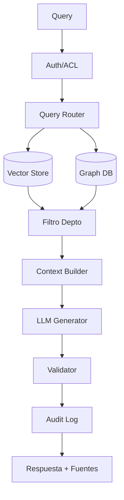
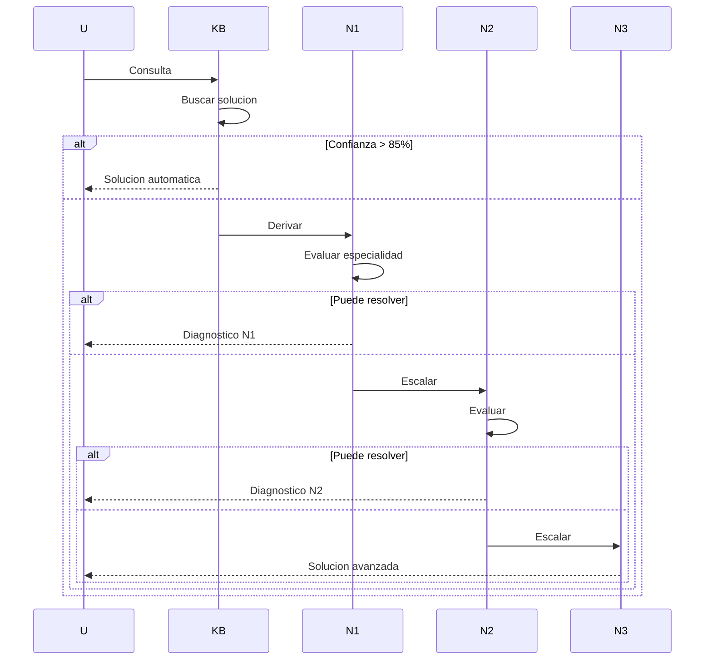
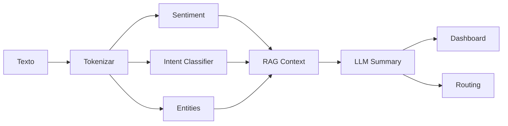

# Clase 31: Casos de Uso Industriales

**Duración:** 4 horas

---

## Objetivos de Aprendizaje

Al finalizar esta clase, los estudiantes serán capaces de:

1. Diseñar sistemas RAG para Q&A empresarial con documentación interna
2. Implementar asistentes legales y de compliance con verificación de fuentes
3. Construir sistemas de soporte técnico automatizado multi-agente
4. Desarrollar pipelines de análisis de sentimiento y clasificación
5. Adaptar la arquitectura del Cerebro Cognitivo a dominios sectoriales específicos

---

## Contenidos Detallados

### Módulo 1: Q&A Empresarial con Documentación Interna (60 min)

#### 1.1 Arquitectura para Q&A Corporativo

El caso de uso más común para RAG empresarial es responder preguntas sobre documentación interna: políticas de RRHH, manuales de procedimientos, etc.

**Requisitos específicos:**
- Control de acceso por departamento/rol
- Actualización de documentación con versionado
- Citación obligatoria de fuentes internas
- Confidencialidad: no exponer datos sensibles

```python
import hashlib, json, time
from typing import *
from datetime import datetime

class CorporateQAPipeline:
    def __init__(self, vector_store, graph_db):
        self.vs = vector_store
        self.gd = graph_db
        self.access_control = AccessController()
        self.version_tracker = VersionTracker()
        self.audit_log = AuditLogger()

    def answer(self, query: str, user_id: str, department: str) -> Dict:
        user = self.access_control.get_user(user_id)
        if not user or department not in user.get("departments", []):
            return {"error": "Access denied", "status": 403}
        docs = self.vs.similarity_search(query, k=5, filter={"department": department})
        filtered = [d for d in docs if d.metadata.get("clearance", 0) <= user["clearance"]]
        context = "\n\n".join([f"[{d.metadata['source']} v{d.metadata['version']}]: {d.page_content}" for d in filtered])
        answer = f"Respuesta basada en {len(filtered)} documentos del departamento {department}"
        self.audit_log.log(user_id, query, {"docs_used": [d.metadata["source"] for d in filtered]})
        return {"answer": answer, "sources": [d.metadata["source"] for d in filtered], "status": 200}

    def ingest_document(self, doc: Dict, department: str, version: str):
        self.version_tracker.register(doc["id"], version)
        # En producción: vector_store.add_documents(...)


class AccessController:
    def __init__(self):
        self.users = {"user_1": {"name": "Ana", "departments": ["RRHH", "Legal"], "clearance": 5},
                      "user_2": {"name": "Carlos", "departments": ["IT"], "clearance": 3}}

    def get_user(self, uid: str) -> Optional[Dict]:
        return self.users.get(uid)


class VersionTracker:
    def __init__(self):
        self.versions: Dict[str, List[str]] = {}
        self.departments: Dict[str, str] = {}

    def register(self, doc_id: str, version: str, department: str = "general"):
        self.versions[doc_id] = [version]
        self.departments[doc_id] = department


class AuditLogger:
    def __init__(self):
        self.logs: List[Dict] = []

    def log(self, user_id: str, query: str, metadata: Dict):
        self.logs.append({"user": user_id, "query": query, **metadata})


if __name__ == "__main__":
    pipeline = CorporateQAPipeline(None, None)
    pipeline.ingest_document({"id": "POL-001", "content": "Vacaciones: 15 dias anticipacion",
                              "source": "Politica_Vacaciones_2026.pdf"}, "RRHH", "2.1")
    resp = pipeline.answer("Dias anticipacion vacaciones?", "user_1", "RRHH")
    print(f"Q: vacaciones?")
    print(f"A: {resp['answer']}")
    print(f"Sources: {resp['sources']}")
    print(f"Status: {resp['status']}")
```

### Módulo 2: Asistentes Legales y de Compliance (60 min)

#### 2.1 Sistema de Consulta Legal

Los asistentes legales RAG requieren máxima precisión: verificación de vigencia, citación precisa (artículo, inciso, ley), jurisdicción y disclaimers.

```python
class LegalAssistant:
    def __init__(self):
        self.sources = [
            {"id": "L-001", "tipo": "ley", "nombre": "Ley Proteccion Datos",
             "articulo": "Art. 15", "texto": "Derecho de acceso a datos personales",
             "jurisdiccion": "Espana", "vigente": True, "fecha": "2018-12-05"},
            {"id": "L-002", "tipo": "reglamento", "nombre": "RGPD",
             "articulo": "Art. 17", "texto": "Derecho al olvido",
             "jurisdiccion": "UE", "vigente": True, "fecha": "2016-04-27"},
        ]

    def query(self, q: str, jurisdiccion: str = "Espana") -> Dict:
        ql = q.lower()
        relevant = []
        for src in self.sources:
            score = 0
            if jurisdiccion.lower() in src["jurisdiccion"].lower(): score += 0.3
            if any(w in src["texto"].lower() for w in ql.split()): score += 0.5
            if any(w in src["nombre"].lower() for w in ql.split()): score += 0.2
            if score > 0:
                relevant.append({**src, "score": score})

        relevant.sort(key=lambda x: x["score"], reverse=True)
        top = relevant[:3]

        if not top:
            return {"answer": "No se encontraron referencias legales.",
                    "confidence": 0, "disclaimer": "Esto no constituye asesoria legal."}

        context = "\n\n".join([f"[{s['tipo'].upper()}] {s['nombre']}, {s['articulo']}\n"
                              f"Jurisdiccion: {s['jurisdiccion']}\n{s['texto']}" for s in top])
        return {"answer": f"Segun normativa en {jurisdiccion}:\n\n{context}",
                "sources": [s["id"] for s in top],
                "confidence": sum(s["score"] for s in top) / len(top),
                "disclaimer": "Consulte a un profesional legal para casos especificos."}


legal = LegalAssistant()
r = legal.query("Derecho al olvido eliminar datos", "UE")
print(f"Answer:\n{r['answer']}")
print(f"Confidence: {r['confidence']:.0%}")
print(f"Disclaimer: {r['disclaimer']}")
```

### Módulo 3: Soporte Técnico Automatizado (60 min)

#### 3.1 Sistema Multi-Agente de Soporte

```python
import time, random
from typing import *
from enum import Enum

class TicketPriority(Enum):
    LOW = 1; MEDIUM = 2; HIGH = 3; CRITICAL = 4

class SupportTicket:
    def __init__(self, user: str, issue: str, product: str, priority: TicketPriority):
        self.id = f"TKT-{random.randint(1000,9999)}"
        self.user = user; self.issue = issue; self.product = product
        self.priority = priority; self.status = "open"
        self.resolution = None; self.assigned_agent = None

class SupportAgent:
    def __init__(self, name: str, specialty: str, max_tickets: int = 5):
        self.name = name; self.specialty = specialty
        self.max_tickets = max_tickets; self.tickets = []

    def can_handle(self, ticket: SupportTicket) -> bool:
        return len(self.tickets) < self.max_tickets and (self.specialty in ticket.issue or self.specialty in ticket.product)

    def assign(self, ticket: SupportTicket):
        self.tickets.append(ticket); ticket.assigned_agent = self.name; ticket.status = "in_progress"

class TechnicalKB:
    def __init__(self):
        self.articles = [
            {"keywords": ["sobrecalentamiento", "calor"], "solution": "Actualizar firmware sensor a v2.1.0"},
            {"keywords": ["bateria", "no carga"], "solution": "Reemplazar bateria PowerCell 5000mAh"},
        ]

    def search(self, issue: str) -> Optional[Dict]:
        il = issue.lower()
        for a in self.articles:
            match = sum(1 for k in a["keywords"] if k in il)
            if match > 0:
                return {"solution": a["solution"], "confidence": match / len(a["keywords"])}
        return None

class SupportOrchestrator:
    def __init__(self):
        self.agents = [SupportAgent("N1-Hardware", "hardware"), SupportAgent("N1-Software", "software"),
                       SupportAgent("N2-Redes", "redes"), SupportAgent("N3-Especializado", "kernel")]
        self.kb = TechnicalKB()
        self.tickets = []

    def create_ticket(self, user: str, issue: str, product: str, priority: TicketPriority):
        ticket = SupportTicket(user, issue, product, priority)
        self.tickets.append(ticket)
        kb_result = self.kb.search(issue)
        if kb_result and kb_result["confidence"] > 0.85:
            ticket.resolution = kb_result["solution"]; ticket.status = "resolved"
            print(f"  [KB] Resuelto: {kb_result['solution'][:50]}...")
            return ticket
        for agent in self.agents:
            if agent.can_handle(ticket):
                agent.assign(ticket)
                print(f"  [Agent] {agent.name} asignado a {ticket.id}")
                return ticket
        ticket.status = "escalated"
        print(f"  [Escalar] {ticket.id} a humano")
        return ticket


support = SupportOrchestrator()
issues = [("user1", "La laptop se sobrecalienta en reposo", "ProBook X1", TicketPriority.HIGH),
          ("user2", "La bateria no carga", "TabTech A10", TicketPriority.MEDIUM)]
for user, issue, product, priority in issues:
    print(f"\nIssue: {issue[:40]}...")
    support.create_ticket(user, issue, product, priority)
```

### Módulo 4: Análisis de Sentimiento y Clasificación (60 min)

#### 4.1 Pipeline de Análisis de Sentimiento

```python
import re
from typing import *
from collections import Counter

class SentimentAnalyzer:
    def __init__(self):
        self.positive = {"excelente","bueno","satisfecho","rapido","eficiente","recomiendo","genial"}
        self.negative = {"malo","pesimo","lento","dificil","error","falla","queja","terrible"}
        self.intensifiers = {"muy","extremadamente","absolutamente"}

    def analyze(self, text: str) -> Dict:
        words = set(re.findall(r'\w+', text.lower()))
        pos = sum(1 for w in words if w in self.positive)
        neg = sum(1 for w in words if w in self.negative)
        net = pos - neg
        normalized = net / (pos + neg + 1)
        sentiment = "positive" if normalized > 0.2 else ("negative" if normalized < -0.2 else "neutral")
        return {"sentiment": sentiment, "score": round(normalized, 3), "pos": pos, "neg": neg}

    def classify_intent(self, text: str) -> Dict:
        intents = {"soporte": ["error","falla","ayuda"], "consulta": ["que","como","cuando"],
                   "queja": ["queja","devolucion"], "sugerencia": ["sugiero","mejora"], "compra": ["comprar","precio"]}
        tl = text.lower()
        scores = {i: sum(1 for k in kws if k in tl) for i, kws in intents.items()}
        best = max(scores, key=scores.get)
        return {"intent": best if scores[best] > 0 else "unknown", "confidence": scores[best]/max(sum(scores.values()),1)}


analyzer = SentimentAnalyzer()
feedbacks = ["Producto excelente, muy rapido y facil! Lo recomiendo",
             "Pesimo, la laptop falla constantemente",
             "Como actualizo el firmware?"]

print("=== ANALISIS DE SENTIMIENTO ===\n")
for fb in feedbacks:
    s = analyzer.analyze(fb)
    i = analyzer.classify_intent(fb)
    icon = {"positive":"+","negative":"-","neutral":"~"}[s["sentiment"]]
    print(f"[{icon}] {s['sentiment']:8s} ({s['score']:.2f}) | Intent: {i['intent']:10s} | {fb[:40]}...")
```

---

## Diagramas en Mermaid

### Diagrama 1: Arquitectura Q&A Empresarial



### Diagrama 2: Soporte Multi-Agente



### Diagrama 3: Pipeline de Sentimiento



---

## Referencias Externas

- **LangChain Enterprise RAG:** https://blog.langchain.dev/enterprise-rag/
- **Harvey AI (Legal):** https://www.harvey.ai/
- **Zendesk AI:** https://www.zendesk.com/ai/
- **VADER Sentiment:** https://github.com/cjhutto/vaderSentiment
- **Hugging Face Sentiment:** https://huggingface.co/models?pipeline_tag=text-classification

---

## Ejercicios Prácticos Resueltos

### Ejercicio 1: Q&A con Control de Acceso

```python
class EnterpriseQA:
    def __init__(self):
        self.users = {"ana": {"dept": "RRHH", "clearance": 5},
                      "carlos": {"dept": "IT", "clearance": 3}}
        self.docs = {"POL-001": {"dept": "RRHH", "min_clear": 1, "content": "Vacaciones 15 dias"},
                     "POL-002": {"dept": "RRHH", "min_clear": 4, "content": "Salarios confidenciales"},
                     "TEC-001": {"dept": "IT", "min_clear": 1, "content": "Manual instalacion"}}

    def query(self, q: str, user: str) -> Dict:
        u = self.users.get(user)
        if not u: return {"error": "No autorizado", "status": 403}
        relevant = [{"id": did, **d} for did, d in self.docs.items()
                    if d["dept"] == u["dept"] and d["min_clear"] <= u["clearance"]]
        if not relevant: return {"answer": "Sin acceso a documentos relevantes"}
        context = "\n".join([f"[{r['id']}]: {r['content']}" for r in relevant])
        return {"answer": f"Documentos para {user}:\n\n{context}", "sources": [r["id"] for r in relevant]}


eqa = EnterpriseQA()
for u in ["ana", "carlos"]:
    r = eqa.query("politicas", u)
    print(f"\n[{u}]")
    print(r["answer"])
```

### Ejercicio 2: Asistente Legal Multi-jurisdicción

```python
class LegalMultiJurisdiction:
    def __init__(self):
        self.rules = [{"id": "R1", "jurisdicciones": ["Espana","UE"], "tema": "datos",
                       "texto": "Consentimiento explicito e informado"},
                      {"id": "R2", "jurisdicciones": ["Espana"], "tema": "laboral",
                       "texto": "Jornada maxima 40h/semana"},
                      {"id": "R3", "jurisdicciones": ["Mexico"], "tema": "datos",
                       "texto": "Consentimiento tacito o expreso"}]

    def query(self, q: str, jurisdiccion: str) -> Dict:
        ql = q.lower()
        relevant = [r for r in self.rules if jurisdiccion in r["jurisdicciones"]
                   and any(w in r["tema"] for w in ql.split())]
        if not relevant: return {"answer": f"Sin normas en {jurisdiccion}", "confidence": 0}
        return {"answer": "\n".join([f"[{r['id']}] {r['texto']}" for r in relevant]),
                "sources": [r["id"] for r in relevant],
                "confidence": len(relevant)/max(len(self.rules),1)}


lmj = LegalMultiJurisdiction()
for q, j in [("proteccion datos", "Espana"), ("proteccion datos", "Mexico"), ("jornada", "Espana")]:
    r = lmj.query(q, j)
    print(f"\n[{j}] {q}")
    print(r["answer"][:100])
    print(f"Conf: {r['confidence']:.0%}")
```

---

## Actividades de Laboratorio

### Lab 1: Q&A Corporativo (40 min)
1. Definir 3 departamentos y 5 usuarios
2. Indexar documentos con metadatos
3. Implementar filtro por departamento
4. Verificar control de acceso

### Lab 2: Asistente Legal (40 min)
1. Indexar 10 artículos legales con fecha y jurisdicción
2. Verificar vigencia de cada fuente
3. Filtrar por jurisdicción en consultas
4. Incluir disclaimer automático

### Lab 3: Soporte Multi-Agente (40 min)
1. Definir 3 niveles de soporte
2. Implementar KB con 10 artículos
3. Routing: KB -> N1 -> N2 -> N3 -> Humano
4. Medir tasa de auto-resolución

---

## Resumen de Puntos Clave

1. **Q&A empresarial** requiere control de acceso, versionado y auditoría
2. **Asistentes legales** necesitan jurisdicción, vigencia y disclaimers
3. **Soporte multi-agente** sigue jerarquía KB -> N1 -> N2 -> N3 -> Humano
4. **Análisis de sentimiento** combinado con RAG permite entender contexto del feedback
5. **Tasa de auto-resolución** ideal > 70% en soporte técnico
6. **Precisión legal** debe ser máxima con citación completa
