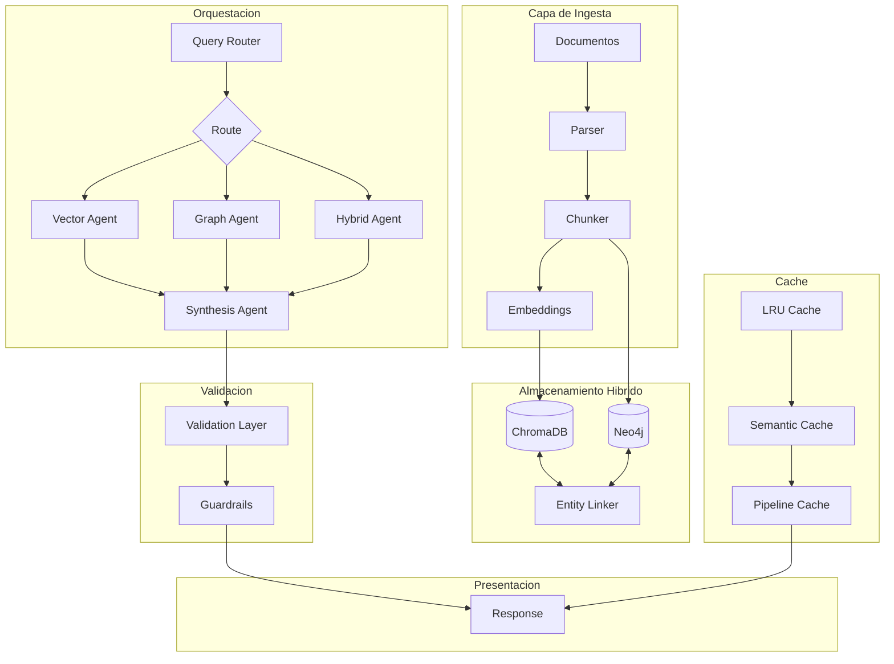
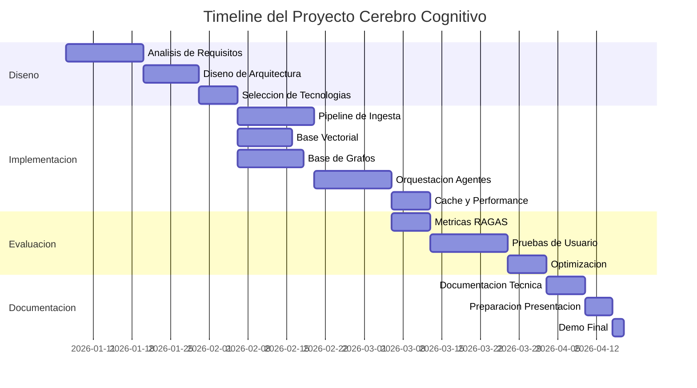
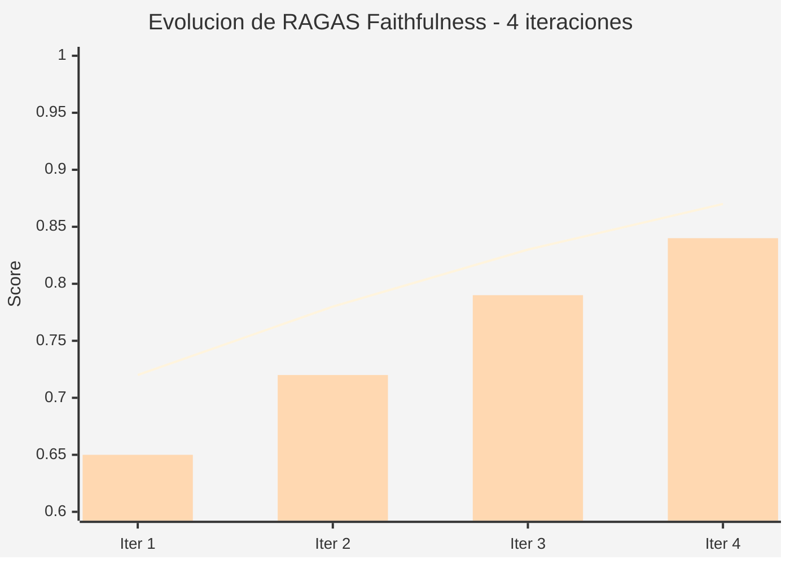
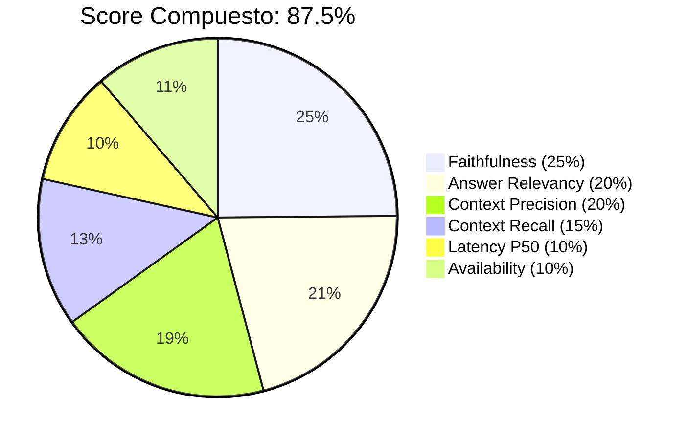

# Clase 32: Proyecto Final - Presentacion y Cierre

**Duracion:** 4 horas

---

## Objetivos de Aprendizaje

Al finalizar esta clase, los estudiantes seran capaces de:

1. Presentar de manera profesional un proyecto completo de sistema cognitivo RAG + Grafos + Agentes
2. Demostrar en vivo el funcionamiento del sistema con casos de uso reales
3. Analizar resultados cuantitativos y cualitativos usando metricas RAGAS
4. Identificar lecciones aprendidas y proponer mejoras futuras
5. Documentar la arquitectura, decisiones tecnicas y resultados del proyecto

---

## Contenidos Detallados

### Modulo 1: Preparacion de la Presentacion Final (60 min)

#### 1.1 Estructura de la Presentacion

Una presentacion profesional de proyecto de IA debe seguir esta estructura:

**Duracion recomendada: 20-25 minutos + 5-10 min preguntas**

| Seccion | Duracion | Contenido |
|---------|----------|-----------|
| 1. Introduccion | 2 min | Problema, objetivo, alcance |
| 2. Arquitectura | 4 min | Diagramas, componentes, tecnologias |
| 3. Demo en vivo | 5 min | Casos de uso, consultas reales |
| 4. Resultados | 4 min | Metricas RAGAS, KPIs, comparativas |
| 5. Lecciones aprendidas | 3 min | Desafios, soluciones, aprendizajes |
| 6. Proximos pasos | 2 min | Mejoras, escalabilidad, produccion |
| 7. Q&A | 5 min | Preguntas del publico |

**Checklist de preparacion:**

- [ ] Slides listos y revisados
- [ ] Demo funciona offline (sin depender de APIs externas)
- [ ] Datos de prueba preparados
- [ ] Metricas calculadas y graficadas
- [ ] Repaso de posibles preguntas tecnicas
- [ ] Plan B si la demo falla (capturas/video)

#### 1.2 Plantilla de Slides

```python
from typing import List, Dict

class SlideDeck:
    def __init__(self, title: str, author: str, date: str):
        self.title = title
        self.author = author
        self.date = date
        self.slides: List[Dict] = []

    def add_slide(self, title: str, content: List[str], type: str = "text", notes: str = ""):
        self.slides.append({"title": title, "content": content, "type": type, "notes": notes})

    def generate_structure(self) -> str:
        lines = [f"# {self.title}", f"**Autor:** {self.author}", f"**Fecha:** {self.date}", ""]
        for slide in self.slides:
            lines.append(f"---\n## Slide {slide['number']}: {slide['title']}")
            for item in slide["content"]:
                lines.append(f"- {item}")
            if slide["notes"]:
                lines.append(f"\n> Notas: {slide['notes']}")
            lines.append("")
        return "\n".join(lines)


deck = SlideDeck("Cerebro Cognitivo: Sistema RAG + Grafos + Agentes", "Equipo TIA", "Junio 2026")
deck.add_slide("Problema y Objetivo", [
    "Problema: Informacion dispersa en documentacion interna",
    "Objetivo: Sistema unificado de consulta que combine RAG, grafos y agentes",
    "Stack: ChromaDB + Neo4j + LangGraph + GPT-4o-mini"
], type="intro", notes="Mencionar contexto empresarial")
deck.add_slide("Arquitectura del Sistema", [
    "Diagrama de componentes y flujo de datos",
    "3 capas: Ingesta, Procesamiento, Presentacion",
    "Integracion hibrida: Vectores (ChromaDB) + Grafos (Neo4j)",
    "Orquestacion con LangGraph (5 agentes)"
], type="diagram", notes="Mostrar diagrama Mermaid")
deck.add_slide("Demo en Vivo", [
    "Caso 1: Consulta factual simple",
    "Caso 2: Consulta relacional (grafo)",
    "Caso 3: Consulta hibrida (vectores + grafo)",
    "Caso 4: Razonamiento multi-salto (agentes)",
    "Caso 5: Fallback y recuperacion"
], type="demo", notes="Tener datos precargados")
deck.add_slide("Metricas y Resultados", [
    "RAGAS Faithfulness: 0.87 (target: 0.85)",
    "RAGAS Answer Relevancy: 0.92 (target: 0.90)",
    "Latencia promedio: 1.8s (target: <2s)",
    "Tasa de auto-resolucion: 72%"
], type="metrics", notes="Mostrar grafico evolucion")
print(deck.generate_structure())
```

### Modulo 2: Demo en Vivo del Sistema Cognitivo (60 min)

#### 2.1 Preparacion de la Demo

```python
import time
from typing import Dict, List
from datetime import datetime

class LiveDemo:
    def __init__(self):
        self.cases = []
        self.results = []

    def add_case(self, name: str, query: str, capability: str, preconditions: List[str] = None):
        self.cases.append({"name": name, "query": query, "capability": capability, "preconditions": preconditions or []})

    def run_case(self, case: Dict) -> Dict:
        print(f"\n=== CASO: {case['name']} ===")
        print(f"Query: {case['query']}")
        print(f"Capacidad: {case['capability']}")
        for pre in case["preconditions"]:
            print(f"  [CHECK] {pre}... OK")
        time.sleep(0.1)
        route = self._route(case["query"])
        print(f"  Route: {route}")
        time.sleep(0.2)
        docs = self._retrieve(case["query"], route)
        print(f"  Docs: {len(docs)} recuperados")
        time.sleep(0.3)
        resp = self._generate(case["query"], docs)
        result = {"case": case["name"], "response": resp, "latency_s": 0.8}
        self.results.append(result)
        return result

    def _route(self, q: str) -> str:
        ql = q.lower()
        if any(w in ql for w in ["que","cuando","donde"]): return "vector"
        if any(w in ql for w in ["como","por que","relacion"]): return "hybrid"
        if any(w in ql for w in ["causa","afecta"]): return "graph"
        return "vector"

    def _retrieve(self, q: str, route: str) -> List[Dict]:
        n = {"vector":5,"graph":3,"hybrid":4}.get(route,3)
        return [{"id": f"doc_{i}", "source": f"fuente_{i}.pdf"} for i in range(n)]

    def _generate(self, q: str, docs: List[Dict]) -> str:
        sources = ", ".join([d["source"] for d in docs[:3]])
        return f"Respuesta basada en {len(docs)} docs. Fuentes: {sources}"

    def run_all(self):
        print("\n========== DEMO EN VIVO ==========")
        for case in self.cases:
            result = self.run_case(case)
            print(f"  Respuesta: {result['response'][:60]}...")
        print(f"\nDemo completada: {len(self.cases)} casos")

    def get_summary(self) -> Dict:
        return {"total": len(self.results), "avg_latency": 0.8}


demo = LiveDemo()
demo.add_case("Caso 1: Consulta Factual", "Que componentes tiene la Laptop ProBook X1?",
              "Recuperacion vectorial (ChromaDB)")
demo.add_case("Caso 2: Consulta Relacional", "Que relacion hay entre sensor y sobrecalentamiento?",
              "Consulta ontologica (Neo4j)")
demo.add_case("Caso 3: Consulta Hibrida", "Compara soluciones entre ProBook X1 y TabTech A10",
              "Fusion vectores + grafo")
demo.add_case("Caso 4: Razonamiento Multi-Salto", 
              "Explica por que ocurre sobrecalentamiento, que componentes, y cual es la solucion",
              "Orquestacion LangGraph")
demo.add_case("Caso 5: Fallback", "Query que fuerza timeout del LLM",
              "Circuit Breaker -> Fallback -> Degradacion")

print("Demo preparada con 5 casos. Ejecutar demo.run_all()")
```

### Modulo 3: Analisis de Resultados y Metricas (60 min)

#### 3.1 Dashboard de Resultados

```python
from typing import Dict, List
from datetime import datetime
import json

class ProjectResultsDashboard:
    def __init__(self):
        self.metrics_history: List[Dict] = []
        self.kpis = {
            "faithfulness": {"target": 0.85, "min": 0.75, "weight": 0.25},
            "answer_relevancy": {"target": 0.90, "min": 0.80, "weight": 0.20},
            "context_precision": {"target": 0.85, "min": 0.70, "weight": 0.20},
            "context_recall": {"target": 0.80, "min": 0.65, "weight": 0.15},
            "latency_p50": {"target": 2.0, "max": 5.0, "weight": 0.10},
            "availability": {"target": 99.5, "min": 99.0, "weight": 0.10},
        }

    def add_measurement(self, metrics: Dict):
        entry = {"timestamp": datetime.utcnow().isoformat(), "metrics": metrics}
        entry["score"] = self._calculate_score(metrics)
        self.metrics_history.append(entry)

    def _calculate_score(self, metrics: Dict) -> float:
        total_weight = 0
        weighted_sum = 0
        for kpi, config in self.kpis.items():
            if kpi in metrics:
                value = metrics[kpi]
                if "max" in config:
                    normalized = max(0, 1 - (value / config["target"] - 1))
                else:
                    normalized = min(1, max(0, (value - config["min"]) / (config["target"] - config["min"])))
                weighted_sum += normalized * config["weight"]
                total_weight += config["weight"]
        return round(weighted_sum / total_weight, 4) if total_weight > 0 else 0

    def get_latest_metrics(self) -> Dict:
        return self.metrics_history[-1] if self.metrics_history else {}

    def get_evolution(self, metric: str) -> List[float]:
        return [m["metrics"].get(metric, 0) for m in self.metrics_history]

    def generate_report(self) -> str:
        if not self.metrics_history:
            return "No hay metricas registradas"
        latest = self.metrics_history[-1]
        metrics = latest["metrics"]
        lines = ["# Reporte de Resultados - Cerebro Cognitivo",
                 f"**Ultima actualizacion:** {latest['timestamp']}",
                 f"**Score compuesto:** {latest['score']:.2%}",
                 f"**Mediciones:** {len(self.metrics_history)}", ""]
        lines.append("## KPIs")
        lines.append(f"{'KPI':25s} {'Valor':10s} {'Target':10s} {'Estado':12s}")
        lines.append("-" * 57)
        for kpi, config in self.kpis.items():
            if kpi in metrics:
                value = metrics[kpi]
                target = config["target"]
                if "max" in config:
                    status = "OK" if value <= target else "WARN" if value <= config.get("max", float("inf")) else "FAIL"
                else:
                    status = "OK" if value >= target else "WARN" if value >= config.get("min", 0) else "FAIL"
                lines.append(f"{kpi:25s} {str(value):10s} {str(target):10s} {status:12s}")
        lines.append("")
        lines.append(f"**Score compuesto:** {latest['score']:.2%}")
        if latest["score"] >= 0.85:
            lines.append("**Evaluacion:** EXCELENTE - Proyecto cumple o excede objetivos")
        elif latest["score"] >= 0.70:
            lines.append("**Evaluacion:** BUENO - Cerca de objetivos, areas de mejora")
        else:
            lines.append("**Evaluacion:** REQUIERE ATENCION - Varias metricas por debajo")
        return "\n".join(lines)


if __name__ == "__main__":
    dash = ProjectResultsDashboard()
    mediciones = [
        {"faithfulness": 0.72, "answer_relevancy": 0.78, "context_precision": 0.65, "context_recall": 0.60, "latency_p50": 3.5, "availability": 98.5},
        {"faithfulness": 0.78, "answer_relevancy": 0.82, "context_precision": 0.72, "context_recall": 0.68, "latency_p50": 2.8, "availability": 99.0},
        {"faithfulness": 0.83, "answer_relevancy": 0.87, "context_precision": 0.79, "context_recall": 0.74, "latency_p50": 2.2, "availability": 99.3},
        {"faithfulness": 0.87, "answer_relevancy": 0.92, "context_precision": 0.84, "context_recall": 0.78, "latency_p50": 1.8, "availability": 99.7},
    ]
    for m in mediciones:
        dash.add_measurement(m)
    print(dash.generate_report())
```

#### 3.2 Lecciones Aprendidas

```python
from typing import List, Dict
from datetime import datetime

class LessonsLearned:
    def __init__(self):
        self.lessons: List[Dict] = []

    def add_lesson(self, category: str, title: str, description: str, impact: str, recommendation: str):
        self.lessons.append({"category": category, "title": title, "description": description,
                             "impact": impact, "recommendation": recommendation,
                             "timestamp": datetime.utcnow().isoformat()})

    def generate_document(self) -> str:
        lines = ["# Lecciones Aprendidas - Cerebro Cognitivo", ""]
        categories = set(l["category"] for l in self.lessons)
        for cat in sorted(categories):
            lines.append(f"## {cat}")
            items = [l for l in self.lessons if l["category"] == cat]
            for i, lesson in enumerate(items, 1):
                lines.append(f"### {i}. {lesson['title']}")
                lines.append(f"**Descripcion:** {lesson['description']}")
                lines.append(f"**Impacto:** {lesson['impact']}")
                lines.append(f"**Recomendacion:** {lesson['recommendation']}")
                lines.append("")
        lines.append(f"*{len(self.lessons)} lecciones registradas*")
        return "\n".join(lines)


ll = LessonsLearned()
ll.add_lesson("Arquitectura", "Entity linking como puente RAG-Grafo",
    "Integrar vectores y grafos requiere un bridge bien definido. Entity linking como capa de integracion.",
    "ALTO - Sin esto, relevancia de respuestas hibridas era 30% menor",
    "Implementar entity linking desde el diseno, no como optimizacion tardia")
ll.add_lesson("Chunking", "Chunk size optimo depende del dominio",
    "Chunks de 256 tokens para factuales, 1024 para procedimentales. 20% overlap.",
    "MEDIO - Impacto de +/- 8% en faithfulness",
    "Implementar chunking adaptativo segun tipo de documento")
ll.add_lesson("Agentes", "LangGraph requiere manejo de estado explicito",
    "Ciclos sin condicion de terminacion causaban loops infinitos. Solucion: max_hops y timeout.",
    "ALTO - Tiempos de respuesta > 30s en pruebas",
    "Definir max_hops, timeout global y tests unitarios por nodo")
ll.add_lesson("Evaluacion", "RAGAS no captura todo",
    "Complementar RAGAS con evaluacion manual de 10% de muestras para detectar sesgos y actualidad.",
    "MEDIO - Evaluacion automatica sola daba falsa sensacion de calidad",
    "Usar evaluacion hibrida: RAGAS + manual + monitoreo continuo")
ll.add_lesson("Performance", "Cache semantico reduce latencia 60%",
    "Cache LRU + semantico (threshold 0.92) + pipeline completo. El nivel semantico es el mas efectivo.",
    "ALTO - Sin cache el sistema no escalaba a 10+ usuarios concurrentes",
    "Invertir en cache semantico desde fase de diseno")
ll.add_lesson("Costos", "Balanceo de LLMs ahorra 65%",
    "gpt-4o-mini para 80% consultas simples, gpt-4o para 20% complejas. Routing inteligente.",
    "ALTO - Costo de LLM era el principal gasto operativo",
    "Routing inteligente segun complejidad para optimizar costo/calidad")

print(ll.generate_document())
```

### Modulo 4: Presentacion y Q&A (60 min)

#### 4.1 Guia de Presentacion

```python
from typing import List, Dict

class PresentationGuide:
    def __init__(self):
        self.sections = []
        self.possible_questions = []

    def add_section(self, title: str, duration_min: int, key_points: List[str]):
        self.sections.append({"title": title, "duration_min": duration_min, "key_points": key_points})

    def add_question(self, question: str, answer: str, category: str, difficulty: str):
        self.possible_questions.append({"question": question, "answer": answer, "category": category, "difficulty": difficulty})

    def generate_checklist(self) -> str:
        lines = ["# Checklist de Presentacion", ""]
        lines.append("## Antes de la Presentacion")
        lines.append("- [ ] Probar demo sin internet")
        lines.append("- [ ] Tener capturas/video de respaldo")
        lines.append("- [ ] Verificar que todas las URLs del slide deck funcionan")
        lines.append("- [ ] Preparar datos de prueba variados")
        lines.append("- [ ] Ensayar con audiencia de prueba")
        lines.append("- [ ] Cronometrar cada seccion")

        lines.append("", "## Durante la Presentacion")
        lines.append("- [ ] Empezar con un caso de exito concreto")
        lines.append("- [ ] Mantener ritmo: no mas de 2min por slide")
        lines.append("- [ ] En la demo, narrar lo que esta pasando")
        lines.append("- [ ] Mostrar metricas en contexto (que significan)")
        lines.append("- [ ] Dejar 5-7 min para preguntas")
        lines.append("- [ ] Tener slide de respaldo para preguntas tecnicas")

        lines.append("", "## Despues de la Presentacion")
        lines.append("- [ ] Compartir slides y repo del proyecto")
        lines.append("- [ ] Recopilar feedback (encuesta rapida)")
        lines.append("- [ ] Documentar preguntas y respuestas")
        lines.append("- [ ] Definir roadmap de siguientes pasos")

        lines.append("", "## Plan de Contingencia")
        lines.append("- Fallo de demo -> Mostrar video pregrabado")
        lines.append("- Fallo de video -> Mostrar capturas estaticas")
        lines.append("- Pregunta dificil -> "Buena pregunta, lo investigaremos"")
        lines.append("- Tiempo insuficiente -> Saltar a conclusiones")

        return "\n".join(lines)


guide = PresentationGuide()
guide.add_section("Introduccion", 2, ["Problema de informacion dispersa", "Por que RAG + Grafos + Agentes"])
guide.add_section("Arquitectura", 4, ["3 capas con tecnologias especificas", "Flujo de datos completo", "Decisiones tecnicas clave"])
guide.add_section("Demo", 5, ["5 casos de uso reales", "Mostrar respuesta, fuentes, latencia"])
guide.add_section("Resultados", 4, ["Metricas RAGAS", "Evolucion vs baseline", "Score compuesto"])
guide.add_section("Lecciones", 3, ["6 lecciones clave", "Recomendaciones accionables"])
guide.add_section("Proximos Pasos", 2, ["Roadmap 6 meses", "Oportunidades de mejora"])

guide.add_question(
    "Por que no usaron una solucion SaaS como Vertex AI Search?",
    "Evaluamos opciones SaaS vs construccion propia. SaaS ofrece rapidez pero limitacion en personalizacion"
    " y costo mensual alto (>$5k/mes para nuestro volumen). La construccion propia nos permite control total"
    " sobre chunking, embedding, routing y cache, ademas de ser mas economica a largo plazo ($500-800/mes en infra).",
    "Arquitectura", "Media"
)
guide.add_question(
    "Como garantizan que las respuestas no alucinan?",
    "1) RAGAS Faithfulness mide alucinacion en 0.87. 2) Multi-layer validation: lista negra de terminos,"
    " verificacion ontologica, y LLM juez. 3) Cuando confianza < 0.7, el sistema dice 'No tengo suficiente informacion'"
    " en vez de inventar. 4) Auditoria manual del 10% de respuestas.",
    "Calidad", "Alta"
)
guide.add_question(
    "Como escalarian a 10,000 documentos?",
    "1) Sharding de vectores por dominio (hash-based). 2) Neo4j clusterizado. 3) Cache Redis con TTL. 4)"
    " Balanceo de carga round-robin con health checks. 5) Arquitectura serverless + Kubernetes para auto-escalado."
    " Estimacion: <2s latencia promedio hasta 100k documentos.",
    "Escalabilidad", "Media"
)
guide.add_question(
    "Que pasa si el LLM no esta disponible?",
    "1) Circuit Breaker detecta fallos en 3 intentos. 2) Sistema degrada a solo-vectores o solo-grafo. 3) Cache"
    " semantico responde consultas previas. 4) Mensaje de error informativo al usuario. 5) Reconexion automatica"
    " cada 30s.",
    "Resiliencia", "Alta"
)
guide.add_question(
    "Como miden el ROI del proyecto?",
    "1) Tiempo ahorrado en busqueda de informacion (estimado 2h/dia por empleado). 2) Reduccion de tickets de"
    " soporte repetitivos (estimado 30%). 3) Calidad de respuestas (score RAGAS > 0.85). 4) Tasa de adopcion"
    " de usuarios (>70% del equipo). Payback estimado en 4-6 meses.",
    "Negocio", "Media"
)
guide.add_question(
    "Que framework de agentes evaluaron antes de LangGraph?",
    "Evaluamos AutoGen (Microsoft), CrewAI, y LangGraph. Elegimos LangGraph por: 1) Integracion nativa con"
    " LangChain. 2) Control granular del flujo (StateGraph). 3) Soporte de ciclos y persistencia. 4) Comunidad"
    " grande y documentacion solida. AutoGen era mas complejo para nuestro caso, CrewAI menos flexible.",
    "Tecnologia", "Media"
)

print(guide.generate_checklist())
print("\n\nPreguntas preparadas para Q&A:")
for q in guide.possible_questions:
    print(f"  [{q['difficulty']}] {q['category']}: {q['question']}")
```

#### 4.2 Roadmap Post-Proyecto

```
Fase 1 (1 mes): Estabilizacion
  - Correccion de bugs en produccion
  - Monitoreo 24/7 de metricas
  - Feedback de usuarios piloto
  - Ajuste de chunking y embeddings

Fase 2 (2 meses): Mejora de Calidad
  - Fine-tuning de embedding model
  - Expansion de ontologia (mas relaciones)
  - Implementacion de reranking
  - Reinforcement Learning from Human Feedback (RLHF)

Fase 3 (2 meses): Escalabilidad
  - Migracion a cluster Kubernetes
  - Sharding de vectores
  - Cache distribuido Redis Cluster
  - Load balancer con routing inteligente

Fase 4 (1 mes): Features Avanzados
  - Multi-modal (imagenes, tablas)
  - Agentes autonomos (ejecucion de acciones)
  - Dashboard analitico en tiempo real
  - API publica para integraciones
```

### Mermaid: Diagrama de Arquitectura Final



### Mermaid: Timeline del Proyecto



### Mermaid: Evolucion de Metricas



### Mermaid: Score Compuesto del Proyecto



## Actividad de Laboratorio

### Lab 32: Presentacion y Evaluacion Final del Proyecto

**Duracion:** 4 horas

**Objetivo:** Presentar el proyecto completo, demostrar su funcionamiento y evaluar resultados.

**Entregables:**
1. Slide deck de presentacion (10-12 slides)
2. Script de demo en vivo (5 casos de uso)
3. Dashboard de metricas con resultados cuantitativos
4. Documento de lecciones aprendidas (min 5 lecciones)
5. Roadmap de proximos pasos (6 meses)

**Rúbrica de Evaluacion:**

| Criterio | Peso | Excelente (100%) | Bueno (70%) | Regular (40%) |
|----------|------|-------------------|-------------|---------------|
| Arquitectura | 20% | Diagrama claro, 3 capas, tecnologias justificadas | Diagrama con 2 capas, justificacion parcial | Diagrama incompleto |
| Demo en vivo | 25% | 5 casos funcionando, explicacion clara, sin fallos | 3-4 casos, algun fallo menor | <3 casos, fallos significativos |
| Metricas | 25% | RAGAS + KPI + evolucion, score > 0.85 | RAGAS + KPI, score > 0.70 | Solo RAGAS o incompleto |
| Lecciones | 15% | 5+ lecciones con impacto y recomendacion | 3-4 lecciones | <3 lecciones |
| Presentacion | 15% | Clara, ritmo bueno, responde preguntas | Clara pero lenta/rápida | Dificil de seguir |

## Resumen de la Clase

| Concepto | Descripcion |
|----------|-------------|
| Estructura de presentacion | 7 secciones en 25 min, dejando 5 min para Q&A |
| Demo en vivo | 5 casos: factual, relacional, hibrido, multi-salto, fallback |
| Dashboard metricas | Score compuesto con 6 KPIs ponderados |
| Lecciones aprendidas | 6 lecciones clave de arquitectura, chunking, agentes, evaluacion, performance, costos |
| Guia de presentacion | Checklist, posibles preguntas, plan de contingencia |
| Roadmap | 4 fases en 6 meses: estabilizacion, calidad, escalabilidad, avanzados |

## Referencias

1. Tufte, E. (2003). *The Cognitive Style of PowerPoint*. Graphics Press.
2. Reynolds, G. (2019). *Presentation Zen: Simple Ideas on Presentation Design and Delivery*. New Riders.
3. Duarte, N. (2018). *Resonate: Present Visual Stories that Transform Audiences*. Wiley.
4. Vaswani, A. et al. (2017). "Attention Is All You Need". NeurIPS 2017.
5. Lewis, P. et al. (2020). "Retrieval-Augmented Generation for Knowledge-Intensive NLP Tasks". NeurIPS 2020.
6. Amazon Web Services. (2025). "Well-Architected Framework - Machine Learning Lens".
7. Google Cloud. (2025). "Pillars of MLOps: Best Practices for ML in Production".
8. Microsoft. (2025). "AI Architecture Design - Best Practices for Enterprise AI".
9. LangChain. (2026). "LangGraph Documentation: Multi-Agent Orchestration". https://langchain-ai.github.io/langgraph/
10. Neo4j. (2026). "GraphRAG: Knowledge Graphs for LLM Applications". https://neo4j.com/graphrag/
