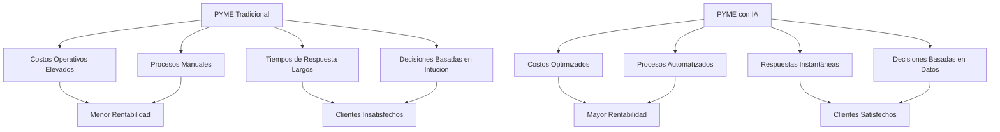
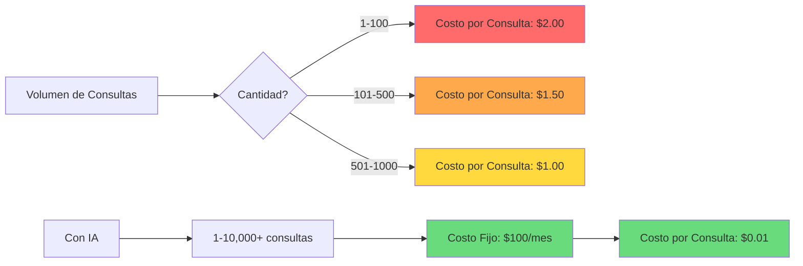
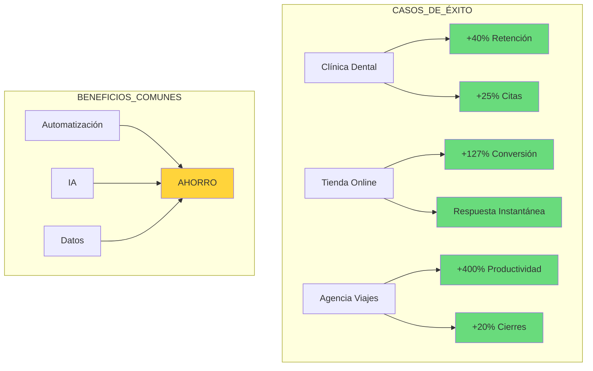
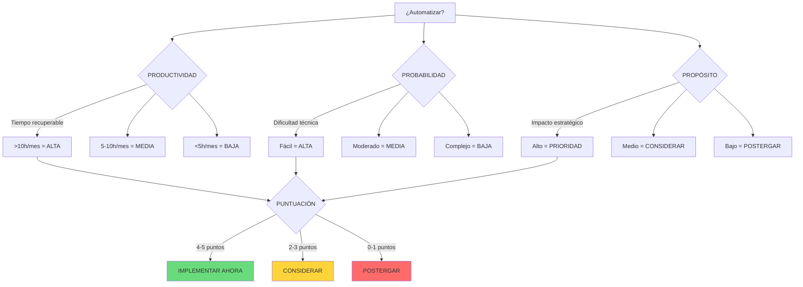
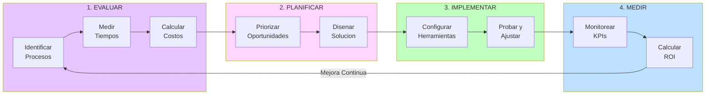
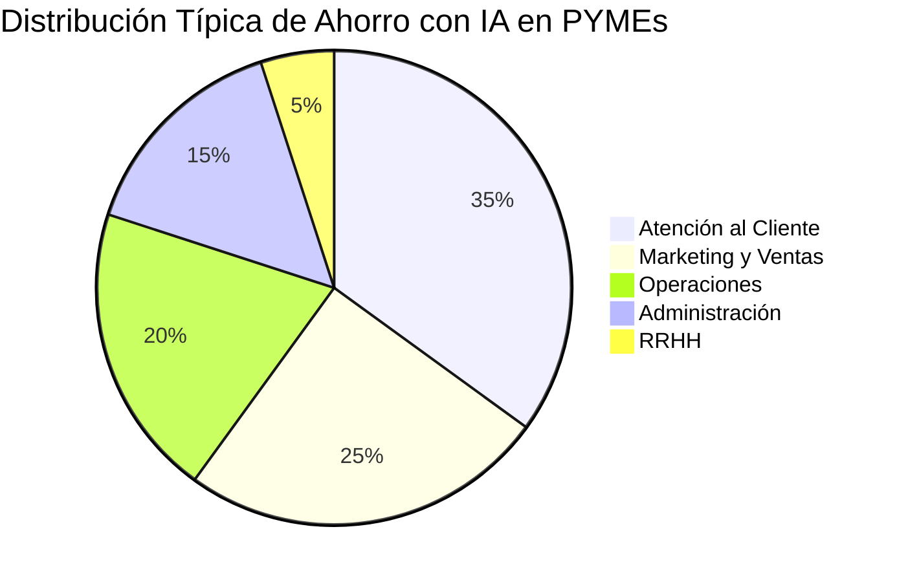
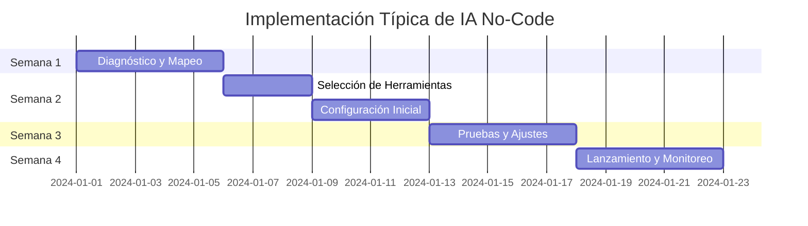

# CLASE 1: ECONOMÍA DE LA IA PARA PYMES

## 📅 Duración: 4 Horas (240 minutos)

---

## 1.1 OBJETIVOS DE APRENDIZAJE

Al finalizar esta clase, los participantes serán capaces de:

1. **Comprender el impacto transformador de la Inteligencia Artificial** en el ecosistema empresarial actual y cómo está redefiniendo las reglas de competencia.

2. **Calcular y proyectar el Retorno sobre Inversión (ROI)** de iniciativas de automatización e IA utilizando metodologías probadas.

3. **Identificar y cuantificar las oportunidades de reducción de costos marginales** que la IA puede generar en sus operaciones.

4. **Analizar casos de éxito documentados** de pequeñas y medianas empresas que han implementado soluciones de IA.

5. **Desarrollar una mentalidad orientada a datos** para la toma de decisiones empresariales.

6. **Crear un caso de negocio sólido** para justificar inversiones en automatización e IA ante stakeholders.

---

## 1.2 CONTENIDOS DETALLADOS

### MÓDULO 1: LA TRANSFORMACIÓN DIGITAL Y EL PAPEL DE LA IA (60 minutos)

#### 1.2.1 Contexto Histórico de la Automatización

La humanidad ha experimentado olas de automatización desde la Revolución Industrial. Cada ola successive ha incrementado la productividad de manera exponencial:

```
Línea de Tiempo de la Automatización:

1780s → Mecanización Industrial (Máquina de Vapor)
1870s → Electricidad y Producción en Masa (Línea de Ensamblaje)
1970s → Automatización Programable (Computadoras)
2010s → Automatización Inteligente (IA, Machine Learning)
2020s → IA Generativa y Automatización No-Code
```

**¿Por qué la ola actual es diferente?**

Las olas anteriores de automatización requerían:
- Inversiones de capital enormes
- Infraestructura especializada
- Personal técnico altamente capacitado
- Ciclos de implementación largos (años)

La ola actual de IA No-Code ofrece:
- Costos de entrada muy bajos (planes desde $0/mes)
- Infraestructura en la nube (sin inversión en hardware)
- Curva de aprendizaje accesible
- Implementación en días o semanas

#### 1.2.2 El Nuevo Panorama Competitivo

En el mercado actual, las PYMEs compiten contra:

1. **Corporaciones con recursos ilimitados**: Amazon, Google, Microsoft invierten miles de millones en IA
2. **Startups ágiles**: Empresas tecnológicas nativas con procesos optimizados desde el día uno
3. **Competidores globales**: Empresas de cualquier parte del mundo pueden ofrecer servicios similares

**La pregunta no es si la IA transformará tu negocio, sino cuándo y cómo.**



#### 1.2.3 El Efecto Multiplicador de la IA

La IA actúa como un multiplicador de las capacidades humanas:

| Capacidad Base | Con IA Tradicional | Con IA Generativa |
|----------------|-------------------|-------------------|
| Investigación | 1x | 10x |
| Comunicación | 1x | 5x |
| Creación de Contenido | 1x | 15x |
| Análisis de Datos | 1x | 20x |
| Atención al Cliente | 1x | 8x |
| Programación | 1x | 25x |

> **Reflexión**: Un empleado con IA puede producir lo que antes requerían 10-25 empleados sin IA.

---

### MÓDULO 2: ECONOMÍA DE LA IA - REDUCCIÓN DE COSTOS MARGINALES (60 minutos)

#### 1.2.4 Entendiendo los Costos Marginales

Un **costo marginal** es el costo adicional de producir una unidad más de un producto o servicio.

**Ejemplo Práctico - Servicio de Atención al Cliente:**

Sin IA:
- Hora de operador humano: $15-25 USD/hora
- Atiende: 10-15 consultas/hora
- Costo por consulta: $1.5-2.5 USD

Con IA (Chatbot):
- Costo mensual de IA: $50-200 USD
- Atiende: Ilimitadas consultas simultáneas
- Costo por consulta: $0.01-0.05 USD (prácticamente cero)



#### 1.2.5 Curva de Costo Marginal Decreciente

Una de las características más poderosas de la IA es que los costos marginales tienden a **cero** a medida que escala:

```
Costo Marginal Tradicional:
┌─────────────────────────────────────┐
│          /\                         │
│         /  \                        │
│        /    \                       │
│       /      \                      │
│      /        \                     │
│     /          \                    │
│    /            \                  │
│───/──────────────\──────────────────│
│  Cantidad Producida                │
└─────────────────────────────────────┘
        COSTO AUMENTA

Costo Marginal con IA:
┌─────────────────────────────────────┐
│ $                                     │
│                                      │
│─ ─ ─ ─ ─ ─ ─ ─ ─ ─ ─ ─ ─ ─ ─ ─ ─ ─│
│  Cantidad Producida                │
└─────────────────────────────────────┘
        COSTO FIJO + CASI CERO
```

#### 1.2.6 Áreas de Reducción de Costos en PYMEs

**1. RECURSOS HUMANOS**
- Reemplazo de tareas repetitivas
- Optimización de horarios
- Reducción de errores humanos
- Aumento de productividad

**2. MARKETING Y VENTAS**
- Generación automática de contenido
- Personalización a escala
- Prospección automatizada
- Email marketing inteligente

**3. OPERACIONES**
- Inventario predictivo
- Mantenimiento preventivo
- Gestión de proveedores
- Control de calidad automatizado

**4. ATENCIÓN AL CLIENTE**
- Chatbots 24/7
- Respuestas instantáneas
- Escalamiento inteligente
- Análisis de sentimiento

**5. ADMINISTRACIÓN**
- Facturación automatizada
- Reconciliación de pagos
- Reportes automáticos
- Cumplimiento normativo

#### 1.2.7 Caso de Estudio: Restaurante "Sabores de Casa"

**Situación inicial:**
- 15 empleados
- $45,000 USD mensuales en nómina
- 200 pedidos diarios promedio
- Margen de ganancia: 8%

**Implementación de IA:**
- Pedidos automatizados (app + chatbot): Ahorro de 2 empleados
- Inventario predictivo: Reduce mermas 30%
- Marketing automatizado: Aumenta clientes recurrentes 25%
- Programación inteligente: Optimiza horarios

**Resultado:**
- Nómina: $36,000 USD (ahorro de $9,000/mes)
- Mermas: Reducción de $2,000 a $1,400/mes
- Ventas: Incremento 25% ($15,000 adicional/mes)
- Margen de ganancia: 12%

**ROI del Proyecto:**
- Inversión inicial: $5,000 USD
- Ahorro mensual: $11,600 USD
- Tiempo de recuperación: 13 días

---

### MÓDULO 3: CASOS DE ÉXITO EN PYMES (45 minutos)

#### 1.2.8 Casos Documentados de Éxito

**CASO 1: Clínica Dental "Sonrisa Perfecta" (México)**

**Problema:** Perdían 30% de pacientes por falta de seguimiento post-consulta.

**Solución:** Implementaron:
- Automatización de recordatorios (WhatsApp)
- Chatbot para agendar citas
- Email marketing personalizado
- Seguimiento post-tratamiento automatizado

**Herramientas:** Make (Integromat) + WhatsApp Business API

**Resultados:**
- 40% aumento en retensión de pacientes
- 25% reducción de citas perdidas
- 15 horas/semana解放 de tiempo administrativo
- ROI: 350% en el primer año

---

**CASO 2: Tienda Online de Ropa "Moda Urbana" (Colombia)**

**Problema:** No podían competir con grandes plataformas en atención al cliente.

**Solución:** Implementaron:
- Chatbot de IA para consultas frecuentes
- Recomendaciones personalizadas de productos
- Carritos abandonados automatizados
- Análisis de productos más vendidos

**Herramientas:** n8n + OpenAI + Shopify

**Resultados:**
- Tiempo de respuesta: de 4 horas a instantáneo
- Tasa de conversión: aumento del 2.1% al 4.8%
- Carritos abandonados recuperados: 35%
- Ingreso adicional: $8,000 USD/mes

---

**CASO 3: Agencia de Viajes "Viajala" (Argentina)**

**Problema:** Proceso de cotización manual tomaba 2-3 horas por cliente.

**Solución:** Implementaron:
- Formulario inteligente de consultas
- Búsqueda automatizada en múltiples proveedores
- Generación automática de propuestas
- Seguimiento con IA

**Herramientas:** n8n + Claude API + WhatsApp

**Resultados:**
- Tiempo de cotización: de 2.5 horas a 15 minutos
- Clientes atendidos/día: de 5 a 25
- Tasa de cierre: aumentó 20%
- Satisfacción del cliente: 4.7/5



---

### MÓDULO 4: CÁLCULO DEL ROI DE LA AUTOMATIZACIÓN (45 minutos)

#### 1.2.9 Metodología de Cálculo de ROI

**Fórmula Fundamental:**

```
ROI (%) = [(Beneficio Neto / Costo de Inversión) × 100]

Beneficio Neto = Beneficios Totales - Costos Totales
```

#### 1.2.10 Componentes del Cálculo

**COSTOS A CONSIDERAR:**

| Tipo de Costo | Ejemplos | Consideración |
|---------------|----------|---------------|
| **Directos** | Suscripciones, APIs | Fáciles de cuantificar |
| **Indirectos** | Tiempo de aprendizaje | Estimar horas × costo/hora |
| **Oportunidad** | Lo que dejas de hacer | Valor del tiempo liberado |
| **Implementación** | Consultores, desarrollo | Si aplica |

**BENEFICIOS A CONSIDERAR:**

| Tipo de Beneficio | Cuantificación | Ejemplo |
|-------------------|----------------|---------|
| **Costos evitados** | Gastos que se reducen | Menos personal |
| **Ingresos incrementales** | Ventas nuevas | Más conversiones |
| **Eficiencia** | Tiempo ahorrado | Horas X valor |
| **Calidad** | Errores evitados | Costo de errores |
| **Satisfacción** | NPS mejorado | Retención de clientes |

#### 1.2.11 Ejercicio Guiado: Calculadora de ROI

Vamos a calcular el ROI para automatizar la atención al cliente:

**ESCENARIO:**
- Empresa: E-commerce de artesanías
- Tickets mensuales: 500
- Tiempo promedio por ticket: 15 minutos
- Costo hora empleado: $10 USD
- Implementación IA: $150 USD/mes

**Paso 1: Calcular costo actual**
```
Tickets/mes × Minutos × (1/60) × Costo/hora
500 × 15 × (1/60) × $10 = $1,250 USD/mes
```

**Paso 2: Calcular nuevo costo**
```
Suscripción IA: $150 USD/mes
Tiempo humano residual (20%): $250 USD/mes
Total: $400 USD/mes
```

**Paso 3: Beneficio neto mensual**
```
Ahorro: $1,250 - $400 = $850 USD/mes
```

**Paso 4: ROI anual**
```
Inversión inicial: $0 (mes a mes)
Beneficio anual: $850 × 12 = $10,200 USD
ROI: ∞ (recupera inversión inmediatamente)
```

---

### MÓDULO 5: HERRAMIENTAS DE ANÁLISIS Y PLANIFICACIÓN (30 minutos)

#### 1.2.12 Calculadoras de ROI Disponibles

**1. Zapier ROI Calculator**
- URL: https://zapier.com/roi-calculator
- Ideal para: Automatizaciones básicas

**2. Make (Integromat) ROI Calculator**
- URL: https://www.make.com/en/roi-calculator
- Ideal para: Escenarios complejos

**3. HubSpot ROI Calculator**
- URL: https://www.hubspot.com/roi-calculator
- Ideal para: Marketing y ventas

**4. Calculadora Propia (Template Notion)**

```
┌─────────────────────────────────────────────────────────┐
│         CALCULADORA DE ROI - AUTOMATIZACIÓN              │
├─────────────────────────────────────────────────────────┤
│                                                          │
│  PROCESO: ________________________________              │
│                                                          │
│  ────────────────────────────────────────                │
│  COSTOS ACTUALES                                         │
│  ────────────────────────────────────────                │
│  Tiempo mensual (horas): ___________                      │
│  Costo por hora: $ _______________                        │
│  Costo mensual actual: $ _____________                   │
│                                                          │
│  ────────────────────────────────────────                │
│  INVERSIÓN EN AUTOMATIZACIÓN                            │
│  ────────────────────────────────────────                │
│  Herramienta (mensual): $ ___________                    │
│  Implementación (una vez): $ __________                  │
│  Capacitación: $ _________________                       │
│                                                          │
│  ────────────────────────────────────────                │
│  RESULTADOS                                              │
│  ────────────────────────────────────────                │
│  Tiempo mensual nuevo (horas): ________                  │
│  Costo mensual nuevo: $ _____________                    │
│  Ahorro mensual: $ _______________                       │
│  Ahorro anual: $ ___________________                     │
│  ROI (%): _______________________                       │
│  Payback (meses): __________________                     │
│                                                          │
└─────────────────────────────────────────────────────────┘
```

#### 1.2.13 El Framework de las 3P para Evaluar Automatizaciones

**PRODUCTIVIDAD**: ¿Cuánto tiempo recuperamos?

**PROBABILIDAD**: ¿Qué tan probable es el éxito?

**PROPÓSITO**: ¿Alinea con los objetivos del negocio?



---

## 1.3 DIAGRAMAS EN MERMAID

### Diagrama 1: Ciclo de Transformación con IA



### Diagrama 2: Distribución de Ahorro por Área



### Diagrama 3: Timeline de Implementación de IA



---

## 1.4 REFERENCIAS EXTERNAS

1. **McKinsey Global Institute - The Economic Potential of Generative AI**
   - URL: https://www.mckinsey.com/featured-insights/making-a-difference/overview-of-generative-ai-models-and-their-utility
   - Fecha: 2023
   - Relevancia: Estadísticas globales sobre impacto económico de IA

2. **Harvard Business Review - AI Adoption Survey**
   - URL: https://hbr.org/topic/artificial-intelligence
   - Relevancia: Tendencias de adopción en empresas

3. **Forrester Research - Total Economic Impact of Automation**
   - URL: https://www.forrester.com/research/
   - Relevancia: Estudios ROI de automatización

4. **Gartner - AI Business Value Forecast**
   - URL: https://www.gartner.com/en/topics/artificial-intelligence
   - Relevancia: Proyecciones de valor de negocio de IA

5. **MIT Sloan Management Review - AI Adoption**
   - URL: https://sloanreview.mit.edu/projects/the-ai-powered-organization/
   - Relevancia: Casos de estudio de adopción exitosa

6. **Salesforce - State of Marketing Report**
   - URL: https://www.salesforce.com/resources/research-reports/state-of-marketing/
   - Relevancia: Impacto de IA en marketing

7. **Zapier - Small Business Trends Report**
   - URL: https://zapier.com/blog/small-business-automation-report
   - Relevancia: Automatización en PYMEs

8. **World Economic Forum - Future of Jobs Report**
   - URL: https://www.weforum.org/publications/the-future-of-jobs-report-2023/
   - Relevancia: Impacto en empleo y habilidades

---

## 1.5 EJERCICIOS PRÁCTICOS RESUELTOS Y EXPLICADOS

### Ejercicio 1: Identificación de Procesos para Automatizar

**ESCENARIO:** E-commerce de productos naturales "Vida Sana"

**Paso 1: Listar todos los procesos diarios**

| Proceso | Frecuencia | Tiempo (min) | Costo/Aprox |
|---------|------------|--------------|-------------|
| Responder preguntas de WhatsApp | Diaria | 90 | $150/mes |
| Confirmar pedidos | Diaria | 60 | $100/mes |
| Enviar seguimiento de envíos | Diaria | 45 | $75/mes |
| Publicar en redes sociales | 5/semana | 150 | $250/mes |
| Actualizar inventario | Diaria | 30 | $50/mes |
| Generar facturas | Diaria | 40 | $67/mes |
| Revisar reseñas | Diaria | 20 | $33/mes |
| **TOTAL** | | **435 min/día** | **$725/mes** |

**Paso 2: Evaluar con Framework 3P**

| Proceso | Productividad | Probabilidad | Propósito | Puntuación |
|---------|---------------|--------------|-----------|------------|
| WhatsApp | ALTA (90min) | ALTA (fácil) | ALTO | 5 - PRIORIDAD |
| Redes sociales | ALTA (150min) | ALTA (fácil) | MEDIO | 4 |
| Pedidos | MEDIA (60min) | ALTA (fácil) | ALTO | 5 - PRIORIDAD |
| Facturas | MEDIA (40min) | MEDIA | ALTO | 4 |
| Inventario | BAJA (30min) | ALTA (fácil) | MEDIO | 3 |

**Paso 3: Selección de Prioridades**

1. **WhatsApp automático** → Mayor impacto inmediato
2. **Publicación en redes** → Ahorro de tiempo consistente
3. **Confirmación de pedidos** → Mejora experiencia cliente

---

### Ejercicio 2: Cálculo de ROI Completo

**ESCENARIO:** "Consultora Pyme Plus" - 5 empleados

**Proceso a automatizar:** Seguimiento de propuestas comerciales

**Situación Actual:**
- 20 propuestas/mes
- 3 seguimientos por propuesta = 60 seguimientos
- Tiempo por seguimiento: 10 minutos
- Costo hora empleado: $12 USD
- Tasa de respuesta manual: 35%

**Cálculo de Costo Actual:**
```
60 seguimientos × 10 min × $12/hr ÷ 60 = $120 USD/mes
```

**Nueva Situación con Automatización:**
- Herramienta: n8n + Email automation
- Costo: $25 USD/mes (plan básico n8n)
- Tiempo por seguimiento: 0 minutos (automatizado)
- Tasa de respuesta esperada: 45% (+10%)

**Cálculo de Beneficio Adicional:**
```
20 propuestas × 10% más cierres × $500 promedio = $1,000 USD/mes adicional
```

**ROI Calculation:**
```
Costo mensual: $25
Ahorro en tiempo: $120
Beneficio en ventas: $1,000
Beneficio neto total: $1,095/mes

ROI = [($1,095 - $25) / $25] × 100 = 4,280% anual
```

---

### Ejercicio 3: Comparativa de Herramientas

**ESCENARIO:** Automatizar publicación en Instagram

**Opciones:**

| Criterio | Buffer | Later | Hootsuite | n8n + IA |
|----------|--------|-------|-----------|----------|
| Costo/mes | $6 | $18 | $99 | $25 |
| Publicaciones/mes | 10 | 30 | Ilimitadas | Ilimitadas |
| IA para captions | No | No | No | Sí |
| Programación | Sí | Sí | Sí | Sí |
| Análisis | Básico | Avanzado | Avanzado | Básico |
| Escalabilidad | Media | Media | Alta | Muy Alta |

**Recomendación para Pyme:**
- **N8n + IA**: Mejor relación costo-beneficio para una PYME que busca escalar con contenido generado por IA

---

## 1.6 TECNOLOGÍAS ESPECÍFICAS

### Herramientas de Análisis y Calculadoras

| Herramienta | Uso Principal | Costo | Link |
|-------------|--------------|-------|------|
| **Zapier ROI Calculator** | Estimar ahorro con automatizaciones | Gratis | zapier.com/roi-calculator |
| **Make ROI Calculator** | Escenarios complejos | Gratis | make.com/en/roi-calculator |
| **HubSpot ROI Calculator** | Marketing y ventas | Gratis | hubspot.com/roi-calculator |
| **Notion** | Plantillas personalizadas | Gratis-$8 | notion.so |
| **Airtable** | Bases de datos | Gratis-$20 | airtable.com |

### Herramientas de Productividad con IA

| Herramienta | Función | Costo | Link |
|-------------|---------|-------|------|
| **ChatGPT** | Redacción y asistencia | $20/mes Pro | chat.openai.com |
| **Claude** | Análisis y texto | $20/mes Pro | claude.ai |
| **Notion AI** | Productividad en docs | $10/mes | notion.so/ai |
| **Grammarly** | Escritura clara | $12/mes | grammarly.com |
| **Midjourney** | Imágenes IA | $10/mes | midjourney.com |

---

## 1.7 ACTIVIDADES DE LABORATORIO

### Laboratorio 1: Auditoría de Procesos de tu Empresa

**Objetivo:** Identificar al menos 5 procesos ripe para automatización.

**Instrucciones:**

1. **Prepara tu herramienta** (15 minutos)
   - Crea un documento en Notion o Google Docs
   - Descarga la plantilla de auditoría (proporcionada)

2. **Mapea tus procesos** (45 minutos)
   - Lista TODOS los procesos que realizas en una semana
   - Anota: nombre, frecuencia, tiempo estimado, herramientas usadas

3. **Clasifica por impacto** (30 minutos)
   - Alto: Afecta ingresos directamente
   - Medio: Mejora eficiencia operativa
   - Bajo: Tareas administrativas

4. **Prioriza usando Framework 3P** (30 minutos)
   - Evalúa cada proceso según Productividad, Probabilidad y Propósito

5. **Presenta tu análisis** (15 minutos)
   - Prepara una lista de las 3-5 prioridades

**Entregable:** Documento con:
- Lista completa de procesos
- Clasificación por impacto
- Top 5 procesos priorizados
- Justificación del prioritization

---

### Laboratorio 2: Calcula tu ROI Potencial

**Objetivo:** Determinar el ROI esperado de tu primera automatización.

**Instrucciones:**

1. **Selecciona un proceso** de tu lista priorizada (Laboratorio 1)

2. **Calcula costos actuales** (30 minutos)
   - Tiempo semanal dedicado
   - Costo por hora de quien lo hace
   - Herramientas/costes asociados
   - Costo total mensual

3. **Investiga soluciones** (30 minutos)
   - Busca 2-3 herramientas que podrían automatizarlo
   - Anota costos mensuales
   - Verifica complejidad de implementación

4. **Proyecta beneficios** (30 minutos)
   - Tiempo que se ahorrará
   - Beneficios adicionales (menos errores, mejor servicio, etc.)
   - Monetiza cada beneficio

5. **Calcula ROI** (15 minutos)
   - Usa la fórmula aprendida
   - Determina payback period

6. **Documenta tu análisis** (15 minutos)
   - Prepara un mini-business case de 1 página

---

### Laboratorio 3: Análisis de Competidores

**Objetivo:** Investigar cómo competidores usan IA y automatización.

**Instrucciones:**

1. **Identifica 3-5 competidores** (15 minutos)
   - Empresas similares en tu industria
   - Incluye 1-2 empresas más grandes como referencia

2. **Investiga su presencia digital** (45 minutos)
   - Sitio web: ¿Usan chatbots? ¿Tienen funcionalidades de IA?
   - Redes sociales: ¿Qué tipo de contenido publican? ¿Frecuencia?
   - Email: ¿Recibes sus newsletters? ¿Cómo son?

3. **Analiza su propuesta de valor** (30 minutos)
   - ¿Qué prometen en términos de servicio/velocidad?
   - ¿Cómo se diferencian?

4. **Identifica oportunidades** (30 minutos)
   - ¿Qué están haciendo bien?
   - ¿Dónde tienen gaps?
   - ¿Qué podrías hacer mejor?

5. **Prepara presentación** (15 minutos)
   - Resumen de hallazgos
   - 3 recomendaciones para tu empresa

---

## 1.8 RESUMEN DE PUNTOS CLAVE

### Conceptos Fundamentales

1. **La IA está democratizando el acceso** a capacidades que antes solo tenían las grandes corporaciones. Las PYMEs pueden ahora competir con herramientas accesibles y de bajo costo.

2. **El costo marginal de la IA tiende a cero**, lo que significa que escalar operaciones con IA tiene costos adicionales mínimos compared to雇佣 humano tradicional.

3. **El ROI de la automatización** se puede calcular con metodologías simples que任何人 puede aplicar, focusing en tiempo ahorrado, costos evitados e ingresos incrementales.

4. **La prioritization es clave**: No todo proceso debe automatizarse. Usa el Framework 3P (Productividad, Probabilidad, Propósito) para enfocarte en donde mayor impacto tendrá.

5. **Casos de éxito documentados** demuestran que PYMEs de todos los tamaños han logrado resultados excepcionales: aumentos de 200-400% en productividad, reducción de 30-50% en costos, y mejoras significativas en satisfacción de clientes.

### Próximos Pasos

- **[ ]** Completar auditoría de procesos de tu empresa
- **[ ]** Calcular ROI de tus 3 principales oportunidades
- **[ ]** Investigar 2 herramientas específicas para tu prioridad #1
- **[ ]** Preparar mini-business case para presentar a tu equipo/stakeholders

### Frases para Recordar

> "La mejor inversión que puedes hacer es automatizar aquello que te roba tiempo y no te genera valor directo."

> "No necesitas ser programador para aprovechar el poder de la IA. Las herramientas no-code están democratizando la transformación digital."

> "El ROI de la automatización no siempre se mide solo en dinero; a veces el tiempo recuperado vale más que el ahorro económico."

---

## 📚 MATERIALES COMPLEMENTARIOS

### Lecturas Recomendadas

- **"The Lean Startup"** - Eric Ries (Metodología de experimentación)
- **"Atomic Habits"** - James Clear (Hábitos de mejora continua)
- **"The 4-Hour Workweek"** - Tim Ferriss (Automatización y estilo de vida)

### Videos Recomendados

- Tutoriales de Make.com Academy
- Canal de YouTube de Alejandro Rioja (Automatización y ventas)

### Podcasts

- **"Marketing Digital para PYMEs"** - Estrategias prácticas
- **"The GaryVee Audio Experience"** - Entrepreneurship y marketing

---

**FIN DE LA CLASE 1**

*En la Clase 2, profundizaremos en el Mapeo de Flujos de Valor y cómo identificar oportunidades de optimización en tus procesos.*
