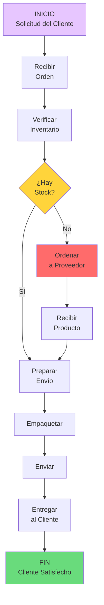
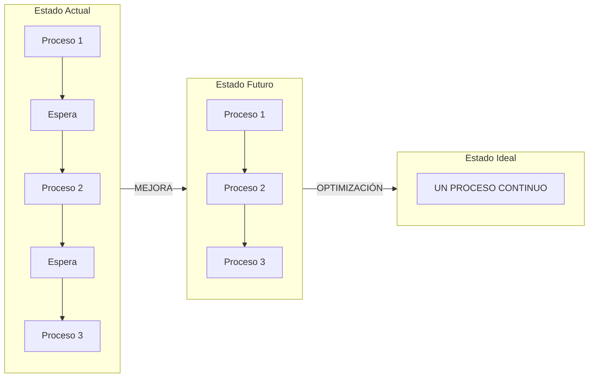
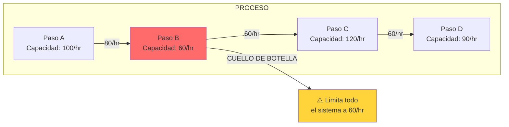
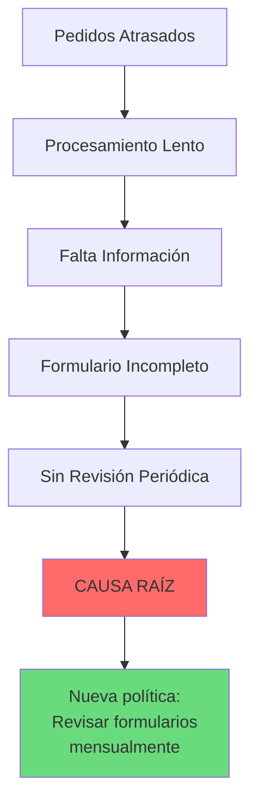
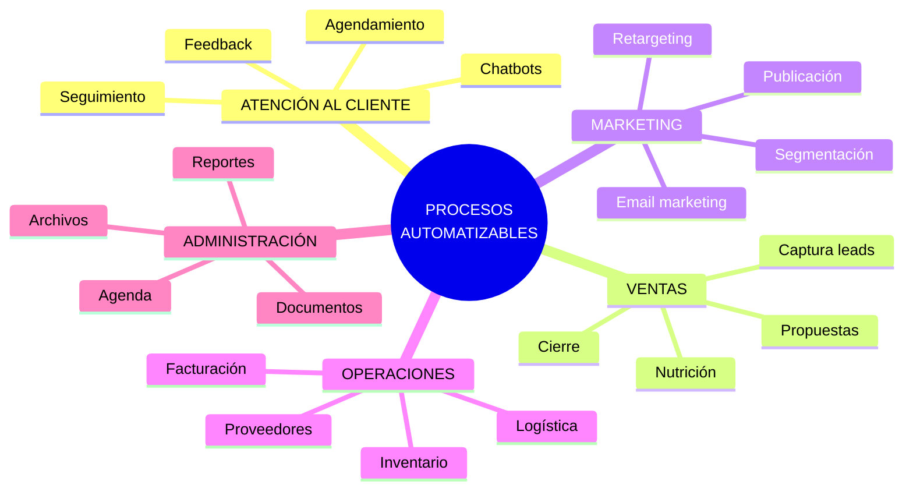
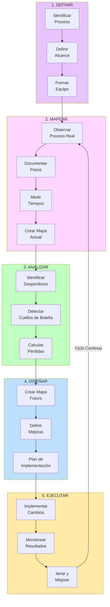
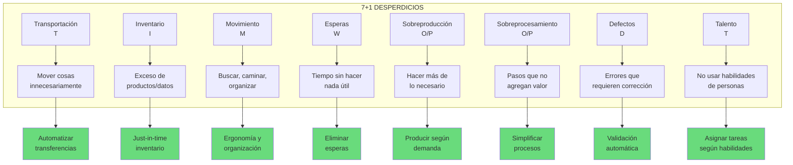
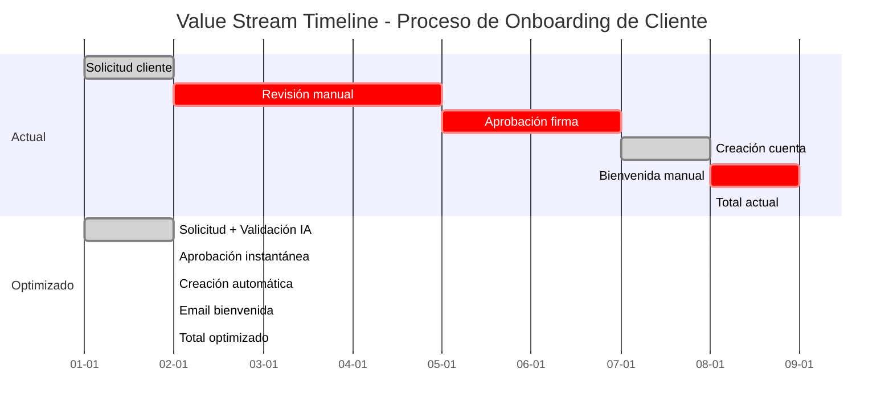

# CLASE 2: MAPEO DE FLUJOS DE VALOR (VALUE STREAM MAPPING)

## 📅 Duración: 4 Horas (240 minutos)

---

## 2.1 OBJETIVOS DE APRENDIZAJE

Al finalizar esta clase, los participantes serán capaces de:

1. **Comprender y aplicar la metodología de Value Stream Mapping (VSM)** para visualizar procesos empresariales completos.

2. **Identificar y eliminar desperdicios (waste)** en procesos operativos mediante técnicas probadas de Lean.

3. **Detectar cuellos de botella** que limitan el throughput y la eficiencia de sus operaciones.

4. **Priorizar oportunidades de automatización** basándose en datos concretos y análisis objetivo.

5. **Utilizar herramientas especializadas** para crear mapas de flujo de valor de manera profesional.

6. **Desarrollar un plan de mejora continua** basado en la identificación de áreas de oportunidad.

---

## 2.2 CONTENIDOS DETALLADOS

### MÓDULO 1: FUNDAMENTOS DEL MAPEO DE FLUJOS DE VALOR (60 minutos)

#### 2.2.1 ¿Qué es el Value Stream Mapping?

El **Value Stream Mapping (VSM)** es una metodología visual desarrollada por Toyota como parte del Sistema de Producción Toyota (TPS). Su propósito es mapear todos los pasos, tanto quelli que agregan valor como quelli que no, requeridos para entregar un producto o servicio al cliente.

**Definición Formal:**
> "El Value Stream Mapping es una herramienta que ayuda a visualizar y entender el flujo de materiales e información mientras el producto hace su camino a través del flujo de valor."

**Componentes Clave:**

1. **Flujo de Materiales**: Cómo se mueve físicamente el producto o servicio
2. **Flujo de Información**: Cómo se comunican las decisiones y datos
3. **Línea de Tiempo**: Cuánto tiempo toma cada paso
4. **Puntos de Decisión**: Dónde se elige el siguiente paso



#### 2.2.2 Historia y Evolución del VSM

**Origen: Toyota Production System (1940s-1950s)**
- Desarrollado por Taiichi Ohno y Shigeo Shingo
- Busca eliminar "muda" (desperdicio)
- Base del Lean Manufacturing

**Evolución:**
```
1940s-50s → Mapas de flujo de proceso básicos
1960s-70s → Implementación en Toyota
1980s-90s → Adopción en Occidente (Lean)
2000s → Value Stream Mapping tal como lo conocemos
2010s-20s → VSM Digital con herramientas especializadas
```

#### 2.2.3 Tipos de Value Stream Mapping

**1. VSM Actual (Current State Map)**
- Representa cómo funciona el proceso HOY
- Identifica problemas y áreas de mejora
- Punto de partida para la transformación

**2. VSM Futuro (Future State Map)**
- Visión mejorada del proceso
- Elimina desperdicios identificados
- Estado objetivo a alcanzar

**3. VSM Ideal**
- Representación perfecta del proceso
- Sin ningún desperdicio
- Meta aspiracional



#### 2.2.4 Los 7+1 Desperdicios (Wastes) de Lean

Toyota identificó 7 tipos de desperdicio que deben eliminarse. Nosotros agregamos uno más relevante para servicios:

| Desperdicio | Símbolo | Descripción | Ejemplo Común |
|-------------|---------|-------------|---------------|
| **Sobreproducción** | O/P | Producir más de lo necesario o antes de tiempo | Crear inventario que no se vende |
| **Esperas** | W | Tiempo esperando por información, personas o materiales | Cliente esperando respuesta de email |
| **Transporte** | T | Movimiento innecesario de materiales o información | Enviar documento por 3 personas |
| **Sobreprocesamiento** | O/P | Hacer más trabajo del necesario | Firmar 5 veces un documento |
| **Inventario** | I | Exceso de productos, materiales o información | Pedidos sin procesar |
| **Movimiento** | M | Desplazamiento físico innecesario de personas | Buscar archivos en varias carpetas |
| **Defectos** | D | Errores que requieren corrección | Facturas con errores |
| **Talento** | T | No aprovechar las habilidades de las personas | Persona sobrecalificada haciendo trabajo simple |

---

### MÓDULO 2: METODOLOGÍA DE APLICACIÓN DEL VSM (60 minutos)

#### 2.2.5 Paso a Paso: Cómo Crear un VSM

**FASE 1: PREPARACIÓN (15 minutos)**

1. Definir el alcance del mapeo
2. Identificar al equipo involucrado
3. Seleccionar el proceso a mapear
4. Preparar herramientas de documentación

**FASE 2: RECOPILACIÓN DE DATOS (30 minutos)**

1. Observar el proceso en acción
2. Entrevistar a las personas involucradas
3. Medir tiempos de cada paso
4. Documentar información y materiales

**FASE 3: CREACIÓN DEL MAPA (45 minutos)**

1. Dibujar el flujo de proceso
2. Agregar línea de tiempo
3. Identificar puntos de decisión
4. Marcar desperdicios encontrados

**FASE 4: ANÁLISIS Y MEJORA (30 minutos)**

1. Identificar cuellos de botella
2. Priorizar oportunidades de mejora
3. Crear plan de acción

#### 2.2.6 Símbolos Estándar del VSM

```
SÍMBOLOS DE PROCESO:
┌─────────┐
│ ○       │ Operación
│ □       │ Inspección
│ ▽       │ Transporte
│ ▽       │ Demora
│ ⊗       │ Almacenamiento
│ D       │ Decisión

SÍMBOLOS DE FLUJO:
────────────→  Material/Información
- - - - - - →  Información electrónica
~~~~~~~~~~~~→  Flujo manual de información
⇐────────────═  Kanban (señal de reabastecimiento)

INDICADORES DE TIEMPO:
┌──────────────────────┐
│ Tiempo de ciclo (C/T) │
│ Tiempo de espera (W/T)│
│ Lead Time (LT)        │
│ TAKT Time (TT)         │
└──────────────────────┘
```

#### 2.2.7 Conceptos Clave de Tiempo

**Lead Time (Tiempo Total):**
- Tiempo desde que el cliente hace una solicitud hasta que recibe el producto/servicio
- Incluye todo: procesamiento, esperas, transporte, etc.

**Takt Time (Tiempo Ritmo):**
- Velocidad a la que debes trabajar para satisfacer la demanda
- Fórmula: Tiempo disponible / Demanda del cliente

```
Ejemplo:
- Día laboral: 8 horas = 480 minutos
- Pedidos diarios promedio: 40
- Takt Time = 480 / 40 = 12 minutos/pedido
```

**Tiempo de Ciclo (Cycle Time):**
- Tiempo que toma completar una actividad específica

**Tiempo de Valor Agregado:**
- Solo el tiempo que el cliente pagaría por ver

```mermaid
gantt
    title Análisis de Tiempo en Proceso de Venta
    dateFormat  HH:mm
    axisFormat  %H:%M
    section Escenario A
    Cliente inicia contacto    :done, 09:00, 09:05
    Espera respuesta           :crit, 09:05, 10:30
    Análisis de需求            :done, 10:30, 11:15
    Espera aprobación          :crit, 11:15, 14:00
    Preparación propuesta      :done, 14:00, 15:00
    Espera respuesta cliente   :crit, 15:00, 16:30
    Cierre                    :done, 16:30, 16:45
    
    section Escenario B (Optimizado)
    Contacto + Análisis        :done, 09:00, 09:45
    Propuesta automática       :done, 09:45, 10:15
    Revisión rápida            :crit, 10:15, 10:30
    Cierre                    :done, 10:30, 10:45
```



---

### MÓDULO 3: IDENTIFICACIÓN DE CUELLOS DE BOTELLA (45 minutos)

#### 2.2.8 ¿Qué es un Cuello de Botella?

Un **cuello de botella** es cualquier punto en el proceso que limita la capacidad total del sistema. Es como un embudo: sin importar qué tan rápido entre el material, la salida estará limitada por el punto más estrecho.

**Características de los Cuellos de Botella:**

1. **Acumulan trabajo**: Se genera backlog antes de ellos
2. **Causan esperas**: Lo que viene después debe esperar
3. **Determinan el throughput**: La velocidad del sistema = velocidad del cuello de botella
4. **Son persistentes**: Tienden a moverse cuando se eliminan



#### 2.2.9 Técnicas para Identificar Cuellos de Botella

**MÉTODO 1: Observación Directa**
- Seguir el proceso paso a paso
- Identificar dónde se acumulan trabajos
- Medir tiempos de espera

**MÉTODO 2: Análisis de Capacidad**
- Medir throughput de cada paso
- Comparar capacidades
- Identificar el paso más lento

**MÉTODO 3: Análisis de Datos**
- Revisar métricas de tiempo
- Buscar pasos con mayor variabilidad
- Identificar patrones de retraso

#### 2.2.10 Los 5 Porqués - Técnica de Análisis de Causa Raíz

Cuando encuentres un cuello de botella, usa "Los 5 Porqués" para llegar a la causa raíz:

**Ejemplo: Pedidos atrasados**

1. **¿Por qué están atrasados?** → Los pedidos se están procesando lentamente
2. **¿Por qué se procesan lentamente?** → Falta información del cliente
3. **¿Por qué falta información?** → El formulario no la pide
4. **¿Por qué no la pide?** → Nadie revisó el formulario cuando se creó
5. **¿Por qué no se revisó?** → No hay proceso de revisión periódica de formularios

**Causa Raíz:** Falta de proceso de revisión periódica
**Solución:** Implementar revisión mensual de formularios



---

### MÓDULO 4: PROCESOS RIPE PARA AUTOMATIZACIÓN (45 minutos)

#### 2.2.11 Criterios para Identificar Procesos Automatizables

Un proceso es buen candidato para automatización cuando cumple varios criterios:

**CRITERIO 1: Reglas Claras**
- El proceso sigue pasos definidos
- Las decisiones son binarias o con pocas opciones
- No requiere juicio complejo

**CRITERIO 2: Alto Volumen**
- Se repite frecuentemente
- El mismo trabajo se hace muchas veces
- Pequeños ahorros se multiplican

**CRITERIO 3: Propenso a Errores**
- Muchos pasos manuales
- Transferencia de información entre sistemas
- Datos susceptibles a typos

**CRITERIO 4: Bajo Valor Agregado Humano**
- Tareas repetitivas y aburridas
- No requieren creatividad o empatía
- No aprovechan habilidades únicas humanas

#### 2.2.12 Matriz de Priorización

```
                    ALTO VOLUMEN
                         │
     ┌───────────────────┼───────────────────┐
     │                   │                   │
     │   AUTOMATIZAR     │   PRIORIZAR       │
     │   INMEDIATAMENTE  │   PRIMERO         │
     │                   │                   │
     │   • Emails        │   • Reportes      │
     │   • Notificaciones│   • Dashboard     │
     │   • Actualizaciones│   • Integraciones│
     │                   │                   │
BAJO │                   │                   │ ALTO
VOLUMEN                   │                   │
     │   DELEGAR O       │   ANALIZAR        │
     │   POSTERGAR       │   CUIDADOSAMENTE  │
     │                   │                   │
     │   • Tareas únicas │   • Decisiones    │
     │   • Casos raros   │   complejas       │
     │   • Excepciones   │   • Automatización │
     │                   │   parcial         │
     └───────────────────┴───────────────────┘
                         │
                    BAJO VOLUMEN
```

#### 2.2.13 Procesos Comunes para Automatizar en PYMEs

**ATENCIÓN AL CLIENTE:**
| Proceso | Beneficio Principal | Herramienta Sugerida |
|---------|--------------------|--------------------|
| Respuesta a FAQs | Ahorro de tiempo | Chatbot/IA |
| Agendar citas | Reducir trabajo admin | Calendly/n8n |
| Seguimiento post-venta | Aumentar retención | Email automation |
| Recopilar feedback | Mejorar servicio | Encuestas automatizadas |

**VENTAS Y MARKETING:**
| Proceso | Beneficio Principal | Herramienta Sugerida |
|---------|--------------------|--------------------|
| Capturar leads | Más conversiones | Webhooks/Zapier |
| Nutrir prospectos | Mejor conversión | Email sequences |
| Publicar en redes | Consistencia | Buffer/Later |
| Generar reportes | Visibilidad | Integraciones BI |

**OPERACIONES:**
| Proceso | Beneficio Principal | Herramienta Sugerida |
|---------|--------------------|--------------------|
| Actualizar inventario | Evitar stockouts | Conexiones API |
| Generar facturas | Reducir errores | Software contable |
| Enviar órdenes | Velocidad | ERP/Automation |
| Gestionar proveedores | Eficiencia | Bases de datos |



---

### MÓDULO 5: PRIORIZACIÓN DE OPORTUNIDADES (30 minutos)

#### 2.2.14 Framework de Priorización por Impacto y Esfuerzo

Una vez identificados los procesos ripe para automatización, el siguiente paso es priorizarlos. Usaremos una matriz simple de Impacto vs. Esfuerzo:

**Eje Vertical: IMPACTO**
- Alto: Ahorra >$500/mes o >20h/mes
- Medio: Ahorra $100-500/mes o 5-20h/mes
- Bajo: Ahorra <$100/mes o <5h/mes

**Eje Horizontal: ESFUERZO**
- Alto: Requiere >1 semana de implementación
- Medio: Requiere 1-5 días
- Bajo: Requiere <1 día

```
                    ALTO IMPACTO
                         │
     ┌───────────────────┼───────────────────┐
     │                   │                   │
     │   🟢 EJECUTAR     │   🟡 PLANIFICAR    │
     │   PRIMERO        │   (Cuarto/Trimestre)│
     │                   │                   │
     │   • Ahorro máximo │   • Gran beneficio │
     │   • ROI rápido    │   • Requiere       │
     │                   │     inversión      │
     │                   │                   │
 BAJO │                   │                   │ ALTO
ESFUERZO                   │                   │ ESFUERZO
     │   🔵 ELIMINAR     │   🔴 REPLANTEAR    │
     │   (Delegar)      │   (No prioritaria) │
     │                   │                   │
     │   • Muy fácil    │   • Muy complejo   │
     │   • Bajo valor   │   • Poca prioridad │
     │                   │                   │
     └───────────────────┴───────────────────┘
                         │
                    BAJO IMPACTO
```

#### 2.2.15 Caso Práctico de Priorización

**Empresa:** "Tecnología Express" - Servicio técnico de celulares

**Procesos identificados:**

| Proceso | Impacto | Esfuerzo | Prioridad |
|---------|---------|----------|-----------|
| Agendar citas | Alto | Bajo | 🟢 EJECUTAR |
| Enviar recordatorios | Alto | Bajo | 🟢 EJECUTAR |
| Diagnosticar problemas | Medio | Medio | 🟡 PLANIFICAR |
| Cotizar repuestos | Alto | Medio | 🟢 EJECUTAR |
| Gestionar inventario | Alto | Alto | 🟡 PLANIFICAR |
| Facturación | Medio | Medio | 🟡 PLANIFICAR |
| Encuestas NPS | Bajo | Bajo | 🔵 ELIMINAR |
| Reportes semanales | Bajo | Medio | 🔵 ELIMINAR |

**Orden de ejecución recomendado:**
1. Agendar citas (1 hora - n8n + calendario)
2. Recordatorios (30 min - automatización WhatsApp)
3. Cotizar repuestos (2 horas - plantillas dinámicas)
4. Gestionar inventario (futuro - requiere desarrollo)

---

## 2.3 DIAGRAMAS EN MERMAID

### Diagrama 1: Flujo Completo del Value Stream Mapping



### Diagrama 2: Tipos de Desperdicio Visual



### Diagrama 3: Línea de Tiempo VSM



---

## 2.4 REFERENCIAS EXTERNAS

1. **Lean Enterprise Institute - Value Stream Mapping**
   - URL: https://www.lean.org/lexicon-terms/value-stream-mapping/
   - Relevancia: Autoridad en metodología Lean y VSM

2. **Toyota Production System (TPS)**
   - URL: https://www.toyota-europe.com/about/toyota-production-system
   - Relevancia: Origen de la metodología

3. **i-SCOOP - Value Stream Mapping Guide**
   - URL: https://www.i-scoop.eu/value-stream-mapping-vsm/
   - Relevancia: Guía práctica completa

4. **Creately - VSM Shapes and Templates**
   - URL: https://creately.com/lp/value-stream-mapping-tool/
   - Relevancia: Herramientas y plantillas

5. **Lucidchart - How to Create a Value Stream Map**
   - URL: https://www.lucidchart.com/pages/value-stream-map
   - Relevancia: Tutorial paso a paso

6. **Miro - Value Stream Mapping Templates**
   - URL: https://miro.com/templates/value-stream-map/
   - Relevancia: Plantillas gratuitas

7. **ASQ American Society for Quality**
   - URL: https://asq.org/quality-resources/value-stream-mapping
   - Relevancia: Recursos de calidad y mejora de procesos

8. **Six Sigma Material - VSM Examples**
   - URL: https://www.sixsigmamaterial.com/VSM.htm
   - Relevancia: Ejemplos y casos de estudio

---

## 2.5 EJERCICIOS PRÁCTICOS RESUELTOS Y EXPLICADOS

### Ejercicio 1: Mapeo de Proceso de Venta

**ESCENARIO:** Tienda de ropa online "Estilo Fashion"

**PASO 1: Definir el proceso a mapear**
- Proceso: "Desde que llega un pedido hasta que se envía"
- Alcance: Solo operaciones internas
- Equipo: Dueño + 1 empleado de envíos

**PASO 2: Observar y documentar**

| Hora | Actividad | Ubicación | Tiempo | Persona |
|------|-----------|-----------|--------|---------|
| 09:00 | Revisar pedidos nuevos | Oficina | 15 min | María |
| 09:15 | Verificar pago en banco | Oficina | 10 min | María |
| 09:25 | Confirmar stock en Excel | Oficina | 20 min | María |
| 09:45 | Enviar a bodega | Bodega | 5 min | - |
| 09:50 | Empacado | Bodega | 15 min | Carlos |
| 10:05 | Etiquetar | Bodega | 5 min | Carlos |
| 10:10 | Esperar courier | Bodega | 45 min | Carlos |
| 10:55 | Entregar courier | Bodega | 5 min | Carlos |

**PASO 3: Crear el mapa con desperdicios identificados**

```
┌─────────┐    ┌─────────┐    ┌─────────┐    ┌─────────┐
│ PEDIDO  │───→│ VERIFICAR│───→│ STOCK   │───→│ ENVÍO A │
│ RECIBIDO│    │ PAGO    │    │ (Excel) │    │ BODEGA  │
└─────────┘    └─────────┘    └─────────┘    └─────────┘
                                           ⬆️
                                           │ DESPERDICIO
                                           │ Búsqueda manual
┌─────────┐    ┌─────────┐    ┌─────────┐    └─────────┘
│ ENVÍO   │←───│ ETIQUETA│←───│ EMPACADO│←──┘
│ COURIER │    │         │    │         │
└─────────┘    └─────────┘    └─────────┘
     ↑                                   
     │                                   
┌─────────┐                             
│ ESPERA  │ 45 minutos                   
│ COURIER │ ⬆️ DESPERDICIO               
└─────────┘                             

LÍNEA DE TIEMPO:
┌──────────────────────────────────────────────────────────┐
│ Processing: 45 min                                        │
│ Value-Add: 40 min (empacar+etiquetar)                      │
│ Non-Value: 80 min (verificación+papel+espera)             │
│ Lead Time Total: 1h 55min                                  │
│ Eficiencia: 21% (value-add / total)                        │
└──────────────────────────────────────────────────────────┘
```

**PASO 4: Identificar mejoras**

| Desperdicio | Tipo | Mejora Propuesta |
|-------------|------|------------------|
| Verificar pago manualmente | Espera | Integración automática PayPal/Stripe |
| Buscar stock en Excel | Movimiento | Sistema de inventario conectado |
| Esperar courier | Transporte | Programa de recogido fijo |

---

### Ejercicio 2: Identificación de Cuellos de Botella

**ESCENARIO:** "Dr. García" - Consultorio médico

**Proceso de atención:**
1. Receptionista recibe llamada: 2 min
2. Paciente proporciona datos: 3 min
3. Revisión de disponibilidad: 5 min
4. Agenda cita: 2 min
5. Envío recordatorio: 1 min
6. Paciente llega: ¿?
7. Espera en sala: variable
8. Consulta médica: 15 min
9. Pago: 3 min
10. Agendar seguimiento: 2 min

**Datos collected:**
- Llamadas/día: 40
- Tiempo total proceso: 33 min promedio (sin espera)
- Tiempo de espera promedio: 22 min

**Identificación:**

```
Capacidad por hora:
- Recepción: 10 llamadas/hora
- Agenda médica: 8 pacientes/hora
- Consulta: 4 pacientes/hora

CUELLO DE BOTELLA: La consulta médica
(Solo 4 pacientes/hora vs. 10 llamadas que entran)
```

**Soluciones propuestas:**
1. **Corto plazo**: Agenda anticipada para evitar llamadas de última hora
2. **Mediano plazo**: Pre-consulta digital para reducir tiempo de consulta
3. **Largo plazo**: Contratar segunda hora médica

---

### Ejercicio 3: Priorización con Matriz Impacto-Esfuerzo

**ESCENARIO:** Agencia de marketing digital "Digital Pro"

**Procesos identificados para el área de social media:**

| Proceso | Tiempo/mes | Impacto ($) | Esfuerzo (días) |
|---------|------------|-------------|------------------|
| Publicar contenido | 20h | $500 | 0.5 |
| Responder comentarios | 15h | $800 | 2 |
| Generar reportes | 8h | $300 | 1 |
| Crear imágenes | 25h | $600 | 3 |
| Estudiar métricas | 10h | $400 | 1 |
| DM a nuevos seguidores | 12h | $700 | 1 |

**Colocación en matriz:**

```
                        ALTO IMPACTO
                             │
    ┌────────────────────────┼────────────────────────┐
    │                        │                        │
    │   🟢 PUBLICAR          │   🟡 RESPONDER         │
    │   (Fácil + Alto)       │   (Moderado + Alto)    │
    │                        │                        │
    │                        │   🟡 IMÁGENES          │
    │                        │   (Difícil + Alto)     │
BAJO │                        │                        │
ESFUERZO                        │                        │ ALTO
    │   🔵 REPORTES          │   🔴 DM SEGUIDORES     │
    │   (Fácil + Medio)      │   (Moderado + Alto)    │
    │                        │                        │
    │   🔵 MÉTRICAS          │   🔴 CREAR IMÁGENES    │
    │   (Fácil + Medio)      │   (Difícil + Medio)    │
    │                        │                        │
    └────────────────────────┼────────────────────────┘
                             │
                        BAJO IMPACTO
```

**Orden de implementación:**
1. 🟢 Publicar contenido (0.5 días - ROI inmediato)
2. 🟢 Responder comentarios (2 días - alto impacto)
3. 🟢 Reportes (1 día - automatización simple)
4. 🟡 Métricas (automatización parcial)
5. 🔴 DM seguidores (posiblemente eliminar - bajo valor)

---

## 2.6 TECNOLOGÍAS ESPECÍFICAS

### Herramientas de Diagramación y Mapeo

| Herramienta | Uso Principal | Costo | Link |
|-------------|--------------|-------|------|
| **Miro** | Pizarra colaborativa, VSM | Gratis-$16/mes | miro.com |
| **Lucidchart** | Diagramas profesionales | Gratis-$32/mes | lucidchart.com |
| **draw.io (diagrams.net)** | Diagramas gratuitos | Gratis | draw.io |
| **Creately** | Diagramas en tiempo real | Gratis-$15/mes | creately.com |
| **Microsoft Visio** | Diagramas empresariales | $14/mes | visio.microsoft.com |
| **Canva** | Presentaciones visuales | Gratis-$13/mes | canva.com |

### Herramientas de Documentación de Procesos

| Herramienta | Uso Principal | Costo | Link |
|-------------|--------------|-------|------|
| **Notion** | Documentaciónwiki | Gratis-$8/mes | notion.so |
| **Confluence** | Documentaciónteam | $5.50/mes | confluence.atlassian.com |
| **ClickUp** | Gestión + Docs | Gratis-$19/mes | clickup.com |
| **Process Street** | Procedimientos | Gratis-$99/mes | process.st |
| **Trainual** | Training y procesos | $149/mes | trainual.com |

### Herramientas de Análisis de Procesos

| Herramienta | Uso Principal | Costo | Link |
|-------------|--------------|-------|------|
| **Toggl** | Tracking de tiempo | Gratis-$9/mes | toggl.com |
| **Clockify** | Control horario | Gratis | clockify.me |
| **Microsoft Power Automate** | Automatización | Gratis-$15/mes | powerautomate.microsoft.com |

---

## 2.7 ACTIVIDADES DE LABORATORIO

### Laboratorio 1: Creación de tu Primer VSM

**Objetivo:** Mapear un proceso completo de tu empresa utilizando Value Stream Mapping.

**Tiempo estimado:** 90 minutos

**Instrucciones:**

**PARTE A: Preparación (20 minutos)**
1. Selecciona UN proceso específico (ej: desde pedido hasta envío)
2. Define el inicio y fin claramente
3. Reúne al equipo involucrado (mínimo 2 personas si es posible)

**PARTE B: Observación (30 minutos)**
1. Sigue el proceso paso a paso
2. Para cada paso anota:
   - ¿Qué se hace?
   - ¿Cuánto tiempo toma?
   - ¿Quién lo hace?
   - ¿Qué herramientas se usan?
3. Usa la plantilla proporcionada

**PARTE C: Creación del Mapa (30 minutos)**
1. Abre tu herramienta favorita (Miro, Lucidchart, o draw.io)
2. Dibuja el flujo usando símbolos VSM
3. Agrega la línea de tiempo debajo
4. Marca los desperdicios con símbolos rojos

**PARTE D: Análisis (10 minutos)**
1. Calcula:
   - Tiempo total del proceso
   - Tiempo de valor agregado
   - Porcentaje de eficiencia
2. Identifica los 2-3 desperdicios más críticos
3. Propon una mejora para cada uno

**Entregable:**
- Diagrama VSM del proceso
- Lista de desperdicios identificados
- 3 propuestas de mejora priorizadas

---

### Laboratorio 2: Identificación de Cuellos de Botella

**Objetivo:** Encontrar y analizar los cuellos de botella en un proceso de tu empresa.

**Tiempo estimado:** 60 minutos

**Instrucciones:**

**PASO 1: Selecciona un Proceso (10 minutos)**
- Debe ser un proceso que se repite regularmente
- Idealmente con al menos 5 pasos

**PASO 2: Recopila Datos (20 minutos)**
- Mide o estima el tiempo de cada paso
- Cuenta cuántas veces se repite por día/semana
- Identifica si hay esperas o acumulaciones

**PASO 3: Análisis Visual (15 minutos)**
- Usa el formato de "tubo de ensayo" para cada paso
- El ancho representa capacidad (más angosto = menor capacidad)
- El cuello de botella será el punto más angosto

**PASO 4: Soluciones (15 minutos)**
Para cada cuello de botella:
1. ¿Por qué existe?
2. ¿Qué pasaría si lo eliminamos?
3. ¿Cómo podemos eliminarlo o mitigar su impacto?

**Entregable:**
- Diagrama de capacidad con cuello de botella marcado
- Análisis de causa raíz (usa 5 Porqués)
- Plan de acción para resolverlo

---

### Laboratorio 3: Priorización de Automatizaciones

**Objetivo:** Crear un plan priorizado de automatización para tu empresa.

**Tiempo estimado:** 60 minutos

**Instrucciones:**

**PASO 1: Brainstorm de Procesos (15 minutos)**
- Lista todos los procesos que realizas en una semana
- No te censures - incluye todo
- Meta: 15-20 procesos mínimo

**PASO 2: Evaluación Rápida (15 minutos)**
Para cada proceso, puntúa:
- Tiempo que toma (1-3): 1 = poco, 3 = mucho
- Impacto en el negocio (1-3): 1 = bajo, 3 = alto
- Complejidad para automatizar (1-3): 1 = fácil, 3 = difícil

**PASO 3: Matriz de Priorización (15 minutos)**
Coloca cada proceso en la matriz:
- Eje Y: Impacto (alto arriba)
- Eje X: Esfuerzo (bajo a la izquierda)

**PASO 4: Plan de Acción (15 minutos)**
Para los procesos en "Ejecutar Primero":
1. ¿Qué herramienta usarías?
2. ¿Cuánto tiempo tomaría implementar?
3. ¿Cuál es el ROI esperado?

**Entregable:**
- Lista completa de procesos evaluados
- Matriz de priorización completada
- Plan de acción para los 3 primeros procesos

---

## 2.8 RESUMEN DE PUNTOS CLAVE

### Conceptos Fundamentales

1. **El Value Stream Mapping es una herramienta visual** que permite ver todo el flujo de un proceso, identificando dónde se agrega valor y dónde hay desperdicio.

2. **Los 7+1 desperdicios** (sobreproducción, esperas, transporte, sobreprocesamiento, inventario, movimiento, defectos, y talento) son las categorías principales de ineficiencia a buscar.

3. **Los cuellos de botella determinan la capacidad total** del sistema. Eliminar uno puede crear un nuevo cuello de botella en otro punto.

4. **La priorización correcta es crucial**: enfocarse primero en automatizaciones de alto impacto y bajo esfuerzo maximiza el ROI del tiempo invertido.

5. **La mejora de procesos es un ciclo continuo**: mapear, implementar, medir, y mejorar constantemente.

### Herramientas Clave Aprendidas

- **Símbolos VSM**: Para documentar procesos profesionalmente
- **Matriz Impacto-Esfuerzo**: Para priorizar oportunidades
- **Los 5 Porqués**: Para encontrar causa raíz de problemas
- **Línea de Tiempo VSM**: Para cuantificar desperdicios

### Próximos Pasos

- **[ ]** Completar VSM de un proceso de tu empresa
- **[ ]** Identificar tus 3 principales cuellos de botella
- **[ ]** Priorizar 5 procesos para automatización futura
- **[ ]** Investigar herramientas específicas para tu prioridad #1

### Frases para Recordar

> "No puedes mejorar lo que no puedes medir, y no puedes medir lo que no puedes ver."

> "El mayor enemigo de la mejora continua es el status quo. Si un proceso 'funciona', pregúntate: ¿funciona bien o solo funciona?"

> "Un minuto de observación en el lugar de trabajo vale más que una hora de especulación en la oficina."

---

## 📚 MATERIALES COMPLEMENTARIOS

### Lecturas Recomendadas

- **"Learning to See"** - Mike Rother (Guía definitiva de VSM)
- **"The Toyota Way"** - Jeffrey Liker (Filosofía Toyota)
- **"Lean Thinking"** - James Womack y Daniel Jones (Fundamentos Lean)

### Videos Recomendados

- Toyota Production System Documentary (YouTube)
- "What is Value Stream Mapping" - Simplicable
- Tutoriales de Miro y Lucidchart sobre diagramas

### Plantillas

- Plantilla VSM en Miro: https://miro.com/templates/value-stream-map/
- Plantilla en Lucidchart: https://www.lucidchart.com/pages/templates/vsm

---

**FIN DE LA CLASE 2**

*En la Clase 3, introduciremos n8n, una herramienta poderosa de automatización visual que te permitirá comenzar a implementar las mejoras identificadas.*
