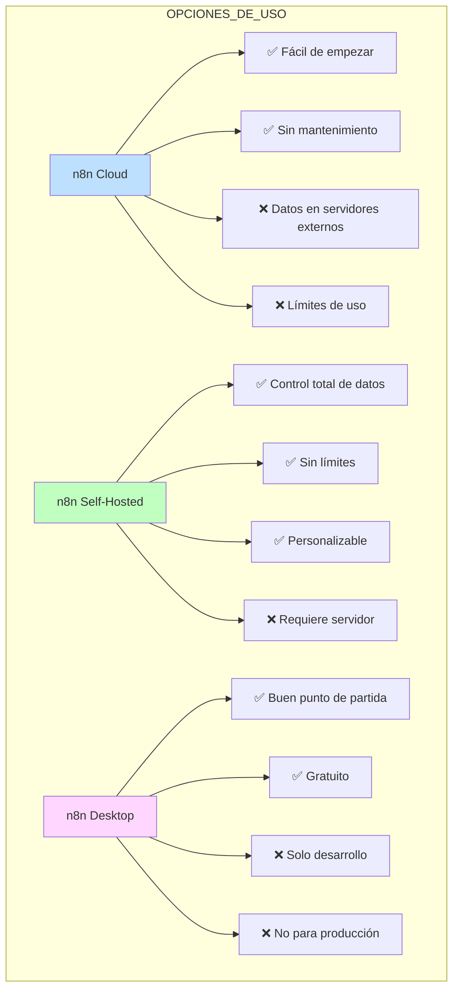
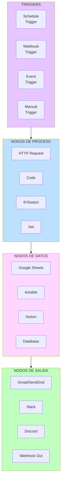
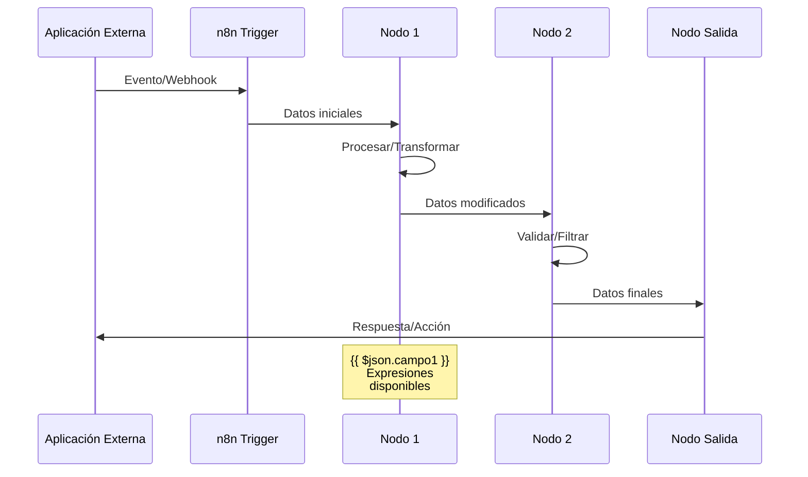
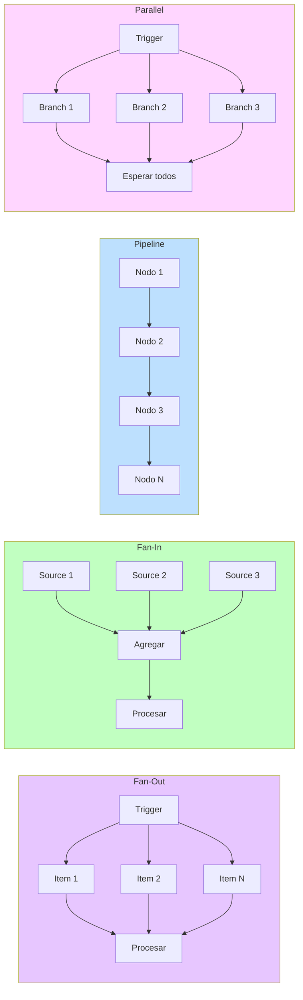

# CLASE 3: INTRODUCCIÓN A N8N - AUTOMATIZACIÓN VISUAL

## 📅 Duración: 4 Horas (240 minutos)

---

## 3.1 OBJETIVOS DE APRENDIZAJE

Al finalizar esta clase, los participantes serán capaces de:

1. **Comprender los conceptos fundamentales de n8n** y su arquitectura basada en nodos.

2. **Crear workflows básicos** que automaticen procesos empresariales comunes.

3. **Configurar triggers (disparadores)** para iniciar automatizaciones basadas en eventos.

4. **Manejar datos entre nodos** usando expresiones y transformación de datos.

5. **Conectar aplicaciones populares** mediante integraciones pre-construidas.

6. **Implementar manejo básico de errores** para crear workflows robustos.

7. **Desplegar y monitorear** workflows en producción.

---

## 3.2 CONTENIDOS DETALLADOS

### MÓDULO 1: FUNDAMENTOS DE N8N (60 minutos)

#### 3.2.1 ¿Qué es n8n?

**n8n** (se pronuncia "n-eight-n" o "nodemation") es una plataforma de automatización de workflows de código abierto que permite conectar aplicaciones y automatizar tareas sin necesidad de programación tradicional.

**Características Principales:**

| Característica | Descripción |
|----------------|-------------|
| **Código Abierto** | Puedes ver, modificar y alojar tu propia instancia |
| **Basado en Nodos** | Cada acción es un "nodo" que se conecta visualmente |
| **Auto-alojado** | Tienes control total de tus datos y automatizaciones |
| **Integraciones** | 400+ aplicaciones pre-construidas |
| **Flexible** | Soporta código JavaScript para personalizaciones |
| **Freemium** | Versión gratuita robusta, planes de pago para empresas |

**Comparativa con Competidores:**

```
┌─────────────────────────────────────────────────────────────────┐
│                    COMPARATIVA DE AUTOMATIZACIÓN                 │
├─────────────────┬─────────────┬─────────────┬───────────────────┤
│ Característica  │    n8n      │   Make      │     Zapier        │
├─────────────────┼─────────────┼─────────────┼───────────────────┤
│ Código abierto  │    ✅        │    ❌        │       ❌          │
│ Auto-alojado    │    ✅        │    ❌        │       ❌          │
│ Plan gratuito   │    ✅        │    ✅        │       ✅          │
│ Interfaz visual │    ✅        │    ✅        │       ✅          │
│ Límite gratuito │ 100 ejec/mes│ 1000 ops/mo │ 100 tasks/zap     │
│ Soporte IA/ML   │    ✅        │    ✅        │       ✅          │
│ Código personal │    ✅        │    ❌        │       ❌          │
│ Escalabilidad   │ Alta        │ Muy alta    │      Alta         │
│ Curva aprendizaje│ Media      │    Baja     │       Baja        │
└─────────────────┴─────────────┴─────────────┴───────────────────┘
```

#### 3.2.2 Arquitectura de n8n

**Concepto Central: El Workflow**

Un workflow en n8n es una secuencia de nodos conectados que procesan datos:

```
┌─────────────┐
│   TRIGGER   │  ← Punto de inicio (disparador)
└──────┬──────┘
       │
       ▼
┌─────────────┐
│   NODO 1    │  ← Procesa datos
└──────┬──────┘
       │
       ▼
┌─────────────┐
│   NODO 2    │  ← Transforma datos
└──────┬──────┘
       │
       ▼
┌─────────────┐
│   NODO 3    │  ← Envía resultado
└─────────────┘
```

**Componentes de un Nodo:**

```
┌─────────────────────────────────────────┐
│              NOMBRE DEL NODO             │
├─────────────────────────────────────────┤
│  ┌─────────────────────────────────┐    │
│  │  ICONO    Tipo de Conexión     │    │
│  │  🔷        Input / Output      │    │
│  └─────────────────────────────────┘    │
│                                         │
│  CONFIGURACIÓN:                         │
│  ├─ Credenciales                        │
│  ├─ Parámetros                         │
│  ├─ Expresiones                        │
│  └─ Opciones                            │
│                                         │
│  OUTPUT:                                │
│  └─ Datos de salida                     │
└─────────────────────────────────────────┘
```

#### 3.2.3 Modos de Uso de n8n

**1. n8n Cloud (Servicio Administrado)**
- Registro en n8n.com
- Sin instalación
- Planes desde $0/mes
- Los datos se procesan en servidores de n8n

**2. n8n Self-Hosted (Auto-alojado)**
- Instalar en tu propio servidor
- Docker, npm, o Kubernetes
- Control total de datos
- Requiere conocimientos técnicos básicos

**3. n8n Desktop (Para desarrollo local)**
- Descarga para Windows/Mac
- Ideal para aprender y desarrollar
- No apta para producción



#### 3.2.4 Interfaz de n8n

**Elementos de la Pantalla Principal:**

```
┌─────────────────────────────────────────────────────────────────┐
│  ┌──────────┐  n8n - Workflows    [Buscar...]  [+] [⚙️] [👤]     │
├─────────────────────────────────────────────────────────────────┤
│  │ 🏠 Home  │  Workflows   Credentials   Templates   Executions │
│  └──────────┴───────────────────────────────────────────────────│
│                                                                  │
│  ┌────────────────────────────────────────────────────────────┐ │
│  │                                                            │ │
│  │     ┌─────────────────────────────────────────────┐        │ │
│  │     │                                             │        │ │
│  │     │         ÁREA DE TRABAJO                     │        │ │
│  │     │                                             │        │ │
│  │     │    [Trigger] ─── [Nodo] ─── [Nodo]         │        │ │
│  │     │                                             │        │ │
│  │     │                                             │        │ │
│  │     └─────────────────────────────────────────────┘        │ │
│  │                                                            │ │
│  │  [+ Add Node]                    [+ Add Step]              │ │
│  └────────────────────────────────────────────────────────────┘ │
│                                                                  │
│  ┌────────────────────────────────────────────────────────────┐ │
│  │ PANEL DE CONFIGURACIÓN                                      │ │
│  │ Nodo: HTTP Request                                         │ │
│  │ Method: [GET ▼]   URL: [...............................]  │ │
│  └────────────────────────────────────────────────────────────┘ │
└─────────────────────────────────────────────────────────────────┘
```

**Secciones Clave:**

1. **Sidebar izquierdo**: Navegación y búsqueda de nodos
2. **Canvas central**: Espacio de trabajo visual
3. **Panel inferior**: Configuración del nodo seleccionado
4. **Barra superior**: Acciones globales y ejecución

---

### MÓDULO 2: CONCEPTOS DE TRIGGERS Y ACCIONES (45 minutos)

#### 3.2.5 ¿Qué es un Trigger?

Un **trigger** (disparador) es el evento que inicia la ejecución de un workflow. Sin trigger, un workflow nunca se ejecutará automáticamente.

**Tipos de Triggers en n8n:**

| Tipo | Ejemplo | Cuándo Usarlo |
|------|---------|--------------|
| **Schedule (Programado)** | Cada hora, diario | Tareas recurrentes |
| **Webhook** | HTTP request | Respuesta a eventos externos |
| **Event-based** | Email recibido | Reaccionar a eventos de apps |
| **Manual** | Botón "Test" | Pruebas y ejecuciones únicas |

#### 3.2.6 Trigger: Schedule (Programado)

**Configuración:**
```
Intervalo: Cada [1] [hora ▼]
```

**Ejemplos Prácticos:**
- Cada día a las 8:00 AM → Enviar resumen diario
- Cada hora → Sincronizar inventario
- Cada lunes a las 9:00 → Reporte semanal
- Cada 15 minutos → Verificar nuevos pedidos

```
Configuración:
┌─────────────────────────────────────┐
│  Schedule Trigger                   │
├─────────────────────────────────────┤
│  Rule: [Cron] ▼                     │
│  ┌─────────────────────────────────┐│
│  │ * * * * * *                     ││
│  │ │ │ │ │ │ │                     ││
│  │ │ │ │ │ └─ Día de la semana    ││
│  │ │ │ │ └─── Día del mes         ││
│  │ │ │ └───── Mes                 ││
│  │ │ └─────── Hora                ││
│  │ └───────── Minuto              ││
│  └─────────────────────────────────┘│
│                                     │
│  Ejemplos de Cron:                  │
│  @hourly = Cada hora                │
│  @daily = Diario                    │
│  @weekly = Semanal                  │
│  0 8 * * * = 8:00 AM diario         │
│  0 9 * * 1 = Lunes 9:00 AM          │
└─────────────────────────────────────┘
```

#### 3.2.7 Trigger: Webhook

Un **webhook** permite que aplicaciones externas envíen datos a tu workflow mediante una URL única.

**Funcionamiento:**
```
1. Crear workflow con trigger Webhook
2. n8n genera una URL única
3. Guardar URL en la aplicación externa
4. Cuando ocurre el evento → Se envía POST a n8n
5. Workflow se ejecuta con los datos recibidos
```

**Ejemplo: Notificación de Stripe**
```
URL del Webhook: https://tu-n8n.app/webhook/abc123

Cuando Stripe recibe un pago:
1. Stripe envía POST a tu URL
2. Body: {"event": "payment.success", "amount": 99}
3. n8n recibe y procesa
4. Puedes: actualizar DB, enviar email, notificar Slack
```

#### 3.2.8 Trigger: Event-Based

Algunos nodos pueden actuar como triggers esperando eventos específicos:

| Servicio | Eventos Disponibles |
|----------|--------------------|
| **Gmail** | Nuevo email, email matching filtro |
| **Slack** | Nuevo mensaje, mención |
| **Shopify** | Nuevo pedido, pago, envío |
| **Airtable** | Nuevo registro, actualización |
| **Google Sheets** | Nueva fila, cambio en celda |
| **Notion** | Nueva página, base actualizada |

#### 3.2.9 Acciones Básicas en n8n

**Acciones** son nodos que realizan operaciones sobre datos:

**ACCIONES DE DATOS:**
| Acción | Función | Ejemplo |
|--------|---------|---------|
| **Set** | Asignar valores | Crear variable "nombre" = "Juan" |
| **Clone** | Duplicar datos | Copiar array para procesamiento |
| **Sort** | Ordenar | Ordenar clientes por nombre |
| **Filter** | Filtrar | Solo clientes con deuda > 0 |

**ACCIONES DE ENVÍO:**
| Acción | Función | Ejemplo |
|--------|---------|---------|
| **Email** | Enviar email | Confirmación de pedido |
| **Slack** | Enviar mensaje | Notificación a equipo |
| **Discord** | Mensaje a canal | Alerta de sistema |
| **Telegram** | Bot message | Recordatorio |

**ACCIONES DE ALMACENAMIENTO:**
| Acción | Función | Ejemplo |
|--------|---------|---------|
| **Google Sheets** | Escribir en sheet | Registrar pedido |
| **Airtable** | Crear/actualizar registro | Gestionar CRM |
| **Postgres/MySQL** | Operaciones DB | Query personalizado |
| **HTTP Request** | Llamadas API | Integración flexible |

---

### MÓDULO 3: CONSTRUCCIÓN DE WORKFLOWS BÁSICOS (60 minutos)

#### 3.2.10 Primer Workflow: Recordatorio Diario por Email

**Objetivo:** Enviar un recordatorio diario a las 8:00 AM con las tareas del día.

**Paso 1: Crear el Trigger**
1. Click en "+ Add Node"
2. Buscar "Schedule Trigger"
3. Configurar: Todos los días a las 8:00 AM
   - Cron: `0 8 * * *`

**Paso 2: Obtener Tareas**
1. Añadir nodo "Notion"
2. Seleccionar operación: "Search Objects"
3. Configurar base de datos de tareas
4. Filtro: Fecha de hoy

**Paso 3: Preparar el Email**
1. Añadir nodo "Gmail"
2. Operación: "Send"
3. Para: Tu email
4. Asunto: `Recordatorio: {{ $json.date }}`
5. Cuerpo: Lista de tareas

**Workflow Completo:**
```
┌──────────────┐     ┌──────────────┐     ┌──────────────┐
│  SCHEDULE    │────→│   NOTION     │────→│    GMAIL     │
│  Trigger     │     │  Get Tasks   │     │  Send Email  │
│  8:00 AM     │     │              │     │              │
└──────────────┘     └──────────────┘     └──────────────┘
```

#### 3.2.11 Expresiones y Manejo de Datos

Las **expresiones** permiten usar datos dinámicos dentro de los nodos. Se escriben entre `{{ }}`.

**Acceso a datos:**
```javascript
// Acceder a datos del nodo anterior
{{ $json.nombre }}
{{ $json.productos[0].precio }}

// Acceder a parámetros del workflow
{{ $workflow.id }}
{{ $execution.id }}

// Funciones útiles
{{ $now.format('DD/MM/YYYY') }}  // Fecha actual formateada
{{ $json.cantidad * $json.precio }}  // Cálculo
{{ $json.nombre.toUpperCase() }}  // Transformación
```

**Ejemplo Práctico:**
```
Email de confirmación de pedido:

Estimado/a {{ $json.cliente.nombre }},

Tu pedido #{{ $json.pedido.numero }} ha sido recibido.

Detalles:
{{ $json.pedido.items.map(i => `- ${i.cantidad}x ${i.producto}`).join('\n') }}

Total: ${{ $json.pedido.total.toFixed(2) }}

Fecha estimada de entrega: {{ $json.pedido.fechaEntrega }}
```

#### 3.2.12 Workflow: Captura de Leads desde Web

**Objetivo:** Cuando alguien llena un formulario web, guardar en CRM y notificar al equipo.

**Arquitectura:**
```
┌─────────┐     ┌─────────┐     ┌─────────┐     ┌─────────┐
│WEBHOOK │────→│ FILTER  │────→│AIRTABLE │────→│ SLACK   │
│Trigger │     │ Validar │     │ Create  │     │ Notify  │
│        │     │ datos   │     │ Record  │     │ Team    │
└─────────┘     └─────────┘     └─────────┘     └─────────┘
```

**Paso 1: Webhook Trigger**
- Método: POST
- n8n genera URL única

**Paso 2: Nodo Filter**
- Condition: `email` exists
- AND: `email` contains "@"
- AND: `nombre` not empty

**Paso 3: Airtable (CRM)**
- Operation: Create Record
- Table: Leads
- Fields: nombre, email, telefono, fuente

**Paso 4: Slack Message**
- Channel: #nuevos-leads
- Message: `🎉 Nuevo lead!\nNombre: {{ $json.nombre }}\nEmail: {{ $json.email }}`

#### 3.2.13 Workflow: Sincronización Bidireccional

**Escenario:** Mantener sincronizados contactos entre Google Contacts y una hoja de cálculo.

**Arquitectura:**
```
┌──────────────┐     ┌──────────────┐
│  GOOGLE      │────→│   GOOGLE     │
│  SHEETS      │     │  CONTACTS    │
│  (Trigger)   │     │  (Create)   │
└──────────────┘     └──────────────┘
```

**Lógica:**
1. Schedule Trigger cada hora
2. Leer última fila de Google Sheets
3. Verificar si el contacto existe en Google Contacts
4. Si no existe → Crear
5. Si existe → Actualizar datos

---

### MÓDULO 4: MANEJO AVANZADO DE DATOS (45 minutos)

#### 3.2.14 Nodos de Transformación de Datos

**NODO SET:**
Permite crear nuevos campos o modificar existentes.

```
Input:
{
  "nombre": "Juan",
  "apellido": "Pérez",
  "edad": 35
}

Configuración Set:
├── nombreCompleto: {{ $json.nombre }} {{ $json.apellido }}
├── iniciales: {{ $json.nombre[0] }}.{{ $json.apellido[0] }}.
└── esMayorDeEdad: {{ $json.edad >= 18 }}

Output:
{
  "nombre": "Juan",
  "apellido": "Pérez",
  "edad": 35,
  "nombreCompleto": "Juan Pérez",
  "iniciales": "J.P.",
  "esMayorDeEdad": true
}
```

**NODO CODE:**
Permite escribir JavaScript para transformaciones complejas.

```javascript
// Ejemplo: Calcular descuento por volumen
const items = $input.all();

const processed = items.map(item => {
  const cantidad = item.json.cantidad;
  let descuento = 0;
  
  if (cantidad > 100) descuento = 0.2;      // 20%
  else if (cantidad > 50) descuento = 0.1;  // 10%
  else if (cantidad > 10) descuento = 0.05; // 5%
  
  return {
    json: {
      ...item.json,
      descuento: descuento,
      precioFinal: item.json.precio * cantidad * (1 - descuento),
      categoriaDescuento: descuento > 0 ? 'Volumen' : 'Ninguno'
    }
  };
});

return processed;
```

#### 3.2.15 Nodos de Flujo de Control

**IF (Condicional):**
```
┌─────────────────────────────────────┐
│           IF Node                    │
├─────────────────────────────────────┤
│ Condition:                           │
│ ┌─────────────────────────────────┐ │
│ │ {{ $json.monto }}  [>=] [1000] │ │
│ └─────────────────────────────────┘ │
│                                     │
│ Si es TRUE → Output 1 (azul)        │
│ Si es FALSE → Output 2 (rojo)       │
└─────────────────────────────────────┘
```

**SWITCH (Múltiples Condiciones):**
```
┌─────────────────────────────────────┐
│          SWITCH Node                │
├─────────────────────────────────────┤
│ Rules:                              │
│ 1: {{ $json.status }} == "pending" │
│ 2: {{ $json.status }} == "active"  │
│ 3: {{ $json.status }} == "closed"  │
│ 4: Default                         │
└─────────────────────────────────────┘
```

** ejemplo completo:**
```
┌─────────┐     ┌─────────┐
│ WEBHOOK │────→│  SWITCH │────→ [pending] ──→ Enviar recordatorio
│         │     │ Status  │────→ [active]  ──→ Confirmar envío
│         │     │         │────→ [closed]  ──→ Archivar
│         │     │         │────→ [default] ──→ Log error
└─────────┘     └─────────┘
```

#### 3.2.16 Manejo de Errores

**Error Workflow:**
Permite capturar y manejar errores de forma elegante.

```
┌─────────────────────────────────────┐
│         ERROR WORKFLOW              │
├─────────────────────────────────────┤
│ Trigger: Error Trigger              │
│                                     │
│ Nodos:                              │
│ 1. Slack → Notificar al equipo      │
│ 2. Set → Preparar mensaje de error  │
│ 3. Gmail → Enviar alerta            │
│                                     │
│ Datos disponibles:                 │
│ {{ $json.workflow.id }}             │
│ {{ $json.node.name }}              │
│ {{ $json.execution.id }}           │
│ {{ $json.error.message }}         │
└─────────────────────────────────────┘
```

**Configuración de Retry:**
```
┌─────────────────────────────────────┐
│ Node Settings → Options            │
├─────────────────────────────────────┤
│ Retry On Fail: [✓]                  │
│ Max Retries: [3]                    │
│ Retry Interval: [5 minutos]         │
│                                     │
│ Wait Between Retries: [✓]           │
│ Seconds: [60]                       │
└─────────────────────────────────────┘
```

---

## 3.3 DIAGRAMAS EN MERMAID

### Diagrama 1: Arquitectura de Workflow n8n



### Diagrama 2: Flujo de Datos en n8n



### Diagrama 3: Patrones Comunes de Workflows



---

## 3.4 REFERENCIAS EXTERNAS

1. **Documentación Oficial de n8n**
   - URL: https://docs.n8n.io/
   - Relevancia: Fuente primaria de información

2. **n8n Workflow Templates**
   - URL: https://n8n.io/workflows
   - Relevancia: Plantillas pre-hechas para aprender

3. **n8n Community Forum**
   - URL: https://community.n8n.io/
   - Relevancia: Ayuda y ejemplos de la comunidad

4. **n8n Blog**
   - URL: https://n8n.io/blog
   - Relevancia: Casos de uso y tutoriales

5. **GitHub n8n**
   - URL: https://github.com/n8n-io/n8n
   - Relevancia: Código fuente y contribuciones

6. **YouTube: n8n Official**
   - URL: https://www.youtube.com/@n8n_io
   - Relevancia: Video tutoriales oficiales

7. **npm n8n**
   - URL: https://www.npmjs.com/package/n8n
   - Relevancia: Instalación self-hosted

8. **Awesome n8n**
   - URL: https://github.com/n8n-io/awesome-n8n
   - Relevancia: Recursos curated por la comunidad

---

## 3.5 EJERCICIOS PRÁCTICOS RESUELTOS Y EXPLICADOS

### Ejercicio 1: Automatización de Confirmación de Pedidos

**ESCENARIO:** Tienda online que necesita enviar emails de confirmación cuando llega un nuevo pedido de Shopify.

**SOLUCIÓN PASO A PASO:**

**PASO 1: Configurar el Trigger (Webhook)**
```
1. Crear nuevo workflow
2. Añadir "Shopify Trigger"
3. Seleccionar evento: "New Order"
4. Copiar la URL del webhook
5. Ir a Shopify → Settings → Notifications → Webhooks
6. Crear webhook apuntando a la URL de n8n
```

**PASO 2: Preparar los Datos del Cliente**
```
1. Añadir nodo "Set"
2. Configurar:
   - customerEmail: {{ $json.customer.email }}
   - customerName: {{ $json.customer.first_name }} {{ $json.customer.last_name }}
   - orderNumber: {{ $json.order_number }}
   - orderTotal: {{ $json.total_price }}
```

**PASO 3: Enviar Email de Confirmación**
```
1. Añadir nodo "Gmail" o "Send Email"
2. Configurar:
   - To: {{ $json.customerEmail }}
   - Subject: Confirmación de tu pedido #{{ $json.orderNumber }}
   - Body:
     ```
     Hola {{ $json.customerName }},
     
     ¡Gracias por tu compra! Tu pedido #{{ $json.orderNumber }} 
     ha sido recibido y está siendo procesado.
     
     Total: ${{ $json.orderTotal }}
     
     Te notificaremos cuando se envíe.
     
     - El equipo de [Tu Tienda]
     ```
```

**PASO 4: Agregar a Airtable (CRM)**
```
1. Añadir nodo "Airtable"
2. Operation: Create Record
3. Base: [Tu Base de Ventas]
4. Fields:
   - Email: {{ $json.customerEmail }}
   - Nombre: {{ $json.customerName }}
   - Pedido: {{ $json.orderNumber }}
   - Total: {{ $json.orderTotal }}
   - Fecha: {{ $now.format('YYYY-MM-DD') }}
   - Estado: "Nuevo"
```

**WORKFLOW COMPLETO:**
```
┌────────────┐     ┌────────┐     ┌────────┐     ┌──────────┐
│  SHOPIFY   │────→│  SET   │────→│ GMAIL  │────→│ AIRTABLE │
│  Trigger   │     │ Format │     │ Send   │     │ Add CRM  │
└────────────┘     └────────┘     └────────┘     └──────────┘
```

---

### Ejercicio 2: Sincronización de Calendario con Tareas

**ESCENARIO:** Cada vez que se crea una tarea en Notion con fecha límite, crear un evento en Google Calendar.

**PASO 1: Trigger de Notion**
```
1. Añadir "Notion Trigger"
2. Database: [Tareas]
3. Trigger: "When record is created"
4. Credenciales de Notion conectadas
```

**PASO 2: Verificar que tenga fecha**
```
1. Añadir nodo "IF"
2. Condition: {{ $json.properties.Fecha.deadline }} is not empty
3. Si FALSE → Terminar (nodo Stop)
```

**PASO 3: Crear Evento en Calendar**
```
1. Añadir "Google Calendar"
2. Operation: Create Event
3. Configurar:
   - Calendar ID: primary
   - Summary: {{ $json.properties.Name.title[0].plain_text }}
   - Description: {{ $json.properties.Descripcion.rich_text[0].plain_text }}
   - Start Date: {{ $json.properties.Fecha.deadline }}
   - End Date: {{ $json.properties.Fecha.deadline }}
   - Time: 09:00 (todo el día: allday: true)
```

**PASO 4: Actualizar Notion**
```
1. Añadir "Notion"
2. Operation: Update Record
3. Record ID: {{ $json.id }}
4. Fields:
   - Calendar Synced: true
   - Calendar Event ID: {{ $('Google Calendar').item.json.id }}
```

---

### Ejercicio 3: Bot de Slack para Consultas de Inventario

**ESCENARIO:** El equipo puede preguntar a un bot de Slack el stock de cualquier producto.

**PASO 1: Trigger de Slack**
```
1. Añadir "Slack Trigger"
2. Events: message.im (mensajes directos)
3. Palabra clave: "stock " (para filtrar)
```

**PASO 2: Extraer Nombre del Producto**
```
1. Añadir "Code" node
2. JavaScript:
```javascript
const text = $input.first().json.text;
const match = text.match(/stock\s+(.+)/i);

return {
  json: {
    producto: match ? match[1].trim() : null,
    originalText: text
  }
};
```
```

**PASO 3: Consultar Inventario**
```
1. Añadir "Google Sheets"
2. Operation: Lookup Row
3. Sheet: Inventario
4. Lookup Column: Producto
5. Lookup Value: {{ $json.producto }}
```

**PASO 4: Responder en Slack**
```
1. Añadir "Slack" (Send Message)
2. Channel: {{ $json.originalText.channel }}
3. Message:
```
   ```
   📦 *Stock de {{ $json.producto }}*
   
   Cantidad disponible: {{ $json.cantidad }}
   Ubicación: {{ $json.ubicacion }}
   Última actualización: {{ $json.ultimaActualizacion }}
   ```
```

---

## 3.6 TECNOLOGÍAS ESPECÍFICAS

### n8n y Ecosistema

| Herramienta | Función | Costo | Link |
|-------------|---------|-------|------|
| **n8n Cloud** | Servicio alojado | Gratis-$99/mes | n8n.io |
| **n8n Desktop** | Desarrollo local | Gratis | github.com/n8n-io/n8n |
| **n8n Docker** | Auto-alojado | Gratis | docs.n8n.io/hosting |
| **n8n Nodes SDK** | Crear nodos | Gratis | docs.n8n.io/node980 |

### Aplicaciones Integradas Populares

| Categoría | Aplicaciones | Ejemplo de Uso |
|-----------|-------------|---------------|
| **Email** | Gmail, Outlook, SendGrid | Enviar notificaciones |
| **CRM** | HubSpot, Salesforce, Airtable | Gestionar leads |
| **Comunicación** | Slack, Discord, Teams | Notificaciones |
| **E-commerce** | Shopify, WooCommerce, Stripe | Pedidos y pagos |
| **Productividad** | Notion, Google, Airtable | Sincronizar datos |
| **Social** | Twitter, Instagram, LinkedIn | Publicar contenido |
| **AI** | OpenAI, Hugging Face | Análisis inteligente |
| **Bases de Datos** | MySQL, PostgreSQL, MongoDB | Almacenar datos |

### Recursos de Aprendizaje

| Recurso | Tipo | Link |
|---------|------|------|
| **n8n Docs** | Documentación | docs.n8n.io |
| **n8n Academy** | Cursos | academy.n8n.io |
| **n8n Workflows** | Templates | n8n.io/workflows |
| **Community Nodes** | Nodos extras | n8n.io/community-nodes |

---

## 3.7 ACTIVIDADES DE LABORATORIO

### Laboratorio 1: Configuración de n8n y Primer Workflow

**Objetivo:** Configurar n8n y crear tu primer workflow funcional.

**Tiempo estimado:** 60 minutos

**Instrucciones:**

**PARTE A: Configuración (15 minutos)**

1. **Opción A - Cloud:**
   - Ve a https://n8n.io
   - Crea cuenta gratuita
   - Explora la interfaz

2. **Opción B - Desktop:**
   - Descarga desde https://desktop.n8n.io
   - Instala en tu computadora
   - Inicia n8n

**PARTE B: Explorar la Interfaz (10 minutos)**
- Identifica las secciones principales
- Practica añadir nodos
- Aprende a conectar nodos

**PARTE C: Crear Workflow de Prueba (20 minutos)**
1. Crea un nuevo workflow
2. Añade "Manual Trigger" (para probar manualmente)
3. Añade nodo "Set" con tus datos
4. Añade nodo "Slack" o "Gmail" configurado
5. Ejecuta y observa el resultado

**PARTE D: Documentar (15 minutos)**
- Toma screenshots de tu workflow
- Documenta qué hace cada nodo
- Prepara una explicación de 2 minutos

**Entregable:** Screenshot del workflow + explicación

---

### Laboratorio 2: Workflow de Captura de Leads

**Objetivo:** Crear un workflow completo que capture leads desde un formulario y los agregue a tu CRM.

**Tiempo estimado:** 75 minutos

**Instrucciones:**

**PARTE A: Preparación (15 minutos)**
1. Identifica qué CRM usarás (Airtable, Google Sheets, o similar)
2. Define los campos que necesitas (nombre, email, teléfono, etc.)
3. Prepara la estructura en tu CRM

**PARTE B: Crear el Workflow (30 minutos)**

1. **Trigger:** Webhook
   - Anota la URL generada

2. **Validación:** Nodo IF
   - Verifica que email no esté vacío
   - Verifica formato básico de email

3. **Transformación:** Nodo Set
   - Limpia y formatea los datos

4. **CRM:** Nodo de tu aplicación
   - Crea el registro

5. **Notificación:** Slack/Email
   - Informa al equipo

**PARTE C: Probar (15 minutos)**
1. Usa Postman o curl para enviar datos de prueba:
```bash
curl -X POST "TU_URL_WEBHOOK" \
  -H "Content-Type: application/json" \
  -d '{"nombre":"Juan Pérez","email":"juan@ejemplo.com","telefono":"1234567890"}'
```

2. Verifica que llegó a tu CRM
3. Verifica que llegó la notificación

**PARTE D: Optimizar (15 minutos)**
- Agrega más validaciones
- Mejora el mensaje de notificación
- Agrega manejo de errores

**Entregable:** Workflow funcional + datos de prueba exitosos

---

### Laboratorio 3: Automatización de Redes Sociales

**Objetivo:** Crear un sistema que publique automáticamente en Twitter/LinkedIn cuando publiques en tu blog.

**Tiempo estimado:** 60 minutos

**Instrucciones:**

**PARTE A: Configurar Integraciones (15 minutos)**
1. Conecta tu cuenta de Twitter (credenciales en n8n)
2. Conecta tu cuenta de LinkedIn (credenciales en n8n)
3. Opcional: Conecta tu blog/CMS

**PARTE B: Diseñar el Workflow (15 minutos)**
```
Trigger: RSS Feed o Webhook desde tu blog
  ↓
Extraer: Título, URL, descripción
  ↓
Crear mensaje: Formatear para cada red social
  ↓
Publicar: Twitter + LinkedIn
  ↓
Registrar: En Google Sheets qué se publicó
```

**PARTE C: Implementar (20 minutos)**
1. Configura trigger (RSS: tu blog.com/feed)
2. Añade nodo "RSS Read"
3. Nodo "Set" para formatear mensajes
4. Nodos de Twitter y LinkedIn
5. Nodo final de registro

**PARTE D: Probar (10 minutos)**
1. Ejecuta manualmente
2. Verifica publicación en redes
3. Ajusta formatos si es necesario

**Entregable:** Workflow de automatización social

---

## 3.8 RESUMEN DE PUNTOS CLAVE

### Conceptos Fundamentales

1. **n8n es una herramienta de automatización basada en nodos** que permite conectar aplicaciones y crear flujos de trabajo sin código, con la opción de agregar código JavaScript cuando sea necesario.

2. **Todo workflow necesita un trigger** para ejecutarse: Schedule, Webhook, Event-based, o Manual.

3. **Las expresiones {{ }} permiten usar datos dinámicos** de nodos anteriores, habilitando personalizaciones potentes.

4. **Los nodos de flujo de control (IF, Switch)** permiten crear lógica condicional y branching en tus workflows.

5. **El manejo de errores es esencial**: Configura "Error Workflow" y opciones de retry para crear automatizaciones robustas.

### Patrones Comunes de Workflows

- **Fan-out**: Un trigger que procesa múltiples items
- **Fan-in**: Múltiples fuentes que convergen en un proceso
- **Pipeline**: Secuencia lineal de transformaciones
- **Parallel**: Ramas simultáneas que luego se unen

### Próximos Pasos

- **[ ]** Configura tu cuenta de n8n
- **[ ]** Crea 3 workflows básicos de prueba
- **[ ]** Implementa un workflow real para tu negocio
- **[ ]** Explora la documentación de nodos específicos

### Frases para Recordar

> "En n8n, cada acción es un bloque que conectas. La magia está en cómo los conectas."

> "Un buen workflow es como una receta: pasos claros, ingredientes correctos, y el orden importa."

> "No necesitas saber programar para automatizar, pero saber un poco de JavaScript abre un mundo de posibilidades."

---

## 📚 MATERIALES COMPLEMENTARIOS

### Documentación Específica

- **Getting Started Guide**: https://docs.n8n.io/getting-started/
- **Key Concepts**: https://docs.n8n.io/concepts/
- **Expressions**: https://docs.n8n.io/code-examples/expressions/
- **Error Handling**: https://docs.n8n.io/error-handling/

### Videos Recomendados

- "n8n Full Course for Beginners" - YouTube
- "Build Your First n8n Workflow" - n8n Academy
- "n8n AI Automation Examples" - n8n YouTube

### Comunidades

- **Discord n8n**: https://discord.gg/n8n
- **Reddit r/n8n**: https://reddit.com/r/n8n
- **Forum**: https://community.n8n.io/

---

**FIN DE LA CLASE 3**

*En la Clase 4, exploraremos Make (Integromat), otra poderosa herramienta de automatización que complementa a n8n con sus propias fortalezas únicas.*
