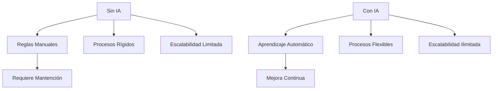
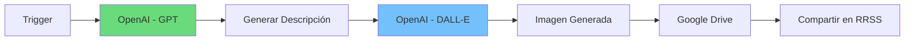
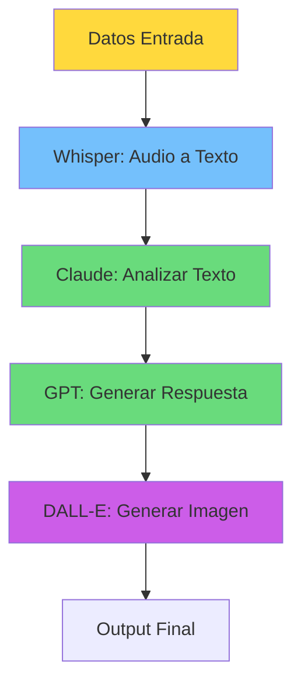
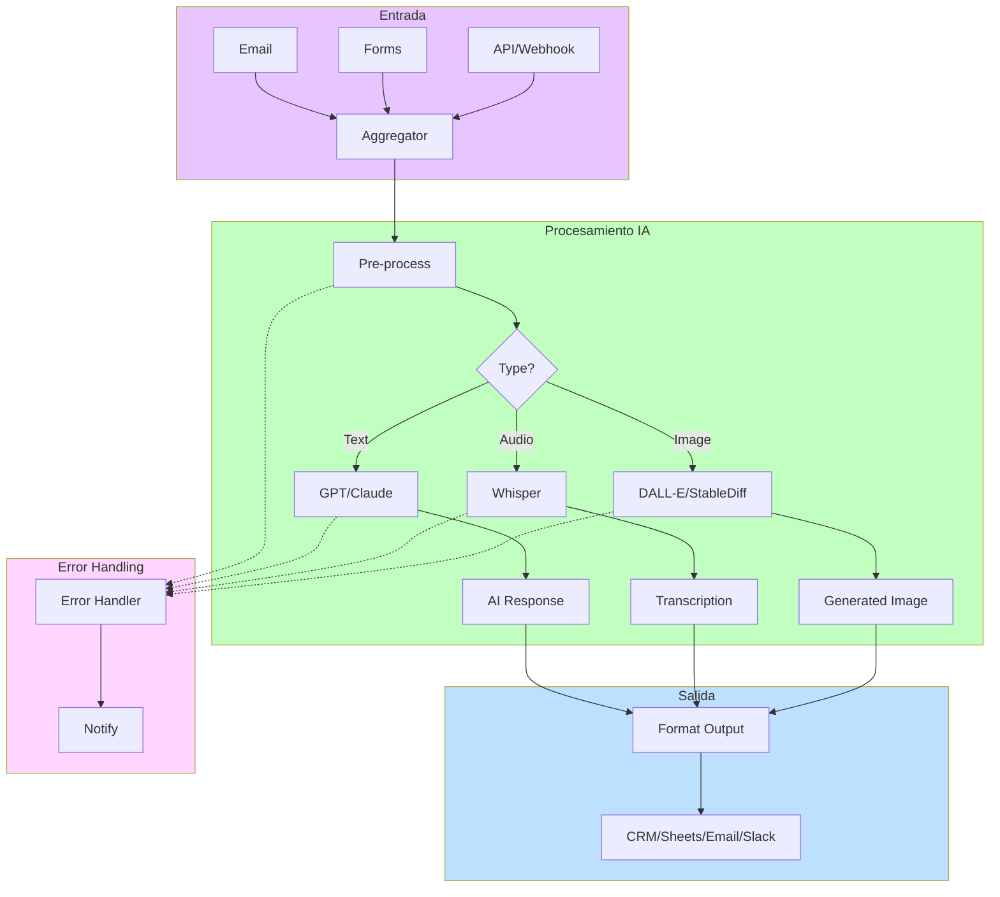
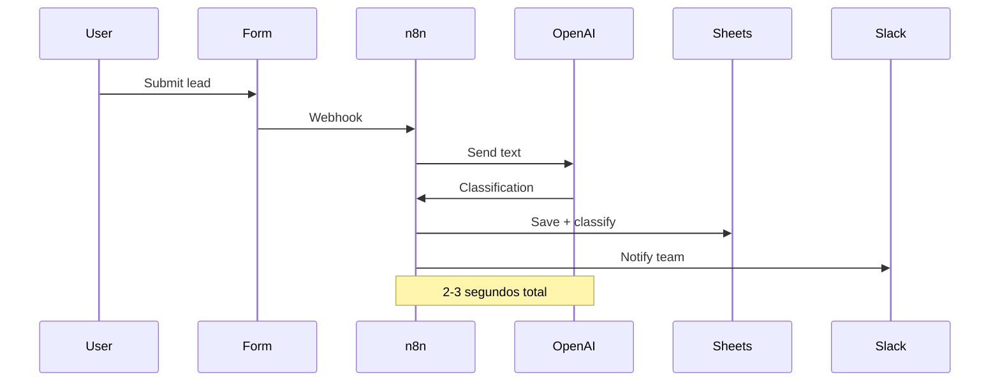
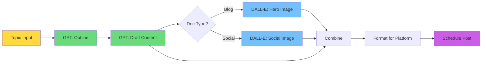

# CLASE 5: INTEGRACIÓN DE IA EN FLUJOS NO-CODE

## 📅 Duración: 4 Horas (240 minutos)

---

## 5.1 OBJETIVOS DE APRENDIZAJE

Al finalizar esta clase, los participantes serán capaces de:

1. **Integrar OpenAI GPT en flujos de automatización** para generación de texto inteligente
2. **Utilizar Stable Diffusion para generación de imágenes** desde flujos No-Code
3. **Implementar Whisper para transcripción de audio** en automatizaciones
4. **Emplear Claude para análisis y procesamiento de texto** avanzado
5. **Diseñar flujos completos que combinen múltiples modelos de IA**

---

## 5.2 CONTENIDOS DETALLADOS

### MÓDULO 1: FUNDAMENTOS DE IA EN AUTOMATIZACIONES (45 minutos)

#### 5.2.1 El Ecosistema de APIs de IA

La Inteligencia Artificial ha evolucionado dramáticamente y ahora está disponible a través de APIs accesibles para cualquier desarrollador o automatizador. Las principales empresas que ofrecen estos servicios son:

**Proveedores Principales:**

1. **OpenAI**: GPT-4, GPT-4o, DALL-E, Whisper
2. **Anthropic**: Claude (Claude 3.5 Sonnet, Opus, Haiku)
3. **Google**: Gemini, PaLM
4. **Meta**: Llama
5. **Stability AI**: Stable Diffusion, Stable Video

**¿Por Qué Integrar IA en Automatizaciones?**

Las APIs de IA permiten:
- **Análisis inteligente de datos**: Extraer insights de texto no estructurado
- **Generación de contenido**: Crear textos, imágenes, audio automáticamente
- **Clasificación automática**: Categorizar información sin reglas manuales
- **Traducción y localización**: Adaptar contenido a diferentes idiomas
- **Asistentes virtuales**: Responder consultas de manera inteligente



#### 5.2.2 Arquitectura de Integración

Cuando integras IA en tus flujos No-Code, la arquitectura típica es:

```
[Trigger] --> [Recopilar Datos] --> [Preparar Input] --> [Llamar API IA]
    --> [Procesar Output] --> [Guardar/Notificar]
```

**Componentes Clave:**

1. **Input Preparation**: Los datos de entrada deben formatearse correctamente para el modelo
2. **API Call**: La llamada a la API de IA (puede ser OpenAI, Anthropic, etc.)
3. **Output Processing**: El resultado de la IA debe procesarse y guardarse
4. **Error Handling**: Manejar casos donde la IA no pueda procesar la solicitud

---

### MÓDULO 2: OPENAI EN N8N Y MAKE (75 minutos)

#### 5.2.3 Configuración de OpenAI

OpenAI ofrece varios modelos a través de su API:

**Modelos Disponibles:**

| Modelo | Uso Principal | Capacidad | Costo Aprox |
|--------|--------------|------------|-------------|
| **GPT-4o** | Versatilidad | Multimodal | $5/1M input |
| **GPT-4 Turbo** | Análisis complejo | Excelente | $10/1M input |
| **GPT-3.5 Turbo** | Tareas simples | Rápido | $0.50/1M input |
| **DALL-E 3** | Imágenes | Alta calidad | $0.04/imagen |

**Configuración en n8n:**

1. **Obtener API Key**:
   - Ve a https://platform.openai.com/api-keys
   - Crea una nueva clave API
   - Guárdala securely (solo se muestra una vez)

2. **Configurar en n8n**:
   - Ve a Credentials en n8n
   - Crea nueva credencial "OpenAI Api"
   - Pega tu API Key
   - Guarda la credencial

3. **Usar el Nodo**:
   - Busca "OpenAI" en el panel de nodos
   - Selecciona el modelo que necesitas
   - Conecta tu credencial

#### 5.2.4 Casos de Uso de OpenAI en Flujos

**Caso 1: Clasificación de Leads con IA**

**Problema:** Tienes leads con información en texto libre y necesitas clasificarlos automáticamente.

**Solución con n8n:**

```
1. Trigger: Nuevo registro en Sheets
2. OpenAI: Clasificar texto
   - Model: gpt-4o
   - Prompt: "Clasifica este lead según el presupuesto..."
   - Input: Datos del lead
3. Router: Según clasificación
4. Update Sheet: Guardar clasificación
```

**Configuración del Prompt:**

```
Eres un asistente de clasificación de leads para una empresa B2B.
Analiza la siguiente información del lead y clasifícala:

Nombre: {{nombre}}
Empresa: {{empresa}}
Mensaje: {{mensaje}}

Clasifica en una de estas categorías:
- HOT: Presupuesto > $10,000 y necesidad clara
- WARM: Presupuesto $1,000-$10,000
- COLD: Presupuesto < $1,000 o necesidad vaga
- NO FIT: No es un prospecto válido

Responde solo con la categoría.
```

**Caso 2: Generación de Respuestas Automáticas**

**Problema:** Necesitas responder automáticamente a consultas de clientes de manera personalizada.

**Flujo:**

```
1. Email trigger (Gmail)
2. OpenAI: Generar respuesta
   - Prompt: "Eres un asistente de atención al cliente..."
   - Input: Consulta del cliente
   - Historial previo (si hay)
3. Gmail: Enviar respuesta
```

**Prompt Avanzado:**

```
Eres {{nombre_empresa}}, un servicio de atención al cliente profesional y amigable.
Tu tono es: profesional pero cálido, kurz aber klar (breve pero claro).

Historial del cliente:
{{historial}}

Consulta actual:
{{consulta}}

Instrucciones:
1. Agradece por contacting
2. Responde de manera específica a la consulta
3. Si no puedes resolver, indica que alguien se contactará
4. Agrega una pregunta de seguimiento relevante

Genera una respuesta profesional en español.
```

#### 5.2.5 Integración de DALL-E para Imágenes

DALL-E permite generar imágenes a partir de texto:

**Flujo para Generación de Imágenes:**

```
1. Trigger: Programado o manual
2. OpenAI: Generate Image
   - Model: dall-e-3
   - Prompt: Descripción de la imagen
   - Size: 1024x1024
3. Google Drive: Subir imagen
4. Gmail/WhatsApp: Enviar imagen
```

**Ejemplo: Generar imágenes para productos:**

```
Prompt para producto:
"Fotografía profesional de un {{producto}} sobre fondo blanco, iluminación de estudio, 
角度 {{ángulo}}, estilo minimalista, colores {{colores_oficiales_de_marca}}"
```

**Ejemplo:生成Contenido Marketing:**

```
Prompt para post:
"Diseño gráfico moderno para redes sociales, promote {{producto}}, 
estilo: {{estilo_marketing}}, colores vibrantes, texto en español, 
70% imagen, 30% espacio negativo"
```



---

### MÓDULO 3: STABLE DIFFUSION Y GENERACIÓN DE IMÁGENES (45 minutos)

#### 5.3.1 Alternativas para Generación de Imágenes

Aunque DALL-E es excelente, hay otras opciones para generar imágenes:

**Comparativa de Herramientas:**

| Herramienta | Calidad | Costo | Privacidad | Instalación |
|-------------|---------|-------|------------|--------------|
| **DALL-E 3** | Excelente | $0.04/imagen | OpenAI | API |
| **Stable Diffusion** | Muy Alta | $0/local | Total | Local/API |
| **Midjourney** | Excelente | $10/mes | Midjourney | Discord |
| **Leonardo AI** | Alta | 150 credits/día | Leonardo | API |

#### 5.3.2 Stable Diffusion vía API

Stable Diffusion puede usarse via API a través de servicios como:

**Proveedores de API para Stable Diffusion:**

1. **Replicate**: https://replicate.com
2. **Stability AI API**: https://platform.stabilityai.com
3. **DeepInfra**: https://deepinfra.com

**Configuración con Replicate:**

1. Crear cuenta en Replicate
2. Obtener API Token
3. Elegir modelo (stable-diffusion-xl, etc.)
4. Llamar API desde n8n o Make

**Ejemplo de Llamada a Replicate:**

```
URL: https://api.replicate.com/v1/predictions
Method: POST
Headers:
  Authorization: Token {{api_token}}
  Content-Type: application/json
Body:
{
  "version": "model_version_id",
  "input": {
    "prompt": "{{prompt}}",
    "num_inference_steps": 50,
    "guidance_scale": 7.5,
    "width": 1024,
    "height": 1024
  }
}
```

#### 5.3.3 Casos de Uso para Imágenes

**Caso: Catálogo Automatizado**

```
1. Google Sheets: Lista de productos
2. Iterator: Procesar cada producto
3. OpenAI: Generar descripción para imagen
4. Stable Diffusion: Generar imagen
5. Google Drive: Guardar imagen
6. Shopify: Actualizar producto con imagen
```

---

### MÓDULO 4: WHISPER PARA AUDIO (30 minutos)

#### 5.4.1 Whisper: Transcripción de Audio

Whisper es el modelo de speech-to-text de OpenAI que ofrece transcripciones altamente precisas:

**Capacidades:**
- Soporta múltiples idiomas
- Maneja/accentuations diversos
- Transcripción en tiempo real o batch
- disponible en varios tamaños

**Modelos Whisper:**

| Modelo | Tamaño | Velocidad | Uso |
|--------|--------|-----------|-----|
| **tiny** | 39MB | Rápido | Pruebas |
| **base** | 74MB | Medio | Uso general |
| **small** | 244MB | Lento | Mejor precisión |
| **medium** | 769MB | Muy lento | Alta precisión |
| **large** | 1550MB | Muy lento | Mejor calidad |

#### 5.4.2 Implementación de Whisper

**Opción 1: API de OpenAI (Recomendado para producción)**

```
URL: https://api.openai.com/v1/audio/transcriptions
Method: POST
Headers:
  Authorization: Bearer {{api_key}}
Body (multipart/form-data):
  file: audio_file.mp3
  model: whisper-1
  response_format: json
  language: es
```

**Opción 2: n8n con Nodo AI**

n8n tiene nodos específicos para IA que facilitan la integración:

1. Busca "AI" en el panel de nodos
2. Selecciona "Audio Transcription"
3. Configura el modelo

**Caso de Uso: Notas de Voz a Texto**

```
1. WhatsApp/Webhook: Recibir nota de voz
2. Descargar audio
3. OpenAI Whisper: Transcribir
4. OpenAI GPT: Resumir o extraer action items
5. Notificar/Guardar
```

---

### MÓDULO 5: CLAUDE PARA TEXTO (30 minutos)

#### 5.5.1 Anthropic Claude

Claude de Anthropic es otro modelo de IA destacado, conocido por:

- **Excelente comprensión contextual**
- **Capacidad de análisis largo**
- **Menor tendencia a alucinations**
- **Más seguro y alineado**

**Modelos Disponibles:**

| Modelo | Capacidad | Mejor Uso |
|--------|-----------|-----------|
| **Claude 3.5 Sonnet** | Balance |通用 |
| **Claude 3.5 Opus** | Máxima | Análisis complejo |
| **Claude 3 Haiku** | Rápido | Velocidad |

#### 5.5.2 Integración de Claude

**Configuración:**

1. Obtener API Key en https://console.anthropic.com
2. Configurar en n8n como credencial
3. Usar nodo de chat

**Caso: Análisis de Feedback de Clientes**

```
1. Google Forms: Feedback recibido
2. Claude: Analizar sentimiento
   - Input: Feedback del cliente
   - Prompt: "Analiza el sentimiento y extrae temas principales"
3. Google Sheets: Guardar análisis
4. Router: Si negativo, notificar equipo
```

---

### MÓDULO 6: FLUJOS INTEGRADOS CON MÚLTIPLES IAs (15 minutos)

#### 5.6.1 Patrón: Pipeline de IA

Puedes combinar múltiples modelos de IA en un solo flujo:



#### 5.6.2 Ejemplo: Sistema de Resúmenes Automáticos

```
1. Receive Email with attachment
2. If attachment is audio → Whisper transcribe
3. If document → Extract text
4. Claude: Generate summary
5. GPT: Generate action items
6. Send summary + actions to Slack
```

---

## 5.3 DIAGRAMAS EN MERMAID

### Diagrama 1: Arquitectura de Integración de IA



### Diagrama 2: Flujo de Clasificación de Leads con IA



### Diagrama 3: Pipeline de Generación de Contenido



---

## 5.4 REFERENCIAS EXTERNAS

1. **OpenAI Platform Documentation**
   - URL: https://platform.openai.com/docs
   - Relevancia: Documentación oficial de APIs

2. **Anthropic Claude API**
   - URL: https://docs.anthropic.com
   - Relevancia: Documentación de Claude

3. **n8n AI Nodes**
   - URL: https://docs.n8n.io/ai/
   - Relevancia: Nodos de IA en n8n

4. **Replicate - Stable Diffusion**
   - URL: https://replicate.com
   - Relevancia: API para Stable Diffusion

5. **Make AI Integrations**
   - URL: https://www.make.com/en/integrations
   - Relevancia: Integraciones de IA en Make

---

## 5.5 EJERCICIOS PRÁCTICOS RESUELTOS Y EXPLICADOS

### Ejercicio 1: Clasificador Automático de Tickets de Soporte

**ESCENARIO:** Tienes un formulario que recibe tickets de soporte. Necesitas que la IA clasifique la urgencia y el tipo de problema automáticamente.

**PASO 1: Configurar el Trigger**

1. En n8n, crea nuevo workflow
2. Agrega nodo "Gmail" → "Watch Emails"
3. Filtro: Subject contains "Soporte" o "Ticket"
4. Configura el label para marcar como procesado

**PASO 2: Extraer Contenido del Email**

1. Agrega nodo "Set" para procesar datos
2. Extrae: Subject, From, Body (plain text)
3. Limpia el body (remueve firmas, respuestas anteriores)

**PASO 3: Integrar OpenAI para Clasificación**

1. Agrega nodo "OpenAI" → "Chat"
2. Configura credencial (si no la tienes, créala)
3. Modelo: gpt-4o (o gpt-4o-mini para降低成本)
4. Configura el mensaje del sistema:

```
Eres un asistente de clasificación de tickets de soporte técnico.
Analiza el siguiente ticket y clasifícalo:

TIcket:
{{body}}

Clasifica en las siguientes dimensiones:

1. URGENCIA (prioridad):
   - CRITICAL: Sistema caído,no funciona, pérdida de datos
   - HIGH: Problema importante pero no crítico
   - MEDIUM: Inconveniente, funciona parcialmente
   - LOW: Pregunta general, mejora request

2. CATEGORÍA:
   - TECHNICAL: Problema técnico, bug, error
   - BILLING: Facturación, pagos, cobros
   - ACCOUNT: Login, passwords, configuración
   - FEATURE: Solicitud de nueva funcionalidad
   - QUESTION: Pregunta general

Responde en JSON con este formato:
{"urgencia": "HIGH", "categoría": "TECHNICAL", "resumen": "descripción corta"}
```

**PASO 4: Procesar la Respuesta**

1. Agrega nodo "Set" para parsear el JSON
2. Extrae: urgencia, categoría, resumen

**PASO 5: Guardar en Sheets**

1. Agrega nodo "Google Sheets" → "Append Row"
2. Spreadsheet: "Tickets de Soporte"
3. Sheet: "Clasificados"
4. Mapea: fecha, email, asunto, body, urgencia, categoría

**PASO 6: Notificar Según Urgencia**

1. Agrega nodo "Router"
2. Filters:
   - Ruta 1: urgencia = "CRITICAL" → Slack @here
   - Ruta 2: urgencia = "HIGH" → Slack @team
   - Ruta 3: Other → Solo guardar

---

### Ejercicio 2: Generador Automático de Descripciones de Productos

**ESCENARIO:** Tienes una lista de productos en Google Sheets y quieres generar descripciones automáticamente con IA.

**PASO 1: Configurar Google Sheets como Trigger**

1. n8n → Google Sheets → "Watch Rows"
2. Spreadsheet: "Catálogo de Productos"
3. Sheet: "Productos"
4. Configura: Starting row: 2

**PASO 2: Iterar sobre Productos**

1. Agrega nodo "Set" para preparar datos
2. Mapea: nombre_producto, categoria, caracteristicas, palabras_clave

**PASO 3: Generar Descripción con OpenAI**

1. Agrega nodo "OpenAI" → "Chat"
2. Modelo: gpt-4o-mini (más económico)
3. Mensaje del sistema:

```
Eres un experto en marketing de e-commerce. Genera descripciones de productos atractivas y SEO-friendly.

Producto: {{nombre_producto}}
Categoría: {{categoria}}
Características: {{caracteristicas}}
Palabras clave: {{palabras_clave}}

Genera:
1. Título optimizado para SEO (máximo 60 caracteres)
2. Descripción larga (150-200 palabras)
3. Puntos destacados (5 bullet points)
4. Meta description (máximo 160 caracteres)

Formato de respuesta:
TITULO: ...
DESCRIPCION: ...
PUNTOS: ...
META: ...
```

**PASO 4: Parsear Respuesta**

1. Usa nodo "Set" para dividir la respuesta
2. Extrae cada sección usando expresiones regulares

**PASO 5: Actualizar Google Sheets**

1. Agrega "Google Sheets" → "Update Row"
2. Busca por nombre_producto o ID
3. Actualiza columnas: titulo_seo, descripcion, puntos, meta_description

---

### Ejercicio 3: Resumidor de Llamadas de Voz

**ESCENARIO:** Recibes notas de voz de clientes y quieres que se transcriban y resuman automáticamente.

**PASO 1: Recibir Audio**

1. Configura un webhook que acepte archivos de audio
2. O usa Gmail para detectar emails con archivos adjuntos de audio

**PASO 2: Transcribir con Whisper**

1. n8n → OpenAI → "Transcribe Audio"
2. Configura:
   - Audio: {{binary_data}}
   - Model: whisper-1
   - Language: Spanish

**PASO 3: Resumir con Claude**

1. Agrega nodo "Anthropic" → "Chat"
2. Credencial de Anthropic
3. Modelo: claude-3-haiku (o Sonnet)
4. Mensaje:

```
Eres un asistente de análisis de llamadas de clientes.
Analiza la siguiente transcripción y genera:

1. RESUMEN (3-4 oraciones): Qué solicitó el cliente
2. SENTIMIENTO: Positivo / Neutral / Negativo
3. ACCIONES REQUERIDAS: Qué debe hacer el equipo
4. PRIORIDAD: High / Medium / Low

Transcripción:
{{transcription}}

Responde en JSON:
{"resumen": "...", "sentimiento": "...", "acciones": "...", "prioridad": "..."}
```

**PASO 4: Guardar y Notificar**

1. Google Sheets → "Append Row"
2. Slack → Notificar según prioridad

---

## 5.6 TECNOLOGÍAS ESPECÍFICAS

### APIs de IA Cubiertas

| Herramienta | Función | Costo | Link |
|-------------|---------|-------|------|
| **OpenAI GPT** | Texto/Chat | $0.50-15/1M | platform.openai.com |
| **OpenAI DALL-E** | Imágenes | $0.04/imagen | platform.openai.com |
| **OpenAI Whisper** | Audio | $0.006/min | platform.openai.com |
| **Anthropic Claude** | Texto/Chat | $3-15/1M | console.anthropic.com |
| **Replicate** | Stable Diffusion | $0.002/step | replicate.com |

### Herramientas No-Code

| Herramienta | Uso | Link |
|-------------|-----|------|
| **n8n** | Automatización con nodos AI | n8n.io |
| **Make** | Automatización con HTTP | make.com |
| **Zapier** | Automatización básica con AI | zapier.com |

---

## 5.7 ACTIVIDADES DE LABORATORIO

### Laboratorio 1: Sistema de Clasificación de Leads

**Objetivo:** Implementar un sistema completo de clasificación de leads usando IA.

**Instrucciones:**

1. Configura Google Sheets con datos de prueba
2. Crea workflow en n8n:
   - Trigger: Sheets nuevos datos
   - OpenAI: Clasificar lead
   - Actualizar Sheet con clasificación
   - Notificar según tipo de lead

3. Prueba con 10 leads de prueba
4. Mide: Tiempo ahorrado vs manual

**Entregable:** Workflow funcionando + métricas de clasificación

---

### Laboratorio 2: Generador de Contenido Marketing

**Objetivo:** Crear un sistema que genere contenido marketing automáticamente.

**Instrucciones:**

1. Configura trigger (formulario o Sheets)
2. OpenAI: Generar caption para Instagram
3. DALL-E: Generar imagen relacionada
4. Google Drive: Guardar imagen
5. Preparar contenido para publicación

**Entregable:** Contenido generado para 3 productos

---

### Laboratorio 3: Análisis de Sentimiento de Reviews

**Objetivo:** Analizar automáticamente reviews de clientes.

**Instrucciones:**

1. Configurar Google Sheets con reviews
2. Iterar sobre cada review
3. Claude/GPT: Analizar sentimiento
4. Clasificar: positivo/neutral/negativo
5. Identificar temas principales
6. Actualizar Sheets con análisis

**Entregable:** Análisis completo de 20+ reviews

---

## 5.8 RESUMEN DE PUNTOS CLAVE

### Conceptos Fundamentales

1. **Las APIs de IA permiten agregar inteligencia** a cualquier flujo de automatización sin necesidad de programar modelos desde cero.

2. **OpenAI GPT es versátil** para texto, clasificación, generación y análisis. GPT-4o ofrece capacidades multimodales.

3. **DALL-E genera imágenes** a partir de descripciones de texto, útil para marketing y catálogos.

4. **Whisper transcribe audio** con alta precisión, habilitando flujos de notas de voz a texto.

5. **Claude ofrece альтернативу** con excelente comprensión contextual y menor tendencia a alucinaciones.

6. **La combinación de múltiples IAs** en un pipeline permite flujos muy potentes.

### Mejores Prácticas

1. **Usa modelos apropiados**: No uses GPT-4 para tareas simples que GPT-3.5 puede hacer más barato.

2. **Maneja errores**: Las APIs de IA pueden fallar; implementa reintentos y fallback.

3. **Costo**: Monitorea el uso de tokens para evitar sorpresas en la factura.

4. **Privacidad**: Ten cuidado con datos sensibles al enviar a APIs externas.

### Próximos Pasos

- [ ] Completar Laboratorios 1, 2 y 3
- [ ] Experimentar con diferentes modelos
- [ ] Implementar al menos un flujo de producción con IA
- [ ] Monitorear costos y optimizar

---

**FIN DE LA CLASE 5**

*En la Clase 6, exploraremos otras herramientas No-Code con capacidades de IA integradas como Zapier, Bubble y Voiceflow.*
