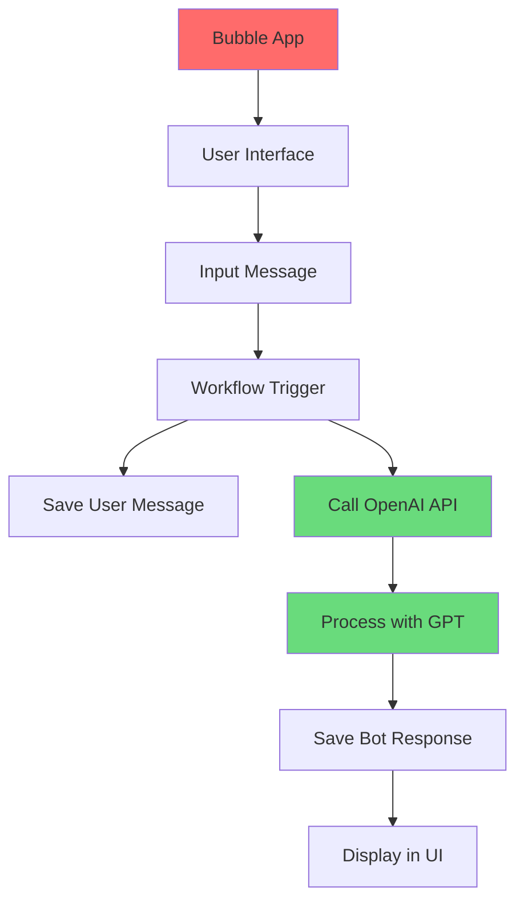
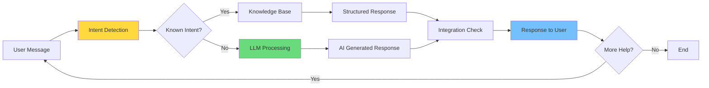
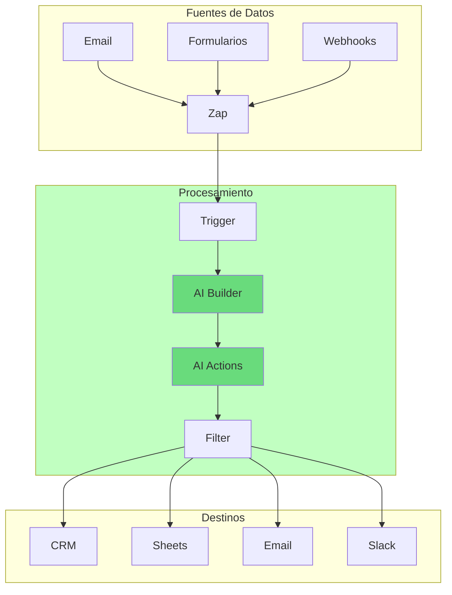
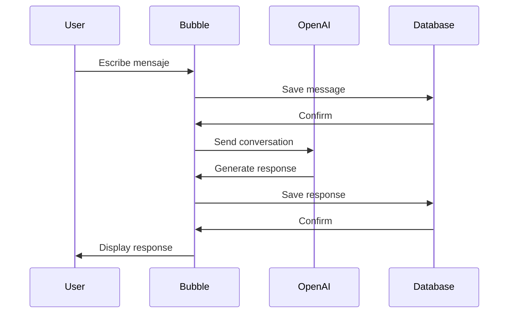
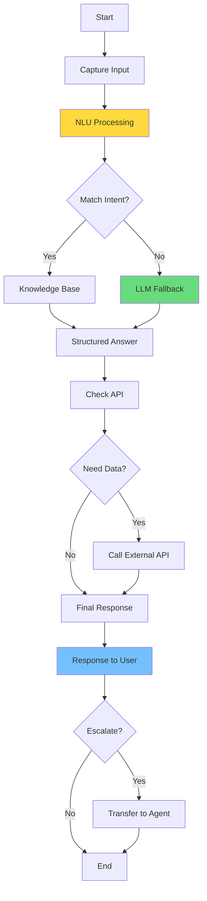

# CLASE 6: HERRAMIENTAS NO-CODE DE IA

## 📅 Duración: 4 Horas (240 minutos)

---

## 6.1 OBJETIVOS DE APRENDIZAJE

Al finalizar esta clase, los participantes serán capaces de:

1. **Utilizar las capacidades de IA integradas en Zapier** para automatizaciones inteligentes
2. **Implementar aplicaciones con Bubble.io** y sus plugins de IA
3. **Diseñar chatbots con Voiceflow** para atención al cliente
4. **Integrar Tiledesk** para una solución completa de atención
5. **Comparar y seleccionar la herramienta adecuada** según el caso de uso

---

## 6.2 CONTENIDOS DETALLADOS

### MÓDULO 1: ZAPIER CON IA (75 minutos)

#### 6.2.1 Zapier AI: Introducción

Zapier ha integrado capacidades de IA directamente en su plataforma, permitiendo:

- **Zapier AI**: Asistente para crear Zaps automáticamente
- **Zapier Tables**: Bases de datos inteligentes
- **Actions IA**: Generación de contenido dentro de Zaps
- **AI Parser**: Extracción de datos de documentos

**Acceso a AI en Zapier:**

1. Ve a zapier.com/ai
2. Explora las funcionalidades disponibles
3. Los Zaps con AI tienen icono especial

#### 6.2.2 Zapier AI Builder

El AI Builder te permite crear Zaps usando lenguaje natural:

**Cómo Usar AI Builder:**

1. Crea un nuevo Zap
2. En el primer paso, selecciona "AI Builder"
3. Describe lo que quieres automatizar
4. AI genera el flujo automáticamente

**Ejemplo: "Cuando reciba un email nuevo sobre reservas, crear una tarea en Trello"**

AI Builder automáticamente:
- Configura Gmail como trigger
- Detecta que es sobre reservas
- Crea tarea en Trello con el cliente y fecha

#### 6.2.3 Zapier Tables con IA

Zapier Tables es una base de datos integrada que puede usar IA:

**Características:**

1. **Campos Calculados con IA**
   - Extraer datos de texto
   - Clasificar registros
   - Resumir contenido

2. **Automatizaciones con IA**
   - Notificaciones basadas en cambios
   - Generación de contenido

**Caso de Uso: Tabla de Leads**

```
1. Crear Tabla "Leads"
2. Agregar columna "Email"
3. Agregar columna "Clasificación IA" - Formula con AI
4. AI analiza email y clasifica automáticamente
```

#### 6.2.4 Acciones de IA en Zaps

Puedes agregar acciones de IA dentro de cualquier Zap:

**1. Generar Texto con AI**

- Action: "AI by Zapier" → "Generate Text"
- Input: Prompt + variables
- Output: Texto generado
- Guardar en campo o enviar

**2. Extraer Datos con AI**

- Action: "AI by Zapier" → "Extract Data"
- Input: Texto fuente + estructura
- Output: Datos estructurados

**3. Clasificar con AI**

- Action: "AI by Zapier" → "Classify Text"
- Input: Texto + categorías
- Output: Categoría asignada

**Ejemplo Completo: Clasificador de Emails**

```
Trigger: Gmail - New Email
Action 1: AI by Zapier - Extract Data
  - From: {{from_email}}
  - To: {{to_email}}
  - Subject: {{subject}}
  - Body: {{body_plain}}
  - What to extract: "email, name, intent, urgency"
Action 2: Filter by Zapier
  - urgency = "high"
Action 3 (if high): Slack - Send Message
  - Channel: #urgent
  - Message: "Nuevo lead urgente: {{name}}"
```

#### 6.2.5 Caso de Estudio: Automatización de Marketing con Zapier AI

**Situación:** E-commerce que recibe leads de múltiples fuentes

**Solución:**

```
1. Trigger: Webhooks de formularios (Typeform, JotForm, web propia)
2. AI Extract: Extraer nombre, email, empresa, necesidad
3. AI Classify: Clasificar tipo de cliente (B2B/B2C)
4. AI Generate: Generar respuesta personalizada
5. Gmail: Enviar respuesta automática
6. Google Sheets: Agregar a base de datos
7. Slack: Notificar al equipo de ventas
```

**Resultados:**
- Tiempo de respuesta: de horas a minutos
- Tasa de respuesta: 100% (antes ~60%)
- Clasificación: 95% precisa

---

### MÓDULO 2: BUBBLE.IO CON IA (75 minutos)

#### 6.2.6 Introducción a Bubble.io

Bubble es una plataforma de desarrollo de aplicaciones web sin código que permite crear apps complejas. Recientemente ha integrado plugins de IA.

**Características de Bubble:**

- Editor visual de arrastrar y soltar
- Base de datos integrada
- Workflows condicionados
- Plugins para funcionalidad adicional
- Hosting y SSL incluidos

**Planes:**

| Plan | Precio | Features |
|------|--------|----------|
| Free | $0 | Desarrollo, 1 usuario |
| Starter | $32/mes | Publicación, dominio propio |
| Growth | $134/mes | Multi-usuario, más capacidad |
| Team | $274/mes | Colaboración, versionado |

#### 6.2.7 Plugins de IA en Bubble

Bubble tiene varios plugins de IA:

**Plugins Oficiales:**

1. **OpenAI GPT Plugin**
   - Integración directa con GPT-3.5 y GPT-4
   - Chat, generación de texto, embeddings
   - Configuración de API key

2. **Anthropic Claude Plugin**
   - Integración con Claude 3
   - Similar a OpenAI

3. **AI Image Generation**
   - DALL-E, Stable Diffusion
   - Generación directa en la app

**Plugins de la Comunidad:**

- Various AI services
- NLP tools
- Image processing

#### 6.2.8 Crear una App con IA en Bubble

**Caso: Chatbot de Soporte en Bubble**

**Paso 1: Configurar la Base de Datos**

1. Crea un nuevo app en Bubble
2. Ve a "Data" → "Database"
3. Crea "User" type (built-in)
4. Crea tipo "Conversation":
   - user (User)
   - messages (list of Message)
   - created_date (date)
5. Crea tipo "Message":
   - content (text)
   - sender (text: "user" or "bot")
   - timestamp (date)

**Paso 2: Crear la Interfaz**

1. Ve al Editor
2. Crea página "Chat"
3. Agrega elementos:
   - Repeating Group: para mostrar mensajes
   - Input: para escribir mensaje
   - Button: para enviar
4. Estiliza según tu marca

**Paso 3: Configurar el Plugin de OpenAI**

1. Ve a "Plugins" → "Add Plugin"
2. Busca "OpenAI GPT"
3. Instala
4. Configura API Key en Settings

**Paso 4: Crear el Workflow**

1. Botón "Send" click:
   - Create new Message
   - Add to conversation's messages
   - Call AI API with conversation history
   - Create response Message with AI output

**Paso 5: Mostrar Mensajes**

1. Repeating Group data source: conversation's messages
2. Text element: message's content
3. Conditional: different style for user vs bot



#### 6.2.9 Casos de Uso con Bubble + IA

**Caso 1: Generador de Contenido**

```
- Input: Tema + palabras clave
- AI genera: Artículo completo
- Output: Página web formateada
- Guardar en DB
```

**Caso 2: Analizador de Documentos**

```
- Upload: PDF o documento
- AI extrae: Datos clave
- Guardar en Base de Datos
- Dashboard de análisis
```

**Caso 3:Asistente de Ventas**

```
- Chat en web/app
- AI responde según knowledge base
- Guardar conversaciones
- Lead scoring automático
```

---

### MÓDULO 3: VOICEFLOW PARA CHATBOTS (45 minutos)

#### 6.3.1 Introducción a Voiceflow

Voiceflow es una plataforma especializada en crear chatbots y asistentes de voz. Es ideal para:

- Atención al cliente automatizada
- Asistentes de ventas
- IVR (Interactive Voice Response)
- Chatbots para websites

**Características:**

- Editor visual de conversaciones
- Integración con múltiples canales
- Capacidades de IA integradas
- Testing y analytics
- Versionado y colaboración

**Planes:**

| Plan | Precio | Features |
|------|--------|----------|
| Creator | $0 | 1 proyecto, básico |
| Pro | $99/mes | Proyectos ilimitados |
| Enterprise | Custom | Todo + seguridad |

#### 6.3.2 Arquitectura de Conversaciones en Voiceflow

**Conceptos Clave:**

1. **Flow**: Proyecto completo de conversación
2. **Step**: Un paso en la conversación (pregunta, respuesta, acción)
3. **Choice Step**: Opciones para el usuario
4. **LLM Step**: Integración con modelos de lenguaje
5. **Integration Step**: Conexión con APIs externas

**Estructura de un Flow:**

```
START
  → Step 1: Capture Intent
  → Step 2: Check Knowledge Base
  → Step 3: Response
  → Choice Step: Continuar?
    → Yes → Loop
    → No → END
```

#### 6.3.3 Diseñando un Chatbot con Voiceflow

**Caso: Chatbot de Soporte Técnico**

**Paso 1: Crear Nuevo Flow**

1. Ve a voiceflow.com
2. Crea nueva cuenta o entra
3. Crea nuevo proyecto "SoporteTécnico"
4. Abre el editor

**Paso 2: Configurar Captura de Intención**

1. Agrega step "Intent"
2. Entrena con ejemplos:
   - "No puedo iniciar sesión"
   - "Error al procesar pago"
   - "Cómo usar el producto"
3. Define intents:
   - login_issue
   - payment_error
   - how_to_use

**Paso 3: Configurar Respuestas**

1. Agrega step "Speak"
2. Escribe respuestas para cada intent
3. Usa variables para personalize

**Paso 4: Agregar IA (LLM Step)**

1. Agrega step "LLM"
2. Conecta con OpenAI o Anthropic
3. Configura prompt del sistema:
   ```
   Eres un asistente de soporte técnico de [empresa].
   Conocimiento del producto: [knowledge base]
   Estilo: Profesional pero amigable
   ```

**Paso 5: Integrar APIs**

1. Agrega step "Integration"
2. Conecta con CRM (HubSpot, Salesforce)
3. Busca cliente, crea ticket, etc.

**Paso 6: Publicar**

1. Configura canal (Web, WhatsApp, etc.)
2. Obtén código de embed
3. Publica en tu website



---

### MÓDULO 4: TILDESK (30 minutos)

#### 6.4.1 Introducción a Tiledesk

Tiledesk es una plataforma open-source de customer service que combina:

- Chat en vivo
- Chatbots con IA
- Helpdesk multicanal
- Integraciones con CRMs

**Características:**

- Widget de chat personalizable
- Chatbots con NLP
- Agent collision detection
- Reporting y analytics
- Código abierto (puedes自行hosting)

**Planes:**

| Plan | Precio | Features |
|------|--------|----------|
| Free | $0 | Chat básico |
| Starter | $39/mes | Chat + Bots |
| Pro | $99/mes | Todo + analytics |
| Enterprise | Custom | On-premise |

#### 6.4.2 Configurar Tiledesk con IA

**Paso 1: Configurar Cuenta**

1. Regístrate en tiledesk.com
2. Crea proyecto
3. Configura agente

**Paso 2: Crear Chatbot**

1. Ve a "Bots" → "Create Bot"
2. Selecciona tipo: FAQ, Intent-based, AI
3. Configura inteligencia

**Paso 3: Integrar con OpenAI**

1. Ve a "Settings" → "AI"
2. Conecta cuenta de OpenAI
3. Configura modelo y prompt

**Paso 4: Configurar widget**

1. Ve a "Settings" → "Widget"
2. Customiza colores y branding
3. Obtén código de embed

---

### MÓDULO 5: COMPARATIVA Y SELECCIÓN (15 minutos)

#### 6.5.1 Cuándo Usar Cada Herramienta

| Necesidad | Herramienta Recomendada | Alternativa |
|-----------|------------------------|--------------|
| Automatizaciones simples con IA | Zapier AI | Make + OpenAI |
| App completa con IA | Bubble | Glide + plugins |
| Chatbot avanzado | Voiceflow | Tiledesk |
| Helpdesk + Chatbot | Tiledesk | Zendesk + bots |
| N8n con IA avanzada | n8n AI nodes | Make + HTTP |

#### 6.5.2 Factores de Selección

**1. Complejidad del Caso de Uso**
- Simple → Zapier
- Medio → Make o n8n
- Complejo → Bubble

**2. Presupuesto**
- $0 → Zapier free, Bubble free, Tiledesk free
- Bajo → Zapier starter, Voiceflow creator
- Medio → Make, n8n, Voiceflow pro

**3. Necesidades de UI**
- Solo automatización → n8n/Make/Zapier
- Interfaz de usuario → Bubble
- Chat widget → Tiledesk, Voiceflow

---

## 6.3 DIAGRAMAS EN MERMAID

### Diagrama 1: Arquitectura de Zapier AI



### Diagrama 2: Chatbot en Bubble



### Diagrama 3: Flujo de Voiceflow



---

## 6.4 REFERENCIAS EXTERNAS

1. **Zapier AI Documentation**
   - URL: https://zapier.com/ai
   - Relevancia: AI en Zapier

2. **Bubble AI Plugins**
   - URL: https://bubble.io/plugins
   - Relevancia: Plugins de IA

3. **Voiceflow Academy**
   - URL: https://academy.voiceflow.com
   - Relevancia: Tutoriales de Voiceflow

4. **Tiledesk Documentation**
   - URL: https://docs.tiledesk.com
   - Relevancia: Documentación técnica

---

## 6.5 EJERCICICIOS PRÁCTICOS RESUELTOS

### Ejercicio 1: Zapier AI para Clasificación de Leads

**PASO 1: Trigger**
- Gmail - New Email matching "lead" or "contact"

**PASO 2: AI Extract**
- Extract: name, email, company, need, budget
- From: email body

**PASO 3: AI Classify**
- Categories: HOT, WARM, COLD
- Based on budget and need

**PASO 4: Action**
- Google Sheets - Append row
- Slack - Notify if HOT

---

### Ejercicio 2: Chatbot Simple en Voiceflow

**PASO 1: Configurar Intenciones**
- Intent: "salutation" - Hola, hi, buenas
- Intent: "hours" - Horarios, cuándo abren
- Intent: "contact" - Contacto, hablar con alguien

**PASO 2: Crear Respuestas**
- salutation: "Hola, soy [bot]. ¿En qué puedo ayudarte?"
- hours: "Estamos abiertos de 9am a 6pm"
- contact: "Te conecto con un agente"

**PASO 3: Agregar Fallback**
- LLM Step para preguntas no reconocidas
- Prompt: "Responde de manera útil y amigable"

**PASO 4: Publicar**
- Embed en website

---

### Ejercicio 3: Bubble App con Chat

**PASO 1: Database**
- Create type: "Message"
- Fields: content, sender, timestamp

**PASO 2: UI**
- RG for messages
- Input + Button for sending

**PASO 3: Workflow**
- On button click:
  - Create message (sender: user)
  - Call OpenAI with history
  - Create message (sender: bot)

**PASO 4: Preview**
- Test the chat

---

## 6.6 ACTIVIDADES DE LABORATORIO

### Laboratorio 1: Zapier AI Classifier

Crear clasificación automática de emails con Zapier AI

### Laboratorio 2: Voiceflow Chatbot

Diseñar chatbot básico con intents y respuestas

### Laboratorio 3: Bubble Chat Interface

Crear interfaz de chat funcional en Bubble

---

## 6.7 RESUMEN

- **Zapier AI** ofrece integración directa de IA en automatizaciones
- **Bubble** permite crear apps completas con plugins de IA
- **Voiceflow** es especializado en chatbots conversacionales
- **Tiledesk** combina helpdesk con chatbots

---

**FIN DE LA CLASE 6**
