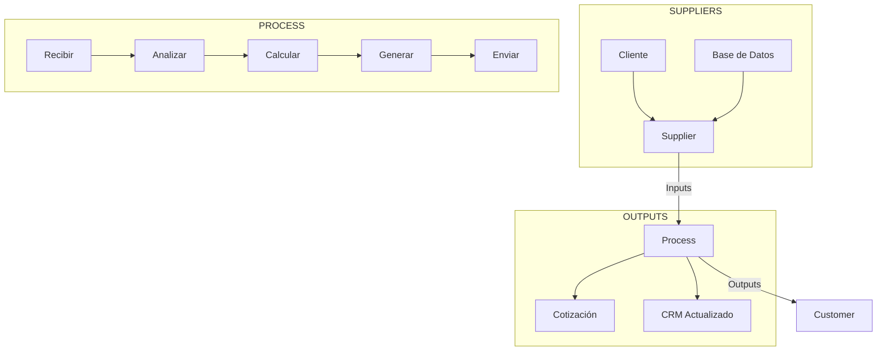
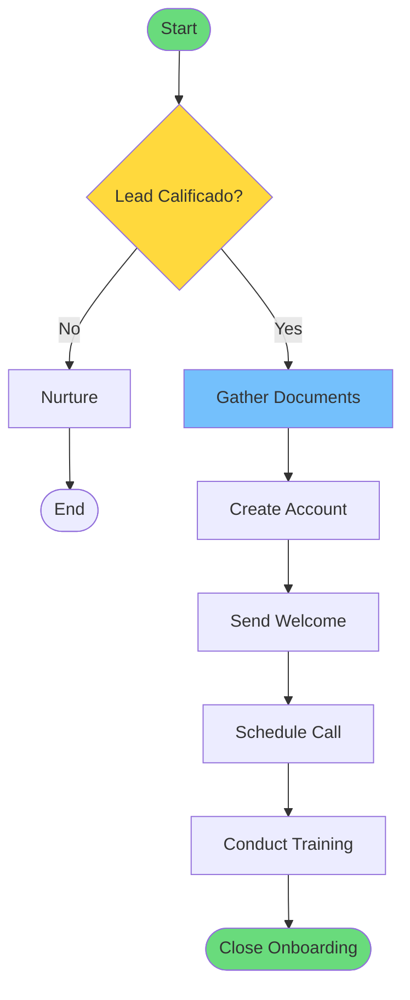
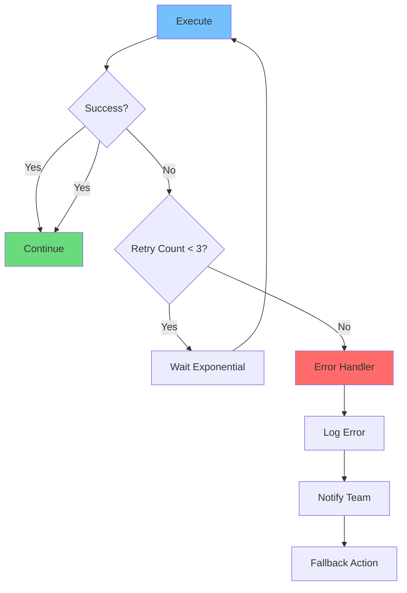
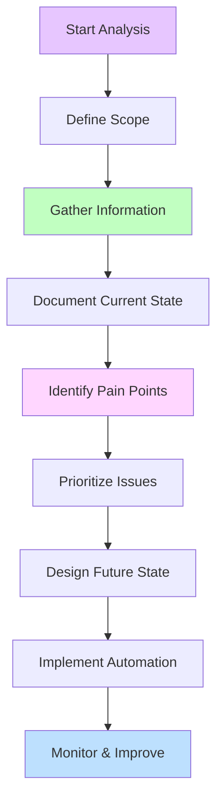
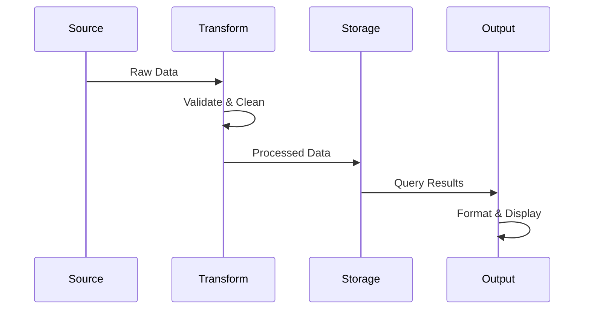
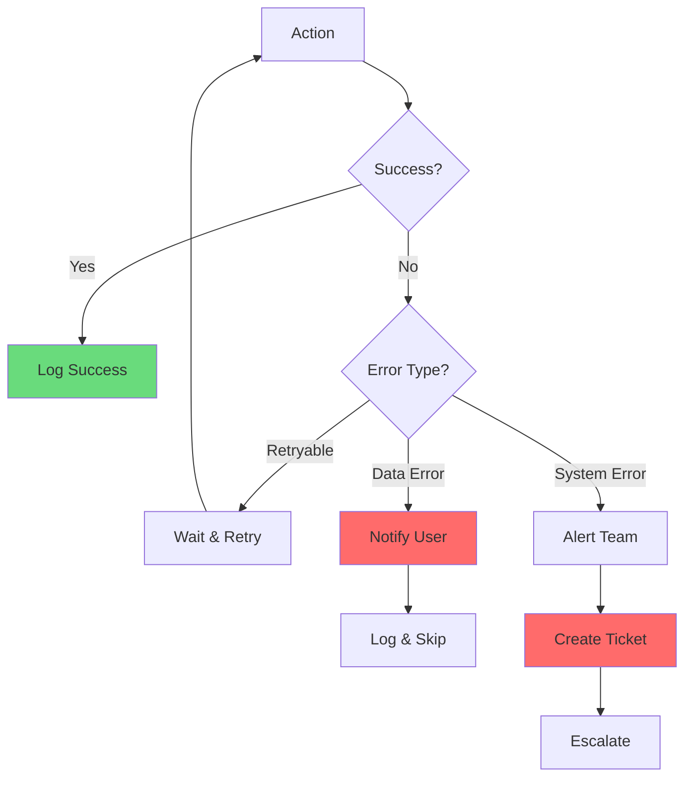

# CLASE 7: DISEÑO DE FLUJOS DE TRABAJO - PARTE 1

## 📅 Duración: 4 Horas (240 minutos)

---

## 7.1 OBJETIVOS DE APRENDIZAJE

Al finalizar esta clase, los participantes serán capaces de:

1. **Analizar procesos existentes** en sus organizaciones para identificar oportunidades
2. **Modelar workflows** utilizando herramientas de diagramación
3. **Definir claramente inputs y outputs** de cada proceso
4. **Implementar manejo de errores** robusto en los flujos
5. **Documentar procesos** para facilitar implementación y mantenimiento

---

## 7.2 CONTENIDOS DETALLADOS

### MÓDULO 1: ANÁLISIS DE PROCESOS (75 minutos)

#### 7.2.1 Fundamentos del Análisis de Procesos

Un proceso es una serie de actividades que transforman inputs en outputs. Antes de automatizar, debes entender completamente el proceso actual.

**Tipos de Procesos:**

1. **Procesos de negocio**: Generan valor para el cliente (ventas, producción)
2. **Procesos de soporte**: Apoyan los procesos de negocio (IT, RRHH)
3. **Procesos de gestión**: Dirigen y controlan (planeación, control)

**Niveles de Proceso:**

```
Nivel 1: Macros Procesos (alto nivel)
  └── Nivel 2: Procesos Principales
        └── Nivel 3: Subprocesos
              └── Nivel 4: Actividades
                    └── Nivel 5: Tareas
```

#### 7.2.2 Metodología de Mapeo

**Paso 1: Identificar el Proceso a Mapear**

Define claramente:
- Nombre del proceso
- Objetivo
- Alcance (dónde inicia y termina)
- Stakeholders involucrados
- Sistemas/herramientas utilizadas

**Paso 2: Recopilar Información**

Fuentes de información:
- Entrevistas con participantes
- Observación directa
- Documentación existente
- Datos de sistemas
- Análisis de excepciones

**Paso 3: Documentar el Estado Actual**

Técnicas de documentación:

1. **Flujogramas**: Diagramas visuales del flujo
2. **SIPOC**: Suppliers, Inputs, Process, Outputs, Customers
3. **Value Stream Mapping**: Mapeo del flujo de valor
4. **BPMN**: Business Process Model and Notation

#### 7.2.3 Framework SIPOC

SIPOC es una herramienta fundamental para entender cualquier proceso:

| Componente | Pregunta Clave | Ejemplo |
|------------|---------------|---------|
| **S** - Suppliers | ¿Quién provee los inputs? | Clientes, otros departamentos |
| **I** - Inputs | ¿Qué entra al proceso? | Formularios, datos, materiales |
| **P** - Process | ¿Qué actividades se realizan? | Las tareas del proceso |
| **O** - Outputs | ¿Qué sale del proceso? | Documentos, productos, servicios |
| **C** - Customers | ¿Quién recibe los outputs? | Clientes internos/externos |

**Ejemplo: Proceso de Cotización**

```
S - Clientes potenciales, equipo de ventas
I - Solicitud de presupuesto, información del cliente
P - 1) Recibir solicitud, 2) Verificar información, 
    3) Calcular precio, 4) Generar cotización, 5) Enviar al cliente
O - Cotización formal en PDF
C - Cliente que solicitó la cotización
```



#### 7.2.4 Identificación de Pain Points

Los pain points son los problemas del proceso actual:

**Categorías de Pain Points:**

1. **Ineficiencias**: Tareas redundantes, esperas innecesarias
2. **Errores**: Errores humanos, datos incorrectos
3. **Cuellos de botella**: Procesos lentos, limitaciones de capacidad
4. **Falta de información**: No se tiene la info necesaria a tiempo
5. **Fragmentación**: Proceso roto en múltiples sistemas

**Técnicas de Identificación:**

| Técnica | Descripción | Ventaja |
|---------|-------------|---------|
| **Entrevistas** | Hablar con participantes | Profundidad |
| **Encuestas** | Recopilar feedback masivo | Alcance |
| **Observación** | Ver el proceso en acción | Reality check |
| **Análisis de datos** | Revisar métricas | Objetividad |
| **Workshops** | Sesiones grupales | Diferentes perspectivas |

---

### MÓDULO 2: MODELADO DE WORKFLOWS (60 minutos)

#### 7.2.5 Notación BPMN

BPMN (Business Process Model and Notation) es el estándar para modelar procesos:

**Elementos Básicos:**

```
Eventos (Círculos)
├── Inicio (círculo simple)
├── Intermedio (círculo doble)
└── Fin (círculo doble gruesa)

Actividades (Rectángulos)
├── Tarea (rectángulo simple)
├── Subproceso (rectángulo con +)
└── Transacción (rectángulo con bordes)

Compuertas (Diamantes)
├── Exclusiva (X)
├── Paralela (+)
├── Inclusiva (O)
└── Compleja
```

#### 7.2.6 Herramientas de Modelado

**Herramientas Recomendadas:**

| Herramienta | Tipo | Costo | Mejor Para |
|-------------|------|-------|------------|
| **Lucidchart** | Online | Gratis-$20 | Diagramas profesionales |
| **Miro** | Online | Gratis-$19 | Collaboration |
| **draw.io** | Online/Desktop | Gratis | Simplicidad |
| **Visio** | Desktop | Paid | Enterprise |
| **Notion** | Online | Gratis-$8 | Documentation |
| **Whimsical** | Online | Gratis-$12 | Quick diagrams |

**Configuración de Notion para Procesos:**

1. Crear base de datos de procesos
2. Crear propiedades: Nombre, Área, Estado, Prioridad
3. Crear páginas con templates de documentación
4. Agregar vistas: Kanban, Tabla, Timeline

#### 7.2.7 Crear un Workflow Completo

**Caso: Proceso de Onboarding de Cliente**

**Paso 1: Definir el Flujo**

```
1. Receive lead (trigger)
2. Qualify lead
   ├── If qualified → Continue
   └── If not qualified → Nurture → End
3. Gather documents
4. Create account
5. Send welcome package
6. Schedule onboarding call
7. Conduct training
8. Close onboarding
```

**Paso 2: Diagramar en BPMN**



---

### MÓDULO 3: DEFINICIÓN DE INPUTS/OUTPUTS (45 minutos)

#### 7.3.1 La Importancia de Inputs/Outputs

Cada paso del proceso debe tener claramente definidos:
- **Inputs**: Qué necesita para ejecutarse
- **Outputs**: Qué genera como resultado
- **Transformación**: Cómo cambia el input en output

**Matriz de Entrada-Salida:**

| Paso | Input | Transformation | Output | Responsable |
|------|-------|----------------|--------|-------------|
| 1. Receive | Email/call | Receive & log | Lead registrado | Recepcionista |
| 2. Qualify | Lead data | Evaluate fit | Qualified Y/N | Sales |
| 3. Proposal | Requirements | Customize | PDF Proposal | Sales |
| 4. Send | Proposal | Email | Proposal sent | System |
| 5. Follow up | Sent date | Wait & contact | Meeting | Sales |

#### 7.3.2 Data Mapping

El data mapping define cómo los datos fluyen entre sistemas:

**Ejemplo: Sincronización CRM**

```
┌─────────────┐    ┌─────────────┐
│  Typeform  │───▶│    n8n     │───▶│  HubSpot   │
└─────────────┘    └─────────────┘
     │                   │                  │
     ▼                   ▼                  ▼
  Fields:            Mapping:           Fields:
  - name            name → firstname    - firstname
  - email           email → email       - email
  - company         company → company  - company
  - phone           phone → phone       - phone
  - message         message → note     - note
```

---

### MÓDULO 4: MANEJO DE ERRORES (45 minutos)

#### 7.4.1 Tipos de Errores en Automatizaciones

**Errores Predecibles:**
- Datos faltantes
- Formato incorrecto
- Valores fuera de rango

**Errores de Sistema:**
- Fallo de API
- Timeout
- Rate limiting

**Errores de Proceso:**
- Lógica incorrecta
- Condiciones no manejadas
- Casos extremos

#### 7.4.2 Estrategias de Manejo

**1. Validación de Entrada**

```
IF missing(email) THEN
  Skip processing
  Notify "Email requerido"
ELSE IF invalid(phone) THEN
  Format phone
ELSE
  Continue
END
```

**2. Try-Catch**

```
TRY
  Execute action
  Save success log
CATCH (error)
  Log error
  Notify team
  Create recovery ticket
END
```

**3. Retry Logic**

```
MAX_RETRIES = 3
FOR attempt = 1 TO MAX_RETRIES
  TRY
    Execute action
    BREAK
  CATCH
    IF attempt < MAX_RETRIES
      Wait (attempt * 60 seconds)
    ELSE
      Notify failure
    END
  END
END
```



#### 7.4.3 Alertas y Notificaciones

**Niveles de Alerta:**

| Nivel | Cuándo | Canal | Ejemplo |
|-------|--------|-------|---------|
| **Info** | Proceso completado | Log | "Cotización enviada" |
| **Warning** | Algo fuera de lo normal | Email | "Lead sin email" |
| **Error** | Acción falló | Slack/Email | "API timeout" |
| **Critical** | Error crítico | SMS + Call | "Pago fallido" |

---

### MÓDULO 5: DOCUMENTACIÓN (15 minutos)

#### 7.5.1 Plantilla de Documentación

Cada proceso debe documentarse con:

**1. Overview**
- Nombre del proceso
- Objetivo
- Alcance
- Stakeholders

**2. Flujo Visual**
- Diagrama BPMN
- Descripción paso a paso

**3. Detalles Técnicos**
- Inputs/Outputs
- Sistemas involucrados
- Reglas de negocio

**4. Excepciones**
- Qué puede salir mal
- Cómo manejar cada caso

**5. Métricas**
- KPIs del proceso
- SLAs

---

## 7.3 DIAGRAMAS EN MERMAID

### Diagrama 1: Framework de Análisis



### Diagrama 2: Data Flow



### Diagrama 3: Error Handling Flow



---

## 7.4 REFERENCIAS EXTERNAS

1. **BPMN Institute**
   - URL: https://www.bpmn.org/
   - Relevancia: Estándar BPMN

2. **Lucidchart Templates**
   - URL: https://www.lucidchart.com/pages/templates
   - Relevancia: Templates de procesos

3. **Miro Templates**
   - URL: https://miro.com/templates/
   - Relevancia: Diagramas colaborativos

---

## 7.5 EJERCICIOS PRÁCTICOS

### Ejercicio 1: Mapear tu Proceso de Ventas

**Objetivo:** Documentar tu proceso actual de ventas

**Pasos:**
1. Identificar todos los pasos
2. Documentar en SIPOC
3. Identificar 3 pain points principales
4. Proponer soluciones

---

### Ejercicio 2: Diseñar Workflow Automatizado

**Objetivo:** Crear diseño para automatizar un paso

**Pasos:**
1. Seleccionar proceso del ejercicio 1
2. Definir inputs y outputs
3. Diseñar flujo en BPMN
4. Identificar puntos de error

---

## 7.6 ACTIVIDADES DE LABORATORIO

### Laboratorio 1: Auditoría de Proceso

Analizar un proceso de tu empresa

### Laboratorio 2: Documentación Completa

Crear documentación detallada

### Laboratorio 3: Diseño de Automatización

Diseñar flujo automatizado

---

## 7.7 RESUMEN

- El análisis de procesos es fundamental antes de automatizar
- Usa frameworks como SIPOC para entender procesos
- Define claramente inputs/outputs de cada paso
- Implementa manejo de errores robusto
- Documenta todo para mantenimiento futuro

---

**FIN DE LA CLASE 7**
