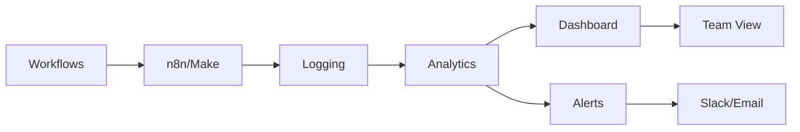
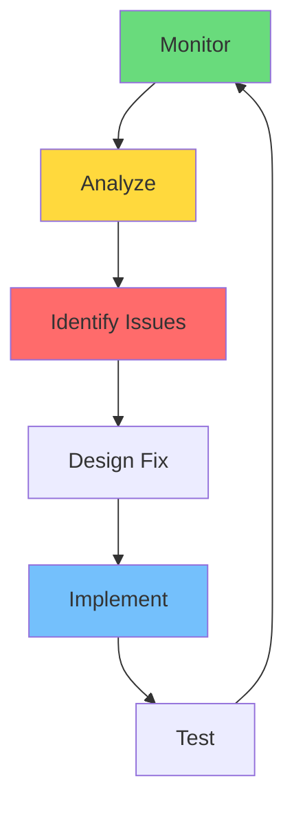
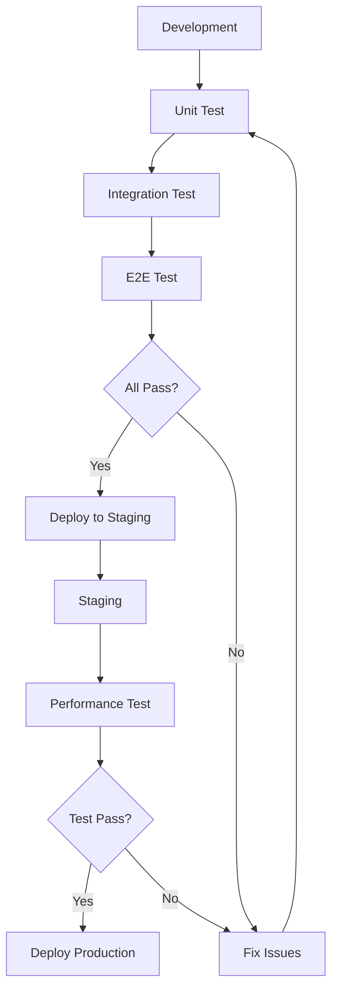
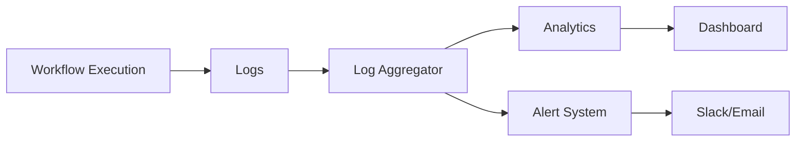
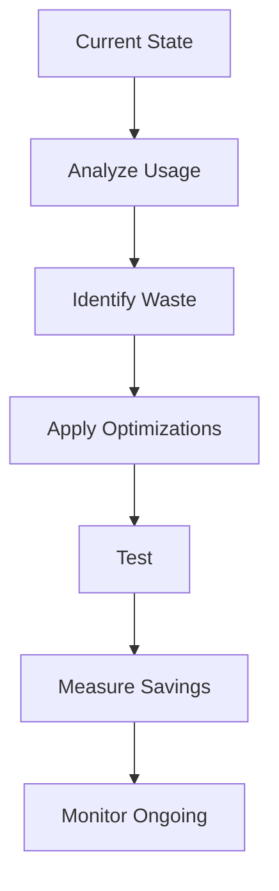

# CLASE 8: DISEÑO DE FLUJOS DE TRABAJO - PARTE 2

## 📅 Duración: 4 Horas (240 minutos)

---

## 8.1 OBJETIVOS DE APRENDIZAJE

Al finalizar esta clase, los participantes serán capaces de:

1. **Testear flujos de automatización** de manera sistemática
2. **Implementar logging y monitoreo** efectivo
3. **Optimizar costos** de automatización
4. **Crear documentación técnica** completa
5. **Mantener y evolucionar** los flujos automatizados

---

## 8.2 CONTENIDOS DETALLADOS

### MÓDULO 1: TESTING DE FLUJOS (75 minutos)

#### 8.1.1 Importancia del Testing

El testing es crítico para automatizaciones porque:
- Un error puede ejecutarse miles de veces automáticamente
- Afecta directamente a clientes y operaciones
- Difícil de detectar sin pruebas específicas

**Tipos de Testing:**

| Tipo | Descripción | Cuándo |
|------|-------------|--------|
| **Unitario** | Probar un módulo individual | Desarrollo |
| **Integración** | Probar conexiones entre módulos | Desarrollo |
| **End-to-End** | Probar flujo completo | Antes de activar |
| **Regresión** | Probar que cambios no rompen | Después de cambios |
| **Performance** | Probar bajo carga | Antes de producción |

#### 8.1.2 Metodología de Testing para No-Code

**Paso 1: Preparar Datos de Prueba**

Crea un dataset diverso:
- Casos normales
- Casos extremos
- Casos de error
- Datos faltantes

**Paso 2: Ejecutar Pruebas Unitarias**

Prueba cada módulo individualmente:
- Verifica que recibe los datos correctos
- Verifica que produce el output esperado
- Prueba con diferentes inputs

**Paso 3: Ejecutar Pruebas de Integración**

Conecta módulos y prueba:
- Los datos fluyen correctamente
- Las transformaciones funcionan
- Los filtros actúan correctamente

**Paso 4: Prueba End-to-End**

Activa el flujo completo:
- Ejecuta el trigger
- Verifica todo el proceso
- Valida outputs finales

#### 8.1.3 Casos de Prueba

**Template de Casos de Prueba:**

| ID | Módulo | Descripción | Input | Output Esperado | Estado |
|----|--------|-------------|-------|-----------------|--------|
| TC01 | Gmail | Receive email | Email normal | Email parseado | ✅ |
| TC02 | Gmail | Receive email | Email sin asunto | Default "Sin asunto" | ✅ |
| TC03 | OpenAI | Classify | Lead válido | Clasificación | ✅ |
| TC04 | OpenAI | Classify | Empty string | Error handled | ✅ |

#### 8.1.4 Herramientas de Testing

**Testing en n8n:**

1. **Executeonce**: Ejecuta un módulo sin ejecutar todo el flujo
2. **Test workflow**: Ejecuta el flujo completo con datos de prueba
3. **Error workflows**: Workflows que se ejecutan en caso de error

**Testing en Make:**

1. **Runonce**: Ejecutar solo una vez
2. **Watch log**: Ver ejecución paso a paso
3. **Scenario settings**: Configurar para testing

---

### MÓDULO 2: LOGGING Y MONITOREO (60 minutos)

#### 8.2.1 Fundamentos de Logging

El logging registra cada ejecución para debug y auditoría:

**Información a Registrar:**

- Timestamp de cada paso
- Inputs recibidos
- Outputs generados
- Errores ocurridos
- Duración de cada paso

**Niveles de Log:**

| Nivel | Uso | Ejemplo |
|-------|-----|---------|
| **DEBUG** | Desarrollo | "Ejecutando módulo X con datos Y" |
| **INFO** | Operación normal | "Email enviado exitosamente" |
| **WARNING** | Algo extraño | "Email sin asunto, usando default" |
| **ERROR** | Error | "API timeout después de 3 reintentos" |

#### 8.2.2 Configurar Logging en n8n

**Opción 1: Nodo de Log**

```javascript
// En un nodo Code
const logEntry = {
  timestamp: new Date().toISOString(),
  workflow: $env.WORKFLOW_NAME,
  step: 'OpenAI Classification',
  input: input.first().json,
  output: items,
  status: 'success'
};

console.log(JSON.stringify(logEntry));
```

**Opción 2: Guardar en Sheets**

```
1. Nodo "Set" para preparar datos de log
2. Nodo "Google Sheets" - "Append Row"
3. Spreadsheet dedicado para logs
```

**Opción 3: Enviar a sistema externo**

- Enviar logs a Datadog, Loggly, etc.
- Usar webhook para centralizar

#### 8.2.3 Monitoreo en Producción

**KPIs de Monitoreo:**

1. **Ejecuciones exitosas**: % de ejecuciones sin error
2. **Tiempo de ejecución**: Cuánto tarda el flujo
3. **Tasa de errores**: Errores por ejecución
4. **Operaciones consumidas**: Costo acumulado
5. **Latencia**: Tiempo entre trigger y completion

**Dashboards Recomendados:**

- n8n: Dashboard nativo
- Make: Analytics integrado
- Custom: conectar con Google Data Studio



---

### MÓDULO 3: OPTIMIZACIÓN DE COSTOS (45 minutos)

#### 8.3.1 Entendiendo los Costos

**Costos en Plataformas No-Code:**

| Plataforma | Qué se Cobra | Tips |
|------------|--------------|------|
| **n8n** | Cloud: operaciones, ejecutores | self-hosted = gratis |
| **Make** | Operaciones/mes | Plan gratuito generous |
| **Zapier** | Tasks/mes | Tasks pueden ser limitados |
| **APIs** | Por uso | GPT-4 es costoso |

#### 8.3.2 Estrategias de Optimización

**1. Reducir Operaciones**

- Usa filtros temprano para no procesar datos innecesarios
- Desactiva escenarios que no usas
- Combina transformaciones en un solo paso
- Usa webhooks en lugar de polling

**2. Optimizar Llamadas a IA**

- Usa modelos pequeños cuando sea posible (GPT-3.5 vs GPT-4)
- Limita longitud de texto enviado
- Cachea respuestas si los datos no cambian
- Batching: procesa varios registros en una llamada

**3. Programación Inteligente**

- Ejecuta solo cuando sea necesario
- Evita ejecutar de noche si no hay tráfico
- Agrupa operaciones por lotes

**Cálculo de Ahorro:**

```
Antes: 1000 emails/día × 30 días = 30,000 ejecuciones
Costo: 30,000 × $0.001 = $30/mes

Optimizado: 1 ejecución batch por día
Costo: 30 × $0.001 = $0.03/mes

AHORRO: 99.9%
```

---

### MÓDULO 4: DOCUMENTACIÓN TÉCNICA (45 minutos)

#### 8.4.1 Qué Documentar

**1. Flujo General**
- Diagrama visual del proceso
- Descripción del objetivo
- Trigger que inicia el flujo

**2. Configuración Técnica**
- Credenciales necesarias
- APIs utilizadas
- URLs de webhook

**3. Datos**
- Inputs esperados
- Outputs generados
- Transformaciones aplicadas

**4. Manejo de Errores**
- Qué errores se manejan
- Cómo se manejan
- Notificaciones configuradas

**5. Mantenimiento**
- Quién mantiene el flujo
- Frecuencia de revisión
- Contactos de soporte

#### 8.4.2 Template de Documentación

```markdown
# Flujo: [Nombre del Flujo]

## Descripción
Breve descripción de qué automatiza

## Trigger
- Tipo: [Webhook/Schedule/Email/etc]
- Configuración: [Detalles]

## Flujo
1. [Paso 1]
2. [Paso 2]
3. [Paso n]

## Credenciales Requeridas
- [Credencial 1]
- [Credencial 2]

## APIs Utilizadas
- [API 1]
- [API 2]

## Manejo de Errores
- [Error 1]: [Cómo se maneja]
- [Error 2]: [Cómo se maneja]

## Métricas
- Ejecuciones/día: [X]
- Tiempo promedio: [X]
- Tasa de éxito: [X%]

## Mantenimiento
- Revisado por: [Nombre]
- Última revisión: [Fecha]
- Próxima revisión: [Fecha]
```

---

### MÓDULO 5: MEJORA CONTINUA (15 minutos)

#### 8.5.1 Ciclo de Mejora



#### 8.5.2 Revisiones Periódicas

**Semanal:**
- Revisar logs de errores
- Verificar ejecuciones exitosas
- Ajustar filtros si es necesario

**Mensual:**
- Analizar métricas de uso
- Evaluar costos
- Documentar cambios

**Trimestral:**
- Revisión completa del flujo
- Benchmark contra nuevos requisitos
- Plan de mejora

---

## 8.3 DIAGRAMAS EN MERMAID

### Diagrama 1: Testing Pipeline



### Diagrama 2: Monitoring Architecture



### Diagrama 3: Cost Optimization Process



---

## 8.4 REFERENCIAS EXTERNAS

1. **n8n Documentation - Monitoring**
   - URL: https://docs.n8n.io/hosting/monitoring
   - Relevancia: Monitoreo en n8n

2. **Make Blog - Best Practices**
   - URL: https://www.make.com/blog
   - Relevancia: Optimización

---

## 8.5 EJERCICIOS PRÁCTICOS

### Ejercicio 1: Crear Plan de Testing

**Objetivo:** Diseñar plan de pruebas para un flujo

**Pasos:**
1. Seleccionar flujo existente
2. Identificar casos de prueba
3. Documentar en template
4. Ejecutar pruebas

---

### Ejercicio 2: Configurar Logging

**Objetivo:** Implementar sistema de logging

**Pasos:**
1. Diseñar estructura de log
2. Implementar en n8n/Make
3. Probar con datos reales
4. Crear dashboard básico

---

### Ejercicio 3: Optimizar Costos

**Objetivo:** Reducir costo de un flujo

**Pasos:**
1. Medir costo actual
2. Identificar oportunidades
3. Implementar cambios
4. Medir ahorro

---

## 8.6 ACTIVIDADES DE LABORATORIO

### Laboratorio 1: Testing Completo

Testear flujo existente

### Laboratorio 2: Dashboard de Monitoreo

Crear dashboard de métricas

### Laboratorio 3: Documentación Técnica

Crear docs completos

---

## 8.7 RESUMEN

- Testing sistemático es esencial antes de activar flujos
- Logging y monitoreo permiten detectar problemas
- Optimización de costos puede reducir gastos drásticamente
- Documentación facilita mantenimiento
- Mejora continua optimiza resultados

---

**FIN DE LA CLASE 8**
