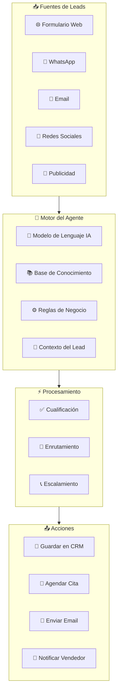
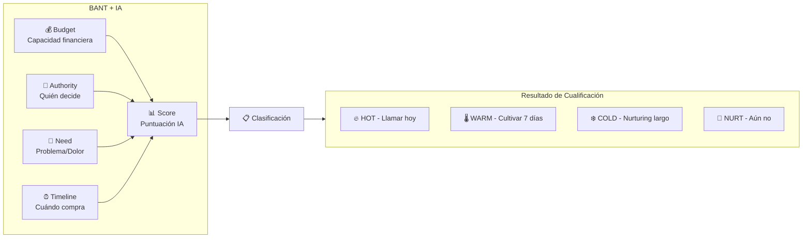
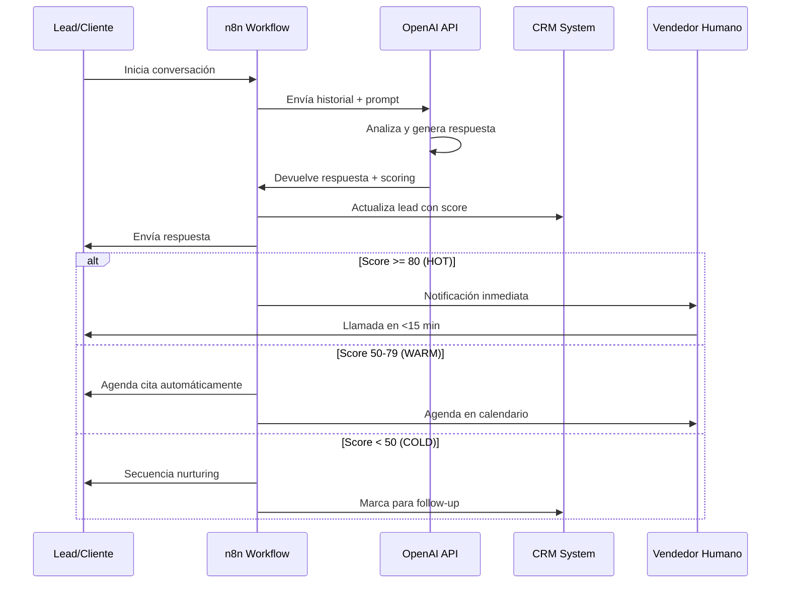
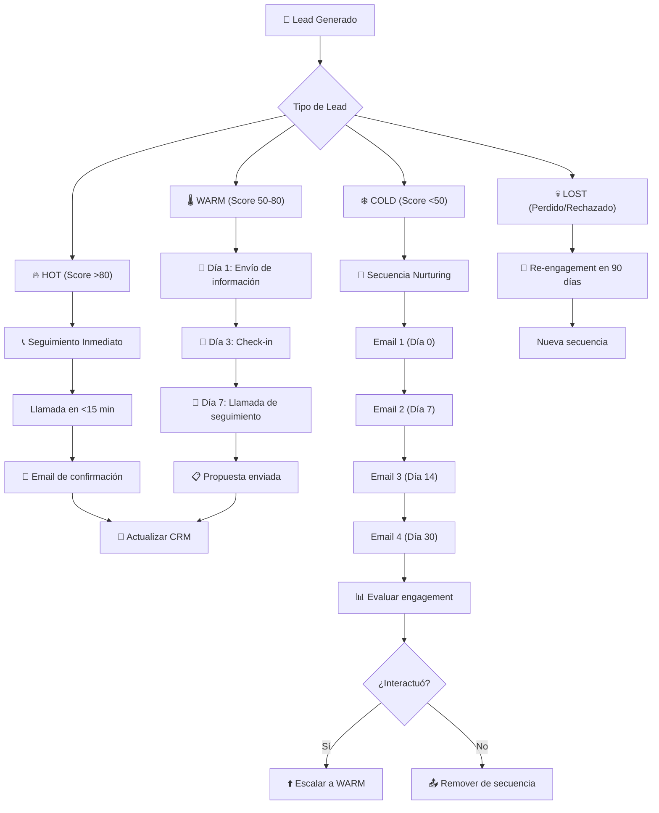
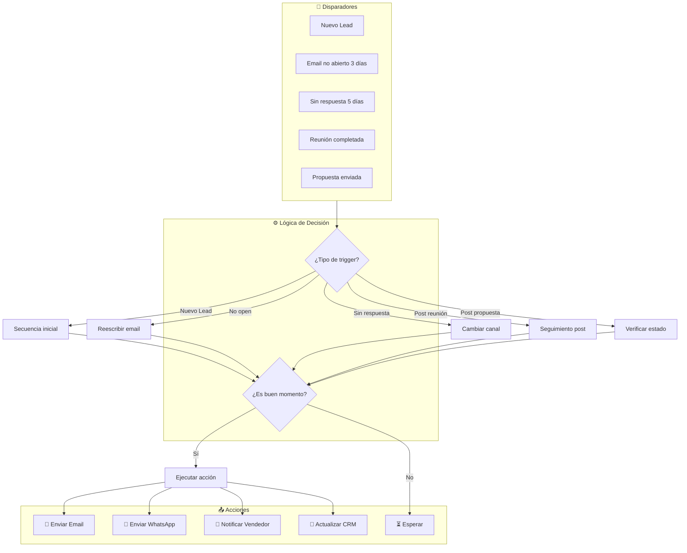
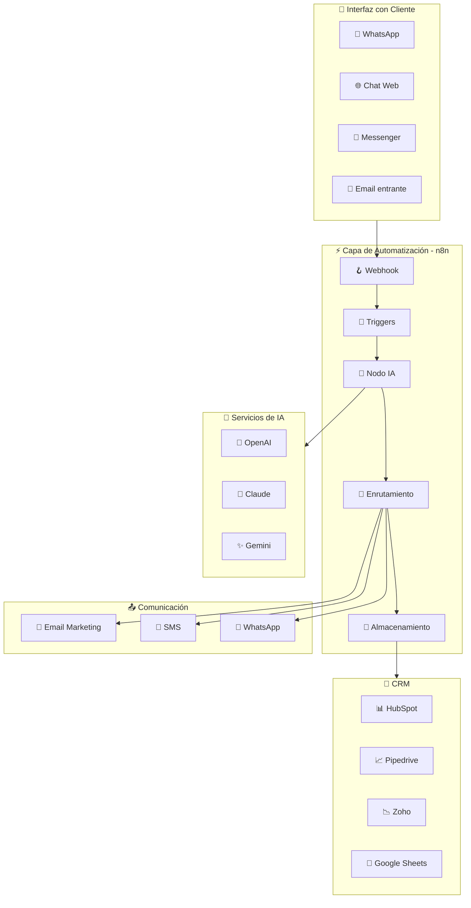
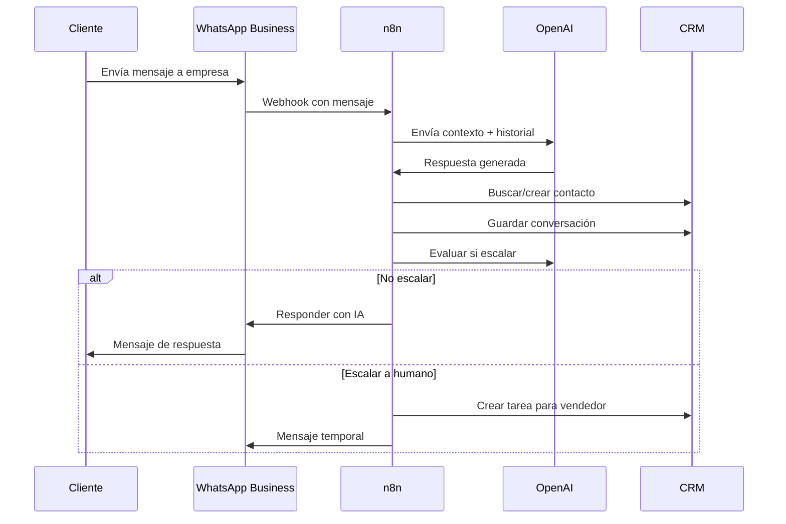

# CLASE 9: Agentes de Venta - Fundamentos

## Duración: 4 horas (240 minutos)

---

## Objetivos de Aprendizaje

Al finalizar esta clase, el participante será capaz de:

1. Comprender el concepto de vendedor autónomo basado en IA
2. Diseñar flujos de cualificación de leads utilizando herramientas no-code
3. Implementar sistemas de seguimiento automatizado para prospectos
4. Crear secuencias de comunicación personalizadas con n8n
5. Integrar agentes de venta con sistemas CRM existentes
6. Medir y optimizar el rendimiento de agentes de venta automatizados

---

## 1. ¿Qué es un Vendedor Autónomo?

### 1.1 Definición y Concepto

Un **vendedor autónomo** (o Agente de Venta IA) es un sistema automatizado que puede interactuar con prospectos, cualificarlos, proporcionar información relevante y guiarlos a través del embudo de ventas sin necesidad de intervención humana constante. A diferencia de un chatbot básico que solo responde preguntas frecuentes, un agente de venta inteligente puede:

- **Iniciar conversaciones** con prospectos en el momento óptimo
- **Fazer preguntas qualificativas** para determinar si un lead es viable
- **Proporcionar información personalizada** basada en las necesidades detectadas
- **Manejar objeciones comunes** de manera efectiva
- **Agendar citas** con representantes de ventas humanos
- **Documentar toda la interacción** en el CRM automáticamente

### 1.2 Componentes de un Agente de Venta



### 1.3 Diferencias entre Chatbot Tradicional y Agente de Venta IA

| Característica | Chatbot Tradicional | Agente de Venta IA |
|----------------|---------------------|-------------------|
| **Respuestas** | Predefinidas y fijas | Generadas dinámicamente |
| **Adaptabilidad** | Requiere programación para cambios | Aprende y se adapta |
| **Manejo de objeciones** | Limitado a respuestas predefinidas | Manejo contextual y natural |
| **Qualificación** | Formularios básicos | Conversación natural |
| **Escalamiento** | Transferencia fija | Decisión inteligente basada en contexto |
| **Costo de mantenimiento** | Alto (muchos ajustes manuales) | Bajo (auto-mejora) |

### 1.4 Casos de Éxito en PYMES

**Caso 1: Clínica Dental**
- **Problema**: Perdían el 40% de los leads por falta de seguimiento
- **Solución**: Agente de WhatsApp que cualifica y agenda
- **Resultado**: Aumento del 65% en citas agendadas, reducción de 8 horas/semana de trabajo administrativo

**Caso 2: Agencia de Seguros**
- **Problema**: Seguimiento manual lento e inconsistente
- **Solución**: Agente multicanal (WhatsApp + Email + SMS)
- **Resultado**: 3x más cotizaciones generadas, tiempo de respuesta de 2 minutos vs 4 horas

---

## 2. Qualificación de Leads con IA

### 2.1 El Framework BANT Ampliado

La qualificación tradicional BANT (Budget, Authority, Need, Timeline) evoluciona con IA para ser más sofisticada:



### 2.2 Preguntas de Cualificación Inteligentes

Un buen agente de venta debe saber qué preguntas hacer en el orden correcto:

**Nivel 1: Descubrimiento ( primeros 3 mensajes)**
- "¿Qué te trae hoy?" o "¿Cómo conociste nuestra solución?"
- "¿Cuál es el principal desafío que enfrentas actualmente?"
- "¿Qué has intentado antes para resolverlo?"

**Nivel 2: Profundización ( mensajes 4-7)**
- "¿Cuántas personas en tu empresa se verían afectadas por este problema?"
- "¿Quién sería el responsable de tomar la decisión final?"
- "¿Hay algún deadline o evento que motive la búsqueda de una solución?"

**Nivel 3: Compromiso ( mensajes 8-10)**
- "¿Qué pasaría si no resuelves este problema en los próximos 30 días?"
- "¿Tienes presupuesto asignado para este tipo de solución?"
- "¿Estarías disponible para una llamada de 15 minutos esta semana?"

### 2.3 Implementación en n8n - Workflow de Cualificación



### 2.4 Nodo de Cualificación en n8n - Configuración Detallada

```javascript
// Esta configuración se aplica en el nodo Code de n8n
// Input: messages (historial de conversación)
// Output: qualification_score, next_action, response

const conversationHistory = $input.all();
const leadData = $node["Get Lead Data"].json;

// Configuración del prompt de qualificación
const qualificationPrompt = `
Eres un experto vendedor de una PYME. Analiza la siguiente conversación 
y determina si el lead está qualificado para una venta.

CONVERSACIÓN:
${JSON.stringify(conversationHistory, null, 2)}

INFORMACIÓN PREVIA DEL LEAD:
- Nombre: ${leadData.name}
- Empresa: ${leadData.company || 'No especificada'}
- Fuente: ${leadData.source}
- Interacciones previas: ${leadData.interaction_count || 0}

Responde en JSON con esta estructura:
{
  "score": número del 0-100,
  "nivel": "HOT" | "WARM" | "COLD" | "NURT",
  "razones": ["razón 1", "razón 2"],
  "siguiente_accion": "string con la siguiente acción recomendada",
  "temas_pendientes": ["temas que aún necesitan cover"],
  "respuesta": "la respuesta que debes dar al lead"
}
`;

// Llamada a OpenAI
const response = await callOpenAI(qualificationPrompt);

return {
  json: {
    ...response,
    lead_id: leadData.id,
    timestamp: new Date().toISOString()
  }
};
```

---

## 3. Seguimiento Automatizado

### 3.1 Tipos de Seguimiento Automatizado



### 3.2 Reglas de Oro del Seguimiento

**Principio 1: La Regla de los 5 toques**
Un lead necesita un promedio de 5-7 contactos antes de convertir. Nunca te rindas después del primer "no".

**Principio 2: Multiplicidad de Canales**
No te limites a un solo canal. Combina:
- Email (formal, documentación)
- WhatsApp (conversacional, rápido)
- Llamada (personal, alta conversión)
- SMS (recordatorios, urgencia)

**Principio 3: Valor en Cada Contacto**
Cada mensaje debe aportar algo de valor, no solo "solo quería saber si..."

**Principio 4: Timing Inteligente**
- Emails: Martes-jueves, 8-10am o 2-4pm
- WhatsApp: Horario laboral, evita fuera de horas
- Llamadas: Miércoles-jueves, evitación de lunes y viernes

### 3.3 Workflow Completo de Seguimiento en n8n



---

## 4. Diseño de Secuencias de Venta

### 4.1 Estructura de una Secuencia Efectiva

Una secuencia de venta bien diseñada tiene 3 fases:

**Fase 1: Conexión (Días 1-3)**
- Objetivo: Captar atención, establecer relevancia
- Tono: Profesional pero cercano
- CTA: Qualified engagement

**Fase 2: Educación (Días 4-14)**
- Objetivo: Demostrar expertise, construir confianza
- Tono: Educativo, orientador
- CTA: Descarga, webinar, consulta

**Fase 3: Conversión (Días 15-30)**
- Objetivo: Generar urgencia, facilitar decisión
- Tono: Consultivo pero orientado a acción
- CTA: Llamada, demo, propuesta

### 4.2 Secuencia para Lead Caliente

```
DÍA 0 (Hora 0):
━━━━━━━━━━━━━━━━━━━━━━━━━━━━━━━━━━━━━━━━
ASUNTO: [Lead Name], ¿hablamos 15 minutos?
CUERPO: Hola [Name], gracias por tu interés en [Company]. 
Vi que [specific action they took]. 
Tengo 15 minutos [specific day/time options] para 
discutir cómo podemos ayudarte con [specific pain point].
¿Funciona algún horario?

DÍA 0 (2 horas después si no responde):
━━━━━━━━━━━━━━━━━━━━━━━━━━━━━━━━━━━━━━━━
CANAL: WhatsApp
MENSAJE: Hola [Name], soy [Your Name] de [Company]. 
Te escribo porque vi que descargaste nuestra guía sobre 
[topic]. Me gustaría explicarte en 2 minutos cómo 
muchos de nuestros clientes han resuelto [pain point]. 
¿Te parece si hablamos mañana?

DÍA 1:
━━━━━━━━━━━━━━━━━━━━━━━━━━━━━━━━━━━━━━━━
ASUNTO: Re: ¿hablamos 15 minutos?
CUERPO: [Name], solo quería asegurarme de que viste 
mi mensaje anterior. Tengo disponibilidad mañana 
[specific time slots]. Si no te conviene, no hay presión, 
pero creo que podría ahorrarte [specific benefit].

DÍA 2:
━━━━━━━━━━━━━━━━━━━━━━━━━━━━━━━━━━━━━━━━
CANAL: Llamada de voz (si hay número)
MENSAJE: "Buenas [Name], soy [Your Name]. Te llamaba 
respecto a tu consulta sobre [topic]. Te dejo mi 
disponibilidad [times]. Un abrazo."

DÍA 3:
━━━━━━━━━━━━━━━━━━━━━━━━━━━━━━━━━━━━━━━━
ASUNTO: Siguiente paso - [Company]
CUERPO: [Name], entiendo que estás ocupado. Te envío 
nuestra mejor propuesta para [Company] adjunta. 
Si tienes preguntas, estoy aquí. ¿Qué te parece si 
hablamos brevemente la próxima semana?
```

### 4.3 Secuencia para Lead Tibio (Nurturing)

```
SEMANA 1:
━━━━━━━━━━━━━━━━━━━━━━━━━━━━━━━━━━━━━━━━
DÍA 0: Email de bienvenida + recurso descargable
DÍA 3: Email con caso de éxito relevante
DÍA 5: Invitación a contenido educativo (blog/video)

SEMANA 2:
━━━━━━━━━━━━━━━━━━━━━━━━━━━━━━━━━━━━━━━━
DÍA 8: Email con pregunta (abrir conversación)
DÍA 10: WhatsApp con contenido de valor
DÍA 12: Email con segunda prueba social

SEMANA 3:
━━━━━━━━━━━━━━━━━━━━━━━━━━━━━━━━━━━━━━━━
DÍA 15: Llamada de check-in suave
DÍA 17: Email con oferta especial por tiempo limitado
DÍA 19: WhatsApp: "¿Sigues interesado?"

SEMANA 4:
━━━━━━━━━━━━━━━━━━━━━━━━━━━━━━━━━━━━━━━━
DÍA 22: Encuesta: "¿Cambió algo?"
DÍA 24: Email de última oportunidad
DÍA 26: Remover de secuencia o mover a re-engagement
```

---

## 5. Tecnologías: n8n y CRM Integrations

### 5.1 Arquitectura de Integración



### 5.2 Configuración de n8n para Agentes de Venta

**Paso 1: Crear el Webhook**

```
Nombre: Agent-Venta-Webhook
Método: POST
Autenticación: Ninguna (o API Key si es necesario)
Path: /agente-venta
```

**Paso 2: Configurar el Nodo IA**

```
Modelo: gpt-4-turbo
Temperatura: 0.7
Max tokens: 500
System Prompt:
---
Eres [Nombre del Agente], vendedor expert de [Empresa].
Tu objetivo es qualificar leads y agendar citas.
Tienes acceso a la siguiente información:
- Productos: [lista]
- Precios: [rango]
- Proceso de venta: [pasos]

Reglas:
1. Solo agenda si el lead tiene score > 50
2. Nunca prometas descuentos sin autorización
3. Siempre guarda la conversación en CRM
4. Si hay objeciones difíciles, escala a humano

Formato de respuesta: JSON
---
```

**Paso 3: Nodo de Cualificación**

```javascript
// Nodo Code para calcular score
const messages = $input.first().json.messages;
const leadEmail = $input.first().json.email || 'unknown';

let score = 0;
let reasons = [];

// Analizar keywords en mensajes
const keywords = {
  comprar: 20,
  presupuesto: 15,
  urgente: 15,
  pronto: 10,
  necesito: 10,
  quiero: 10,
  cuándo: 5,
  precio: 5,
  información: 3
};

// Analizar engagement
const lastMessage = messages[messages.length - 1]?.content?.toLowerCase() || '';
const positiveSignals = ['gracias', 'perfecto', 'sí', 'claro', 'interesado', 'me gustaría'];
const negativeSignals = ['no gracias', 'no me interesa', 'más tarde', 'contactar después'];

positiveSignals.forEach(signal => {
  if (lastMessage.includes(signal)) score += 10;
});

negativeSignals.forEach(signal => {
  if (lastMessage.includes(signal)) score -= 20;
});

// Keywords check
Object.entries(keywords).forEach(([keyword, points]) => {
  if (lastMessage.includes(keyword)) {
    score += points;
    reasons.push(`Mencionó: ${keyword}`);
  }
});

// Interacciones previas
const interactionCount = $input.first().json.interaction_count || 0;
score += Math.min(interactionCount * 2, 10);

return {
  json: {
    email: leadEmail,
    score: Math.min(Math.max(score, 0), 100),
    reasons: reasons,
    classification: score >= 80 ? 'HOT' : score >= 50 ? 'WARM' : 'COLD',
    timestamp: new Date().toISOString()
  }
};
```

### 5.3 Nodos de Integración CRM en n8n

**HubSpot Integration:**

```
Nodo: HubSpot Trigger (Webhooks)
Eventos:
  □ contact.creation
  □ contact.propertyChange
  □ deal.stageChange

Nodo: HubSpot (Upsert Contact)
Mapeo de campos:
  - email → email
  - firstname → nombre
  - company → empresa
  - leadsource → fuente
  - lifecyclestage → etapa
  
Nodo: HubSpot (Create Deal)
  - dealname: "Lead - {email}"
  - pipeline: "Ventas"
  - dealstage: "appointmentscheduled"
  - closedate: +7 días
```

**Pipedrive Integration:**

```
Nodo: Pipedrive Trigger
Eventos:
  □ deal.created
  □ deal.updated
  □ note.created

Nodo: Pipedrive (Add Activity)
  - subject: "Follow-up IA"
  - type: "call" | "email" | "meeting"
  - due_date: hoy
  - person_id: {lead_id}
```

### 5.4 Configuración de WhatsApp Business API



---

## 6. Ejercicios Prácticos Resueltos y Explicados

### Ejercicio 1: Crear un Agente de Cualificación Básico

**Enunciado:**
Crea un workflow en n8n que:
1. Reciba leads desde un formulario web
2. Envíe un mensaje inicial de WhatsApp
3. Use IA para hacer 3 preguntas de qualificación
4. Clasifique al lead como HOT/WARM/COLD
5. Guarde los resultados en Google Sheets

**Solución Paso a Paso:**

**Paso 1: Configurar Trigger de Webhook**

```
Nodo: Webhook
┌─────────────────────────────────────────┐
│ Nombre: Lead Form Trigger               │
│ HTTP Method: POST                        │
│ Path: lead-cualificacion                  │
│ Authentication: None                     │
│ Response Mode: Response                  │
│ Response Data: All Entries               │
└─────────────────────────────────────────┘
```

**Paso 2: Extraer Datos del Lead**

```
Nodo: Set - Lead Data
┌─────────────────────────────────────────┐
│ Name: {{ $json.name }}                   │
│ Email: {{ $json.email }}                 │
│ Phone: {{ $json.phone }}                 │
│ Source: {{ $json.utm_source }}           │
│ Interest: {{ $json.interest }}          │
│ Timestamp: {{ $now }}                    │
└─────────────────────────────────────────┘
```

**Paso 3: Mensaje Inicial de WhatsApp**

```
Nodo: WhatsApp (Send Message)
┌─────────────────────────────────────────┐
│ To: {{ $json.phone }}                   │
│ Message:                                 │
│ Hola {{ $json.name }}! 👋                │
│                                          │
│ Gracias por tu interés en [Empresa].    │
│ Soy [Nombre], tu asesor virtual.        │
│                                          │
│ Para poder ayudarte mejor, me gustaría  │
│ hacerte algunas preguntas rápidas.       │
│                                          │
│ ¿Tienes 2 minutos? (sí/no)               │
└─────────────────────────────────────────┘
```

**Paso 4: Nodo de Decisión (Respuesta)**

```
Nodo: IF
┌─────────────────────────────────────────┐
│ Condition 1:                            │
│ {{ $json.whatsapp_response }}          │
│ contains "sí" OR contains "SI"          │
│                                          │
│ Output 1 → Nodo: Cualificación IA       │
│ Output 2 → Nodo: Mensaje Cierre         │
└─────────────────────────────────────────┘
```

**Paso 5: Nodo de Qualificación IA**

```javascript
// Nodo Code - Preguntas de Cualificación
const questions = [
  "¿Cuál es el principal desafío que enfrentas actualmente?",
  "¿Cuántas personas en tu equipo se ven afectadas por este problema?",
  "¿Tienes algún presupuesto o rango de inversión considerado?",
  "¿En qué plazo te gustaría resolver este problema?"
];

const leadData = $input.first().json;
const questionIndex = leadData.question_index || 0;

if (questionIndex < questions.length) {
  return {
    json: {
      question: questions[questionIndex],
      question_index: questionIndex,
      lead_email: leadData.email,
      previous_answers: leadData.answers || []
    }
  };
} else {
  // Fin de qualificación - calcular score
  const answers = leadData.answers || [];
  let score = 0;
  
  // Scoring logic
  if (answers[0]?.includes('urgente') || answers[0]?.includes('crítico')) score += 25;
  if (answers[1]?.match(/\d+/)?.[0] > 5) score += 20;
  if (answers[2]?.includes('$') || answers[2]?.includes('presupuesto')) score += 25;
  if (answers[3]?.includes('mes') || answers[3]?.includes('pronto')) score += 30;
  
  return {
    json: {
      final_score: Math.min(score, 100),
      classification: score >= 70 ? 'HOT' : score >= 40 ? 'WARM' : 'COLD',
      lead_email: leadData.email
    }
  };
}
```

**Paso 6: Guardar en Google Sheets**

```
Nodo: Google Sheets - Update
┌─────────────────────────────────────────┐
│ Document ID: [Tu ID de spreadsheet]     │
│ Sheet Name: Leads                        │
│                                          │
│ Operation: Append                        │
│                                          │
│ Columns:                                │
│ - Timestamp | Name | Email | Phone |     │
│   Score | Classification | Source        │
│                                          │
│ Values:                                 │
│ - {{ $now }} | {{ $json.name }} |       │
│   {{ $json.email }} | {{ $json.phone }} │
│   | {{ $json.final_score }} |           │
│   {{ $json.classification }} |          │
│   {{ $json.source }}                    │
└─────────────────────────────────────────┘
```

### Ejercicio 2: Implementar Secuencia de Follow-up

**Enunciado:**
Crea un workflow que se active cuando un lead no abra un email en 3 días y le envíe un follow-up por WhatsApp.

**Solución:**

**Nodo 1: Schedule Trigger**

```
Nodo: Schedule Trigger
┌─────────────────────────────────────────┐
│ Trigger On: Cron                         │
│ Expression: 0 9 * * 1-5                 │
│ (9:00 AM, Lunes a Viernes)              │
└─────────────────────────────────────────┘
```

**Nodo 2: Buscar Leads Sin Actividad**

```
Nodo: Google Sheets - Read
┌─────────────────────────────────────────┐
│ Document ID: [Tu spreadsheet]            │
│ Sheet Name: Seguimientos                 │
│                                          │
│ Filter:                                  │
│ - last_email_sent está vacío O          │
│ - days_since_email > 3                  │
│ - whatsapp_sent = false                 │
└─────────────────────────────────────────┘
```

**Nodo 3: Condición**

```
Nodo: IF
┌─────────────────────────────────────────┐
│ {{ $json.days_since_email }} >= 3      │
│ AND {{ $json.whatsapp_sent }} = false   │
│                                          │
│ True → Enviar WhatsApp                   │
│ False → Fin (ya se envió)                │
└─────────────────────────────────────────┘
```

**Nodo 4: Enviar WhatsApp**

```
Nodo: WhatsApp
┌─────────────────────────────────────────┐
│ To: {{ $json.phone }}                   │
│ Message:                                 │
│ Hola {{ $json.name }}! 😊               │
│                                          │
│ Te escribo porque hace unos días te      │
│ enviamos información sobre [tema].      │
│                                          │
│ ¿Tuviste oportunidad de revisarla?      │
│ ¿Te gustaría que te cuente más?          │
│                                          │
│ ¡Estoy aquí para ayudarte!              │
└─────────────────────────────────────────┘
```

**Nodo 5: Actualizar Registro**

```
Nodo: Google Sheets - Update
┌─────────────────────────────────────────┐
│ Filter: email = {{ $json.email }}       │
│                                          │
│ Update:                                  │
│ - whatsapp_sent: true                   │
│ - whatsapp_date: {{ $now }}              │
│ - whatsapp_response: pending            │
└─────────────────────────────────────────┘
```

---

## 7. Actividades de Laboratorio

### Laboratorio 1: Configuración de Agente de Venta en n8n

**Duración estimada:** 45 minutos

**Materiales necesarios:**
- Cuenta de n8n (cloud o local)
- Cuenta de OpenAI con créditos
- WhatsApp Business (opcional, puede usar email para pruebas)
- Google Sheets o CRM

**Pasos:**

1. **Crear el Workflow Base (15 min)**
   - Configurar webhook como trigger
   - Conectar nodo de respuesta automática
   - Testear con Postman o curl

2. **Integrar OpenAI (15 min)**
   - Configurar credenciales de API
   - Crear el prompt del agente
   - Probar respuestas con diferentes inputs

3. **Añadir Lógica de Scoring (10 min)**
   - Implementar nodo de código para scoring
   - Configurar rama IF para diferentes scores
   - Probar con leads de diferentes temperaturas

4. **Conectar a Almacenamiento (5 min)**
   - Configurar nodo de Google Sheets o CRM
   - Verificar que los datos se guardan correctamente

**Entregable:** Workflow funcional que qualifique leads automáticamente.

### Laboratorio 2: Diseñar Secuencia de 7 Días

**Duración estimada:** 30 minutos

**Actividad:**
Diseñar una secuencia de follow-up de 7 días para leads que descargaron un ebook pero no se registraron.

**Pasos:**

1. Mapear todos los touchpoints de la secuencia
2. Definir contenido para cada día
3. Configurar los nodos de espera en n8n
4. Implementar lógica de opt-out

**Entregable:** Documento con la secuencia completa + workflow implementado.

---

## 8. Resumen de Puntos Clave

### Conceptos Fundamentales

1. **Agente de Venta IA**: Sistema automatizado que qualifica leads, maneja objeciones y agenda citas sin intervención humana constante.

2. **Qualificación BANT+IA**: Framework mejorado que usa scoring algorítmico basado en múltiples señales.

3. **Multiplicidad de Canales**: No depender de un solo canal; combinar email, WhatsApp, llamadas y SMS.

4. **Timing Inteligente**: El seguimiento en el momento correcto aumenta dramáticamente las conversiones.

5. **Secuencias de Venta**: Cadenas de mensajes planificados diseñados para mover leads a través del embudo.

### Herramientas y Tecnologías

- **n8n**: Plataforma de automatización principal
- **OpenAI**: Motor de IA para respuestas inteligentes
- **WhatsApp Business API**: Canal de comunicación preferido
- **Google Sheets/CRM**: Almacenamiento de datos y seguimiento
- **Webhooks**: Conexión entre sistemas

### Métricas Clave a Monitorear

- **Tasa de cualificación**: % de leads que pasan a siguiente etapa
- **Tiempo de respuesta**: Tiempo desde lead hasta primera respuesta
- **Tasa de conversión por score**: Correlación entre score y conversión real
- **Engagement por canal**: Qué canales generan más respuestas

### Próxima Clase

En la Clase 10, aprenderemos sobre **Chatbots con IA** utilizando Voiceflow y alternativas, cubriendo diseño de conversaciones, integración con ChatGPT, y manejo de escalamiento a humanos.

---

## Referencias Externas

1. **n8n Documentation - AI Nodes**
   https://docs.n8n.io/integrations/builtinclustered-nodes/

2. **OpenAI API Documentation**
   https://platform.openai.com/docs/api-reference

3. **WhatsApp Business API Documentation**
   https://developers.facebook.com/docs/whatsapp

4. **HubSpot Sales Automation**
   https://knowledge.hubspot.com/sales-tools/set-up-sales-automation

5. **The Ultimate Guide to Lead Scoring**
   https://www.hubspot.com/sales/lead-scoring

6. **BANT Qualification Method**
   https://www.salesforce.com/sales-management/qualifying-leads/

7. **Voiceflow Documentation**
   https://docs.voiceflow.com/

8. **Pipedrive Automation**
   https://www.pipedrive.com/en/automation

9. **AI Sales Agents - Best Practices**
   https://blog.hubspot.com/sales/ai-sales-tools

10. **Follow-up Email Templates**
    https://www.hubspot.com/sales/follow-up-email-templates

---

*Material preparado para el curso "IA para Líderes y Dueños de PYME (No-Code)"*
*Clase 9 de 16 - Semana 5*
