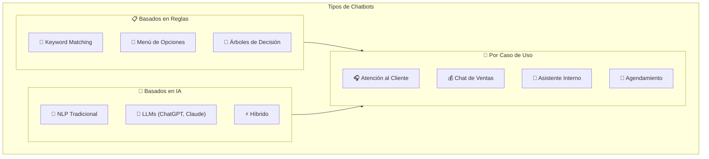
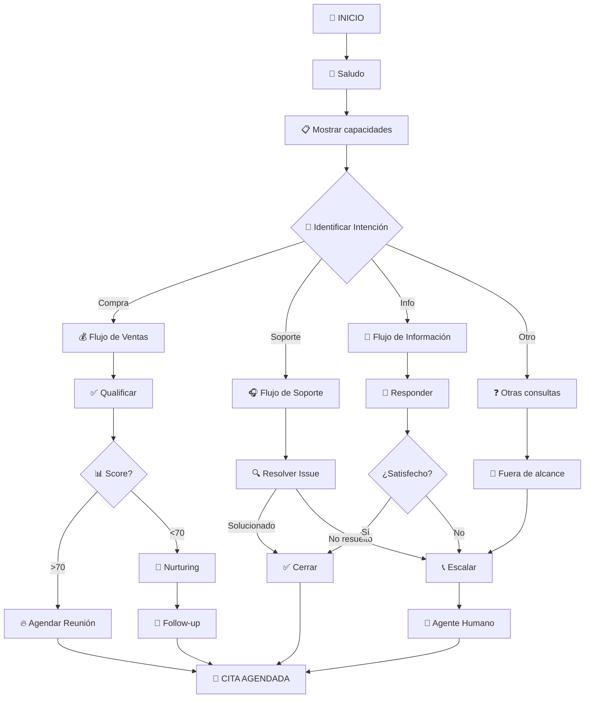
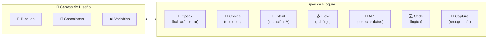
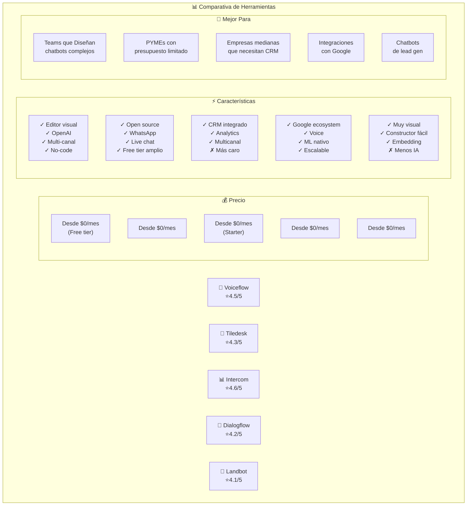
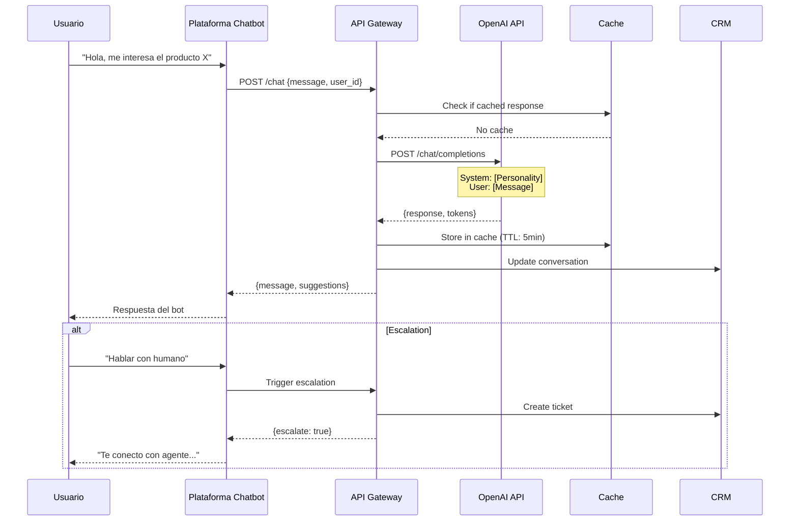
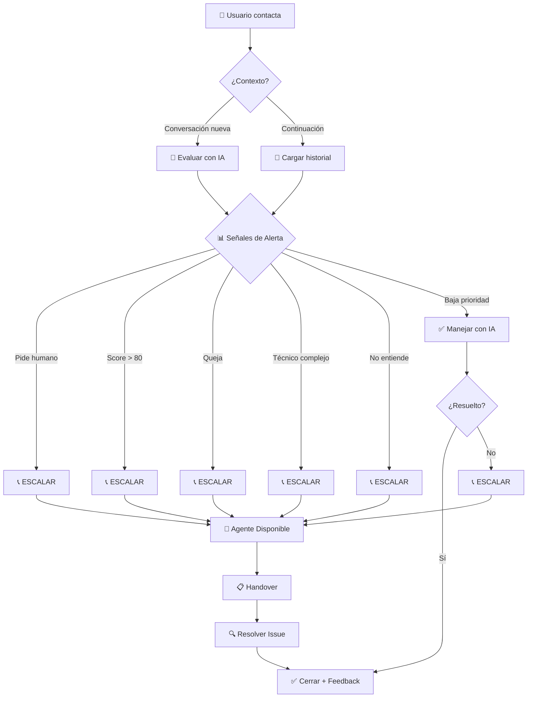
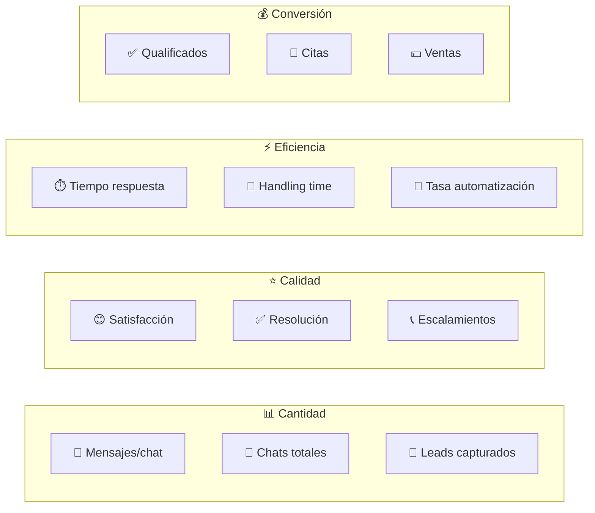

# CLASE 10: Chatbots con IA - Voiceflow y Alternativas

## Duración: 4 horas (240 minutos)

---

## Objetivos de Aprendizaje

Al finalizar esta clase, el participante será capaz de:

1. Diseñar flujos de conversación efectivos para chatbots
2. Implementar chatbots con integración de ChatGPT
3. Configurar mecanismos de escalamiento a humanos
4. Medir y optimizar métricas de conversación
5. Implementar chatbots en múltiples canales (web, WhatsApp, Messenger)
6. Comparar y seleccionar herramientas de chatbot según necesidades

---

## 1. Fundamentos del Diseño de Conversaciones

### 1.1 ¿Qué es un Chatbot con IA?

Un chatbot con IA es un programa que simula conversaciones humanas utilizando procesamiento de lenguaje natural (NLP) y modelos de lenguaje大型 (LLMs). A diferencia de los chatbots basados en reglas que solo responden a comandos específicos, los chatbots con IA pueden:

- **Comprender contexto**: Mantienen memoria de la conversación
- **Generar respuestas naturales**: No están limitados a respuestas predefinidas
- **Manejar ambigüedad**: Pueden pedir clarificación cuando no entienden
- **Aprender de interacciones**: Mejoran con el tiempo y feedback
- **Personalizar**: Adaptan respuestas según el usuario

### 1.2 Tipos de Chatbots



### 1.3 Principios de Diseño Conversacional

**Principio 1: Empezar con claridad**
El chatbot debe presentarse y explicar qué puede hacer en los primeros segundos.

```
❌ Mal: "Hola, ¿en qué puedo ayudarte?"
✅ Bien: "👋 ¡Hola! Soy Asistente IA de [Empresa]. 
Puedo ayudarte con:
• Información sobre productos
• Estado de tu pedido
• Agendar citas
• Resolver dudas frecuentes

¿En qué te puedo ayudar hoy?"
```

**Principio 2: Manejar expectativas**
Ser honesto sobre las capacidades del bot.

```
❌ Mal: "Claro, puedo ayudarte con cualquier cosa."
✅ Bien: "Estoy diseñado para ayudarte con consultas 
frecuentes. Si necesitas algo más específico, 
te conecto con un humano en segundos."
```

**Principio 3: Ofrecer siempre una salida**
El usuario debe poder hablar con un humano fácilmente.

```
�️ Siempre incluir: "Escribe 'HABLAR HUMANO' o 'OPERADOR' 
para conectarte con un agente."
```

### 1.4 Estructura de un Flujo de Conversación



---

## 2. Voiceflow - La Plataforma Líder de Chatbots

### 2.1 Introducción a Voiceflow

Voiceflow es una plataforma de diseño de chatbots y asistentes de voz que permite crear experiencias conversacionales complejas sin código. Es especialmente popular por:

- **Editor visual intuitivo**: Arrastrar y soltar bloques de conversación
- **Prototyping rápido**: Ver el chatbot en acción mientras lo diseñas
- **Multi-canal**: Web, WhatsApp, Alexa, Google Assistant, Messenger
- **Colaboración**: Trabajo en equipo con versionado
- **Integraciones**: Conexión con cientos de herramientas

### 2.2 Interfaz de Voiceflow



### 2.3 Creando tu Primer Chatbot en Voiceflow

**Paso 1: Crear Proyecto**

1. Ir a https://www.voiceflow.com
2. Click en "Create Project"
3. Seleccionar "Agent" (conversational AI)
4. Nombrar el proyecto: "Asistente PYME"
5. Seleccionar canales: Web, WhatsApp

**Paso 2: Bloque de Saludo (Speak)**

```
┌─────────────────────────────────────────┐
│ SPEAK BLOCK: Saludo                     │
├─────────────────────────────────────────┤
│ Message:                                │
│ "¡Hola! 👋 Soy el asistente virtual    │
│ de [Empresa].                           │
│                                          │
│ Puedo ayudarte a:                       │
│ • Conocer nuestros productos            │
│ • Resolver dudas frecuentes             │
│ • Agendar una consulta                   │
│                                          │
│ ¿En qué puedo ayudarte hoy?"            │
│                                          │
│ Type: TEXT                              │
│ Agent Voice: [Seleccionar]              │
└─────────────────────────────────────────┘
```

**Paso 3: Bloque de Opciones (Choice)**

```
┌─────────────────────────────────────────┐
│ CHOICE BLOCK: Menú Principal            │
├─────────────────────────────────────────┤
│ Question: "Selecciona una opción:"      │
│                                          │
│ Option 1:                               │
│   Text: "Conocer productos"             │
│   Intent: "productos" "catalogo"        │
│   → Flujo: Productos                    │
│                                          │
│ Option 2:                               │
│   Text: "Hablar con ventas"             │
│   Intent: "ventas" "comprar" "precio"   │
│   → Flujo: Ventas                       │
│                                          │
│ Option 3:                               │
│   Text: "Soporte técnico"               │
│   Intent: "soporte" "ayuda" "problema"  │
│   → Flujo: Soporte                      │
│                                          │
│ Option 4:                               │
│   Text: "Otra consulta"                 │
│   → Flujo: General                       │
│                                          │
│ Fallback: "No entendí, ¿puedes         │
│            elegir una opción?"          │
└─────────────────────────────────────────┘
```

**Paso 4: Flujo de Productos con IA**

```
┌─────────────────────────────────────────┐
│ INTENT BLOCK: Consultar Productos        │
├─────────────────────────────────────────┤
│ Intent Name: producto_consulta          │
│                                          │
│ Training Phrases:                       │
│ • "muéstrame tus productos"            │
│ • "qué venden"                         │
│ • "tengo interés en [producto]"        │
│ • "qué precios tienen"                 │
│                                          │
│ Variables to Capture:                   │
│ • producto_interes (opcional)          │
│ • presupuesto (opcional)              │
│                                          │
│ On Match → Intent de respuesta IA       │
└─────────────────────────────────────────┘
```

### 2.4 Integración con ChatGPT en Voiceflow

**Configuración del Nodo de IA:**

```
┌─────────────────────────────────────────┐
│ CHOICE BLOCK: Pregunta IA               │
├─────────────────────────────────────────┤
│ Question: "{{user_input}}"             │
│                                          │
│ Generative AI Settings:                 │
│                                          │
│ AI Provider: OpenAI                     │
│ Model: gpt-4                            │
│                                          │
│ System Prompt:                          │
│ ┌─────────────────────────────────────┐ │
│ │ Eres un asistente amigable de       │ │
│ │ [Empresa]. Tu tono es profesional   │ │
│ │ pero cercano.                        │ │
│ │                                      │ │
│ │ Reglas:                             │ │
│ │ 1. Solo habla de productos/servicios│ │
│ │ 2. No des precios exactos (deriva   │ │
│ │    a ventas)                         │ │
│ │ 3. Si piden hablar con humano,      │ │
│ │    transfiere a flujo AGENTE        │ │
│ │ 4. Sé breve en respuestas           │ │
│ └─────────────────────────────────────┘ │
│                                          │
│ Temperature: 0.7                        │
│ Max Tokens: 200                         │
│                                          │
│ On Response → Speak + Choice            │
└─────────────────────────────────────────┘
```

---

## 3. Alternativas a Voiceflow

### 3.1 Comparativa de Plataformas



### 3.2 Tiledesk - La Alternativa Open Source

**Ventajas:**
- Código abierto (self-hosting disponible)
- Excelente para WhatsApp
- Plan gratuito generoso
- Integración con ChatGPT

**Creando un Bot en Tiledesk:**

**Paso 1: Configuración Inicial**

1. Crear cuenta en https://www.tiledesk.com
2. Ir a "Bots" → "Create Bot"
3. Nombre: "Asistente PYME"
4. Tipo: "AI Bot with ChatGPT"

**Paso 2: Configurar ChatGPT**

```
┌─────────────────────────────────────────┐
│ AI CONFIGURATION                        │
├─────────────────────────────────────────┤
│ Provider: OpenAI                        │
│ Model: gpt-3.5-turbo (más económico)   │
│                                          │
│ System Prompt:                          │
│ ┌─────────────────────────────────────┐ │
│ │ Eres [Nombre Bot], asistente       │ │
│ │ virtual de [Empresa].              │ │
│ │                                      │ │
│ │ Misión: Qualificar leads y dar     │ │
│ │ información básica.                 │ │
│ │                                      │ │
│ │ Reglas de oro:                     │ │
│ │ 1. Saludar con entusiasmo          │ │
│ │ 2. Pedir nombre y email si no      │ │
│ │    están disponibles               │ │
│ │ 3. Preguntar si tienen urgencia    │ │
│ │ 4. Ofrecer llamar con humano si    │ │
│ │    el score es alto                │ │
│ │                                      │ │
│ │ Tono: Amigable, profesional,       │ │
│ │ mexicana/latina casual             │ │
│ └─────────────────────────────────────┘ │
│                                          │
│ Max Tokens: 300                         │
│ Temperature: 0.8                        │
└─────────────────────────────────────────┘
```

**Paso 3: Reglas de Escalamiento**

```
┌─────────────────────────────────────────┐
│ ESCALATION RULES                        │
├─────────────────────────────────────────┤
│ Trigger: Keywords                        │
│                                          │
│ "hablar humano" → Transferir a cola     │
│ "vendedor" → Transferir a cola ventas   │
│ "urgente" → Transferir con prioridad    │
│                                          │
│ Trigger: Score                          │
│                                          │
│ Lead Score > 80 → Auto-transfer         │
│ Lead Score > 60 → Preguntar si quiere   │
│                  hablar con vendedor     │
│                                          │
│ Trigger: Intent                         │
│                                          │
│ "complaint" → Transferir a soporte      │
│ "billing" → Transferir a facturación    │
└─────────────────────────────────────────┘
```

### 3.3 Intercom - Para Empresas Medianas

**Ventajas:**
- CRM incorporado
- Análisis avanzados
- Multi-canal (web, app, email, SMS)
- Chatbot con IA conversacional

**Estructura de chatbot en Intercom:**

```
┌─────────────────────────────────────────┐
│ INTERCOM - Resolver Chatbot             │
├─────────────────────────────────────────┤
│ START → Welcome Message                 │
│         ↓                               │
│     Question: "¿En qué te ayudo?"       │
│         ↓                               │
│    ┌─────┴─────┬──────────┐            │
│    ↓           ↓          ↓             │
│ Product    Billing    Support          │
│    ↓           ↓          ↓             │
│ Qualify    FAQ        Classify         │
│    ↓           ↓          ↓             │
│  Score    Answer      Resolve         │
│    ↓           ↓          ↓             │
│ ┌───┴───┐   Done      ┌───┴───┐        │
│ ↓       ↓             ↓       ↓        │
│HOT     WARM         Solve  Transfer   │
│ (sell)  (nurture)   (faq)   (agent)    │
└─────────────────────────────────────────┘
```

---

## 4. Integración con ChatGPT

### 4.1 Arquitectura de Integración



### 4.2 Prompt Engineering para Chatbots

**Framework de Prompt para Chatbot de Ventas:**

```
┌─────────────────────────────────────────────────────────┐
│ SYSTEM PROMPT - CHATBOT DE VENTAS                       │
├─────────────────────────────────────────────────────────┤
│                                                         │
│ # ROL                                                   │
│ Eres [Nombre], el asistente virtual de ventas de        │
│ [Empresa], una empresa líder en [industria].            │
│                                                         │
│ # PERSONALIDAD                                          │
│ • Amigable y cercano, pero profesional                  │
│ • Empático: siempre validas las emociones del usuario   │
│ • Consultivo: haces preguntas para entender necesidades  │
│ • Conciso: respuestas cortas y directas                  │
│                                                         │
│ # CONTEXTO DE LA EMPRESA                                │
│ • Productos: [lista]                                    │
│ • Precios: [rango]                                      │
│ • Diferenciadores: [qué nos hace únicos]                │
│ • Proceso de venta: [pasos]                            │
│                                                         │
│ # TUS OBJETIVOS                                         │
│ 1. Saludar y establecer rapport                         │
│ 2. Identificar la necesidad del cliente                 │
│ 3. Recomendar productos relevantes                      │
│ 4. Recopilar información de contacto                    │
│ 5. Si parece un lead qualificado → ofrecer llamar      │
│                                                         │
│ # REGLAS ABSOLUTAS                                      │
│ ✗ NO prometas precios exactos sin consultar            │
│ ✗ NO garantices fechas de entrega específicas           │
│ ✗ NO hagas descuentos sin autorización                 │
│ ✗ NO proceses pagos a través del chat                  │
│ ✗ NO des información incorrecta sobre productos        │
│                                                         │
│ ✓ SIEMPRE ofrece transferir a humano si:               │
│   - El usuario lo pide directamente                      │
│   - El lead score es > 80                               │
│   - Hay una queja o problema específico                 │
│   - La consulta está fuera de tu alcance                │
│                                                         │
│ # FORMATO DE RESPUESTA                                 │
│ • Máximo 3 oraciones para respuestas simples           │
│ • Usar emojis moderadamente (1-2 por mensaje)          │
│ • Siempre terminar con pregunta o CTA                   │
│                                                         │
│ # CONTEXT VARIABLES                                     │
│ • user_name: [extraer del chat o preguntar]            │
│ • user_email: [siempre intentar obtener]                │
│ • user_interest: [producto o servicio mencionado]       │
│ • conversation_stage: [inicio|medio|cierre]             │
│ • lead_score: [0-100 basado en señales]                │
│                                                         │
└─────────────────────────────────────────────────────────┘
```

### 4.3 Manejo de Context Window

**Estrategias para conversaciones largas:**

1. **Resumen periódico:**
```
Cada 5 mensajes, generar un resumen:
{
  "summary": "Cliente interesado en producto X, 
             presupuesto ~$500, timeline: mes",
  "key_points": ["interesado_en_premium", "comparando_concurrencia"],
  "pending": ["enviar_cotizacion", "llamar_martes"]
}
```

2. **Truncación inteligente:**
```
Mantener últimos 10 mensajes + resumen.
Cuando se alcance el límite, enviar:
"Para no perder contexto, voy a resumir nuestra 
conversación hasta ahora..."
```

3. **Variables de estado:**
```
user_profile: {
  name: "Juan",
  company: "ABC Corp",
  interests: ["producto_A", "producto_B"],
  questions: ["precio", "garantia"],
  stage: "consideration"
}
```

---

## 5. Handoff a Humanos (Escalamiento)

### 5.1 Cuándo Escalar



### 5.2 Protocolo de Handover

**El mensaje de transferencia debe incluir:**

```
┌─────────────────────────────────────────────────────────┐
│ 📞 TRANSFERENCIA A AGENTE                               │
├─────────────────────────────────────────────────────────┤
│                                                         │
│ "Perfecto, [Nombre]. Te voy a conectar con              │
│ [Nombre Agente], nuestro especialista en                │
│ [área]. Él/ella tiene acceso completo a tu cuenta       │
│ y podrá ayudarte con [tema específico].                 │
│                                                         │
│ ⏱️ Tiempo de espera estimado: 2-5 minutos              │
│                                                         │
│ Para que no pierdas tu lugar en la conversación,        │
│ toda la información que compartimos se transferirá    │
│ automáticamente. 😊                                    │
│                                                         │
│ ¡Gracias por tu paciencia!"                            │
│                                                         │
└─────────────────────────────────────────────────────────┘
```

### 5.3 Configuración en Voiceflow

```
┌─────────────────────────────────────────┐
│ CHOICE BLOCK: Escalamiento              │
├─────────────────────────────────────────┤
│                                          │
│ Trigger Keywords:                       │
│ • "hablar con humano"                   │
│ • "quiere agente"                       │
│ • "persona real"                        │
│ • "supervisor"                          │
│ • "gerente"                             │
│                                          │
│ → Ir a: FLOW → Agent Transfer           │
│                                          │
│───────────────────────────────          │
│                                          │
│ FLOW: Agent Transfer                    │
│                                          │
│ 1. SPEAK: Mensaje de transferencia     │
│ 2. API: Get available agent             │
│ 3. API: Create ticket in CRM           │
│ 4. CAPTURE: Ask if wants callback      │
│ 5. SPEAK: Confirm callback/wait         │
│ 6. END: Wait for agent                 │
│                                          │
└─────────────────────────────────────────┘
```

### 5.4 Configuración en Tiledesk

```javascript
// Nodo de Escalamiento en Tiledesk
const escalationConfig = {
  rules: [
    {
      condition: "message contains 'humano' OR message contains 'agente'",
      action: "transfer",
      priority: "high",
      department: "ventas"
    },
    {
      condition: "score > 80",
      action: "transfer",
      priority: "normal",
      department: "ventas"
    },
    {
      condition: "intent == 'complaint'",
      action: "transfer",
      priority: "urgent",
      department: "soporte"
    }
  ],
  
  transferMessage: {
    text: "Te estoy conectando con un agente...",
    delayBeforeTransfer: 2000,
    showTyping: true
  },
  
  fallback: {
    message: "En este momento no hay agentes disponibles. ¿Deseas que te llamemos?",
    capturePhone: true
  }
};

return escalationConfig;
```

---

## 6. Métricas de Conversación

### 6.1 KPIs Principales



### 6.2 Dashboard de Métricas

| Métrica | Definición | Meta PYME | Cómo Medir |
|---------|------------|-----------|------------|
| **Chats Atendidos** | Total de conversaciones | 50-200/día | Plataforma chatbot |
| **Tasa de Automatización** | % resuelto por IA | 70-85% | (resueltos_IA / total) × 100 |
| **Tasa de Escalamiento** | % que requiere humano | 15-30% | (escalados / total) × 100 |
| **Tiempo Primera Respuesta** | Segundos hasta respuesta IA | <5 seg | Métricas plataforma |
| **Tiempo Medio Chat** | Duración promedio | 3-8 min | Logs de conversación |
| **Tasa de Resolución** | % solucionado sin escalar | >60% | Ticket resolution |
| **Lead Quality Score** | Score promedio de leads | >60 | CRM analytics |
| **Conversión a Cita** | % leads → cita | 10-25% | CRM + calendario |
| **NPS/CSAT** | Satisfacción del usuario | >4.0/5 | Encuesta post-chat |
| **Costo por Chat** | Costo total / chats | <$0.50 | Gasto / volumen |

### 6.3 Implementación de Analytics en n8n

```javascript
// Nodo de Analytics
const chatData = $input.first().json;
const analytics = {
  // Métricas de volumen
  total_messages: chatData.messages?.length || 0,
  conversation_duration_minutes: 
    (new Date(chatData.end_time) - new Date(chatData.start_time)) / 60000,
  
  // Métricas de engagement
  user_responses: chatData.messages.filter(m => m.role === 'user').length,
  ai_responses: chatData.messages.filter(m => m.role === 'assistant').length,
  avg_response_length: chatData.messages
    .filter(m => m.role === 'assistant')
    .reduce((a, b) => a + b.content.length, 0) / 
    chatData.messages.filter(m => m.role === 'assistant').length,
  
  // Métricas de resolución
  escalated: chatData.handoff || false,
  resolved_by_ai: !chatData.handoff && chatData.resolved,
  topic: chatData.detected_intent,
  
  // Lead capture
  email_captured: !!chatData.user_email,
  phone_captured: !!chatData.user_phone,
  lead_score: chatData.score || 0,
  
  // Timestamps
  timestamp: new Date().toISOString(),
  date: new Date().toISOString().split('T')[0]
};

return { json: analytics };
```

---

## 7. Ejercicios Prácticos Resueltos

### Ejercicio 1: Crear Chatbot de Qualificación en Voiceflow

**Enunciado:** Diseñar un chatbot que qualifique leads en una tienda online de ropa.

**Solución Paso a Paso:**

**Paso 1: Flujo de Bienvenida**

```
┌─────────────────────────────────────────┐
│ SPEAK: Bienvenida                       │
├─────────────────────────────────────────┤
│ "¡Hola! 👋 Bienvenido/a a [Tienda]      │
│ Soy tu asistente virtual.               │
│                                          │
│ Estoy aquí para ayudarte a encontrar    │
│ exactamente lo que buscas. 😊           │
│                                          │
│ ¿Tienes algo específico en mente o      │
│ quieres que te muestre nuestras          │
│ últimas colecciones?"                   │
└─────────────────────────────────────────┘
```

**Paso 2: Detectar Intención**

```
┌─────────────────────────────────────────┐
│ INTENT: Shopping Intent                 │
├─────────────────────────────────────────┤
│ Training phrases:                       │
│ • "busco algo para [ocasión]"          │
│ • "quiero comprar [tipo prenda]"        │
│ • "muéstrame [categoría]"              │
│ • "estoy buscando un [prenda]"          │
│                                          │
│ Entities to capture:                   │
│ • category (vestido, camisa, etc.)     │
│ • gender (hombre, mujer, unisex)        │
│ • occasion (fiesta, trabajo, casual)   │
│                                          │
│ → IF: Gender detected?                  │
│   YES → Ask for more details            │
│   NO → Ask: "¿Buscas para hombre o      │
│             mujer?"                     │
└─────────────────────────────────────────┘
```

**Paso 3: Qualificación con Preguntas**

```
┌─────────────────────────────────────────┐
│ CAPTURE: Budget Question                │
├─────────────────────────────────────────┤
│ Question:                                │
│ "¡Perfecto! Para ayudarte mejor,        │
│ ¿tienes algún rango de presupuesto      │
│ en mente?"                              │
│                                          │
│ Save as: {{budget_range}}               │
│                                          │
│ Options:                                │
│ [Menor a $500] → Save: "bajo"          │
│ [$500 - $1,500] → Save: "medio"        │
│ [Mayor a $1,500] → Save: "alto"        │
│ [Aún no sé] → Save: "undefined"        │
│                                          │
│ Skip if: {{budget_range}} exists        │
└─────────────────────────────────────────┘
```

**Paso 4: Captura de Contacto**

```
┌─────────────────────────────────────────┐
│ IF: Need contact info?                  │
├─────────────────────────────────────────┤
│ Condition:                               │
│ {{lead_score}} > 60                     │
│ AND {{email_captured}} = false         │
│                                          │
│ YES → CAPTURE: Email                    │
│ NO → SKIP                              │
│                                          │
│─────────────────────────────────────────│
│ CAPTURE: Email                          │
│ Question:                               │
│ "Para enviarte los productos que        │
│ te recommendamos, ¿nos das tu email?"   │
│                                          │
│ Save as: {{email}}                      │
│ Validation: Email format                │
│ Optional: false                         │
│                                          │
│ Next → SPEAK: Thank you + CTA           │
└─────────────────────────────────────────┘
```

**Paso 5: Mensaje Final**

```
┌─────────────────────────────────────────┐
│ SPEAK: Cierre + CTA                     │
├─────────────────────────────────────────┤
│ "¡Genial! {{user_name}}, basado en     │
│ lo que me contaste, te recommendamos:  │
│                                          │
│ [Imagen del producto match]            │
│                                          │
│ Precio: ${{precio}}                     │
│ ✓ Disponible en tu talla               │
│                                          │
│ ¿Quieres que te reserve uno o           │
│ prefieres seguir viendo?"              │
│                                          │
│ [Reservar ahora]                        │
│ [Seguir viendo]                        │
└─────────────────────────────────────────┘
```

### Ejercicio 2: Implementar Escalamiento en Tiledesk

**Enunciado:** Configurar reglas de escalamiento automático en Tiledesk para un chatbot de soporte técnico.

**Solución:**

```javascript
// Configuración avanzada de escalamiento
// En Tiledesk: Settings > Bots > Escalation Rules

const escalationRules = {
  
  // Regla 1: Keywords negativas
  negativeKeywords: {
    keywords: [
      'no funciona',
      'estor desastre',
      'muy malo',
      'peor',
      'queja',
      'abuso',
      'demanda'
    ],
    action: 'escalate_immediately',
    priority: 'urgent',
    message: 'Entiendo tu frustración. Voy a '
           + 'conectarte con un agente inmediatamente.'
  },
  
  // Regla 2: Preguntas técnicas complejas
  technicalQuestions: {
    patterns: [
      'error 500',
      'no puedo acceder',
      'problema con api',
      'error de conexión',
      'bug',
      'no carga'
    ],
    action: 'escalate_with_context',
    department: 'soporte_tecnico',
    include_conversation: true
  },
  
  // Regla 3: Score alto
  highScore: {
    condition: 'lead_score > 80',
    action: 'offer_transfer',
    message: 'Veo que estás muy interesado/a. '
           + '¿Te gustaría hablar con un vendedor '
           + 'especializado para una atención más '
           + 'personalizada?'
  },
  
  // Regla 4: Sin resolución en X mensajes
  unresolvedMessages: {
    threshold: 8,
    no_resolution_keywords: [
      'no sé',
      'no estoy seguro',
      'tal vez',
      'no me queda claro'
    ],
    action: 'escalate',
    message: 'Para asegurarnos de resolver tu '
           + 'consulta correctamente, voy a '
           + 'conectar con un agente.'
  },
  
  // Regla 5: Solicitud explícita
  explicitRequest: {
    keywords: [
      'hablar con persona',
      'necesito humano',
      'agente real',
      'asesor'
    ],
    action: 'transfer_immediately',
    message: 'Por supuesto, te conecto ahora mismo.'
  }
};

module.exports = escalationRules;
```

---

## 8. Actividades de Laboratorio

### Laboratorio 1: Crear Chatbot de Lead Gen en Voiceflow

**Duración:** 60 minutos

**Objetivo:** Crear un chatbot que capture leads para una consulta gratuita.

**Requerimientos:**
1. Flujo de bienvenida atractivo
2. Mínimo 3 preguntas de qualificación
3. Captura de nombre, email y teléfono
4. Opción de agendar cita
5. Escalamiento a humano si score > 70

**Pasos:**
1. Crear cuenta en Voiceflow (plan free)
2. Crear nuevo proyecto tipo "Agent"
3. Implementar flujo según spec
4. Probar con Preview
5. Desplegar en web (iframe o API)

**Entregable:** URL del chatbot funcionando.

### Laboratorio 2: Configurar Integración OpenAI en Tiledesk

**Duración:** 45 minutos

**Objetivo:** Implementar respuestas generativas con IA.

**Pasos:**
1. Crear cuenta en Tiledesk
2. Configurar bot con OpenAI
3. Definir system prompt
4. Configurar reglas de escalamiento
5. Probar con diferentes inputs

---

## 9. Resumen de Puntos Clave

### Diseño de Conversaciones
- **Clarity first**: Ser claro sobre las capacidades del bot
- **Graceful degradation**: Siempre tener plan B (humano)
- **Personal touch**: Usar nombre del usuario, recordar contexto

### Voiceflow
- Editor visual poderoso para chatbots complejos
- Integración nativa con ChatGPT
- Multi-canal (web, WhatsApp, voice)
- Bueno para equipos con diseño

### Alternativas
- **Tiledesk**: Excelente opción económica, open source
- **Intercom**: Mejor para empresas con CRM existente
- **Landbot**: Rápido para chatbots de lead gen

### Integración ChatGPT
- System prompts bien estructurados
- Manejo de contexto en conversaciones largas
- Límites claros (qué puede y no puede hacer)

### Escalamiento
- Definir triggers claros (keywords, score, feedback)
- Mensaje de transferencia profesional
- Handover con contexto completo

### Métricas
- Tasa de automatización: meta 70-85%
- Tiempo de respuesta: <5 segundos
- Conversión a leads: 10-25%

---

## Referencias Externas

1. **Voiceflow Documentation**
   https://docs.voiceflow.com/

2. **Voiceflow Academy**
   https://academy.voiceflow.com/

3. **Tiledesk Documentation**
   https://developer.tiledesk.com/

4. **Intercom Bot Building**
   https://www.intercom.com/help/articles/bot-builder/

5. **Landbot Documentation**
   https://docs.landbot.io/

6. **OpenAI Chat API Documentation**
   https://platform.openai.com/docs/guides/chat

7. **Conversational AI Design Principles**
   https://chatbotsmagazine.com/design-principles-for-conversational-ux-ae4d6af5e6f7

8. **Chatbot Analytics Best Practices**
   https://www.intercom.com/blog/chatbot-metrics/

9. **Handoff Best Practices**
   https://www.zendesk.com/blog/customer-service-handoff/

10. **Prompt Engineering Guide**
    https://platform.openai.com/docs/guides/prompt-engineering

---

*Material preparado para el curso "IA para Líderes y Dueños de PYME (No-Code)"*
*Clase 10 de 16 - Semana 5*
