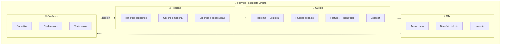
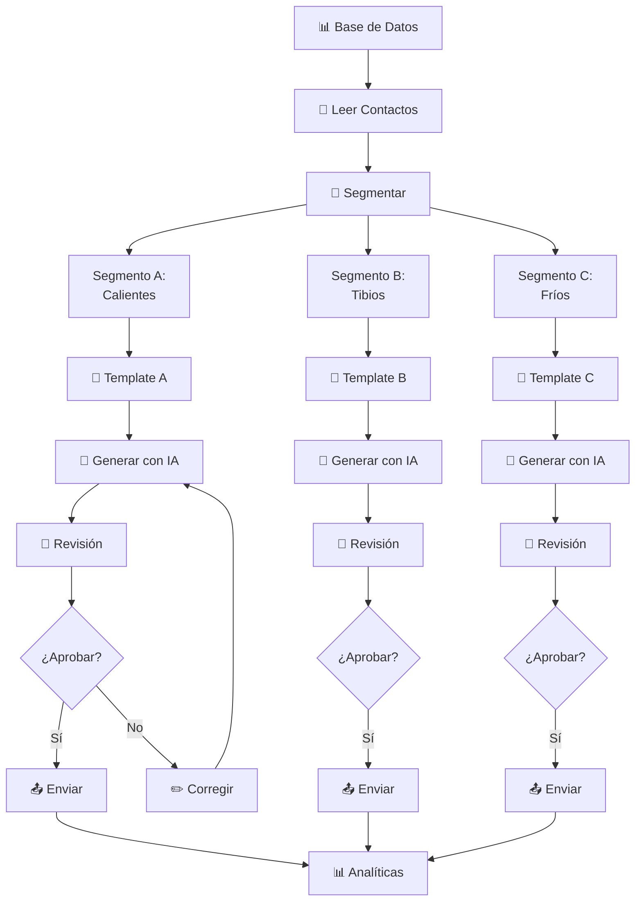
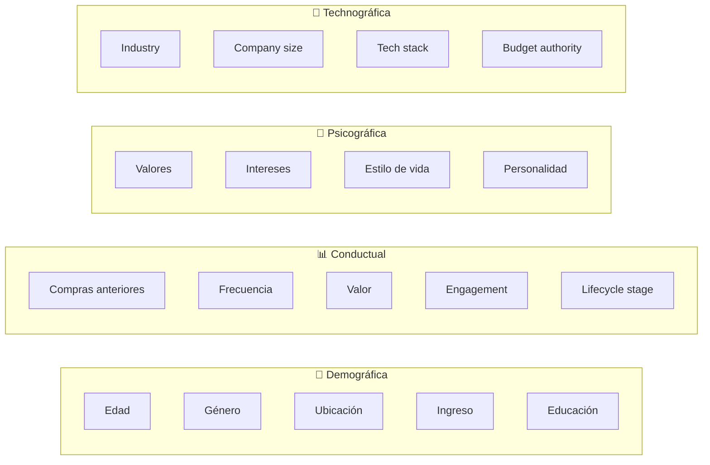
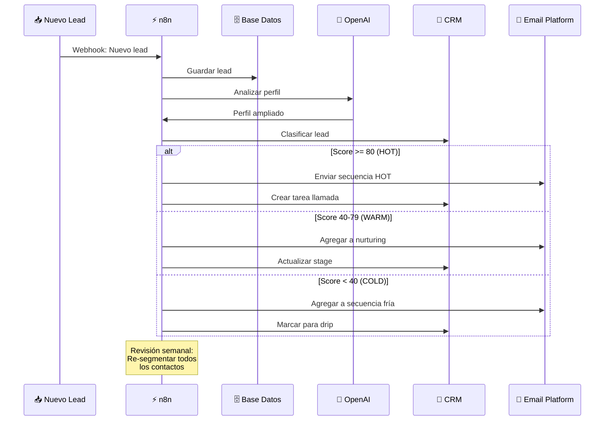
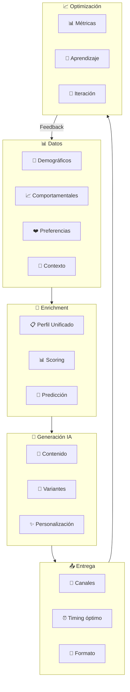
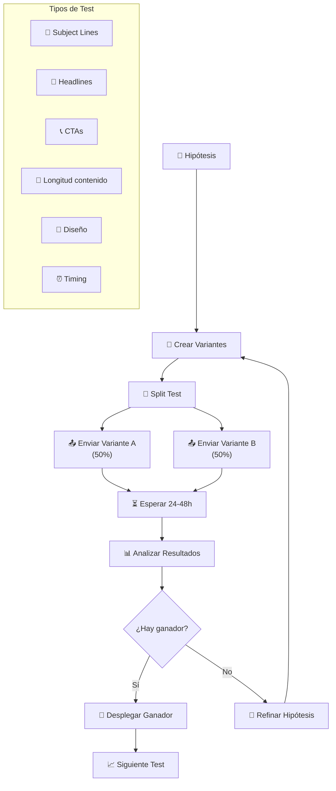
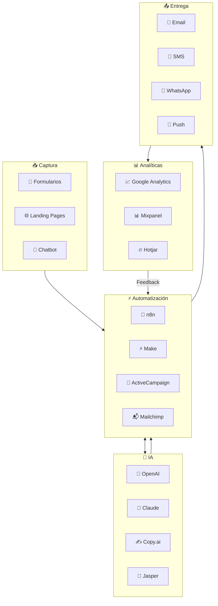
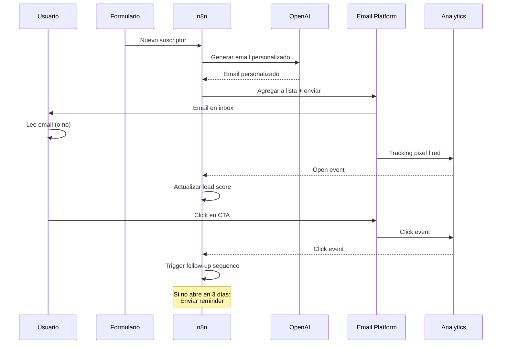

# CLASE 11: Marketing de Respuesta Directa con IA

## Duración: 4 horas (240 minutos)

---

## Objetivos de Aprendizaje

Al finalizar esta clase, el participante será capaz de:

1. Generar copy persuasivo utilizando herramientas de IA
2. Segmentar audiencias utilizando criterios demográficos y conductuales
3. Crear campañas personalizadas a escala
4. Implementar testing A/B asistido por IA
5. Optimizar embudos de email marketing
6. Integrar herramientas de email con automatizaciones en n8n

---

## 1. Fundamentos del Marketing de Respuesta Directa

### 1.1 ¿Qué es el Marketing de Respuesta Directa?

El **Marketing de Respuesta Directa (DRM)** es una estrategia que busca una respuesta inmediata del cliente potencial. A diferencia del marketing de marca tradicional, el DRM:

- **Mide todo**: Cada acción del usuario se tracked
- **Crea urgencia**: Ofertas con tiempo limitado
- **Persuade directamente**: Copy orientado a conversión
- **Personaliza**: Mensajes específicos para cada segmento
- **Itera rápidamente**: Basado en datos reales

### 1.2 Pilares del Copy para Respuesta Directa



### 1.3 Fórmula PAS (Problema, Agitación, Solución)

```
┌─────────────────────────────────────────────────────────┐
│ ESTRUCTURA PAS                                          │
├─────────────────────────────────────────────────────────┤
│                                                         │
│ PROBLEMA:                                               │
│ "¿Te suena familiar? Cada día pierdes horas             │
│ valioso(a) haciendo tareas que podrían                 │
│ automatizarse..."                                       │
│                                                         │
│ AGITACIÓN:                                              │
│ "Mientras sigas haciendo esto manualmente,            │
│  - Perderás oportunidades de negocio                    │
│  - Trabajarás noches y fines de semana                  │
│  - Nunca tendrás tiempo para crecer                     │
│                                                         │
│  El resultado: agotamiento y estancamiento."            │
│                                                         │
│ SOLUCIÓN:                                              │
│ "Lo que otros dueños de PYME ya descubrieron:          │
│  con la IA, puedes recuperar 15 horas semanales.        │
│  Sin programación. Sin inversiones grandes.              │
│  Solo necesitas el sistema correcto."                   │
│                                                         │
│ → [QUIERO RECUPERAR MI TIEMPO]                         │
│                                                         │
└─────────────────────────────────────────────────────────┘
```

### 1.4 Fórmula AIDA Adaptada

```
┌─────────────────────────────────────────────────────────┐
│ AIDA + IA                                              │
├─────────────────────────────────────────────────────────┤
│                                                         │
│ ATTENTION (Atención):                                  │
│ "🚨 Alerta para dueños de PYME..."                    │
│                                                         │
│ INTEREST (Interés):                                    │
│ "Lo que vas a ver a continuación ha                     │
│  ayudado a más de 500 negocios a                       │
│  duplicar sus ventas en 90 días..."                     │
│                                                         │
│ DESIRE (Deseo):                                        │
│ "Imagina despertar mañana con 200 leads                 │
│  cualificados en tu bandeja, listos para               │
│  comprar..."                                           │
│                                                         │
│ ACTION (Acción):                                       │
│ "Tienes 2 opciones:                                   │
│  1. Continuar como estás                              │
│  2. Reservar tu lugar AHORA                           │
│                                                         │
│  [SÍ, QUIERO DUPLICAR MIS VENTAS →]                   │
│                                                         │
└─────────────────────────────────────────────────────────┘
```

---

## 2. Generación de Copy Automatizado con IA

### 2.1 Prompts para Diferentes Tipos de Contenido

**Email de Bienvenida:**

```
┌─────────────────────────────────────────────────────────┐
│ PROMPT: Email de Bienvenida                             │
├─────────────────────────────────────────────────────────┤
│                                                         │
│ "Eres un copywriter experto en marketing de            │
│ respuesta directa. Escribe un email de bienvenida      │
│ para una empresa de [industria].                        │
│                                                         │
│ Requisitos:                                            │
│ • Longitud: 150-200 palabras                           │
│ • Tono: cercano, profesional, entusiasta              │
│ • Incluir: personalización con nombre                  │
│ • CTA: invitación a siguiente paso                     │
│ • No: jerga técnica, promesas exageradas               │
│                                                         │
│ Empresa: [detalles]                                    │
│ Audiencia: [perfil]                                    │
│ Offer: [qué obtienen]                                  │
│                                                         │
│ Formato de salida:                                     │
│ - Subject line                                         │
│ - Preview text (50 chars)                              │
│ - Cuerpo del email                                    │
│ - CTA button text                                      │
│                                                         │
└─────────────────────────────────────────────────────────┘
```

**Email de Carrito Abandonado:**

```
┌─────────────────────────────────────────────────────────┐
│ PROMPT: Recuperación de Carrito                         │
├─────────────────────────────────────────────────────────┤
│                                                         │
│ "Escribe 3 variantes de email para recuperar            │
│ un carrito abandonado en una tienda online de          │
│ [tipo de productos].                                    │
│                                                         │
│ Variante A: Urgencia por escasez                       │
│ Variante B: Recordatorio suave                         │
│ Variante C: Oferta especial por tiempo limitado        │
│                                                         │
│ Para cada variante incluye:                            │
│ - Subject line (10-40 caracteres)                     │
│ - Preview text                                         │
│ - Cuerpo (100-150 palabras)                           │
│ - CTA button                                            │
│                                                         │
│ Reglas:                                                 │
│ - No hacer miedo ni presionar demasiado                │
│ - Mostrar los productos específicos                    │
│ - Incluir link directo al carrito                      │
│ - Generar empatía sin culpa                            │
│                                                         │
└─────────────────────────────────────────────────────────┘
```

### 2.2 Workflow de Generación Masiva en n8n



### 2.3 Nodo de Generación de Emails en n8n

```javascript
// Nodo Code - Generador de Emails Masivos
const contact = $input.first().json;
const campaignType = $node["Get Campaign"].json.campaign_type;

// Templates por tipo de campaña
const templates = {
  welcome: {
    subject: "¡Bienvenido/a {{firstName}}! 🎉",
    template: `Hola {{firstName}},
    
¡Qué gusto que te unas a nuestra comunidad!

Soy {{agentName}} de {{companyName}}. Quería darte la bienvenida personalmente y contarte qué esperar de nosotros:

📧 Qué recibirás:
- Tips semanales para [beneficio principal]
- Ofertas exclusivas para suscriptores
- Contenido exclusivo que no compartimos en redes

💡 Tu primer paso:
Hace clic aquí para [primer acción] y personalizar tu experiencia.

¿Preguntas? Solo responde este email, estoy para ayudarte.

¡Nos vemos pronto!
{{agentName}}`
  },
  
  nurture: {
    subject: "{{firstName}}, te encontré algo especial 👀",
    template: `{{firstName}},

Hace poco descargaste nuestra guía sobre [tema] y quiero asegurarme de que te sea útil.

Hoy te quiero compartir un caso real:

[Nombre del cliente] tenía el mismo problema que [describiste en el signup]. Después de implementar [solución], logró [resultado específico con números].

¿Quieres ver cómo lo hicimos?

[VER EL CASO DE ÉXITO →]

O si prefieres, agenda una llamada de 15 min conmigo y te cuento sin compromiso.

¿Qué prefieres?

{{agentName}}`
  },
  
  conversion: {
    subject: "{{firstName}}, esta es tu última oportunidad 🎯",
    template: `{{firstName}},

No quiero que te pierdas esto.

Nuestro [offer] termina [fecha/mañana/este viernes] y después de eso, no estará disponible hasta [próxima fecha].

Lo que incluye:
✅ [Beneficio 1]
✅ [Beneficio 2]
✅ [Beneficio 3]

Precio regular: $XXX
Precio hoy: $XXX (¡XX% de ahorro!)

Garantía: Si no ves resultados en 30 días, te devolvemos tu dinero. Sin preguntas.

[APROVECHAR AHORA →]

O si todavía tienes dudas, responde con tu pregunta principal y te respondo personalmente.

¡El tiempo corre!

{{agentName}}`
  }
};

// Personalizar el template
const template = templates[campaignType];
const email = {
  to: contact.email,
  subject: template.subject
    .replace('{{firstName}}', contact.firstName || contact.name?.split(' ')[0])
    .replace('{{companyName}}', 'Nuestra Empresa'),
  
  html: template.template
    .replace(/\{\{firstName\}\}/g, contact.firstName || contact.name?.split(' ')[0])
    .replace(/\{\{agentName\}\}/g, 'Tu Asesor')
    .replace(/\{\{companyName\}\}/g, 'Nuestra Empresa')
    .replace(/\{\{productName\}\}/g, contact.interested_product || 'nuestro servicio')
    .replace(/\{\{painPoint\}\}/g, contact.pain_point || 'tus desafíos'),
  
  metadata: {
    contact_id: contact.id,
    segment: campaignType,
    generated_at: new Date().toISOString(),
    variant: 'A'
  }
};

return { json: email };
```

---

## 3. Segmentación de Audiencia

### 3.1 Tipos de Segmentación



### 3.2 Segmentación para PYMES

| Segmento | Criterios | Mensaje | Canal |
|----------|-----------|---------|-------|
| **Nuevos suscriptores** | <7 días | Bienvenida + educación | Email |
| **Leads ti-bios** | Interactuó pero no compró | Casos de éxito | Email + retargeting |
| **Carros abandonados** | Dejó compra incompleta | Recordatorio | Email + SMS |
| **Compradores anteriores** | Al menos 1 compra | Upsell/cross-sell | Email personalizado |
| **Inactivos** | >60 días sin actividad | Re-activación | Secuencia especial |
| **VIPs** | Alto valor + frecuencia | Ofertas exclusivas | WhatsApp + Email |
| **Calientes** | Score >80 | Llamada + oferta especial | Llamada + Email |

### 3.3 Implementación de Segmentación en n8n

```javascript
// Nodo de Segmentación Inteligente
const contacts = $input.all();
const segments = {
  new_leads: [],
  warm_leads: [],
  hot_leads: [],
  customers: [],
  inactive: []
};

contacts.forEach(contact => {
  const lastActivity = new Date(contact.last_activity_date);
  const daysSinceActivity = (Date.now() - lastActivity) / (1000 * 60 * 60 * 24);
  const totalSpent = contact.total_purchases || 0;
  const engagementScore = contact.email_opens + (contact.email_clicks * 2);
  
  // Clasificación
  if (totalSpent > 0) {
    // Customer
    if (totalSpent > 1000 && engagementScore > 10) {
      segments.vip_customers.push(contact);
    } else {
      segments.customers.push(contact);
    }
  } else {
    // Lead
    if (contact.lead_score >= 80) {
      segments.hot_leads.push(contact);
    } else if (contact.lead_score >= 40 && daysSinceActivity <= 14) {
      segments.warm_leads.push(contact);
    } else if (daysSinceActivity > 60) {
      segments.inactive.push(contact);
    } else {
      segments.new_leads.push(contact);
    }
  }
});

return [
  { json: { segment: 'new_leads', contacts: segments.new_leads } },
  { json: { segment: 'warm_leads', contacts: segments.warm_leads } },
  { json: { segment: 'hot_leads', contacts: segments.hot_leads } },
  { json: { segment: 'customers', contacts: segments.customers } },
  { json: { segment: 'inactive', contacts: segments.inactive } }
];
```

### 3.4 Workflow de Segmentación Automática



---

## 4. Campañas Personalizadas a Escala

### 4.1 Arquitectura de Campaña Hiper-Personalizada



### 4.2 Tipos de Personalización

**Nivel 1: Básico (Merge Tags)**
```
Hola {{first_name}},
```

**Nivel 2: Condicional**
```
{{#if has_purchased}}
Gracias por tu compra, {{first_name}}!
{{else}}
¿Listo para tu primera compra, {{first_name}}?
{{/if}}
```

**Nivel 3: Dinámico por Comportamiento**
```
{{#if last_product_viewed}}
Te vimos viendo: {{last_product_viewed_name}}
Precio: ${{last_product_viewed_price}}

[COMPRAR AHORA →]
{{else}}
Nuestros productos más populares:
[PRODUCTOS POPULARES]
{{/if}}
```

**Nivel 4: IA Generativa**

```javascript
// Nodo de Personalización IA en n8n
const contact = $input.first().json;
const campaign = $node["Get Campaign"].json;

// Prompt para generar email personalizado
const prompt = `
Eres un copywriter experto. Genera un email personalizado
para el siguiente contacto:

DATOS DEL CONTACTO:
- Nombre: ${contact.first_name}
- Industria: ${contact.industry || 'No especificada'}
- Empresa: ${contact.company || 'No especificada'}
- Productos de interés: ${contact.interests?.join(', ') || 'General'}
- Problema mencionado: ${contact.pain_point || 'No mencionado'}
- Última interacción: ${contact.last_interaction || 'Nueva conexión'}
- Etapa de compra: ${contact.buyer_stage || 'Investigando'}

CAMPAÑA:
- Objetivo: ${campaign.objective}
- Offer: ${campaign.offer}
- Tono: ${campaign.tone || 'Profesional pero cercano'}

REQUISITOS:
- Subject line persuasivo (máx 50 caracteres)
- Preview text (máx 100 caracteres)
- Cuerpo del email (150-250 palabras)
- Un CTA claro
- Personalización natural (no forzada)

El email debe sentirse escrito para esta persona específica,
no un template genérico.
`;

const email = await callOpenAI(prompt);

return {
  json: {
    email,
    contact_id: contact.id,
    campaign_id: campaign.id,
    personalized_at: new Date().toISOString()
  }
};
```

### 4.3 Campaña Multi-Touch Completa

```
SEMANA 1: Día 1-2
━━━━━━━━━━━━━━━━━━━━━━━━━━━━━━━━━━━━━━━━
📧 Email 1: Presentación + Value Prop
Subject: {{first_name}}, cómo {{company}} puede...
- Presentación personal
- Problema que resuelves
- Mini caso de éxito
- CTA: "Quiero saber más"

DÍA 3-4
━━━━━━━━━━━━━━━━━━━━━━━━━━━━━━━━━━━━━━━━
📱 WhatsApp: Follow-up suave
"Hola {{first_name}}! Te escribo porque 
envié un email hace unos días sobre cómo 
ayudamos a empresas como {{company}}.
¿Te llegó? ¿Tienes alguna pregunta?"

DÍA 5-7
━━━━━━━━━━━━━━━━━━━━━━━━━━━━━━━━━━━━━━━━
📧 Email 2: Educativo
Subject: El error que comete el 80% de las PYME...
- Contenido de valor
- Insight surprising
- Sin venta directa
- CTA: "Quiero evitar este error"

SEMANA 2
━━━━━━━━━━━━━━━━━━━━━━━━━━━━━━━━━━━━━━━━
📱 WhatsApp:问一下
"{{first_name}}, basado en lo que hemos 
compartido, ¿cuál es tu mayor desafío 
actualmente en [área]?"

Respuesta → Qualificar + Personalizar
No respuesta → Secuencia nurturing
```

---

## 5. A/B Testing Asistido por IA

### 5.1 Framework de Testing



### 5.2 Elementos a Testear en Emails

| Elemento | Variante A | Variante B | Métrica |
|----------|------------|------------|---------|
| **Subject Line** | Pregunta | Afirmación | Open Rate |
| **Subject Line** | Con emoji | Sin emoji | Open Rate |
| **Preview Text** | Descripción | Pregunta | Open Rate |
| **CTA** | "Comprar ahora" | "Ver productos" | CTR |
| **CTA** | Botón rojo | Botón azul | CTR |
| **Imagen** | Con cara | Sin cara | CTR |
| **Longitud** | Corto (<100 palabras) | Largo (>200 palabras) | CTR + Conversión |
| **Personalización** | Con nombre | Solo empresa | Reply Rate |

### 5.3 Generador de Variantes con IA

```javascript
// Nodo Code - Generador de Variantes A/B
const baseContent = $input.first().json;

// Prompt para generar variantes
const prompt = `
Genera 4 variantes de email A/B testing para la siguiente campaña:

CONTENIDO BASE:
"${baseContent.body}"

ELEMENTO A TESTEAR: ${baseContent.test_element}

REQUISITOS POR VARIANTE:

Variante A (Control):
- Mantener el estilo original

Variante B:
- Cambiar ${baseContent.test_element} a:
  [Generar alternativa]

Variante C:
- Cambiar ${baseContent.test_element} a:
  [Generar alternativa más agresiva]

Variante D:
- Cambiar ${baseContent.test_element} a:
  [Generar alternativa emocional]

Cada variante debe:
1. Mantener el mismo offer y CTA
2. Ser natural y no forzada
3. Ser apropiada para la audiencia:
   ${baseContent.audience_description}

FORMATO DE SALIDA (JSON):
{
  "variants": [
    {
      "id": "A",
      "subject": "...",
      "preview": "...",
      "body": "...",
      "hypothesis": "Por qué creemos que funcionará"
    },
    {...}
  ]
}
`;

const variants = await callOpenAI(prompt);

// Dividir en mitades para test
const testVariants = {
  control: variants.variants[0],
  test: variants.variants[1],
  hypothesis: "Testing " + baseContent.test_element
};

return { json: testVariants };
```

### 5.4 Análisis de Resultados con IA

```javascript
// Nodo Code - Analizador de Resultados
const results = $input.first().json;

const prompt = `
Analiza los resultados del test A/B y proporciona insights:

RESULTADOS:
Variante A (Control):
- Opens: ${results.variant_a.opens}%
- Clicks: ${results.variant_a.clicks}%
- Conversions: ${results.variant_a.conversions}%
- Unsubscribe: ${results.variant_a.unsubs}%


Variante B (Test):
- Opens: ${results.variant_b.opens}%
- Clicks: ${results.variant_b.clicks}%
- Conversions: ${results.variant_b.conversions}%
- Unsubscribe: ${results.variant_b.unsubs}%

CONTEXTO:
- Tamaño de muestra: ${results.sample_size}
- Nivel de confianza: ${results.confidence_level}%
- Elemento testeado: ${results.test_element}

Proporciona:
1. ¿Hay winner estadísticamente significativo?
2. ¿Cuál es el lift en cada métrica?
3. Insights sobre POR QUÉ funcionó mejor
4. Recomendaciones para siguientes tests
5. Copy optimizado para la variante ganadora

FORMATO: JSON con analysis object
`;

const analysis = await callOpenAI(prompt);
const winner = results.variant_b.conversions > results.variant_a.conversions 
  ? 'B' 
  : 'A';

return {
  json: {
    winner,
    analysis,
    metrics: {
      control: results.variant_a,
      test: results.variant_b,
      lift: ((results.variant_b.conversions - results.variant_a.conversions) 
             / results.variant_a.conversions * 100).toFixed(2) + '%'
    },
    recommendation: analysis.recommendation,
    next_test: analysis.next_recommendations
  }
};
```

---

## 6. Herramientas y Tecnologías

### 6.1 Stack de Marketing con IA



### 6.2 Integración n8n + Email Platform



---

## 7. Ejercicios Prácticos Resueltos

### Ejercicio 1: Crear Secuencia de Nurturing Automatizado

**Enunciado:** Diseña una secuencia de 5 emails para nurturing de leads que descargaron un ebook gratuito.

**Solución:**

**DÍA 0 (Inmediato): Email de Bienvenida + Ebook**

```
📧 ASUNTO: Tu guía está lista, {{first_name}} 📚

PREVIEW: Gracias por descargar nuestra guía...

CUERPO:
Hola {{first_name}},

¡Gracias por descargar "[Nombre del Ebook]"! 🎉

Tu guía está adjunta. Pero antes de que la leas, 
quería contarte algo importante:

La mayoría de los dueños de PYME que descargan esta 
guía cometen el mismo error: la leen, la encuentran 
útil... y luego no hacen nada con ese conocimiento.

Para que no te pase, te invité a una serie de emails 
breves donde te compartiré:

📧 Día 3: El caso de éxito más impresionante que hemos tenido
📧 Día 5: Cómo aplicar lo que leíste sin invertir más tiempo
📧 Día 7: La herramienta que usamos para obtener resultados 3x más rápido
📧 Día 10: Oferta especial para lectores comprometidos

¿Me prometes abrir los próximos emails? 
Sé que serán útiles para ti.

¡Hasta pronto!
[Tu nombre]

P.D. Si tienes alguna pregunta mientras lees, 
simplemente responde este email. Le respondo personally.
```

**DÍA 3: Caso de Éxito**

```
📧 ASUNTO: {{first_name}}, el resultado que cambió todo 💡

PREVIEW: Te cuento la historia de María...

CUERPO:
Hola {{first_name}},

Hace 6 meses, María (una emprendedora como tú) nos contactó
frustrada. Estaba trabajando 12 horas al día, su negocio 
crecía pero ella estaba agotada.

Hoy, María trabaja 6 horas, su negocio creció 40% y 
tomó vacaciones por primera vez en 3 años.

¿Quieres saber qué cambió?

[LEER LA HISTORIA COMPLETA DE MARÍA →]

El secreto no fue trabajar más duro. Fue identificar 
las 3 tareas que le generaban 80% de sus resultados y 
encontrar la manera de hacerlas en 20% del tiempo.

Te cuento cómo en el siguiente email.

[Tu nombre]
```

**DÍA 5: Aplicación Práctica**

```
📧 ASUNTO: {{first_name}}, acción concreta para hoy ⚡

PREVIEW: No necesitas leer más. Solo necesitas hacer esto...

CUERPO:
Hola {{first_name}},

Voy a ser directo.

Has leído la guía. Has visto el caso de éxito. Ahora viene 
lo importante: LA ACCIÓN.

Hoy, quiero que hagas UNA SOLA COSA:

Abre tu calendario y bloquea 1 hora mañana para [acción específica].

No reuniones. No emails. Solo [acción].

Ponlo en tu calendario ahora mismo. Te reto.

[Listooo, ya lo puse →]

Cuando lo completes, responde este email y te envío algo especial.

[Tu nombre]

P.D. No es broma. Esta es la diferencia entre los que 
triunfan y los que solo leen sobre el éxito.
```

**DÍA 7: Herramienta/Recurso**

```
📧 ASUNTO: La herramienta que mencioné 🛠️

PREVIEW: Te la mencioné en la guía, pero aquí va en detalle...

CUERPO:
Hola {{first_name}},

En la página 23 de tu guía, mencioné una herramienta que 
usamos para [beneficio específico].

Hoy quiero darte acceso directo a ella:

[HERRAMIENTA] - Acceso por tiempo limitado

Lo que hace: [descripción clara]

Por qué te la comparto: porque quiero que veas con tus 
propios ojos cómo funciona. Sin compromiso.

[PROBAR GRATIS AHORA →]

Esto es solo para personas que han leído la guía, así 
que eres parte de un grupo exclusivo.

[Tu nombre]
```

**DÍA 10: Oferta/CTA Final**

```
📧 ASUNTO: {{first_name}}, esto es solo para ti 🎁

PREVIEW: Como leíste todo, tengo algo especial...

CUERPO:
Hola {{first_name}},

Llegaste hasta aquí. Leíste los 4 emails anteriores. 
Eso significa que estás comprometido con mejorar tu negocio.

Como agradecimiento, quiero hacerte una oferta especial 
que no está disponible públicamente:

[OFERTA ESPECIAL PARA LECTORES]
- Precio regular: $XXX
- Tu precio: $XXX
- Bonus: [extra exclusivo]
- Válido hasta: [fecha]

Pero {{first_name}}, no te estoy pidiendo que compres.

Te estoy pidiendo que evalúes si [beneficio principal] 
vale la pena para ti.

Si la respuesta es sí, esta es tu oportunidad.

Si la respuesta es no, está bien. Sigue leyendo mis 
emails. Seguiré compartiendo contenido valioso.

Pero si la respuesta es SÍ...

[APROVECHAR ESTA OFERTA →]

¡Que tengas un excelente día!
[Tu nombre]

P.D. Esta oferta expire el viernes a medianoche. 
Después de eso, el precio vuelve al normal.
```

### Ejercicio 2: Implementar A/B Test en n8n

**Enunciado:** Configura un workflow que divida aleatoriamente los contactos en grupos A/B y mida resultados.

**Solución:**

```
┌─────────────────────────────────────────┐
│ NODO 1: Trigger (Schedule)              │
├─────────────────────────────────────────┤
│ Tipo: Cron                              │
│ Schedule: 0 10 * * 1                     │
│ (Cada lunes 10 AM)                      │
└─────────────────────────────────────────┘
          ↓
┌─────────────────────────────────────────┐
│ NODO 2: Read Contacts                    │
├─────────────────────────────────────────┤
│ Source: Google Sheets                    │
│ Filter: segment = 'warm_leads'          │
│ AND test_group IS EMPTY                 │
│ Limit: 1000                             │
└─────────────────────────────────────────┘
          ↓
┌─────────────────────────────────────────┐
│ NODO 3: Split In Batches                │
├─────────────────────────────────────────┤
│ Batch Size: 100                         │
└─────────────────────────────────────────┘
          ↓
┌─────────────────────────────────────────┐
│ NODO 4: Code - Assign Variant           │
├─────────────────────────────────────────┤
│ const batch = $input.all();            │
│ const variant = Math.random() >= 0.5 ?  │
│                 'A' : 'B';             │
│                                          │
│ return batch.map(item => ({            │
│   json: {                              │
│     ...item.json,                      │
│     test_variant: variant,             │
│     test_name: 'subject_line_test_001', │
│     assigned_at: new Date().toISOString()│
│   }                                    │
│ }));                                   │
└─────────────────────────────────────────┘
          ↓
┌─────────────────────────────────────────┐
│ NODO 5: IF - Route by Variant           │
├─────────────────────────────────────────┤
│ {{ $json.test_variant }} === 'A'       │
│                                          │
│ TRUE → Send Email Variant A             │
│ FALSE → Send Email Variant B            │
└─────────────────────────────────────────┘
          ↓
┌─────────────────────────────────────────┐
│ NODO 6A: Send Email - Variant A          │
├─────────────────────────────────────────┤
│ Subject: "{{first_name}}, ¿listo para   │
│           transformar tu negocio?"     │
│ Template: variant_a_html                │
└─────────────────────────────────────────┘
          ↓
┌─────────────────────────────────────────┐
│ NODO 6B: Send Email - Variant B          │
├─────────────────────────────────────────┤
│ Subject: "El secreto que {{company}}     │
│           no quiere que sepas"          │
│ Template: variant_b_html                │
└─────────────────────────────────────────┘
          ↓
┌─────────────────────────────────────────┐
│ NODO 7: Update Sheets with Variant      │
├─────────────────────────────────────────┤
│ Update assigned contacts with test info │
└─────────────────────────────────────────┘
```

---

## 8. Resumen de Puntos Clave

### Marketing de Respuesta Directa
- **Mide todo**: Cada acción, cada conversión
- **Copy persuasivo**: Fórmula PAS, AIDA, beneficios sobre features
- **Urgencia y escasez**: Elementos clave para conversión
- **Pruebas continuas**: A/B test permanente

### Generación de Copy con IA
- **Prompts estructurados**: Incluir contexto, audiencia, objetivos
- **Templates + Personalización**: Combinar automatización con toque humano
- **Revisión humana**: Siempre validar antes de enviar
- **Iteración**: Basarse en resultados reales

### Segmentación
- **Demográfica**: Edad, género, ubicación, ingreso
- **Conductual**: Compras, engagement, lifecycle
- **Dinámica**: Re-segmentar regularmente
- **Personalización por nivel**: Merge tags → Condicional → IA

### A/B Testing
- **Testear un elemento a la vez**
- **Tamaño de muestra significativo**
- **Tiempo suficiente para resultados**
- **Análisis estadístico antes de declarar ganador**

### Herramientas
- **n8n**: Automatización de campañas completas
- **OpenAI/Claude**: Generación de copy
- **Email platforms**: ActiveCampaign, Mailchimp, etc.
- **Analytics**: Métricas de opens, clicks, conversiones

---

## Referencias Externas

1. **ActiveCampaign - Marketing Automation**
   https://www.activecampaign.com/

2. **Mailchimp - Email Marketing**
   https://mailchimp.com/

3. **OpenAI API - Email Copy Generation**
   https://platform.openai.com/docs/guides/completion

4. **Copy.ai - AI Copywriting Tool**
   https://www.copy.ai/

5. **Jasper - AI Content Platform**
   https://www.jasper.ai/

6. **A/B Testing Statistics Guide**
   https://conversionxl.com/blog/statistical-significance-calculator/

7. **Email Marketing Benchmarks 2024**
   https://www.campaignmonitor.com/resources/guides/email-marketing-benchmarks/

8. **Direct Response Marketing Principles**
   https://www.ama.org/

9. **n8n Email Integration Documentation**
   https://docs.n8n.io/integrations/builtin/app-nodes/n8n-nodes-base.email/

10. **Marketing Automation Best Practices**
    https://hbr.org/2023/01/marketing-automation-done-right

---

*Material preparado para el curso "IA para Líderes y Dueños de PYME (No-Code)"*
*Clase 11 de 16 - Semana 6*
