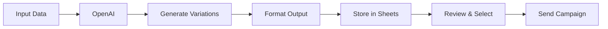
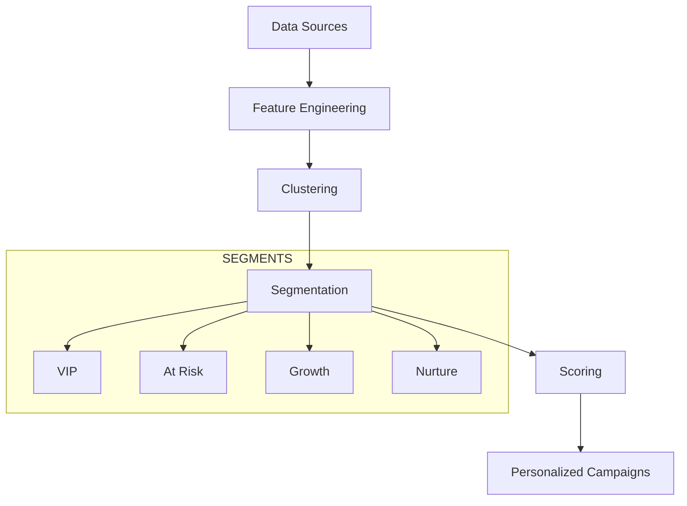
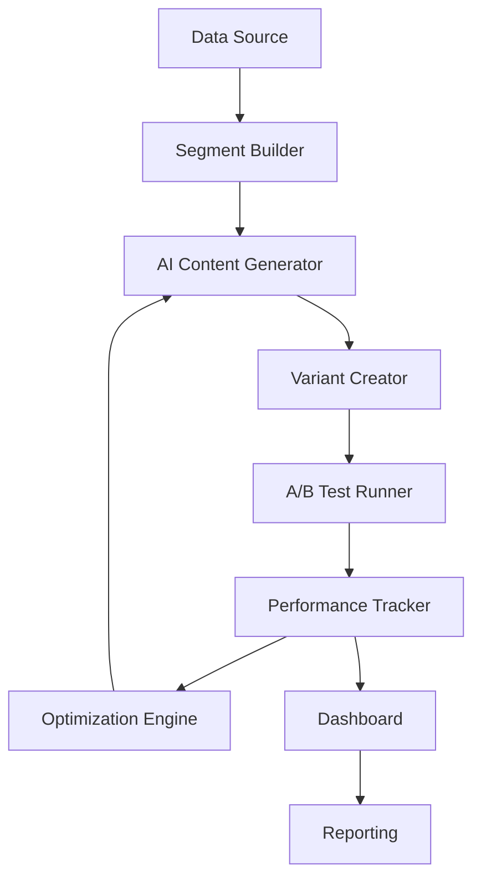
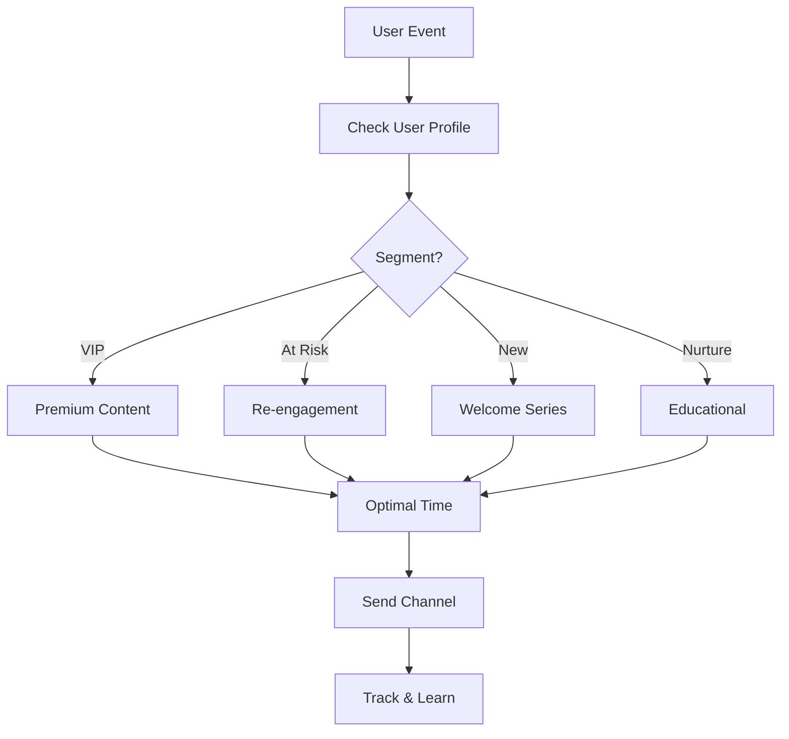

# CLASE 12: MARKETING DE RESPUESTA DIRECTA CON IA

## 📅 Duración: 4 Horas (240 minutos)

---

## 12.1 OBJETIVOS DE APRENDIZAJE

Al finalizar esta clase, los participantes serán capaces de:

1. **Generar copy automatizado** usando IA para campañas de marketing
2. **Segmentar audiencias** de manera inteligente
3. **Crear campañas personalizadas** a escala
4. **Implementar A/B testing asistido** por IA
5. **Medir y optimizar** resultados de campañas

---

## 12.2 CONTENIDOS DETALLADOS

### MÓDULO 1: FUNDAMENTOS DE MARKETING DE RESPUESTA DIRECTA (45 minutos)

#### 12.2.1 ¿Qué es el Marketing de Respuesta Directa?

El marketing de respuesta directa busca una respuesta inmediata del cliente. A diferencia del branding, cada pieza de marketing tiene unaCTA clara.

**Características:**

- Siempre tiene un llamado a la acción claro
- Es medible (cada respuesta se puede rastrear)
- Requiere acción inmediata del cliente
- Se enfoca en conversión, no solo awareness

**Ejemplos:**
- Emails con oferta limitada
- Anuncios con link directo a compra
- Landing pages con formulario
- Sales letters directos

**Métricas Clave:**

| Métrica | Descripción | Meta Típica |
|---------|-------------|-------------|
| CTR | Click Through Rate | 2-5% |
| CVR | Conversion Rate | 1-3% |
| CPA | Cost per Acquisition | Variable |
| ROAS | Return on Ad Spend | >3x |

#### 12.2.2 El Rol de la IA en Marketing Directo

La IA transforma el marketing de respuesta directa:

**Aplicaciones de IA:**

1. **Generación de Copy**: Crear docenas de variaciones rápidamente
2. **Segmentación**: Identificar mejores prospectos
3. **Personalización**: Adaptar mensaje a cada usuario
4. **Optimización**: A/B testing continuo
5. **Predicción**: Predecir quién convertirá

**Ventaja Competitiva:**
- Velocidad: Generar 100 variaciones vs 1 manualmente
- Escala: Personalizar para 10,000 usuarios
- Testing: Probar infinitas combinaciones

---

### MÓDULO 2: GENERACIÓN DE COPY AUTOMATIZADO (75 minutos)

#### 12.2.3 Framework de Copy con IA

El copy efectivo sigue estructuras probadas:

**Framework AIDA:**

```
A - Attention (Atención):吸引
I - Interest (Interés): Mantener atención
D - Desire (Deseo): Crear deseo
A - Action (Acción): Llamado a la acción
```

**Framework PAS:**

```
P - Problem (Problema): Identificar el problema
A - Agitation (Agitación): Intensificar el problema
S - Solution (Solución): Presentar la solución
```

**Framework FAB:**

```
F - Features (Características): Qué es
A - Advantages (Ventajas): Por qué es mejor
B - Benefits (Beneficios): Qué beneficios trae
```

#### 12.2.4 Configurar Prompts para Copy

**Prompt para Email de Ventas:**

```
Eres un experto copywriter especializado en emails de ventas para [INDUSTRIA].
Tu estilo es: [ESTILO - ej: conversacional, profesional, directo]

Producto: [NOMBRE]
Beneficio principal: [BENEFICIO]
Audience: [DESCRIPCIÓN]

Genera 3 versiones de email:
1. Corto (menos de 100 palabras) - enfoque en urgencia
2. Medio (100-200 palabras) - storytelling
3. Largo (200-300 palabras) - detallado

Cada email debe incluir:
- Subject line atractiva
- Hook inicial kuat
- Cuerpo con beneficio principal
-CTA claro
- PS persuasivo

Idioma: [ESPANOL]
Tono: [TONO]
```

**Prompt para Anuncios:**

```
Genera 5 variaciones de copy para anuncio de Facebook/Instagram:

Producto: [NOMBRE]
Propuesta única: [UNIQUE SELLING PROPOSITION]
Target: [AUDIENCIA]
Objetivo: [CTR/CONVERSION]

Para cada variación:
- Headline (menos de 40 caracteres)
- Primary text (90-150 caracteres)
- Description (opcional)

Varía el enfoque:
1. Beneficio emocional
2. Beneficio lógico
3. Urgencia
4. Social proof
5. Pregunta retórica
```

#### 12.2.5 Flujo de Automatización de Copy

**Arquitectura:**



**Implementación en n8n:**

```
1. Trigger: Google Sheets con topics
2. OpenAI: Generate copy variations
3. Set: Parse respuesta en estructura
4. Sheets: Guardar variaciones
5. Filter: Seleccionar mejores
6. Email/SMS: Enviar campaña
```

---

### MÓDULO 3: SEGMENTACIÓN DE AUDIENCIA (45 minutos)

#### 12.3.1 Tipos de Segmentación

**Segmentación Tradicional:**
- Demográfica (edad, género, ubicación)
- Psicográfica (价值观, intereses)
- Comportamental (compras anteriores)
- Geográfica (ubicación)

**Segmentación con IA:**
- Clustering automático
- Scoring predictivo
- Propensión a convertir
- Lifetime value prediction

#### 12.3.2 Implementar Segmentación con IA

**Paso 1: Recopilar Datos**

Fuentes de datos:
- CRM (demographics, interactions)
- Web analytics (comportamiento)
- Email metrics (engagement)
- Purchase history (comportamiento)

**Paso 2: Crear Features**

```javascript
// Features para modelo de segmentación
{
  "engagement_score": email_opens / total_sent,
  "purchase_frequency": total_orders / months_active,
  "avg_order_value": total_revenue / total_orders,
  "recency": days_since_last_purchase,
  "product_affinity": category_preference,
  "channel_preference": preferred_channel
}
```

**Paso 3: Aplicar Clustering**

```
Usa OpenAI para clasificar:
- Cluster 1: High value, high engagement → VIP
- Cluster 2: High value, low engagement → At risk
- Cluster 3: Low value, high engagement → Grow
- Cluster 4: Low value, low engagement → Nurture
```

**Paso 4: Aplicar Modelo Predictivo**

```
Para cada usuario:
- Input: features
- Model: predict conversion_probability
- Output: score 0-100

Segmentar según score:
- 80-100: Alta prioridad
- 60-80: Media prioridad
- 0-60: Baja prioridad
```



---

### MÓDULO 4: CAMPAÑAS PERSONALIZADAS (45 minutos)

#### 12.4.1 Personalización a Escala

**Niveles de Personalización:**

| Nivel | Ejemplo | Complejidad |
|-------|---------|-------------|
| Basic | Nombre en email | Baja |
| Intermediate | Producto basado en compras | Media |
| Advanced | Contenido dinámico por usuario | Alta |
| Predictive | Offer basada en propensión | Muy Alta |

#### 12.4.2 Flujo de Campaña Personalizada

**Arquitectura:**

```
1. Segment Definition
   ↓
2. Content Generation per Segment
   ↓
3. Channel Selection
   ↓
4. Send Time Optimization
   ↓
5. Personalization Injection
   ↓
6. Send & Track
```

**Ejemplo: Email Automatizado:**

```
Trigger: User signup
↓
Check: What is user interested in?
  - Category A → Email with Category A products
  - Category B → Email with Category B products
  - Unknown → Email with bestsellers
↓
Check: Preferred send time?
  - Morning person → 8am
  - Night person → 8pm
  - Unknown → 10am
↓
Send: Personalized email
↓
Track: Open, click, conversion
```

---

### MÓDULO 5: A/B TESTING ASISTIDO (30 minutos)

#### 12.5.1 Fundamentos de Testing

**Qué testar:**
- Subject lines
- Copy/tiempo
- Imágenes
- CTAs
- Send times

**Estadísticas Necesarias:**

- Mínimo 100 conversiones por variante
- 95% nivel de confianza
- Documentar cambios significativos

#### 12.5.2 Automatizar A/B Testing

**Flujo:**

```
1. Generate Variations: Crear 5+ variaciones
2. Split Traffic: Random o por segmento
3. Track Results: Recopilar métricas
4. AI Analysis: Determinar mejor variante
5. Scale: Enviar más tráfico a winner
```

**Prompt para Análisis:**

```
Analiza los resultados del A/B test:

Variant A:
- Envíos: 1000
- Opens: 250 (25%)
- Clicks: 50 (5%)
- Conversions: 10 (1%)

Variant B:
- Envíos: 1000
- Opens: 300 (30%)
- Clicks: 80 (8%)
- Conversions: 20 (2%)

Determina:
1.Cuál variant es winner?
2. Es estadísticamente significativo?
3. Recomendación para siguiente test?
```

---

## 12.3 DIAGRAMAS EN MERMAID

### Diagrama 1: Marketing Automation Pipeline



### Diagrama 2: Personalization Flow



---

## 12.4 REFERENCIAS EXTERNAS

1. **Copy.ai**
   - URL: https://www.copy.ai
   - Relevancia: Generación de copy con IA

2. **Jasper.ai**
   - URL: https://www.jasper.ai
   - Relevancia: AI writing assistant

---

## 12.5 EJERCICIOS PRÁCTICOS

### Ejercicio 1: Generador de Email

Crear flujo que genere email de ventas

### Ejercicio 2: Segmentación

Implementar scoring de leads

### Ejercicio 3: A/B Test

Configurar test automatizado

---

## 12.6 ACTIVIDADES DE LABORATORIO

### Laboratorio 1: Campaña Completa

Crear campaña de email con IA

### Laboratorio 2: Dashboard

Crear dashboard de métricas

### Laboratorio 3: Optimización

Optimizar campañas existentes

---

## 12.7 RESUMEN

- Marketing de respuesta directa requiere copy efectivo
- IA permite generar variaciones a escala
- Segmentación inteligente mejora resultados
- Personalización a escala es posible con automatización
- A/B testing continuo optimiza resultados

---

**FIN DE LA CLASE 12**
