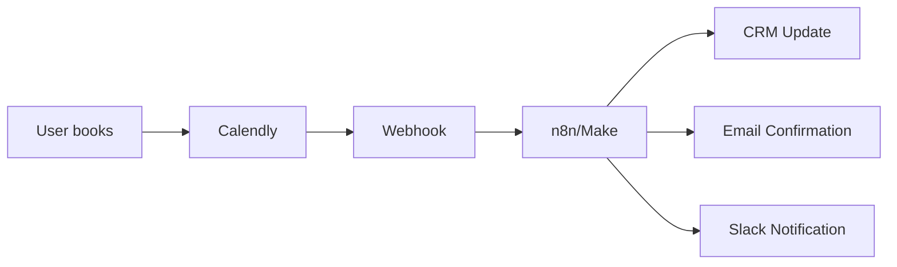
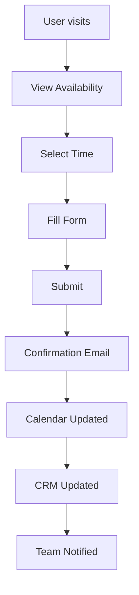
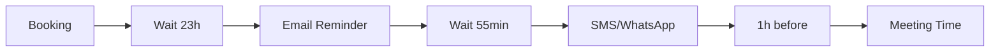

# CLASE 13: AGENTES DE SCHEDULING Y CITAS

## 📅 Duración: 4 Horas (240 minutos)

---

## 13.1 OBJETIVOS DE APRENDIZAJE

Al finalizar esta clase, los participantes serán capaces de:

1. **Implementar booking automatizado** para servicios y reuniones
2. **Configurar confirmaciones y recordatorios** automáticos
3. **Integrar con calendarios** de Google, Outlook y Apple
4. **Gestionar cancelaciones y reprogramaciones** automáticamente
5. **Medir métricas** de scheduling y optimizar

---

## 13.2 CONTENIDOS DETALLADOS

### MÓDULO 1: BOOKING AUTOMATIZADO (75 minutos)

#### 13.2.1 Herramientas de Booking

**Calendly:**

- Más popular para scheduling
- Integraciones con Google, Zoom, HubSpot
- Widget embeddable
- Pricing: Free-$20/mes

**Acuity Scheduling:**

- Para servicios (salones, consultorios)
- Payments integrados
- Packages y memberships
- Pricing: Free-$44/mes

**Square Appointments:**

- Para retail + servicios
- Payment processing
- Inventory
- Pricing: Free-$60/mes

#### 13.2.2 Configurar Calendly

**Paso 1: Crear Cuenta**

1. Ve a calendly.com
2. Regístrate con Google o email
3. Confirma email

**Paso 2: Configurar Event Types**

1. Event Types → Create New Event Type
2. Tipo: "One-on-One" o "Group"
3. Configura:
   - Nombre y descripción
   - Duración (15, 30, 60 min)
   - Fechas disponibles
   - Location (Zoom, phone, in-person)

**Paso 3: Personalizar**

1. Branding: Colors, logo
2. Questions: Add intake questions
3. Notifications: Custom email confirmations

**Paso 4: Integrar**

1. Share link directo
2. Embed en website
3. Connect to Zapier/n8n

#### 13.2.3 Automatizar con Webhooks

**Arquitectura:**



**Webhook de Calendly:**

```
URL: https://webhook.site/...
Triggered on:
- invitee.created (nueva cita)
- invitee.canceled (cancelación)
- invitee.no_show (no asistió)
```

---

### MÓDULO 2: CONFIRMACIONES Y RECORDATORIOS (60 minutos)

#### 13.2.4 Flujo de Confirmaciones

**Confirmation Email:**

```
1. Inmediato: Confirmación de booking
2. 24 horas antes: Recordatorio + detalles
3. 1 hora antes: Recordatorio final
```

**Configurar en Calendly:**

1. Go to "Event Types"
2. Edit event
3. "Notifications" tab
4. Configure reminders

**Personalización con Automatización:**

```
n8n Flow:
1. Webhook: New booking
2. Get user details
3. OpenAI: Generate personalized confirmation
4. Send via Gmail/SendGrid
5. Add to CRM
```

#### 13.2.5 Recordatorios Multi-Canal

**Canales:**

| Canal | Cuándo | Uso |
|-------|--------|-----|
| Email | 24h antes | Detalles, preparacion |
| SMS | 1h antes | recordatorio rápido |
| WhatsApp | 1h antes | Similar a SMS |
| Slack | 24h antes | Si es interno |

**Implementación:**

```
1. Calendly → Webhook
2. n8n:
   a. Wait 23 hours
   b. Send reminder email
   c. Wait 55 min
   d. Send SMS/WhatsApp
```

---

### MÓDULO 3: INTEGRACIÓN CON CALENDARIOS (45 minutos)

#### 13.3.1 Google Calendar Integration

**Conectar en Calendly:**

1. Account → Integrations
2. Google Calendar → Connect
3. Authorize
4. Select calendars

**Sincronización:**

- Bloquea tiempo en Google Calendar
- Evita double booking
- Muestra disponibilidad

**API de Google Calendar:**

```
Endpoint: https://www.googleapis.com/calendar/v3/calendars/primary/events

Create Event:
POST with:
- summary: "Meeting with X"
- start: {dateTime, timeZone}
- end: {dateTime, timeZone}
- attendees: [{email}]
```

#### 13.3.2 Calendly + Google Calendar + Zoom

**Setup Completo:**

```
1. Calendly → Settings → Integration
2. Connect Google Calendar
3. Connect Zoom (or other video)
4. When user books:
   - Creates event in Google Calendar
   - Sends Zoom link automatically
   - Adds to both calendars
```

---

### MÓDULO 4: GESTIÓN DE CANCELACIONES (30 minutos)

#### 13.4.1 Automatizar Cancelaciones

**Webhook de Cancelación:**

```
Trigger: invitee.canceled
Data received:
- event = "canceled"
- email
- name
- event_type
- reason
```

**Flujo de Cancelación:**

```
1. Detect cancel via webhook
2. Update CRM (mark as canceled)
3. Send cancellation email
4. Notify team via Slack
5. Free up calendar
6. Offer rebooking link
```

#### 13.4.2 Política de Cancelación

**Automatizar:**

```
1. Set cancellation policy
2. If canceled > 24h before → Full refund
3. If canceled < 24h → Partial or no refund
4. Notify via email automatically
```

---

### MÓDULO 5: MÉTRICAS Y OPTIMIZACIÓN (30 minutos)

#### 13.5.1 Métricas Clave

| Métrica | Descripción | Optimizar |
|---------|-------------|-----------|
| Bookings Rate | % de visitantes que reservan | Improve CTA |
| Show Rate | % que asisten | Better reminders |
| Cancellation Rate | % cancelaciones | Cancellation policy |
| Revenue per Booking | Valor promedio | Upselling |
| No-show Rate | % no asisten | Deposit |

#### 13.5.2 Dashboard

**Crear en Google Sheets:**

```
Columns:
- Date
- Event Type
- Bookings
- Cancellations
- No-shows
- Revenue
- Show Rate %
```

**Automatizar:**

```
n8n:
1. Daily at 6pm
2. Query Calendly API
3. Update Sheets
4. Calculate metrics
5. Send summary email
```

---

## 13.3 DIAGRAMAS EN MERMAID

### Diagrama 1: Booking Flow



### Diagrama 2: Reminder Flow



---

## 13.4 EJERCICIOS PRÁCTICOS

### Ejercicio 1: Setup Calendly

Configurar Calendly con integración completa

### Ejercicio 2: Automatizar Recordatorios

Crear flujo de recordatorios automatizados

### Ejercicio 3: Dashboard

Crear dashboard de métricas

---

## 13.5 ACTIVIDADES DE LABORATORIO

### Laboratorio 1: Booking System

Implementar sistema completo

### Laboratorio 2: CRM Integration

Conectar con CRM

### Laboratorio 3: Optimization

Optimizar basada en métricas

---

## 13.6 RESUMEN

- Booking automatizado mejora conversión
- Recordatorios múltiples reducen no-shows
- Integración con calendarios evita conflictos
- Cancelaciones automatizadas ahorran tiempo
- Métricas permiten optimización continua

---

**FIN DE LA CLASE 13**
