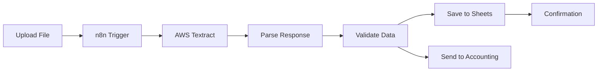
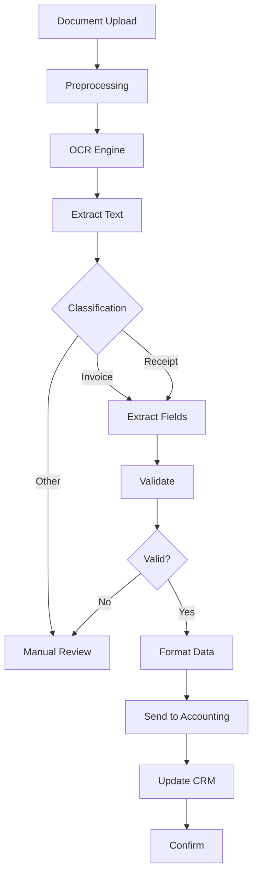
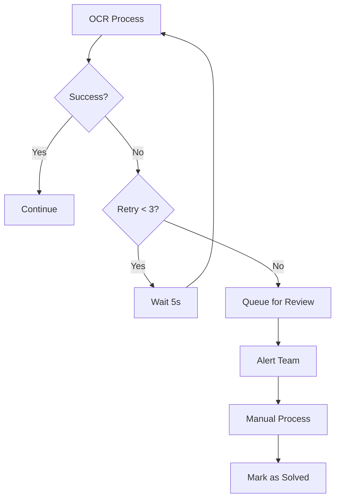

# CLASE 14: LECTURA AUTOMATIZADA DE DOCUMENTOS

## 📅 Duración: 4 Horas (240 minutos)

---

## 14.1 OBJETIVOS DE APRENDIZAJE

Al finalizar esta clase, los participantes serán capaces de:

1. **Implementar OCR con IA** para extraer texto de documentos
2. **Automatizar extracción de datos** de facturas y recibos
3. **Clasificar documentos** automáticamente
4. **Integrar con sistemas contables** para procesamiento automático
5. **Manejar errores y excepciones** en el procesamiento de documentos

---

## 14.2 CONTENIDOS DETALLADOS

### MÓDULO 1: FUNDAMENTOS DE OCR E IA (60 minutos)

#### 14.1.1 ¿Qué es OCR?

OCR (Optical Character Recognition) convierte imágenes de texto en texto editable. Con IA, la precisión ha mejorado dramáticamente.

**Herramientas OCR con IA:**

| Herramienta | Precisión | Costo | Mejor Para |
|-------------|-----------|-------|------------|
| AWS Textract | 99% | $0.015/página | Facturas, documentos complejos |
| Google Cloud Vision | 99% | $1.50/1M chars | General |
| Azure Form Recognizer | 98% | Similar a AWS | Layouts complejos |
| OpenAI GPT-4V | 95%+ | Por tokens | Entendimiento contextual |
| Mindee | 95% | Freemium | Documentos específicos |

#### 14.1.2 Casos de Uso en PYMEs

**Documentos Comunes:**

1. **Facturas de proveedores**: Extraer datos para contabilidad
2. **Recibos**: Gastos deducibles
3. **Contratos**: Extraer fechas, partes, términos
4. **Identificaciones**: KYC, verificación
5. **Formularios**: Solicitudes, aplicaciones

**Proceso Typical:**

```
Documento → Digitalizar → OCR → Extracción → Validación → Sistema destino
```

---

### MÓDULO 2: EXTRACCIÓN DE DATOS DE FACTURAS (75 minutos)

#### 14.2.1 AWS Textract

**Configuración:**

1. AWS Console → Textract
2. Create bucket in S3
3. Upload document
4. Analyze Document (API)

**API Usage:**

```json
{
  "DocumentLocation": {
    "S3Object": {
      "Bucket": "mi-bucket",
      "Name": "factura.pdf"
    }
  }
}
```

**Response:**

```json
{
  "Blocks": [
    {
      "BlockType": "KEY_VALUE_SET",
      "Key": "FECHA:",
      "Value": "15 de Enero 2024"
    },
    {
      "BlockType": "KEY_VALUE_SET",
      "Key": "TOTAL:",
      "Value": "$1,250.00"
    }
  ]
}
```

#### 14.2.2 Google Cloud Vision

**Setup:**

1. Google Cloud Console → Enable Vision API
2. Create service account
3. Download JSON key
4. Use in n8n/Make

**Procesar Document:**

```
Endpoint: https://vision.googleapis.com/v1/images:annotate

Body:
{
  "requests": [{
    "image": {"source": {"imageUri": "gs://..."}},
    "features": [{"type": "DOCUMENT_TEXT_DETECTION"}]
  }]
}
```

#### 14.2.3 Flujo de Extracción con n8n

**Arquitectura:**



**Implementation:**

```
1. n8n: Webhook para recibir archivo
2. Upload to S3
3. AWS Textract: Analyze document
4. Code: Parse blocks, extract fields
5. Condition: Validar campos requeridos
6. Sheets: Save as row
7. Email: Confirmar procesamiento
```

---

### MÓDULO 3: CLASIFICACIÓN DE DOCUMENTOS (45 minutos)

#### 14.3.1 Por Qué Clasificar

Beneficios:
- Routing automático al sistema correcto
- Organización en carpetas
- Búsqueda eficiente
- Compliance y auditoría

**Categorías Típicas:**

- Facturas
- Recibos
- Contratos
- Identificaciones
- Formularios
- Correos/documentos

#### 14.3.2 Clasificar con IA

**Prompt para Clasificación:**

```
Analiza este documento y clasifícalo:

Documento: [contenido]
Tipo de documento: ?

Opciones:
- FACTURA: Documento con línea de items, total, datos de proveedor
- RECIBO: Comprobante de pago menor
- CONTRATO: Documento legal con firmas
- IDENTIFICACIÓN: Documento personal
- FORMULARIO: Solicitud estructurada
- OTRO: Cualquier otro tipo

Responde solo con el tipo.
```

**Clasificación por Texto:**

```
1. Extraer texto con OCR
2. Buscar keywords:
   - "Invoice", "Factura" → FACTURA
   - "Receipt", "Recibo" → RECIBO
   - "Contract", "Contrato" → CONTRATO
3. Si no hay match → AI classification
```

---

### MÓDULO 4: INTEGRACIÓN CONTABLE (30 minutos)

#### 14.4.1 Sistemas Contables

**Integraciones Comunes:**

- QuickBooks
- Xero
- FreshBooks
- Sage
- ContaPlus (España)
- A2 (México)

**Flujo de Integración:**

```
1. OCR extrae datos
2. Validar contra reglas de negocio
3. Create/update vendor
4. Create invoice/receipt record
5. Generate journal entry
```

**Ejemplo: QuickBooks:**

```
n8n → QuickBooks Node:
- Create Customer (if new)
- Create Bill (from vendor)
- Attach PDF to bill
- Route to approval workflow
```

---

### MÓDULO 5: MANEJO DE ERRORES (30 minutos)

#### 14.5.1 Errores Comunes

- Documento borroso
- Formato no soportado
- Datos faltantes
- Texto en idioma extraño
- Archivo corrupto

#### 14.5.2 Estrategias

**Validación:**

```
Required fields:
- invoice_number
- date
- vendor_name
- total_amount

If any missing:
  → Flag for manual review
```

**Retry Logic:**

```
1. OCR failed → Retry up to 3 times
2. After 3 failures → Queue for manual
3. Alert team of issue
```

---

## 14.3 DIAGRAMAS EN MERMAID

### Diagrama 1: Document Processing Pipeline



### Diagrama 2: Error Handling Flow



---

## 14.4 EJERCICIOS PRÁCTICOS

### Ejercicio 1: OCR Setup

Configurar Textract con n8n

### Ejercicio 2: Invoice Extraction

Extraer datos de factura

### Ejercicio 3: Integration

Conectar con sistema contable

---

## 14.5 ACTIVIDADES DE LABORATORIO

### Laboratorio 1: Complete Pipeline

Crear pipeline completo

### Laboratorio 2: Classification

Implementar sistema de clasificación

### Laboratorio 3: Optimization

Optimizar precisión

---

## 14.6 RESUMEN

- OCR con IA permite extraer datos de documentos automáticamente
- Textract y Vision ofrecen precisión alta
- Clasificación automática routing a sistemas correctos
- Integración contable ahorra tiempo significativo
- Manejo de errores robusto es esencial

---

**FIN DE LA CLASE 14**
