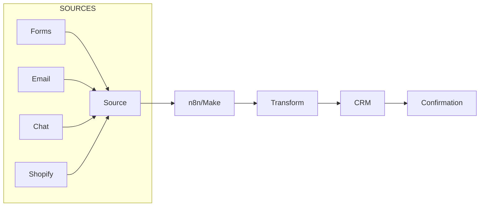
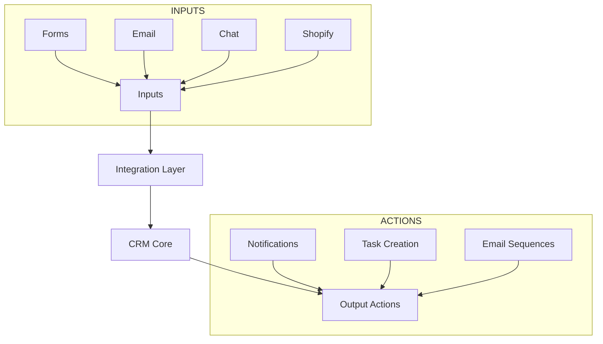
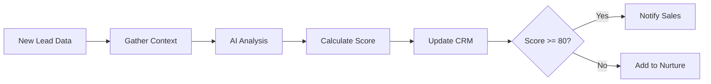

# CLASE 15: GESTIÓN AUTOMATIZADA DE CRM

## 📅 Duración: 4 Horas (240 minutos)

---

## 15.1 OBJETIVOS DE APRENDIZAJE

Al finalizar esta clase, los participantes serán capaces de:

1. **Sincronizar contactos** entre múltiples sistemas automáticamente
2. **Actualizar registros de clientes** sin intervención manual
3. **Implementar scoring de leads** automático con IA
4. **Configurar notificaciones de seguimiento** personalizadas
5. **Integrar CRM con otras herramientas** de negocio

---

## 15.2 CONTENIDOS DETALLADOS

### MÓDULO 1: FUNDAMENTOS DE CRM (45 minutos)

#### 15.1.1 ¿Qué es un CRM?

CRM (Customer Relationship Management) gestiona las relaciones con clientes. Para PYMEs, es crítico para:

- Registrar interacciones
- Seguimiento de ventas
- Análisis de clientes
- Automatización de marketing

**CRMs Populares para PYMEs:**

| CRM | Mejor Para | Precio | Integraciones |
|-----|------------|--------|----------------|
| HubSpot | General | Free-$1,350/mes | Excelente |
| Pipedrive | Ventas | $12-$49/mes | Buena |
| Zoho CRM | SMB | Free-$37/mes | Muy buena |
| Salesforce | Enterprise | $25-$330/mes | Excelente |
| Bitrix24 | Todo-en-uno | Free-$24/mes | Buena |

#### 15.1.2 Estructura de Datos en CRM

**Objetos Principales:**

```
- Contactos/Leads: Información de personas
- Empresas: Organizaciones
- Deals/Oportunidades: Ventas en proceso
- Actividades: Tareas, llamadas, emails
- Tickets: Casos de soporte
```

**Campos Personalizables:**

- Datos de contacto (nombre, email, teléfono)
- Datos de empresa (industria, tamaño)
- Datos de venta (presupuesto, timeline)
- Campos personalizados

---

### MÓDULO 2: SINCRONIZACIÓN DE CONTACTOS (75 minutos)

#### 15.2.1 Fuentes de Contactos

**Fuentes comunes:**
- Formularios web
- Landing pages
- Email marketing
- Chatbots
- Importaciones manuales
- Otras plataformas (Shopify, WooCommerce)

#### 15.2.2 Automatizar Sincronización

**Arquitectura:**



**Ejemplo: Webhook → HubSpot:**

```
1. Trigger: Webhook desde formulario
2. Parse: Extract name, email, company
3. HubSpot: Search for contact
4. Condition: If exists → Update; If not → Create
5. Slack: Notify sales team
```

**Configuración en n8n:**

```
1. Webhook node (receive form data)
2. HubSpot node:
   - Operation: Create/Update Contact
   - Properties: map fields
3. Slack: Send notification
```

#### 15.2.3 Sincronización Bidireccional

**Sincronizar en dos direcciones:**

```
1. HubSpot → Google Sheets (export contacts)
2. Sheets → HubSpot (import updates)
```

**Evitar Conflicts:**

```
- Define "source of truth"
- Use timestamps to resolve conflicts
- Log all sync events for audit
```

---

### MÓDULO 3: ACTUALIZACIÓN DE REGISTROS (45 minutos)

#### 15.3.1 Actualización Automática

**Cuándo actualizar:**

- Nuevo email abierto → Update last activity
- Nueva página visitada → Update interests
- Respuesta a campaña → Update status
- Meeting completado → Update stage

**Flujo:**

```
1. Trigger: New activity detected
2. Identify contact
3. Determine update needed
4. Apply update to CRM
5. Log change
```

#### 15.3.2 Datos a Actualizar

| Campo | Cuándo Actualizar | Fuente |
|-------|-------------------|--------|
| Last Activity | Cualquier interacción | All |
| Stage | Cambio en pipeline | Sales |
| Score | Nuevo comportamiento | AI |
| Owner | Reasignación | Rules |
| Tags | Nueva interacción | Automation |

---

### MÓDULO 4: SCORING DE LEADS (45 minutos)

#### 15.4.1 Fundamentos de Lead Scoring

Lead scoring prioriza prospectos según probabilidad de conversión.

**Scoring Tradicional:**

```
Puntos:
- Título/Cargo ejecutivo: +10
- Empresa > 100 empleados: +10
- Visitó pricing page: +20
- Descargó whitepaper: +15
- Abrió email: +5
- No abrió 30 días: -20
```

**Scoring con IA:**

```
1. Gather all lead data
2. Use ML model to predict conversion
3. Score 0-100
4. Segment by score:
   - 80-100: MQL
   - 50-79: Lead
   - 0-49: Prospect
```

#### 15.4.2 Implementar Scoring Automático

**Con OpenAI:**

```
Prompt:
Analiza este lead y asígnale un score de 0-100:

Lead data:
{{lead_data}}

Considera:
- Fit: ¿Es buen cliente potencial?
- Engagement: ¿Ha interactuado con nosotros?
- Intent: ¿Hay señales de compra?

Responde:
{"score": [0-100], "reason": "[explicación]", "recommended_action": "[seguir, nurturing, descartar]"}
```

**Workflow:**

```
1. New lead in CRM
2. Get all lead activities
3. Format as input for AI
4. Call OpenAI for scoring
5. Update contact with score
6. If score > 80 → Notify sales
```

---

### MÓDULO 5: NOTIFICACIONES DE SEGUIMIENTO (30 minutos)

#### 15.5.1 Tipos de Notificaciones

**Por Stage:**

- Lead nuevo → Notificar asignar
- Demo completada → Notificar seguimiento
- Proposal enviada → Notificar follow-up
- Close won → Celebrar
- Close lost → Notificar analizar

**Por Score:**

- Score alto → Prioridad inmediata
- Score bajando → Re-engagement
- Score bajo → Nurturing

#### 15.5.2 Configurar Notificaciones

**Slack:**

```
1. HubSpot → Webhook
2. n8n receives → Format message
3. Slack → Send to channel/user
```

**Email:**

```
1. CRM automation trigger
2. Template lookup
3. Send via email service
```

---

## 15.3 DIAGRAMAS EN MERMAID

### Diagrama 1: CRM Integration Architecture



### Diagrama 2: Lead Scoring Flow



---

## 15.4 EJERCICIOS PRÁCTICOS

### Ejercicio 1: Sync Contacts

Sincronizar contactos de formulario a CRM

### Ejercicio 2: Auto Update

Implementar actualización automática

### Ejercicio 3: Lead Scoring

Crear scoring automático

---

## 15.5 ACTIVIDADES DE LABORATORIO

### Laboratorio 1: CRM Setup

Configurar CRM con automatizaciones

### Laboratorio 2: Integration

Integrar múltiples fuentes

### Laboratorio 3: Optimization

Optimizar flujo

---

## 15.6 RESUMEN

- CRM centraliza información de clientes
- Sincronización automática evita entrada duplicada
- Scoring con IA prioriza esfuerzos de ventas
- Notificaciones mantienen al equipo informado
- Integraciones amplían funcionalidad del CRM

---

**FIN DE LA CLASE 15**
