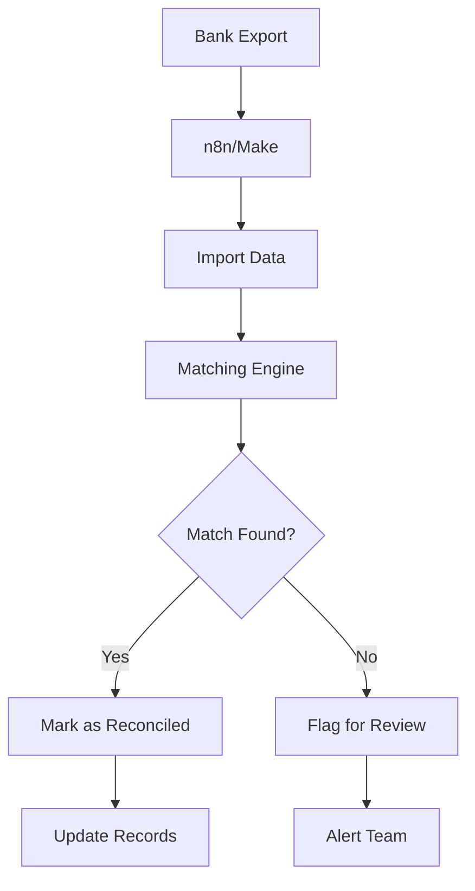
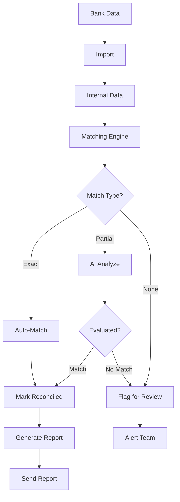
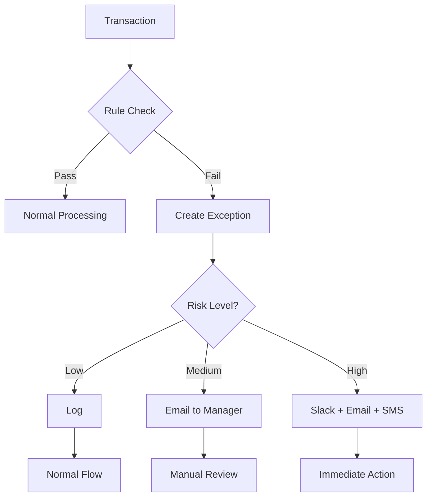

# CLASE 16: AUTOMATIZACIÓN DE CONCILIACIÓN

## 📅 Duración: 4 Horas (240 minutos)

---

## 16.1 OBJETIVOS DE APRENDIZAJE

Al finalizar esta clase, los participantes serán capaz de:

1. **Implementar matching de transacciones** automático
2. **Detectar anomalías** en datos financieros
3. **Generar reportes automáticos** consolidados
4. **Configurar alertas de discrepancias** en tiempo real
5. **Optimizar el proceso de conciliación** completo

---

## 16.2 CONTENIDOS DETALLADOS

### MÓDULO 1: FUNDAMENTOS DE CONCILIACIÓN (45 minutos)

#### 16.1.1 ¿Qué es la Conciliación?

La conciliación es el proceso de comparar dos conjuntos de datos financieros para verificar que coinciden. Es crítica para:

- Detectar errores en transacciones
- Identificar transacciones faltantes
- Mantener exactitud contable
- Prevenir fraude

**Tipos de Conciliación:**

| Tipo | Descripción | Frecuencia |
|------|-------------|------------|
| Bancaria | Estado de cuenta vs libros | Diaria |
| Clientes | Facturas vs pagos recibidos | Diaria |
| Proveedores | Facturas vs pagos emitidos | Semanal |
| Inventario | Sistema vs físico | Mensual |

#### 16.1.2 El Proceso Manual vs Automatizado

**Manual:**
- Exportar estados de cuenta
- Exportar libro de bancos
- Comparar manualmente en Excel
- Investigar discrepancias
- Ajustar si es necesario
- Toma horas

**Automatizado:**
- APIs sincronizan datos
- Matching automático
- Alertas instantáneas
- Reportes generados
- Toma minutos

---

### MÓDULO 2: MATCHING DE TRANSACCIONES (75 minutos)

#### 16.2.1 Estrategias de Matching

**Matching por Referencia:**

```
Exact match por número de referencia:
- Reference ID
- Invoice number
- Check number
```

**Matching por Importe:**

```
Same day, same amount:
- Bank amount = Book amount
- Considerar diferencias menores
```

**Matching por Fecha:**

```
Date window match:
- Transaction date ± 3 days
- Same amount
- Same vendor/customer
```

#### 16.2.2 Implementar Matching Automático

**Arquitectura:**



**Pasos en n8n:**

```
1. Trigger: Scheduled (daily at 6am)
2. Read Bank Statement (CSV/PDF)
3. Read Internal Records (Sheets/CRM)
4. For each bank transaction:
   a. Search for matching internal record
   b. If found → Mark as matched
   c. If not found → Flag
5. Generate report
6. Send email
```

#### 16.2.3 Matching Avanzado con IA

**Usar AI para Matching Difícil:**

```
Prompt para transacciones no igualadas:

Analiza estas transacciones y sugiere posible match:

Transacción bancaria:
- Fecha: 15/01/2024
- Descripción: "PAGO RECIBIDO X5467"
- Importe: $1,250.00

Transacciones pendientes:
[Listar]

¿Hay posible match? ¿Cuál?
Responde con: {"match": "Sí/No", "transaction_id": "...", "confidence": "Alta/Media/Baja", "reason": "..."}
```

---

### MÓDULO 3: DETECCIÓN DE ANOMALÍAS (45 minutos)

#### 16.3.1 Qué son las Anomalías

Anomalías son transacciones que no siguen patrones esperados:

**Tipos de Anomalías:**

- Importe inusualmente alto o bajo
- Transacciones fuera de horario
- Múltiples transacciones similares rápido
- Proveedor no reconocido
- Duplicados

#### 16.3.2 Detectar con Reglas

**Reglas de Detección:**

```
Rule 1: Amount > $10,000 → Alert
Rule 2: Transaction not in vendor list → Alert  
Rule 3: Duplicate reference → Alert
Rule 4: Weekend transaction → Flag (if unusual)
Rule 5: Foreign vendor without approval → Alert
```

#### 16.3.3 Detectar con IA

**Análisis de Patrones:**

```
1. Gather historical data (6+ months)
2. Train on "normal" patterns
3. For new transaction:
   - Calculate deviation from norm
   - If deviation > threshold → Flag
```

**Con OpenAI:**

```
Prompt:

Analiza esta transacción y determina si es anómala:

Transacción:
- Fecha: 25/12/2023
- Descripción: "SERVICIOS PROFESIONALES DIC2023"
- Importe: $15,000
- Vendor: ABC Consulting

Historial del vendor:
- Promedio mensual: $2,000
- Última transacción: hace 3 meses

¿Hay anomalía? ¿Por qué?
Responde: {"anomaly": true/false, "reason": "...", "risk_level": "High/Medium/Low"}
```

---

### MÓDULO 4: REPORTES AUTOMÁTICOS (45 minutos)

#### 16.4.1 Tipos de Reportes

| Reporte | Contenido | Frecuencia |
|---------|-----------|------------|
| Daily Summary | Transacciones del día | Diaria |
| Exception Report | Solo discrepancias | Diaria |
| Weekly Reconciliation | Conciliación semanal | Semanal |
| Monthly Statement | Estado mensual | Mensual |
| Aging Report | Antigüedad de partidas | Mensual |

#### 16.4.2 Generar Reportes Automáticos

**En Google Sheets:**

```
1. n8n: Retrieve reconciliation data
2. Format into report structure
3. Create/Update Sheet "Daily Report"
4. Generate PDF
5. Email to team
```

**Template de Reporte:**

```
═══════════════════════════════════
CONCILIACIÓN BANCARIA - [FECHA]
═══════════════════════════════════

RESUMEN:
- Total transacciones bancarias: X
- Total transacciones conciliadas: X
- Transacciones pendientes: X
- Monto conciliado: $X
- Monto pendiente: $X

EXCEPCIONES:
[Lista de excepciones]

PRÓXIMOS PASOS:
[Acciones requeridas]

═══════════════════════════════════
```

---

### MÓDULO 5: ALERTAS DE DISCREPANCIAS (30 minutos)

#### 16.5.1 Configurar Alertas

**Niveles de Alerta:**

| Nivel | Cuándo | Canal | Ação |
|-------|--------|-------|------|
| Info | Conciliación exitosa | Log | Ninguna |
| Warning | < 90% conciliado | Email | Revisar |
| Error | Discrepancia > $1,000 | Slack | Investigar |
| Critical | Fraude detectado | SMS + Email | Urgente |

**Configurar en n8n:**

```
1. After reconciliation complete
2. Calculate metrics
3. Determine alert level
4. If warning/error/critical:
   - Send appropriate notification
   - Include details
   - Add to tracking system
```

---

## 16.3 DIAGRAMAS EN MERMAID

### Diagrama 1: Reconciliation Flow



### Diagrama 2: Exception Handling



---

## 16.4 EJERCICIOS PRÁCTICOS

### Ejercicio 1: Matching Setup

Configurar matching automático

### Ejercicio 2: Anomaly Detection

Implementar detección de anomalías

### Ejercicio 3: Reporting

Crear reportes automáticos

---

## 16.5 ACTIVIDADES DE LABORATORIO

### Laboratorio 1: Complete Setup

Sistema completo de conciliación

### Laboratorio 2: AI Enhancement

Agregar detección con IA

### Laboratorio 3: Optimization

Optimizar proceso

---

## 16.6 RESUMEN

- Matching automático reduce horas de trabajo
- IA puede ayudar con matches difíciles
- Detección de anomalías previene problemas
- Reportes automáticos mantienen al equipo informado
- Alertas permiten respuesta rápida

---

**FIN DE LA CLASE 16**
