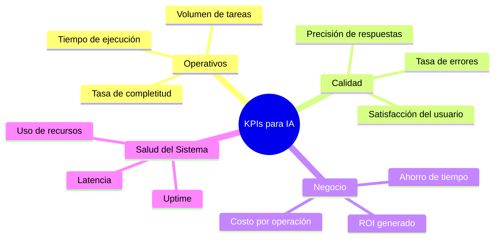
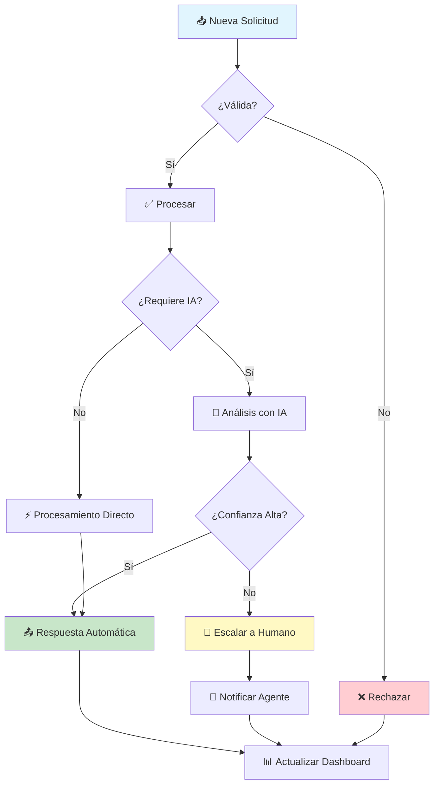
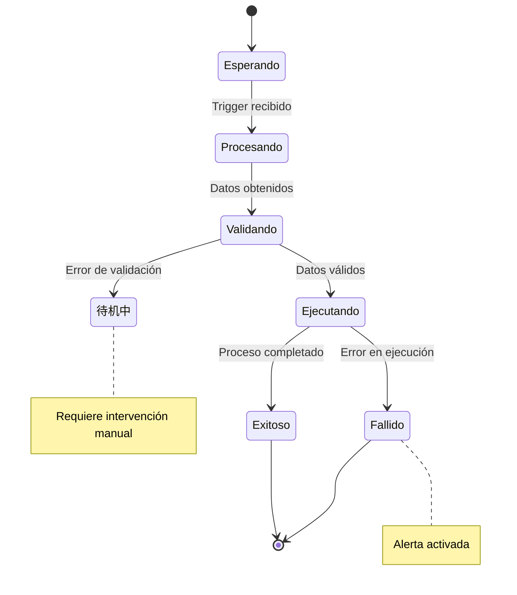
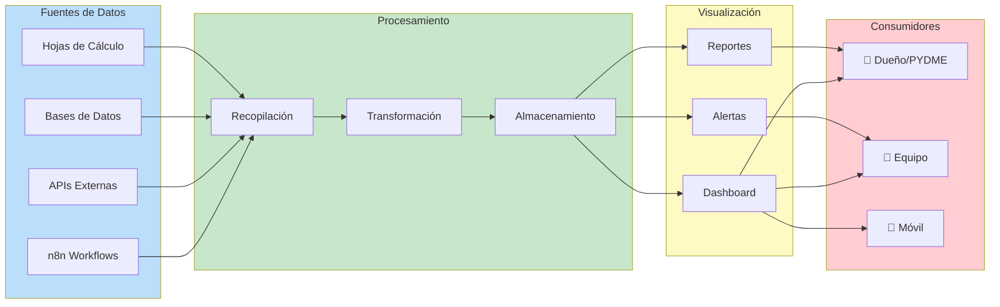
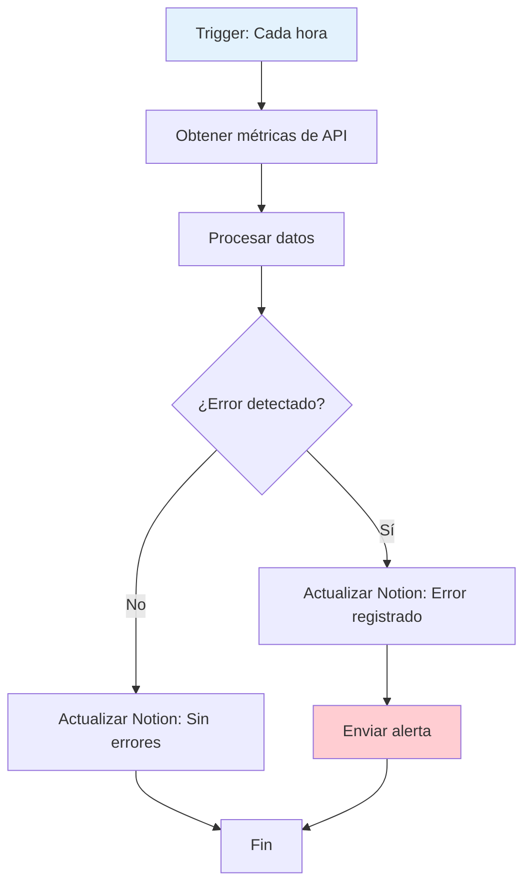

# Clase 17: Dashboard de Comando - Fundamentos

## 📋 Información General

| Aspecto | Detalle |
|---------|---------|
| **Duración** | 4 horas (240 minutos) |
| **Modalidad** | Teórico-Práctico |
| **Nivel** | Intermedio-Avanzado |
| **Prerrequisitos** | Clases 1-16 del curso |

---

## 🎯 Objetivos de Aprendizaje

Al finalizar esta clase, serás capaz de:

1. **Comprender** los principios fundamentales que hacen que un dashboard sea efectivo para monitoreo de agentes de IA
2. **Diseñar** KPIs (Key Performance Indicators) relevantes y accionables para tus automatizaciones
3. **Implementar** sistemas de visualización de flujo que muestren el estado de tus procesos en tiempo real
4. **Seleccionar** las herramientas adecuadas de visualización según tus necesidades y presupuesto
5. **Crear** tu primer dashboard de comando funcional usando las herramientas aprendidas

---

## 📚 Contenidos Detallados

### 1. Introducción a los Dashboards de Comando

Un **dashboard de comando** es una interfaz visual que concentra información crítica sobre tus sistemas, procesos y métricas en un solo lugar. Piensa en él como el "caballero de mando" de tu empresa: desde allí puedes ver todo lo que sucede y tomar decisiones informadas.

#### ¿Por qué es crucial para dueños de PYME?

Imagina que tienes 5 automatizaciones funcionando 24/7. Sin un dashboard:
- ❌ No sabes si algo falló hasta que un cliente se queja
- ❌ Pierdes horas buscando problemas
- ❌ No puedes demostrar el valor de tus automatizaciones

Con un dashboard:
- ✅ Ves problemas antes de que impacten a clientes
- ✅ Tomas decisiones basadas en datos reales
- ✅ Demuestras ROI a tu equipo o inversionistas

### 2. Principios de Dashboards Efectivos

#### Principio 1: El-test de las 5 Segundos

Cualquier persona debería poder entender el estado general de tu dashboard en 5 segundos. Si requiere más tiempo, está mal diseñado.

**Checklist del test:**
- [ ] ¿Puedes identificar si todo está verde (operando bien) o hay problemas?
- [ ] ¿Sabes qué métricas son las más importantes?
- [ ] ¿Los colores comunican claramente el estado?

#### Principio 2: Información Jerárquica

Organiza la información en niveles:
- **Nivel 1 (Crítico)**: Solo luces rojas/verdes - ¿Todo funciona?
- **Nivel 2 (Importante)**: Números clave - ¿Cuántas tareas se ejecutaron?
- **Nivel 3 (Detalle)**: Gráficos y tendencias - ¿Por qué pasó esto?

#### Principio 3: Accionabilidad Inmediata

Cada dato debe responder: "¿Qué debo hacer con esto?"

**Mal diseño:**
```
📊 Total de emails enviados: 1,234
```

**Buen diseño:**
```
📊 Emails enviados hoy: 1,234
📊 Tasa de apertura: 45% (↑ 5% vs ayer)
📊 Acción: Campaña funcionando bien, considerar duplicar presupuesto
```

#### Principio 4: Actualización en Tiempo Real

Para automatizaciones, los datos deben actualizarse al menos cada 5 minutos. Para procesos críticos, cada 30 segundos.

### 3. KPIs para Agentes de IA

Los **KPIs (Key Performance Indicators)** o Indicadores Clave de Desempeño son métricas específicas que te permiten evaluar el rendimiento de tus agentes de IA.

#### Categorías de KPIs



#### KPIs Específicos Recomendados

| KPI | Definición | Meta Ideal | Cómo Medir |
|-----|------------|------------|------------|
| **Tasa de Éxito** | % de tareas completadas sin errores | >95% | Tareas exitosas / Total tareas |
| **Tiempo Medio de Resolución** | Tiempo promedio de cada tarea | Depende del proceso | Medir en cada ejecución |
| **Costo por Tarea** | Costo total / Número de tareas | Lo más bajo posible | Dividir costos mensuales |
| **Uptime** | % de tiempo que el sistema está disponible | >99.5% |监控系统 uptime |
| **Lead Time** | Tiempo desde solicitud hasta completado | Lo más bajo posible | Timestamps inicio/fin |

#### Ejemplo Práctico: Dashboard de Chatbot de Atención

```
╔════════════════════════════════════════════════════════════════╗
║              DASHBOARD - Chatbot de Atención al Cliente         ║
╠════════════════════════════════════════════════════════════════╣
║                                                                ║
║   SALUD GENERAL: 🟢 OPERANDO                                   ║
║                                                                ║
║   ┌─────────────┐  ┌─────────────┐  ┌─────────────┐           ║
║   │Conversaciones│  │  Tasa de    │  │  Tiempo     │           ║
║   │   Hoy: 156   │  │Resolución:  │  │  Promedio:  │           ║
║   │    ↑ 23%     │  │   87%       │  │  2.3 min    │           ║
║   └─────────────┘  └─────────────┘  └─────────────┘           ║
║                                                                ║
║   ÚLTIMAS 24 HORAS                                            ║
║   ▓▓▓▓▓▓▓▓▓▓▓▓▓▓▓▓▓▓▓▓▓▓▓▓▓▓▓▓▓▓▓▓▓▓▓▓▓▓▓▓▓▓▓                 ║
║                                                                ║
║   ALERTAS ACTIVAS: 2                                          ║
║   ⚠️ 14:32 - 3 conversaciones transferidas a humano            ║
║   ⚠️ 15:01 - Respuesta lenta detectada (>30s)                 ║
║                                                                ║
╚════════════════════════════════════════════════════════════════╝
```

### 4. Visualización de Flujo

La **visualización de flujo** te permite ver cómo las datos y tareas viajan a través de tu sistema de automatización.

#### Componentes de un Flujo Visual

1. **Nodos**: Representan pasos o acciones individuales
2. **Conectores**: Flechas que muestran la dirección del flujo
3. **Decisiones**: Puntos donde el flujo puede bifurcarse
4. **Estados**: Condiciones actuales de cada componente

#### Diagrama de Flujo de Monitoreo



#### Estados Visuales en Tiempo Real



### 5. Herramientas de Visualización

#### 5.1 Notion: Dashboards Simples y Efectivos

**¿Por qué Notion?**
- ✅ Integración con muchas herramientas
- ✅ Fácil de usar sin conocimientos técnicos
- ✅ Personalizable con fórmulas
- ✅ Gratis hasta 1000 bloques

**Limitaciones:**
- ❌ No es tiempo real (actualiza al recargar)
- ❌ Limitado para datos muy dinámicos
- ❌ No tiene alertas automáticas nativas

**Ejemplo de Dashboard en Notion:**

```
┌─────────────────────────────────────────────┐
│ 📊 Mi Dashboard de Automatizaciones         │
├─────────────────────────────────────────────┤
│                                             │
│ 🔵 Resumen del Mes                          │
│ ┌─────────────────────────────────────────┐ │
│ │ Tareas Completadas:  │ 1,247            │ │
│ │ Tasa de Éxito:       │ 94.2%            │ │
│ │ Ahorro de Tiempo:    │ 156 horas        │ │
│ │ Costo Operacional:   │ $127 USD/mes     │ │
│ └─────────────────────────────────────────┘ │
│                                             │
│ 🟢 Estado de Agentes                        │
│ ┌─────────────────────────────────────────┐ │
│ │ • Agente Email    │ 🟢 Activo  │ 99.8%  │ │
│ │ • Agente Calendario│ 🟢 Activo │ 100%   │ │
│ │ • Agente CRM      │ 🟡 Mantenimiento     │ │
│ └─────────────────────────────────────────┘ │
│                                             │
│ 📈 Tendencias                               │
│ [Gráfico de tareas por día]                  │
│                                             │
└─────────────────────────────────────────────┘
```

#### 5.2 Grafana: Poder para Datos Complejos

**¿Por qué Grafana?**
- ✅ Visualizaciones avanzadas y personalizables
- ✅ Soporta múltiples fuentes de datos
- ✅ Alertas sofisticadas
- ✅ Tiempo real
- ✅ Gratis (open source)

**Limitaciones:**
- ❌ Curva de aprendizaje más pronunciada
- ❌ Requiere configuración técnica
- ❌ Necesita servidor o cuenta en Grafana Cloud

**Ideal para:**
- Múltiples automatizaciones monitoreando
- Datos que requieren análisis en tiempo real
- Equipos técnicos que pueden mantenerlo

#### 5.3 Metabase: Inteligencia de Negocios Accesible

**¿Por qué Metabase?**
- ✅ Extremadamente fácil de usar
- ✅ Consultas sin SQL (para la mayoría)
- ✅ Permite a no-programadores explorar datos
- ✅Buena integración con bases de datos

**Limitaciones:**
- ❌ Menos flexible que Grafana
- ❌ Algunas funciones avanzadas requieren pago
- ❌ No es ideal para métricas en tiempo real extremas

**Ideal para:**
- Dueños de PYME que quieren autonomía sobre sus datos
- Reportes para stakeholders
- Análisis de tendencias a largo plazo

#### Comparativa de Herramientas

| Característica | Notion | Grafana | Metabase |
|---------------|--------|---------|----------|
| **Facilidad de uso** | ⭐⭐⭐⭐⭐ | ⭐⭐ | ⭐⭐⭐⭐ |
| **Tiempo real** | ⭐ | ⭐⭐⭐⭐⭐ | ⭐⭐⭐ |
| **Costo** | Gratis/Bajo | Gratis/Alto | Gratis/Medio |
| **Alertas** | ⭐ | ⭐⭐⭐⭐⭐ | ⭐⭐⭐ |
| **Visualizaciones** | ⭐⭐⭐ | ⭐⭐⭐⭐⭐ | ⭐⭐⭐⭐ |
| **Mejor para** | Quick wins | Tech teams | Business intelligence |

### 6. Arquitectura de un Dashboard de Comando



---

## 🔧 Tecnologías Específicas

### Herramientas Cubiertas en Esta Clase

| Herramienta | Propósito | Costo | Dificultad |
|------------|-----------|-------|------------|
| **Notion** | Dashboard básico y documentación | Gratis | Muy Fácil |
| **Grafana** | Monitoreo avanzado | Gratis | Media-Alta |
| **Metabase** | Business Intelligence | Gratis | Fácil-Media |
| **n8n (Integración)** | Envío de datos a dashboards | Gratis | Fácil |

### Configuración de Notion para Dashboard

1. **Crear una página de Dashboard**
2. **Insertar tablas de base de datos** con propiedades relevantes
3. **Usar fórmulas** para calcular métricas automáticas
4. **Crear vistas filtradas** para diferentes perspectivas

### Configuración de Grafana (Básico)

1. Crear cuenta en Grafana Cloud (gratis hasta 500 métricas)
2. Añadir fuente de datos (Prometheus, InfluxDB, etc.)
3. Crear dashboard y añadir paneles
4. Configurar alertas

---

## 📝 Ejercicios Prácticos Resueltos y Explicados

### Ejercicio 1: Crear Dashboard Básico en Notion

**Escenario:** María tiene un chatbot de WhatsApp que atiende consultas de clientes. Quiere monitorear: conversaciones diarias, tasa de resolución automática, y tiempo promedio de respuesta.

**Paso 1: Crear Base de Datos en Notion**

1. Crea una nueva página llamada "Dashboard WhatsApp"
2. Añade una tabla de base de datos
3. Crea las siguientes propiedades:
   - Fecha (tipo: Date)
   - Conversaciones (tipo: Number)
   - ResueltasAutomáticamente (tipo: Number)
   - TiempoPromedioMin (tipo: Number)

**Paso 2: Registrar Datos Diarios**

| Fecha | Conversaciones | ResueltasAutomáticamente | TiempoPromedioMin |
|-------|----------------|-------------------------|-------------------|
| 06/04/2026 | 45 | 38 | 2.3 |
| 07/04/2026 | 52 | 44 | 2.1 |
| 08/04/2026 | 48 | 41 | 2.5 |

**Paso 3: Añadir Métricas Calculadas**

Crea una fórmula llamada "TasaResolucion" con:
```
prop("ResueltasAutomáticamente") / prop("Conversaciones") * 100
```

**Resultado:** Ahora tienes un dashboard que muestra:
- Total de conversaciones por día
- Tasa de resolución automática (calculada)
- Tendencias de tiempo de respuesta

---

### Ejercicio 2: Configurar Alertas en Grafana

**Escenario:** Carlos quiere recibir una alerta cuando su agente de IA tenga una tasa de error mayor al 5%.

**Paso 1: Crear Panel de Métricas**

1. En tu dashboard de Grafana, clic en "Add Panel"
2. Añade una query que calcule la tasa de error:
```promql
sum(rate(workflow_errors_total[5m])) / sum(rate(workflow_executions_total[5m])) * 100
```

**Paso 2: Configurar Alerta**

1. En el panel, ve a la pestaña "Alert"
2. Clic en "Create alert rule from this panel"
3. Configura las condiciones:
   - Evaluate every: 1m
   - For: 5m (esperar 5 minutos antes de alertar)
   - Conditions: IS ABOVE 5

**Paso 3: Configurar Notificaciones**

1. Añade un canal de notificación (email, Slack, webhook)
2. Configura el mensaje de alerta:
```
🚨 ALERTA: Tasa de errores elevada
Agente: [nombre del agente]
Tasa actual: {{ $value }}%
Umbral: 5%
Hora: {{ $dateTime }}
```

**Resultado:** Recibirás notificaciones cuando algo necesite atención.

---

### Ejercicio 3: Diseñar KPIs para Diferentes Tipos de Agentes

**Caso: Agencia de Marketing Digital**

| Tipo de Agente | KPIs Principales | Meta | Frecuencia |
|----------------|------------------|------|------------|
| **Generador de Contenido** | Posts creados, Engagement estimado, Tiempo ahorrado | 50 posts/mes, >4% engagement | Semanal |
| **Gestor de Redes** | Publicaciones programadas, Comentarios respondidos, Posts viralizados | 100% respuesta <2hrs | Diario |
| **Analista de Reportes** | Reportes generados, Insights extraídos, Accuracy vs manual | 100% reportes a tiempo | Mensual |

**Fórmula de Cálculo de ROI:**

```
ROI (%) = ((Ahorro Total - Costo Total) / Costo Total) × 100

Donde:
- Ahorro Total = (Horas hombre ahorradas × Costo hora) + (Ingresos generados)
- Costo Total = Suscripciones + Mantenimiento + Training
```

---

## 🧪 Actividades de Laboratorio

### Laboratorio 1: Tu Primer Dashboard de Comando (60 minutos)

**Objetivo:** Crear un dashboard funcional que monitoree al menos 3 métricas de una automatización existente.

**Materiales:**
- Acceso a Notion (gratis)
- Al menos una automatización activa (n8n, Zapier, etc.)

**Instrucciones:**

1. **Configuración Inicial (15 min)**
   - [ ] Crea una cuenta en Notion (si no tienes)
   - [ ] Crea una página llamada "Dashboard de Comando"
   - [ ] Añade una tabla de base de datos

2. **Definir Métricas (15 min)**
   - [ ] Identifica 3-5 métricas que quieres monitorear
   - [ ] Define cómo medir cada una
   - [ ] Establece metas para cada métrica

3. **Implementar Seguimiento (20 min)**
   - [ ] Configura registro manual o automático de datos
   - [ ] Crea fórmulas para métricas calculadas
   - [ ] Añade vistas filtradas

4. **Presentación (10 min)**
   - [ ] Organiza tu dashboard con jerarquía clara
   - [ ] Añade colores para estados (verde=ok, amarillo=advertencia, rojo=error)
   - [ ] Comparte con un compañero para feedback

**Entregable:** Captura de pantalla de tu dashboard funcional.

---

### Laboratorio 2: Integrar n8n con Notion (90 minutos)

**Objetivo:** Configurar un workflow en n8n que envíe automáticamente datos a tu dashboard de Notion.

**Arquitectura del Workflow:**



**Instrucciones Detalladas:**

1. **Crear Base de Datos en Notion (15 min)**
   - Crea una tabla con: Timestamp, Ejecuciones, Errores, TiempoPromedio

2. **Configurar n8n Workflow (60 min)**
   - Trigger: Schedule (cada hora)
   - Nodo HTTP Request: Obtener métricas de tu sistema
   - Nodo Code: Procesar datos
   - Nodo Notion: Actualizar registro

3. **Probar y Verificar (15 min)**
   - Ejecuta manualmente el workflow
   - Verifica que los datos aparezcan en Notion
   - Ajusta si es necesario

---

### Laboratorio 3: Diseñar Sistema de Alertas (60 minutos)

**Objetivo:** Implementar un sistema de alertas de 3 niveles para tu automatización.

**Niveles de Alerta:**

| Nivel | Color | Condición | Acción |
|-------|-------|-----------|--------|
| 1 | 🟢 Verde | Todo funcionando normal | Ninguna |
| 2 | 🟡 Amarillo | Advertencia (ej: tasa error >3%) | Notificar al equipo |
| 3 | 🔴 Rojo | Crítico (ej: sistema caído) | Alerta inmediata + llamada |

**Implementación:**

1. **En Notion:** Usa fórmulas para determinar el estado
```
if(prop("TasaError") > 10, "🔴 Crítico", 
   if(prop("TasaError") > 3, "🟡 Advertencia", "🟢 Normal"))
```

2. **En Grafana:** Configura reglas de alerta con diferentes severidades

3. **Notificaciones:** Configura canales según nivel de urgencia

---

## 📊 Resumen de Puntos Clave

### Lo Más Importante

1. **Un dashboard efectivo pasa el "test de 5 segundos"**: Cualquier persona debe entender el estado general inmediatamente.

2. **Los KPIs deben ser accionables**: Cada métrica debe responder a la pregunta "¿Qué debo hacer con esto?"

3. **Jerarquiza la información**: De lo crítico (estados) a lo importante (números) a lo detallado (análisis).

4. **Elige herramientas según tu nivel técnico**:
   - Quick wins: Notion
   - Control total: Grafana
   - Análisis de negocio: Metabase

5. **La automatización del monitoreo es clave**: No tiene sentido monitorear manualmente algo que automatizaste.

### Checklist Post-Clase

- [ ] Entiendo los 4 principios de dashboards efectivos
- [ ] Puedo diseñar KPIs relevantes para mis automatizaciones
- [ ] Sé cuándo usar Notion, Grafana o Metabase
- [ ] Creé mi primer dashboard básico
- [ ] Configuré al menos una alerta

### Próximos Pasos

En la Clase 18, aprenderemos a monitorear la **salud de tus agentes** con métricas específicas como uptime, latencia y tasas de error.

---

## 📚 Referencias Externas

1. **Dashboard Design Principles**
   - [Better dashboards through visual perception](https://www.tableau.com/blog/better-dashboards-through-visual-perception)
   - [Data Visualization: A Guide to Visual Encoding](https://serialmentor.com/dataviz/)

2. **Notion Documentation**
   - [Notion Help Center - Databases](https://www.notion.so/help/guides/getting-started-with-databases)
   - [Notion Formulas](https://www.notion.so/help/guides/about-formulas)

3. **Grafana Resources**
   - [Grafana Getting Started](https://grafana.com/docs/grafana/latest/getting-started/)
   - [Grafana Alerting](https://grafana.com/docs/grafana/latest/alerting/)

4. **KPIs and Metrics**
   - [KPI Library - AI & Automation Metrics](https://kpi.org/KPI-Details)
   - [OKRs vs KPIs: What's the Difference?](https://www.berkeley.edu/news/2023/03/15/okrs-vs-kpis)

5. **Tools Comparison**
   - [Grafana vs Metabase vs Superset](https://www.hevo.com/blog/grafana-vs-metabase/)
   - [Business Intelligence Tools for Small Business](https://www.g2.com/categories/business-intelligence)

---

## 📎 Materiales Adicionales

### Plantilla de Dashboard Notion

```markdown
# [Nombre del Dashboard] - [Fecha]

## Estado General
🟢/🟡/🔴 [Estado general con icono]

## Métricas Clave
| Métrica | Valor | Meta | Estado |
|---------|-------|------|--------|
| [Métrica 1] | [Valor] | [Meta] | [Estado] |
| [Métrica 2] | [Valor] | [Meta] | [Estado] |

## Tendencias
[Gráfico o embed]

## Alertas Recientes
- [Alerta 1]
- [Alerta 2]

## Acciones Pendientes
- [ ] [Acción 1]
- [ ] [Acción 2]
```

### Checklist de Diseño de Dashboard

- [ ] ¿Pasó el test de 5 segundos?
- [ ] ¿Las métricas son accionables?
- [ ] ¿La información está jerarquizada?
- [ ] ¿Los colores comunican estados claramente?
- [ ] ¿Hay alertas configuradas?
- [ ] ¿Se actualiza automáticamente?

---

*Material preparado para el curso "IA para Líderes y Dueños de PYME (No-Code)"*
*Clase 17 - Dashboard de Comando: Fundamentos*
