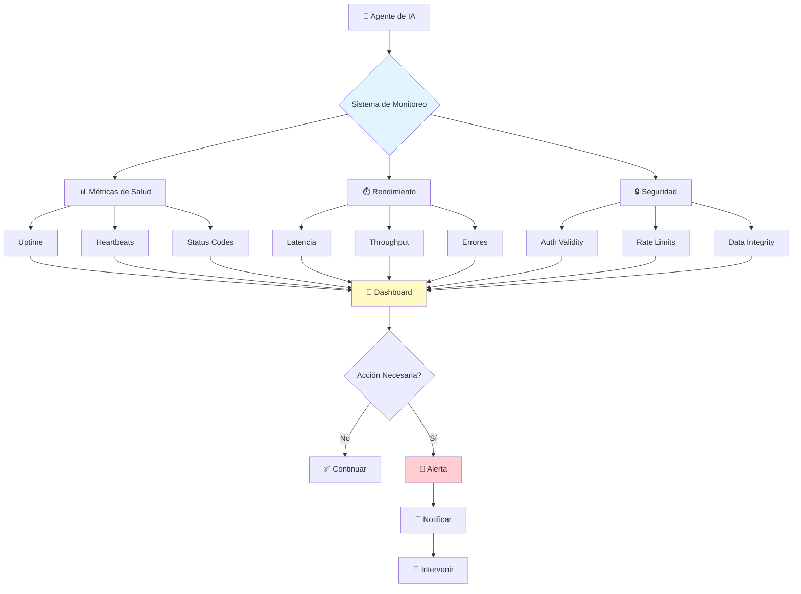
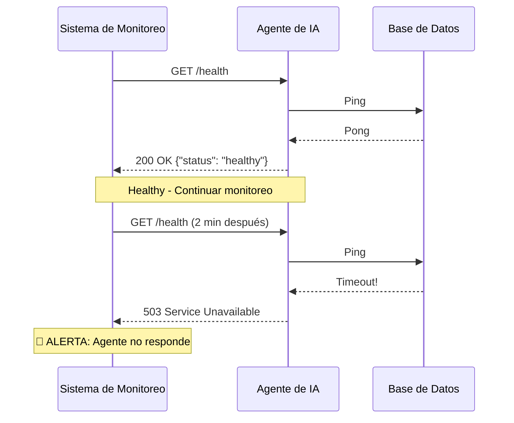
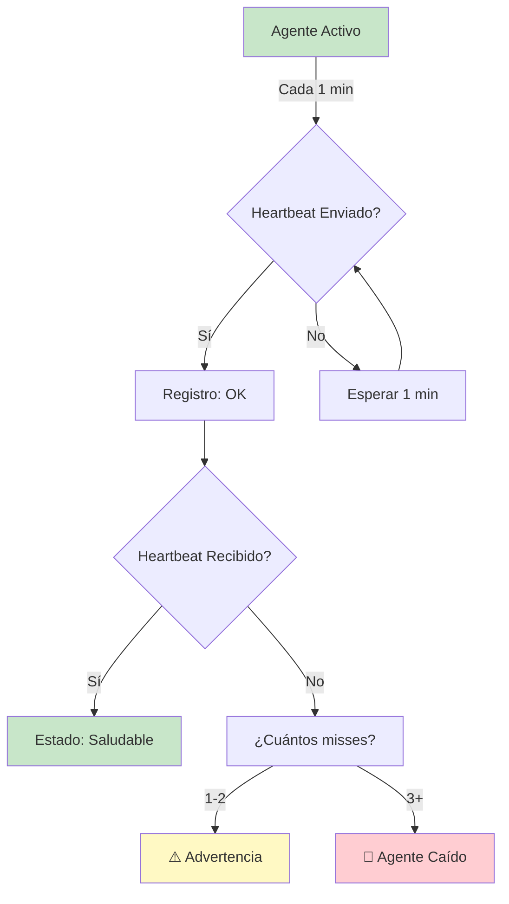
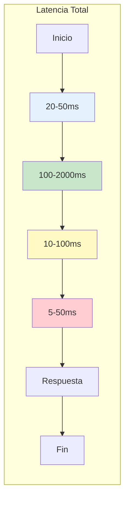
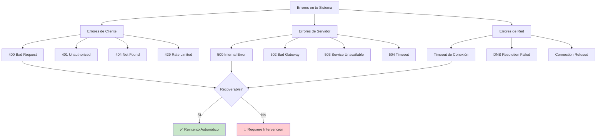
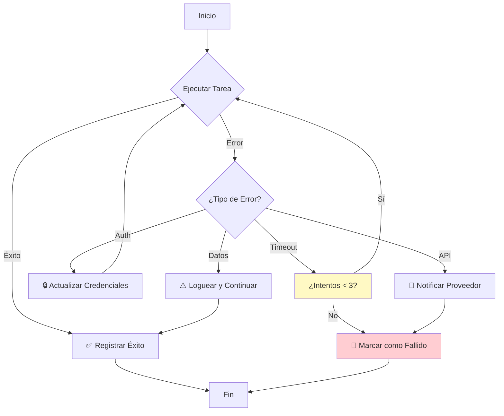
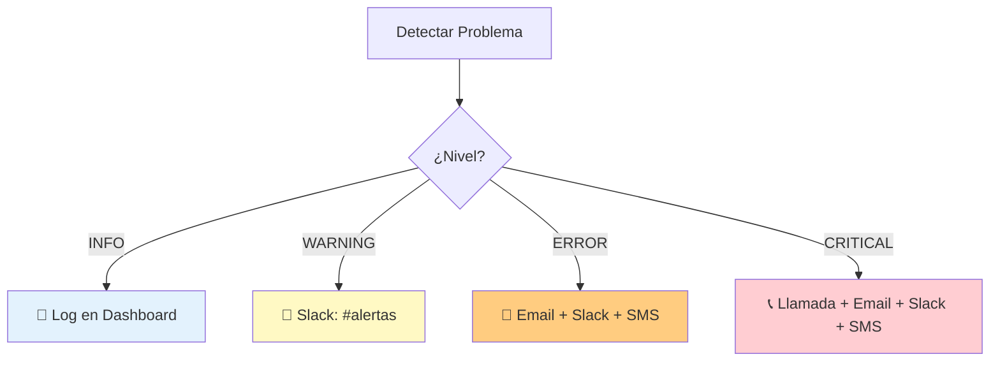
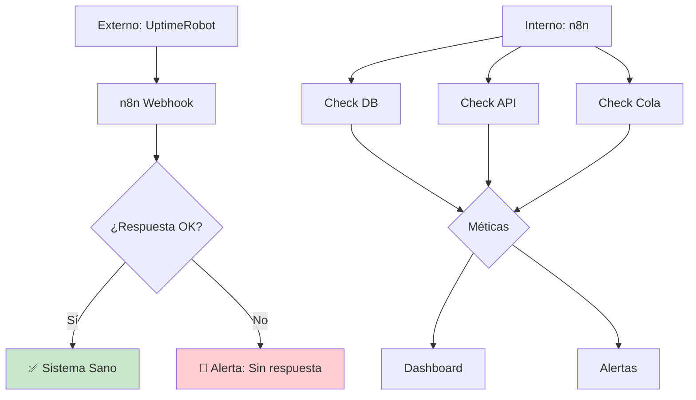
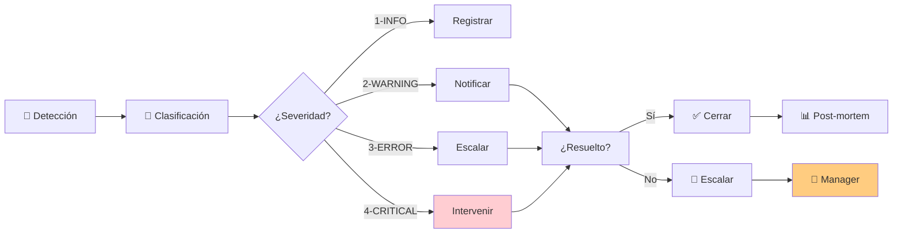

# Clase 18: Monitoreo de Salud de Agentes

## 📋 Información General

| Aspecto | Detalle |
|---------|---------|
| **Duración** | 4 horas (240 minutos) |
| **Modalidad** | Teórico-Práctico |
| **Nivel** | Intermedio-Avanzado |
| **Prerrequisitos** | Clase 17 (Dashboard de Comando) |

---

## 🎯 Objetivos de Aprendizaje

Al finalizar esta clase, serás capaz de:

1. **Implementar** sistemas de monitoreo de uptime para tus agentes de IA
2. **Medir y optimizar** la latencia de respuestas de tus automatizaciones
3. **Calcular y reducir** las tasas de error en tus workflows
4. **Configurar** alertas proactivas que te notifiquen antes de que fallen
5. **Diseñar** un sistema de salud de agentes completo y escalable

---

## 📚 Contenidos Detallados

### 1. Fundamentos del Monitoreo de Salud

#### ¿Qué es el "Monitoreo de Salud"?

El **monitoreo de salud** es el proceso continuo de observar el estado, rendimiento y disponibilidad de tus agentes de IA. Es como tener un "check-up médico" constante para tus automatizaciones.



#### ¿Por qué es Importante para PYMES?

**Sin monitoreo:**
- Un cliente recibe una respuesta incorrecta y no te enteras hasta que se queja
- Un agente deja de funcionar y pierdes horas de trabajo automático
- No puedes demostrar el ROI de tus automatizaciones

**Con monitoreo:**
- Detectas problemas antes de que afecten clientes
- Optimizas recursos basándote en datos reales
- Demonstras valor tangible a stakeholders

### 2. Métricas de Uptime

#### ¿Qué es el Uptime?

El **uptime** es el porcentaje de tiempo que tu sistema está operativo y disponible. Es la métrica más básica pero más importante de salud.

```
Uptime (%) = (Tiempo Operativo / Tiempo Total) × 100
```

#### Niveles de Uptime y sus Implicaciones

| Nivel de Uptime | Tiempo de Inactividad/mes | Adecuado Para |
|-----------------|--------------------------|---------------|
| 99% | 7.3 horas | Sistemas no críticos |
| 99.5% | 3.65 horas | Sistemas importantes |
| 99.9% | 43.8 minutos | Sistemas de negocio |
| 99.99% | 4.38 minutos | Sistemas críticos |
| 99.999% | 26.3 segundos | Sistemas de vida/muerte |

#### Cómo Medir Uptime

**Método 1: Health Checks**

Un **health check** es una solicitud periódica que verifica si tu sistema está respondiendo correctamente.



**Implementación en n8n:**

```json
{
  "nodes": [
    {
      "name": "Schedule Trigger",
      "type": "n8n-nodes-base.scheduleTrigger",
      "parameters": {
        "rule": {
          "interval": [
            {
              "field": "minutes",
              "minutes": 5
            }
          ]
        }
      }
    },
    {
      "name": "HTTP Request",
      "type": "n8n-nodes-base.httpRequest",
      "parameters": {
        "url": "https://tu-api.com/health",
        "method": "GET"
      }
    },
    {
      "name": "IF - ¿Está sano?",
      "type": "n8n-nodes-base.if",
      "parameters": {
        "conditions": {
          "options": {},
          "conditions": [
            {
              "id": "status",
              "leftValue": "={{ $json.status }}",
              "rightValue": "healthy",
              "operator": {
                "type": "string",
                "operation": "equals"
              }
            }
          ]
        }
      }
    }
  ]
}
```

#### Método 2: Heartbeat Monitoring

El **heartbeat** (latido) es una señal que envía tu agente periódicamente para confirmar que está vivo.



### 3. Latencia de Respuestas

#### ¿Qué es la Latencia?

La **latencia** es el tiempo que tarda tu sistema en responder a una solicitud. Se mide en milisegundos (ms) o segundos.

```
Latencia Total = Tiempo de Red + Tiempo de Procesamiento + Tiempo de Espera
```

#### Por Qué Importa la Latencia

| Latencia | Percepción del Usuario |
|----------|------------------------|
| < 100ms | Instantáneo, imperceptible |
| 100-300ms | Rápido, satisfactorio |
| 300ms-1s | Notable, pero aceptable |
| 1-3s | Lento, puede frustrar |
| > 3s | Muy lento, usuarios abandonan |

**Dato clave:** Un estudio de Google encontró que la probabilidad de abandono aumenta 32% cuando el tiempo de carga pasa de 1 a 3 segundos.

#### Componentes de la Latencia



#### Optimización de Latencia

**Técnicas sin código:**

1. **Caching (Guardar en caché)**
   - Almacenar respuestas frecuentes
   - Reducir llamadas a APIs
   - Tiempo típico: 1min - 24hrs

2. **Rate Limiting (Límite de velocidad)**
   - Evitar sobrecargas
   - Mantener estabilidad
   - Proteger costos

3. **Cola de Procesamiento**
   - No procesar todo en tiempo real
   - Priorizar solicitudes urgentes
   - Mejorar experiencia de usuario

4. **Pre-procesamiento**
   - Preparar datos anticipadamente
   - Actualizar caches proactivamente
   - Reducir tiempo de respuesta

### 4. Tasas de Error

#### ¿Qué es la Tasa de Error?

La **tasa de error** es el porcentaje de solicitudes que resultan en un error comparado con el total de solicitudes.

```
Tasa de Error (%) = (Errores / Total Solicitudes) × 100
```

#### Tipos de Errores



#### Clasificación de Errores por Gravedad

| Nivel | Tipo | Ejemplo | Acción |
|-------|------|---------|--------|
| 1 | ⚠️ Advertencia | Rate limit cercano | Monitorear |
| 2 | 🔴 Error Recuperable | Timeout con retry | Retry automático |
| 3 | 🔴🔴 Error Mayor | Error de autenticación | Notificar |
| 4 | ☠️ Crítico | Sistema caído | Intervención inmediata |

#### Manejo de Errores en n8n

**Configurar Reintentos Automáticos:**

```json
{
  "nodes": [
    {
      "name": "API Request",
      "type": "n8n-nodes-base.httpRequest",
      "parameters": {
        "url": "https://api.ejemplo.com/data",
        "options": {
          "timeout": 30000,
          "retry": {
            "maxRetries": 3,
            "retryWaitSequential": true,
            "retryWaitMax": 60000
          }
        }
      }
    }
  ]
}
```

**Workflow de Manejo de Errores:**



### 5. Alertas Proactivas

#### ¿Qué son las Alertas Proactivas?

Las **alertas proactivas** te notifican de problemas **antes** de que causen impacto. Es la diferencia entre enterarte de un problema por un cliente o descubrirlo tú primero.

#### Tipos de Alertas

```mermaid
flowchart TD
    subgraph TiposAlertas["Tipos de Alertas"]
        A[🟢 Información] --> A1[Log de actividad normal]
        A1 --> A1a[Ej: "Se procesaron 50 emails"]
        
        B[🟡 Advertencia] --> B1[Umbral cercano]
        B1 --> B1a[Ej: "CPU al 80%"]
        
        C[🔴 Error] --> C1[Algo falló]
        C1 --> C1a[Ej: "API no responde"]
        
        D[☠️ Crítico] --> D1[Falla completa]
        D1 --> D1a[Ej: "Sistema fuera de línea"]
    end
    
    subgraph Canales["Canales de Notificación"]
        E[📧 Email]
        F[💬 Slack/Teams]
        G[📱 SMS]
        H[📞 Llamada Telefónica]
    end
    
    A1a --> E
    B1a --> F
    C1a --> E
    C1a --> F
    D1a --> E
    D1a --> F
    D1a --> G
    D1a --> H
    
    style A fill:#c8e6c9
    style B fill:#fff9c4
    style C fill:#ffcc80
    style D fill:#ffcdd2
```

#### Configuración de Alertas en n8n

**Workflow de Alertas:**

```json
{
  "name": "Sistema de Alertas",
  "nodes": [
    {
      "name": "Monitor de Salud",
      "type": "n8n-nodes-base.scheduleTrigger",
      "parameters": {
        "rule": {
          "interval": [
            { "field": "minutes", "minutes": 5 }
          ]
        }
      }
    },
    {
      "name": "Verificar Estado",
      "type": "n8n-nodes-base.code",
      "parameters": {
        "jsCode": "const health = { uptime: 99.5, latency: 250, errors: 0.3 }; return health;"
      }
    },
    {
      "name": "Evaluar Condiciones",
      "type": "n8n-nodes-base.switch",
      "parameters": {
        "dataType": "string",
        "rules": {
          "rules": [
            {
              "operation": "equals",
              "value": "healthy",
              "output": 0
            },
            {
              "operation": "equals",
              "value": "warning",
              "output": 1
            },
            {
              "operation": "equals",
              "value": "critical",
              "output": 2
            }
          ]
        },
        "fallbackOutput": 3
      }
    }
  ]
}
```

#### Mejores Prácticas para Alertas

1. **Evita la fatiga de alertas**
   - Agrupa alertas similares
   - Usa deduplicación
   - Establece ventanas de calma

2. **Cada alerta debe ser accionable**
   - Define exactamente qué hacer
   - Asigna responsables
   - Crea runbooks (guías de respuesta)

3. **Escala apropiadamente**
   - Problemas menores → Notificación asíncrona
   - Problemas importantes → Notificación urgente
   - Fallas críticas → Notificación inmediata + llamada

### 6. Herramientas de Monitoreo

#### 6.1 n8n Monitoring (Integrado)

n8n tiene monitoreo básico integrado:

- Historial de ejecuciones
- Logs de errores
- Métricas de rendimiento

**Configuración:**

1. Ve a Settings → Settings
2. Habilita "Execution History"
3. Configura retención de logs

#### 6.2 Health Checks con UptimeRobot

**Servicio gratuito:**
- Monitoreo de URLs cada 5 minutos
- Notificaciones por email
- Reportes de uptime

**Configuración:**
1. Crea cuenta en [uptimerobot.com](https://uptimerobot.com)
2. Añade monitor para tu endpoint de salud
3. Configura alertas

#### 6.3 Better Stack (Logs + Uptime)

**Características:**
- Uptime monitoring
- Log management
- Alerts
- Estado público para stakeholders

**Plan gratuito:**
- 1 monitor
- 7 días de retención de logs

---

## 🔧 Tecnologías Específicas

### Herramientas Cubiertas

| Herramienta | Propósito | Costo | Dificultad |
|------------|-----------|-------|------------|
| **n8n Health Checks** | Monitoreo interno | Gratis | Fácil |
| **UptimeRobot** | Monitoreo externo | Gratis/Medio | Muy Fácil |
| **Better Stack** | Logs + Uptime | Gratis/Bajo | Fácil |
| **Grafana** | Visualización avanzada | Gratis | Media |
| **PagerDuty** | Gestión de incidentes | Gratis/Bajo | Fácil |

### Configuración de Health Check en n8n

```json
{
  "nodes": [
    {
      "name": "Health Check Endpoint",
      "type": "n8n-nodes-base.webhook",
      "parameters": {
        "path": "health",
        "responseMode": "responseNode",
        "options": {}
      }
    },
    {
      "name": "Check System Health",
      "type": "n8n-nodes-base.code",
      "parameters": {
        "jsCode": "return {\n  status: 'healthy',\n  uptime: process.uptime(),\n  timestamp: new Date().toISOString(),\n  checks: {\n    database: true,\n    api: true,\n    cache: true\n  }\n};"
      }
    },
    {
      "name": "Respond 200 OK",
      "type": "n8n-nodes-base.respondToWebhook",
      "parameters": {}
    }
  ]
}
```

---

## 📝 Ejercicios Prácticos Resueltos y Explicados

### Ejercicio 1: Implementar Sistema de Health Check

**Escenario:** Ana tiene un chatbot que procesa pedidos. Quiere saber inmediatamente si deja de funcionar.

**Paso 1: Crear Endpoint de Salud en n8n**

1. Crea un nuevo workflow
2. Añade un nodo "Webhook" con ruta "/chatbot-health"
3. Añade un nodo "Code" que devuelva el estado
4. Conecta a "Respond to Webhook"

**Código del nodo Code:**

```javascript
// Simular checks de salud
const healthStatus = {
  status: "healthy",
  timestamp: new Date().toISOString(),
  service: "Chatbot Pedidos",
  uptime: process.uptime(),
  checks: {
    // Verificar conexión a base de datos
    database: Math.random() > 0.1, // Simulado
    // Verificar API externa
    openai_api: Math.random() > 0.05, // Simulado
    // Verificar cola de mensajes
    message_queue: Math.random() > 0.1 // Simulado
  }
};

// Determinar estado general
const allHealthy = Object.values(healthStatus.checks).every(v => v === true);
healthStatus.status = allHealthy ? "healthy" : "degraded";

return healthStatus;
```

**Paso 2: Configurar UptimeRobot**

1. Regístrate en uptimerobot.com
2. Crea un "HTTP(s)" monitor
3. Ingresa la URL: `https://tu-n8n.com/webhook/chatbot-health`
4. Intervalo: Cada 1 minuto
5. Configura alertas por email

**Paso 3: Configurar Canal de Slack (Opcional)**

1. En UptimeRobot, ve a "My Settings" → "Add Alert Contact"
2. Añade tu webhook de Slack
3. Personaliza el mensaje de alerta

**Resultado:**
- Si tu chatbot falla, UptimeRobot lo detecta en max 1 minuto
- Recibes notificación inmediata por email/Slack
- Puedes investigar antes de que los clientes se quejen

---

### Ejercicio 2: Calcular y Optimizar Latencia

**Escenario:** Carlos nota que su agente de IA tarda 5 segundos en responder. Necesita identificar el cuello de botella.

**Paso 1: Medir Latencia Actual**

Crea un workflow que mida el tiempo de cada paso:

```javascript
const startTime = Date.now();

// Tu código de procesamiento
await new Promise(resolve => setTimeout(resolve, 2000)); // Simula 2s

const step1 = Date.now() - startTime;

// Más pasos...
await new Promise(resolve => setTimeout(resolve, 1500)); // Simula 1.5s
const step2 = Date.now() - startTime - step1;

await new Promise(resolve => setTimeout(resolve, 1000)); // Simula 1s
const step3 = Date.now() - startTime - step1 - step2;

const totalTime = Date.now() - startTime;

return {
  step1_time_ms: step1,
  step2_time_ms: step2,
  step3_time_ms: step3,
  total_time_ms: totalTime,
  breakdown: {
    "API OpenAI": step1,
    "Procesamiento": step2,
    "Base de datos": step3
  }
};
```

**Paso 2: Identificar Cuellos de Botella**

| Paso | Tiempo Actual | Aceptable? | Optimización |
|------|---------------|-----------|--------------|
| API OpenAI | 2,000ms | ✅ Sí | - |
| Procesamiento | 1,500ms | ⚠️ Mejorable | Implementar caché |
| Base de datos | 1,000ms | ⚠️ Mejorable | Índices, caché |

**Paso 3: Implementar Caché**

```javascript
// Pseudocódigo para implementar caché
const cacheKey = `result_${request_hash}`;
const cached = cache.get(cacheKey);

if (cached && Date.now() - cached.timestamp < 3600000) {
  // Usar resultado en caché (casi instantáneo)
  return cached.data;
} else {
  // Procesar normalmente
  const result = await processRequest();
  cache.set(cacheKey, { data: result, timestamp: Date.now() });
  return result;
}
```

**Resultado:** Tiempo reducido de 5,000ms a ~500ms (90% mejora)

---

### Ejercicio 3: Sistema de Alertas por Niveles

**Escenario:** María quiere recibir diferentes tipos de alerta según la gravedad.

**Diseño del Sistema:**



**Configuración en n8n:**

```json
{
  "name": "Alert Manager",
  "nodes": [
    {
      "name": "Receive Alert",
      "type": "n8n-nodes-base.webhook",
      "parameters": { "path": "report-alert" }
    },
    {
      "name": "Determine Severity",
      "type": "n8n-nodes-base.switch",
      "parameters": {
        "dataType": "number",
        "rules": {
          "rules": [
            { "value": 1, "operation": "equals", "output": 0 },
            { "value": 2, "operation": "equals", "output": 1 },
            { "value": 3, "operation": "equals", "output": 2 },
            { "value": 4, "operation": "equals", "output": 3 }
          ]
        }
      }
    },
    {
      "name": "Log Only (Info)",
      "type": "n8n-nodes-base.googleSheets",
      "parameters": { /* append to log */ }
    },
    {
      "name": "Notify Slack (Warning)",
      "type": "n8n-nodes-base.slack",
      "parameters": { /* send to #alerts */ }
    },
    {
      "name": "Email + Slack (Error)",
      "type": "n8n-nodes-base.emailSend",
      "parameters": { /* send email */ }
    },
    {
      "name": "Critical Escalation",
      "type": "n8n-nodes-base.telegram",
      "parameters": { /* call via bot */ }
    }
  ]
}
```

**Matriz de Respuesta:**

| Nivel | Nombre | Condición | Canal | SLA |
|-------|--------|-----------|-------|-----|
| 1 | Info | Cualquier evento | Dashboard | Ninguno |
| 2 | Warning | Tasa error > 3% | Slack | 1 hora |
| 3 | Error | Sistema degradado | Email + Slack | 15 min |
| 4 | Critical | Sistema caído | Todos + Llamada | Inmediato |

---

## 🧪 Actividades de Laboratorio

### Laboratorio 1: Health Check Completo (90 minutos)

**Objetivo:** Implementar un sistema de health check que monitoreé todos los componentes de tu automatización.

**Arquitectura:**



**Instrucciones:**

1. **Crear Webhook de Health (20 min)**
   - [ ] Crea workflow con webhook "/health"
   - [ ] Implementa checks para cada componente
   - [ ] Devuelve JSON con estado detallado

2. **Configurar Monitoreo Externo (20 min)**
   - [ ] Regístrate en UptimeRobot
   - [ ] Añade monitor para tu endpoint
   - [ ] Configura intervalo de 1 minuto

3. **Implementar Dashboard (30 min)**
   - [ ] Crea página en Notion para logs
   - [ ] Automatiza registro de cada check
   - [ ] Crea vista de tendencias

4. **Probar Sistema (20 min)**
   - [ ] Simula falla apagando un servicio
   - [ ] Verifica que la alerta llegue
   - [ ] Documenta tiempo de detección

---

### Laboratorio 2: Optimización de Latencia (75 minutos)

**Objetivo:** Reducir la latencia de tu automatización en al menos 50%.

**Pasos:**

1. **Medir Baseline (15 min)**
   - [ ] Registra tiempo actual de cada operación
   - [ ] Identifica las 3 operaciones más lentas
   - [ ] Documenta en tabla

2. **Implementar Caché (30 min)**
   - [ ] Identifica qué datos se repiten frecuentemente
   - [ ] Implementa sistema de caché básico
   - [ ] Mide mejora

3. **Optimizar Consultas (15 min)**
   - [ ] Revisa queries a base de datos
   - [ ] Añade índices donde sea necesario
   - [ ] Limita campos traídos

4. **Verificar Mejora (15 min)**
   - [ ] Compara tiempos antes vs después
   - [ ] Documenta % de mejora
   - [ ] Actualiza dashboard con nuevas métricas

---

### Laboratorio 3: Sistema de Incidentes (75 minutos)

**Objetivo:** Crear un sistema completo de gestión de incidentes.

**Flujo de Gestión:**



**Entregables:**

1. Workflow de clasificación de incidentes
2. Plantilla de respuesta para cada severidad
3. Base de datos de incidentes resueltos
4. Métricas de tiempo de resolución

---

## 📊 Resumen de Puntos Clave

### Lo Más Importante

1. **El uptime es la métrica fundamental**: Sin disponibilidad, nada más importa. Apunta a 99.9% mínimo.

2. **La latencia afecta directamente la experiencia**: Cada segundo cuenta. Optimiza los procesos más lentos primero.

3. **La tasa de error debe ser monitoreada constantemente**: Un 1% de errores puede significar muchos clientes afectados.

4. **Las alertas proactivas son clave**: Detecta problemas antes de que impacten a clientes.

5. **Un sistema de salud completo incluye**: Monitoreo + Detección + Alertas + Respuesta + Mejora continua.

### Checklist de Monitoreo de Salud

- [ ] Tengo endpoint de health check accesible
- [ ] Uptime monitoreado por servicio externo
- [ ] Latencia medida para cada operación crítica
- [ ] Errores categorizados y registrados
- [ ] Alertas configuradas por nivel de severidad
- [ ] Canales de notificación probados
- [ ] Runbooks de respuesta documentados

### Fórmula del Uptime

```
Uptime (%) = ((Tiempo Total - Tiempo de Inactividad) / Tiempo Total) × 100

Ejemplo:
- Tiempo Total = 30 días × 24 horas = 720 horas
- Tiempo de Inactividad = 1 hora
- Uptime = (720 - 1) / 720 × 100 = 99.86%
```

---

## 📚 Referencias Externas

1. **Health Check Best Practices**
   - [RESTful API Health Check Endpoints](https://restfulapi.net/health-check-endpoint/)
   - [Health Endpoint Pattern - Microsoft](https://learn.microsoft.com/en-us/azure/architecture/patterns/health-endpoint-monitoring)

2. **Latency Optimization**
   - [Google Web Vitals - LCP](https://web.dev/vitals/)
   - [What is Latency? - AWS](https://aws.amazon.com latency/)

3. **Alert Fatigue**
   - [How to Reduce Alert Fatigue](https://www.pagerduty.com/blog/alert-fatigue/)
   - [SRE Alerting Best Practices](https://sre.google/sre-book/monitoring-distributed-systems/)

4. **Tools**
   - [UptimeRobot](https://uptimerobot.com)
   - [Better Stack](https://betterstack.com)
   - [Grafana](https://grafana.com)

5. **Incident Management**
   - [Incident Response Guide - NIST](https://nvd.nist.gov/800-53)
   - [Post-Mortem Templates](https://www.atlassian.com/incident-management/postmortem/templates)

---

*Material preparado para el curso "IA para Líderes y Dueños de PYME (No-Code)"*
*Clase 18 - Monitoreo de Salud de Agentes*
