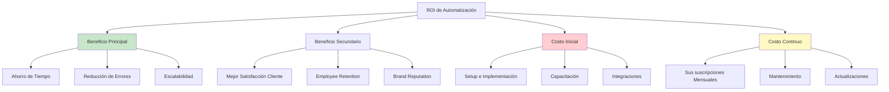
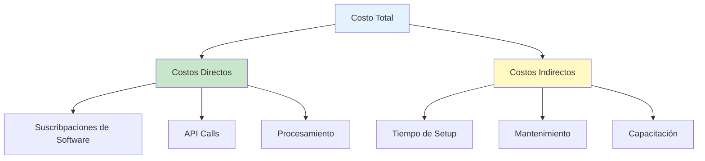
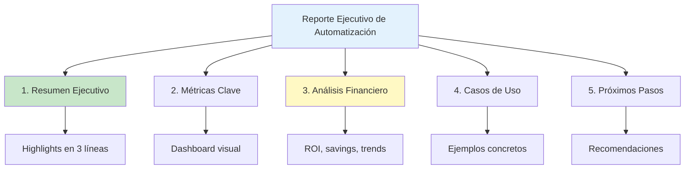
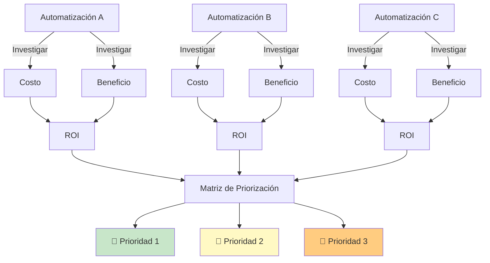

# Clase 19: Métricas de ROI para Automatización

## 📋 Información General

| Aspecto | Detalle |
|---------|---------|
| **Duración** | 4 horas (240 minutos) |
| **Modalidad** | Teórico-Práctico |
| **Nivel** | Avanzado |
| **Prerrequisitos** | Clases 17-18 (Dashboard y Monitoreo) |

---

## 🎯 Objetivos de Aprendizaje

Al finalizar esta clase, serás capaz de:

1. **Calcular** el ahorro de tiempo generado por tus automatizaciones
2. **Determinar** el costo real por transacción de tus procesos automatizados
3. **Calcular** el ROI de cualquier implementación de IA
4. **Crear** reportes ejecutivos que demuestren el valor de la automatización
5. **Tomar decisiones** de inversión basadas en datos financieros concretos

---

## 📚 Contenidos Detallados

### 1. Fundamentos del ROI en Automatización

#### ¿Qué es el ROI?

El **ROI (Return on Investment)** o Retorno sobre Inversión es una métrica financiera que compara las ganancias obtenidas con el costo de la inversión.

```
ROI (%) = ((Beneficio - Costo) / Costo) × 100
```

**Ejemplo simple:**
- Inversión: $1,000
- Beneficio generado: $3,000
- ROI = (($3,000 - $1,000) / $1,000) × 100 = 200%

Un ROI del 200% significa que por cada peso invertido, ganaste $2 adicionales.

#### Por Qué el ROI de Automatización es Diferente

El ROI de automatización tiene características únicas:



### 2. Cálculo de Ahorro de Tiempo

#### El Valor del Tiempo

El tiempo es el recurso más valioso y Limited. Calcular su valor monetario es fundamental.

**Fórmula del Valor del Tiempo:**

```
Valor Hora = Salario Mensual / (Horas trabajadas al mes)

Ejemplo:
- Salario mensual: $15,000 MXN
- Horas trabajadas: 176 (22 días × 8 horas)
- Valor hora: $15,000 / 176 = $85.23 MXN/hora
```

**Incluir Costo Total del Empleado (Factor Giusto):**

```
Valor Hora Ajustado = Salario Mensual × 1.35 / Horas trabajadas

Donde 1.35 incluye:
- 25% prestaciones (IMSS, INFONAVIT, etc.)
- 10% costos indirectos (oficina, equipo, etc.)
```

#### Medición del Ahorro de Tiempo

**Paso 1: Medir Tiempo Manual**

```
Tarea: Responder consultas frecuentes por email
- Tiempo por respuesta: 5 minutos
- Respuestas diarias: 20
- Total tiempo manual: 100 minutos = 1.67 horas/día
```

**Paso 2: Medir Tiempo Automatizado**

```
Tarea: Responder consultas frecuentes por email (automatizado)
- Tiempo por respuesta: 0 segundos (automático)
- Mantenimiento semanal: 30 minutos
- Total tiempo semanal: 30 minutos / 5 días = 6 minutos/día
```

**Paso 3: Calcular Ahorro**

```
Ahorro diario = 100 min - 6 min = 94 minutos
Ahorro mensual = 94 min × 22 días = 2,068 minutos = 34.5 horas
Ahorro anual = 34.5 horas × 12 = 414 horas

Valor monetario = 414 horas × $85.23 = $35,285 MXN/año
```

#### Herramienta de Cálculo de Tiempo

| Métrica | Manual | Automatizado | Ahorro |
|---------|--------|--------------|--------|
| Tiempo por tarea | X min | Y min | X - Y min |
| Frecuencia | /día | /día | - |
| Tiempo total/día | X × freq | Y × freq | (X-Y) × freq |
| Tiempo total/mes | ... | ... | ... |
| Tiempo total/año | ... | ... | ... |
| **Valor anual** | - | - | horas × costo/hora |

### 3. Costo por Transacción

#### ¿Qué es el Costo por Transacción?

El **costo por transacción** es cuánto te cuesta procesar una solicitud, orden, o interacción específica.

```
Costo por Transacción = Costos Totales / Número de Transacciones
```

#### Componentes del Costo Total



#### Ejemplo Práctico: Chatbot de客服

**Escenario:** Empresa con chatbot que maneja 500 conversaciones/mes

**Costos Mensuales:**

| Concepto | Costo Mensual |
|----------|---------------|
| n8n (plan profesional) | $20 USD = $340 MXN |
| OpenAI API | $30 USD = $510 MXN |
| Notion | $8 USD = $136 MXN |
| Tiempo de mantenimiento (2hrs) | $170 MXN |
| **Total** | **$1,156 MXN** |

**Métricas de Volumen:**

| Mes | Conversaciones | Tendencia |
|-----|----------------|-----------|
| Enero | 380 | - |
| Febrero | 450 | +18% |
| Marzo | 500 | +11% |
| Abril | 520 | +4% |

**Cálculo de Costo por Transacción:**

```
Costo por Conversación = $1,156 / 500 = $2.31 MXN

Para contexto:
- Si cada conversación manual cuesta $25 MXN (5 min × $5/min)
- Ahorro por conversación = $25 - $2.31 = $22.69 MXN
- Ahorro mensual total = 500 × $22.69 = $11,345 MXN
```

### 4. ROI de Implementaciones

#### Fórmula Completa del ROI

```
ROI (%) = ((Beneficio Total - Costo Total) / Costo Total) × 100

Donde:
Beneficio Total = Ahorro Directo + Ingresos Adicionales + Beneficios Intangibles
Costo Total = Costos de Setup + Costos Operativos (12 meses)
```

#### Tipos de Beneficios

**Beneficios Tangibles (Cuantificables):**

1. Ahorro en tiempo de personal
2. Reducción de costos operativos
3. Aumento de ventas por mejor atención
4. Reducción de errores (costo de rework)
5. Disminución de rotación de personal

**Beneficios Intangibles (Difíciles de cuantificar):**

1. Satisfacción del cliente
2. Reputación de marca
3. Moral del equipo
4. Agilidad de respuesta
5. Capacidad de escalar

#### Ejemplo Completo: Automatización de Agenda

**Inversión Inicial:**

| Concepto | Costo |
|----------|-------|
| Configuración de workflow | $3,000 MXN |
| Capacitación | $1,000 MXN |
| Integraciones | $500 MXN |
| **Total Setup** | **$4,500 MXN** |

**Costos Operativos Mensuales:**

| Concepto | Costo Mensual |
|----------|---------------|
| n8n | $170 MXN |
| Calendly | $0 (plan gratuito) |
| Twilio (SMS) | $150 MXN |
| Mantenimiento | $200 MXN |
| **Total Mensual** | **$520 MXN** |

**Beneficios Tangibles:**

| Beneficio | Cálculo | Valor Mensual |
|-----------|---------|---------------|
| Horas receptionist ahorradas | 5 hrs × $100/hora | $500 MXN |
| Citas perdidas reducidas | 10% menos = 8 citas × $500 | $4,000 MXN |
| Reprogramaciones | 50% reducción × 20 × 30 min × $100/hr | $5,000 MXN |
| **Total Beneficios Mensuales** | | **$9,500 MXN** |

**Cálculo del ROI (Primer Año):**

```
Costo Primer Año = $4,500 + ($520 × 12) = $4,500 + $6,240 = $10,740 MXN

Beneficio Primer Año = $9,500 × 12 = $114,000 MXN

ROI = (($114,000 - $10,740) / $10,740) × 100 = 961%

Período de Retorno = $10,740 / $9,500 = 1.13 meses
```

### 5. Reportes Ejecutivos

#### Estructura de un Reporte Ejecutivo

Un buen reporte ejecutivo para automatización debe ser:



#### Plantilla de Reporte Ejecutivo

```
╔══════════════════════════════════════════════════════════════════╗
║           REPORTE EJECUTIVO: AUTOMATIZACIÓN CON IA               ║
║                    [Nombre de la Empresa]                        ║
║                    Periodo: [Mes/Año]                            ║
╠══════════════════════════════════════════════════════════════════╣
║                                                                  ║
║  📊 RESUMEN EJECUTIVO                                           ║
║  ─────────────────────────────────────────────────────────────  ║
║  La implementación de [agente/sistema] ha generado:            ║
║  • Ahorro de [X] horas mensuales de trabajo manual              ║
║  • Reducción de [X]% en tiempo de respuesta                     ║
║  • ROI acumulado de [X]% en [X] meses                           ║
║                                                                  ║
║  💰 IMPACTO FINANCIERO                                           ║
║  ─────────────────────────────────────────────────────────────  ║
║  Inversión Total:           $XXX,XXX                             ║
║  Beneficios Acumulados:     $XXX,XXX                             ║
║  ROI:                       XXX%                                 ║
║  Período de Retorno:        X.X meses                            ║
║                                                                  ║
║  📈 MÉTRICAS OPERATIVAS                                          ║
║  ─────────────────────────────────────────────────────────────  ║
║  Transacciones procesadas:  X,XXX                                ║
║  Tasa de éxito:              XX.X%                                ║
║  Tiempo promedio:            XX.X seg                            ║
║  Costo por transacción:      $XX.XX                               ║
║                                                                  ║
║  🔮 PRÓXIMOS PASOS                                               ║
║  ─────────────────────────────────────────────────────────────  ║
║  1. [Recomendación 1]                                            ║
║  2. [Recomendación 2]                                            ║
║  3. [Recomendación 3]                                            ║
║                                                                  ║
╚══════════════════════════════════════════════════════════════════╝
```

### 6. Herramientas de Cálculo y Reportes

#### 6.1 Google Sheets / Excel para ROI

**Ventajas:**
- ✅ Flexibilidad total
- ✅ Fórmulas automáticas
- ✅ Integración con datos
- ✅ Compartible

**Plantilla Recomendada:**

| | A | B | C | D |
|---|------|------|------|------|
| 1 | **CÁLCULO DE ROI** | | | |
| 2 | | | | |
| 3 | **COSTOS** | Mes 1 | Mes 2 | Mes 3 |
| 4 | Suscripciones | $100 | $100 | $100 |
| 5 | Mantenimiento | $50 | $50 | $50 |
| 6 | Tiempo setup | $200 | $0 | $0 |
| 7 | **Total Costos** | =SUM(B4:B6) | =SUM(C4:C6) | =SUM(D4:D6) |
| 8 | | | | |
| 9 | **BENEFICIOS** | | | |
| 10 | Horas ahorradas | 20 | 40 | 50 |
| 11 | Valor hora | $10 | $10 | $10 |
| 12 | Ahorro tiempo | =B10*B11 | =C10*C11 | =D10*D11 |
| 13 | Errores evitados | $50 | $100 | $150 |
| 14 | **Total Beneficios** | =B12+B13 | =C12+C13 | =D12+D13 |
| 15 | | | | |
| 16 | **ROI** | =((B14-B7)/B7)*100 | =((C14-C7)/C7)*100 | =((D14-D7)/D7)*100 |

#### 6.2 Looker Studio (Google Data Studio)

**Ventajas:**
- ✅ Gratis
- ✅ Actualización automática
- ✅ Dashboards visuales
- ✅ Integración con Google Sheets

**Crear Dashboard de ROI:**

1. Conectar fuente de datos (Google Sheets)
2. Añadir gráficos:
   - Gráfico de línea: ROI por mes
   - Gráfico de barras: Costos vs Beneficios
   - Indicador: ROI acumulado
   - Tabla: Detalle de métricas

#### 6.3 Notion para Reportes

**Ventajas:**
- ✅ Documentación + métricas
- ✅ Fácil de compartir
- ✅ Actualización en tiempo real

---

## 🔧 Tecnologías Específicas

### Herramientas de Cálculo Financiero

| Herramienta | Propósito | Costo | Mejor Para |
|------------|-----------|-------|------------|
| **Google Sheets** | Cálculos y plantillas | Gratis | Flexibilidad total |
| **Looker Studio** | Dashboards de BI | Gratis | Visualización |
| **Notion** | Reportes + Docs | Gratis | Presentaciones |
| **Zoho Analytics** | BI avanzado | Medio | Análisis profundo |

### Fórmulas Clave para Google Sheets

```javascript
// ROI Mensual
=(Beneficio - Costo) / Costo

// ROI Acumulado
=(SUMA(Beneficios) - SUMA(Costos)) / SUMA(Costos)

// Período de Retorno (meses)
=Costo Inicial / Beneficio Mensual Promedio

// Valor del Tiempo
=(Salario Mensual * 1.35) / (Días Laborables * Horas por Día)

// Costo por Transacción
=Total Costos / Total Transacciones
```

---

## 📝 Ejercicios Prácticos Resueltos y Explicados

### Ejercicio 1: Calcular ROI de Agente de Respuesta a Emails

**Escenario:** Ana tiene una boutique online. Actualmente su equipo dedica 3 horas diarias a responder emails de consultas. Quiere automatizar el 70% de las respuestas.

**Datos收集:**

| Concepto | Valor |
|----------|-------|
| Salario promedio equipo (2 personas) | $12,000 MXN/mes c/u |
| Horas diarias en emails | 3 horas |
| Días laborales | 22/mes |
| Emails/día | 40 |
| % automatizables | 70% |

**Paso 1: Calcular Valor del Tiempo**

```
Costo hora = ($12,000 × 2) / (22 × 8) = $24,000 / 176 = $136.36 MXN/hora

Tiempo mensual actual = 3 horas × 22 días = 66 horas
Costo mensual actual = 66 × $136.36 = $9,000 MXN
```

**Paso 2: Calcular Costos de Automatización**

| Concepto | Costo Mensual |
|----------|---------------|
| n8n | $170 MXN |
| OpenAI API (300 solicitudes) | $15 USD = $255 MXN |
| Mantenimiento (1hr/mes) | $136 MXN |
| **Total** | **$561 MXN** |

**Paso 3: Calcular Beneficios**

```
Tiempo automatizado = 66 horas × 70% = 46.2 horas
Costo automatizado mensual = 66 × 30% × $136.36 = $2,700 MXN
Ahorro mensual = $9,000 - $2,700 - $561 = $5,739 MXN

Beneficio anual = $5,739 × 12 = $68,868 MXN
```

**Paso 4: Calcular ROI**

```
Setup inicial = $3,000 MXN (configuración)
Costo primer año = $3,000 + ($561 × 12) = $9,732 MXN

ROI = (($68,868 - $9,732) / $9,732) × 100 = 608%

Período de retorno = $9,732 / $5,739 = 1.7 meses
```

**Paso 5: Presentar Resultados**

```
╔════════════════════════════════════════════╗
║       ANÁLISIS ROI: Agente de Emails       ║
╠════════════════════════════════════════════╣
║                                            ║
║  📊 INVERSIÓN                              ║
║  Setup:           $3,000 MXN                ║
║  Operación/mes:   $561 MXN                 ║
║  Primer año:      $9,732 MXN                ║
║                                            ║
║  💰 BENEFICIOS                             ║
║  Ahorro mensual:  $5,739 MXN                ║
║  Ahorro anual:   $68,868 MXN               ║
║                                            ║
║  📈 RESULTADOS                             ║
║  ROI:            608%                       ║
║  Retorno:        1.7 meses                  ║
║                                            ║
║  ✅ DECISIÓN: VIABLE - PROCEDER            ║
║                                            ║
╚════════════════════════════════════════════╝
```

---

### Ejercicio 2: Costo por Transacción para Proceso de Cotizaciones

**Escenario:** Carlos tiene una PYME de servicios. Currently, cada cotización toma 45 minutos de trabajo manual. Quiere saber si vale la pena automatizar.

**Datos收集:**

| Concepto | Manual | Automatizado |
|----------|--------|--------------|
| Tiempo por cotización | 45 min | 5 min |
| Costo hora empleado | $100 MXN | $100 MXN |
| Cotizaciones/mes | 80 | 80 |

**Paso 1: Calcular Costo Manual**

```
Costo por cotización = 45 min × ($100/60) = $75 MXN
Costo mensual = 80 × $75 = $6,000 MXN
```

**Paso 2: Calcular Costo Automatizado**

| Concepto | Costo |
|----------|-------|
| Herramientas (n8n + API) | $400 MXN/mes |
| Tiempo atención | 5 min × 80 × ($100/60) = $667 MXN |
| **Total mensual** | **$1,067 MXN** |

**Paso 3: Comparar y Decidir**

```
Ahorro mensual = $6,000 - $1,067 = $4,933 MXN
Ahorro anual = $4,933 × 12 = $59,196 MXN

Costo por transacción:
- Manual: $75 MXN
- Automatizado: $1,067 / 80 = $13.34 MXN
- Ahorro por transacción: $61.66 MXN
```

**Resultado:**

```
╔════════════════════════════════════════════╗
║     ANÁLISIS: Cotizaciones Automatizadas   ║
╠════════════════════════════════════════════╣
║                                            ║
║  Costo por transacción:                    ║
║  Manual:       $75.00 MXN                  ║
║  Automatizado: $13.34 MXN                 ║
║  Ahorro:       $61.66 MXN (82%)            ║
║                                            ║
║  ROI proyectado: 540%                      ║
║  Período de retorno: 1 mes                 ║
║                                            ║
║  ✅ RECOMENDACIÓN: ALTA PRIORIDAD          ║
║                                            ║
╚════════════════════════════════════════════╝
```

---

### Ejercicio 3: Dashboard de ROI en Google Sheets

**Objetivo:** Crear un dashboard que muestre el ROI actualizado automáticamente.

**Estructura del Sheet:**

**Hoja 1: "Configuración"**

| Variable | Valor |
|----------|-------|
| Salario hourly | $100 |
| Días laborales/mes | 22 |
| Tipo de cambio USD/MXN | 17 |

**Hoja 2: "Métricas"**

| Fecha | Transacciones | Tiempo Ahorrado (hrs) | Costo Mensual | Beneficio |
|-------|---------------|----------------------|----------------|-----------|
| 01/03/2026 | 150 | 15 | $500 | $1,500 |
| 01/04/2026 | 180 | 18 | $520 | $1,800 |

**Hoja 3: "Dashboard"**

```
=SPARKLINE(B2:B13)  // Gráfico de tendencias
=SUM(C2:C13)        // Total horas ahorradas
=SUM(E2:E13)        // Total beneficios
=ROI!ROI            // Referencia a cálculo de ROI
```

**Fórmulas de ROI:**

```javascript
// En una celda separada
=((SUM(E2:E13)) - (SUM(D2:D13))) / (SUM(D2:D13)))
```

**Resultado Visual:**

```
╔═══════════════════════════════════════════════════╗
║           DASHBOARD ROI - Automatización          ║
║                    Abril 2026                      ║
╠═══════════════════════════════════════════════════╣
║                                                   ║
║   💰 ROI ACUMULADO        📊 TRANSACCIONES         ║
║   ┌─────────────────┐    ┌─────────────────┐       ║
║   │     287%        │    │      520        │       ║
║   │   ▲ 45% vs mes  │    │   ▲ 20% vs mes  │       ║
║   └─────────────────┘    └─────────────────┘       ║
║                                                   ║
║   ⏱️ TIEMPO AHORRADO    💵 AHORRO TOTAL           ║
║   ┌─────────────────┐    ┌─────────────────┐       ║
║   │    156 horas    │    │   $45,200 MXN   │       ║
║   │   = 6.5 días    │    │   = 452 horas    │       ║
║   └─────────────────┘    └─────────────────┘       ║
║                                                   ║
║   📈 TENDENCIA ÚLTIMOS 6 MESES                     ║
║   ▓▓▓▓▓▓▓▓▓▓▓▓▓▓▓▓▓▓                              ║
║                                                   ║
╚═══════════════════════════════════════════════════╝
```

---

## 🧪 Actividades de Laboratorio

### Laboratorio 1: Calculadora de ROI Completa (90 minutos)

**Objetivo:** Crear una calculadora de ROI en Google Sheets que puedas usar para cualquier automatización.

**Instrucciones:**

1. **Crear Nueva Hoja de Cálculo (10 min)**
   - [ ] Crear archivo "Calculadora ROI"
   - [ ] Crear 3 hojas: Config, Cálculos, Dashboard

2. **Configurar Variables (20 min)**
   - [ ] Hoja Config con:
     - Salarios por rol
     - Costos de herramientas
     - Tipo de cambio
   - [ ] Añadirvalidación de datos para inputs

3. **Implementar Fórmulas (40 min)**
   - [ ] Cálculo de valor hora
   - [ ] Costo por transacción manual
   - [ ] Costo por transacción automatizada
   - [ ] Ahorro mensual y anual
   - [ ] ROI con y sin setup
   - [ ] Período de retorno

4. **Crear Dashboard (20 min)**
   - [ ] Gráficos de tendencia
   - [ ] Indicadores clave (KPI cards)
   - [ ] Tabla de resumen

**Entregable:** Link a tu calculadora funcional

---

### Laboratorio 2: Reporte Ejecutivo para Stakeholders (75 minutos)

**Objetivo:** Crear un reporte ejecutivo profesional para presentar el ROI de una automatización.

**Escenario:** Tu jefe quiere saber si vale la pena la inversión en el chatbot de IA.

**Pasos:**

1. **Reunir Datos (20 min)**
   - [ ] Métricas de uso (conversaciones, satisfacción)
   - [ ] Tiempos de respuesta
   - [ ] Costos de herramientas
   - [ ] Encuestas de satisfacción (si hay)

2. **Calcular Impacto Financiero (25 min)**
   - [ ] Aplicar fórmula de ROI
   - [ ] Comparar vs proceso manual
   - [ ] Proyectar próximos 12 meses

3. **Crear Presentación (30 min)**
   - [ ] Usar plantilla proporcionada
   - [ ] Incluir 3-5 visualizaciones
   - [ ] Añadir testimonios o casos de uso

**Entregable:** PDF de reporte ejecutivo (1-2 páginas)

---

### Laboratorio 3: Análisis de Múltiples Automatizaciones (75 minutos)

**Objetivo:** Comparar el ROI de diferentes automatizaciones para priorizarlas.

**Método:**



**Instrucciones:**

1. **Identificar 3 Automatizaciones (15 min)**
   - [ ] Proceso de emails
   - [ ] Agendamiento
   - [ ] Reportes automáticos

2. **Calcular ROI de Cada Una (30 min)**
   - [ ] Usar calculadora del Laboratorio 1
   - [ ] Documentar supuestos
   - [ ] Calcular ROI y período de retorno

3. **Crear Matriz de Decisión (30 min)**
   - [ ] Comparar lado a lado
   - [ ] Considerar: ROI, tiempo de implementación, complejidad
   - [ ] Hacer recomendación priorizada

**Entregable:** Matriz comparativa con recomendación

---

## 📊 Resumen de Puntos Clave

### Fórmulas Esenciales

```
1. Valor Hora = Salario Mensual × 1.35 / (Días × Horas)
   
2. Costo por Transacción = Costo Total / Número de Transacciones
   
3. ROI (%) = ((Beneficio - Costo) / Costo) × 100
   
4. Período de Retorno = Inversión Inicial / Beneficio Mensual
   
5. Ahorro de Tiempo = (Tiempo Manual - Tiempo Automatizado)
```

### Tipos de Beneficios a Considerar

**Tangibles:**
- Horas de trabajo ahorradas
- Errores evitados
- Ventas adicionales por mejor atención
- Costos de adquisición reducidos

**Intangibles:**
- Satisfacción del cliente
- Moral del equipo
- Reputación de marca
- Capacidad de innovación

### Errores Comunes en Cálculo de ROI

1. ❌ No incluir costos indirectos (prestaciones, herramientas)
2. ❌ Sobreestimar beneficios
3. ❌ Ignorar el tiempo de implementación
4. ❌ No considerar costos de mantenimiento
5. ❌ No medir resultados reales post-implementación

### Checklist de ROI

- [ ] Calculé el valor real del tiempo de mi equipo
- [ ] Identifiqué TODOS los costos (setup + operación)
- [ ] Mido beneficios tangibles e intangibles
- [ ] Documenté supuestos y fuentes
- [ ] Creé dashboard de seguimiento
- [ ] Reviso ROI mensualmente

---

## 📚 Referencias Externas

1. **ROI y Métricas Financieras**
   - [Investopedia - ROI](https://www.investopedia.com/terms/r/returnoninvestment.asp)
   - [Harvard Business Review - Measuring ROI](https://hbr.org/topic/measuring-roi)

2. **Automatización y Productividad**
   - [McKinsey - Automation Potential](https://www.mckinsey.com/featured-insights/future-of-work/automation-and-the-future-of-work)

3. **Herramientas de Cálculo**
   - [Google Sheets Templates](https://www.google.com/sheets/about/)
   - [Looker Studio](https://lookerstudio.google.com/)

4. **Reportes Ejecutivos**
   - [Executive Report Templates](https://www.venngage.com/blog/executive-report-template/)
   - [How to Write an Executive Summary](https://www.forbes.com/sites/forbesbusinesscouncil/2023/05/03/how-to-write-an-effective-executive-summary/)

5. **Estadísticas de Automatización**
   - [Statista - Automation Market](https://www.statista.com/topics/4637/automation/)
   - [Deloitte - AI ROI](https://www2.deloitte.com/us/en/insights/industry/technology/technology-media-and-telecom-predictions/2024/ai-roi-survey.html)

---

## 📎 Plantilla de Reporte de ROI

```markdown
# Reporte de ROI: [Nombre del Proyecto]
**Empresa:** [Nombre]
**Periodo:** [Fecha inicio] - [Fecha fin]
**Preparado por:** [Tu nombre]

## 1. Resumen Ejecutivo (3-5 líneas)
[Resumen de resultados principales]

## 2. Inversión Total
| Concepto | Monto |
|----------|-------|
| Setup | $X |
| Mensual | $Y |
| Año 1 | $Z |

## 3. Beneficios Cuantificados
| Tipo | Mensual | Anual |
|------|---------|-------|
| Ahorro tiempo | $X | $Y |
| Errores evitados | $X | $Y |
| Ingresos adicionales | $X | $Y |
| **Total** | $X | $Y |

## 4. Resultados Financieros
- **ROI:** X%
- **Período de Retorno:** X meses
- **VAN (si aplica):** $X

## 5. Métricas Operativas
| Métrica | Antes | Después | Mejora |
|---------|-------|---------|--------|
| Tiempo/proceso | X min | Y min | Z% |
| Errores/mes | X | Y | Z% |
| Satisfacción | X% | Y% | Z% |

## 6. Próximos Pasos
1. [Acción 1]
2. [Acción 2]

## 7. Aprobación
□ Apruebo implementación
□ Requiere ajustes
□ No viable por ahora

Firma: _____________ Fecha: _____________
```

---

*Material preparado para el curso "IA para Líderes y Dueños de PYME (No-Code)"*
*Clase 19 - Métricas de ROI para Automatización*
