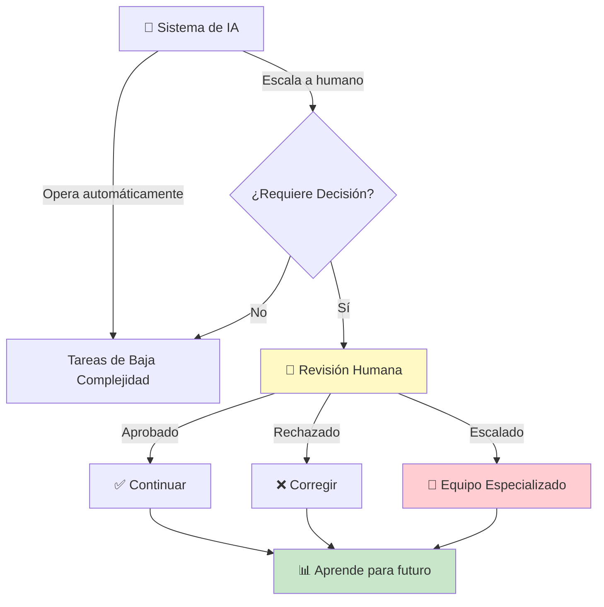
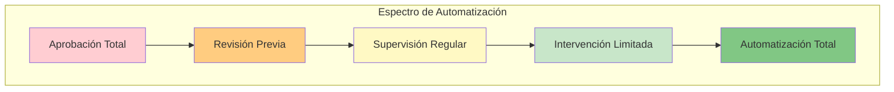
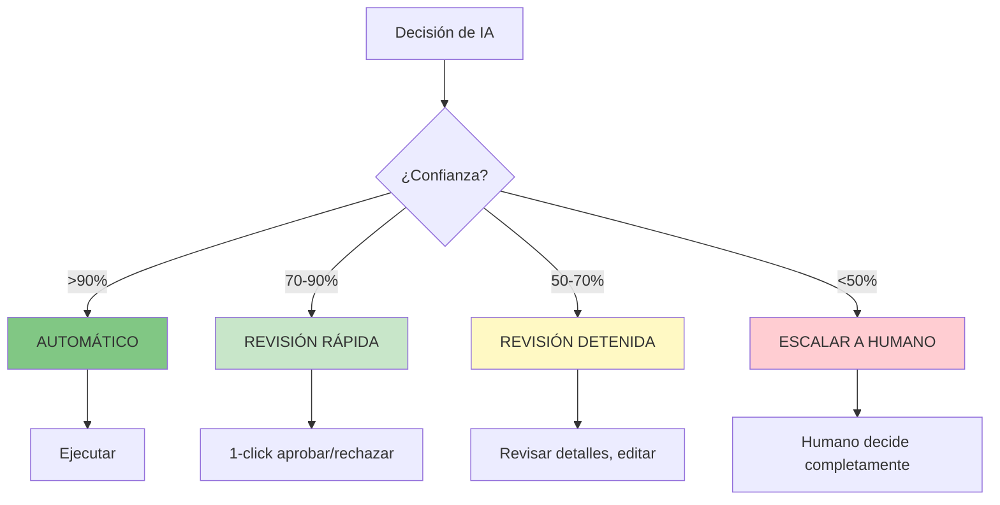
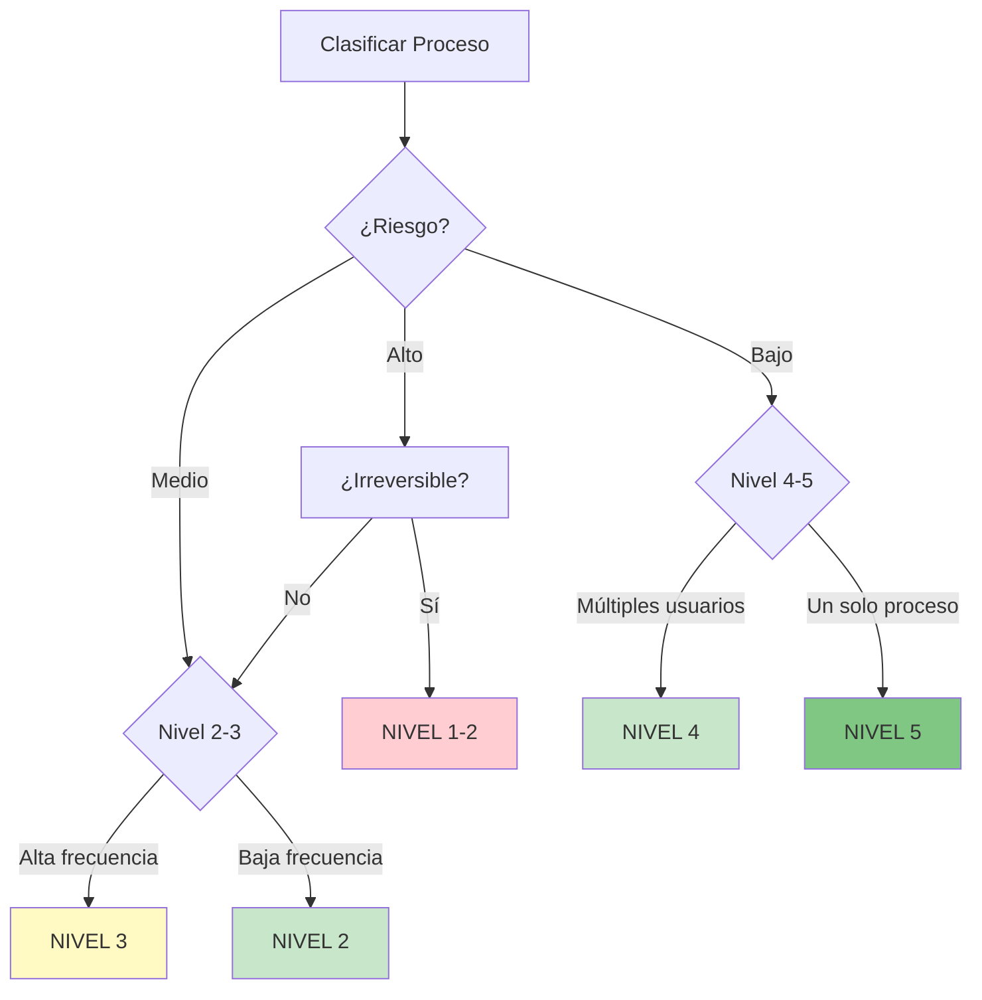
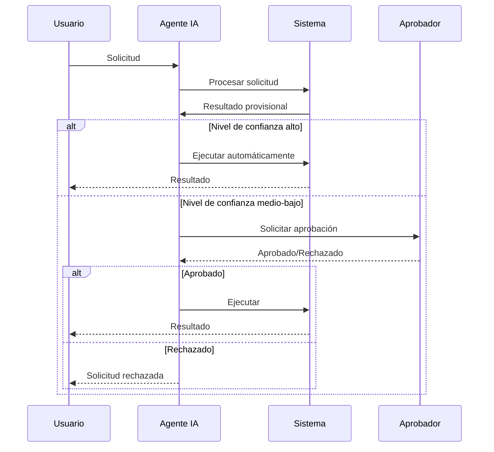
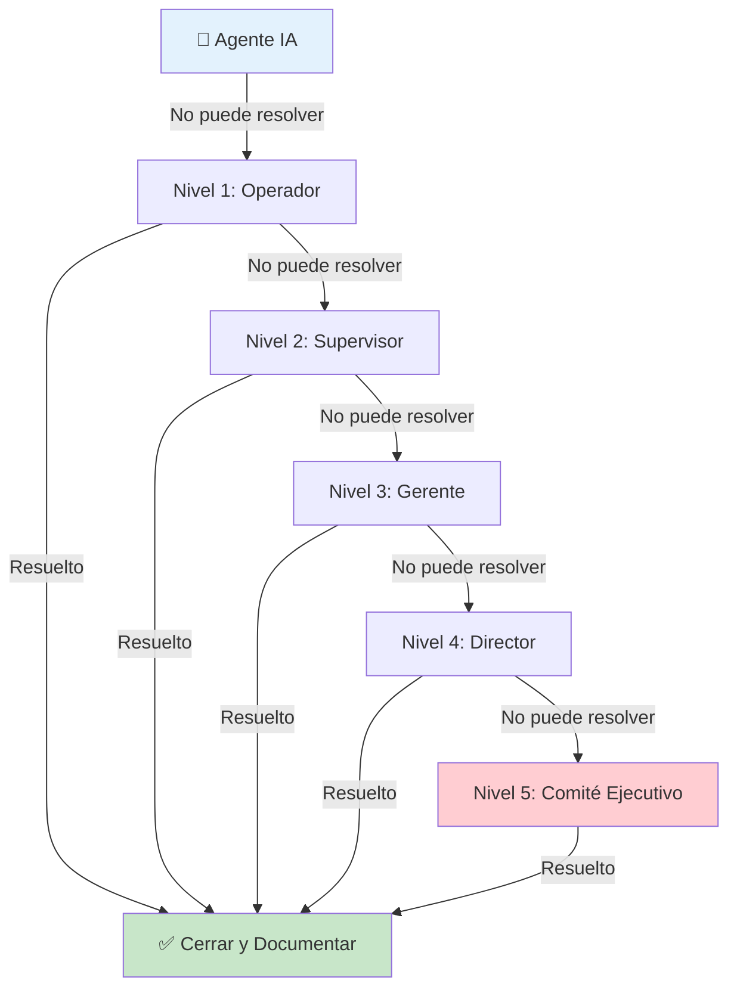
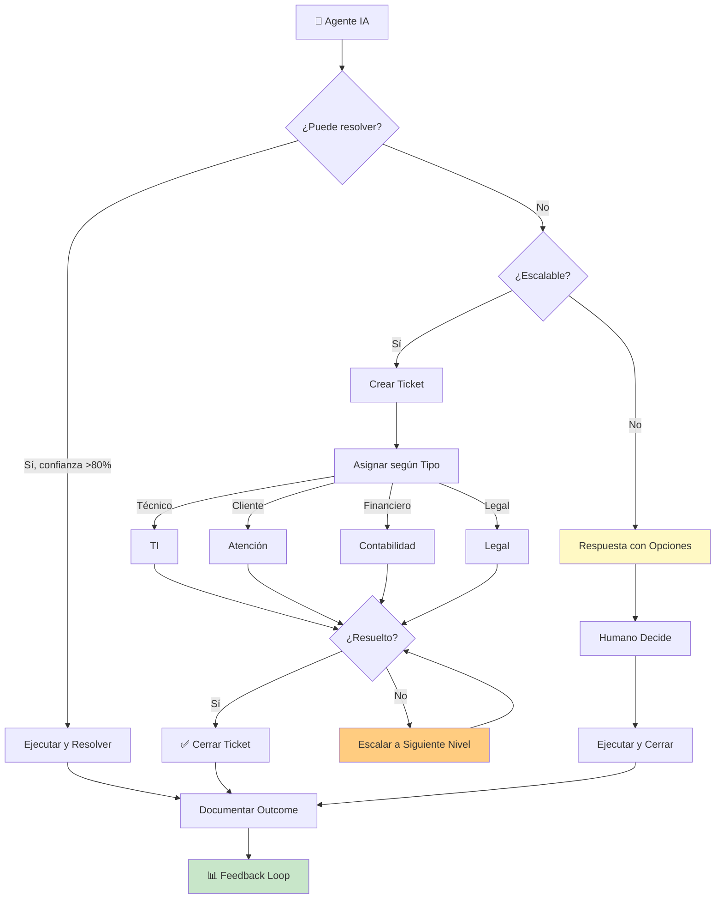
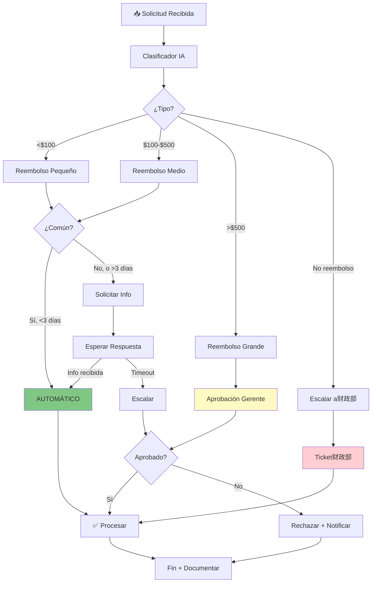
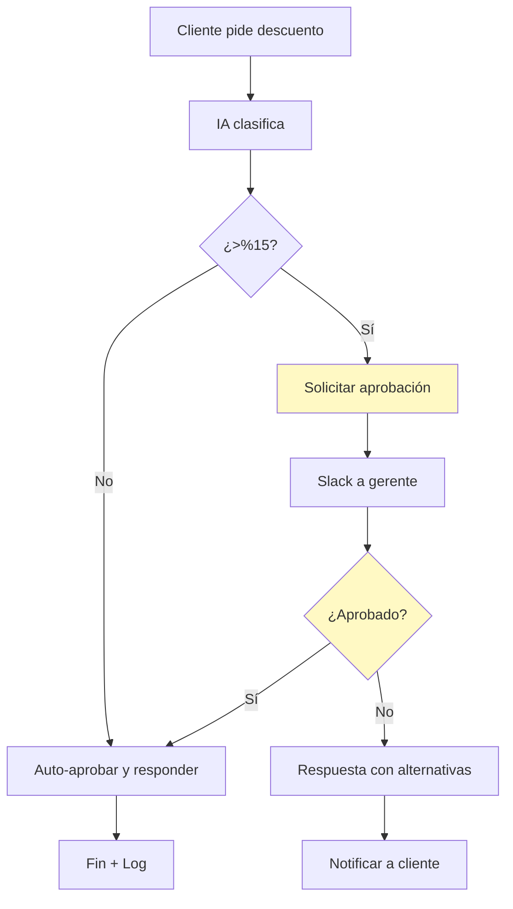

# Clase 20: Gobernanza de IA - Human-in-the-Loop

## 📋 Información General

| Aspecto | Detalle |
|---------|---------|
| **Duración** | 4 horas (240 minutos) |
| **Modalidad** | Teórico-Práctico |
| **Nivel** | Avanzado |
| **Prerrequisitos** | Clases 1-19 |

---

## 🎯 Objetivos de Aprendizaje

Al finalizar esta clase, serás capaz de:

1. **Comprender** el concepto de "Human-in-the-Loop" (HITL) y su importancia
2. **Identificar** cuándo es necesario intervenir en procesos automatizados
3. **Diseñar** niveles de autonomía apropiados para diferentes tipos de tareas
4. **Implementar** sistemas de aprobación humana en tus workflows
5. **Crear** protocolos de escalamiento efectivos

---

## 📚 Contenidos Detallados

### 1. ¿Qué es Human-in-the-Loop?

#### Definición

**Human-in-the-Loop (HITL)** o "Humano en el Ciclo" es un enfoque de diseño donde los sistemas de IA requieren intervención humana en puntos específicos del proceso. No es que el humano haga todo, sino que participa en momentos estratégicos.



#### ¿Por Qué es Importante?

**Sin HITL:**
- ❌ Decisiones potencialmente incorrectas sin supervisión
- ❌ No hay aprendizaje de errores
- ❌ Riesgos legales y reputacionales
- ❌ Clientes frustrados con errores no corregidos

**Con HITL:**
- ✅ Calidad garantizada por revisión humana
- ✅ Aprendizaje continuo del sistema
- ✅ Cumplimiento regulatorio
- ✅ Confianza del cliente

#### El Espectro de Autonomía

No todas las tareas requieren el mismo nivel de supervisión:



### 2. Cuándo Intervenir

#### Matriz de Decisión: Humano vs. Automático

```
                    ALTA IMPACTO
                          │
    ┌─────────────────────┼─────────────────────┐
    │                     │                     │
    │   CUADRANTE D       │   CUADRANTE B       │
    │   ("ESCALAR")       │   ("SUPERVISAR")    │
    │                     │                     │
    │  Decisiones con     │  Decisiones con     │
    │  alto impacto que   │  alto impacto que   │
    │  requieren juicio   │  pueden auto-       │
    │  humano experto     │  matizarse si son   │
    │                     │  correctas          │
    │  Ej: Aprobar        │                     │
    │  créditos,          │  Ej: Respuestas     │
    │  contratos          │  legales,            │
    │                     │  medical advice     │
    ├─────────────────────┼─────────────────────┤
    │                     │                     │
    │   CUADRANTE C       │   CUADRANTE A       │
    │   ("MONITOREAR")    │   ("AUTOMATIZAR")   │
    │                     │                     │
    │  Decisiones de      │  Decisiones de      │
    │  bajo impacto que   │  bajo impacto que   │
    │  requieren revisión │  son rutinarias     │
    │  periódica          │  y predecibles      │
    │                     │                     │
    │  Ej: Categorizar    │  Ej: Agendar,       │
    │  tickets,           │  enviar emails      │
    │  feedback           │  confirmaciones,    │
    │                     │  backups            │
    │                     │                     │
    └─────────────────────┴─────────────────────┘
                          │
                    BAJA IMPACTO
```

#### Criterios para Determinar Intervención

| Criterio | Pregunta | Indicador de Intervención |
|----------|----------|---------------------------|
| **Valor monetario** | ¿La decisión involucra >$X? | >$500 USD |
| **Impacto legal** | ¿Hay implicaciones legales? | Sí → Intervenir |
| **Irreversibilidad** | ¿Es difícil deshacer? | Sí → Intervenir |
| **Emocional** | ¿Afecta emocionalmente? | Sí → Intervenir |
| **Reputación** | ¿Afecta marca/Imagen? | Sí → Intervenir |
| **Complejidad** | ¿Requiere contexto amplio? | >3 variables → Intervenir |

#### Tipos de Intervención



### 3. Niveles de Autonomía

#### El Framework de 5 Niveles

```
┌─────────────────────────────────────────────────────────────────┐
│                    NIVELES DE AUTONOMÍA                         │
├─────────────────────────────────────────────────────────────────┤
│                                                                 │
│  NIVEL 5: AUTONOMÍA COMPLETA                                    │
│  ════════════════════════                                       │
│  • Sistema opera sin supervisión                               │
│  • No requiere intervención humana                              │
│  • 100% automatizado                                           │
│  • Ej: Backups automáticos, reportes programados               │
│                                                                 │
│  ─────────────────────────────────────────────────────────────  │
│                                                                 │
│  NIVEL 4: AUTONOMÍA CON ALERTAS                                 │
│  ═════════════════════════════                                   │
│  • Sistema opera solo, notifica resultados                      │
│  • Humano recibe reportes, no interviene normalmente            │
│  • Ej: Envío de newsletters, procesamiento de pedidos          │
│                                                                 │
│  ─────────────────────────────────────────────────────────────  │
│                                                                 │
│  NIVEL 3: SUPERVISIÓN PASIVA                                    │
│  ════════════════════════                                       │
│  • Sistema opera, humano observa                                │
│  • Interviene solo si detecta problema                         │
│  • Ej: Chatbot con logs visibles para supervisor                │
│                                                                 │
│  ─────────────────────────────────────────────────────────────  │
│                                                                 │
│  NIVEL 2: AUTORIZACIÓN REQUERIDA                                │
│  ══════════════════════════                                    │
│  • Sistema propone, humano aprueba                             │
│  • Decisiones importantes requieren visto bueno                │
│  • Ej: Aprobación de descuentos, envío de comunicados           │
│                                                                 │
│  ─────────────────────────────────────────────────────────────  │
│                                                                 │
│  NIVEL 1: REVISIÓN COMPLETA                                     │
│  ═══════════════════                                            │
│  • Sistema asiste, humano decide                                │
│  • IA sugiere opciones, humano selecciona                       │
│  • Ej: Generación de respuestas, análisis de datos             │
│                                                                 │
└─────────────────────────────────────────────────────────────────┘
```

#### Cómo Asignar Niveles



### 4. Aprobaciones Humanas en Workflows

#### Diseño de Workflows con Aprobaciones

**Estructura Básica:**



#### Implementación en n8n

**Workflow de Aprobación:**

```json
{
  "name": "Proceso con Aprobación",
  "nodes": [
    {
      "name": "Recibir Solicitud",
      "type": "n8n-nodes-base.webhook",
      "parameters": {
        "path": "solicitud"
      }
    },
    {
      "name": "Procesar con IA",
      "type": "n8n-nodes-base.openAi",
      "parameters": {
        "operation": "complete",
        "prompt": "Evalúa esta solicitud y clasifica el riesgo..."
      }
    },
    {
      "name": "Evaluar Nivel de Riesgo",
      "type": "n8n-nodes-base.switch",
      "parameters": {
        "rules": {
          "rules": [
            {
              "operation": "numeric",
              "value": 0.7,
              "property": "={{ $json.confidence }}",
              "output": 0
            }
          ]
        }
      }
    },
    {
      "name": "Ejecutar Automático (Alta Confianza)",
      "type": "n8n-nodes-base.code",
      "parameters": {
        "jsCode": "// Ejecutar acción\nreturn { status: 'executed' };"
      }
    },
    {
      "name": "Solicitar Aprobación (Baja Confianza)",
      "type": "n8n-nodes-base.slack",
      "parameters": {
        "channel": "#approvals",
        "text": "Nueva solicitud requiere aprobación..."
      }
    }
  ]
}
```

#### Tipos de Aprobación

| Tipo | Cuándo Usar | Ejemplo |
|------|-------------|---------|
| **Aprobación Individual** | Decisiones rutinarias | Aprobar descuento <10% |
| **Aprobación Dual** | Decisiones importantes | Descuentos >10%, >$1000 |
| **Aprobación por Nivel** | Según jerarquía | Gerente→Director→Socio |
| **Aprobación por Contingencia** | Según situación | Falla de sistema, urgencia |
| **Veto Post-Ejecución** | Alta frecuencia, bajo riesgo | Posts de redes sociales |

#### Configuración de Tiempos de Espera

```
┌──────────────────────────────────────────────────────────────┐
│                    POLÍTICA DE APROBACIONES                  │
├──────────────────────────────────────────────────────────────┤
│                                                              │
│  URGENTE (impacto inmediato)                                 │
│  ═══════════════════════════                                │
│  • Tiempo máximo de respuesta: 1 hora                        │
│  • Canal: Slack DM + SMS                                    │
│  • Si no hay respuesta: Escalar automáticamente             │
│                                                              │
│  NORMAL (impacto en 24hrs)                                   │
│  ═════════════════════════                                  │
│  • Tiempo máximo de respuesta: 8 horas laborales             │
│  • Canal: Email + Slack #approvals                           │
│  • Si no hay respuesta: Recordatorio + Escalar               │
│                                                              │
│  NO URGENTE (sin impacto inmediato)                         │
│  ═══════════════════════════════                              │
│  • Tiempo máximo de respuesta: 48 horas                     │
│  • Canal: Email con botón de aprobación                      │
│  • Si no hay respuesta: Archivo automático                   │
│                                                              │
└──────────────────────────────────────────────────────────────┘
```

### 5. Protocolos de Escalamiento

#### ¿Qué es el Escalamiento?

El **escalamiento** es el proceso de transferir una decisión o problema a un nivel superior de autoridad o expertise cuando no puede ser resuelto en el nivel actual.



#### Causas Comunes de Escalamiento

| Causa | Descripción | Indicador |
|-------|-------------|-----------|
| **Baja confianza** | IA no segura de respuesta | confidence < 60% |
| **Out of scope** | Solicitud fuera del entrenamiento | "No tengo información..." |
| **Excepciones** | Caso no previsto por reglas | Flag de excepción |
| **Conflicto** | Múltiples opciones igualmente válidas | Análisis/parálisis |
| **Error humano previo** | IA detecta error potencial | Validación failed |
| **Reclamo cliente** | Cliente insatisfecho con respuesta | Feedback negativo |

#### Workflow de Escalamiento



#### SLAs de Escalamiento

```
╔══════════════════════════════════════════════════════════════╗
║              MATRIZ DE ESCALAMIENTO                         ║
╠══════════════════════════════════════════════════════════════╣
║                                                              ║
║  NIVEL 1: Operador / Primera Línea                          ║
║  ─────────────────────────────────────────────────          ║
║  • Resolución: 80% de casos                                 ║
║  • SLA: 4 horas                                             ║
║  • Contacto: Chat interno, ext. 100                        ║
║                                                              ║
║  NIVEL 2: Supervisor                                        ║
║  ─────────────────────────────────────────────────          ║
║  • Resolución: 95% de casos restantes                       ║
║  • SLA: 2 horas                                             ║
║  • Contacto: ext. 200, slack @supervisor                   ║
║                                                              ║
║  NIVEL 3: Gerente de Área                                   ║
║  ─────────────────────────────────────────────────          ║
║  • Resolución: 100% de casos restantes                     ║
║  • SLA: 1 hora                                              ║
║  • Contacto: ext. 300                                      ║
║                                                              ║
║  CRITERIOS DE ESCALAMIENTO:                                 ║
║  • Valor > $5,000 USD                                      ║
║  • Cliente VIP (Top 10%)                                    ║
║  • Más de 2 interacciones sin resolución                    ║
║  • Reclamo formal                                           ║
║                                                              ║
╚══════════════════════════════════════════════════════════════╝
```

---

## 🔧 Tecnologías Específicas

### Herramientas para HITL

| Herramienta | Propósito | Costo | Nivel Técnico |
|------------|-----------|-------|--------------|
| **n8n** | Workflows con validación | Gratis | Fácil |
| **Make (Integromat)** | Automatización visual | Gratis/Medio | Fácil |
| **Zapier** | Automatización simple | Gratis/Bajo | Muy Fácil |
| **Jira/Notion** | Gestión de tickets | Gratis/Bajo | Fácil |
| **Slack/Teams** | Notificaciones | Gratis | Muy Fácil |

### Implementación en n8n

**Nodo de Aprobación por Email:**

```javascript
// En n8n con n8n-nodes-email
const approvalLink = `https://tu-n8n.com/webhook/approve/${workflow.id}`;
const rejectLink = `https://tu-n8n.com/webhook/reject/${workflow.id}`;

return {
  html: `
    <h2>Nueva solicitud requiere aprobación</h2>
    <p><strong>Tipo:</strong> ${$json.tipo}</p>
    <p><strong>Monto:</strong> $${$json.monto}</p>
    <p><strong>Cliente:</strong> ${$json.cliente}</p>
    
    <a href="${approvalLink}" style="background:green;color:white;padding:10px 20px;text-decoration:none">APROBAR</a>
    <a href="${rejectLink}" style="background:red;color:white;padding:10px 20px;text-decoration:none">RECHAZAR</a>
  `
};
```

---

## 📝 Ejercicios Prácticos Resueltos y Explicados

### Ejercicio 1: Clasificador de Solicitudes con Niveles de Autonomía

**Escenario:** María tiene un sistema que procesa solicitudes de reembolso. Quiere automatizar lo más posible pero garantizar calidad.

**Diseño del Sistema:**



**Implementación en n8n:**

```json
{
  "nodes": [
    {
      "name": "Trigger",
      "type": "n8n-nodes-base.webhook",
      "parameters": { "path": "reembolso" }
    },
    {
      "name": "Clasificar",
      "type": "n8n-nodes-base.openAi",
      "parameters": {
        "operation": "complete",
        "prompt": "Clasifica esta solicitud:\n1. Tipo: reembolso pequeño(<$100), medio($100-500), grande(>$500)\n2. ¿Es caso común? (Sí/No)\n3. Confianza de 0-100"
      }
    },
    {
      "name": "Router",
      "type": "n8n-nodes-base.switch",
      "parameters": {
        "dataType": "string",
        "rules": {
          "rules": [
            { "operation": "equals", "value": "pequeño", "output": 0 },
            { "operation": "equals", "value": "medio", "output": 1 },
            { "operation": "equals", "value": "grande", "output": 2 }
          ]
        }
      }
    },
    {
      "name": "Automático",
      "type": "n8n-nodes-base.code",
      "parameters": {
        "jsCode": "// Procesar automáticamente\nreturn { action: 'process', message: 'Reembolso aprobado automáticamente' };"
      }
    },
    {
      "name": "Solicitar Aprobación",
      "type": "n8n-nodes-base.slack",
      "parameters": {
        "channel": "#aprobaciones",
        "text": "Reembolso requiere aprobación"
      }
    }
  ]
}
```

**Resultado:**
- 70% de solicitudes se procesan automáticamente
- 25% requieren aprobación de supervisor
- 5% escalan a gerente
- Tiempo promedio reducido de 3 días a 4 horas

---

### Ejercicio 2: Sistema de Respuestas con Veto

**Escenario:** Carlos tiene un chatbot que responde preguntas de clientes. Quiere supervisar sin intervenir en cada respuesta.

**Diseño del Sistema:**

```
╔════════════════════════════════════════════════════════════════╗
║                    SISTEMA DE VETO POST-RESPUESTA              ║
╠════════════════════════════════════════════════════════════════╣
║                                                                ║
║  NIVEL 1: Respuesta Automática (default)                      ║
║  ─────────────────────────────────────────────────            ║
║  • IA genera respuesta                                         ║
║  • Se envía al cliente INMEDIATAMENTE                         ║
║  • Supervisor recibe copy en #chatbot-logs                     ║
║                                                                ║
║  FLAGS QUE PAUSAN ANTES DE ENVIAR:                            ║
║  ─────────────────────────────────────                         ║
║  • Mención de competidores: "Google", "Amazon", "Facebook"     ║
║  • Términos sensibles: "demanda", "abogado", "legal"         ║
║  • Keywords emocionales: "muy enojado", "defraudado"          ║
║  • Solicitudes fuera de scope                                  ║
║                                                                ║
║  NIVEL 2: Supervisión Visible                                 ║
║  ─────────────────────────────────                             ║
║  • Log en canal privado #chatbot-reviews                      ║
║  • 1-click: Editar, Rechazar, Aprobar                        ║
║  • SLA: Revisar en < 2 horas                                  ║
║                                                                ║
║  NIVEL 3: Intervención Directa                                 ║
║  ────────────────────────────────                             ║
║  • Si hay veto: Chat en vivo con cliente                      ║
║  • Si cliente pide humano: Transferencia inmediata            ║
║                                                                ║
╚════════════════════════════════════════════════════════════════╝
```

**Implementación del Flag System:**

```javascript
// En n8n Code node después de generar respuesta

const response = $input.first().json.response;
const clientEmail = $input.first().json.email;

// Keywords que pausam
const pauseKeywords = [
  'demanda', 'abogado', 'legal', 'demandar',
  'competidor', 'google', 'amazon',
  'enojado', 'frustrado', 'defraudado'
];

const shouldPause = pauseKeywords.some(keyword => 
  response.toLowerCase().includes(keyword)
);

return {
  action: shouldPause ? 'PAUSE_FOR_REVIEW' : 'SEND',
  response: response,
  reason: shouldPause ? 'Keyword de supervisión detectada' : null,
  email: clientEmail
};
```

---

### Ejercicio 3: Matriz de Escalamiento Completa

**Escenario:** Ana quiere documentar el proceso de escalamiento para todo su equipo.

**Documento de Matriz:**

```
╔══════════════════════════════════════════════════════════════════════════╗
║                       MATRIZ DE ESCALAMIENTO - ATENCIÓN AL CLIENTE       ║
╠══════════════════════════════════════════════════════════════════════════╣
║                                                                          ║
║  TIPO DE PROBLEMA           │ NIVEL 1      │ NIVEL 2      │ NIVEL 3    ║
║  ──────────────────────────┼──────────────┼──────────────┼────────────║
║                            │ Operador      │ Supervisor   │ Gerente    ║
║  ──────────────────────────┼──────────────┼──────────────┼────────────║
║  Pregunta sobre producto   │ ✅ Resuelve   │              │            ║
║  Reclamo menor (<$50)     │ ✅ Resuelve   │              │            ║
║  Reclamo mayor (>$50)      │              │ ✅ Resuelve   │            ║
║  Problema técnico          │ Escalar      │ ✅ Resuelve   │            ║
║  Caso legal/potencial      │ Escalar      │ Escalar      │ ✅ Resuelve║
║  Cliente VIP               │ Escalar      │ Informar     │ ✅ Resuelve║
║  Medios/Prensa             │ No responder │ Escalar      │ ✅ Resuelve║
║  ──────────────────────────┴──────────────┴──────────────┴────────────║
║                                                                          ║
║  CRITERIOS DE ESCALAMIENTO AUTOMÁTICO:                                  ║
║  ───────────────────────────────────────                                 ║
║  • 2 interacciones sin resolución                                       ║
║  • Cliente menciona: "hablaré con mi abogado", "redes sociales"          ║
║  • Valor económico > $500                                               ║
║  • Cliente en segmento "Enterprise"                                     ║
║  • Sentimiento negativo en 3 mensajes consecutivos                       ║
║                                                                          ║
║  CANALES DE ESCALAMIENTO:                                                ║
║  ─────────────────────────                                               ║
║  • Nivel 1 → 2: Ticket interno + Slack #escalados                       ║
║  • Nivel 2 → 3: Llamada directa + Email formal                            ║
║  • Urgente: Llamada telefónica + WhatsApp                                ║
║                                                                          ║
║  SLAs:                                                                   ║
║  ─────                                                                   ║
║  • Nivel 1: Resolver en 4 horas                                         ║
║  • Nivel 2: Resolver en 2 horas                                         ║
║  • Nivel 3: Resolver en 1 hora                                          ║
║  • Si no hay respuesta: Escalar al siguiente nivel automáticamente      ║
║                                                                          ║
╚══════════════════════════════════════════════════════════════════════════╝
```

---

## 🧪 Actividades de Laboratorio

### Laboratorio 1: Auditoría de Automatizaciones Existentes (60 minutos)

**Objetivo:** Evaluar tus automatizaciones actuales y asignar niveles de autonomía apropiados.

**Instrucciones:**

1. **Inventario (20 min)**
   - [ ] Lista todas tus automatizaciones activas
   - [ ] Para cada una, documenta:
     - Qué hace
     - Cuántas veces se ejecuta/día
     - Qué pasa si algo sale mal

2. **Clasificación de Riesgo (20 min)**
   - [ ] Usa la matriz de decisión
   - [ ] Clasifica cada automatización:
     - Verde: Automatizable 100%
     - Amarillo: Requiere supervisión
     - Rojo: Requiere aprobación humana

3. **Plan de Implementación (20 min)**
   - [ ] Para automatizaciones en rojo/amarillo:
     - Diseña puntos de intervención
     - Define quién approves
     - Configura alertas

**Entregable:** Documento con matriz de clasificación

---

### Laboratorio 2: Implementar Workflow con Aprobación (90 minutos)

**Objetivo:** Crear un workflow en n8n que incluya aprobación humana para decisiones importantes.

**Escenario:** Automatizar respuestas a solicitudes de descuentos >15%.

**Arquitectura:**



**Instrucciones:**

1. **Setup (20 min)**
   - [ ] Crear workflow trigger (webhook o form)
   - [ ] Añadir nodo de clasificación
   - [ ] Configurar nodo IF para split

2. **Rama Automática (20 min)**
   - [ ] Configurar respuesta automática
   - [ ] Añadir envío de email
   - [ ] Testear

3. **Rama de Aprobación (30 min)**
   - [ ] Configurar mensaje a Slack
   - [ ] Añadir botones de Approve/Reject
   - [ ] Configurar webhooks de callback
   - [ ] Testear flujo completo

4. **Logging (20 min)**
   - [ ] Crear base de datos de logs
   - [ ] Registrar todas las solicitudes
   - [ ] Documentar decisiones

**Entregable:** Workflow funcional + documentación

---

### Laboratorio 3: Simulacro de Escalamiento (60 minutos)

**Objetivo:** Practicar el protocolo de escalamiento con tu equipo.

**Escenario de Simulación:**

```
SITUACIÓN:
Un cliente recibió una respuesta incorrecta de tu chatbot 
sobre el estado de su pedido. El cliente está molesto y 
menciona que "va a hablar con un abogado".

PARTICIPANTES:
- Agente (tú)
- Supervisor (simulado)
- Cliente (simulado)
```

**Pasos:**

1. **Preparación (10 min)**
   - [ ] Revisar matriz de escalamiento
   - [ ] Designar roles
   - [ ] Preparar script del cliente difícil

2. **Simulación (30 min)**
   - [ ] Agente intenta resolver
   - [ ] ¿Cuándo escala? ¿A quién?
   - [ ] Supervisor recibe y resuelve
   - [ ] Documentar tiempos y decisiones

3. **Debrief (20 min)**
   - [ ] ¿Se escaló a tiempo?
   - [ ] ¿La información transferida fue suficiente?
   - [ ] ¿Qué se puede mejorar?

**Entregable:** Reporte de simulación con recomendaciones

---

## 📊 Resumen de Puntos Clave

### Framework deHITL

1. **No todo debe ser automático**: Evalúa riesgo vs eficiencia
2. **Autonomía gradual**: Empieza con más supervisión, reduce según confianza
3. **Intervenir donde importa**: Alto impacto = más supervisión
4. **Documentar para aprender**: Cada intervención es oportunidad de mejora

### Niveles de Autonomía

| Nivel | Nombre | Descripción | Ejemplo |
|-------|--------|-------------|---------|
| 1 | Revisión Completa | Humano decide con sugerencias | AI asistente |
| 2 | Autorización | IA propone, humano aprueba | Descuentos |
| 3 | Supervisión | Humano observa, interviene si | Chatbot supervisado |
| 4 | Alertas | IA opera, notifica resultados | Newsletter auto |
| 5 | Automático | Sin intervención | Backups, reports |

### Indicadores de Escalamiento

- Confianza IA < 60%
- Valor > umbral definido
- Cliente insatisfecho (palabras clave negativas)
- Caso fuera de scope
- +2 interacciones sin resolución

### Checklist de Gobernanza

- [ ] Clasifiqué todas las automatizaciones por nivel de riesgo
- [ ] Tengo puntos de intervención definidos
- [ ] Aprobaciones están configuradas para casos críticos
- [ ] Protocolos de escalamiento están documentados
- [ ] Mi equipo conoce los procedimientos
- [ ] Hay SLAs definidos para cada nivel

---

## 📚 Referencias Externas

1. **Human-in-the-Loop Fundamentals**
   - [Human-in-the-Loop Machine Learning](https://www.manning.com/books/human-in-the-loop-machine-learning)
   - [HITL in AI Systems - Google](https://cloud.google.com/architecture/human-in-the-loop)

2. **AI Governance**
   - [MIT AI Governance Framework](https://aigovernance.mit.edu/)
   - [OECD AI Principles](https://oecd.ai/en/ai-principles)

3. **Approval Workflows**
   - [Approval Workflow Best Practices](https://www.atlassian.com/software/confluence/workflows/approval-workflow)
   - [n8n Approval Workflows](https://docs.n8n.io/workflows/examples/approval-workflows/)

4. **Escalation Management**
   - [ITIL Incident Escalation](https://www.axelos.com/best-practice-solutions/itil)
   - [Customer Service Escalation Templates](https://www.hubspot.com/service/templates/escalation)

5. **Ethical AI**
   - [AI Ethics Guidelines](https://www.partnershiponai.org/)
   - [EU AI Act Overview](https://artificialintelligenceact.eu/)

---

## 📎 Plantilla de Documento de Gobernanza

```markdown
# Documento de Gobernanza: [Nombre del Sistema]
**Versión:** 1.0
**Fecha:** [Fecha]
**Responsable:** [Nombre]

## 1. Descripción del Sistema
[Descripción breve de qué hace el sistema de IA]

## 2. Nivel de Autonomía Asignado
| Decisión | Nivel | Justificación |
|----------|-------|---------------|
| [Decisión 1] | [1-5] | [Por qué] |
| [Decisión 2] | [1-5] | [Por qué] |

## 3. Puntos de Intervención Humana
| Punto | Cuándo Intervenir | Quién Aprueba | SLA |
|-------|-------------------|---------------|-----|
| [Punto 1] | [Condición] | [Rol] | [Tiempo] |
| [Punto 2] | [Condición] | [Rol] | [Tiempo] |

## 4. Protocolo de Escalamiento
[Nivel 1 → Nivel 2 → Nivel 3]

## 5. Métricas de Monitoreo
- % de decisiones automáticas: [X%]
- % que requirió aprobación: [X%]
- Tiempo promedio de resolución: [X min]

## 6. Revisión y Actualización
- Próxima revisión: [Fecha]
- Trigger de revisión: [Eventos que initiate revisión]

## Aprobaciones
- [ ] Líder de Proyecto: _____________
- [ ] TI: _____________
- [ ] Legal (si aplica): _____________
```

---

*Material preparado para el curso "IA para Líderes y Dueños de PYME (No-Code)"*
*Clase 20 - Gobernanza de IA - Human-in-the-Loop*
