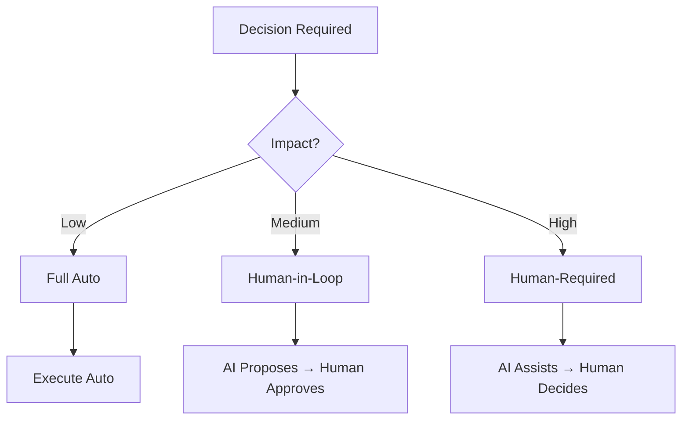
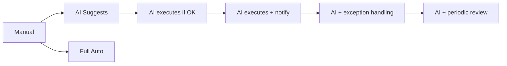
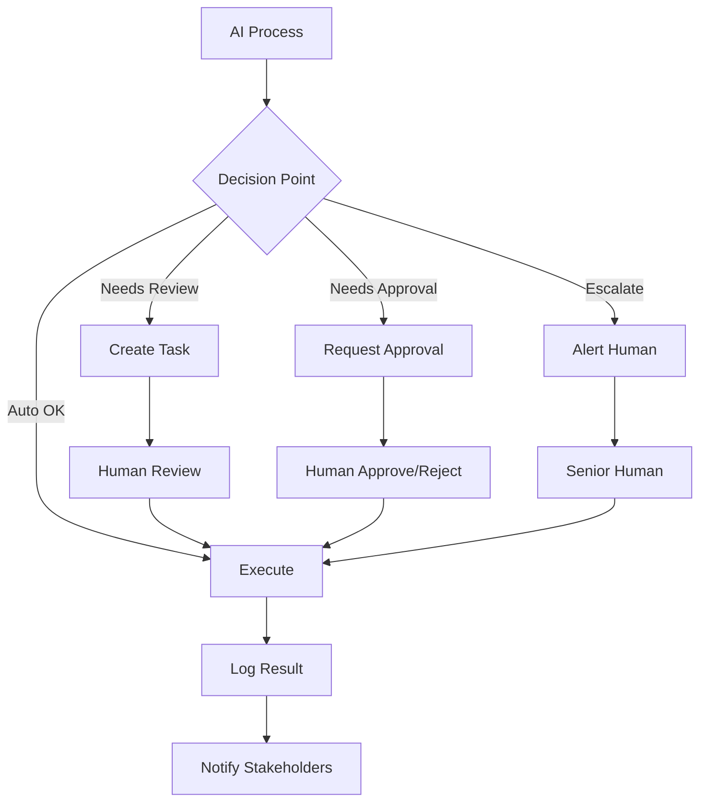
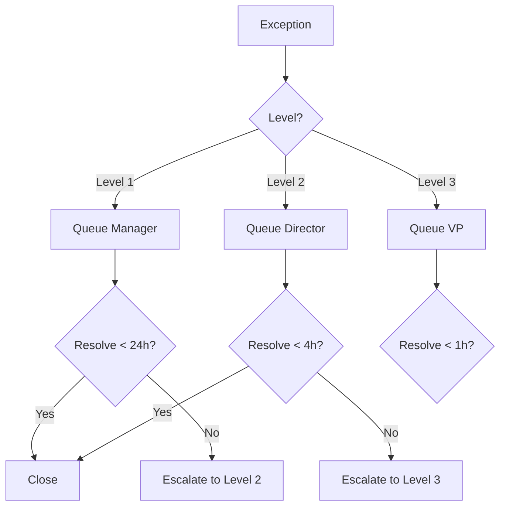

# CLASE 21: GOBERNANZA DE IA - HUMAN-IN-THE-LOOP

## 📅 Duración: 4 Horas (240 minutos)

---

## 21.1 OBJETIVOS DE APRENDIZAJE

Al finalizar esta clase, los participantes serán capaces de:

1. **Comprender cuándo intervenir** en procesos automatizados con IA
2. **Definir niveles de autonomía** apropiados para cada proceso
3. **Implementar sistemas de aprobación humana** en flujos
4. **Configurar escalamiento** efectivo para casos críticos
5. **Diseñar governance frameworks** para uso de IA en la empresa

---

## 21.2 CONTENIDOS DETALLADOS

### MÓDULO 1: FUNDAMENTOS DE GOVERNANCE (60 minutos)

#### 21.1.1 ¿Por Qué Human-in-the-Loop?

Human-in-the-loop (HITL) significa mantener supervisión humana en procesos automatizados. Es crítico porque:

**Razones para HITL:**

1. **Precisión**: La IA no siempre tiene razón
2. **Ética**: Algunas decisiones requieren juicio humano
3. **Responsabilidad**: Alguien debe ser accountable
4. **Excepciones**: Los casos edge necesitan intervención
5. **Confianza**: Los clientes/confianza prefieren saber hay humano involucrado

**Dónde No Usar HITL:**

- Tareas de bajo impacto
- Volumen extremadamente alto
- Donde velocidad es crítica
- Decisiones reversibles



#### 21.1.2 Marco de Decisión HITL

**Preguntas Clave:**

1. ¿Cuál es el impacto de una decisión incorrecta?
2. ¿Cuántas personas se ven afectadas?
3. ¿Es reversible la decisión?
4. ¿Hay regulatory/compliance requirements?
5. ¿Qué dicen los clientes/stakeholders?

**Matriz de Decisión:**

| Impacto | Volumen | Complejidad | Enfoque |
|---------|---------|-------------|---------|
| Bajo | Alto | Baja | Full Auto |
| Bajo | Alto | Alta | Auto + Random Review |
| Alto | Bajo | Baja | Auto + Human Notify |
| Alto | Bajo | Alta | Full Human Review |
| Crítico | Cualquiera | Cualquiera | Human Required |

---

### MÓDULO 2: NIVELES DE AUTONOMÍA (75 minutos)

#### 21.2.1 Niveles de Automatización

**Nivel 0: Sin Automatización**

- Todo proceso manual
- IA solo como asistencia

**Nivel 1: Asistencia**
- IA sugiere opciones
- Humano decide y ejecuta
- Ejemplo: AI suggest email response

**Nivel 2: Automatización Parcial**
- AI ejecuta si cumple condiciones
- Humano interviene si no
- Ejemplo: Auto-assign leads si score > 80

**Nivel 3: Automatización Condicional**
- IA ejecuta solo
- Notifica humano después
- Ejemplo: Auto-responder preguntas frecuentes

**Nivel 4: Alta Automatización**
- IA ejecuta, monitorea, reporta
- Humano interviene solo en excepciones
- Ejemplo: Reconciliación automática

**Nivel 5: Full Automatización**
- Sistema opera completamente solo
- Revisión periódica humana
- Ejemplo: Algunos sistemas de trading



#### 21.2.2 Asignar Niveles por Proceso

**Proceso: Clasificación de Leads**

- Nivel 1-2: Clasificación inicial
- Por qué: Alto impacto en ventas

**Proceso: Respuesta a Preguntas Frecuentes**

- Nivel 3-4: Automation allowed
- Por qué: Bajo impacto, reversible

**Proceso: Aprobación de Crédito**

- Nivel 1: Human required
- Por qué: Alto impacto financiero

**Proceso: Envío de Notificaciones**

- Nivel 5: Full auto
- Por qué: Bajo impacto, reversible

---

### MÓDULO 3: IMPLEMENTAR APROBACIONES HUMANAS (45 minutos)

#### 21.3.1 Patrones de Aprobaciones

**Patrón 1: Review Before Action**

```
1. AI identifies action needed
2. Create task for human review
3. Human reviews and approves/rejects
4. If approved → Execute
5. If rejected → Log reason and stop
```

**Patrón 2: Execute and Confirm**

```
1. AI executes action
2. Human receives notification
3. If OK → No action needed
4. If not OK → Human reverses
```

**Patrón 3: Batch Approval**

```
1. AI processes batch
2. Creates report of actions
3. Human reviews summary
4. Human approves entire batch
5. If issues → Identify and fix
```

#### 21.3.2 Implementar en n8n

**Con Approval Workflow:**

```
1. Router with Approval Path
2. Wait for approval (can be time-limited)
3. If approved → Continue flow
4. If rejected → Stop and notify
5. Timeout after X hours → Default to reject
```

**Con Approval Node (n8n Approvals):**

```
1. Use n8n approval node
2. Configure approvers
3. Set timeout
4. Handle approval/rejection
```

---

### MÓDULO 4: ESCALAMIENTO (30 minutos)

#### 21.4.1 Cuándo Escalar

**Triggers de Escalamiento:**

- Decisión fuera de parámetros normales
- Excepción no manejada
- Múltiples reintentos fallidos
- Request explícito del cliente
- Monto superior a threshold

#### 21.4.2 Configurar Escalamiento

**Flujo:**

```
1. Detect escalation trigger
2. Route to appropriate level
   - Level 1: Manager
   - Level 2: Director
   - Level 3: VP/Executive
3. Include context and history
4. Set SLA for response
5. Track resolution
```

---

### MÓDULO 5: DOCUMENTACIÓN Y MEJORA (30 minutos)

#### 21.5.1 Documentar Decisiones HITL

**Template:**

```
Proceso: [Nombre]
Decisión HITL: [Sí/No]
Nivel de Autonomía: [0-5]
Justificación: [Por qué]
Aprobaciones Requeridas: [Quién]
Escalamiento: [Cuándo y a quién]
Revisión: [Frecuencia]
```

#### 21.5.2 Revisar y Mejorar

**Revisiones Periódicas:**

- Semanal: Review de excepciones
- Mensual: Análisis de escalamientos
- Trimestral: Revisión de niveles

---

## 21.3 DIAGRAMAS EN MERMAID

### Diagrama 1: Human-in-the-Loop Architecture



### Diagrama 2: Escalation Levels



---

## 21.4 EJERCICIOS PRÁCTICOS

### Ejercicio 1: Analyze Process

Analizar un proceso y determinar nivel HITL

### Ejercicio 2: Implement Approval

Crear flujo con aprobación humana

### Ejercicio 3: Setup Escalation

Configurar escalamiento

---

## 21.5 ACTIVIDADES DE LABORATORIO

### Laboratorio 1: Governance Framework

Crear framework para tu empresa

### Laboratorio 2: Implementation

Implementar approvals en flujo existente

### Laboratorio 3: Testing

Testear sistema HITL

---

## 21.6 RESUMEN

- HITL asegura decisiones de calidad
- Niveles de autonomía varían por proceso
- Aprobaciones humanas deben ser eficientes
- Escalamiento claro evita problemas
- Documentación permite mejora continua

---

**FIN DE LA CLASE 21**
