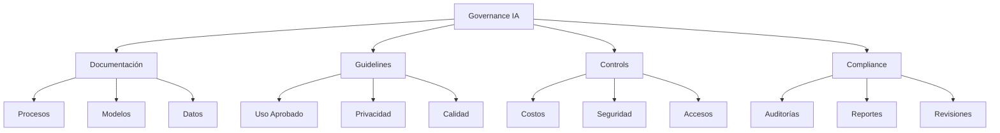
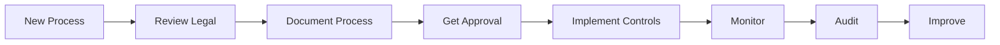

# CLASE 22: POLÍTICAS DE USO DE IA EN LA EMPRESA

## 📅 Duración: 4 Horas (240 minutos)

---

## 22.1 OBJETIVOS DE APRENDIZAJE

Al finalizar esta clase, los participantes serán capaces de:

1. **Documentar procesos** de IA para compliance
2. **Crear guidelines internos** para uso de IA
3. **Implementar controles de costos** efectivos
4. **Asegurar compliance** con regulaciones aplicables
5. **Establecer governance** para IA en la organización

---

## 22.2 CONTENIDOS DETALLADOS

### MÓDULO 1: DOCUMENTACIÓN DE PROCESOS (60 minutos)

#### 22.1.1 Por Qué Documentar

La documentación de IA es esencial para:

- **Compliance**: Regulatorios requieren documentación
- **Auditorías**: Demostrar que funciona correctamente
- **Mantenimiento**: Facilitar cambios futuros
- **Training**: Onboard nuevos miembros
- **Liability**: Demostrar responsabilidad

**Qué Documentar:**

| Área | Documentos | Frecuencia |
|------|------------|------------|
| Procesos | Diagramas, descripciones | Por proceso |
| Datos | Orígenes, privacidad, calidad | Por dataset |
| Modelos | Inputs, outputs, limitaciones | Por modelo |
| Incidentes | Problemas, resoluciones | Por incidente |
| Métricas | Performance, uso, costos | Mensual |

#### 22.1.2 Template de Documentación

```markdown
# Documento de Proceso IA

## 1. Overview
- Nombre del proceso
- Objetivo de negocio
- Tipo de IA utilizada

## 2. Datos
- Datos de entrada
- Fuentes de datos
- Preprocesamiento
- Privacidad/PII

## 3. Modelo
- Modelo utilizado
- Entrenamiento (si aplica)
- Limitaciones conocidas
- Accuracy/performance

## 4. Integración
- Sistemas conectados
- APIs utilizadas
- Flujo de datos

## 5. Governance
- Nivel de autonomía
- Aprobaciones requeridas
- Escalamiento
- Revisiones

## 6. Métricas
- KPIs actuales
- Historico
- alertas

## 7. Mantenimiento
- Responsable
- Frecuencia de revisión
- Proceso de actualización

## 8. Version History
- v1.0 - [Fecha] - [Autor] - [Cambios]
```

---

### MÓDULO 2: GUIDELINES INTERNOS (75 minutos)

#### 22.2.1 Crear Guidelines

**Guidelines de Uso:**

**1. Uso Apropiado:**
- Para qué usar IA
- Para qué NO usar IA
- Cuándo escalar a humano
- Cómo manejar excepciones

**2. Calidad:**
- Verificación de resultados
- Precisión mínima aceptable
- Casos que requieren revisión

**3. Privacidad:**
- Datos que pueden enviarse a IA
- Datos que NO pueden enviarse
- Cómo manejar PII

**4. Seguridad:**
- Credenciales y acceso
- Auditorías
- Reporting de incidentes

#### 22.2.2 Ejemplo de Guidelines

```markdown
# Política de Uso de IA - [Empresa]

## Uso Aprobado
✓ Generación de contenido marketing
✓ Clasificación de leads
✓ Atención al cliente (soporte nivel 1)
✓ Análisis de datos

## Uso No Permitido
✗ Decisiones de contratación
✗ Decisiones financieras >$5,000
✗ Diagnósticos médicos
✗ Legal sin supervisión

## Requisitos de Calidad
- AI-generated content requiere review antes de publicación
- Precisión mínima para clasificación: 90%
- Human review para decisiones de alto impacto

## Privacidad
- NO enviar: SSN, números de tarjeta, datos médicos
- SI permitido: Nombres, emails (con anonymization cuando sea posible)
- Siempre revisar antes de enviar a APIs externas

## Reporting
- Reportar incidentes a: seguridad@[empresa].com
- Revisión mensual de uso
- Auditoría trimestral
```

---

### MÓDULO 3: CONTROL DE COSTOS (45 minutos)

#### 22.3.1 Monitorear Costos

**Qué Monitorear:**

| Recurso | Métrica | Frecuencia |
|---------|---------|------------|
| APIs de IA | Tokens/calls | Diaria |
| Compute | Operaciones | Semanal |
| Storage | GB | Mensual |
| Personas | Horas | Mensual |

**Dashboard de Costos:**

```
┌─────────────────────────────────────┐
│ COSTOS IA - [Mes]                   │
├─────────────────────────────────────┤
│ OpenAI:        $XXX (XX%)           │
│ Anthropic:     $XXX (XX%)           │
│ APIs:          $XXX (XX%)           │
│ Herramientas:  $XXX (XX%)           │
│ TOTAL:         $XXX                 │
├─────────────────────────────────────┤
│ vs Mes Anterior: +X%                │
│ vs Presupuesto: +X%                 │
└─────────────────────────────────────┘
```

#### 22.3.2 Controles

**Controles de Costo:**

1. **Budget por proyecto**
2. **Alertas cuando se acerca al límite**
3. **Revisión manual para gastos >$X**
4. **Optimización de prompts para reducir tokens**
5. **Desactivar flujos no utilizados**

---

### MÓDULO 4: COMPLIANCE (45 minutos)

#### 22.4.1 Regulaciones Relevantes

**GDPR (Europa):**
- Derecho a explicación de decisiones
- Minimización de datos
- Consentimiento

**LGPD (Brasil):**
- Similar a GDPR
- Consentimiento explícito

**CCPA (California):**
- Derecho a saber qué datos se usan
- Opt-out de venta de datos

#### 22.4.2 Requisitos de Compliance

**Para IA:**

| Requisito | Cómo Cumplir |
|-----------|---------------|
| Transparencia | Documentar uso de IA |
| Explicabilidad | Poder explicar decisiones |
| No discriminación | Auditar sesgos |
| Seguridad | Proteger modelos y datos |
| Consentimiento | Notificar uso de IA |

---

### MÓDULO 5: IMPLEMENTACIÓN (15 minutos)

#### 22.5.1 Plan de Implementación

**Fase 1: Documentar**
- Inventario de procesos IA
- Documentar cada uno

**Fase 2: Guidelines**
- Crear políticas
- Obtener aprobación

**Fase 3: Implementar Controles**
- Sistemas de aprobación
- Monitoreo de costos
- Logging

**Fase 4: Training**
- Comunicar políticas
- Entrenar usuarios
- Recursos disponibles

---

## 22.3 DIAGRAMAS EN MERMAID

### Diagrama 1: Governance Framework



### Diagrama 2: Compliance Flow



---

## 22.4 EJERCICIOS PRÁCTICOS

### Ejercicio 1: Documentar Proceso

Documentar un proceso de IA existente

### Ejercicio 2: Crear Guidelines

Crear política de uso de IA

### Ejercicio 3: Setup Monitoreo

Configurar dashboard de costos

---

## 22.5 ACTIVIDADES DE LABORATORIO

### Laboratorio 1: Policy Creation

Crear documento de políticas

### Laboratorio 2: Implementation

Implementar controles

### Laboratorio 3: Training

Preparar training para equipo

---

## 22.6 RESUMEN

- Documentación es esencial para compliance
- Guidelines claros guían uso apropiado
- Controles de costos previenen sorpresas
- Compliance requiere atención a regulaciones
- Governance estructurado escala efectivamente

---

**FIN DE LA CLASE 22**
