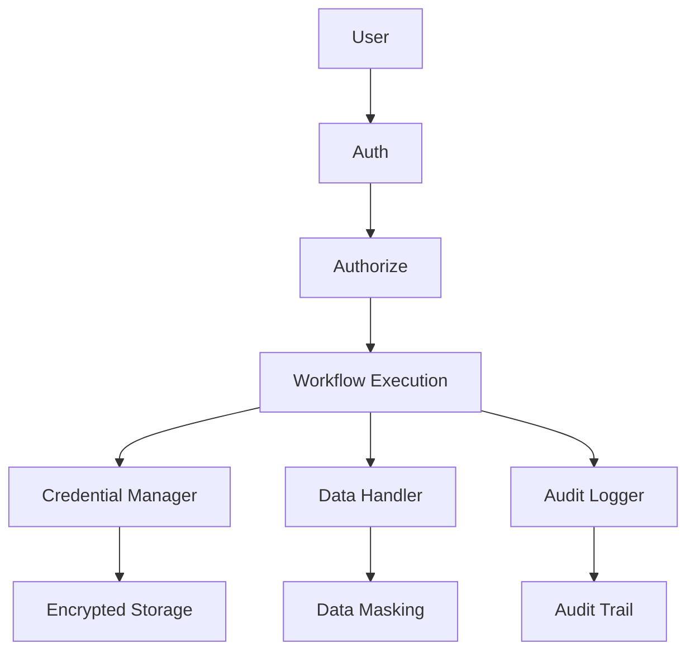
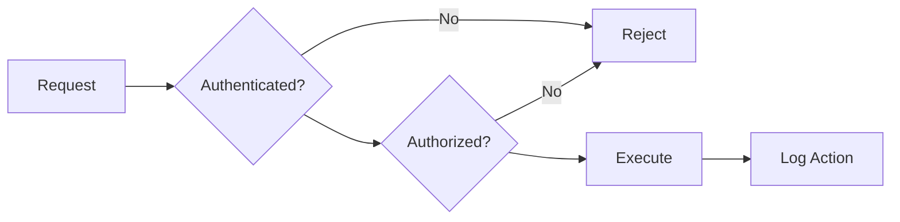

# CLASE 23: SEGURIDAD EN AUTOMATIZACIONES

## 📅 Duración: 4 Horas (240 minutos)

---

## 23.1 OBJETIVOS DE APRENDIZAJE

Al finalizar esta clase, los participantes serán capaces de:

1. **Gestionar credenciales** de manera segura en automatizaciones
2. **Implementar permisos y roles** apropiados
3. **Configurar auditoría de acciones** para compliance
4. **Proteger datos sensibles** en flujos automatizados
5. **Diseñar arquitectura segura** para integraciones

---

## 23.2 CONTENIDOS DETALLADOS

### MÓDULO 1: GESTIÓN DE CREDENCIALES (75 minutos)

#### 23.1.1 Principios de Seguridad

**Reglas de Oro:**

1. **Nunca hardcodear credenciales** en código
2. **Usar secrets management** nativo de plataformas
3. **Rotar credenciales** regularmente
4. **Mínimo privilegio**: dar solo lo necesario
5. **Auditar uso** de credenciales

#### 23.1.2 Gestión en n8n

**Credential Types:**

- OAuth (Google, Slack, HubSpot, etc.)
- API Key
- Basic Auth
- Header Auth
- Custom Header

**Best Practices:**

```
1. Credentials → Add New
2. Select type based on service
3. Add required credentials
4. Test connection
5. Save

Nunca:
- Compartir credenciales
- Usar credenciales personales para empresa
- Dejar credenciales en código
```

**Credential Encryption:**

n8n encripta credenciales con:
- Encryption key en variables de entorno
- AES-256 encryption
- Solo accesible por el nodo

#### 23.1.3 Gestión en Make

**Connection Security:**

- Credentials se almacenan cifradas
- Puedes usar "Private" para mayor seguridad
- Autenticación 2FA disponible

**Scopes:**

- granular per connection
-限制 solo permisos necesarios

---

### MÓDULO 2: PERMISOS Y ROLES (60 minutos)

#### 23.2.1 Control de Acceso

**Roles en n8n:**

| Rol | Permisos |
|-----|----------|
| Owner | Todo |
| Admin | Todo excepto billing |
| Editor | Crear/editar workflows |
| Viewer | Solo ver |

**En Make:**

| Rol | Permisos |
|-----|----------|
| Owner | Todo |
| Admin | Manage team |
| Member | Build & run |
| Operator | Run only |
| Viewer | View only |

#### 23.2.2 Implementar ROLES

**Buenas Prácticas:**

1. **Crear usuario por persona** (no compartir)
2. **Asignar rol mínimo necesario**
3. **Desactivar usuarios inactivos**
4. **Requerir 2FA** para acceso a production

---

### MÓDULO 3: AUDITORÍA DE ACCIONES (45 minutos)

#### 23.3.1 Qué Auditar

**Eventos a Registrar:**

- Login/logout
- Creación de workflows
- Cambios en workflows
- Ejecuciones
- Errores
- Cambios de credenciales

#### 23.3.2 Configurar Logging

**En n8n:**

```
1. Logging → Execution
2. Store execution errors
3. Include node name
4. Include parameters (optional)
```

**Logs Externos:**

```
1. Use webhook to send logs to:
   - Datadog
   - Loggly
   - Custom endpoint

2. Format:
{
  "timestamp": "...",
  "workflow_id": "...",
  "execution_id": "...",
  "action": "...",
  "user": "...",
  "status": "..."
}
```

---

### MÓDULO 4: PROTECCIÓN DE DATOS (30 minutos)

#### 23.4.1 Datos Sensibles

**Identificar PII:**

- Nombres
- Emails
- Teléfonos
- Direcciones
- Datos financieros
- Datos de salud

**Proteger en Flujos:**

```
1. Encrypt data at rest
2. Use HTTPS for all connections
3. Anonymize before sending to AI
4. Clear sensitive data after use
5. Mask in logs
```

---

### MÓDULO 5: ARQUITECTURA SEGURA (30 minutos)

#### 23.5.1 Design Patterns

**Zero Trust:**

```
1. Verify explicitly
2. Least privilege access
3. Assume breach
4. Verify all connections
```

**Defense in Depth:**

```
Multiple layers:
- Network
- Application
- Data
- Physical
```

---

## 23.3 DIAGRAMAS EN MERMAID

### Diagrama 1: Security Architecture



### Diagrama 2: Access Control



---

## 23.4 EJERCICIOS PRÁCTICOS

### Ejercicio 1: Secure Setup

Configurar credenciales de forma segura

### Ejercicio 2: Permissions

Configurar roles y permisos

### Ejercicio 3: Audit Setup

Implementar auditoría

---

## 23.5 ACTIVIDADES DE LABORATORIO

### Laboratorio 1: Security Audit

Auditar seguridad de flujos existentes

### Laboratorio 2: Implementation

Implementar controles

### Laboratorio 3: Documentation

Documentar políticas de seguridad

---

## 23.6 RESUMEN

- Gestión segura de credenciales es crítica
- Permisos mínimos reduce riesgos
- Auditoría permite detección de problemas
- Datos sensibles requieren protección extra
- Security by design es el mejor enfoque

---

**FIN DE LA CLASE 23**
