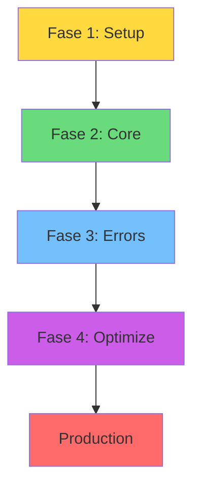

# CLASE 24: PROYECTO "EMPRESA AUTÓNOMA" - PARTE 2

## 📅 Duración: 4 Horas (240 minutos)

---

## 24.1 OBJETIVOS DE APRENDIZAJE

Al finalizar esta clase, los participantes serán capaces de:

1. **Implementar el flujo completo** del proyecto "Empresa Autónoma"
2. **Testear en producción controlada** antes del lanzamiento completo
3. **Iterar y mejorar** basándose en resultados
4. **Documentar completamente** la implementación
5. **Preparar para operación autónoma** sostenida

---

## 24.2 CONTENIDOS DETALLADOS

### MÓDULO 1: IMPLEMENTACIÓN DEL FLUJO (90 minutos)

#### 24.1.1 Revisión del Diseño

**Antes de implementar:**

1. Revisa el diseño creado en Clase 20
2. Verifica que todos los componentes estén definidos
3. Confirma las integraciones necesarias
4. Prepara datos de prueba

**Checklist de Preparación:**

```
☐ Dispone de todas las cuentas necesarias
☐ Tiene acceso a APIs requeridas
☐ Ha configurado credenciales
☐ Tiene datos de prueba
☐ Ha documentado el flujo
☐ Ha identificado puntos de falla
☐ Ha definido manejo de errores
```

#### 24.1.2 Implementación por Fases

**Fase 1: Setup Básico**
- Crear cuenta en plataforma
- Configurar credenciales
- Testear conexiones individuales

**Fase 2: Flujo Core**
- Implementar trigger principal
- Crear path principal
- Testear caminohappy path

**Fase 3: Manejo de Errores**
- Agregar error handlers
- Configurar notificaciones
- Testear paths de error

**Fase 4: Optimización**
- Reducir operaciones
- Optimizar llamadas API
- Mejorar rendimiento



---

### MÓDULO 2: TESTING EN PRODUCCIÓN CONTROLADA (75 minutos)

#### 24.2.1 Estrategias de Testing

**Testing en Producción:**

1. **Shadow Mode**: Correr en paralelo sin afectar producción
2. **Canary Release**: Dirigir poco tráfico inicialmente
3. **A/B Testing**: Comparar con versión anterior
4. **Rollback Plan**: Poder revertir si hay problemas

**Shadow Mode en n8n/Make:**

```
1. Duplicar workflow
2. Cambiar nombre a "TEST - [nombre]"
3. NO activar, ejecutar manualmente
4. Comparar resultados vs producción
```

**Canary Release:**

```
1. Configurar split (90% old, 10% new)
2. Monitorear métricas del 10%
3. Si OK → increase to 50%
4. Si OK → increase to 100%
5. Si error → rollback
```

#### 24.2.2 Métricas a Monitorear

| Métrica | Qué Medir | Umbral de Alerta |
|---------|-----------|------------------|
| Success Rate | % ejecuciones exitosas | < 95% |
| Latency | Tiempo de ejecución | > umbral |
| Errors | Errores por ejecución | > 5% |
| Cost | Costo por ejecución | > presupuesto |

---

### MÓDULO 3: ITERACIÓN Y MEJORA (45 minutos)

#### 24.3.1 Basado en Resultados

**Recopilar Feedback:**

- Métricas de rendimiento
- Feedback de usuarios
- Errores encontrados
- Mejoras identificadas

**Priorizar Mejoras:**

```
Matriz de Priorización:

| Impacto \ Esfuerzo | Bajo | Medio | Alto |
|---------------------|------|-------|------|
| Alto | PRIORIDAD 1 | PRIORIDAD 2 | PRIORIDAD 3 |
| Medio | PRIORIDAD 2 | PRIORIDAD 3 | POSTERGAR |
| Bajo | PRIORIDAD 3 | POSTERGAR | POSTERGAR |
```

#### 24.3.2 Iterar

**Ciclo de Mejora:**

```
1. Medir resultados actuales
2. Identificar gap vs objetivo
3. Diseñar solución
4. Implementar cambio
5. Testear cambio
6. Desplegar
7. Volver a 1
```

---

### MÓDULO 4: DOCUMENTACIÓN (30 minutos)

#### 24.4.1 Documentación Completa

**Incluir:**

- Diagrama del flujo
- Descripción de cada paso
- Credenciales necesarias
- APIs utilizadas
- Manejo de errores
- Métricas
- Contactos
- Frecuencia de revisión

**Template:**

```markdown
# Proyecto: [Nombre]

## Descripción
[Qué automate]

## Arquitectura
[Diagrama]

## Componentes
- [Componente 1]
- [Componente 2]

## Setup
[Cómo configurar]

## Métricas
[KPIs]

## Mantenimiento
[Quién mantiene]

## Contactos
[Equipo]
```

---

## 24.3 EJERCICIOS PRÁCTICOS

### Ejercicio 1: Complete Implementation

Implementar flujo completo

### Ejercicio 2: Testing

Testear en producción controlada

### Ejercicio 3: Documentation

Documentar implementación

---

## 24.4 ACTIVIDADES DE LABORATORIO

### Laboratorio 1: Project Completion

Completar proyecto de "Empresa Autónoma"

### Laboratorio 2: Presentation Prep

Preparar presentación para clase 29

---

## 24.5 RESUMEN

- Implementación por fases reduce riesgos
- Testing en producción controlada es esencial
- Iteración basada en datos mejora resultados
- Documentación facilita mantenimiento
- Preparar para operación autónoma sostenida

---

**FIN DE LA CLASE 24**
