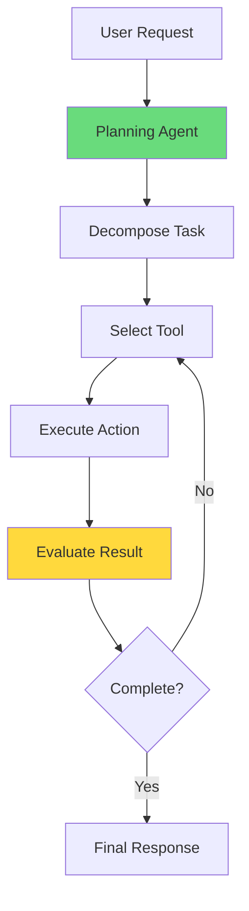
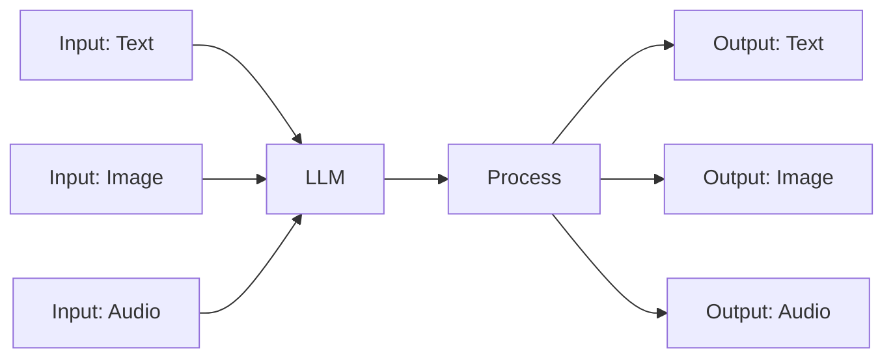

# CLASE 28: TENDENCIAS EN IA PARA NEGOCIOS

## 📅 Duración: 4 Horas (240 minutos)

---

## 28.1 OBJETIVOS DE APRENDIZAJE

Al finalizar esta clase, los participantes serán capaces de:

1. **Comprender Agentic AI** y sus aplicaciones de negocio
2. **Evaluar modelos multimodales** para casos de uso específicos
3. **Explorar Edge AI** y sus posibilidades
4. **Implementar IA local/offline** cuando sea necesario
5. **Preparar su empresa** para las tendencias emergentes

---

## 28.2 CONTENIDOS DETALLADOS

### MÓDULO 1: AGENTIC AI (75 minutos)

#### 28.1.1 ¿Qué es Agentic AI?

Agentic AI se refiere a sistemas de IA que pueden actuar de manera autónoma, no solo responder a prompts. Los agentes pueden:

- **Planificar**: Descomponer tareas complejas en pasos
- **Ejecutar**: Realizar acciones en nombre del usuario
- **Iterar**: Aprender de los resultados y ajustar
- **Usar herramientas**: Interactuar con otros sistemas y APIs

**Diferencia con IA tradicional:**

```
IA tradicional (Chatbot):
User: "What is the weather?"
AI: "The weather in Mexico City is sunny, 25°C"

Agentic AI:
User: "Plan my trip to Mexico City"
Agent: 
  1. Checks calendar for availability
  2. Searches flight options
  3. Finds hotels in budget
  4. Books flights and hotel
  5. Adds to calendar
  6. Sends confirmation
```

#### 28.1.2 Arquitectura de Agentes

**Componentes de un Agente:**

```
1. LLM (Language Model): Cerebro principal
2. Tools: Funciones que puede ejecutar
3. Memory: Memoria de interacciones
4. Planning: Capacidad de planificación
5. Execution: Ejecutar acciones
```

**Tipos de Agentes:**

| Tipo | Capacidad | Ejemplo |
|------|-----------|---------|
| **Reactive** | Responde a estímulos | Chatbot simple |
| **Deliberative** | Planifica acciones | Asistente de viaje |
| **Autonomous** | Opera sin supervisión | Trading bot |
| **Multi-agent** | Colabora con otros | Team de agentes |

#### 28.1.3 Herramientas de Agentic AI

**Herramientas Populares:**

| Herramienta | Descripción | Costo | Link |
|-------------|-------------|-------|------|
| **AutoGPT** | Agente autónomo open source | Free | autogpt.net |
| **BabyAGI** | Agente de tareas | Free | github.com |
| **LangChain** | Framework para agentes | Free | langchain.com |
| **CrewAI** | Agentes colaborativos | Free | crewai.com |
| **Microsoft Copilot** | Asistente empresarial | $30/mes | copilot.microsoft.com |

**En el mundo No-Code:**

- Zapier: Copilot (AI assistant for automation)
- Make: AI features
- n8n: AI agents

---

### MÓDULO 2: MODELOS MULTIMODALES (60 minutos)

#### 28.2.1 ¿Qué son los Modelos Multimodales?

Los modelos multimodales pueden procesar y generar múltiples tipos de datos:

- **Texto**: Leer, escribir, analizar
- **Imágenes**: Ver, generar, editar
- **Audio**: Transcribir, sintetizar
- **Video**: Analizar, generar
- **Combinaciones**:任意tipo de input/output

**Modelos Disponibles:**

| Modelo | Capacidades | Costo | Link |
|--------|-------------|-------|------|
| **GPT-4o** | Texto, imagen, audio | $5-15/1M tokens | openai.com |
| **Gemini Ultra** | Texto, imagen, video | $15/1M input | deepmind.google |
| **Claude 3.5** | Texto, imagen | $3-15/1M tokens | anthropic.com |
| **LLaVA** | Texto, imagen | Open source | llava-vl.github.io |

#### 28.2.2 Aplicaciones de Negocio

**Ejemplos:**

1. **Análisis de videos de soporte**
   - Subir video de llamada de cliente
   - AI extrae: Sentimiento, temas, acciones

2. **Chat con documentos PDF**
   - Subir manual de producto
   - Hacer preguntas en lenguaje natural

3. **Generación de imágenes para marketing**
   - Describir producto
   - AI genera imágenes para campañas

---

### MÓDULO 3: EDGE AI (45 minutos)

#### 28.3.1 ¿Qué es Edge AI?

Edge AI ejecuta modelos de IA en el dispositivo (en el "edge") en lugar de en la nube.

**Beneficios:**

- **Latencia baja**: Respuestas instantáneas
- **Privacidad**: Datos no salen del dispositivo
- **Conectividad**: Funciona sin internet
- **Costo**: Sin costos de API continuous

**Dispositivos:**

- Smartphones (iPhone, Android)
- Laptops con chips AI (Apple Silicon, Snapdragon)
- Dispositivos IoT
- Servidores locales

**Herramientas:**

| Herramienta | Dispositivo | Link |
|-------------|-------------|------|
| **llama.cpp** | Local LLM | github.com |
| **Ollama** | Mac/Windows | ollama.ai |
| **MLX** | Apple Silicon | ml-explore.github.io |
| **TensorFlow Lite** | Mobile/IoT | tensorflow.org/lite |

#### 28.3.2 Casos de Uso

**Edge AI en Negocios:**

```
- Retail: Cámaras con AI para análisis en tienda
- Manufacturing: Detección de defectos en línea
- Healthcare: Dispositivos médicos con IA
- Field Service: Offline AI en tablets
```

---

### MÓDULO 4: IA LOCAL/OFFLINE (30 minutos)

#### 28.4.1 Cuándo Usar IA Local

**Situaciones Ideales:**

1. **Datos altamente confidenciales**
   - Información médica
   - Datos financieros sensibles
   - Secretos comerciales

2. **Conectividad limitada**
   - Oficinas remotas
   - Eventos offline
   - Áreas con internet limitado

3. **Costos de API muy altos**
   - Alto volumen de requests
   -many calls needed

#### 28.4.2 Implementar IA Local

**Ollama (Recomendado para principiantes):**

```
1. Download: ollama.ai
2. Install on Mac/Windows/Linux
3. Run: ollama run llama2
4. Use via API local
```

**En n8n:**

```
1. Install Ollama community node
2. Configure local endpoint
3. Use like any other AI provider
```

---

### MÓDULO 5: PREPARACIÓN PARA EL FUTURO (30 minutos)

#### 28.5.1 Cómo Prepararse

**Acciones Inmediatas:**

1. **Evaluar casos de uso** para Agentic AI
2. **Probar modelos multimodales** en proyectos piloto
3. **Considerar Edge AI** para aplicaciones específicas
4. **Mantener privacidad** de datos críticos

**Observar:**

- Desarrollo de proveedores establecidos
- Nuevas herramientas No-Code
- Tendencias en tu industria

---

## 28.3 DIAGRAMAS EN MERMAID

### Diagrama 1: Agent Architecture



### Diagrama 2: Multimodal Processing



---

## 28.4 REFERENCIAS EXTERNAS

1. **AutoGPT**
   - URL: https://autogpt.net
   - Relevancia: Agentic AI

2. **Ollama**
   - URL: https://ollama.ai
   - Relevancia: IA local

3. **LangChain**
   - URL: https://langchain.com
   - Relevancia: Desarrollo de agentes

---

## 28.5 EJERCICIOS PRÁCTICOS

### Ejercicio 1: Explorar Agentic AI

Probar AutoGPT o similar

### Ejercicio 2: Test Multimodal

Probar GPT-4o con imágenes

### Ejercicio 3: Setup Local

Configurar Ollama

---

## 28.6 ACTIVIDADES DE LABORATORIO

### Laboratorio 1: Research

Investigar tendencias para tu industria

### Laboratorio 2: Prototyping

Crear prototipo con nueva tecnología

---

## 28.7 RESUMEN

- Agentic AI representa siguiente evolución
- Modelos multimodales amplían posibilidades
- Edge AI permite ejecución local
- IA local/offline para datos sensibles
- Preparación temprana da ventaja competitiva

---

**FIN DE LA CLASE 28**
