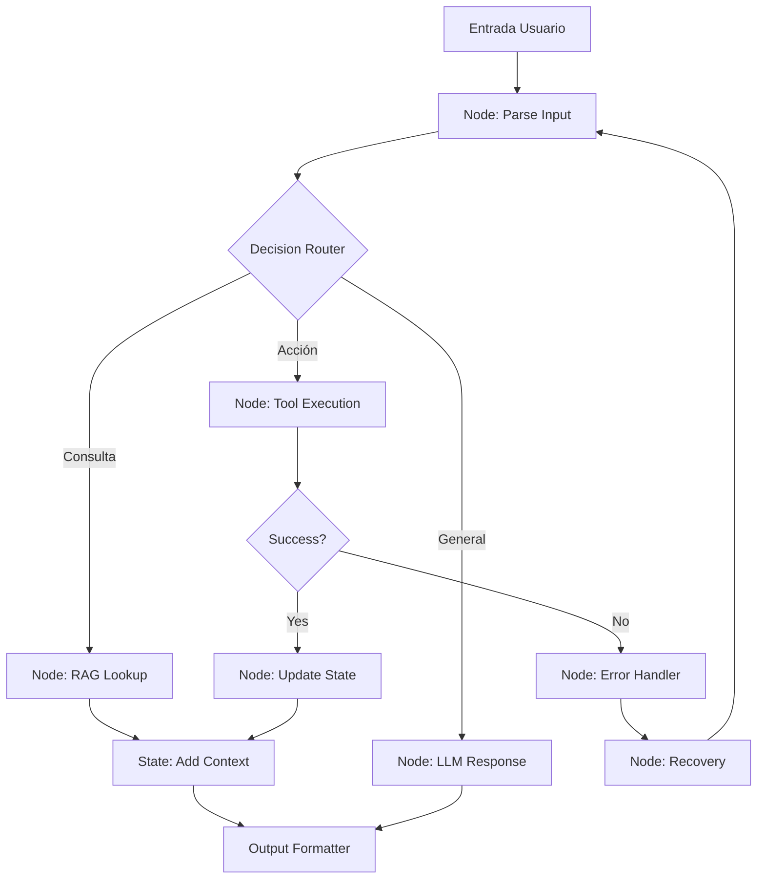
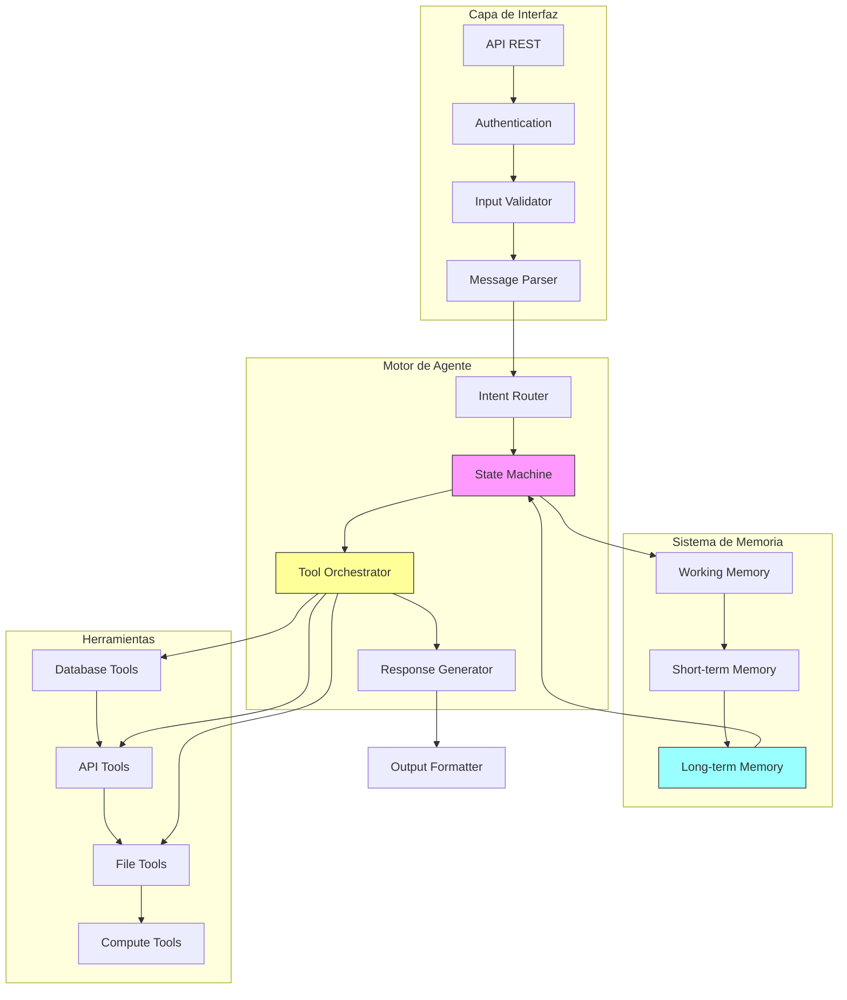
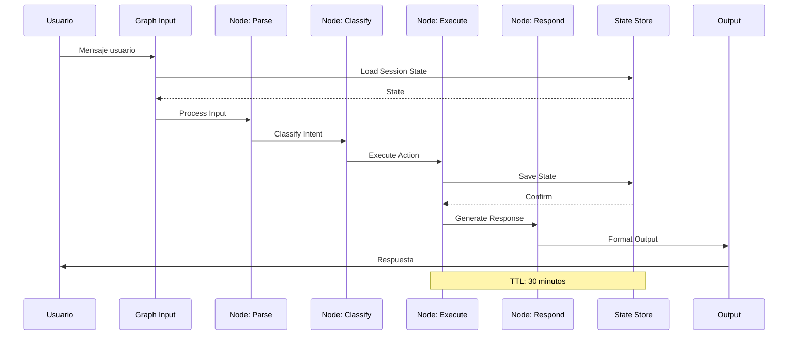
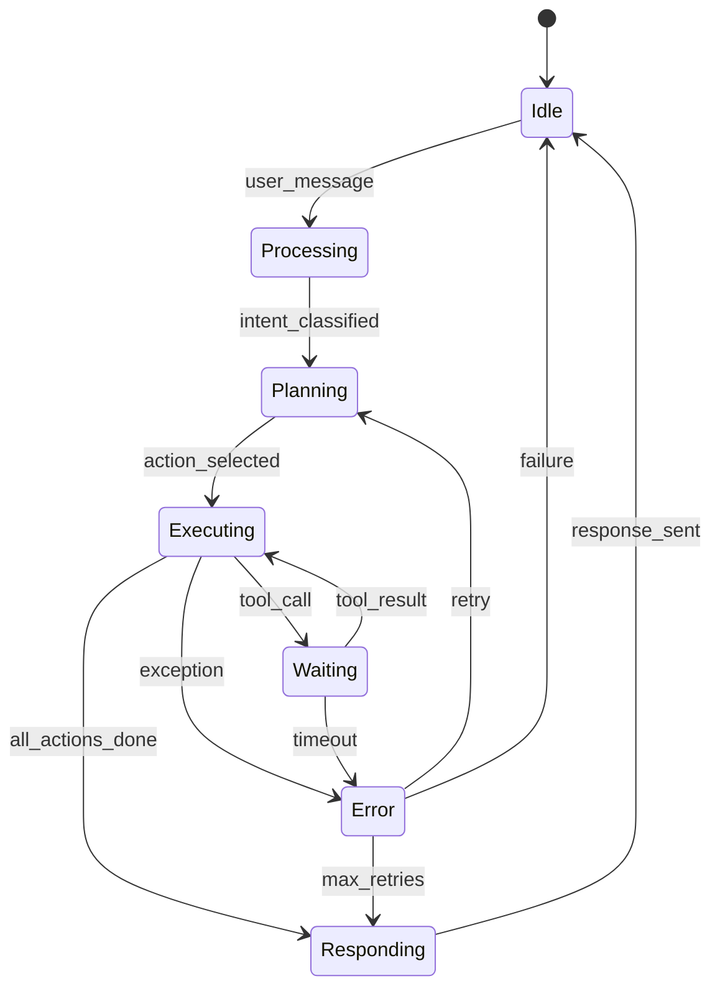

# Clase 1: Workflows Agénticos Industriales - Fundamentos

## Duración
4 horas (240 minutos)

## Objetivos de Aprendizaje
- Comprender las diferencias fundamentales entre chatbots y agentes industriales
- Familiarizarse con las arquitecturas de agentes y sus componentes principales
- Dominar los patrones de diseño específicos para agentes industriales
- Implementar estados y transiciones utilizando LangGraph
- Diseñar workflows agénticos escalables y mantenibles

## Contenidos Detallados

### 1.1 Fundamentos de Agentes Industriales (60 minutos)

Los agentes industriales representan un paradigma computacional fundamentally diferente de los chatbots tradicionales. Mientras que los chatbots operan en un modelo de solicitud-respuesta simple, los agentes industriales son sistemas autonomous que pueden mantener estado, ejecutar acciones complejas, y tomar decisiones basadas en contexto persistente.

#### 1.1.1 Diferenciación Conceptual

Un **chatbot tradicional** sigue un patrón de interacción reactivo:
- Recibe una entrada del usuario
- Procesa la entrada mediante un modelo de lenguaje
- Genera una respuesta
- Olvida el contexto después de cada interacción

Un **agente industrial** opera con un modelo de interacción proactivo:
- Mantiene estado persistente entre interacciones
- Puede ejecutar acciones en sistemas externos
- Planifica secuencias de acciones para alcanzar objetivos
- Aprende de interacciones previas
- Maneja errores y recovery de forma autónoma

La diferencia fundamental radica en que los agentes tienen **agency** - la capacidad de actuar de forma independiente para cumplir objetivos específicos. Esta agency se manifiesta en:

1. **Memoria persistente**: El agente recuerda interacciones previas y puede referenciarlas
2. **Capacidad de acción**: El agente puede invocar APIs, escribir en bases de datos, enviar mensajes
3. **Razonamiento sobre objetivos**: El agente descompone objetivos complejos en pasos ejecutables
4. **Manejo de errores**: El agente puede detectar fallos y ejecutar estrategias de recovery

#### 1.1.2 Taxonomía de Agentes Industriales

En el contexto de organizaciones autónomas, los agentes se clasifican según su complejidad y responsabilidad:

**Agentes de Consulta** (Level 1)
- Responden preguntas basadas en información estructurada
- No ejecutan acciones en sistemas externos
- Ejemplo: Chatbot de FAQ corporativo

**Agentes de Transacción** (Level 2)
- Ejecutan operaciones específicas en sistemas existentes
- Requieren integración con APIs externas
- Ejemplo: Agent para crear tickets de soporte

**Agentes de Orquestación** (Level 3)
- Coordinan múltiples sistemas y agentes
- Manejan transacciones distribuidas
- Ejemplo: Agent de onboarding de empleados

**Agentes de Decisión** (Level 4)
- Toman decisiones complejas con impacto de negocio
- Requieren explicabilidad y audit trail
- Ejemplo: Agent de aprobación de créditos

**Agentes Estratégicos** (Level 5)
- Optimizan procesos a largo plazo
- Predicen tendencias y sugieren estrategias
- Ejemplo: Agent de planificación de producción

### 1.2 Arquitecturas de Agentes (75 minutos)

#### 1.2.1 Componentes Fundamentales

Todo agente industrial se compone de los siguientes elementos arquitectónicos:

**1. Motor de Inferencia**
El componente central que procesa las decisiones del agente. Utiliza modelos de lenguaje como backbone, pero adiciona capacidades de reasoning estructurado.

```
┌─────────────────────────────────────────────────────────┐
│                    AGENTE INDUSTRIAL                     │
├─────────────────────────────────────────────────────────┤
│  ┌─────────────┐  ┌─────────────┐  ┌─────────────────┐  │
│  │   INTERFAZ  │  │   ESTADO    │  │   HERRAMIENTAS  │  │
│  │   DE ENTRADA│  │   PERSIST.  │  │    (TOOLS)      │  │
│  └──────┬──────┘  └──────┬──────┘  └────────┬────────┘  │
│         │                │                   │           │
│  ┌──────▼────────────────▼───────────────────▼────────┐  │
│  │              MOTOR DE INFERENCIA                   │  │
│  │  ┌──────────────────────────────────────────────┐  │  │
│  │  │          Chain of Thought                     │  │  │
│  │  │  Reasoning → Planning → Action Selection      │  │  │
│  │  └──────────────────────────────────────────────┘  │  │
│  └────────────────────────────────────────────────────┘  │
│         │                                               │
│  ┌──────▼──────────────────────────────────────────────┐  │
│  │              MEMORY HIERARCHY                        │  │
│  │  Working → Short-term → Long-term → Semantic       │  │
│  └──────────────────────────────────────────────────────┘  │
└─────────────────────────────────────────────────────────┘
```

**2. Sistema de Herramientas (Tools)**
Conjunto de capacidades que el agente puede invocar. Cada tool está definida con:
- Nombre y descripción clara
- Esquema de parámetros (JSON Schema)
- Función de ejecución
- Manejo de errores

**3. Gestor de Estado**
Administra el estado interno del agente:
- Estado de la conversación actual
- Historial de interacciones
- Variables de contexto
- Metadatos de sesión

**4. Capa de Persistencia**
Almacena información a largo plazo:
- Preferencias del usuario
- Conocimiento del dominio
- Historial de decisiones

#### 1.2.2 Patrón ReAct (Reasoning + Acting)

El patrón ReAct representa la base de muchos agentes modernos. Combina razonamiento explícito con acciones:

```python
# Pseudocódigo del ciclo ReAct
while not goal_reached:
    thought = reasoning_engine.think(current_state)
    action = action_selector.select(thought, available_tools)
    observation = action_executor.execute(action)
    state = state_updater.update(current_state, observation)
```

Este patrón permite que el agente:
1. **Razone** sobre su situación actual
2. **Seleccione** una acción apropiada
3. **Ejecute** la acción
4. **Observé** el resultado
5. **Actualice** su estado

#### 1.2.3 Arquitectura LangGraph

LangGraph es una librería que implementa grafos de estado para agentes. Su arquitectura se basa en:

**Nodos (Nodes)**: Funciones que ejecutan lógica específica
- Funciones de procesamiento
- Llamadas a herramientas
- Lógica de decisión

**Bordes (Edges)**: Transiciones entre nodos
- Transiciones condicionales
- Transiciones deterministas
- Ciclos y loops

**Estado (State)**: Datos compartidos entre nodos
- Diccionario de estado
- Actualizaciones parciales
- Persistencia



### 1.3 Estados y Transiciones (45 minutos)

#### 1.3.1 Modelo de Estados

En LangGraph, el estado se representa como un diccionario que fluye a través del grafo:

```python
from typing import TypedDict, Annotated
from langgraph.graph import StateGraph

class AgentState(TypedDict):
    messages: list  # Historial de mensajes
    current_intent: str  # Intención actual identificada
    context: dict  # Contexto de la conversación
    tools_used: list  # Herramientas ya utilizadas
    result: any  # Resultado final
    error: str | None  # Error si existe
```

#### 1.3.2 Transiciones Condicionales

Las transiciones condicionales permiten routing dinámico:

```python
def route_after_intent(state: AgentState) -> str:
    """Determina la siguiente acción basada en la intención"""
    intent = state.get("current_intent")
    
    if intent in ["query_product", "inventory_status"]:
        return "search"
    elif intent in ["create_order", "modify_order"]:
        return "order_handling"
    elif intent in ["complaint", "support"]:
        return "support_flow"
    else:
        return "general_response"
```

#### 1.3.3 Ciclo de Vida del Agente

```
┌─────────────────────────────────────────────────────────────────┐
│                    CICLO DE VIDA DEL AGENTE                     │
├─────────────────────────────────────────────────────────────────┤
│                                                                 │
│  ┌─────────┐    ┌─────────┐    ┌─────────┐    ┌─────────┐     │
│  │ INITIAL │───▶│ PROCESS │───▶│ EXECUTE │───▶│ RESPOND │     │
│  │ STATE   │    │ REQUEST │    │ ACTION  │    │ RESULT  │     │
│  └─────────┘    └─────────┘    └─────────┘    └────┬────┘     │
│                                                    │           │
│                              ┌──────────────────────┤           │
│                              │                      │           │
│                         ┌────▼────┐           ┌────▼────┐      │
│                         │  ERROR  │           │COMPLETE │      │
│                         │ HANDLER │           │  STATE  │      │
│                         └─────────┘           └─────────┘      │
│                              │                                   │
│                              ▼                                   │
│                      ┌─────────────┐                             │
│                      │   RETRY /   │                             │
│                      │   RECOVERY  │                             │
│                      └──────┬──────┘                             │
│                             │                                    │
│                             └────────────────────────────────────┘
```

### 1.4 Patrones de Diseño para Agentes (40 minutos)

#### 1.4.1 Patrón State Machine

El patrón State Machine es fundamental para agentes con flujos definidos:

```python
from enum import Enum
from typing import Callable

class AgentStateEnum(Enum):
    IDLE = "idle"
    ANALYZING = "analyzing"
    PLANNING = "planning"
    EXECUTING = "executing"
    WAITING = "waiting"
    COMPLETED = "completed"
    ERROR = "error"

class StateMachine:
    def __init__(self):
        self.transitions: dict[tuple[AgentStateEnum, str], AgentStateEnum] = {}
        self.handlers: dict[AgentStateEnum, Callable] = {}
    
    def add_transition(self, from_state: AgentStateEnum, 
                       event: str, to_state: AgentStateEnum):
        self.transitions[(from_state, event)] = to_state
    
    def add_handler(self, state: AgentStateEnum, handler: Callable):
        self.handlers[state] = handler
    
    def process_event(self, current_state: AgentStateEnum, 
                      event: str) -> AgentStateEnum:
        key = (current_state, event)
        if key in self.transitions:
            next_state = self.transitions[key]
            if next_state in self.handlers:
                self.handlers[next_state]()
            return next_state
        return current_state
```

#### 1.4.2 Patrón Chain of Responsibility

Permite encadenar procesamiento:

```python
from abc import ABC, abstractmethod

class Handler(ABC):
    def __init__(self):
        self.next_handler: Handler | None = None
    
    def set_next(self, handler: Handler) -> Handler:
        self.next_handler = handler
        return handler
    
    @abstractmethod
    def handle(self, request: dict) -> dict:
        pass
    
    def _pass_to_next(self, request: dict) -> dict:
        if self.next_handler:
            return self.next_handler.handle(request)
        return request


class IntentClassifier(Handler):
    def handle(self, request: dict) -> dict:
        # Clasificar intención
        intent = self._classify_intent(request["message"])
        request["intent"] = intent
        return self._pass_to_next(request)


class ContextEnricher(Handler):
    def handle(self, request: dict) -> dict:
        # Enrich con contexto
        context = self._fetch_context(request["user_id"])
        request["context"] = context
        return self._pass_to_next(request)
```

#### 1.4.3 Patrón Command Pattern

Para ejecutar acciones reversibles:

```python
from abc import ABC, abstractmethod
from dataclasses import dataclass
from typing import Any

@dataclass
class Command(ABC):
    @abstractmethod
    def execute(self) -> Any:
        pass
    
    @abstractmethod
    def undo(self) -> None:
        pass


class CreateOrderCommand(Command):
    def __init__(self, order_data: dict):
        self.order_data = order_data
        self.order_id: str | None = None
    
    def execute(self) -> str:
        self.order_id = api.create_order(self.order_data)
        return self.order_id
    
    def undo(self) -> None:
        if self.order_id:
            api.cancel_order(self.order_id)


class CompositeCommand(Command):
    def __init__(self, commands: list[Command]):
        self.commands = commands
        self.executed_commands: list[Command] = []
    
    def execute(self) -> Any:
        results = []
        for cmd in self.commands:
            result = cmd.execute()
            self.executed_commands.append(cmd)
            results.append(result)
        return results
    
    def undo(self) -> None:
        for cmd in reversed(self.executed_commands):
            cmd.undo()
```

### 1.5 Tecnologías: LangGraph, Python, Redis (20 minutos)

#### 1.5.1 Configuración del Entorno

```bash
# Entorno virtual
python -m venv venv
source venv/bin/activate  # Linux/Mac
# Windows: venv\Scripts\activate

# Dependencias
pip install langgraph langchain langchain-openai
pip install redis
pip install pydantic
```

#### 1.5.2 Integración con Redis para Estado

```python
import redis
import json
from typing import Any

class RedisStateStore:
    def __init__(self, host: str = "localhost", port: int = 6379):
        self.redis = redis.Redis(host=host, port=port, decode_responses=True)
    
    def save_state(self, session_id: str, state: dict, ttl: int = 3600):
        key = f"agent:state:{session_id}"
        self.redis.setex(key, ttl, json.dumps(state))
    
    def load_state(self, session_id: str) -> dict | None:
        key = f"agent:state:{session_id}"
        data = self.redis.get(key)
        return json.loads(data) if data else None
    
    def delete_state(self, session_id: str):
        key = f"agent:state:{session_id}"
        self.redis.delete(key)
    
    def extend_ttl(self, session_id: str, ttl: int = 3600):
        key = f"agent:state:{session_id}"
        self.redis.expire(key, ttl)
```

## Diagramas

### Diagrama 1: Arquitectura General de Agente Industrial



### Diagrama 2: Flujo de Procesamiento en LangGraph



### Diagrama 3: Máquina de Estados del Agente



## Referencias Externas

1. **LangGraph Documentation**: https://langchain-ai.github.io/langgraph/
2. **LangChain Academy - Agent Fundamentals**: https://academy.langchain.com/
3. **Redis Documentation - Data Types**: https://redis.io/docs/data-types/
4. **Python asyncio Documentation**: https://docs.python.org/3/library/asyncio.html
5. **Pydantic - Data Validation**: https://docs.pydantic.dev/

## Ejercicios Prácticos Resueltos

### Ejercicio 1: Implementar un Agente Simple con LangGraph

**Problema**: Crear un agente que pueda buscar información en una base de datos de productos y responder preguntas sobre inventario.

**Solución**:

```python
"""
Agente de Consulta de Inventario
Implementación completa con LangGraph
"""

from typing import TypedDict, Annotated
from langgraph.graph import StateGraph, END
from langchain_openai import ChatOpenAI
from langchain.prompts import ChatPromptTemplate
import json
from datetime import datetime

# Definir el estado del agente
class InventoryAgentState(TypedDict):
    messages: Annotated[list, "Historial de mensajes"]
    current_query: str
    products_found: list
    response: str
    error: str | None

# Mock database de productos
PRODUCTS_DB = [
    {"id": "P001", "name": "Laptop Pro X", "category": "electronics", 
     "stock": 45, "price": 1299.99, "warehouse": "A"},
    {"id": "P002", "name": "Monitor 27\"", "category": "electronics", 
     "stock": 120, "price": 349.99, "warehouse": "A"},
    {"id": "P003", "name": "Teclado Mecánico", "category": "accessories", 
     "stock": 200, "price": 89.99, "warehouse": "B"},
    {"id": "P004", "name": "Mouse Inalámbrico", "category": "accessories", 
     "stock": 500, "price": 29.99, "warehouse": "B"},
    {"id": "P005", "name": "Webcam HD", "category": "electronics", 
     "stock": 75, "price": 79.99, "warehouse": "A"},
]

# Nodo 1: Parsear la consulta del usuario
def parse_query(state: InventoryAgentState) -> InventoryAgentState:
    """Extrae la query del último mensaje del usuario"""
    messages = state["messages"]
    if messages:
        last_message = messages[-1]
        if isinstance(last_message, dict):
            query = last_message.get("content", "")
        else:
            query = str(last_message)
        state["current_query"] = query
    return state

# Nodo 2: Buscar productos en la base de datos
def search_products(state: InventoryAgentState) -> InventoryAgentState:
    """Busca productos basados en la query"""
    query = state.get("current_query", "").lower()
    results = []
    
    # Búsqueda simple en memoria
    for product in PRODUCTS_DB:
        # Buscar por nombre, categoría o ID
        if (query in product["name"].lower() or 
            query in product["category"] or 
            query in product["id"].lower()):
            results.append(product)
    
    state["products_found"] = results
    return state

# Nodo 3: Generar respuesta
def generate_response(state: InventoryAgentState) -> InventoryAgentState:
    """Genera una respuesta basada en los resultados"""
    products = state.get("products_found", [])
    
    if not products:
        state["response"] = "No encontré productos que coincidan con tu búsqueda."
    else:
        response_lines = ["Aquí están los productos encontrados:\n"]
        
        for p in products:
            line = f"- **{p['name']}** (ID: {p['id']})\n"
            line += f"  Categoría: {p['category']}\n"
            line += f"  Stock: {p['stock']} unidades\n"
            line += f"  Precio: ${p['price']:.2f}\n"
            line += f"  Almacén: {p['warehouse']}\n"
            response_lines.append(line)
        
        state["response"] = "\n".join(response_lines)
    
    return state

# Nodo 4: Agregar respuesta al historial
def add_response_to_history(state: InventoryAgentState) -> InventoryAgentState:
    """Agrega la respuesta al historial de mensajes"""
    state["messages"].append({
        "role": "assistant",
        "content": state.get("response", ""),
        "timestamp": datetime.now().isoformat()
    })
    return state

# Construir el grafo
def create_inventory_agent():
    """Crea el grafo del agente de inventario"""
    
    # Inicializar el grafo
    workflow = StateGraph(InventoryAgentState)
    
    # Agregar nodos
    workflow.add_node("parse_query", parse_query)
    workflow.add_node("search_products", search_products)
    workflow.add_node("generate_response", generate_response)
    workflow.add_node("add_to_history", add_response_to_history)
    
    # Definir el flujo
    workflow.set_entry_point("parse_query")
    workflow.add_edge("parse_query", "search_products")
    workflow.add_edge("search_products", "generate_response")
    workflow.add_edge("generate_response", "add_to_history")
    workflow.add_edge("add_to_history", END)
    
    return workflow.compile()

# Ejecutar el agente
def main():
    # Crear el agente
    agent = create_inventory_agent()
    
    # Estado inicial
    initial_state = {
        "messages": [
            {"role": "user", "content": "Busca productos de categoría electronics", 
             "timestamp": datetime.now().isoformat()}
        ],
        "current_query": "",
        "products_found": [],
        "response": "",
        "error": None
    }
    
    # Ejecutar
    result = agent.invoke(initial_state)
    
    print("=" * 60)
    print("RESULTADO DEL AGENTE")
    print("=" * 60)
    print(f"\nProductos encontrados: {len(result['products_found'])}")
    print(f"\n{result['response']}")
    print("\n" + "=" * 60)

if __name__ == "__main__":
    main()
```

**Explicación**:
1. **InventoryAgentState**: Define la estructura de datos que fluye entre nodos
2. **parse_query**: Extrae la consulta del mensaje del usuario
3. **search_products**: Busca en la base de datos mock
4. **generate_response**: Genera una respuesta formateada
5. **add_response_to_history**: Actualiza el historial para mantener contexto

### Ejercicio 2: Agregar Persistencia con Redis

**Problema**: Modificar el agente anterior para persistir el estado en Redis.

**Solución**:

```python
"""
Agente de Inventario con Persistencia Redis
"""

import redis
import json
from typing import TypedDict, Annotated
from langgraph.graph import StateGraph, END
from datetime import datetime, timedelta

# Cliente Redis
class RedisClient:
    def __init__(self, host="localhost", port=6379):
        self.client = redis.Redis(
            host=host, 
            port=port, 
            decode_responses=True
        )
    
    def save_session(self, session_id: str, state: dict, ttl_minutes: int = 30):
        """Guarda el estado de la sesión"""
        key = f"agent:session:{session_id}"
        state["last_updated"] = datetime.now().isoformat()
        self.client.setex(key, timedelta(minutes=ttl_minutes), json.dumps(state))
    
    def load_session(self, session_id: str) -> dict | None:
        """Carga el estado de la sesión"""
        key = f"agent:session:{session_id}"
        data = self.client.get(key)
        return json.loads(data) if data else None
    
    def extend_session(self, session_id: str, ttl_minutes: int = 30):
        """Extiende el TTL de la sesión"""
        key = f"agent:session:{session_id}"
        self.client.expire(key, timedelta(minutes=ttl_minutes))

# Definición de estado
class AgentState(TypedDict):
    messages: Annotated[list, "Historial de mensajes"]
    context: dict
    current_step: str

# Nodos del agente
def process_input(state: AgentState) -> AgentState:
    last_msg = state["messages"][-1]["content"]
    state["context"]["last_query"] = last_msg
    state["current_step"] = "processing"
    return state

def generate_output(state: AgentState) -> AgentState:
    response = f"Procesé tu mensaje: {state['context'].get('last_query', '')}"
    state["messages"].append({
        "role": "assistant",
        "content": response,
        "timestamp": datetime.now().isoformat()
    })
    state["current_step"] = "completed"
    return state

# Grafo del agente
workflow = StateGraph(AgentState)
workflow.add_node("process", process_input)
workflow.add_node("generate", generate_output)
workflow.set_entry_point("process")
workflow.add_edge("process", "generate")
workflow.add_edge("generate", END)
agent_graph = workflow.compile()

# Gestor de sesiones
class SessionManager:
    def __init__(self, redis_client: RedisClient):
        self.redis = redis_client
    
    def get_or_create_session(self, session_id: str) -> dict:
        """Obtiene una sesión existente o crea una nueva"""
        state = self.redis.load_session(session_id)
        
        if state is None:
            state = {
                "messages": [],
                "context": {},
                "current_step": "init"
            }
            self.redis.save_session(session_id, state)
        
        return state
    
    def execute_agent(self, session_id: str, user_message: str) -> dict:
        """Ejecuta el agente para un mensaje del usuario"""
        
        # Cargar estado existente
        state = self.get_or_create_session(session_id)
        
        # Agregar mensaje del usuario
        state["messages"].append({
            "role": "user",
            "content": user_message,
            "timestamp": datetime.now().isoformat()
        })
        
        # Ejecutar el grafo
        result = agent_graph.invoke(state)
        
        # Guardar estado actualizado
        self.redis.save_session(session_id, result)
        
        return result

# Ejemplo de uso
if __name__ == "__main__":
    # Inicializar
    redis_client = RedisClient()
    session_manager = SessionManager(redis_client)
    
    session_id = "session_001"
    
    # Primera interacción
    print("=== Interacción 1 ===")
    result1 = session_manager.execute_agent(
        session_id, 
        "Hola, quiero información sobre laptops"
    )
    print(result1["messages"][-1]["content"])
    
    # Segunda interacción (recupera estado)
    print("\n=== Interacción 2 ===")
    result2 = session_manager.execute_agent(
        session_id,
        "¿Qué modelos tienes disponibles?"
    )
    print(result2["messages"][-1]["content"])
    
    print("\n=== Estado en Redis ===")
    print(redis_client.load_session(session_id))
```

**Explicación**:
- **RedisClient**: Abstrae las operaciones de Redis
- **SessionManager**: Gestiona el ciclo de vida de las sesiones
- **get_or_create_session**: Recupera o crea el estado inicial
- **execute_agent**: Ejecuta el grafo y persiste el resultado
- El estado se guarda con TTL de 30 minutos por seguridad

## Actividades de Laboratorio

### Laboratorio 1: Configurar un Agente Básico con LangGraph

**Duración**: 45 minutos

**Objetivo**: Implementar un agente que pueda manejar una conversación básica con persistencia de estado.

**Pasos**:
1. Crear un nuevo proyecto Python
2. Instalar dependencias: `pip install langgraph langchain langchain-openai redis`
3. Implementar un agente simple con al menos 3 nodos
4. Agregar persistencia con Redis
5. Probar el agente con múltiples interacciones

**Entregable**: Script de Python funcional que demuestre:
- Creación del grafo
- Ejecución con estado persistente
- Recuperación de contexto entre llamadas

### Laboratorio 2: Implementar una State Machine para un Agente de Soporte

**Duración**: 45 minutos

**Objetivo**: Crear un agente de soporte técnico con estados definidos y transiciones.

**Pasos**:
1. Definir los estados: inicial, clasificando, resolviendo, escalando, completado, error
2. Implementar las transiciones entre estados
3. Agregar lógica de manejo de errores
4. Implementar retry automático con backoff exponencial

**Entregable**: Implementación de la state machine con tests unitarios.

### Laboratorio 3: Diseñar un Patrón Command para Operaciones Reversibles

**Duration**: 30 minutos

**Objetivo**: Implementar el patrón command para operaciones que pueden deshacerse.

**Pasos**:
1. Crear comandos para crear, modificar y eliminar orders
2. Implementar undo para cada operación
3. Crear un composite command para operaciones múltiples
4. Manejar errores y rollback automático

**Entregable**: Implementación del patrón command con ejemplos de uso.

## Resumen de Puntos Clave

1. **Agentes vs Chatbots**: Los agentes tienen agency - pueden actuar independientemente, mantener estado persistente, y ejecutar acciones en sistemas externos.

2. **Arquitectura de Agentes**: Compuesta por motor de inferencia, sistema de herramientas, gestor de estado, y capa de persistencia.

3. **LangGraph**: Framework que implementa grafos de estado para agentes, con nodos (lógica) y bordes (transiciones).

4. **Patrones de Diseño**:
   - State Machine: Estados y transiciones bien definidos
   - Chain of Responsibility: Procesamiento secuencial
   - Command Pattern: Operaciones reversibles

5. **Persistencia con Redis**: El estado del agente se puede persistir en Redis con TTL para control de sesiones.

6. **Ciclo de Vida**: El agente pasa por estados de inicialización, procesamiento, ejecución, respuesta, y posibles errores con recovery.

7. **Tecnología**: Python + LangGraph + Redis es una combinación poderosa para agentes industriales.

8. **Consideraciones de Seguridad**: Always validate input, implement circuit breakers, y mantén logs de auditoría.

9. **Escalabilidad**: Diseñar agentes con estado distribuido permite horizontal scaling.

10. **Testing**: Testear cada nodo independientemente y el grafo completo.