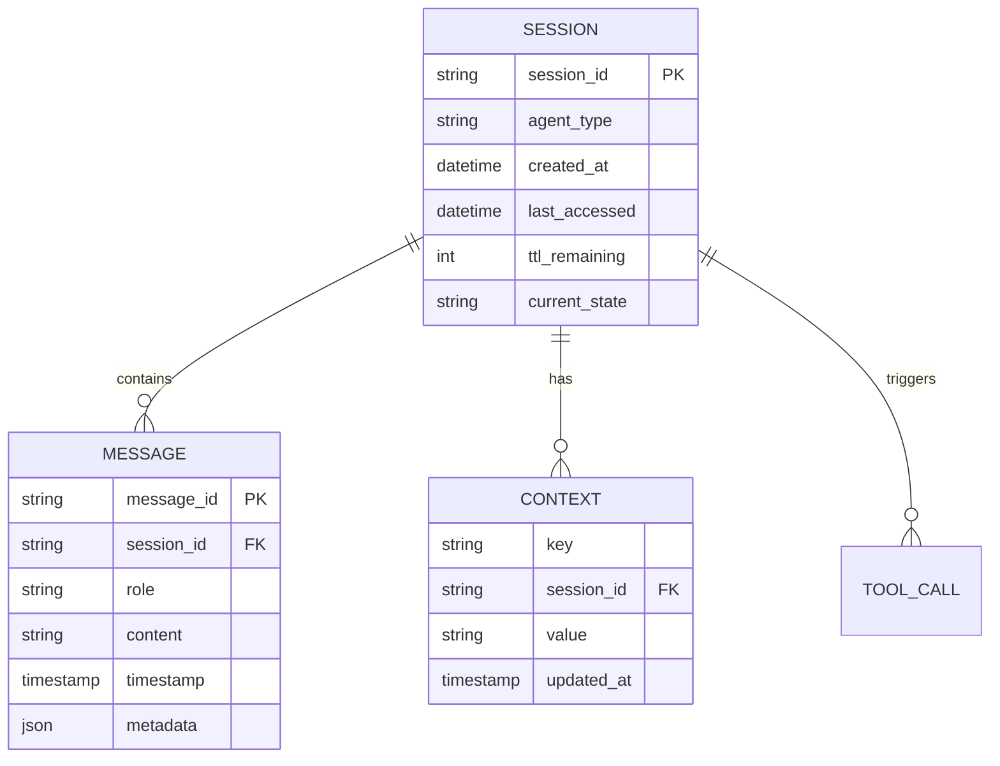
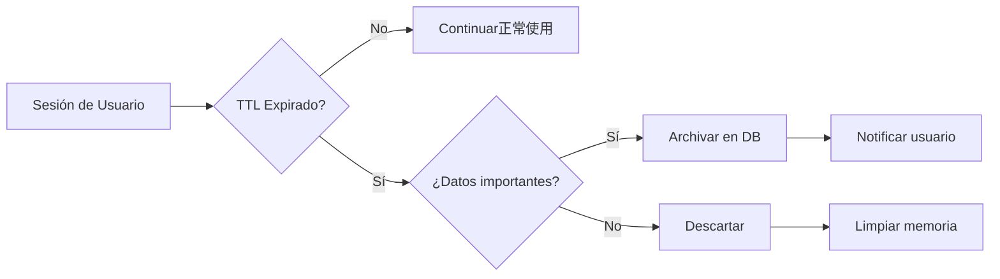
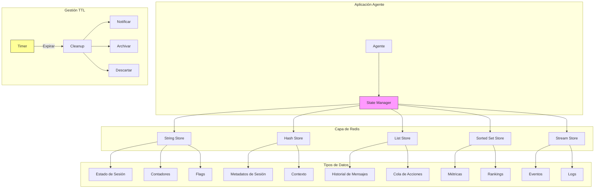
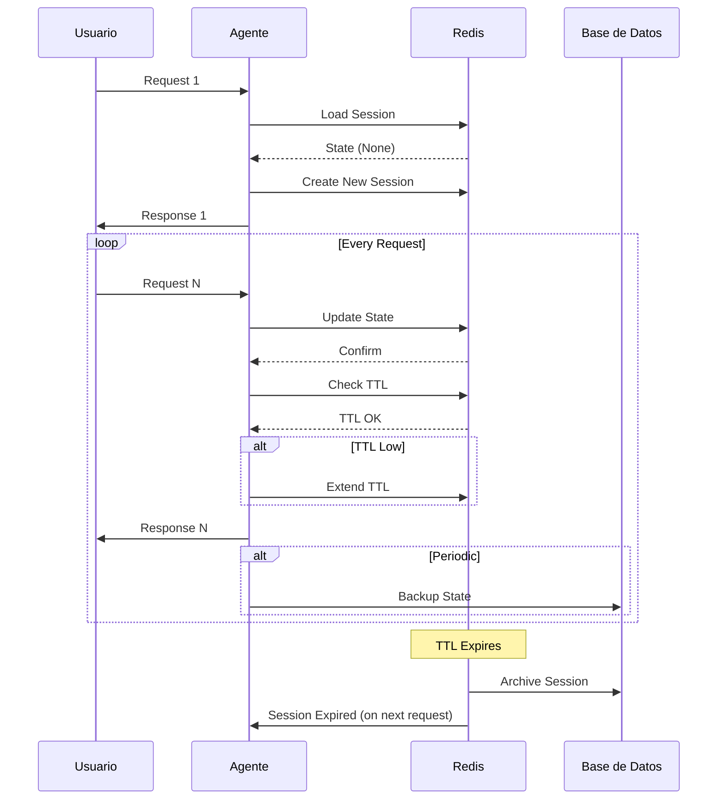

# Clase 2: Persistencia de Estado con Redis

## Duración
4 horas (240 minutos)

## Objetivos de Aprendizaje
- Comprender Redis como store de estado para agentes industriales
- Dominar los tipos de datos de Redis y su aplicación en escenarios agénticos
- Implementar TTL y políticas de expiración para gestión de sesiones
- Diseñar patrones de persistencia robustos y escalables
- Implementar caché distribuido para agentes con alto rendimiento

## Contenidos Detallados

### 2.1 Redis como Store de Estado (60 minutos)

Redis es una base de datos en memoria de código abierto que ofrece velocidad excepcional y estructuras de datos flexibles. Para agentes industriales, Redis sirve como la capa de estado transaccional que conecta las interacciones del usuario con el contexto persistente del agente.

#### 2.1.1 ¿Por qué Redis para Agentes?

La elección de Redis para estado agéntico se fundamenta en varias características técnicas:

**Latencia Ultra-Baja**: Redis opera principalmente en memoria, proporcionando tiempos de respuesta en el orden de microsegundos. Para un agente que debe responder en menos de 2 segundos, esta velocidad es crítica.

**Estructuras de Datos Rich**: Redis ofrece strings, hashes, lists, sets, sorted sets, bitmaps, hyperloglogs, y streams. Cada una de estas estructuras tiene aplicaciones específicas en el contexto de agentes.

**Expiración Flexible**: El soporte nativo para TTL (Time To Live) en cada clave permite gestionar automáticamente el ciclo de vida de las sesiones de agente.

**Persistencia Opcional**: Redis puede funcionar puramente en memoria o persistir a disco, permitiendo elegir el nivel de durabilidad necesario.

**Cluster y Sentinel**: Las capacidades de clustering permiten escalar horizontalmente, mientras que Sentinel proporciona alta disponibilidad automática.

#### 2.1.2 Modelo de Datos para Agentes

Cuando diseñamos el modelo de datos para agentes en Redis, necesitamos considerar:



### 2.2 Tipos de Datos para Agentes (75 minutos)

#### 2.2.1 Strings para Estado Simple

El tipo string de Redis es la estructura más básica pero también la más versátil. Se utiliza para:

- **Identificadores de sesión**: Claves simples que almacenan el estado serializado
- **Contadores**: Métricas de uso, número de interacciones
- **Bloos**: Flags de estado, indicadores de procesamiento

```python
import redis
import json
from datetime import datetime

class StringStateManager:
    """Gestor de estado usando strings de Redis"""
    
    def __init__(self, redis_client: redis.Redis):
        self.redis = redis_client
    
    def save_agent_state(self, session_id: str, state: dict, ttl: int = 1800):
        """
        Guarda el estado completo del agente como string JSON
        """
        key = f"agent:state:{session_id}"
        
        # Agregar metadatos
        full_state = {
            "data": state,
            "metadata": {
                "last_updated": datetime.now().isoformat(),
                "version": "1.0"
            }
        }
        
        # Serializar y guardar con TTL
        self.redis.setex(
            key,
            ttl,
            json.dumps(full_state)
        )
    
    def load_agent_state(self, session_id: str) -> dict | None:
        """Carga el estado del agente"""
        key = f"agent:state:{session_id}"
        data = self.redis.get(key)
        
        if data:
            return json.loads(data)
        return None
    
    def increment_interaction_count(self, session_id: str) -> int:
        """Incrementa el contador de interacciones"""
        key = f"agent:metrics:{session_id}:interactions"
        return self.redis.incr(key)
    
    def set_agent_status(self, session_id: str, status: str, ttl: int = 3600):
        """Establece el estado actual del agente"""
        key = f"agent:status:{session_id}"
        self.redis.setex(key, ttl, status)
    
    def get_agent_status(self, session_id: str) -> str | None:
        """Obtiene el estado actual del agente"""
        key = f"agent:status:{session_id}"
        return self.redis.get(key)
```

#### 2.2.2 Hashes para Datos Estructurados

Los hashes de Redis son ideales para representar objetos con múltiples campos:

```python
class HashStateManager:
    """Gestor de estado usando hashes de Redis"""
    
    def __init__(self, redis_client: redis.Redis):
        self.redis = redis_client
    
    def create_session(self, session_id: str, agent_type: str, metadata: dict):
        """
        Crea una nueva sesión como hash
        """
        key = f"agent:session:{session_id}"
        
        session_data = {
            "session_id": session_id,
            "agent_type": agent_type,
            "created_at": datetime.now().isoformat(),
            "last_accessed": datetime.now().isoformat(),
            "state": "initial",
            "messages_count": "0",
            "errors_count": "0"
        }
        
        # Agregar metadata adicional
        session_data.update(metadata)
        
        self.redis.hset(key, mapping=session_data)
        
        # Establecer TTL en la clave
        self.redis.expire(key, 1800)
    
    def update_session_field(self, session_id: str, field: str, value: str):
        """Actualiza un campo específico del sesión"""
        key = f"agent:session:{session_id}"
        self.redis.hset(key, field, value)
        self.redis.hset(key, "last_accessed", datetime.now().isoformat())
    
    def get_session_data(self, session_id: str) -> dict:
        """Obtiene todos los datos de la sesión"""
        key = f"agent:session:{session_id}"
        return self.redis.hgetall(key)
    
    def increment_field(self, session_id: str, field: str) -> int:
        """Incrementa un campo numérico"""
        key = f"agent:session:{session_id}"
        return self.redis.hincrby(key, field, 1)
    
    def get_session_state(self, session_id: str) -> str:
        """Obtiene el estado actual de la sesión"""
        key = f"agent:session:{session_id}"
        return self.redis.hget(key, "state")
```

#### 2.2.3 Lists para Historial de Mensajes

Las listas son perfectas para mantener el historial de mensajes:

```python
class MessageHistoryManager:
    """Gestor de historial de mensajes usando listas"""
    
    def __init__(self, redis_client: redis.Redis):
        self.redis = redis_client
        self.max_messages = 100  # Mantener últimos 100 mensajes
    
    def add_message(self, session_id: str, role: str, content: str, 
                    metadata: dict = None):
        """
        Agrega un mensaje al historial de la sesión
        """
        key = f"agent:messages:{session_id}"
        
        message = {
            "role": role,
            "content": content,
            "timestamp": datetime.now().isoformat(),
            "metadata": json.dumps(metadata or {})
        }
        
        # Agregar al final de la lista (right push)
        self.redis.rpush(key, json.dumps(message))
        
        # Recortar si excede el máximo
        self.redis.ltrim(key, -self.max_messages, -1)
        
        # Actualizar TTL
        self.redis.expire(key, 1800)
    
    def get_recent_messages(self, session_id: str, count: int = 10) -> list:
        """Obtiene los mensajes más recientes"""
        key = f"agent:messages:{session_id}"
        
        # Obtener los últimos 'count' mensajes
        messages = self.redis.lrange(key, -count, -1)
        
        return [json.loads(m) for m in messages]
    
    def get_full_history(self, session_id: str) -> list:
        """Obtiene todo el historial de mensajes"""
        return self.get_recent_messages(session_id, self.max_messages)
    
    def clear_history(self, session_id: str):
        """Limpia el historial de mensajes"""
        key = f"agent:messages:{session_id}"
        self.redis.delete(key)
```

#### 2.2.4 Sorted Sets para Métricas Temporales

Los sorted sets permiten mantener datos ordenados por puntuación, útil para métricas:

```python
class MetricsManager:
    """Gestor de métricas usando sorted sets"""
    
    def __init__(self, redis_client: redis.Redis):
        self.redis = redis_client
    
    def record_latency(self, agent_type: str, latency_ms: float):
        """Registra la latencia de una operación"""
        key = f"agent:metrics:{agent_type}:latency"
        timestamp = datetime.now().timestamp()
        
        self.redis.zadd(key, {f"{timestamp}": latency_ms})
        
        # Mantener solo últimos 10000 registros
        self.redis.zremrangebyrank(key, 0, -10001)
        self.redis.expire(key, 86400)  # 24 horas
    
    def get_p95_latency(self, agent_type: str) -> float:
        """Obtiene la latencia P95"""
        key = f"agent:metrics:{agent_type}:latency"
        
        latencies = self.redis.zrange(key, 0, -1, withscores=True)
        
        if not latencies:
            return 0.0
        
        # Calcular percentil 95
        sorted_latencies = sorted([l[1] for l in latencies])
        index = int(len(sorted_latencies) * 0.95)
        
        return sorted_latencies[index] if index < len(sorted_latencies) else sorted_latencies[-1]
    
    def record_tool_usage(self, session_id: str, tool_name: str):
        """Registra uso de herramienta"""
        key = f"agent:tools:usage"
        
        self.redis.zincrby(key, 1, tool_name)
        self.redis.expire(key, 604800)  # 7 días
    
    def get_top_tools(self, limit: int = 10) -> list:
        """Obtiene las herramientas más usadas"""
        key = f"agent:tools:usage"
        return self.redis.zrevrange(key, 0, limit - 1, withscores=True)
```

#### 2.2.5 Streams para Eventos

Los streams son ideales para manejar eventos asíncronos:

```python
class EventStreamManager:
    """Gestor de eventos usando streams de Redis"""
    
    def __init__(self, redis_client: redis.Redis):
        self.redis = redis_client
    
    def publish_agent_event(self, session_id: str, event_type: str, 
                           event_data: dict):
        """Publica un evento del agente"""
        stream_key = f"agent:events:{event_type}"
        
        event = {
            "session_id": session_id,
            "timestamp": datetime.now().isoformat(),
            **event_data
        }
        
        self.redis.xadd(stream_key, event)
    
    def consume_agent_events(self, consumer_group: str, 
                            consumer_name: str, count: int = 10):
        """Consume eventos de agentes"""
        stream_key = "agent:events:global"
        
        # Crear grupo de consumidores si no existe
        try:
            self.redis.xgroup_create(stream_key, consumer_group, id="0")
        except redis.exceptions.ResponseError:
            pass  # Grupo ya existe
        
        # Consumir mensajes
        messages = self.redis.xreadgroup(
            consumer_group,
            consumer_name,
            {stream_key: ">"},
            count=count
        )
        
        return messages
    
    def acknowledge_event(self, stream_key: str, message_id: str):
        """Confirma el procesamiento de un evento"""
        self.redis.xack(stream_key, "default", message_id)
```

### 2.3 TTL y Expiración (45 minutos)

#### 2.3.1 Estrategias de TTL

La gestión del tiempo de vida de las sesiones es crucial para:



```python
from datetime import timedelta

class TTLManager:
    """Gestor de TTL para sesiones de agente"""
    
    # Configuración de TTLs por tipo de sesión
    TTL_CONFIG = {
        "consultation": 1800,      # 30 minutos
        "transaction": 3600,       # 1 hora
        "complex_task": 7200,     # 2 horas
        "background": 14400,       # 4 horas
    }
    
    def __init__(self, redis_client: redis.Redis):
        self.redis = redis_client
    
    def set_session_ttl(self, session_id: str, session_type: str):
        """Establece el TTL basado en el tipo de sesión"""
        ttl = self.TTL_CONFIG.get(session_type, 1800)
        
        key = f"agent:session:{session_id}"
        self.redis.expire(key, ttl)
        
        return ttl
    
    def extend_ttl(self, session_id: str, additional_seconds: int = 1800):
        """Extiende el TTL de una sesión"""
        key = f"agent:session:{session_id}"
        
        # Obtener TTL actual
        current_ttl = self.redis.ttl(key)
        
        if current_ttl > 0:
            # Extender por el adicional
            new_ttl = min(current_ttl + additional_seconds, 7200)
            self.redis.expire(key, new_ttl)
            return new_ttl
        
        return 0
    
    def get_remaining_ttl(self, session_id: str) -> int:
        """Obtiene el TTL restante"""
        key = f"agent:session:{session_id}"
        return self.redis.ttl(key)
    
    def should_extend(self, session_id: str) -> bool:
        """Determina si la sesión debe extenderse"""
        key = f"agent:session:{session_id}"
        ttl = self.redis.ttl(key)
        
        # Extender si queda menos de 5 minutos
        return 0 < ttl < 300
    
    def schedule_cleanup(self, session_id: str):
        """Programa limpieza de datos"""
        # Usar un sorted set para limpieza diferida
        key = "agent:cleanup:scheduled"
        cleanup_time = (datetime.now() + timedelta(minutes=5)).timestamp()
        
        self.redis.zadd(key, {session_id: cleanup_time})
```

#### 2.3.2 Expiración de Datos Agénticos

```python
class AgentDataExpiration:
    """Gestor de expiración de datos del agente"""
    
    def __init__(self, redis_client: redis.Redis):
        self.redis = redis_client
    
    def set_expiring_data(self, session_id: str, data_type: str, 
                         data: dict, ttl: int):
        """Guarda datos con expiración"""
        key = f"agent:{data_type}:{session_id}"
        
        self.redis.setex(key, ttl, json.dumps(data))
    
    def get_data_with_refresh(self, session_id: str, data_type: str, 
                              default_ttl: int = 3600) -> dict | None:
        """
        Obtiene datos y renueva TTL si existen
        """
        key = f"agent:{data_type}:{session_id}"
        
        data = self.redis.get(key)
        
        if data:
            # Renovar TTL
            self.redis.expire(key, default_ttl)
            return json.loads(data)
        
        return None
    
    def cleanup_expired_sessions(self):
        """Limpia sesiones expiradas"""
        pattern = "agent:session:*"
        
        for key in self.redis.scan_iter(match=pattern):
            if self.redis.ttl(key) == -1:  # Sin TTL
                self.redis.delete(key)
```

### 2.4 Patrones de Persistencia (40 minutos)

#### 2.4.1 Patrón Snapshot

Guarda el estado completo periódicamente:

```python
class SnapshotManager:
    """Patrón snapshot para persistencia de estado"""
    
    def __init__(self, redis_client: redis.Redis):
        self.redis = redis_client
        self.snapshot_interval = 300  # 5 minutos
    
    def save_snapshot(self, session_id: str, state: dict):
        """Guarda un snapshot del estado"""
        key = f"agent:snapshot:{session_id}"
        
        snapshot = {
            "state": state,
            "timestamp": datetime.now().isoformat(),
            "version": "1.0"
        }
        
        # Usar lista para mantener varios snapshots
        self.redis.lpush(key, json.dumps(snapshot))
        self.redis.ltrim(key, 0, 9)  # Mantener últimos 10
        self.redis.expire(key, 3600)  # 1 hora
    
    def get_latest_snapshot(self, session_id: str) -> dict | None:
        """Obtiene el snapshot más reciente"""
        key = f"agent:snapshot:{session_id}"
        
        snapshot = self.redis.lindex(key, 0)
        return json.loads(snapshot) if snapshot else None
    
    def restore_from_snapshot(self, session_id: str) -> dict | None:
        """Restaura el estado desde el último snapshot"""
        return self.get_latest_snapshot(session_id)
```

#### 2.4.2 Patrón Write-Behind

Escribe primero en Redis y luego en base de datos:

```python
import threading
import time
from queue import Queue

class WriteBehindManager:
    """Patrón write-behind para persistencia"""
    
    def __init__(self, redis_client: redis.Redis, db_pool):
        self.redis = redis_client
        self.db_pool = db_pool
        self.write_queue = Queue()
        self.running = True
        
        # Hilo de escritura asíncrona
        self.writer_thread = threading.Thread(target=self._writer_loop)
        self.writer_thread.start()
    
    def write_state(self, session_id: str, state: dict):
        """Escribe estado en Redis (rápido)"""
        key = f"agent:state:{session_id}"
        self.redis.setex(key, 1800, json.dumps(state))
        
        # Enqueue para escritura a DB
        self.write_queue.put({
            "session_id": session_id,
            "state": state,
            "timestamp": datetime.now().isoformat()
        })
    
    def _writer_loop(self):
        """Hilo que escribe a la base de datos"""
        while self.running:
            try:
                item = self.write_queue.get(timeout=1)
                
                # Simular escritura a DB
                # db.write(item["session_id"], item["state"])
                
                self.write_queue.task_done()
            except:
                continue
    
    def shutdown(self):
        """Detiene el hilo de escritura"""
        self.running = False
        self.writer_thread.join()
```

#### 2.4.3 Patrón Cache-Aside

```python
class CacheAsideManager:
    """Patrón cache-aside para datos frecuentes"""
    
    def __init__(self, redis_client: redis.Redis):
        self.redis = redis_client
    
    def get_or_compute(self, key: str, compute_func, ttl: int = 3600):
        """
        Obtiene de cache o computa si no existe
        """
        # Intentar obtener de cache
        cached = self.redis.get(key)
        
        if cached:
            return json.loads(cached)
        
        # Computar valor
        value = compute_func()
        
        # Guardar en cache
        self.redis.setex(key, ttl, json.dumps(value))
        
        return value
    
    def invalidate(self, key: str):
        """Invalida una entrada de cache"""
        self.redis.delete(key)
    
    def invalidate_pattern(self, pattern: str):
        """Invalida todas las claves que coinciden con el patrón"""
        for key in self.redis.scan_iter(match=pattern):
            self.redis.delete(key)
```

### 2.5 Tecnologías: Redis, Python, redis-py (20 minutos)

#### 2.5.1 Configuración de Cliente Redis

```python
import redis
from redis import Redis
from typing import Optional

class RedisAgentClient:
    """Cliente Redis optimizado para agentes"""
    
    def __init__(
        self,
        host: str = "localhost",
        port: int = 6379,
        password: Optional[str] = None,
        db: int = 0,
        max_connections: int = 50,
        socket_timeout: int = 5,
        socket_connect_timeout: int = 5,
        decode_responses: bool = True
    ):
        self.pool = redis.ConnectionPool(
            host=host,
            port=port,
            password=password,
            db=db,
            max_connections=max_connections,
            socket_timeout=socket_timeout,
            socket_connect_timeout=socket_connect_timeout,
            decode_responses=decode_responses
        )
        
        self.client = redis.Redis(connection_pool=self.pool)
    
    def get_client(self) -> Redis:
        return self.client
    
    def test_connection(self) -> bool:
        """Prueba la conexión a Redis"""
        try:
            return self.client.ping()
        except:
            return False
    
    def get_info(self) -> dict:
        """Obtiene información del servidor"""
        return self.client.info()
    
    def close(self):
        """Cierra la conexión"""
        self.pool.disconnect()
```

#### 2.5.2 Configuración de Pool de Conexiones

```python
# config.py
import os
from dataclasses import dataclass

@dataclass
class RedisConfig:
    host: str = os.getenv("REDIS_HOST", "localhost")
    port: int = int(os.getenv("REDIS_PORT", "6379"))
    password: str | None = os.getenv("REDIS_PASSWORD")
    db: int = int(os.getenv("REDIS_DB", "0"))
    max_connections: int = int(os.getenv("REDIS_MAX_CONNECTIONS", "50"))
    socket_timeout: int = 5
    socket_connect_timeout: int = 5
    
    @property
    def url(self) -> str:
        if self.password:
            return f"redis://:{self.password}@{self.host}:{self.port}/{self.db}"
        return f"redis://{self.host}:{self.port}/{self.db}"


# usage.py
from config import RedisConfig

config = RedisConfig()
client = RedisAgentClient(
    host=config.host,
    port=config.port,
    password=config.password,
    db=config.db,
    max_connections=config.max_connections
)
```

## Diagramas

### Diagrama 1: Arquitectura de Persistencia Redis para Agentes



### Diagrama 2: Flujo de Persistencia de Sesión



### Diagrama 3: Patrones de Persistencia

```mermaid
flowchart LR
    subgraph "Patrón Write-Behind"
        A[Agente] --> B[Redis (Fast)]
        B --> C[Write Queue]
        C --> D[DB (Async)]
    end
    
    subgraph "Patrón Cache-Aside"
        E[Agente] --> F{Cache Hit?}
        F -->|Yes| G[Return Cache]
        F -->|No| H[Compute]
        H --> I[Write Cache]
        I --> G
    end
    
    subgraph "Patrón Snapshot"
        J[Agente] --> K[Redis]
        K --> L[Snapshot List]
        L --> M[DB Archive]
    end
    
    style A fill:#f9f,stroke:#333
    style E fill:#9ff,stroke:#333
    style J fill:#ff9,stroke:#333
```

## Referencias Externas

1. **Redis Documentation**: https://redis.io/docs/
2. **Redis Python Client**: https://redis.readthedocs.io/
3. **Redis Streams**: https://redis.io/docs/data-types/streams/
4. **Redis Persistence**: https://redis.io/docs/management/persistence/
5. **Redis Cluster**: https://redis.io/docs/management/scaling/

## Ejercicios Prácticos Resueltos

### Ejercicio 1: Implementar un Sistema de Sesiones con Redis

**Problema**: Crear un sistema completo de gestión de sesiones para un agente industrial que incluya estado, historial de mensajes y métricas.

**Solución**:

```python
"""
Sistema de Gestión de Sesiones para Agentes
Implementación completa con Redis
"""

import redis
import json
from datetime import datetime, timedelta
from typing import Any, Optional
from dataclasses import dataclass, asdict
from enum import Enum
import uuid

# ==================== CLASES DE MODELO ====================

class AgentType(Enum):
    CONSULTATION = "consultation"
    TRANSACTION = "transaction"
    COMPLEX_TASK = "complex_task"
    BACKGROUND = "background"


class SessionState(Enum):
    INITIAL = "initial"
    ACTIVE = "active"
    IDLE = "idle"
    COMPLETED = "completed"
    ERROR = "error"


@dataclass
class Message:
    """Representa un mensaje en la sesión"""
    id: str
    role: str  # "user" o "assistant"
    content: str
    timestamp: str
    metadata: dict
    
    def to_dict(self) -> dict:
        return asdict(self)


@dataclass
class Session:
    """Representa una sesión del agente"""
    session_id: str
    agent_type: str
    user_id: str
    created_at: str
    last_accessed: str
    state: str
    context: dict
    metadata: dict


# ==================== GESTOR DE SESIONES ====================

class SessionManager:
    """Gestor completo de sesiones de agente"""
    
    # TTLs por tipo de agente (en segundos)
    TTL_BY_TYPE = {
        AgentType.CONSULTATION: 1800,     # 30 min
        AgentType.TRANSACTION: 3600,      # 1 hora
        AgentType.COMPLEX_TASK: 7200,     # 2 horas
        AgentType.BACKGROUND: 14400,      # 4 horas
    }
    
    def __init__(self, redis_client: redis.Redis):
        self.redis = redis_client
    
    def create_session(
        self,
        agent_type: AgentType,
        user_id: str,
        initial_context: dict = None
    ) -> str:
        """Crea una nueva sesión"""
        
        session_id = str(uuid.uuid4())
        ttl = self.TTL_BY_TYPE.get(agent_type, 1800)
        now = datetime.now().isoformat()
        
        # 1. Crear datos de sesión como hash
        session_key = f"agent:session:{session_id}"
        
        session_data = {
            "session_id": session_id,
            "agent_type": agent_type.value,
            "user_id": user_id,
            "created_at": now,
            "last_accessed": now,
            "state": SessionState.INITIAL.value,
            "context": json.dumps(initial_context or {}),
            "metadata": json.dumps({}),
            "ttl": str(ttl)
        }
        
        self.redis.hset(session_key, mapping=session_data)
        self.redis.expire(session_key, ttl)
        
        # 2. Crear lista de mensajes vacía
        messages_key = f"agent:messages:{session_id}"
        self.redis.expire(messages_key, ttl)
        
        # 3. Crear índice de sesiones por usuario
        user_sessions_key = f"user:sessions:{user_id}"
        self.redis.zadd(user_sessions_key, {session_id: datetime.now().timestamp()})
        self.redis.expire(user_sessions_key, ttl * 2)
        
        return session_id
    
    def get_session(self, session_id: str) -> Optional[dict]:
        """Obtiene los datos de una sesión"""
        
        session_key = f"agent:session:{session_id}"
        data = self.redis.hgetall(session_key)
        
        if not data:
            return None
        
        # Deserializar campos JSON
        data["context"] = json.loads(data.get("context", "{}"))
        data["metadata"] = json.loads(data.get("metadata", "{}"))
        data["ttl"] = int(data.get("ttl", 0))
        
        return data
    
    def update_session(self, session_id: str, updates: dict):
        """Actualiza campos de la sesión"""
        
        session_key = f"agent:session:{session_id}"
        
        # Agregar timestamp de última actualización
        updates["last_accessed"] = datetime.now().isoformat()
        
        # Serializar campos JSON
        for field in ["context", "metadata"]:
            if field in updates and isinstance(updates[field], dict):
                updates[field] = json.dumps(updates[field])
        
        self.redis.hset(session_key, mapping=updates)
        
        # Renovar TTL si la sesión está activa
        current_state = self.redis.hget(session_key, "state")
        if current_state in [SessionState.ACTIVE.value, SessionState.IDLE.value]:
            session_data = self.redis.hgetall(session_key)
            ttl = int(session_data.get("ttl", 1800))
            self.redis.expire(session_key, ttl)
    
    def add_message(
        self,
        session_id: str,
        role: str,
        content: str,
        metadata: dict = None
    ) -> str:
        """Agrega un mensaje al historial de la sesión"""
        
        message_id = str(uuid.uuid4())
        message = Message(
            id=message_id,
            role=role,
            content=content,
            timestamp=datetime.now().isoformat(),
            metadata=metadata or {}
        )
        
        messages_key = f"agent:messages:{session_id}"
        self.redis.rpush(messages_key, json.dumps(message.to_dict()))
        
        # Recortar a los últimos 100 mensajes
        self.redis.ltrim(messages_key, -100, -1)
        self.redis.expire(messages_key, 3600)
        
        return message_id
    
    def get_messages(self, session_id: str, limit: int = 50) -> list:
        """Obtiene los mensajes de la sesión"""
        
        messages_key = f"agent:messages:{session_id}"
        messages_raw = self.redis.lrange(messages_key, -limit, -1)
        
        return [json.loads(m) for m in messages_raw]
    
    def delete_session(self, session_id: str):
        """Elimina una sesión y todos sus datos"""
        
        # Eliminar datos de sesión
        self.redis.delete(f"agent:session:{session_id}")
        
        # Eliminar mensajes
        self.redis.delete(f"agent:messages:{session_id}")
        
        # Eliminar de índice de usuario
        user_id = self.redis.hget(f"agent:session:{session_id}", "user_id")
        if user_id:
            self.redis.zrem(f"user:sessions:{user_id}", session_id)
    
    def extend_session(self, session_id: str, additional_time: int = 1800) -> bool:
        """Extiende el TTL de una sesión"""
        
        session_key = f"agent:session:{session_id}"
        
        current_ttl = self.redis.ttl(session_key)
        
        if current_ttl > 0:
            new_ttl = min(current_ttl + additional_time, 7200)
            self.redis.expire(session_key, new_ttl)
            
            # Actualizar también la lista de mensajes
            self.redis.expire(f"agent:messages:{session_id}", new_ttl)
            
            return True
        
        return False


# ==================== EJEMPLO DE USO ====================

def main():
    """Ejemplo de uso del sistema de sesiones"""
    
    # Conectar a Redis
    client = redis.Redis(
        host="localhost",
        port=6379,
        decode_responses=True
    )
    
    # Verificar conexión
    if not client.ping():
        print("Error: No se puede conectar a Redis")
        return
    
    # Crear gestor de sesiones
    manager = SessionManager(client)
    
    # 1. Crear una nueva sesión
    print("=" * 60)
    print("1. Crear nueva sesión")
    print("=" * 60)
    
    session_id = manager.create_session(
        agent_type=AgentType.TRANSACTION,
        user_id="user_001",
        initial_context={"language": "es", "product": "laptops"}
    )
    print(f"Session ID: {session_id}")
    
    # 2. Obtener la sesión
    session = manager.get_session(session_id)
    print(f"\nSesión creada:")
    print(f"  Estado: {session['state']}")
    print(f"  Tipo: {session['agent_type']}")
    print(f"  Usuario: {session['user_id']}")
    
    # 3. Agregar mensajes
    print("\n" + "=" * 60)
    print("2. Agregar mensajes")
    print("=" * 60)
    
    manager.add_message(
        session_id,
        role="user",
        content="Quiero información sobre laptops disponibles"
    )
    
    manager.add_message(
        session_id,
        role="assistant",
        content="Por supuesto, tengo 5 modelos disponibles..."
    )
    
    manager.add_message(
        session_id,
        role="user",
        content="¿Cuál es el precio del modelo Pro X?"
    )
    
    messages = manager.get_messages(session_id)
    print(f"Mensajes en la sesión: {len(messages)}")
    for msg in messages:
        print(f"  [{msg['role']}] {msg['content'][:50]}...")
    
    # 4. Actualizar estado
    print("\n" + "=" * 60)
    print("3. Actualizar sesión")
    print("=" * 60)
    
    manager.update_session(
        session_id,
        {
            "state": SessionState.ACTIVE.value,
            "context": json.dumps({
                "language": "es",
                "product": "laptops",
                "current_topic": "pricing"
            })
        }
    )
    
    updated_session = manager.get_session(session_id)
    print(f"Estado actualizado: {updated_session['state']}")
    print(f"TTL remaining: {client.ttl(f'agent:session:{session_id}')} segundos")
    
    # 5. Extender sesión
    print("\n" + "=" * 60)
    print("4. Extender sesión")
    print("=" * 60)
    
    manager.extend_session(session_id, 3600)
    print(f"Nuevo TTL: {client.ttl(f'agent:session:{session_id}')} segundos")
    
    # 6. Limpiar
    print("\n" + "=" * 60)
    print("5. Limpiar sesión")
    print("=" * 60)
    
    manager.delete_session(session_id)
    print("Sesión eliminada")
    
    print("\n" + "=" * 60)
    print("EJEMPLO COMPLETADO")
    print("=" * 60)


if __name__ == "__main__":
    main()
```

**Explicación del código**:

1. **SessionManager**: Clase principal que maneja todas las operaciones de sesión
2. **create_session**: Crea la sesión con TTL apropiado según el tipo de agente
3. **get_session**: Recupera los datos de la sesión con deserialización de JSON
4. **add_message**: Agrega mensajes al historial con límite de 100 mensajes
5. **update_session**: Actualiza campos y renueva TTL si está activa
6. **extend_session**: Amplía el TTL de la sesión

### Ejercicio 2: Implementar Sistema de Métricas en Tiempo Real

**Problema**: Crear un sistema de métricas que registre latencia, errores y uso de herramientas.

**Solución**:

```python
"""
Sistema de Métricas para Agentes con Redis
"""

import redis
import json
from datetime import datetime
from typing import List, Tuple
from dataclasses import dataclass
import time


@dataclass
class AgentMetrics:
    """Métricas de un agente"""
    total_requests: int
    successful_requests: int
    failed_requests: int
    avg_latency_ms: float
    p95_latency_ms: float
    p99_latency_ms: float
    total_tool_calls: int
    active_sessions: int


class MetricsCollector:
    """Recolector de métricas para agentes"""
    
    def __init__(self, redis_client: redis.Redis):
        self.redis = redis_client
    
    def record_request(
        self,
        agent_type: str,
        session_id: str,
        success: bool,
        latency_ms: float
    ):
        """Registra una solicitud"""
        now = datetime.now()
        timestamp = now.timestamp()
        
        # Contadores totales
        self.redis.incr(f"metrics:{agent_type}:total_requests")
        
        if success:
            self.redis.incr(f"metrics:{agent_type}:success_requests")
        else:
            self.redis.incr(f"metrics:{agent_type}:failed_requests")
        
        # Registrar latencia en sorted set
        latency_key = f"metrics:{agent_type}:latency"
        self.redis.zadd(latency_key, {f"{timestamp}:{session_id}": latency_ms})
        
        # Limpiar datos antiguos (más de 24 horas)
        cutoff = (now - timedelta(hours=24)).timestamp()
        self.redis.zremrangebyscore(latency_key, 0, cutoff)
        
        # TTL
        self.redis.expire(latency_key, 86400)
    
    def record_tool_call(
        self,
        agent_type: str,
        tool_name: str,
        latency_ms: float,
        success: bool
    ):
        """Registra una llamada a herramienta"""
        
        # Contador de uso
        self.redis.zincrby(f"metrics:tools:usage", 1, tool_name)
        
        # Latencia por herramienta
        self.redis.zadd(
            f"metrics:tools:{tool_name}:latency",
            {datetime.now().timestamp(): latency_ms}
        )
        
        # Éxito/fracaso por herramienta
        key = f"metrics:tools:{tool_name}:success" if success else f"metrics:tools:{tool_name}:failure"
        self.redis.incr(key)
        
        # TTL
        for k in [f"metrics:tools:{tool_name}:latency", 
                  f"metrics:tools:{tool_name}:success",
                  f"metrics:tools:{tool_name}:failure"]:
            self.redis.expire(k, 86400)
    
    def increment_active_sessions(self, agent_type: str):
        """Incrementa sesiones activas"""
        self.redis.incr(f"metrics:{agent_type}:active_sessions")
    
    def decrement_active_sessions(self, agent_type: str):
        """Decrementa sesiones activas"""
        self.redis.decr(f"metrics:{agent_type}:active_sessions")
    
    def get_agent_metrics(self, agent_type: str) -> AgentMetrics:
        """Obtiene métricas del agente"""
        
        total = int(self.redis.get(f"metrics:{agent_type}:total_requests") or 0)
        success = int(self.redis.get(f"metrics:{agent_type}:success_requests") or 0)
        failed = int(self.redis.get(f"metrics:{agent_type}:failed_requests") or 0)
        active = int(self.redis.get(f"metrics:{agent_type}:active_sessions") or 0)
        
        # Calcular latencias
        latencies = self.redis.zrange(
            f"metrics:{agent_type}:latency", 
            0, -1, withscores=True
        )
        
        if latencies:
            latency_values = sorted([s[1] for s in latencies])
            avg = sum(latency_values) / len(latency_values)
            p95 = latency_values[int(len(latency_values) * 0.95)]
            p99 = latency_values[int(len(latency_values) * 0.99)]
        else:
            avg = p95 = p99 = 0
        
        # Total de tool calls
        tool_calls = sum(
            int(self.redis.zscore(f"metrics:tools:usage", tool) or 0)
            for tool in self.redis.zrange(f"metrics:tools:usage", 0, -1)
        )
        
        return AgentMetrics(
            total_requests=total,
            successful_requests=success,
            failed_requests=failed,
            avg_latency_ms=avg,
            p95_latency_ms=p95,
            p99_latency_ms=p99,
            total_tool_calls=tool_calls,
            active_sessions=active
        )
    
    def get_top_tools(self, limit: int = 10) -> List[Tuple[str, float]]:
        """Obtiene las herramientas más usadas"""
        return self.redis.zrevrange(
            f"metrics:tools:usage", 
            0, limit - 1, 
            withscores=True
        )


# ==================== EJEMPLO ====================

def main():
    client = redis.Redis(host="localhost", port=6379, decode_responses=True)
    collector = MetricsCollector(client)
    
    # Simular requests
    for i in range(100):
        latency = 50 + (i % 50) + (i * 0.5)
        collector.record_request(
            agent_type="transaction",
            session_id=f"session_{i}",
            success=(i % 10 != 0),
            latency_ms=latency
        )
    
    # Simular tool calls
    for tool in ["search_db", "call_api", "process_file"]:
        for _ in range(20):
            collector.record_tool_call(
                agent_type="transaction",
                tool_name=tool,
                latency_ms=30,
                success=True
            )
    
    # Obtener métricas
    print("=" * 60)
    print("MÉTRICAS DEL AGENTE TRANSACCIÓN")
    print("=" * 60)
    
    metrics = collector.get_agent_metrics("transaction")
    print(f"Total Requests: {metrics.total_requests}")
    print(f"Exitosos: {metrics.successful_requests}")
    print(f"Fallidos: {metrics.failed_requests}")
    print(f"Latencia Avg: {metrics.avg_latency_ms:.2f} ms")
    print(f"Latencia P95: {metrics.p95_latency_ms:.2f} ms")
    print(f"Latencia P99: {metrics.p99_latency_ms:.2f} ms")
    print(f"Tool Calls: {metrics.total_tool_calls}")
    print(f"Sesiones Activas: {metrics.active_sessions}")
    
    print("\n" + "=" * 60)
    print("HERRAMIENTAS MÁS USADAS")
    print("=" * 60)
    
    for tool, count in collector.get_top_tools():
        print(f"  {tool}: {int(count)}")


if __name__ == "__main__":
    main()
```

**Explicación**:
- **MetricsCollector**: Registra métricas usando diferentes estructuras de Redis
- **record_request**: Usa strings para contadores y sorted sets para latencias
- **record_tool_call**: Rastrea uso de herramientas y latencias por tool
- **get_agent_metrics**: Agrega y calcula métricas consolidadas

## Actividades de Laboratorio

### Laboratorio 1: Implementar Persistencia de Estado para un Agente

**Duración**: 60 minutos

**Objetivo**: Crear un sistema de persistencia completo para un agente que incluya:
- Estado de sesión con hash
- Historial de mensajes con listas
- Métricas con sorted sets

**Pasos**:
1. Implementar clase `AgentStateStore` con los métodos:
   - `create_session(user_id, agent_type)`
   - `save_state(session_id, state)`
   - `load_state(session_id)`
   - `add_message(session_id, role, content)`
   - `get_history(session_id, limit)`
2. Agregar gestión de TTL con renovación automática
3. Implementar cleanup de sesiones expiradas

**Entregable**: Script de Python con tests de todos los métodos.

### Laboratorio 2: Sistema de Cache para Agentes

**Duración**: 45 minutos

**Objetivo**: Implementar un sistema de cache usando el patrón cache-aside.

**Pasos**:
1. Crear cache para respuestas frecuentes
2. Implementar invalidación basada en tiempo
3. Agregar métricas de hit/miss rate
4. Implementar warm-up del cache

**Entregable**: Implementación de cache con benchmark de rendimiento.

### Laboratorio 3: Monitor de Sesiones en Tiempo Real

**Duración**: 45 minutos

**Objetivo**: Crear un dashboard en tiempo real de sesiones de agente.

**Pasos**:
1. Crear script que exponga métricas via HTTP
2. Implementar endpoint para ver sesiones activas
3. Agregar endpoint para ver historial de una sesión
4. Implementar métricas agregadas por tipo de agente

**Entregable**: API simple con endpoints de monitoreo.

## Resumen de Puntos Clave

1. **Redis como Store de Estado**: Ofrece latencia ultra-baja y estructuras de datos flexibles ideales para agentes.

2. **Tipos de Datos Aplicables**:
   - **Strings**: Estado simple, contadores, flags
   - **Hashes**: Objetos con múltiples campos (sesión completa)
   - **Lists**: Historial de mensajes, colas
   - **Sorted Sets**: Métricas ordinales, rankings
   - **Streams**: Eventos asíncronos

3. **Gestión de TTL**: Crítica para limitar recursos. Estrategias:
   - TTL por tipo de sesión
   - Renovación automática en actividad
   - cleanup de sesiones expiradas

4. **Patrones de Persistencia**:
   - **Snapshot**: Guardar estado completo periódicamente
   - **Write-Behind**: Escribir en Redis primero, async a DB
   - **Cache-Aside**: Cache con compute bajo demanda

5. **Integración con Python**: redis-py ofrece todas las operaciones necesarias con API intuitiva.

6. **Consideraciones de Producción**: Pool de conexiones, timeouts, retry logic, monitoreo.

7. **Escalabilidad**: Redis Cluster permite distribuir datos y operaciones.

8. **Alta Disponibilidad**: Redis Sentinel proporciona failover automático.

9. **Persistencia Opcional**: RDB y AOF ofrecen diferentes balances de durability vs performance.

10. **Monitoreo**: Usar Redis INFO, SLOWLOG y custom metrics para observabilidad.