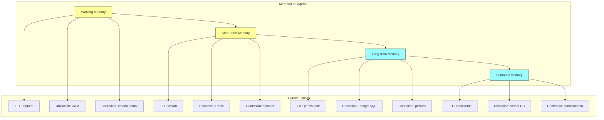
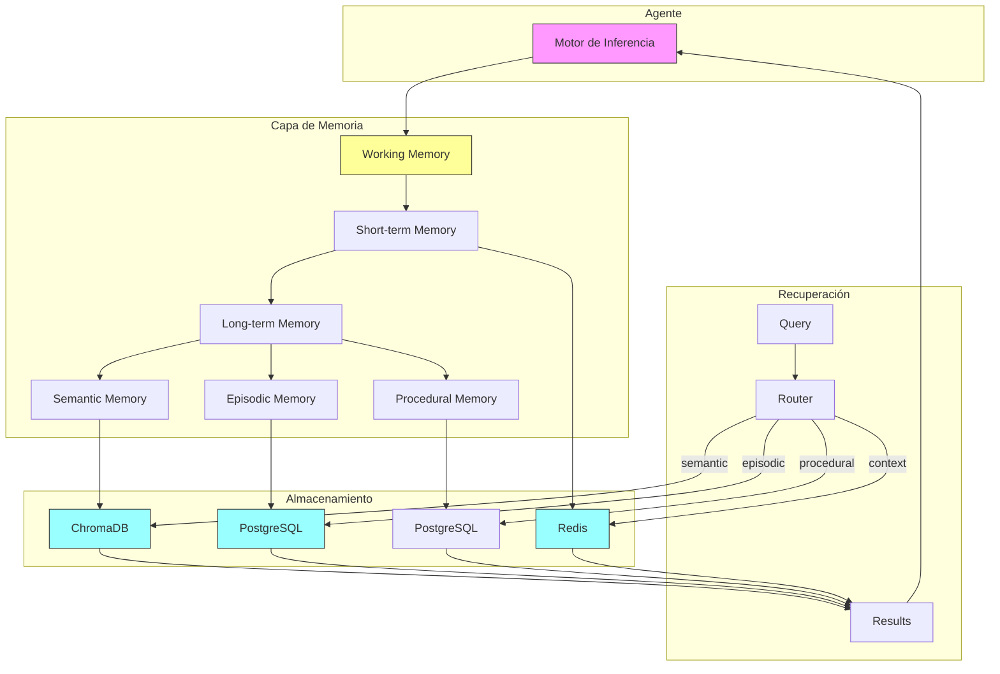
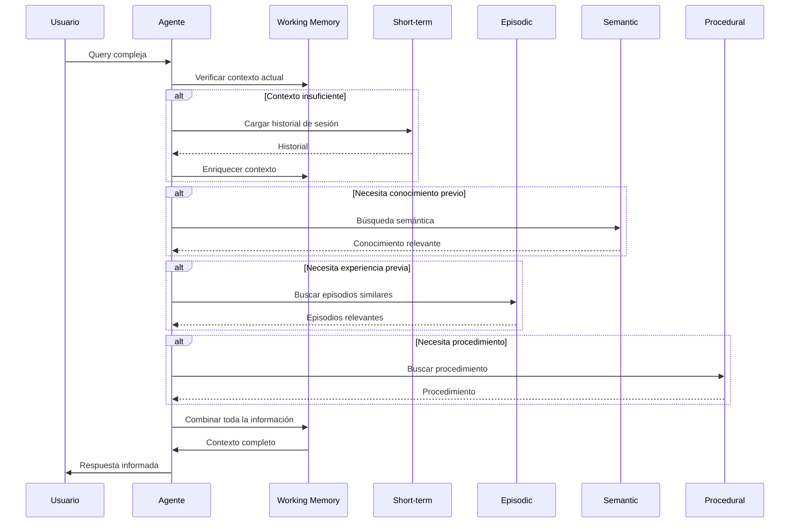
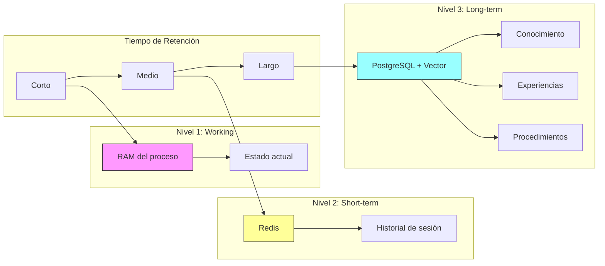

# Clase 3: Gestión de Memoria a Largo Plazo

## Duración
4 horas (240 minutos)

## Objetivos de Aprendizaje
- Comprender la jerarquía de memoria para agentes industriales
- Implementar memory, episodic y procedural memory
- Diseñar estrategias de recuperación de contexto
- Integrar bases de datos vectoriales para memoria semántica
- Construir sistemas de memoria escalables y mantenibles

## Contenidos Detallados

### 3.1 Memory Hierarchy para Agentes (60 minutos)

La gestión de memoria en agentes industriales es fundamental para mantener contexto a través de interacciones prolongadas y permitir que el agente "recuerde" información relevante. La arquitectura de memoria se organiza en una jerarquía de múltiples niveles:

#### 3.1.1 Niveles de Memoria

**Working Memory (Memoria de Trabajo)**
Es la memoria de corto plazo que existe únicamente durante el procesamiento de una solicitud. Contiene:
- El estado actual del grafo de LangGraph
- Variables locales de la ejecución
- Contexto inmediato de la conversación

```python
# Ejemplo de working memory en LangGraph
class WorkingMemory:
    """Memoria de trabajo - existe solo durante la ejecución"""
    
    def __init__(self):
        self.current_state: dict = {}
        self.local_variables: dict = {}
        self.execution_stack: list = []
    
    def store(self, key: str, value: any):
        self.local_variables[key] = value
    
    def retrieve(self, key: str) -> any:
        return self.local_variables.get(key)
    
    def clear(self):
        self.current_state = {}
        self.local_variables = {}
        self.execution_stack = []
```

**Short-term Memory (Memoria a Corto Plazo)**
Persiste durante una sesión de usuario, típicamente gestionada por Redis con TTL. Contiene:
- Historial de mensajes de la sesión actual
- Contexto de la conversación
- Estado de la interacción

```python
# Short-term con Redis
class ShortTermMemory:
    """Memoria a corto plazo - persiste durante la sesión"""
    
    def __init__(self, redis_client):
        self.redis = redis_client
        self.session_ttl = 1800  # 30 minutos
    
    def save_message(self, session_id: str, message: dict):
        key = f"stm:messages:{session_id}"
        self.redis.rpush(key, json.dumps(message))
        self.redis.expire(key, self.session_ttl)
    
    def get_history(self, session_id: str, limit: int = 50) -> list:
        key = f"stm:messages:{session_id}"
        messages = self.redis.lrange(key, -limit, -1)
        return [json.loads(m) for m in messages]
```

**Long-term Memory (Memoria a Largo Plazo)**
Almacena información que persiste entre sesiones, incluyendo:
- Conocimiento del dominio
- Preferencias del usuario
- Historial de interacciones pasadas
- Datos estructurados

```python
# Long-term con PostgreSQL
class LongTermMemory:
    """Memoria a largo plazo - persiste entre sesiones"""
    
    def __init__(self, db_pool):
        self.pool = db_pool
    
    async def save_user_profile(self, user_id: str, profile: dict):
        async with self.pool.acquire() as conn:
            await conn.execute("""
                INSERT INTO user_profiles (user_id, data, updated_at)
                VALUES ($1, $2, NOW())
                ON CONFLICT (user_id) DO UPDATE SET data = $2, updated_at = NOW()
            """, user_id, json.dumps(profile))
    
    async def get_user_profile(self, user_id: str) -> dict:
        async with self.pool.acquire() as conn:
            row = await conn.fetchrow(
                "SELECT data FROM user_profiles WHERE user_id = $1",
                user_id
            )
            return json.loads(row['data']) if row else None
```

**Semantic Memory (Memoria Semántica)**
Almacena conocimiento estructurado indexado semánticamente para recuperación rápida. Utiliza embeddings vectoriales:

```python
# Semantic memory con ChromaDB
class SemanticMemory:
    """Memoria semántica - conocimiento indexado vectorialmente"""
    
    def __init__(self, embedding_model):
        self.client = chromadb.Client()
        self.embedding_model = embedding_model
        self.collection = self.client.get_or_create_collection(
            "semantic_memory"
        )
    
    def store_knowledge(self, text: str, metadata: dict):
        embedding = self.embedding_model.embed(text)
        self.collection.add(
            ids=[str(uuid.uuid4())],
            embeddings=[embedding],
            documents=[text],
            metadatas=[metadata]
        )
    
    def retrieve(self, query: str, top_k: int = 5) -> list:
        query_embedding = self.embedding_model.embed(query)
        results = self.collection.query(
            query_embeddings=[query_embedding],
            n_results=top_k
        )
        return results
```

#### 3.1.2 Diagrama de la Jerarquía de Memoria



### 3.2 Semantic Memory (75 minutos)

La memoria semántica permite al agente almacenar y recuperar conocimiento de forma contextual. Se implementa principalmente usando bases de datos vectoriales.

#### 3.2.1 Conceptos de Embeddings

Los embeddings son representaciones numéricas de texto que capturan significado semántico. Palabras o frases similares tendrán embeddings cercanos en el espacio vectorial.

```python
from langchain_openai import OpenAIEmbeddings
from langchain_community.vectorstores import Chroma
from langchain.schema import Document

class SemanticMemoryStore:
    """Almacén de memoria semántica"""
    
    def __init__(
        self,
        persist_directory: str = "./chroma_db",
        embedding_model: str = "text-embedding-ada-002"
    ):
        self.embeddings = OpenAIEmbeddings(model=embedding_model)
        self.vectorstore = Chroma(
            persist_directory=persist_directory,
            embedding_function=self.embeddings
        )
    
    def add_document(
        self,
        content: str,
        metadata: dict,
        document_id: str = None
    ):
        """Agrega un documento a la memoria semántica"""
        doc = Document(
            page_content=content,
            metadata=metadata
        )
        
        self.vectorstore.add_documents([doc], ids=[document_id] if document_id else None)
    
    def add_documents(self, documents: list[Document]):
        """Agrega múltiples documentos"""
        self.vectorstore.add_documents(documents)
    
    def similarity_search(
        self,
        query: str,
        k: int = 4,
        filter: dict = None,
        score_threshold: float = None
    ) -> list[Document]:
        """Búsqueda por similitud semántica"""
        return self.vectorstore.similarity_search_with_score(
            query=query,
            k=k,
            filter=filter,
            score_threshold=score_threshold
        )
    
    def similarity_search_by_vector(
        self,
        embedding: list[float],
        k: int = 4,
        filter: dict = None
    ) -> list[Document]:
        """Búsqueda por embedding directo"""
        return self.vectorstore.similarity_search_by_vector(
            embedding=embedding,
            k=k,
            filter=filter
        )
    
    def delete(self, document_id: str):
        """Elimina un documento"""
        self.vectorstore.delete(ids=[document_id])
    
    def get_collection_stats(self) -> dict:
        """Obtiene estadísticas de la colección"""
        return {
            "count": self.vectorstore._collection.count(),
            "sample": self.vectorstore.get()['documents'][:3] if self.vectorstore._collection.count() > 0 else []
        }
```

#### 3.2.2 Estrategias de Indexación

```python
class SemanticIndexer:
    """Indexador de memoria semántica"""
    
    def __init__(self, vectorstore):
        self.vectorstore = vectorstore
    
    def index_knowledge_base(
        self,
        knowledge_items: list[dict],
        batch_size: int = 100
    ):
        """Indexa una base de conocimiento completa"""
        
        documents = []
        
        for item in knowledge_items:
            # Construir contenido estructurado
            content = self._format_knowledge_item(item)
            
            # Agregar metadata
            metadata = {
                "type": item.get("type", "unknown"),
                "source": item.get("source", "unknown"),
                "created_at": item.get("created_at", datetime.now().isoformat()),
                "tags": item.get("tags", [])
            }
            
            documents.append(Document(
                page_content=content,
                metadata=metadata
            ))
            
            # Insertar en batches
            if len(documents) >= batch_size:
                self.vectorstore.add_documents(documents)
                documents = []
        
        # Insertar documentos restantes
        if documents:
            self.vectorstore.add_documents(documents)
    
    def _format_knowledge_item(self, item: dict) -> str:
        """Formatea un item de conocimiento para indexación"""
        
        parts = []
        
        # Título
        if "title" in item:
            parts.append(f"Título: {item['title']}")
        
        # Contenido principal
        if "content" in item:
            parts.append(f"Contenido: {item['content']}")
        
        # Entidades relevantes
        if "entities" in item:
            parts.append(f"Entidades: {', '.join(item['entities'])}")
        
        return "\n".join(parts)
    
    def rebuild_index(self, new_items: list[dict]):
        """Rebuild completo del índice"""
        
        # Opcional: borrar todo primero
        # self.vectorstore.delete_all()
        
        self.index_knowledge_base(new_items)
```

#### 3.2.3 Retrieval con Re-ranking

```python
from langchain_community.cross_encoders import HuggingFaceCrossEncoder
from langchain.retrievers import ContextualCompressionRetriever
from langchain.retrievers.document_compressors import CrossEncoderReranker

class AdvancedRetriever:
    """Retrieval avanzado con re-ranking"""
    
    def __init__(self, base_retriever, rerank_model: str = "cross-encoder/ms-marco-MiniLM-L-6-v2"):
        self.base_retriever = base_retriever
        
        # Reranker
        self.reranker = HuggingFaceCrossEncoder(model_name=rerank_model)
        
        # Crear compressor
        self.compressor = CrossEncoderReranker(
            encoder=self.reranker,
            top_n=5
        )
        
        self.compression_retriever = ContextualCompressionRetriever(
            base_compressor=self.compressor,
            base_retriever=base_retriever
        )
    
    def retrieve(self, query: str, top_k: int = 10) -> list:
        """Retrieval con reranking"""
        
        # Obtener más documentos de los necesarios
        raw_docs = self.base_retriever.get_relevant_documents(query)
        
        # Re-rank
        scored_docs = self._rerank(query, raw_docs, top_k)
        
        return scored_docs
    
    def _rerank(self, query: str, docs: list, top_k: int) -> list:
        """Re-ranka los documentos"""
        
        # Preparar pares query-document
        pairs = [(query, doc.page_content) for doc in docs]
        
        # Obtener scores
        scores = self.reranker.predict(pairs)
        
        # Ordenar por score
        doc_scores = list(zip(docs, scores))
        doc_scores.sort(key=lambda x: x[1], reverse=True)
        
        # Retornar top-k
        return [doc for doc, score in doc_scores[:top_k]]
```

### 3.3 Episodic Memory (60 minutos)

La memoria episódica almacena experiencias completas del agente - secuencias de interacciones que pueden ser recuperadas como unidades coherentes.

#### 3.3.1 Estructura de Episodes

```python
from dataclasses import dataclass, field
from typing import List, Optional
from datetime import datetime
import uuid

@dataclass
class Episode:
    """Unidad de memoria episódica"""
    id: str = field(default_factory=lambda: str(uuid.uuid4()))
    session_id: str = ""
    user_id: str = ""
    start_time: datetime = field(default_factory=datetime.now)
    end_time: Optional[datetime] = None
    messages: List[dict] = field(default_factory=list)
    summary: str = ""
    key_entities: List[str] = field(default_factory=list)
    outcome: str = ""  # success, failure, incomplete
    tags: List[str] = field(default_factory=list)
    metadata: dict = field(default_factory=dict)
    
    def add_message(self, role: str, content: str, metadata: dict = None):
        """Agrega un mensaje al episodio"""
        self.messages.append({
            "role": role,
            "content": content,
            "timestamp": datetime.now().isoformat(),
            "metadata": metadata or {}
        })
    
    def to_dict(self) -> dict:
        """Serializa el episodio"""
        return {
            "id": self.id,
            "session_id": self.session_id,
            "user_id": self.user_id,
            "start_time": self.start_time.isoformat(),
            "end_time": self.end_time.isoformat() if self.end_time else None,
            "messages": self.messages,
            "summary": self.summary,
            "key_entities": self.key_entities,
            "outcome": self.outcome,
            "tags": self.tags,
            "metadata": self.metadata
        }
```

#### 3.3.2 Almacenamiento de Episodios

```python
import asyncio
from asyncpg import Pool

class EpisodicMemoryStore:
    """Almacén de memoria episódica con PostgreSQL"""
    
    def __init__(self, db_pool: Pool):
        self.pool = db_pool
    
    async def init_schema(self):
        """Inicializa el schema de episodios"""
        
        await self.pool.execute("""
            CREATE TABLE IF NOT EXISTS episodes (
                id UUID PRIMARY KEY,
                session_id VARCHAR(255) NOT NULL,
                user_id VARCHAR(255) NOT NULL,
                start_time TIMESTAMP NOT NULL,
                end_time TIMESTAMP,
                summary TEXT,
                key_entities TEXT[],  -- Array de strings
                outcome VARCHAR(50),
                tags TEXT[],
                metadata JSONB,
                messages JSONB,
                created_at TIMESTAMP DEFAULT NOW()
            )
        """)
        
        # Índices para búsqueda eficiente
        await self.pool.execute("""
            CREATE INDEX IF NOT EXISTS idx_episodes_user_id ON episodes(user_id)
        """)
        
        await self.pool.execute("""
            CREATE INDEX IF NOT EXISTS idx_episodes_session_id ON episodes(session_id)
        """)
        
        await self.pool.execute("""
            CREATE INDEX IF NOT EXISTS idx_episodes_start_time ON episodes(start_time DESC)
        """)
    
    async def save_episode(self, episode: Episode):
        """Guarda un episodio completo"""
        
        await self.pool.execute("""
            INSERT INTO episodes (
                id, session_id, user_id, start_time, end_time,
                summary, key_entities, outcome, tags, metadata, messages
            ) VALUES ($1, $2, $3, $4, $5, $6, $7, $8, $9, $10, $11)
            ON CONFLICT (id) DO UPDATE SET
                end_time = EXCLUDED.end_time,
                summary = EXCLUDED.summary,
                key_entities = EXCLUDED.key_entities,
                outcome = EXCLUDED.outcome,
                tags = EXCLUDED.tags,
                metadata = EXCLUDED.metadata,
                messages = EXCLUDED.messages
        """,
            episode.id,
            episode.session_id,
            episode.user_id,
            episode.start_time,
            episode.end_time,
            episode.summary,
            episode.key_entities,
            episode.outcome,
            episode.tags,
            json.dumps(episode.metadata),
            json.dumps(episode.messages)
        )
    
    async def get_episode(self, episode_id: str) -> Episode | None:
        """Recupera un episodio por ID"""
        
        row = await self.pool.fetchrow("""
            SELECT * FROM episodes WHERE id = $1
        """, episode_id)
        
        if not row:
            return None
        
        return self._row_to_episode(row)
    
    async def get_episodes_by_user(
        self,
        user_id: str,
        limit: int = 10,
        offset: int = 0
    ) -> list[Episode]:
        """Obtiene episodios de un usuario"""
        
        rows = await self.pool.fetch("""
            SELECT * FROM episodes 
            WHERE user_id = $1
            ORDER BY start_time DESC
            LIMIT $2 OFFSET $3
        """, user_id, limit, offset)
        
        return [self._row_to_episode(row) for row in rows]
    
    async def search_episodes(
        self,
        user_id: str,
        query: str,
        outcome_filter: str = None,
        tags: list = None,
        limit: int = 10
    ) -> list[Episode]:
        """Busca episodios por contenido o metadata"""
        
        # Filtrar por outcome si se especifica
        outcome_clause = ""
        params = [user_id, f"%{query}%"]
        
        if outcome_filter:
            outcome_clause = " AND outcome = $3"
            params.append(outcome_filter)
        
        # Filtrar por tags
        tags_clause = ""
        if tags:
            tags_clause = f" AND tags && $${len(params) + 1}$$"
            params.append(tags)
        
        params.append(limit)
        
        query_sql = f"""
            SELECT * FROM episodes
            WHERE user_id = $1 
            AND (summary ILIKE $2 OR messages::text ILIKE $2)
            {outcome_clause}
            {tags_clause}
            ORDER BY start_time DESC
            LIMIT ${len(params)}
        """
        
        rows = await self.pool.fetch(query_sql, *params)
        
        return [self._row_to_episode(row) for row in rows]
    
    async def get_recent_episodes(
        self,
        user_id: str,
        days: int = 7,
        limit: int = 20
    ) -> list[Episode]:
        """Obtiene episodios recientes"""
        
        cutoff = datetime.now() - timedelta(days=days)
        
        rows = await self.pool.fetch("""
            SELECT * FROM episodes
            WHERE user_id = $1 AND start_time >= $2
            ORDER BY start_time DESC
            LIMIT $3
        """, user_id, cutoff, limit)
        
        return [self._row_to_episode(row) for row in rows]
    
    def _row_to_episode(self, row) -> Episode:
        """Convierte una fila de DB a Episode"""
        
        return Episode(
            id=row['id'],
            session_id=row['session_id'],
            user_id=row['user_id'],
            start_time=row['start_time'],
            end_time=row['end_time'],
            summary=row['summary'] or "",
            key_entities=row['key_entities'] or [],
            outcome=row['outcome'] or "",
            tags=row['tags'] or [],
            metadata=row['metadata'] or {},
            messages=row['messages'] or []
        )
```

#### 3.3.3 Resumen Automático de Episodios

```python
from langchain_openai import ChatOpenAI
from langchain.prompts import PromptTemplate

class EpisodeSummarizer:
    """Generador de resúmenes de episodios"""
    
    def __init__(self, llm: ChatOpenAI):
        self.llm = llm
        
        self.prompt = PromptTemplate.from_template("""
Eres un asistente que resume conversaciones de agente.
Genera un resumen conciso del episodio dado.

Episodio:
{messages}

El formato del resumen debe ser:
- Tema principal: [tema]
- Duración: [aproximadamente]
- Resumen: [2-3 oraciones]
- Entidades clave: [lista]
- Outcome: [success/failure/incomplete]
- Tags: [lista de tags relevantes]
""")
    
    async def summarize(self, messages: list[dict]) -> dict:
        """Genera un resumen del episodio"""
        
        # Formatear mensajes
        formatted = "\n".join([
            f"{m.get('role', 'unknown')}: {m.get('content', '')}"
            for m in messages[:20]  # Limitar a 20 mensajes
        ])
        
        # Invocar LLM
        response = await self.llm.ainvoke(
            self.prompt.format(messages=formatted)
        )
        
        return self._parse_summary(response.content)
    
    def _parse_summary(self, text: str) -> dict:
        """Parsea el resumen generado"""
        
        summary = {
            "topic": "",
            "summary": "",
            "key_entities": [],
            "outcome": "unknown",
            "tags": []
        }
        
        lines = text.split("\n")
        for line in lines:
            if "Tema principal:" in line:
                summary["topic"] = line.split(":", 1)[1].strip()
            elif "Resumen:" in line:
                summary["summary"] = line.split(":", 1)[1].strip()
            elif "Entidades clave:" in line:
                entities = line.split(":", 1)[1].strip()
                summary["key_entities"] = [e.strip() for e in entities.split(",") if e.strip()]
            elif "Outcome:" in line:
                summary["outcome"] = line.split(":", 1)[1].strip().lower()
            elif "Tags:" in line:
                tags = line.split(":", 1)[1].strip()
                summary["tags"] = [t.strip() for t in tags.split(",") if t.strip()]
        
        return summary
```

### 3.4 Procedural Memory (45 minutos)

La memoria procedural almacena conocimiento sobre "cómo hacer cosas" - procedimientos, funciones, y patrones de comportamiento que el agente puede ejecutar.

#### 3.4.1 Estructura de Procedimientos

```python
@dataclass
class Procedure:
    """Representa un procedimiento almacenado"""
    id: str
    name: str
    description: str
    parameters: List[Parameter]
    steps: List[ProcedureStep]
    preconditions: List[str]
    postconditions: List[str]
    tags: List[str]
    version: str
    created_at: datetime
    updated_at: datetime

@dataclass
class Parameter:
    name: str
    type: str
    required: bool
    description: str
    default: any = None

@dataclass
class ProcedureStep:
    order: int
    action: str
    tool: str
    inputs: dict
    outputs: dict
    error_handling: str = ""
```

#### 3.4.2 Registry de Procedimientos

```python
class ProcedureRegistry:
    """Registro de procedimientos ejecutables"""
    
    def __init__(self, db_pool: Pool):
        self.pool = db_pool
    
    async def register_procedure(self, procedure: Procedure):
        """Registra un nuevo procedimiento"""
        
        await self.pool.execute("""
            INSERT INTO procedures (
                id, name, description, parameters, steps,
                preconditions, postconditions, tags, version,
                created_at, updated_at
            ) VALUES ($1, $2, $3, $4, $5, $6, $7, $8, $9, $10, $11)
            ON CONFLICT (id) DO UPDATE SET
                description = EXCLUDED.description,
                parameters = EXCLUDED.parameters,
                steps = EXCLUDED.steps,
                preconditions = EXCLUDED.preconditions,
                postconditions = EXCLUDED.postconditions,
                tags = EXCLUDED.tags,
                version = EXCLUDED.version,
                updated_at = NOW()
        """,
            procedure.id,
            procedure.name,
            procedure.description,
            json.dumps([p.__dict__ for p in procedure.parameters]),
            json.dumps([s.__dict__ for s in procedure.steps]),
            procedure.preconditions,
            procedure.postconditions,
            procedure.tags,
            procedure.version,
            procedure.created_at,
            procedure.updated_at
        )
    
    async def get_procedure(self, name: str) -> Procedure | None:
        """Obtiene un procedimiento por nombre"""
        
        row = await self.pool.fetchrow("""
            SELECT * FROM procedures WHERE name = $1
        """, name)
        
        if not row:
            return None
        
        return self._row_to_procedure(row)
    
    async def find_procedures(self, query: str, tags: list = None) -> list[Procedure]:
        """Busca procedimientos por nombre o tags"""
        
        query_clause = "WHERE name ILIKE $1"
        params = [f"%{query}%"]
        
        if tags:
            query_clause += f" AND tags && ${len(params)+1}"
            params.append(tags)
        
        rows = await self.pool.fetch(f"""
            SELECT * FROM procedures {query_clause}
        """, *params)
        
        return [self._row_to_procedure(row) for row in rows]
```

### 3.5 Tecnologías: Redis, PostgreSQL, ChromaDB (20 minutos)

#### 3.5.1 Configuración de PostgreSQL

```python
# config/database.py
import asyncpg
from dataclasses import dataclass

@dataclass
class DatabaseConfig:
    host: str = "localhost"
    port: int = 5432
    database: str = "agent_db"
    user: str = "postgres"
    password: str = ""
    min_size: int = 5
    max_size: int = 20
    
    @property
    def dsn(self) -> str:
        return f"postgresql://{self.user}:{self.password}@{self.host}:{self.port}/{self.database}"


async def create_pool(config: DatabaseConfig) -> asyncpg.Pool:
    """Crea un pool de conexiones a PostgreSQL"""
    
    return await asyncpg.create_pool(
        host=config.host,
        port=config.port,
        database=config.database,
        user=config.user,
        password=config.password,
        min_size=config.min_size,
        max_size=config.max_size
    )
```

#### 3.5.2 Configuración de ChromaDB

```python
# config/vectorstore.py
import chromadb
from chromadb.config import Settings

class ChromaConfig:
    persist_directory: str = "./chroma_data"
    chroma_server_type: str = "duckdb+parquet"
    
    @staticmethod
    def get_client(persist_directory: str = "./chroma_data"):
        return chromadb.Client(Settings(
            persist_directory=persist_directory,
            anonymized_telemetry=False
        ))
```

## Diagramas

### Diagrama 1: Arquitectura de Memoria Integrada



### Diagrama 2: Flujo de Retrieval de Memoria



### Diagrama 3: Jerarquía de Memoria Completa



## Referencias Externas

1. **ChromaDB Documentation**: https://docs.trychroma.com/
2. **LangChain Vector Stores**: https://python.langchain.com/docs/modules/data_connection/vectorstores/
3. **PostgreSQL JSONB**: https://www.postgresql.org/docs/current/datatype-json.html
4. **AsyncPG**: https://magicstack.github.io/asyncpg/
5. **Redis Memory Patterns**: https://redis.io/docs/data-types/

## Ejercicios Prácticos Resueltos

### Ejercicio 1: Implementar Sistema de Memoria Completo

**Problema**: Crear un sistema de memoria integrado que combine working, short-term, semantic, y episodic memory.

**Solución**:

```python
"""
Sistema de Memoria Integrada para Agentes
Implementación completa
"""

import redis
import asyncpg
import chromadb
from typing import Optional, List
from dataclasses import dataclass, field
from datetime import datetime
import json
import uuid

# ==================== CONFIGURACIÓN ====================

@dataclass
class MemoryConfig:
    redis_host: str = "localhost"
    redis_port: int = 6379
    postgres_host: str = "localhost"
    postgres_port: int = 5432
    postgres_db: str = "agent_memory"
    postgres_user: str = "postgres"
    postgres_password: str = ""
    chroma_path: str = "./chroma_db"


# ==================== WORKING MEMORY ====================

class WorkingMemory:
    """Memoria de trabajo - existe durante una request"""
    
    def __init__(self):
        self.data: dict = {}
        self.messages: list = []
    
    def store(self, key: str, value: any):
        self.data[key] = value
    
    def retrieve(self, key: str) -> any:
        return self.data.get(key)
    
    def add_message(self, role: str, content: str):
        self.messages.append({
            "role": role,
            "content": content,
            "timestamp": datetime.now().isoformat()
        })
    
    def get_context(self) -> dict:
        return {
            "data": self.data,
            "messages": self.messages
        }
    
    def clear(self):
        self.data = {}
        self.messages = []


# ==================== SHORT-TERM MEMORY ====================

class ShortTermMemory:
    """Memoria a corto plazo - sesión activa"""
    
    def __init__(self, redis_client: redis.Redis):
        self.redis = redis_client
        self.default_ttl = 1800
    
    def save_message(self, session_id: str, role: str, content: str, metadata: dict = None):
        """Guarda un mensaje en el historial de la sesión"""
        key = f"stm:messages:{session_id}"
        
        message = {
            "role": role,
            "content": content,
            "timestamp": datetime.now().isoformat(),
            "metadata": metadata or {}
        }
        
        self.redis.rpush(key, json.dumps(message))
        self.redis.ltrim(key, -100, -1)  # Mantener últimos 100
        self.redis.expire(key, self.default_ttl)
    
    def get_history(self, session_id: str, limit: int = 50) -> List[dict]:
        """Obtiene el historial de la sesión"""
        key = f"stm:messages:{session_id}"
        
        messages = self.redis.lrange(key, -limit, -1)
        return [json.loads(m) for m in messages]
    
    def save_context(self, session_id: str, context: dict):
        """Guarda el contexto de la sesión"""
        key = f"stm:context:{session_id}"
        self.redis.setex(key, self.default_ttl, json.dumps(context))
    
    def get_context(self, session_id: str) -> dict:
        """Obtiene el contexto de la sesión"""
        key = f"stm:context:{session_id}"
        data = self.redis.get(key)
        return json.loads(data) if data else {}


# ==================== SEMANTIC MEMORY ====================

class SemanticMemory:
    """Memoria semántica - conocimiento indexado"""
    
    def __init__(self, chroma_client, openai_api_key: str):
        self.client = chroma_client
        self.collection = self.client.get_or_create_collection(
            "semantic_memory"
        )
        
        from langchain_openai import OpenAIEmbeddings
        self.embeddings = OpenAIEmbeddings(api_key=openai_api_key)
    
    def add_knowledge(
        self,
        content: str,
        metadata: dict,
        doc_id: str = None
    ):
        """Agrega conocimiento al índice"""
        
        doc_id = doc_id or str(uuid.uuid4())
        
        embedding = self.embeddings.embed_documents([content])[0]
        
        self.collection.add(
            ids=[doc_id],
            embeddings=[embedding],
            documents=[content],
            metadatas=[metadata]
        )
    
    def search(self, query: str, top_k: int = 5, filters: dict = None) -> List[dict]:
        """Busca conocimiento semánticamente"""
        
        query_embedding = self.embeddings.embed_documents([query])[0]
        
        results = self.collection.query(
            query_embeddings=[query_embedding],
            n_results=top_k,
            where=filters
        )
        
        return [
            {
                "id": results["ids"][0][i],
                "content": results["documents"][0][i],
                "metadata": results["metadatas"][0][i],
                "distance": results["distances"][0][i]
            }
            for i in range(len(results["ids"][0]))
        ]


# ==================== EPISODIC MEMORY ====================

class EpisodicMemory:
    """Memoria episódica - experiencias completas"""
    
    def __init__(self, db_pool: asyncpg.Pool):
        self.pool = db_pool
    
    async def init_schema(self):
        """Inicializa la tabla de episodios"""
        await self.pool.execute("""
            CREATE TABLE IF NOT EXISTS episodes (
                id UUID PRIMARY KEY,
                session_id VARCHAR(255),
                user_id VARCHAR(255),
                start_time TIMESTAMP,
                end_time TIMESTAMP,
                summary TEXT,
                outcome VARCHAR(50),
                tags TEXT[],
                messages JSONB,
                created_at TIMESTAMP DEFAULT NOW()
            )
        """)
    
    async def create_episode(
        self,
        session_id: str,
        user_id: str
    ) -> str:
        """Crea un nuevo episodio"""
        
        episode_id = str(uuid.uuid4())
        
        await self.pool.execute("""
            INSERT INTO episodes (id, session_id, user_id, start_time)
            VALUES ($1, $2, $3, NOW())
        """, episode_id, session_id, user_id)
        
        return episode_id
    
    async def add_message(self, episode_id: str, role: str, content: str):
        """Agrega un mensaje al episodio"""
        
        await self.pool.execute("""
            UPDATE episodes 
            SET messages = messages || $3::jsonb
            WHERE id = $1
        """, episode_id, json.dumps([{"role": role, "content": content, "timestamp": datetime.now().isoformat()}]))
    
    async def complete_episode(
        self,
        episode_id: str,
        summary: str,
        outcome: str,
        tags: List[str]
    ):
        """Completa un episodio"""
        
        await self.pool.execute("""
            UPDATE episodes
            SET end_time = NOW(),
                summary = $2,
                outcome = $3,
                tags = $4
            WHERE id = $1
        """, episode_id, summary, outcome, tags)
    
    async def get_episodes(self, user_id: str, limit: int = 10) -> List[dict]:
        """Obtiene episodios del usuario"""
        
        rows = await self.pool.fetch("""
            SELECT * FROM episodes
            WHERE user_id = $1
            ORDER BY start_time DESC
            LIMIT $2
        """, user_id, limit)
        
        return [dict(r) for r in rows]


# ==================== MEMORY MANAGER ====================

class MemoryManager:
    """Gestor unificado de memoria"""
    
    def __init__(self, config: MemoryConfig):
        self.config = config
        
        # Working memory (en memoria)
        self.working = WorkingMemory()
        
        # Redis para short-term
        self.redis = redis.Redis(
            host=config.redis_host,
            port=config.redis_port,
            decode_responses=True
        )
        self.short_term = ShortTermMemory(self.redis)
        
        # ChromaDB para semantic
        self.chroma = chromadb.Client(chromadb.config.Settings(
            persist_directory=config.chroma_path
        ))
        # Nota: En producción, pasar API key real
        # self.semantic = SemanticMemory(self.chroma, api_key)
        
        # PostgreSQL para episodic
        # self.episodic = EpisodicMemory(pool)
    
    def enrich_context(self, session_id: str, query: str) -> dict:
        """Enriquece el contexto con información de todas las capas"""
        
        context = {}
        
        # Short-term: historial reciente
        recent_messages = self.short_term.get_history(session_id, limit=10)
        context["recent_history"] = recent_messages
        
        # Short-term: contexto guardado
        session_context = self.short_term.get_context(session_id)
        context["session_context"] = session_context
        
        # Working: datos actuales
        working_context = self.working.get_context()
        context["working"] = working_context
        
        return context
    
    def store_interaction(
        self,
        session_id: str,
        user_id: str,
        user_message: str,
        assistant_response: str
    ):
        """Almacena una interacción completa"""
        
        # Short-term: mensajes
        self.short_term.save_message(session_id, "user", user_message)
        self.short_term.save_message(session_id, "assistant", assistant_response)


# ==================== EJEMPLO DE USO ====================

def main():
    """Ejemplo de uso del sistema de memoria"""
    
    config = MemoryConfig()
    manager = MemoryManager(config)
    
    session_id = "session_001"
    user_id = "user_001"
    
    # Simular conversación
    print("=" * 60)
    print("SIMULACIÓN DE CONVERSACIÓN")
    print("=" * 60)
    
    # Interacción 1
    user_msg1 = "Quiero información sobre laptops"
    asst_msg1 = "Tengo varios modelos de laptops. ¿Cuál te interesa?"
    
    manager.store_interaction(session_id, user_id, user_msg1, asst_msg1)
    print(f"Usuario: {user_msg1}")
    print(f"Agente: {asst_msg1}")
    
    # Interacción 2
    user_msg2 = "Estoy buscando una para programación"
    asst_msg2 = "Para programación te recomiendo la Laptop Pro X con 32GB RAM"
    
    manager.store_interaction(session_id, user_id, user_msg2, asst_msg2)
    print(f"Usuario: {user_msg2}")
    print(f"Agente: {asst_msg2}")
    
    # Recuperar contexto
    print("\n" + "=" * 60)
    print("CONTEXTOS RECUPERADOS")
    print("=" * 60)
    
    context = manager.enrich_context(session_id, "")
    
    print("\nHistorial reciente:")
    for msg in context["recent_history"]:
        print(f"  [{msg['role']}] {msg['content'][:50]}...")
    
    print("\nContexto de sesión:")
    print(f"  {context['session_context']}")
    
    print("\n" + "=" * 60)


if __name__ == "__main__":
    main()
```

**Explicación**:
1. **WorkingMemory**: Almacena datos en memoria durante el procesamiento
2. **ShortTermMemory**: Persiste historial de sesión en Redis
3. **SemanticMemory**: Indexa conocimiento en ChromaDB (ejemplo conceptual)
4. **EpisodicMemory**: Almacena experiencias en PostgreSQL
5. **MemoryManager**: Unifica todas las capas para proporcionar contexto enriquecido

### Ejercicio 2: Sistema de Retrieval Multi-Capa

**Problema**: Implementar un sistema que combine resultados de múltiples capas de memoria.

**Solución**:

```python
"""
Retrieval Multi-Capa para Memoria de Agente
"""

from dataclasses import dataclass
from typing import List, Dict
import redis
import json

@dataclass
class MemoryResult:
    """Resultado de retrieval de memoria"""
    source: str  # working, short_term, semantic, episodic
    content: str
    relevance: float
    metadata: dict


class MultiLayerRetriever:
    """Retrieval que combina múltiples capas de memoria"""
    
    def __init__(
        self,
        redis_client,
        semantic_search,
        episodic_store
    ):
        self.redis = redis_client
        self.semantic = semantic_search
        self.episodic = episodic_store
    
    def retrieve(self, query: str, session_id: str, user_id: str) -> List[MemoryResult]:
        """Recupera información de todas las capas"""
        
        results = []
        
        # Capa 1: Working memory (alta prioridad)
        working_results = self._search_working(query)
        results.extend(working_results)
        
        # Capa 2: Short-term memory
        short_term_results = self._search_short_term(session_id)
        results.extend(short_term_results)
        
        # Capa 3: Semantic memory
        semantic_results = self._search_semantic(query)
        results.extend(semantic_results)
        
        # Capa 4: Episodic memory
        episodic_results = self._search_episodic(user_id, query)
        results.extend(episodic_results)
        
        # Ordenar por relevancia
        results.sort(key=lambda x: x.relevance, reverse=True)
        
        return results
    
    def _search_working(self, query: str) -> List[MemoryResult]:
        # Buscar en working memory (en memoria del proceso)
        return []  # Implementar según necesidad
    
    def _search_short_term(self, session_id: str) -> List[MemoryResult]:
        """Busca en short-term memory de Redis"""
        
        key = f"stm:messages:{session_id}"
        messages = self.redis.lrange(key, 0, -1)
        
        results = []
        for msg_json in messages:
            msg = json.loads(msg_json)
            
            # Calcular similitud simple (puede mejorarse con embeddings)
            if any(word in msg['content'].lower() for word in query.lower().split()):
                results.append(MemoryResult(
                    source="short_term",
                    content=msg['content'],
                    relevance=0.8,
                    metadata={"timestamp": msg.get("timestamp")}
                ))
        
        return results
    
    def _search_semantic(self, query: str) -> List[MemoryResult]:
        """Busca en memoria semántica"""
        
        if not self.semantic:
            return []
        
        # Search en ChromaDB
        search_results = self.semantic.search(query, top_k=5)
        
        return [
            MemoryResult(
                source="semantic",
                content=r["content"],
                relevance=1.0 - r["distance"],  # Menor distancia = mayor relevancia
                metadata=r["metadata"]
            )
            for r in search_results
        ]
    
    def _search_episodic(self, user_id: str, query: str) -> List[MemoryResult]:
        """Busca en memoria episódica"""
        
        # Obtener episodios recientes
        # (implementar con PostgreSQL real)
        return []


def rank_and_merge_results(results: List[MemoryResult], max_results: int = 10) -> List[MemoryResult]:
    """Rank y combina resultados de múltiples fuentes"""
    
    # Deduplicar por contenido similar
    unique_results = []
    seen_content = set()
    
    for r in results:
        content_hash = hash(r.content[:100])  # Usar primeros 100 chars
        if content_hash not in seen_content:
            seen_content.add(content_hash)
            unique_results.append(r)
    
    # Ordenar por relevancia
    unique_results.sort(key=lambda x: x.relevance, reverse=True)
    
    return unique_results[:max_results]
```

## Actividades de Laboratorio

### Laboratorio 1: Implementar Sistema de Memoria Semantic con ChromaDB

**Duración**: 60 minutos

**Objetivo**: Crear un índice de conocimiento consultable semánticamente.

**Pasos**:
1. Configurar ChromaDB con embeddings de OpenAI
2. Crear schema de documentos
3. Indexar documentos de ejemplo
4. Implementar búsqueda por similitud
5. Agregar filtros por metadata

**Entregable**: Script con índice funcional y búsquedas de prueba.

### Laboratorio 2: Sistema de Episodic Memory con PostgreSQL

**Duración**: 60 minutos

**Objetivo**: Implementar almacenamiento y retrieval de episodios.

**Pasos**:
1. Diseñar schema de base de datos
2. Crear tabla de episodios con JSONB
3. Implementar CRUD de episodios
4. Agregar búsqueda por usuario y fecha
5. Implementar resumen automático

**Entregable**: Scripts SQL y Python para gestión de episodios.

### Laboratorio 3: Integrar Todas las Capas de Memoria

**Duración**: 60 minutos

**Objetivo**: Crear un sistema unificado de memoria.

**Pasos**:
1. Implementar MemoryManager que combine capas
2. Crear estrategia de enriquecimiento de contexto
3. Implementar selección de fuentes según query
4. Agregar métricas de retrieval

**Entregable**: Sistema de memoria integrado con tests.

## Resumen de Puntos Clave

1. **Jerarquía de Memoria**: Working → Short-term → Long-term (Semantic, Episodic, Procedural)

2. **Working Memory**: Existe solo durante el procesamiento, en RAM del proceso.

3. **Short-term Memory**: Persiste durante la sesión en Redis, con TTL configurable.

4. **Semantic Memory**: Usa embeddings vectoriales para búsqueda por similitud semántica.

5. **Episodic Memory**: Almacena experiencias completas como unidades recuperables.

6. **Procedural Memory**: Almacena "cómo hacer" - procedimientos y patrones de ejecución.

7. **ChromaDB**: Base de datos vectorial popular para memoria semántica.

8. **PostgreSQL + JSONB**: Ideal para episodios con estructura variable.

9. **Redis**: Perfecto para short-term con TTL y operaciones rápidas.

10. **Estrategia de Retrieval**: Combinar resultados de múltiples fuentes, rankear y deduplicar.