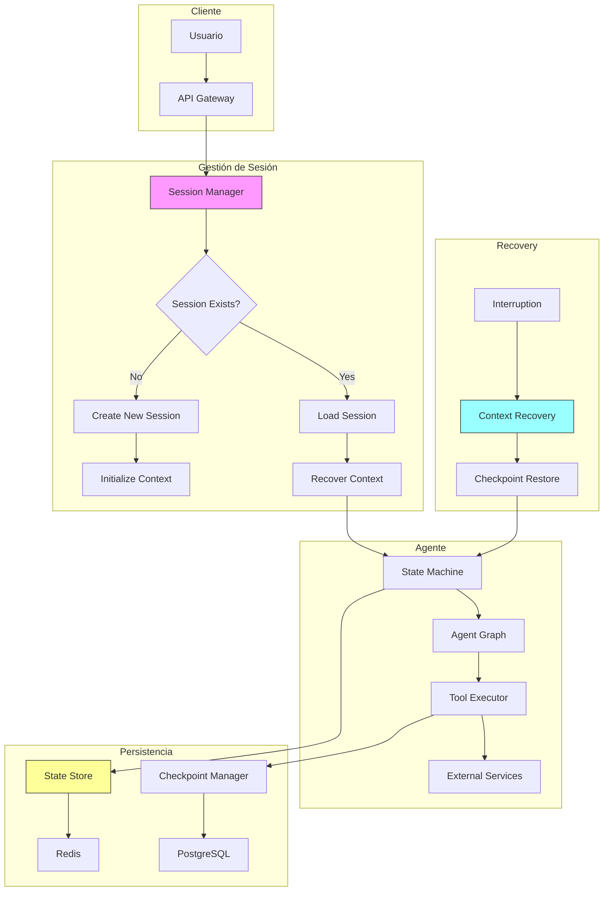
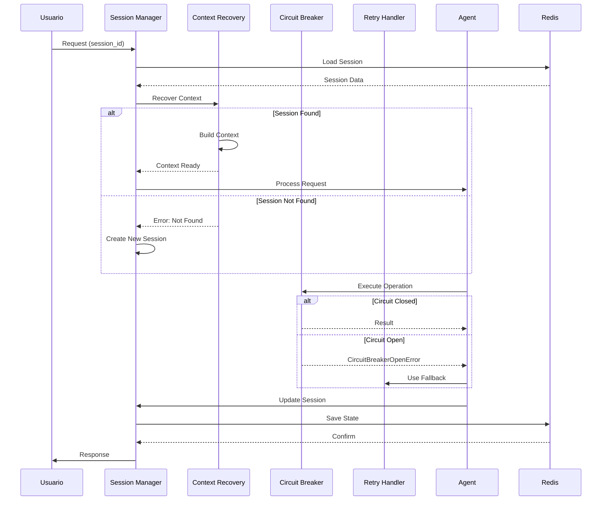
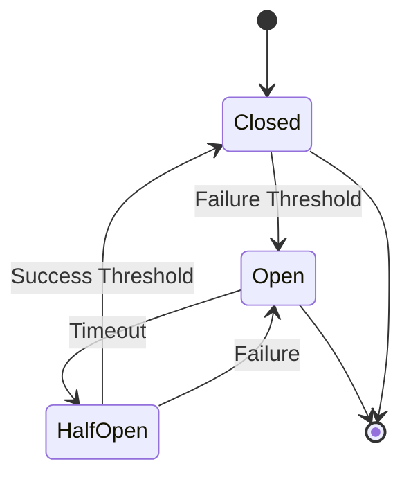

# Clase 4: Arquitectura de Agentes Persistentes

## Duración
4 horas (240 minutos)

## Objetivos de Aprendizaje
- Diseñar arquitecturas de agentes con sesión persistente
- Implementar recuperación de contexto entre interacciones
- Construir sistemas tolerantes a fallos para agentes
- Aplicar patrones de state machine para agentes industriales
- Implementar graceful degradation y recovery

## Contenidos Detallados

### 4.1 Session Management (60 minutos)

La gestión de sesiones en agentes industriales es fundamental para mantener continuidad entre interacciones. A diferencia de chatbots tradicionales donde cada request es independiente, los agentes industriales necesitan mantener estado a través de múltiples interacciones.

#### 4.1.1 Conceptos de Sesión

Una **sesión** representa el contexto de interacción entre un usuario y el agente durante un período de tiempo. La sesión encapsula:

- **Identificador único**: UUID que permite rastrear la interacción
- **Estado del agente**: Variables, contexto, historial
- **Metadatos**: Usuario, timestamps, tipo de agente
- **TTL**: Tiempo de expiración de la sesión

```python
from dataclasses import dataclass, field
from datetime import datetime
from typing import Optional, Dict, List
import uuid

@dataclass
class AgentSession:
    """Representa una sesión de agente"""
    session_id: str = field(default_factory=lambda: str(uuid.uuid4()))
    user_id: str = ""
    agent_type: str = ""
    created_at: datetime = field(default_factory=datetime.now)
    last_accessed: datetime = field(default_factory=datetime.now)
    state: str = "initial"
    context: Dict = field(default_factory=dict)
    history: List[Dict] = field(default_factory=list)
    metadata: Dict = field(default_factory=dict)
    ttl: int = 1800  # 30 minutos default
    
    def to_dict(self) -> Dict:
        return {
            "session_id": self.session_id,
            "user_id": self.user_id,
            "agent_type": self.agent_type,
            "created_at": self.created_at.isoformat(),
            "last_accessed": self.last_accessed.isoformat(),
            "state": self.state,
            "context": self.context,
            "history": self.history,
            "metadata": self.metadata,
            "ttl": self.ttl
        }
    
    @classmethod
    def from_dict(cls, data: Dict) -> 'AgentSession':
        """Crea una sesión desde un diccionario"""
        session = cls(
            session_id=data.get("session_id", str(uuid.uuid4())),
            user_id=data.get("user_id", ""),
            agent_type=data.get("agent_type", ""),
            created_at=datetime.fromisoformat(data.get("created_at", datetime.now().isoformat())),
            last_accessed=datetime.fromisoformat(data.get("last_accessed", datetime.now().isoformat())),
            state=data.get("state", "initial"),
            context=data.get("context", {}),
            history=data.get("history", []),
            metadata=data.get("metadata", {}),
            ttl=data.get("ttl", 1800)
        )
        return session
```

#### 4.1.2 Gestor de Sesiones

```python
import redis
import json
from typing import Optional, List
from datetime import datetime, timedelta
import logging

logger = logging.getLogger(__name__)


class SessionManager:
    """Gestor de sesiones con persistencia Redis"""
    
    def __init__(self, redis_client: redis.Redis):
        self.redis = redis_client
        self.prefix = "agent:session"
    
    def _session_key(self, session_id: str) -> str:
        """Genera la key de Redis para una sesión"""
        return f"{self.prefix}:{session_id}"
    
    def _history_key(self, session_id: str) -> str:
        """Genera la key de Redis para el historial"""
        return f"{self.prefix}:{session_id}:history"
    
    def create_session(
        self,
        user_id: str,
        agent_type: str,
        ttl: int = 1800,
        initial_context: dict = None
    ) -> AgentSession:
        """Crea una nueva sesión"""
        
        session = AgentSession(
            user_id=user_id,
            agent_type=agent_type,
            state="created",
            context=initial_context or {},
            ttl=ttl
        )
        
        # Guardar sesión en Redis
        self._save_session(session)
        
        # Crear lista de historial vacía
        history_key = self._history_key(session.session_id)
        self.redis.expire(history_key, ttl)
        
        logger.info(f"Created session {session.session_id} for user {user_id}")
        
        return session
    
    def _save_session(self, session: AgentSession):
        """Guarda la sesión en Redis"""
        
        key = self._session_key(session.session_id)
        
        # Actualizar last_accessed
        session.last_accessed = datetime.now()
        
        # Serializar y guardar con TTL
        self.redis.setex(
            key,
            session.ttl,
            json.dumps(session.to_dict(), default=str)
        )
    
    def get_session(self, session_id: str) -> Optional[AgentSession]:
        """Recupera una sesión"""
        
        key = self._session_key(session_id)
        data = self.redis.get(key)
        
        if not data:
            return None
        
        session_data = json.loads(data)
        
        # Renovar TTL si la sesión está activa
        session = AgentSession.from_dict(session_data)
        
        if session.state in ["active", "processing"]:
            self._extend_ttl(session_id, session.ttl)
        
        return session
    
    def update_session(self, session: AgentSession) -> AgentSession:
        """Actualiza una sesión"""
        
        session.last_accessed = datetime.now()
        self._save_session(session)
        
        return session
    
    def delete_session(self, session_id: str) -> bool:
        """Elimina una sesión"""
        
        key = self._session_key(session_id)
        history_key = self._history_key(session_id)
        
        deleted = self.redis.delete(key, history_key)
        
        logger.info(f"Deleted session {session_id}")
        
        return deleted > 0
    
    def _extend_ttl(self, session_id: str, ttl: int):
        """Extiende el TTL de una sesión"""
        
        key = self._session_key(session_id)
        self.redis.expire(key, ttl)
        
        history_key = self._history_key(session_id)
        self.redis.expire(history_key, ttl)
    
    def add_to_history(
        self,
        session_id: str,
        role: str,
        content: str,
        metadata: dict = None
    ):
        """Agrega un mensaje al historial de la sesión"""
        
        history_key = self._history_key(session_id)
        
        entry = {
            "role": role,
            "content": content,
            "timestamp": datetime.now().isoformat(),
            "metadata": metadata or {}
        }
        
        # Agregar al final de la lista
        self.redis.rpush(history_key, json.dumps(entry))
        
        # Recortar a los últimos 100 mensajes
        self.redis.ltrim(history_key, -100, -1)
    
    def get_history(
        self,
        session_id: str,
        limit: int = 50
    ) -> List[dict]:
        """Obtiene el historial de la sesión"""
        
        history_key = self._history_key(session_id)
        
        messages = self.redis.lrange(history_key, -limit, -1)
        
        return [json.loads(m) for m in messages]
    
    def list_user_sessions(self, user_id: str) -> List[AgentSession]:
        """Lista todas las sesiones activas de un usuario"""
        
        pattern = f"{self.prefix}:*"
        sessions = []
        
        for key in self.redis.scan_iter(match=pattern):
            if ":history" not in key:
                data = self.redis.get(key)
                if data:
                    session = AgentSession.from_dict(json.loads(data))
                    if session.user_id == user_id:
                        sessions.append(session)
        
        return sessions
    
    def cleanup_expired_sessions(self):
        """Limpia sesiones expiradas (manualmente si Redis no lo hace)"""
        
        pattern = f"{self.prefix}:*"
        cleaned = 0
        
        for key in self.redis.scan_iter(match=pattern):
            if ":history" not in key:
                ttl = self.redis.ttl(key)
                if ttl == -1:  # Sin TTL, limpiar
                    self.redis.delete(key)
                    cleaned += 1
        
        logger.info(f"Cleaned up {cleaned} expired sessions")
        return cleaned
```

### 4.2 Context Recovery (60 minutos)

La recuperación de contexto es crítica cuando un agente debe continuar una interacción previa. El sistema debe ser capaz de reconstruir el estado completo del agente.

#### 4.2.1 Estrategias de Recovery

```python
from typing import Optional, List, Dict
import logging

logger = logging.getLogger(__name__)


class ContextRecoveryManager:
    """Gestor de recuperación de contexto"""
    
    def __init__(self, session_manager: SessionManager):
        self.session_manager = session_manager
    
    def recover_context(
        self,
        session_id: str,
        include_working: bool = True
    ) -> Optional[Dict]:
        """
        Recupera el contexto completo de una sesión
        """
        
        # Cargar sesión
        session = self.session_manager.get_session(session_id)
        
        if not session:
            logger.warning(f"Session {session_id} not found")
            return None
        
        # Construir contexto
        context = {
            "session": session.to_dict(),
            "history": self.session_manager.get_history(session_id),
            "state": session.state,
            "context": session.context
        }
        
        # Agregar estado de trabajo si se requiere
        if include_working:
            context["working_state"] = self._load_working_state(session_id)
        
        logger.info(f"Recovered context for session {session_id}")
        
        return context
    
    def _load_working_state(self, session_id: str) -> Dict:
        """Carga el estado de trabajo de la sesión"""
        
        key = f"agent:working:{session_id}"
        data = self.redis.get(key)
        
        if data:
            return json.loads(data)
        
        return {}
    
    def recover_from_interruption(
        self,
        session_id: str,
        last_message: str
    ) -> Dict:
        """
        Recupera el contexto después de una interrupción
        """
        
        context = self.recover_context(session_id)
        
        if not context:
            return {"error": "Session not found", "action": "create_new"}
        
        # Verificar si la sesión estaba en un estado válido
        if context["state"] == "error":
            logger.warning(f"Session {session_id} was in error state")
            return {
                "context": context,
                "action": "resume_with_recovery",
                "recovery_type": "error_state"
            }
        
        # Verificar timeout
        session_time = datetime.fromisoformat(context["session"]["last_accessed"])
        elapsed = (datetime.now() - session_time).total_seconds()
        
        if elapsed > context["session"]["ttl"] * 0.8:
            logger.warning(f"Session {session_id} near TTL expiration")
            return {
                "context": context,
                "action": "resume_with_ttl_warning",
                "remaining_ttl": context["session"]["ttl"] - elapsed
            }
        
        return {
            "context": context,
            "action": "resume_normal",
            "last_message": last_message
        }
    
    def prepare_resume(
        self,
        session_id: str,
        new_query: str
    ) -> Dict:
        """
        Prepara el contexto para resumir una conversación
        """
        
        result = self.recover_from_interruption(session_id, new_query)
        
        if "error" in result:
            return result
        
        # Construir prompt de resume
        context = result["context"]
        
        # Obtener últimos mensajes relevantes
        recent_history = context["history"][-5:]  # Últimos 5
        
        # Construir contexto resumido
        resume_context = {
            "session_id": session_id,
            "user_id": context["session"]["user_id"],
            "agent_type": context["session"]["agent_type"],
            "conversation_summary": self._summarize_conversation(recent_history),
            "current_context": context["context"],
            "pending_actions": context["context"].get("pending_actions", []),
            "new_query": new_query
        }
        
        return {
            "context": resume_context,
            "action": result["action"],
            "recovery_info": result
        }
    
    def _summarize_conversation(self, history: List[Dict]) -> str:
        """Resume una conversación desde el historial"""
        
        if not history:
            return "Sin historial previo"
        
        # Tomar primeros y últimos mensajes
        if len(history) <= 5:
            return "\n".join([
                f"{h['role']}: {h['content'][:100]}"
                for h in history
            ])
        
        # Resumir largo historial
        first = history[0]
        last = history[-1]
        
        return (
            f"Conversación de {len(history)} mensajes. "
            f"Inicio: {first['role']}: {first['content'][:50]}... "
            f"Último: {last['role']}: {last['content'][:50]}..."
        )
```

#### 4.2.2 Checkpoints y Restauración

```python
import threading
import time
from typing import Callable, Any


class CheckpointManager:
    """Gestor de checkpoints para recuperación"""
    
    def __init__(self, redis_client: redis.Redis, session_manager: SessionManager):
        self.redis = redis_client
        self.session_manager = session_manager
        self.checkpoint_interval = 60  # segundos
    
    def create_checkpoint(
        self,
        session_id: str,
        state: Dict,
        label: str = "manual"
    ) -> str:
        """Crea un checkpoint del estado"""
        
        checkpoint_id = f"{session_id}:{int(time.time())}:{label}"
        
        key = f"agent:checkpoint:{checkpoint_id}"
        
        checkpoint_data = {
            "checkpoint_id": checkpoint_id,
            "session_id": session_id,
            "state": state,
            "created_at": datetime.now().isoformat(),
            "label": label
        }
        
        # Guardar con TTL de 1 hora
        self.redis.setex(key, 3600, json.dumps(checkpoint_data))
        
        # Agregar a la lista de checkpoints de la sesión
        list_key = f"agent:checkpoints:{session_id}"
        self.redis.rpush(list_key, checkpoint_id)
        self.redis.ltrim(list_key, -10, -1)  # Mantener últimos 10
        
        logger.info(f"Created checkpoint {checkpoint_id} for session {session_id}")
        
        return checkpoint_id
    
    def get_checkpoint(self, checkpoint_id: str) -> Optional[Dict]:
        """Obtiene un checkpoint específico"""
        
        key = f"agent:checkpoint:{checkpoint_id}"
        data = self.redis.get(key)
        
        return json.loads(data) if data else None
    
    def get_latest_checkpoint(self, session_id: str) -> Optional[Dict]:
        """Obtiene el último checkpoint de la sesión"""
        
        list_key = f"agent:checkpoints:{session_id}"
        
        latest_id = self.redis.lindex(list_key, -1)
        
        if latest_id:
            return self.get_checkpoint(latest_id)
        
        return None
    
    def restore_from_checkpoint(
        self,
        session_id: str,
        checkpoint_id: str = None
    ) -> Optional[Dict]:
        """Restaura el estado desde un checkpoint"""
        
        # Obtener checkpoint
        if checkpoint_id:
            checkpoint = self.get_checkpoint(checkpoint_id)
        else:
            checkpoint = self.get_latest_checkpoint(session_id)
        
        if not checkpoint:
            logger.warning(f"No checkpoint found for session {session_id}")
            return None
        
        # Restaurar el estado de la sesión
        session = self.session_manager.get_session(session_id)
        
        if session:
            session.state = checkpoint["state"].get("current_state", "resumed")
            session.context.update(checkpoint["state"].get("context", {}))
            self.session_manager.update_session(session)
        
        logger.info(f"Restored session {session_id} from checkpoint {checkpoint['checkpoint_id']}")
        
        return checkpoint["state"]
    
    def auto_checkpoint(
        self,
        session_id: str,
        state: Dict,
        interval: int = None
    ):
        """Crea un checkpoint automático periódicamente"""
        
        interval = interval or self.checkpoint_interval
        
        checkpoint_id = self.create_checkpoint(
            session_id,
            state,
            label=f"auto_{int(time.time() // interval)}"
        )
        
        return checkpoint_id
```

### 4.3 Fault Tolerance (60 minutos)

La tolerancia a fallos es esencial para agentes industriales que operan en entornos de producción.

#### 4.3.1 Patrón Circuit Breaker

```python
import time
from enum import Enum
from typing import Callable, Any, Optional
from dataclasses import dataclass
import logging

logger = logging.getLogger(__name__)


class CircuitState(Enum):
    CLOSED = "closed"      # Normal operation
    OPEN = "open"          # Failing, reject requests
    HALF_OPEN = "half_open"  # Testing recovery


@dataclass
class CircuitBreakerConfig:
    failure_threshold: int = 5
    success_threshold: int = 2
    timeout: int = 30  # seconds
    half_open_max_calls: int = 3


class CircuitBreaker:
    """Circuit breaker para agentes"""
    
    def __init__(self, name: str, config: CircuitBreakerConfig = None):
        self.name = name
        self.config = config or CircuitBreakerConfig()
        
        self.state = CircuitState.CLOSED
        self.failure_count = 0
        self.success_count = 0
        self.last_failure_time: Optional[float] = None
        self.half_open_calls = 0
        
        self.opened_at: Optional[float] = None
    
    def call(self, func: Callable, *args, **kwargs) -> Any:
        """Ejecuta una función con circuit breaker"""
        
        # Verificar estado
        if self.state == CircuitState.OPEN:
            if self._should_attempt_reset():
                self.state = CircuitState.HALF_OPEN
                self.half_open_calls = 0
            else:
                raise CircuitBreakerOpenError(
                    f"Circuit {self.name} is OPEN"
                )
        
        # Ejecutar función
        try:
            result = func(*args, **kwargs)
            self._on_success()
            return result
        except Exception as e:
            self._on_failure()
            raise
    
    def _should_attempt_reset(self) -> bool:
        """Determina si debe intentar recuperación"""
        
        if not self.opened_at:
            return True
        
        elapsed = time.time() - self.opened_at
        return elapsed >= self.config.timeout
    
    def _on_success(self):
        """Maneja éxito"""
        
        if self.state == CircuitState.HALF_OPEN:
            self.half_open_calls += 1
            self.success_count += 1
            
            if self.success_count >= self.config.success_threshold:
                self._reset()
        else:
            self.failure_count = 0
            self.success_count = 0
    
    def _on_failure(self):
        """Maneja fallo"""
        
        self.failure_count += 1
        self.last_failure_time = time.time()
        
        if self.state == CircuitState.HALF_OPEN:
            self._trip()
        elif self.failure_count >= self.config.failure_threshold:
            self._trip()
    
    def _trip(self):
        """Abre el circuit"""
        
        self.state = CircuitState.OPEN
        self.opened_at = time.time()
        self.failure_count = 0
        self.success_count = 0
        
        logger.warning(f"Circuit {self.name} OPENED")
    
    def _reset(self):
        """Resetea el circuit"""
        
        self.state = CircuitState.CLOSED
        self.failure_count = 0
        self.success_count = 0
        self.opened_at = None
        
        logger.info(f"Circuit {self.name} CLOSED")
    
    def get_state(self) -> Dict:
        """Obtiene el estado del circuit"""
        
        return {
            "name": self.name,
            "state": self.state.value,
            "failure_count": self.failure_count,
            "success_count": self.success_count,
            "opened_at": self.opened_at
        }


class CircuitBreakerOpenError(Exception):
    """Error cuando el circuit está abierto"""
    pass
```

#### 4.3.2 Retry con Backoff

```python
import random
import asyncio
from typing import Callable, TypeVar, Any
from functools import wraps
import logging

T = TypeVar('T')

logger = logging.getLogger(__name__)


class RetryConfig:
    """Configuración de retry"""
    
    def __init__(
        self,
        max_attempts: int = 3,
        initial_delay: float = 1.0,
        max_delay: float = 30.0,
        exponential_base: float = 2.0,
        jitter: bool = True
    ):
        self.max_attempts = max_attempts
        self.initial_delay = initial_delay
        self.max_delay = max_delay
        self.exponential_base = exponential_base
        self.jitter = jitter


def retry_with_backoff(config: RetryConfig = None):
    """Decorator para retry con backoff exponencial"""
    
    config = config or RetryConfig()
    
    def decorator(func: Callable[..., T]) -> Callable[..., T]:
        
        @wraps(func)
        def sync_wrapper(*args, **kwargs) -> T:
            last_exception = None
            
            for attempt in range(config.max_attempts):
                try:
                    return func(*args, **kwargs)
                except Exception as e:
                    last_exception = e
                    
                    if attempt == config.max_attempts - 1:
                        break
                    
                    delay = _calculate_delay(attempt, config)
                    
                    logger.warning(
                        f"Attempt {attempt + 1}/{config.max_attempts} failed: {e}. "
                        f"Retrying in {delay:.2f}s"
                    )
                    
                    time.sleep(delay)
            
            raise last_exception
        
        @wraps(func)
        async def async_wrapper(*args, **kwargs) -> T:
            last_exception = None
            
            for attempt in range(config.max_attempts):
                try:
                    return await func(*args, **kwargs)
                except Exception as e:
                    last_exception = e
                    
                    if attempt == config.max_attempts - 1:
                        break
                    
                    delay = _calculate_delay(attempt, config)
                    
                    logger.warning(
                        f"Attempt {attempt + 1}/{config.max_attempts} failed: {e}. "
                        f"Retrying in {delay:.2f}s"
                    )
                    
                    await asyncio.sleep(delay)
            
            raise last_exception
        
        # Return appropriate wrapper based on function type
        if asyncio.iscoroutinefunction(func):
            return async_wrapper
        return sync_wrapper
    
    return decorator


def _calculate_delay(attempt: int, config: RetryConfig) -> float:
    """Calcula el delay con backoff exponencial y jitter"""
    
    delay = min(
        config.initial_delay * (config.exponential_base ** attempt),
        config.max_delay
    )
    
    if config.jitter:
        # Agregar jitter aleatorio (25% del delay)
        delay += random.uniform(0, delay * 0.25)
    
    return delay


class RetryHandler:
    """Manejador de retry con lógica de categorización"""
    
    def __init__(self):
        self.retryable_errors = {
            "timeout",
            "connection",
            "temporary",
            "rate_limit"
        }
        
        self.non_retryable_errors = {
            "validation",
            "authentication",
            "authorization",
            "not_found"
        }
    
    def should_retry(self, error: Exception) -> bool:
        """Determina si el error es retryable"""
        
        error_type = error.__class__.__name__.lower()
        
        for retryable in self.retryable_errors:
            if retryable in error_type:
                return True
        
        for non_retryable in self.non_retryable_errors:
            if non_retryable in error_type:
                return False
        
        # Por defecto, no retry
        return False
    
    async def execute_with_retry(
        self,
        func: Callable,
        *args,
        **kwargs
    ) -> Any:
        """Ejecuta con retry basado en tipo de error"""
        
        config = RetryConfig(max_attempts=3, initial_delay=1.0)
        
        last_exception = None
        
        for attempt in range(config.max_attempts):
            try:
                if asyncio.iscoroutinefunction(func):
                    return await func(*args, **kwargs)
                return func(*args, **kwargs)
            except Exception as e:
                last_exception = e
                
                if not self.should_retry(e):
                    logger.error(f"Non-retryable error: {e}")
                    raise
                
                if attempt == config.max_attempts - 1:
                    break
                
                delay = _calculate_delay(attempt, config)
                logger.warning(f"Retrying after {delay:.2f}s")
                
                await asyncio.sleep(delay)
        
        raise last_exception
```

#### 4.3.3 Graceful Degradation

```python
from typing import Optional, Dict, Any
from enum import Enum
import logging

logger = logging.getLogger(__name__)


class DegradationLevel(Enum):
    FULL = "full"           # Funcionalidad completa
    REDUCED = "reduced"     # Funcionalidad reducida
    MINIMAL = "minimal"     # Solo funcionalidades críticas
    EMERGENCY = "emergency"  # Modo de emergencia


class DegradationManager:
    """Manejador de degradación graceful"""
    
    def __init__(self):
        self.current_level = DegradationLevel.FULL
        self.fallbacks: Dict[str, Callable] = {}
        self.circuit_breakers: Dict[str, CircuitBreaker] = {}
    
    def register_fallback(self, operation: str, fallback: Callable):
        """Registra un fallback para una operación"""
        
        self.fallbacks[operation] = fallback
    
    def register_circuit_breaker(self, operation: str, cb: CircuitBreaker):
        """Registra un circuit breaker para una operación"""
        
        self.circuit_breakers[operation] = cb
    
    async def execute(
        self,
        operation: str,
        primary_func: Callable,
        *args,
        **kwargs
    ) -> Any:
        """Ejecuta operación con fallback y circuit breaker"""
        
        # Verificar circuit breaker
        if operation in self.circuit_breakers:
            cb = self.circuit_breakers[operation]
            
            try:
                return cb.call(primary_func, *args, **kwargs)
            except CircuitBreakerOpenError:
                logger.warning(f"Circuit open for {operation}, using fallback")
        else:
            try:
                if asyncio.iscoroutinefunction(primary_func):
                    return await primary_func(*args, **kwargs)
                return primary_func(*args, **kwargs)
            except Exception as e:
                logger.error(f"Operation {operation} failed: {e}")
        
        # Usar fallback si existe
        if operation in self.fallbacks:
            logger.info(f"Using fallback for {operation}")
            fallback = self.fallbacks[operation]
            
            if asyncio.iscoroutinefunction(fallback):
                return await fallback(*args, **kwargs)
            return fallback(*args, **kwargs)
        
        # Si no hay fallback, retornar respuesta por defecto
        return self._get_default_response(operation)
    
    def _get_default_response(self, operation: str) -> Dict:
        """Retorna respuesta por defecto según nivel de degradación"""
        
        responses = {
            "search": {"results": [], "message": "Búsqueda temporalmente no disponible"},
            "database": {"data": None, "message": "Base de datos temporalmente no disponible"},
            "external_api": {"status": "degraded", "message": "Servicio externo en modo reducido"}
        }
        
        return responses.get(operation, {"status": "degraded"})
    
    def set_degradation_level(self, level: DegradationLevel):
        """Establece el nivel de degradación"""
        
        self.current_level = level
        logger.warning(f"Degradation level set to: {level.value}")
    
    def should_use_cache(self, operation: str) -> bool:
        """Determina si debe usar cache según nivel de degradación"""
        
        return self.current_level in [
            DegradationLevel.REDUCED,
            DegradationLevel.MINIMAL,
            DegradationLevel.EMERGENCY
        ]
```

### 4.4 State Machines (20 minutos)

#### 4.4.1 State Machine para Agentes

```python
from typing import Dict, Set, Callable, Optional
import logging

logger = logging.getLogger(__name__)


class AgentStateMachine:
    """State machine para gestión de estados de agente"""
    
    def __init__(self, initial_state: str = "initial"):
        self.current_state = initial_state
        self.initial_state = initial_state
        self.states: Set[str] = {initial_state}
        self.transitions: Dict[str, Dict[str, str]] = {}
        self.handlers: Dict[str, Callable] = {}
        self.error_handlers: Dict[str, Callable] = {}
    
    def add_state(self, state: str):
        """Agrega un estado"""
        self.states.add(state)
    
    def add_transition(
        self,
        from_state: str,
        event: str,
        to_state: str,
        guard: Callable[[Dict], bool] = None
    ):
        """Agrega una transición"""
        
        self.add_state(from_state)
        self.add_state(to_state)
        
        if from_state not in self.transitions:
            self.transitions[from_state] = {}
        
        self.transitions[from_state][event] = {
            "to": to_state,
            "guard": guard
        }
    
    def add_handler(self, state: str, handler: Callable):
        """Agrega un handler para un estado"""
        self.handlers[state] = handler
    
    def add_error_handler(self, state: str, handler: Callable):
        """Agrega un handler de errores para un estado"""
        self.error_handlers[state] = handler
    
    def process_event(
        self,
        event: str,
        context: Dict = None
    ) -> Dict:
        """Procesa un evento"""
        
        context = context or {}
        
        if self.current_state not in self.transitions:
            return {
                "success": False,
                "error": f"No transitions for state {self.current_state}",
                "state": self.current_state
            }
        
        transition = self.transitions[self.current_state].get(event)
        
        if not transition:
            return {
                "success": False,
                "error": f"No transition for event {event} in state {self.current_state}",
                "state": self.current_state
            }
        
        # Verificar guard
        if transition["guard"] and not transition["guard"](context):
            return {
                "success": False,
                "error": "Guard condition not met",
                "state": self.current_state
            }
        
        # Ejecutar handler del estado actual si existe
        if self.current_state in self.handlers:
            try:
                self.handlers[self.current_state](context)
            except Exception as e:
                logger.error(f"Handler error: {e}")
                
                if self.current_state in self.error_handlers:
                    self.error_handlers[self.current_state](e, context)
                
                self.current_state = "error"
                return {
                    "success": False,
                    "error": str(e),
                    "state": self.current_state
                }
        
        # Cambiar de estado
        old_state = self.current_state
        self.current_state = transition["to"]
        
        logger.info(f"State transition: {old_state} -> {self.current_state} (event: {event})")
        
        return {
            "success": True,
            "from_state": old_state,
            "to_state": self.current_state,
            "event": event
        }
    
    def reset(self):
        """Resetea la state machine"""
        self.current_state = self.initial_state
    
    def get_state(self) -> str:
        """Obtiene el estado actual"""
        return self.current_state


def create_agent_state_machine() -> AgentStateMachine:
    """Crea una state machine para agente"""
    
    sm = AgentStateMachine(initial_state="idle")
    
    # Agregar estados
    states = [
        "idle", "processing", "waiting_tool", "executing_action",
        "responding", "paused", "completed", "error"
    ]
    
    for state in states:
        sm.add_state(state)
    
    # Agregar transiciones
    sm.add_transition("idle", "new_request", "processing")
    sm.add_transition("processing", "need_tool", "waiting_tool")
    sm.add_transition("processing", "generate_response", "responding")
    sm.add_transition("waiting_tool", "tool_result", "executing_action")
    sm.add_transition("executing_action", "action_complete", "processing")
    sm.add_transition("responding", "response_sent", "completed")
    sm.add_transition("completed", "new_request", "processing")
    sm.add_transition("processing", "error", "error")
    sm.add_transition("waiting_tool", "timeout", "error")
    sm.add_transition("error", "retry", "processing")
    sm.add_transition("error", "reset", "idle")
    
    return sm
```

## Diagramas

### Diagrama 1: Arquitectura de Sesión Persistente



### Diagrama 2: Flujo de Recovery



### Diagrama 3: Circuit Breaker States



## Referencias Externas

1. **Redis Session Management**: https://redis.io/docs/manual patterns/
2. **Circuit Breaker Pattern**: https://martinfowler.com/bliki/CircuitBreaker.html
3. **LangGraph Persistence**: https://langchain-ai.github.io/langgraph/concepts/persistence/
4. **Python Retry Patterns**: https://docs.python.org/3/library/asyncio.html
5. **Graceful Degradation**: https://aws.amazon.com/builders-library/

## Ejercicios Prácticos Resueltos

### Ejercicio 1: Implementar Agente con Sesión Persistente

**Problema**: Crear un agente que mantenga estado entre múltiples interacciones.

**Solución**:

```python
"""
Agente con Sesión Persistente Completa
"""

import redis
import json
from typing import Dict, Optional, List
from datetime import datetime
import uuid
from dataclasses import dataclass, field

# ==================== MODELOS ====================

@dataclass
class AgentSession:
    session_id: str
    user_id: str
    agent_type: str
    created_at: datetime
    last_accessed: datetime
    state: str
    context: Dict
    metadata: Dict
    
    def to_dict(self) -> Dict:
        return {
            "session_id": self.session_id,
            "user_id": self.user_id,
            "agent_type": self.agent_type,
            "created_at": self.created_at.isoformat(),
            "last_accessed": self.last_accessed.isoformat(),
            "state": self.state,
            "context": self.context,
            "metadata": self.metadata
        }


@dataclass
class Message:
    role: str
    content: str
    timestamp: datetime = field(default_factory=datetime.now)
    metadata: Dict = field(default_factory=dict)


# ==================== SESSION MANAGER ====================

class PersistentSessionManager:
    """Gestor de sesiones persistentes con Redis"""
    
    def __init__(self, redis_client: redis.Redis, default_ttl: int = 1800):
        self.redis = redis_client
        self.default_ttl = default_ttl
    
    def create_session(self, user_id: str, agent_type: str, 
                      initial_context: Dict = None) -> str:
        """Crea una nueva sesión"""
        
        session_id = str(uuid.uuid4())
        
        session = AgentSession(
            session_id=session_id,
            user_id=user_id,
            agent_type=agent_type,
            created_at=datetime.now(),
            last_accessed=datetime.now(),
            state="initial",
            context=initial_context or {},
            metadata={}
        )
        
        # Guardar sesión
        self._save_session(session)
        
        return session_id
    
    def _save_session(self, session: AgentSession):
        """Guarda la sesión en Redis"""
        
        session_key = f"agent:session:{session.session_id}"
        
        # Actualizar last_accessed
        session.last_accessed = datetime.now()
        
        self.redis.setex(
            session_key,
            self.default_ttl,
            json.dumps(session.to_dict(), default=str)
        )
    
    def get_session(self, session_id: str) -> Optional[AgentSession]:
        """Obtiene una sesión"""
        
        session_key = f"agent:session:{session_id}"
        data = self.redis.get(session_key)
        
        if not data:
            return None
        
        session_data = json.loads(data)
        
        return AgentSession(
            session_id=session_data["session_id"],
            user_id=session_data["user_id"],
            agent_type=session_data["agent_type"],
            created_at=datetime.fromisoformat(session_data["created_at"]),
            last_accessed=datetime.fromisoformat(session_data["last_accessed"]),
            state=session_data["state"],
            context=session_data["context"],
            metadata=session_data["metadata"]
        )
    
    def update_session(self, session: AgentSession):
        """Actualiza la sesión"""
        
        self._save_session(session)
    
    def add_message(self, session_id: str, role: str, content: str):
        """Agrega un mensaje al historial"""
        
        messages_key = f"agent:messages:{session_id}"
        
        message = {
            "role": role,
            "content": content,
            "timestamp": datetime.now().isoformat()
        }
        
        self.redis.rpush(messages_key, json.dumps(message))
        self.redis.ltrim(messages_key, -100, -1)
        self.redis.expire(messages_key, self.default_ttl)
    
    def get_history(self, session_id: str, limit: int = 50) -> List[Dict]:
        """Obtiene el historial"""
        
        messages_key = f"agent:messages:{session_id}"
        
        messages = self.redis.lrange(messages_key, -limit, -1)
        
        return [json.loads(m) for m in messages]


# ==================== PERSISTENT AGENT ====================

class PersistentAgent:
    """Agente con persistencia de estado"""
    
    def __init__(self, session_manager: PersistentSessionManager):
        self.session_manager = session_manager
    
    def process_message(self, session_id: str, user_message: str) -> Dict:
        """Procesa un mensaje del usuario"""
        
        # Cargar sesión
        session = self.session_manager.get_session(session_id)
        
        if not session:
            return {"error": "Session not found", "action": "create_new"}
        
        # Agregar mensaje del usuario
        self.session_manager.add_message(session_id, "user", user_message)
        
        # Obtener historial
        history = self.session_manager.get_history(session_id)
        
        # Procesar con el agente (simulado)
        response = self._generate_response(history, user_message, session)
        
        # Agregar respuesta
        self.session_manager.add_message(session_id, "assistant", response["content"])
        
        # Actualizar estado
        session.state = "active"
        session.last_accessed = datetime.now()
        self.session_manager.update_session(session)
        
        return response
    
    def _generate_response(self, history: List[Dict], message: str, 
                          session: AgentSession) -> Dict:
        """Genera una respuesta"""
        
        # Construir contexto desde el historial
        context = f"Usuario: {session.user_id}\nTipo de agente: {session.agent_type}\n"
        
        if history:
            recent = history[-5:]
            context += "Historial reciente:\n"
            for h in recent:
                context += f"{h['role']}: {h['content'][:100]}\n"
        
        # Simular respuesta
        response_content = f"Entendí tu mensaje: '{message}'. "
        
        if session.context:
            response_content += f"Contexto disponible: {list(session.context.keys())}"
        
        return {
            "content": response_content,
            "session_id": session.session_id,
            "state": session.state
        }
    
    def recover_session(self, session_id: str) -> Dict:
        """Recupera una sesión existente"""
        
        session = self.session_manager.get_session(session_id)
        
        if not session:
            return {"error": "Session not found"}
        
        history = self.session_manager.get_history(session_id)
        
        return {
            "session": session.to_dict(),
            "history": history,
            "message_count": len(history)
        }


# ==================== EJEMPLO ====================

def main():
    """Ejemplo de uso"""
    
    # Conectar a Redis
    redis_client = redis.Redis(
        host="localhost",
        port=6379,
        decode_responses=True
    )
    
    # Crear gestor de sesiones
    session_manager = PersistentSessionManager(
        redis_client,
        default_ttl=1800
    )
    
    # Crear agente
    agent = PersistentAgent(session_manager)
    
    print("=" * 60)
    print("EJEMPLO DE AGENTE PERSISTENTE")
    print("=" * 60)
    
    # Crear nueva sesión
    session_id = session_manager.create_session(
        user_id="user_001",
        agent_type="support",
        initial_context={"language": "es", "topic": "technical"}
    )
    print(f"\n1. Sesión creada: {session_id}")
    
    # Interacción 1
    print("\n2. Interacción 1:")
    result1 = agent.process_message(session_id, "Tengo un problema con mi orden")
    print(f"   Usuario: Tengo un problema con mi orden")
    print(f"   Agente: {result1['content'][:80]}...")
    
    # Interacción 2
    print("\n3. Interacción 2:")
    result2 = agent.process_message(session_id, "El número de orden es 12345")
    print(f"   Usuario: El número de orden es 12345")
    print(f"   Agente: {result2['content'][:80]}...")
    
    # Recuperar sesión
    print("\n4. Recuperar sesión:")
    recovered = agent.recover_session(session_id)
    print(f"   Estado: {recovered['session']['state']}")
    print(f"   Mensajes: {recovered['message_count']}")
    print(f"   Historial:")
    for msg in recovered['history'][-3:]:
        print(f"     - {msg['role']}: {msg['content'][:50]}...")
    
    print("\n" + "=" * 60)


if __name__ == "__main__":
    main()
```

**Explicación**:
- **AgentSession**: Modelo de datos para sesiones
- **PersistentSessionManager**: Gestiona ciclo de vida de sesiones en Redis
- **PersistentAgent**: Agent que usa sesiones para mantener contexto
- **recover_session**: Permite continuar una conversación previa

### Ejercicio 2: Implementar Sistema de Fault Tolerance

**Problema**: Crear un agente que maneje errores gracefully con circuit breaker y retry.

**Solución**:

```python
"""
Agente con Fault Tolerance
"""

import time
import random
from typing import Any, Dict

# ==================== CIRCUIT BREAKER ====================

class CircuitBreaker:
    """Circuit breaker simple"""
    
    def __init__(self, failure_threshold: int = 3, timeout: int = 30):
        self.failure_threshold = failure_threshold
        self.timeout = timeout
        self.state = "closed"
        self.failure_count = 0
        self.opened_at = None
    
    def call(self, func, *args, **kwargs):
        """Ejecuta función con circuit breaker"""
        
        if self.state == "open":
            if time.time() - self.opened_at > self.timeout:
                self.state = "half_open"
                print(f"Circuit: half_open (testing recovery)")
            else:
                raise Exception("Circuit is OPEN")
        
        try:
            result = func(*args, **kwargs)
            self._on_success()
            return result
        except Exception as e:
            self._on_failure()
            raise
    
    def _on_success(self):
        """Manejo de éxito"""
        if self.state == "half_open":
            self.state = "closed"
            self.failure_count = 0
            print(f"Circuit: CLOSED (recovered)")
    
    def _on_failure(self):
        """Manejo de fallo"""
        self.failure_count += 1
        if self.failure_count >= self.failure_threshold:
            self.state = "open"
            self.opened_at = time.time()
            print(f"Circuit: OPENED after {self.failure_count} failures")


# ==================== RETRY LOGIC ====================

def retry_with_backoff(max_attempts: int = 3, base_delay: float = 1.0):
    """Decorator de retry con backoff"""
    
    def decorator(func):
        def wrapper(*args, **kwargs):
            last_error = None
            
            for attempt in range(max_attempts):
                try:
                    return func(*args, **kwargs)
                except Exception as e:
                    last_error = e
                    if attempt < max_attempts - 1:
                        delay = base_delay * (2 ** attempt)
                        print(f"Attempt {attempt + 1} failed: {e}. Retrying in {delay}s...")
                        time.sleep(delay)
            
            raise last_error
        
        return wrapper
    return decorator


# ==================== FAULT TOLERANT AGENT ====================

class FaultTolerantAgent:
    """Agente con fault tolerance"""
    
    def __init__(self):
        self.circuit_breakers = {}
        self.fallbacks = {}
    
    def register_circuit(self, name: str, threshold: int = 3):
        """Registra un circuit breaker"""
        self.circuit_breakers[name] = CircuitBreaker(failure_threshold=threshold)
    
    def register_fallback(self, name: str, fallback_func):
        """Registra un fallback"""
        self.fallbacks[name] = fallback_func
    
    @retry_with_backoff(max_attempts=3, base_delay=0.5)
    def call_service(self, service_name: str, data: Dict) -> Dict:
        """Llama a un servicio con fault tolerance"""
        
        # Simular servicio
        if random.random() < 0.3:  # 30% de fallo
            raise Exception(f"Service {service_name} temporarily unavailable")
        
        return {
            "status": "success",
            "service": service_name,
            "data": data
        }
    
    def execute(self, operation: str, data: Dict) -> Any:
        """Ejecuta operación con todos los mecanismos de fault tolerance"""
        
        # Verificar si hay circuit breaker para esta operación
        if operation in self.circuit_breakers:
            cb = self.circuit_breakers[operation]
            
            try:
                return cb.call(self.call_service, operation, data)
            except Exception as e:
                print(f"Circuit open for {operation}, trying fallback")
                
                if operation in self.fallbacks:
                    return self.fallbacks[operation](data)
                
                return {"status": "error", "message": str(e)}
        else:
            # Sin circuit breaker, usar retry
            try:
                return self.call_service(operation, data)
            except Exception as e:
                if operation in self.fallbacks:
                    return self.fallbacks[operation](data)
                raise


# ==================== EJEMPLO ====================

def main():
    print("=" * 60)
    print("EJEMPLO DE FAULT TOLERANCE")
    print("=" * 60)
    
    # Crear agente
    agent = FaultTolerantAgent()
    
    # Registrar circuits
    agent.register_circuit("database", threshold=3)
    agent.register_circuit("external_api", threshold=2)
    
    # Registrar fallbacks
    def db_fallback(data):
        return {"status": "fallback", "message": "Using cached data"}
    
    def api_fallback(data):
        return {"status": "fallback", "message": "Service temporarily unavailable"}
    
    agent.register_fallback("database", db_fallback)
    agent.register_fallback("external_api", api_fallback)
    
    # Ejecutar operaciones
    print("\n1. Ejecutar operación de base de datos:")
    for i in range(10):
        try:
            result = agent.execute("database", {"query": "SELECT * FROM users"})
            print(f"   Attempt {i+1}: {result}")
        except Exception as e:
            print(f"   Attempt {i+1} failed: {e}")
    
    print("\n2. Estado de circuits:")
    for name, cb in agent.circuit_breakers.items():
        print(f"   {name}: {cb.state}")
    
    print("\n" + "=" * 60)


if __name__ == "__main__":
    main()
```

**Explicación**:
- **CircuitBreaker**: Implementa el patrón para evitar llamadas continuas a servicios caídos
- **retry_with_backoff**: Decorador que reintenta operaciones con backoff exponencial
- **FaultTolerantAgent**: Integra ambos mecanismos con fallbacks

## Actividades de Laboratorio

### Laboratorio 1: Implementar Session Manager

**Duración**: 60 minutos

**Objetivo**: Crear un gestor de sesiones completo.

**Pasos**:
1. Implementar `SessionManager` con Redis
2. Agregar métodos: create, get, update, delete, list
3. Implementar historial de mensajes
4. Agregar TTL y renovación automática

**Entregable**: Script con todos los métodos funcionando.

### Laboratorio 2: Implementar Circuit Breaker

**Duración**: 45 minutos

**Objetivo**: Crear un circuit breaker configurable.

**Pasos**:
1. Implementar estados: closed, open, half-open
2. Agregar threshold configurable
3. Implementar timeout de recuperación
4. Agregar logging de transiciones

**Entregable**: Circuit breaker con tests.

### Laboratorio 3: Sistema de Checkpoints

**Duración**: 60 minutos

**Objetivo**: Implementar checkpoints automáticos.

**Pasos**:
1. Crear tabla de checkpoints en Redis
2. Implementar creación de checkpoints
3. Agregar restauración desde checkpoint
4. Implementar cleanup automático

**Entregable**: Sistema de checkpoints funcional.

## Resumen de Puntos Clave

1. **Session Management**: Las sesiones encapsulan el contexto de interacción del usuario con el agente.

2. **Persistencia con Redis**: Estado transaccional guardado con TTL para limitar recursos.

3. **Context Recovery**: Capacidad de reconstruir el estado completo del agente después de una interrupción.

4. **Checkpoints**: Puntos de guardado periódicos que permiten restauración a un estado conocido.

5. **Circuit Breaker**: Previene llamadas a servicios caídos, evitando cascadas de fallos.

6. **Retry con Backoff**: Reintentos exponenciales con jitter para manejar errores transitorios.

7. **Graceful Degradation**: Mantener funcionalidad reducida cuando hay fallos parciales.

8. **State Machine**: Controla el flujo del agente entre estados definidos.

9. **Fallbacks**: Funciones alternativas cuando falla la operación principal.

10. **Monitoreo**: Logging y métricas para observar comportamiento del sistema de fault tolerance.