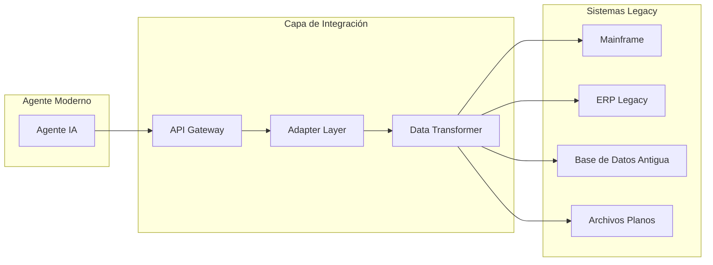
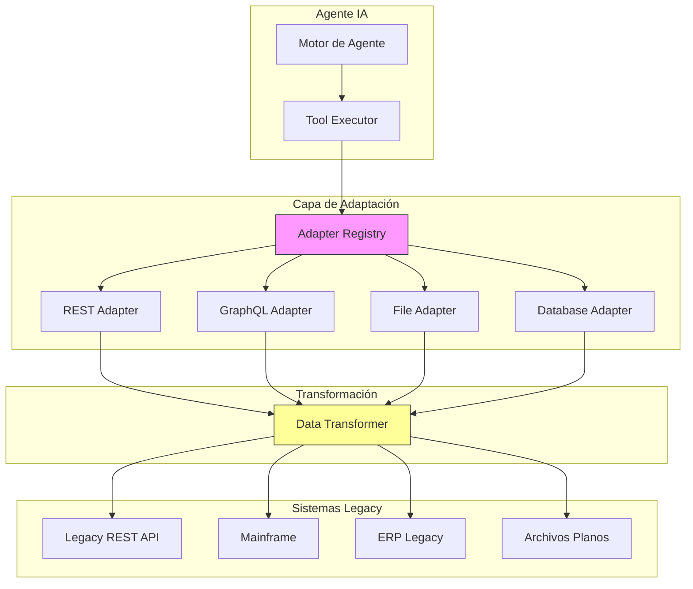
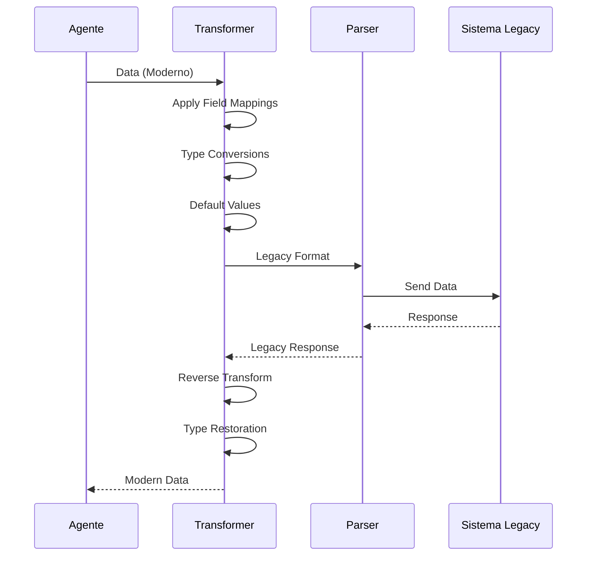
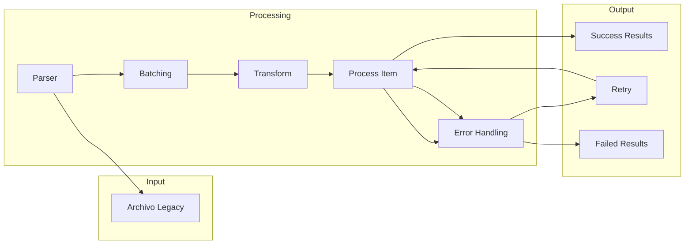

# Clase 5: Integración con Sistemas Legacy - Fundamentos

## Duración
4 horas (240 minutos)

## Objetivos de Aprendizaje
- Comprender los desafíos de integración con sistemas legacy
- Implementar adapters para conectar agentes con sistemas existentes
- Diseñar capas de abstracción para datos legacy
- Manejar formatos de archivo legacy
- Implementar procesamiento batch para sistemas antiguos

## Contenidos Detallados

### 5.1 Fundamentos de Integración con Legacy (60 minutos)

Los sistemas legacy representan un desafío significativo en la ingeniería de agentes industriales. Estos sistemas, que pueden tener décadas de antigüedad, frecuentemente presentan características que dificultan la integración moderna:

- **Protocolos propietarios**: Comunicacion usando protocolos no estándar
- **Formatos de datos obsoletos**: Archivos en formatos propietarios o binarios
- **APIs limitadas**: Sin APIs modernas o con capacidades REST/ SOAP limitadas
- **Documentación escasa**: Sistema antiguo con poca o ninguna documentación
- **Acoplamiento fuerte**: Sistemas altamente acoplados difíciles de modificar

#### 5.1.1 Estrategias de Integración



```python
from abc import ABC, abstractmethod
from typing import Any, Dict, Optional
from dataclasses import dataclass
from datetime import datetime
import json

@dataclass
class IntegrationConfig:
    """Configuración para integración con sistema legacy"""
    system_name: str
    system_type: str  # mainframe, erp, database, file
    connection_params: Dict[str, Any]
    timeout: int = 30
    retry_attempts: int = 3
    auth_method: str = "basic"


class LegacySystemAdapter(ABC):
    """Adapter base para sistemas legacy"""
    
    def __init__(self, config: IntegrationConfig):
        self.config = config
        self.connection = None
        self.is_connected = False
    
    @abstractmethod
    def connect(self) -> bool:
        """Establece conexión con el sistema legacy"""
        pass
    
    @abstractmethod
    def disconnect(self):
        """Cierra la conexión"""
        pass
    
    @abstractmethod
    def execute_operation(self, operation: str, params: Dict) -> Any:
        """Ejecuta una operación en el sistema"""
        pass
    
    @abstractmethod
    def fetch_data(self, query: str) -> list:
        """Recupera datos del sistema"""
        pass
    
    def health_check(self) -> Dict:
        """Verifica el estado de la conexión"""
        return {
            "system": self.config.system_name,
            "connected": self.is_connected,
            "timestamp": datetime.now().isoformat()
        }


class AdapterRegistry:
    """Registro de adapters disponibles"""
    
    def __init__(self):
        self.adapters: Dict[str, LegacySystemAdapter] = {}
        self.factories: Dict[str, callable] = {}
    
    def register_adapter(self, name: str, adapter: LegacySystemAdapter):
        """Registra un adapter"""
        self.adapters[name] = adapter
    
    def register_factory(self, system_type: str, factory: callable):
        """Registra una fábrica de adapters"""
        self.factories[system_type] = factory
    
    def get_adapter(self, name: str) -> Optional[LegacySystemAdapter]:
        """Obtiene un adapter por nombre"""
        return self.adapters.get(name)
    
    def create_adapter(self, config: IntegrationConfig) -> LegacySystemAdapter:
        """Crea un adapter basado en la configuración"""
        factory = self.factories.get(config.system_type)
        
        if not factory:
            raise ValueError(f"No factory for system type: {config.system_type}")
        
        return factory(config)
```

### 5.2 REST APIs para Legacy (75 minutos)

#### 5.2.1 Wrapper REST para Sistemas Legacy

```python
from fastapi import FastAPI, HTTPException, Request, Response
from fastapi.responses import JSONResponse
from typing import Optional, Dict, Any
import httpx
import asyncio
from datetime import datetime
import logging

logger = logging.getLogger(__name__)

app = FastAPI(title="Legacy Integration API")


class LegacyAPIWrapper:
    """Wrapper REST para sistemas legacy"""
    
    def __init__(
        self,
        base_url: str,
        auth: Dict[str, str] = None,
        timeout: int = 30,
        retry_count: int = 3
    ):
        self.base_url = base_url.rstrip("/")
        self.auth = auth or {}
        self.timeout = timeout
        self.retry_count = retry_count
        self.client = None
    
    async def __aenter__(self):
        self.client = httpx.AsyncClient(
            base_url=self.base_url,
            timeout=self.timeout,
            auth=httpx.Auth(self.auth.get("username"), self.auth.get("password"))
        )
        return self
    
    async def __aexit__(self, exc_type, exc_val, exc_tb):
        if self.client:
            await self.client.aclose()
    
    async def get(self, endpoint: str, params: Dict = None) -> Dict:
        """Realiza GET request"""
        return await self._request("GET", endpoint, params=params)
    
    async def post(self, endpoint: str, data: Dict = None) -> Dict:
        """Realiza POST request"""
        return await self._request("POST", endpoint, json=data)
    
    async def put(self, endpoint: str, data: Dict = None) -> Dict:
        """Realiza PUT request"""
        return await self._request("PUT", endpoint, json=data)
    
    async def delete(self, endpoint: str) -> Dict:
        """Realiza DELETE request"""
        return await self._request("DELETE", endpoint)
    
    async def _request(
        self,
        method: str,
        endpoint: str,
        **kwargs
    ) -> Dict:
        """Ejecuta request con retry"""
        
        last_error = None
        
        for attempt in range(self.retry_count):
            try:
                response = await self.client.request(
                    method,
                    endpoint,
                    **kwargs
                )
                response.raise_for_status()
                return response.json()
                
            except httpx.HTTPStatusError as e:
                logger.error(f"HTTP error {e.response.status_code}: {e}")
                raise HTTPException(
                    status_code=e.response.status_code,
                    detail=str(e)
                )
            except httpx.RequestError as e:
                last_error = e
                logger.warning(f"Request error (attempt {attempt + 1}): {e}")
                
                if attempt < self.retry_count - 1:
                    await asyncio.sleep(2 ** attempt)  # Backoff
        
        raise HTTPException(
            status_code=503,
            detail=f"Legacy system unavailable: {last_error}"
        )


class LegacyRESTAdapter(LegacySystemAdapter):
    """Adapter para sistemas con REST API"""
    
    def __init__(self, config: IntegrationConfig):
        super().__init__(config)
        self.base_url = config.connection_params.get("base_url", "")
        self.api_key = config.connection_params.get("api_key")
    
    async def connect(self) -> bool:
        """Conecta al sistema legacy via REST"""
        try:
            async with LegacyAPIWrapper(
                self.base_url,
                auth={"username": "api_user", "password": "api_pass"}
            ) as client:
                response = await client.get("/health")
                self.is_connected = response.get("status") == "ok"
                return self.is_connected
        except Exception as e:
            logger.error(f"Connection failed: {e}")
            return False
    
    def disconnect(self):
        """Cierra la conexión"""
        self.is_connected = False
    
    async def execute_operation(self, operation: str, params: Dict) -> Any:
        """Ejecuta operación"""
        async with LegacyAPIWrapper(self.base_url) as client:
            endpoint = f"/operations/{operation}"
            return await client.post(endpoint, params)
    
    async def fetch_data(self, query: str) -> list:
        """Recupera datos"""
        async with LegacyAPIWrapper(self.base_url) as client:
            return await client.get("/data", params={"query": query})
```

#### 5.2.2 Transformación de Datos

```python
from typing import Any, Dict, List, Callable
import json
from datetime import datetime


class DataTransformer:
    """Transforma datos entre formatos legacy y moderno"""
    
    def __init__(self):
        self.field_mappings: Dict[str, Dict[str, str]] = {}
        self.type_converters: Dict[str, Callable] = {}
        self.default_values: Dict[str, Any] = {}
    
    def add_field_mapping(
        self,
        source_field: str,
        target_field: str,
        transformer: Callable = None
    ):
        """Agrega mapeo de campo"""
        if source_field not in self.field_mappings:
            self.field_mappings[source_field] = {}
        
        self.field_mappings[source_field] = {
            "target": target_field,
            "transformer": transformer
        }
    
    def add_type_converter(self, type_name: str, converter: Callable):
        """Agrega convertidor de tipo"""
        self.type_converters[type_name] = converter
    
    def transform(self, data: Dict, schema: Dict) -> Dict:
        """Transforma datos según schema"""
        
        result = {}
        
        for target_field, config in schema.items():
            source_field = config.get("source", target_field)
            default = config.get("default")
            
            # Obtener valor
            value = data.get(source_field, default)
            
            # Aplicar transformaciones
            if value is not None:
                # Convertir tipo si es necesario
                target_type = config.get("type")
                if target_type and target_type in self.type_converters:
                    value = self.type_converters[target_type](value)
                
                # Aplicar transformador específico
                if source_field in self.field_mappings:
                    transformer = self.field_mappings[source_field].get("transformer")
                    if transformer:
                        value = transformer(value)
            
            result[target_field] = value
        
        return result
    
    def transform_batch(self, data_list: List[Dict], schema: Dict) -> List[Dict]:
        """Transforma un batch de datos"""
        return [self.transform(data, schema) for data in data_list]


# Schema de transformación ejemplo
LEGACY_TO_MODERN_SCHEMA = {
    "customer_id": {"source": "CUST_NUM", "type": "integer"},
    "full_name": {"source": "CUST_NAME", "transformer": lambda x: x.strip().title()},
    "email": {"source": "EMAIL_ADDR", "default": "unknown@example.com"},
    "phone": {"source": "PHONE_NUM"},
    "address": {"source": "ADDR_LINE1"},
    "city": {"source": "CITY_NAME"},
    "country_code": {"source": "COUNTRY_CD", "type": "string"},
    "created_at": {"source": "CREATED_DT", "type": "date"},
    "status": {"source": "STAT_CD", "default": "active"}
}


def create_legacy_transformer() -> DataTransformer:
    """Crea un transformer para datos legacy"""
    
    transformer = DataTransformer()
    
    # Agregar conversores de tipo
    transformer.add_type_converter("date", lambda x: 
        datetime.strptime(x, "%Y%m%d").isoformat() if x else None)
    transformer.add_type_converter("integer", lambda x: int(x) if x else 0)
    transformer.add_type_converter("string", lambda x: str(x).strip() if x else "")
    transformer.add_type_converter("decimal", lambda x: float(x) if x else 0.0)
    
    return transformer
```

### 5.3 GraphQL Adapters (45 minutos)

```python
from gql import Client, transport
from gql import aiohttp
from typing import Dict, List, Optional
import json


class LegacyGraphQLAdapter:
    """Adapter que expone sistema legacy como GraphQL"""
    
    def __init__(self, legacy_endpoint: str, schema: Dict):
        self.endpoint = legacy_endpoint
        self.schema = schema
        self.client = None
    
    async def connect(self):
        """Conecta al endpoint legacy"""
        transport = aiohttp.AIOHTTPTransport(url=self.endpoint)
        self.client = Client(transport=transport, schema=self.schema)
    
    async def execute_query(self, query: str, variables: Dict = None) -> Dict:
        """Ejecuta query GraphQL"""
        
        if not self.client:
            raise RuntimeError("Client not connected")
        
        result = await self.client.execute_async(
            query,
            variable_values=variables or {}
        )
        
        return result
    
    async def execute_mutation(self, mutation: str, variables: Dict) -> Dict:
        """Ejecuta mutation GraphQL"""
        return await self.execute_query(mutation, variables)


# Schema GraphQL para sistema legacy
LEGACY_GRAPHQL_SCHEMA = """
type Customer {
    id: ID!
    customerNumber: String!
    name: String!
    email: String
    phone: String
    address: Address
    status: String!
    createdAt: String!
}

type Address {
    street: String
    city: String
    state: String
    postalCode: String
    country: String!
}

type Query {
    customers(limit: Int, offset: Int): [Customer!]!
    customer(id: ID!): Customer
    searchCustomers(query: String!): [Customer!]!
}

type Mutation {
    createCustomer(input: CustomerInput!): Customer!
    updateCustomer(id: ID!, input: CustomerInput!): Customer!
    deleteCustomer(id: ID!): Boolean!
}

input CustomerInput {
    customerNumber: String!
    name: String!
    email: String
    phone: String
    address: AddressInput
}

input AddressInput {
    street: String
    city: String
    state: String
    postalCode: String
    country: String!
}
"""
```

### 5.4 Legacy File Formats (30 minutos)

```python
import csv
import xml.etree.ElementTree as ET
from abc import ABC, abstractmethod
from typing import Iterator, Dict, List
from io import StringIO, BytesIO
import struct
from datetime import datetime


class LegacyFileParser(ABC):
    """Parser base para archivos legacy"""
    
    @abstractmethod
    def parse(self, content: bytes) -> Iterator[Dict]:
        """Parsea el contenido del archivo"""
        pass
    
    @abstractmethod
    def serialize(self, data: List[Dict]) -> bytes:
        """Serializa datos a formato legacy"""
        pass


class CSVLegacyParser(LegacyFileParser):
    """Parser para archivos CSV legacy"""
    
    def __init__(
        self,
        delimiter: str = ",",
        encoding: str = "latin-1",
        has_header: bool = True,
        text_qualifier: str = '"'
    ):
        self.delimiter = delimiter
        self.encoding = encoding
        self.has_header = has_header
        self.text_qualifier = text_qualifier
    
    def parse(self, content: bytes) -> Iterator[Dict]:
        """Parsea contenido CSV"""
        
        text = content.decode(self.encoding)
        
        # Manejar text qualifier
        if self.text_qualifier:
            reader = csv.reader(
                text,
                delimiter=self.delimiter,
                quotechar=self.text_qualifier
            )
        else:
            reader = csv.reader(text, delimiter=self.delimiter)
        
        if self.has_header:
            headers = next(reader)
            for row in reader:
                if len(row) == len(headers):
                    yield dict(zip(headers, row))
        else:
            for i, row in enumerate(reader):
                yield {f"col_{j}": val for j, val in enumerate(row)}
    
    def serialize(self, data: List[Dict]) -> bytes:
        """Serializa datos a CSV"""
        
        if not data:
            return b""
        
        output = StringIO()
        
        headers = list(data[0].keys())
        writer = csv.DictWriter(
            output,
            fieldnames=headers,
            delimiter=self.delimiter,
            quotechar=self.text_qualifier
        )
        
        writer.writeheader()
        writer.writerows(data)
        
        return output.getvalue().encode(self.encoding)


class FixedWidthParser(LegacyFileParser):
    """Parser para archivos de ancho fijo"""
    
    def __init__(self, field_specs: List[Dict]):
        """
        field_specs: [{"name": "field1", "start": 0, "end": 10}, ...]
        """
        self.field_specs = field_specs
    
    def parse(self, content: bytes) -> Iterator[Dict]:
        """Parsea contenido de ancho fijo"""
        
        text = content.decode("latin-1")
        
        for line in text.splitlines():
            if not line.strip():
                continue
            
            record = {}
            for spec in self.field_specs:
                start = spec["start"]
                end = spec["end"]
                field_name = spec["name"]
                
                value = line[start:end].strip()
                
                # Aplicar transformación de tipo si existe
                if "type" in spec:
                    value = self._convert_type(value, spec["type"])
                
                record[field_name] = value
            
            yield record
    
    def _convert_type(self, value: str, type_name: str):
        """Convierte el valor al tipo especificado"""
        
        if type_name == "integer":
            return int(value) if value.strip() else 0
        elif type_name == "decimal":
            return float(value) if value.strip() else 0.0
        elif type_name == "date":
            return self._parse_date(value)
        elif type_name == "string":
            return value.strip()
        return value
    
    def _parse_date(self, value: str) -> Optional[str]:
        """Parsea fecha en varios formatos"""
        
        formats = [
            "%Y%m%d",
            "%d%m%Y",
            "%Y-%m-%d",
            "%d-%m-%Y"
        ]
        
        for fmt in formats:
            try:
                return datetime.strptime(value.strip(), fmt).isoformat()
            except:
                continue
        
        return None
    
    def serialize(self, data: List[Dict]) -> bytes:
        """Serializa datos a formato de ancho fijo"""
        
        lines = []
        
        for record in data:
            line = ""
            for spec in self.field_specs:
                field_name = spec["name"]
                width = spec["end"] - spec["start"]
                value = str(record.get(field_name, ""))
                
                # Ajustar al ancho
                if len(value) > width:
                    value = value[:width]
                else:
                    value = value.ljust(width)
                
                line += value
            
            lines.append(line)
        
        return "\n".join(lines).encode("latin-1")


class XMLLegacyParser(LegacyFileParser):
    """Parser para archivos XML legacy"""
    
    def __init__(self, root_element: str, item_element: str):
        self.root_element = root_element
        self.item_element = item_element
    
    def parse(self, content: bytes) -> Iterator[Dict]:
        """Parsea contenido XML"""
        
        tree = ET.fromstring(content)
        
        # Encontrar el elemento raíz
        if tree.tag != self.root_element:
            # Buscar el elemento raíz
            for elem in tree.iter():
                if elem.tag == self.root_element:
                    tree = elem
                    break
        
        # Parsear cada item
        for item in tree.findall(f".//{self.item_element}"):
            record = {}
            
            for child in item:
                record[child.tag] = child.text or ""
            
            # Parsear atributos
            for attr, value in item.attrib.items():
                record[attr] = value
            
            yield record
    
    def serialize(self, data: List[Dict]) -> bytes:
        """Serializa datos a XML"""
        
        root = ET.Element(self.root_element)
        
        for item_data in data:
            item = ET.SubElement(root, self.item_element)
            
            for key, value in item_data.items():
                child = ET.SubElement(item, key)
                child.text = str(value)
        
        return ET.tostring(root, encoding="utf-8")
```

### 5.5 Batch Processing (30 minutos)

```python
import asyncio
from typing import List, Dict, Callable, Any
from dataclasses import dataclass
from datetime import datetime
import logging

logger = logging.getLogger(__name__)


@dataclass
class BatchJob:
    """Representa un job de procesamiento batch"""
    job_id: str
    source_system: str
    target_system: str
    items: List[Dict]
    status: str
    created_at: datetime
    started_at: datetime = None
    completed_at: datetime = None
    results: Dict = None
    errors: List[Dict] = None


class BatchProcessor:
    """Procesador de batches para sistemas legacy"""
    
    def __init__(
        self,
        batch_size: int = 100,
        max_concurrent: int = 5,
        retry_failed: bool = True,
        max_retries: int = 3
    ):
        self.batch_size = batch_size
        self.max_concurrent = max_concurrent
        self.retry_failed = retry_failed
        self.max_retries = max_retries
        self.semaphore = asyncio.Semaphore(max_concurrent)
    
    async def process(
        self,
        items: List[Dict],
        processor_func: Callable,
        transformer: Callable = None
    ) -> Dict:
        """Procesa items en batches"""
        
        # Transformar si es necesario
        if transformer:
            items = [transformer(item) for item in items]
        
        # Dividir en batches
        batches = [
            items[i:i + self.batch_size]
            for i in range(0, len(items), self.batch_size)
        ]
        
        results = {
            "total": len(items),
            "success": 0,
            "failed": 0,
            "batches": []
        }
        
        # Procesar batches
        for i, batch in enumerate(batches):
            logger.info(f"Processing batch {i + 1}/{len(batches)}")
            
            batch_result = await self._process_batch(batch, processor_func)
            
            results["success"] += batch_result["success"]
            results["failed"] += batch_result["failed"]
            results["batches"].append(batch_result)
        
        return results
    
    async def _process_batch(
        self,
        batch: List[Dict],
        processor_func: Callable
    ) -> Dict:
        """Procesa un batch individual"""
        
        async with self.semaphore:
            success_count = 0
            failed_count = 0
            errors = []
            
            for item in batch:
                try:
                    await processor_func(item)
                    success_count += 1
                except Exception as e:
                    failed_count += 1
                    
                    if self.retry_failed:
                        # Retry logic
                        for attempt in range(self.max_retries):
                            try:
                                await processor_func(item)
                                success_count += 1
                                failed_count -= 1
                                break
                            except:
                                if attempt == self.max_retries - 1:
                                    errors.append({
                                        "item": item,
                                        "error": str(e)
                                    })
            
            return {
                "batch_size": len(batch),
                "success": success_count,
                "failed": failed_count,
                "errors": errors[:10]  # Limitar errores registrados
            }


class LegacyFileProcessor:
    """Procesador de archivos legacy"""
    
    def __init__(self, parser: LegacyFileParser, processor: BatchProcessor):
        self.parser = parser
        self.processor = processor
    
    async def process_file(
        self,
        file_content: bytes,
        process_func: Callable,
        transform_func: Callable = None
    ) -> Dict:
        """Procesa un archivo legacy"""
        
        # Parsear archivo
        items = list(self.parser.parse(file_content))
        
        logger.info(f"Parsed {len(items)} items from file")
        
        # Procesar items
        results = await self.processor.process(
            items,
            process_func,
            transform_func
        )
        
        return results
    
    async def generate_file(
        self,
        data: List[Dict],
        transform_func: Callable = None
    ) -> bytes:
        """Genera archivo legacy desde datos"""
        
        # Transformar si es necesario
        if transform_func:
            data = [transform_func(item) for item in data]
        
        # Serializar
        return self.parser.serialize(data)
```

## Diagramas

### Diagrama 1: Arquitectura de Integración Legacy



### Diagrama 2: Flujo de Transformación de Datos



### Diagrama 3: Batch Processing



## Referencias Externas

1. **FastAPI Documentation**: https://fastapi.tiangolo.com/
2. **httpx HTTP Client**: https://www.python-httpx.org/
3. **GraphQL Python**: https://graphql.org/
4. **CSV Module Python**: https://docs.python.org/3/library/csv.html
5. **XML Parsing Python**: https://docs.python.org/3/library/xml.etree.elementtree.html

## Ejercicios Prácticos Resueltos

### Ejercicio 1: Implementar Adapter para REST API Legacy

**Problema**: Crear un adapter que conecte un agente con una API REST legacy.

**Solución**:

```python
"""
Adapter para API REST Legacy
"""

import asyncio
import httpx
from typing import Dict, Any, Optional
from dataclasses import dataclass
from datetime import datetime
import logging

logging.basicConfig(level=logging.INFO)
logger = logging.getLogger(__name__)


@dataclass
class LegacyAPIConfig:
    """Configuración para API legacy"""
    base_url: str
    api_version: str = "v1"
    timeout: int = 30
    max_retries: int = 3
    auth_type: str = "basic"  # basic, bearer, api_key


class LegacyRESTAdapter:
    """Adapter para APIs REST legacy"""
    
    def __init__(self, config: LegacyAPIConfig):
        self.config = config
        self.base_url = f"{config.base_url}/{config.api_version}"
        self.client = None
        self.connected = False
    
    async def connect(self) -> bool:
        """Conecta al API"""
        
        try:
            self.client = httpx.AsyncClient(
                base_url=self.base_url,
                timeout=self.config.timeout
            )
            
            # Health check
            response = await self.client.get("/health")
            self.connected = response.status_code == 200
            
            logger.info(f"Connected to legacy API: {self.connected}")
            return self.connected
            
        except Exception as e:
            logger.error(f"Connection failed: {e}")
            return False
    
    async def disconnect(self):
        """Cierra la conexión"""
        if self.client:
            await self.client.aclose()
        self.connected = False
    
    async def get(self, endpoint: str, params: Dict = None) -> Dict:
        """GET request"""
        return await self._request("GET", endpoint, params=params)
    
    async def post(self, endpoint: str, data: Dict = None) -> Dict:
        """POST request"""
        return await self._request("POST", endpoint, json=data)
    
    async def put(self, endpoint: str, data: Dict = None) -> Dict:
        """PUT request"""
        return await self._request("PUT", endpoint, json=data)
    
    async def delete(self, endpoint: str) -> Dict:
        """DELETE request"""
        return await self._request("DELETE", endpoint)
    
    async def _request(
        self,
        method: str,
        endpoint: str,
        **kwargs
    ) -> Dict:
        """Request con retry"""
        
        last_error = None
        
        for attempt in range(self.config.max_retries):
            try:
                response = await self.client.request(method, endpoint, **kwargs)
                response.raise_for_status()
                return response.json()
                
            except httpx.HTTPStatusError as e:
                logger.error(f"HTTP error: {e}")
                raise
                
            except httpx.RequestError as e:
                last_error = e
                logger.warning(f"Request error (attempt {attempt + 1}): {e}")
                
                if attempt < self.config.max_retries - 1:
                    await asyncio.sleep(2 ** attempt)
        
        raise Exception(f"Failed after {self.config.max_retries} attempts: {last_error}")


class CustomerLegacyAdapter(LegacyRESTAdapter):
    """Adapter específico para sistema de clientes legacy"""
    
    async def get_customer(self, customer_id: str) -> Optional[Dict]:
        """Obtiene un cliente"""
        try:
            return await self.get(f"/customers/{customer_id}")
        except httpx.HTTPStatusError as e:
            if e.response.status_code == 404:
                return None
            raise
    
    async def search_customers(self, query: str) -> list:
        """Busca clientes"""
        result = await self.get("/customers", params={"q": query})
        return result.get("data", [])
    
    async def create_customer(self, customer_data: Dict) -> Dict:
        """Crea un cliente"""
        return await self.post("/customers", customer_data)
    
    async def update_customer(self, customer_id: str, data: Dict) -> Dict:
        """Actualiza un cliente"""
        return await self.put(f"/customers/{customer_id}", data)
    
    async def list_customers(self, page: int = 1, limit: int = 50) -> Dict:
        """Lista clientes con paginación"""
        return await self.get("/customers", params={"page": page, "limit": limit})


# ==================== EJEMPLO DE USO ====================

async def main():
    print("=" * 60)
    print("EJEMPLO: ADAPTER REST LEGACY")
    print("=" * 60)
    
    # Configurar adapter
    config = LegacyAPIConfig(
        base_url="https://api.legacy-company.com",
        api_version="v2",
        timeout=30,
        max_retries=3
    )
    
    # Crear adapter específico
    adapter = CustomerLegacyAdapter(config)
    
    # Conectar
    print("\n1. Conectando al sistema legacy...")
    connected = await adapter.connect()
    print(f"   Conexión exitosa: {connected}")
    
    if connected:
        # Obtener cliente
        print("\n2. Buscar cliente por ID:")
        customer = await adapter.get_customer("CUST-001")
        if customer:
            print(f"   Cliente encontrado: {customer.get('name')}")
        else:
            print("   Cliente no encontrado")
        
        # Buscar clientes
        print("\n3. Buscar clientes por query:")
        customers = await adapter.search_customers("Smith")
        print(f"   Resultados: {len(customers)} clientes")
        
        # Crear cliente
        print("\n4. Crear nuevo cliente:")
        new_customer = await adapter.create_customer({
            "name": "John Doe",
            "email": "john@example.com",
            "phone": "+1234567890"
        })
        print(f"   Cliente creado: {new_customer.get('id')}")
    
    # Desconectar
    await adapter.disconnect()
    print("\n5. Desconectado")
    
    print("\n" + "=" * 60)


if __name__ == "__main__":
    asyncio.run(main())
```

**Explicación**:
- **LegacyRESTAdapter**: Clase base con métodos HTTP genéricos
- **CustomerLegacyAdapter**: Especialización para operaciones de clientes
- **Retry logic**: Backoff exponencial para manejar errores transitorios
- **Type hints**: Tipado para mejor mantenibilidad

### Ejercicio 2: Procesador de Archivos Legacy

**Problema**: Implementar un procesador que maneje múltiples formatos de archivo legacy.

**Solución**:

```python
"""
Procesador de Archivos Legacy
"""

import io
from typing import Dict, List, Callable
from dataclasses import dataclass
import csv


@dataclass
class ProcessingResult:
    """Resultado del procesamiento"""
    success_count: int
    failed_count: int
    errors: List[Dict]
    processed_data: List[Dict]


class LegacyFileProcessor:
    """Procesador de archivos en formatos legacy"""
    
    def __init__(self):
        self.parsers = {}
    
    def register_parser(self, format_type: str, parser):
        """Registra un parser para un formato"""
        self.parsers[format_type] = parser
    
    def parse_file(self, content: bytes, format_type: str) -> List[Dict]:
        """Parsea un archivo según su formato"""
        
        parser = self.parsers.get(format_type)
        
        if not parser:
            raise ValueError(f"Unknown format: {format_type}")
        
        return list(parser.parse(content))
    
    def transform_data(
        self,
        data: List[Dict],
        field_mapping: Dict[str, str],
        type_converters: Dict[str, Callable] = None
    ) -> List[Dict]:
        """Transforma datos usando mapeo de campos"""
        
        type_converters = type_converters or {}
        transformed = []
        
        for item in data:
            new_item = {}
            
            for target_field, source_field in field_mapping.items():
                value = item.get(source_field)
                
                # Convertir tipo si hay conversor
                if target_field in type_converters and value:
                    value = type_converters[target_field](value)
                
                new_item[target_field] = value
            
            transformed.append(new_item)
        
        return transformed
    
    def process_file(
        self,
        content: bytes,
        format_type: str,
        field_mapping: Dict[str, str],
        processor: Callable
    ) -> ProcessingResult:
        """Procesa un archivo completo"""
        
        # Parsear
        data = self.parse_file(content, format_type)
        
        # Transformar
        transformed = self.transform_data(data, field_mapping)
        
        # Procesar cada item
        success = 0
        failed = 0
        errors = []
        results = []
        
        for item in transformed:
            try:
                result = processor(item)
                success += 1
                results.append(result)
            except Exception as e:
                failed += 1
                errors.append({
                    "item": item,
                    "error": str(e)
                })
        
        return ProcessingResult(
            success_count=success,
            failed_count=failed,
            errors=errors[:10],
            processed_data=results
        )


# ==================== PARSERS ====================

class CSVParser:
    """Parser para CSV legacy"""
    
    def __init__(self, delimiter: str = ",", encoding: str = "latin-1"):
        self.delimiter = delimiter
        self.encoding = encoding
    
    def parse(self, content: bytes) -> List[Dict]:
        """Parsea contenido CSV"""
        
        text = content.decode(self.encoding)
        reader = csv.DictReader(text, delimiter=self.delimiter)
        
        return list(reader)


class FixedWidthParser:
    """Parser para archivos de ancho fijo"""
    
    def __init__(self, specs: List[Dict]):
        self.specs = specs
    
    def parse(self, content: bytes) -> List[Dict]:
        """Parsea contenido de ancho fijo"""
        
        text = content.decode("latin-1")
        results = []
        
        for line in text.splitlines():
            if not line.strip():
                continue
            
            item = {}
            for spec in self.specs:
                start = spec["start"]
                end = spec["end"]
                field = spec["field"]
                
                value = line[start:end].strip()
                item[field] = value
            
            results.append(item)
        
        return results


# ==================== EJEMPLO ====================

def main():
    print("=" * 60)
    print("EJEMPLO: PROCESADOR DE ARCHIVOS LEGACY")
    print("=" * 60)
    
    # Crear procesador
    processor = LegacyFileProcessor()
    
    # Registrar parsers
    csv_parser = CSVParser(delimiter=";", encoding="utf-8")
    processor.register_parser("csv", csv_parser)
    
    # Spec para archivo de ancho fijo
    fw_specs = [
        {"field": "id", "start": 0, "end": 10},
        {"field": "name", "start": 10, "end": 40},
        {"field": "amount", "start": 40, "end": 50}
    ]
    fw_parser = FixedWidthParser(fw_specs)
    processor.register_parser("fixed", fw_parser)
    
    # Contenido CSV de ejemplo
    csv_content = b"""id;name;amount;date
001;John Doe;1500.00;2024-01-15
002;Jane Smith;2300.50;2024-01-16
003;Bob Wilson;800.25;2024-01-17"""
    
    # Mapeo de campos
    field_mapping = {
        "customer_id": "id",
        "customer_name": "name",
        "total_amount": "amount",
        "transaction_date": "date"
    }
    
    # Procesador de ejemplo
    def process_item(item: Dict) -> Dict:
        return {
            "processed": True,
            "customer": item["customer_name"],
            "amount": float(item["total_amount"])
        }
    
    # Procesar archivo
    print("\n1. Procesando archivo CSV...")
    result = processor.process_file(
        csv_content,
        "csv",
        field_mapping,
        process_item
    )
    
    print(f"   Procesados: {result.success_count}")
    print(f"   Fallidos: {result.failed_count}")
    print(f"   Datos procesados:")
    for item in result.processed_data[:2]:
        print(f"      - {item}")
    
    # Contenido de ancho fijo
    fw_content = b"""001     John Doe           0000150000
002     Jane Smith         0000230050
003     Bob Wilson         0000080025"""
    
    print("\n2. Procesando archivo de ancho fijo...")
    result2 = processor.process_file(
        fw_content,
        "fixed",
        {"id": "id", "name": "name", "amount": "amount"},
        process_item
    )
    
    print(f"   Procesados: {result2.success_count}")
    
    print("\n" + "=" * 60)


if __name__ == "__main__":
    main()
```

## Actividades de Laboratorio

### Laboratorio 1: Crear Adapter para REST API

**Duración**: 60 minutos

**Objetivo**: Implementar un adapter completo para una API REST legacy.

**Pasos**:
1. Crear clase base LegacySystemAdapter
2. Implementar métodos de conexión y operaciones
3. Agregar manejo de errores y retry
4. Crear adapter específico para un dominio

**Entregable**: Adapter funcional con tests.

### Laboratorio 2: Parser de Formato Legacy

**Duración**: 45 minutos

**Objetivo**: Crear parser para formato de archivo específico.

**Pasos**:
1. Analizar formato de archivo de ejemplo
2. Implementar parser con manejo de encoding
3. Agregar validación de datos
4. Implementar serialización inversa

**Entregable**: Parser con datos de prueba.

### Laboratorio 3: Transformador de Datos

**Duración**: 45 minutos

**Objetivo**: Implementar transformación de datos entre sistemas.

**Pasos**:
1. Definir schema de transformación
2. Implementar mapeo de campos
3. Agregar conversores de tipo
4. Crear transformación bidireccional

**Entregable**: Transformador con tests.

## Resumen de Puntos Clave

1. **Sistemas Legacy**: Requieren adapters específicos debido a protocolos y formatos obsoletos.

2. **Adapter Pattern**: Abstrae la complejidad de los sistemas legacy detrás de una interfaz moderna.

3. **REST Wrappers**: Expón sistemas legacy como APIs REST para consumo por agentes.

4. **GraphQL**: Alternativa para APIs más flexibles con sistemas legacy.

5. **Transformación de Datos**: Convierte entre formatos legacy y modernos.

6. **Parsers**: CSV, Fixed-width, XML son formatos legacy comunes que requieren parsing específico.

7. **Batch Processing**: Procesa grandes volúmenes de datos de sistemas legacy eficientemente.

8. **Encoding**: Los sistemas legacy frecuentemente usan encoding no estándar (latin-1, EBCDIC).

9. **Error Handling**: Retry con backoff para errores transitorios.

10. **Logging**: Importante para debugging de integraciones con sistemas legacy.