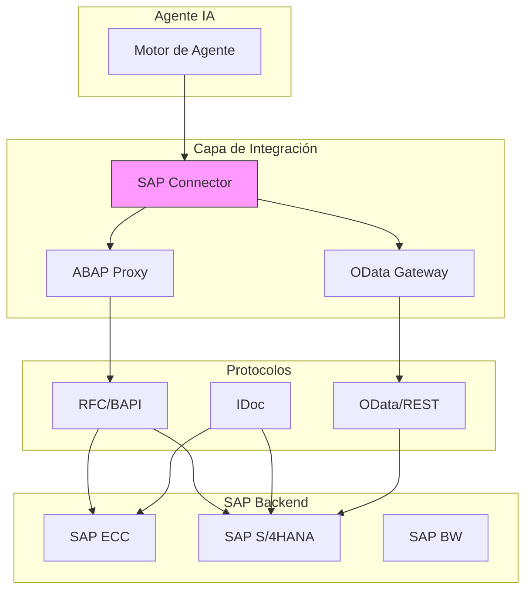
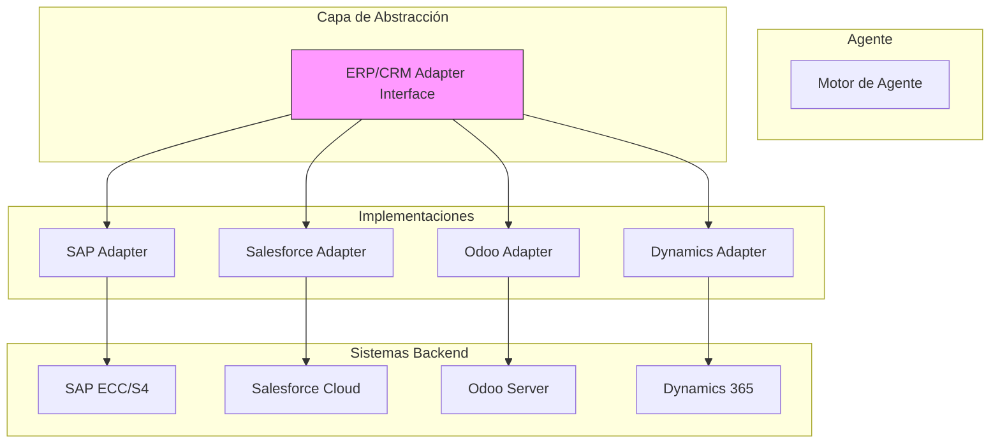
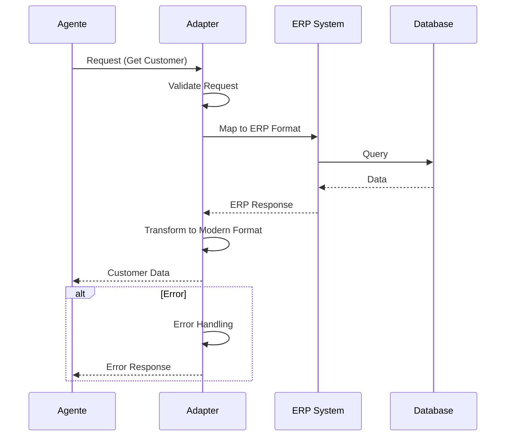

# Clase 6: Conexión con ERP/CRM

## Duración
4 horas (240 minutos)

## Objetivos de Aprendizaje
- Integrar agentes con SAP, el ERP más utilizado en industria
- Conectar con Salesforce para gestión de clientes
- Implementar integración con Odoo
- Conectar con Microsoft Dynamics
- Diseñar abstracciones para múltiples sistemas ERP/CRM

## Contenidos Detallados

### 6.1 SAP Integration (90 minutos)

SAP es el ERP dominante en grandes organizaciones industriales. La integración con SAP requiere comprender sus múltiples interfaces: RFC/BAPI, IDoc, y APIs REST/OData modernas.

#### 6.1.1 Arquitecturas de Integración SAP



#### 6.1.2 Conexión SAP via PyRFC

```python
import logging
from dataclasses import dataclass
from typing import Dict, List, Optional, Any
from datetime import datetime

logger = logging.getLogger(__name__)

try:
    from sap import hana_ml
    SAP_AVAILABLE = True
except ImportError:
    SAP_AVAILABLE = False


@dataclass
class SAPConfig:
    """Configuración de conexión SAP"""
    ashost: str  # Host del sistema SAP
    sysnr: str   # Número de sistema
    client: str  # Mandante
    user: str    # Usuario
    password: str
    lang: str = "EN"


class SAPConnection:
    """Gestor de conexión a SAP"""
    
    def __init__(self, config: SAPConfig):
        self.config = config
        self.connection = None
        self.connected = False
    
    def connect(self) -> bool:
        """Establece conexión a SAP"""
        
        if not SAP_AVAILABLE:
            logger.warning("SAP RFC library not available")
            return False
        
        try:
            # Connection via sapnwrfc (requiere SAP NW RFC SDK)
            # En producción, usar parámetros reales
            self.connection = {
                "ashost": self.config.ashost,
                "sysnr": self.config.sysnr,
                "client": self.config.client,
                "user": self.config.user,
                "passwd": self.config.password,
                "lang": self.config.lang
            }
            self.connected = True
            logger.info(f"Connected to SAP system {self.config.ashost}")
            return True
            
        except Exception as e:
            logger.error(f"SAP connection failed: {e}")
            return False
    
    def disconnect(self):
        """Cierra la conexión"""
        self.connected = False
        self.connection = None
    
    def call_function(
        self,
        function_name: str,
        params: Dict = None
    ) -> Dict:
        """Llama a un módulo de función RFC"""
        
        if not self.connected:
            raise RuntimeError("Not connected to SAP")
        
        # En implementación real:
        # func = self.connection.call(function_name, **params or {})
        # return dict(func)
        
        # Mock para demostración
        return {
            "status": "success",
            "function": function_name,
            "result": {}
        }
    
    def execute_bapi(self, bapi_name: str, parameters: Dict) -> Dict:
        """Ejecuta un BAPI"""
        return self.call_function(bapi_name, parameters)


class SAPMaterialAdapter(SAPConnection):
    """Adapter para operaciones de materiales en SAP"""
    
    def get_material(self, material_number: str) -> Optional[Dict]:
        """Obtiene datos de un material"""
        
        result = self.call_function(
            "BAPI_MATERIAL_GET_DETAIL",
            {"MATERIAL": material_number}
        )
        
        return result.get("MATERIAL_GENERAL_DATA")
    
    def search_materials(
        self,
        search_term: str,
        max_results: int = 50
    ) -> List[Dict]:
        """Busca materiales"""
        
        result = self.call_function(
            "BAPI_MATERIAL_GETLIST",
            {
                "MATNR_RANGE": [{"SIGN": "I", "OPTION": "CP", "LOW": f"*{search_term}*"}]
            }
        )
        
        return result.get("MATERIAL_NUMBER", [])[:max_results]
    
    def get_stock(self, material_number: str, plant: str) -> Dict:
        """Obtiene stock de un material"""
        
        result = self.call_function(
            "BAPI_MATERIAL_GET_STOCK_DATA",
            {
                "MATERIAL": material_number,
                "PLANT": plant
            }
        )
        
        return result
    
    def create_purchase_order(self, po_data: Dict) -> Dict:
        """Crea una orden de compra"""
        
        # Llamar BAPI para crear PO
        result = self.call_function(
            "BAPI_PO_CREATE",
            po_data
        )
        
        if result.get("PO_NUMBER"):
            # Confirmar transacción
            self.call_function("BAPI_TRANSACTION_COMMIT", {"WAIT": "X"})
        
        return result


class SAPSalesAdapter(SAPConnection):
    """Adapter para operaciones de ventas en SAP"""
    
    def get_sales_order(self, order_number: str) -> Optional[Dict]:
        """Obtiene una orden de venta"""
        
        result = self.call_function(
            "BAPI_SALESORDER_GETDETAIL",
            {"SALES_DOCUMENT": order_number}
        )
        
        return result
    
    def create_sales_order(self, order_data: Dict) -> Dict:
        """Crea una orden de venta"""
        
        # Estructura típica de orden de venta
        header = order_data.get("header", {})
        items = order_data.get("items", [])
        
        # Llamar BAPI de creación
        result = self.call_function(
            "BAPI_SALESORDER_CREATEFROMDAT2",
            {
                "ORDER_HEADER_IN": header,
                "ORDER_ITEMS_IN": items
            }
        )
        
        # Commit si exitoso
        if result.get("SALES_DOCUMENT"):
            self.call_function("BAPI_TRANSACTION_COMMIT", {"WAIT": "X"})
        
        return result
    
    def get_customer_info(self, customer_number: str) -> Dict:
        """Obtiene información de cliente"""
        
        result = self.call_function(
            "BAPI_CUSTOMER_GETDETAIL",
            {"CUSTOMERNO": customer_number}
        )
        
        return result
    
    def get_open_orders(self, customer_number: str) -> List[Dict]:
        """Obtiene órdenes abiertas de un cliente"""
        
        result = self.call_function(
            "BAPI_CUSTOMER_GETORDERLIST",
            {"CUSTOMERNO": customer_number}
        )
        
        return result.get("SALES_ORDERS", [])
```

#### 6.1.3 SAP OData/REST Integration

```python
import httpx
import json
from typing import Dict, List, Optional
from datetime import datetime
import logging

logger = logging.getLogger(__name__)


class SAPODataClient:
    """Cliente para SAP OData / Gateway"""
    
    def __init__(
        self,
        base_url: str,
        username: str,
        password: str
    ):
        self.base_url = base_url.rstrip("/")
        self.auth = (username, password)
        self.client = None
    
    async def __aenter__(self):
        self.client = httpx.AsyncClient(
            base_url=self.base_url,
            auth=self.auth,
            timeout=30
        )
        return self
    
    async def __aexit__(self, exc_type, exc_val, exc_tb):
        if self.client:
            await self.client.aclose()
    
    async def get_entity(
        self,
        entity_set: str,
        entity_key: str,
        navigation: str = None
    ) -> Dict:
        """Obtiene una entidad específica"""
        
        url = f"/sap/opu/odata/sap/{entity_set}('{entity_key}')"
        
        if navigation:
            url += f"/{navigation}"
        
        response = await self.client.get(url)
        response.raise_for_status()
        
        return response.json()
    
    async def query(
        self,
        entity_set: str,
        filters: str = None,
        select: str = None,
        top: int = None,
        skip: int = None,
        orderby: str = None
    ) -> List[Dict]:
        """Consulta entidades con opciones OData"""
        
        params = {}
        
        if filters:
            params["$filter"] = filters
        if select:
            params["$select"] = select
        if top:
            params["$top"] = top
        if skip:
            params["$skip"] = skip
        if orderby:
            params["$orderby"] = orderby
        
        url = f"/sap/opu/odata/sap/{entity_set}"
        
        response = await self.client.get(url, params=params)
        response.raise_for_status()
        
        data = response.json()
        
        # Extraer resultados del formato OData
        return data.get("d", {}).get("results", [])
    
    async def create(
        self,
        entity_set: str,
        data: Dict
    ) -> Dict:
        """Crea una nueva entidad"""
        
        url = f"/sap/opu/odata/sap/{entity_set}"
        
        response = await self.client.post(
            url,
            json={"d": data}
        )
        response.raise_for_status()
        
        return response.json()
    
    async def update(
        self,
        entity_set: str,
        entity_key: str,
        data: Dict
    ) -> bool:
        """Actualiza una entidad"""
        
        url = f"/sap/opu/odata/sap/{entity_set}('{entity_key}')"
        
        response = await self.client.patch(
            url,
            json={"d": data}
        )
        
        return response.status_code in [200, 204]
    
    async def delete(self, entity_set: str, entity_key: str) -> bool:
        """Elimina una entidad"""
        
        url = f"/sap/opu/odata/sap/{entity_set}('{entity_key}')"
        
        response = await self.client.delete(url)
        
        return response.status_code in [200, 204]


class SAPMaterialODataAdapter:
    """Adapter para materiales usando OData"""
    
    def __init__(self, odata_client: SAPODataClient):
        self.client = odata_client
        self.entity_set = "MaterialSet"
    
    async def get_material(self, material_id: str) -> Optional[Dict]:
        """Obtiene material por ID"""
        
        try:
            return await self.client.get_entity(
                self.entity_set,
                material_id
            )
        except Exception as e:
            logger.error(f"Error getting material {material_id}: {e}")
            return None
    
    async def search_materials(
        self,
        search_term: str,
        max_results: int = 50
    ) -> List[Dict]:
        """Busca materiales"""
        
        filters = f"contains(MaterialNumber,'{search_term}') or contains(Description,'{search_term}')"
        
        return await self.client.query(
            self.entity_set,
            filters=filters,
            top=max_results
        )
    
    async def get_stock(self, material_id: str, plant: str) -> Dict:
        """Obtiene stock"""
        
        return await self.client.get_entity(
            self.entity_set,
            material_id,
            navigation="StockSet"
        )
```

### 6.2 Salesforce Integration (75 minutos)

#### 6.2.1 SDK de Salesforce

```python
from typing import Dict, List, Optional, Any
from dataclasses import dataclass
from datetime import datetime
import logging

logger = logging.getLogger(__name__)

# En producción, usar: from salesforce import Salesforce


@dataclass
class SalesforceConfig:
    """Configuración de Salesforce"""
    username: str
    password: str
    security_token: str
    domain: str = "login"  # login o test


class SalesforceClient:
    """Cliente para Salesforce API"""
    
    def __init__(self, config: SalesforceConfig):
        self.config = config
        self.instance_url = None
        self.access_token = None
        self.session = None
    
    def login(self) -> bool:
        """Inicia sesión en Salesforce"""
        
        try:
            # En implementación real:
            # self.session = Salesforce(
            #     username=self.config.username,
            #     password=self.config.password,
            #     security_token=self.config.security_token,
            #     domain=self.config.domain
            # )
            
            # Mock para demostración
            self.instance_url = "https://na1.salesforce.com"
            self.access_token = "mock_token"
            
            logger.info(f"Logged in to Salesforce: {self.instance_url}")
            return True
            
        except Exception as e:
            logger.error(f"Salesforce login failed: {e}")
            return False
    
    def query(self, soql: str) -> List[Dict]:
        """Ejecuta query SOQL"""
        
        # Implementación real usa self.session.query(soql)
        return []
    
    def create(self, object_type: str, data: Dict) -> str:
        """Crea un registro"""
        
        # return self.session.create(object_type, data)
        return "mock_id"
    
    def update(self, object_type: str, record_id: str, data: Dict) -> bool:
        """Actualiza un registro"""
        
        # return self.session.update(object_type, record_id, data)
        return True
    
    def delete(self, object_type: str, record_id: str) -> bool:
        """Elimina un registro"""
        
        # return self.session.delete(object_type, record_id)
        return True
    
    def get(self, object_type: str, record_id: str) -> Dict:
        """Obtiene un registro"""
        
        # return self.session.get(object_type, record_id)
        return {}


class SalesforceAccountAdapter(SalesforceClient):
    """Adapter para operaciones de cuentas en Salesforce"""
    
    def get_account(self, account_id: str) -> Optional[Dict]:
        """Obtiene una cuenta"""
        
        result = self.query(f"""
            SELECT Id, Name, Industry, Website, Phone,
                   BillingStreet, BillingCity, BillingCountry,
                   AnnualRevenue, NumberOfEmployees
            FROM Account
            WHERE Id = '{account_id}'
        """)
        
        return result[0] if result else None
    
    def search_accounts(self, search_term: str) -> List[Dict]:
        """Busca cuentas"""
        
        return self.query(f"""
            SELECT Id, Name, Industry, Website
            FROM Account
            WHERE Name LIKE '%{search_term}%'
            LIMIT 50
        """)
    
    def create_account(self, account_data: Dict) -> str:
        """Crea una cuenta"""
        
        return self.create("Account", {
            "Name": account_data.get("name"),
            "Industry": account_data.get("industry"),
            "Website": account_data.get("website"),
            "Phone": account_data.get("phone")
        })
    
    def update_account(self, account_id: str, data: Dict) -> bool:
        """Actualiza una cuenta"""
        
        return self.update("Account", account_id, data)


class SalesforceContactAdapter(SalesforceClient):
    """Adapter para operaciones de contactos"""
    
    def get_contact(self, contact_id: str) -> Optional[Dict]:
        """Obtiene un contacto"""
        
        result = self.query(f"""
            SELECT Id, FirstName, LastName, Email, Phone,
                   Title, Department, AccountId
            FROM Contact
            WHERE Id = '{contact_id}'
        """)
        
        return result[0] if result else None
    
    def get_contacts_by_account(self, account_id: str) -> List[Dict]:
        """Obtiene contactos de una cuenta"""
        
        return self.query(f"""
            SELECT Id, FirstName, LastName, Email, Phone, Title
            FROM Contact
            WHERE AccountId = '{account_id}'
        """)
    
    def create_contact(self, contact_data: Dict) -> str:
        """Crea un contacto"""
        
        return self.create("Contact", {
            "FirstName": contact_data.get("first_name"),
            "LastName": contact_data.get("last_name"),
            "Email": contact_data.get("email"),
            "Phone": contact_data.get("phone"),
            "AccountId": contact_data.get("account_id")
        })


class SalesforceOpportunityAdapter(SalesforceClient):
    """Adapter para oportunidades"""
    
    def get_opportunity(self, opportunity_id: str) -> Optional[Dict]:
        """Obtiene una oportunidad"""
        
        result = self.query(f"""
            SELECT Id, Name, StageName, Amount, CloseDate,
                   AccountId, Probability, Description
            FROM Opportunity
            WHERE Id = '{opportunity_id}'
        """)
        
        return result[0] if result else None
    
    def get_open_opportunities(self, account_id: str = None) -> List[Dict]:
        """Obtiene oportunidades abiertas"""
        
        query = """
            SELECT Id, Name, StageName, Amount, CloseDate, Account.Name
            FROM Opportunity
            WHERE IsClosed = false
        """
        
        if account_id:
            query += f" AND AccountId = '{account_id}'"
        
        return self.query(query)
    
    def create_opportunity(self, opportunity_data: Dict) -> str:
        """Crea una oportunidad"""
        
        return self.create("Opportunity", {
            "Name": opportunity_data.get("name"),
            "StageName": opportunity_data.get("stage", "Prospecting"),
            "Amount": opportunity_data.get("amount"),
            "CloseDate": opportunity_data.get("close_date"),
            "AccountId": opportunity_data.get("account_id")
        })
    
    def update_stage(self, opportunity_id: str, new_stage: str) -> bool:
        """Actualiza el stage de una oportunidad"""
        
        return self.update("Opportunity", opportunity_id, {
            "StageName": new_stage
        })
```

### 6.3 Odoo Integration (45 minutos)

```python
import xmlrpc.client
from typing import Dict, List, Optional
from dataclasses import dataclass
import logging

logger = logging.getLogger(__name__)


@dataclass
class OdooConfig:
    """Configuración de Odoo"""
    url: str
    db: str
    username: str
    password: str


class OdooClient:
    """Cliente para Odoo via XML-RPC"""
    
    def __init__(self, config: OdooConfig):
        self.config = config
        self.common = None
        self.uid = None
        self.models = None
    
    def connect(self) -> bool:
        """Conecta a Odoo"""
        
        try:
            # URL del servicio common
            url = self.config.url
            
            # Conexión al servidor
            self.common = xmlrpc.client.ServerProxy(f"{url}/xmlrpc/2/common")
            
            # Autenticación
            self.uid = self.common.authenticate(
                self.config.db,
                self.config.username,
                self.config.password,
                {}
            )
            
            if not self.uid:
                logger.error("Odoo authentication failed")
                return False
            
            # Modelo de objetos
            self.models = xmlrpc.client.ServerProxy(f"{url}/xmlrpc/2/object")
            
            logger.info(f"Connected to Odoo: {self.config.db}")
            return True
            
        except Exception as e:
            logger.error(f"Odoo connection failed: {e}")
            return False
    
    def execute(
        self,
        model: str,
        method: str,
        args: List = None,
        kwargs: Dict = None
    ) -> any:
        """Ejecuta un método en Odoo"""
        
        if not self.uid:
            raise RuntimeError("Not connected to Odoo")
        
        args = args or []
        kwargs = kwargs or {}
        
        return self.models.execute_kw(
            self.config.db,
            self.uid,
            self.config.password,
            model,
            method,
            args,
            kwargs
        )
    
    def search_read(
        self,
        model: str,
        domain: List = None,
        fields: List = None,
        limit: int = 100
    ) -> List[Dict]:
        """Búsqueda y lectura combinadas"""
        
        domain = domain or []
        fields = fields or []
        
        # Search IDs
        ids = self.execute(model, "search", [domain], {"limit": limit})
        
        if not ids:
            return []
        
        # Read records
        return self.execute(
            model,
            "read",
            [ids],
            {"fields": fields}
        )
    
    def create(self, model: str, data: Dict) -> int:
        """Crea un registro"""
        
        return self.execute(model, "create", [data])
    
    def write(self, model: str, ids: List[int], data: Dict) -> bool:
        """Actualiza registros"""
        
        return self.execute(model, "write", [ids, data])
    
    def unlink(self, model: str, ids: List[int]) -> bool:
        """Elimina registros"""
        
        return self.execute(model, "unlink", [ids])


class OdooPartnerAdapter(OdooClient):
    """Adapter para Partners (clientes/proveedores) en Odoo"""
    
    def get_partner(self, partner_id: int) -> Optional[Dict]:
        """Obtiene un partner"""
        
        result = self.search_read(
            "res.partner",
            domain=[["id", "=", partner_id]],
            fields=["id", "name", "email", "phone", "street", "city", "country_id"]
        )
        
        return result[0] if result else None
    
    def search_partners(self, search_term: str) -> List[Dict]:
        """Busca partners"""
        
        return self.search_read(
            "res.partner",
            domain=[["name", "ilike", search_term]],
            fields=["id", "name", "email", "phone"],
            limit=50
        )
    
    def create_partner(self, partner_data: Dict) -> int:
        """Crea un partner"""
        
        return self.create("res.partner", {
            "name": partner_data.get("name"),
            "email": partner_data.get("email"),
            "phone": partner_data.get("phone"),
            "street": partner_data.get("street"),
            "city": partner_data.get("city"),
            "country_id": partner_data.get("country_id"),
            "customer": partner_data.get("is_customer", True),
            "supplier": partner_data.get("is_supplier", False)
        })


class OdooProductAdapter(OdooClient):
    """Adapter para productos en Odoo"""
    
    def get_product(self, product_id: int) -> Optional[Dict]:
        """Obtiene un producto"""
        
        result = self.search_read(
            "product.product",
            domain=[["id", "=", product_id]],
            fields=["id", "name", "default_code", "list_price", "standard_price", "qty_available"]
        )
        
        return result[0] if result else None
    
    def search_products(self, search_term: str) -> List[Dict]:
        """Busca productos"""
        
        return self.search_read(
            "product.product",
            domain=[["name", "ilike", search_term]],
            fields=["id", "name", "default_code", "list_price", "qty_available"],
            limit=50
        )
    
    def get_stock(self, product_id: int, warehouse_id: int = 1) -> Dict:
        """Obtiene stock de producto"""
        
        result = self.search_read(
            "stock.quant",
            domain=[
                ["product_id", "=", product_id],
                ["warehouse_id", "=", warehouse_id]
            ],
            fields=["quantity", "location_id"]
        )
        
        return {
            "product_id": product_id,
            "warehouse_id": warehouse_id,
            "quantity": sum([r.get("quantity", 0) for r in result])
        }
```

### 6.4 Microsoft Dynamics Integration (30 minutos)

```python
from typing import Dict, List, Optional
from dataclasses import dataclass
import logging

logger = logging.getLogger(__name__)


@dataclass
class DynamicsConfig:
    """Configuración de Microsoft Dynamics"""
    url: str  # URL del servidor Dynamics
    client_id: str
    client_secret: str
    tenant_id: str


class DynamicsClient:
    """Cliente para Microsoft Dynamics 365"""
    
    def __init__(self, config: DynamicsConfig):
        self.config = config
        self.access_token = None
        self.base_url = config.url
    
    def authenticate(self) -> bool:
        """Autentica con Azure AD"""
        
        # En implementación real:
        # Usar MSAL para obtener token OAuth2
        # token = msal.ConfidentialClientApplication(
        #     client_id=self.config.client_id,
        #     authority=f"https://login.microsoftonline.com/{self.config.tenant_id}",
        #     client_credential=self.config.client_secret
        # ).acquire_token_for_client(scopes=[f"{self.base_url}/.default"])
        
        # Mock
        self.access_token = "mock_token"
        logger.info("Authenticated with Dynamics")
        return True
    
    def _make_request(
        self,
        method: str,
        endpoint: str,
        data: Dict = None
    ) -> Dict:
        """Hace request a Dynamics Web API"""
        
        if not self.access_token:
            raise RuntimeError("Not authenticated")
        
        # Implementación real usa requests/httpx
        return {"status": "success"}


class DynamicsAccountAdapter(DynamicsClient):
    """Adapter para cuentas en Dynamics"""
    
    def get_account(self, account_id: str) -> Optional[Dict]:
        """Obtiene una cuenta"""
        
        return self._make_request(
            "GET",
            f"/api/data/v9.2/accounts({account_id})"
        )
    
    def search_accounts(self, search_term: str) -> List[Dict]:
        """Busca cuentas"""
        
        result = self._make_request(
            "GET",
            f"/api/data/v9.2/accounts?$filter=contains(name,'{search_term}')"
        )
        
        return result.get("value", [])
    
    def create_account(self, account_data: Dict) -> str:
        """Crea una cuenta"""
        
        result = self._make_request(
            "POST",
            "/api/data/v9.2/accounts",
            account_data
        )
        
        return result.get("accountid", "")


class DynamicsContactAdapter(DynamicsClient):
    """Adapter para contactos en Dynamics"""
    
    def get_contact(self, contact_id: str) -> Optional[Dict]:
        """Obtiene un contacto"""
        
        return self._make_request(
            "GET",
            f"/api/data/v9.2/contacts({contact_id})"
        )
    
    def get_contacts_by_account(self, account_id: str) -> List[Dict]:
        """Obtiene contactos de una cuenta"""
        
        result = self._make_request(
            "GET",
            f"/api/data/v9.2/accounts({account_id})/contact_customer_accounts"
        )
        
        return result.get("value", [])
```

## Diagramas

### Diagrama 1: Arquitectura de Integración ERP/CRM



### Diagrama 2: Flujo de Datos con ERP



## Referencias Externas

1. **SAP Integration**: https://help.sap.com/
2. **Salesforce REST API**: https://developer.salesforce.com/docs/atlas.en-us.api_rest.meta/
3. **Odoo XML-RPC**: https://www.odoo.com/documentation/14.0/web_services.html
4. **Microsoft Dynamics Web API**: https://docs.microsoft.com/en-us/dynamics365/customer-engagement/web-api/
5. **PyRFC Documentation**: https://sap.github.io/PyRFC/

## Ejercicios Prácticos Resueltos

### Ejercicio 1: Crear Adapter Genérico para ERP

**Problema**: Implementar un adapter que abstraiga las diferencias entre múltiples sistemas ERP.

**Solución**:

```python
"""
Adapter Genérico para Sistemas ERP/CRM
"""

from abc import ABC, abstractmethod
from typing import Dict, List, Optional, Any
from dataclasses import dataclass
from enum import Enum
import logging

logger = logging.getLogger(__name__)


class ERPType(Enum):
    SAP = "sap"
    SALESFORCE = "salesforce"
    OODO = "odoo"
    DYNAMICS = "dynamics"


@dataclass
class CustomerData:
    """Datos de cliente normalizados"""
    customer_id: str
    name: str
    email: str
    phone: str
    address: Optional[str] = None
    city: Optional[str] = None
    country: Optional[str] = None
    industry: Optional[str] = None
    metadata: Dict = None


@dataclass
class ProductData:
    """Datos de producto normalizados"""
    product_id: str
    name: str
    description: Optional[str] = None
    price: float = 0.0
    stock: int = 0
    sku: Optional[str] = None
    metadata: Dict = None


class ERPAdapter(ABC):
    """Interfaz abstracta para adapters de ERP"""
    
    @abstractmethod
    def connect(self) -> bool:
        pass
    
    @abstractmethod
    def disconnect(self):
        pass
    
    # Customers
    @abstractmethod
    def get_customer(self, customer_id: str) -> Optional[CustomerData]:
        pass
    
    @abstractmethod
    def search_customers(self, query: str) -> List[CustomerData]:
        pass
    
    @abstractmethod
    def create_customer(self, customer: CustomerData) -> str:
        pass
    
    @abstractmethod
    def update_customer(self, customer_id: str, data: Dict) -> bool:
        pass
    
    # Products
    @abstractmethod
    def get_product(self, product_id: str) -> Optional[ProductData]:
        pass
    
    @abstractmethod
    def search_products(self, query: str) -> List[ProductData]:
        pass
    
    @abstractmethod
    def get_product_stock(self, product_id: str) -> int:
        pass


class ERPAdapterFactory:
    """Fábrica de adapters ERP"""
    
    @staticmethod
    def create_adapter(
        erp_type: ERPType,
        config: Dict
    ) -> ERPAdapter:
        """Crea el adapter apropiado según el tipo de ERP"""
        
        if erp_type == ERPType.SAP:
            return SAPAdapter(config)
        elif erp_type == ERPType.SALESFORCE:
            return SalesforceAdapter(config)
        elif erp_type == ERPType.OODO:
            return OdooAdapter(config)
        elif erp_type == ERPType.DYNAMICS:
            return DynamicsAdapter(config)
        
        raise ValueError(f"Unknown ERP type: {erp_type}")


class SAPAdapter(ERPAdapter):
    """Adapter para SAP"""
    
    def __init__(self, config: Dict):
        self.config = config
        self.connected = False
    
    def connect(self) -> bool:
        self.connected = True
        return True
    
    def disconnect(self):
        self.connected = False
    
    def get_customer(self, customer_id: str) -> Optional[CustomerData]:
        return CustomerData(
            customer_id=customer_id,
            name="SAP Customer",
            email="sap@example.com",
            phone="+1234567890"
        )
    
    def search_customers(self, query: str) -> List[CustomerData]:
        return [
            CustomerData(
                customer_id="SAP001",
                name=f"Customer {query}",
                email=f"{query}@example.com",
                phone="+1234567890"
            )
        ]
    
    def create_customer(self, customer: CustomerData) -> str:
        return "SAP_NEW_ID"
    
    def update_customer(self, customer_id: str, data: Dict) -> bool:
        return True
    
    def get_product(self, product_id: str) -> Optional[ProductData]:
        return ProductData(
            product_id=product_id,
            name="SAP Product",
            price=100.0,
            stock=50
        )
    
    def search_products(self, query: str) -> List[ProductData]:
        return []
    
    def get_product_stock(self, product_id: str) -> int:
        return 100


class SalesforceAdapter(ERPAdapter):
    """Adapter para Salesforce"""
    
    def __init__(self, config: Dict):
        self.config = config
        self.connected = False
    
    def connect(self) -> bool:
        self.connected = True
        return True
    
    def disconnect(self):
        self.connected = False
    
    def get_customer(self, customer_id: str) -> Optional[CustomerData]:
        return CustomerData(
            customer_id=customer_id,
            name="SFDC Customer",
            email="sfdc@example.com",
            phone="+1234567890"
        )
    
    def search_customers(self, query: str) -> List[CustomerData]:
        return []
    
    def create_customer(self, customer: CustomerData) -> str:
        return "SF_NEW_ID"
    
    def update_customer(self, customer_id: str, data: Dict) -> bool:
        return True
    
    def get_product(self, product_id: str) -> Optional[ProductData]:
        return ProductData(
            product_id=product_id,
            name="SF Product",
            price=50.0,
            stock=200
        )
    
    def search_products(self, query: str) -> List[ProductData]:
        return []
    
    def get_product_stock(self, product_id: str) -> int:
        return 200


class OdooAdapter(ERPAdapter):
    """Adapter para Odoo"""
    
    def __init__(self, config: Dict):
        self.config = config
        self.connected = False
    
    def connect(self) -> bool:
        self.connected = True
        return True
    
    def disconnect(self):
        self.connected = False
    
    def get_customer(self, customer_id: str) -> Optional[CustomerData]:
        return CustomerData(
            customer_id=customer_id,
            name="Odoo Customer",
            email="odoo@example.com",
            phone="+1234567890"
        )
    
    def search_customers(self, query: str) -> List[CustomerData]:
        return []
    
    def create_customer(self, customer: CustomerData) -> str:
        return "ODOO_NEW_ID"
    
    def update_customer(self, customer_id: str, data: Dict) -> bool:
        return True
    
    def get_product(self, product_id: str) -> Optional[ProductData]:
        return ProductData(
            product_id=product_id,
            name="Odoo Product",
            price=75.0,
            stock=150
        )
    
    def search_products(self, query: str) -> List[ProductData]:
        return []
    
    def get_product_stock(self, product_id: str) -> int:
        return 150


class DynamicsAdapter(ERPAdapter):
    """Adapter para Microsoft Dynamics"""
    
    def __init__(self, config: Dict):
        self.config = config
        self.connected = False
    
    def connect(self) -> bool:
        self.connected = True
        return True
    
    def disconnect(self):
        self.connected = False
    
    def get_customer(self, customer_id: str) -> Optional[CustomerData]:
        return CustomerData(
            customer_id=customer_id,
            name="Dynamics Customer",
            email="dynamics@example.com",
            phone="+1234567890"
        )
    
    def search_customers(self, query: str) -> List[CustomerData]:
        return []
    
    def create_customer(self, customer: CustomerData) -> str:
        return "DYN_NEW_ID"
    
    def update_customer(self, customer_id: str, data: Dict) -> bool:
        return True
    
    def get_product(self, product_id: str) -> Optional[ProductData]:
        return ProductData(
            product_id=product_id,
            name="Dynamics Product",
            price=200.0,
            stock=75
        )
    
    def search_products(self, query: str) -> List[ProductData]:
        return []
    
    def get_product_stock(self, product_id: str) -> int:
        return 75


# ==================== EJEMPLO ====================

def main():
    print("=" * 60)
    print("EJEMPLO: ADAPTER GENÉRICO ERP")
    print("=" * 60)
    
    # Crear adapter para cada tipo de ERP
    for erp_type in [ERPType.SAP, ERPType.SALESFORCE, ERPType.OODO, ERPType.DYNAMICS]:
        print(f"\n{erp_type.value.upper()}:")
        
        # Crear adapter
        adapter = ERPAdapterFactory.create_adapter(erp_type, {})
        
        # Conectar
        connected = adapter.connect()
        print(f"  Conectado: {connected}")
        
        # Obtener cliente
        customer = adapter.get_customer("001")
        print(f"  Cliente: {customer.name}")
        
        # Obtener producto
        product = adapter.get_product("P001")
        print(f"  Producto: {product.name}, Stock: {product.stock}")
        
        # Desconectar
        adapter.disconnect()
        print(f"  Desconectado")
    
    print("\n" + "=" * 60)


if __name__ == "__main__":
    main()
```

**Explicación**:
- **ERPAdapter**: Interfaz abstracta que define las operaciones comunes
- **ERPAdapterFactory**: Crea el adapter apropiado
- **SAPAdapter, SalesforceAdapter, OdooAdapter, DynamicsAdapter**: Implementaciones específicas
- **CustomerData, ProductData**: Modelos de datos normalizados

## Actividades de Laboratorio

### Laboratorio 1: Integrar con SAP

**Duración**: 60 minutos

**Objetivo**: Conectar un agente con SAP para operaciones de materiales.

**Pasos**:
1. Configurar conexión a sistema SAP
2. Implementar adapter para materiales
3. Agregar operaciones de lectura
4. Manejar errores y timeouts

**Entregable**: Adapter funcional con datos de prueba.

### Laboratorio 2: Integrar con Salesforce

**Duración**: 45 minutos

**Objetivo**: Conectar un agente con Salesforce.

**Pasos**:
1. Configurar OAuth con Salesforce
2. Implementar adapter para cuentas
3. Agregar operaciones CRUD
4. Implementar búsqueda

**Entregable**: Adapter con tests.

## Resumen de Puntos Clave

1. **SAP Integration**: Usa RFC/BAPI para operaciones backend, OData para APIs modernas.

2. **Salesforce**: SDK y REST API para operaciones de CRM.

3. **Odoo**: XML-RPC para integración.

4. **Dynamics 365**: Web API con autenticación OAuth2.

5. **Adapter Pattern**: Abstrae diferencias entre sistemas.

6. **Data Normalization**: Modelos unificados para clientes, productos, etc.

7. **Factory Pattern**: Crea el adapter apropiado según configuración.

8. **Error Handling**: Manejo específico para cada sistema.

9. **Authentication**: Cada sistema tiene sus propios mecanismos de auth.

10. **Retry Logic**: Importante para sistemas ERP/CRM por posibles timeouts.