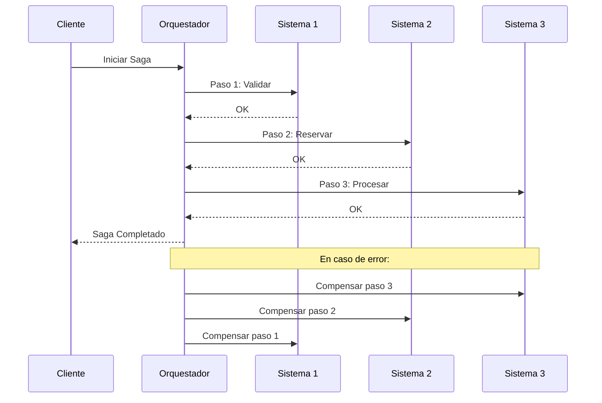
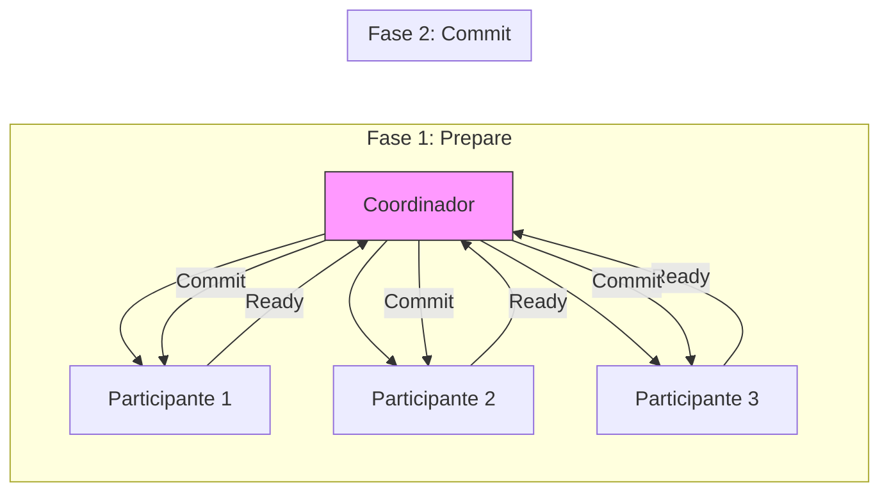

# Clase 8: Orquestación de Múltiples Sistemas

## Duración
4 horas (240 minutos)

## Objetivos de Aprendizaje
- Implementar el patrón Saga para transacciones distribuidas
- Diseñar lógica de compensación para rollback
- Gestionar transacciones distribuidas en agentes
- Implementar monitoreo de orquestación
- Integrar sistemas de orquestación como Camunda y Temporal

## Contenidos Detallados

### 8.1 Patrón Saga (75 minutos)

El patrón Saga es esencial para coordinar transacciones que abarcan múltiples sistemas. A diferencia de las transacciones ACID tradicionales, Saga divide una transacción grande en múltiples pasos locales, cada uno con su propia operación de compensación.

#### 8.1.1 Fundamentos del Patrón Saga

```python
from typing import List, Dict, Any, Callable, Optional
from dataclasses import dataclass, field
from datetime import datetime
from enum import Enum
import logging

logger = logging.getLogger(__name__)


class SagaState(Enum):
    PENDING = "pending"
    RUNNING = "running"
    COMPLETED = "completed"
    COMPENSATING = "compensating"
    FAILED = "failed"


class StepState(Enum):
    PENDING = "pending"
    EXECUTING = "executing"
    COMPLETED = "completed"
    FAILED = "failed"
    COMPENSATED = "compensated"


@dataclass
class SagaStep:
    """Un paso en el saga"""
    step_id: str
    name: str
    execute_fn: Callable
    compensate_fn: Callable
    timeout: int = 60
    retry_count: int = 3
    state: StepState = StepState.PENDING
    result: Any = None
    error: str = None
    started_at: datetime = None
    completed_at: datetime = None


@dataclass
class SagaExecution:
    """Ejecución de un saga"""
    saga_id: str
    name: str
    steps: List[SagaStep]
    state: SagaState = SagaState.PENDING
    created_at: datetime = field(default_factory=datetime.now)
    completed_at: datetime = None
    context: Dict = field(default_factory=dict)
    current_step_index: int = 0
    completed_steps: List[str] = field(default_factory=list)
    failed_step: str = None


class SagaOrchestrator:
    """Orquestador de sagas"""
    
    def __init__(self, name: str):
        self.name = name
        self.sagas: Dict[str, SagaExecution] = {}
    
    def create_saga(
        self,
        saga_id: str,
        steps: List[SagaStep]
    ) -> SagaExecution:
        """Crea una nueva ejecución de saga"""
        
        saga = SagaExecution(
            saga_id=saga_id,
            name=self.name,
            steps=steps
        )
        
        self.sagas[saga_id] = saga
        
        logger.info(f"Created saga {saga_id} with {len(steps)} steps")
        
        return saga
    
    async def execute(self, saga_id: str) -> SagaExecution:
        """Ejecuta un saga completo"""
        
        saga = self.sagas.get(saga_id)
        
        if not saga:
            raise ValueError(f"Saga {saga_id} not found")
        
        saga.state = SagaState.RUNNING
        
        try:
            # Ejecutar cada paso
            for i, step in enumerate(saga.steps):
                saga.current_step_index = i
                
                logger.info(f"Executing step {i + 1}: {step.name}")
                
                step.state = StepState.EXECUTING
                step.started_at = datetime.now()
                
                try:
                    # Ejecutar el paso
                    result = await self._execute_with_retry(step)
                    
                    step.result = result
                    step.state = StepState.COMPLETED
                    step.completed_at = datetime.now()
                    
                    saga.completed_steps.append(step.step_id)
                    
                    # Agregar resultado al contexto
                    saga.context[step.step_id] = result
                    
                except Exception as e:
                    step.error = str(e)
                    step.state = StepState.FAILED
                    saga.failed_step = step.step_id
                    
                    # Iniciar compensación
                    await self._compensate(saga)
                    
                    saga.state = SagaState.FAILED
                    raise SagaExecutionError(f"Step {step.name} failed: {e}")
            
            saga.state = SagaState.COMPLETED
            saga.completed_at = datetime.now()
            
            logger.info(f"Saga {saga_id} completed successfully")
            
            return saga
            
        except Exception as e:
            logger.error(f"Saga {saga_id} failed: {e}")
            raise
    
    async def _execute_with_retry(self, step: SagaStep) -> Any:
        """Ejecuta un paso con reintentos"""
        
        last_error = None
        
        for attempt in range(step.retry_count):
            try:
                if asyncio.iscoroutinefunction(step.execute_fn):
                    return await step.execute_fn()
                else:
                    return step.execute_fn()
                    
            except Exception as e:
                last_error = e
                logger.warning(f"Attempt {attempt + 1} failed: {e}")
                
                if attempt < step.retry_count - 1:
                    await asyncio.sleep(2 ** attempt)
        
        raise last_error
    
    async def _compensate(self, saga: SagaExecution):
        """Ejecuta la compensación del saga"""
        
        logger.info(f"Starting compensation for saga {saga.saga_id}")
        
        saga.state = SagaState.COMPENSATING
        
        # Compensar en orden inverso los pasos completados
        for step in reversed(saga.steps):
            if step.state == StepState.COMPLETED and step.compensate_fn:
                try:
                    logger.info(f"Compensating step: {step.name}")
                    
                    if asyncio.iscoroutinefunction(step.compensate_fn):
                        await step.compensate_fn(step.result)
                    else:
                        step.compensate_fn(step.result)
                    
                    step.state = StepState.COMPENSATED
                    
                except Exception as e:
                    logger.error(f"Compensation failed for {step.name}: {e}")
        
        logger.info(f"Compensation completed for saga {saga.saga_id}")
    
    def get_saga(self, saga_id: str) -> Optional[SagaExecution]:
        """Obtiene un saga"""
        return self.sagas.get(saga_id)
    
    def get_saga_status(self, saga_id: str) -> Dict:
        """Obtiene el estado de un saga"""
        
        saga = self.sagas.get(saga_id)
        
        if not saga:
            return {"error": "Saga not found"}
        
        return {
            "saga_id": saga.saga_id,
            "name": saga.name,
            "state": saga.state.value,
            "current_step": saga.current_step_index,
            "completed_steps": saga.completed_steps,
            "failed_step": saga.failed_step,
            "context": saga.context
        }
```

#### 8.1.2 Saga para Orden de Compra

```python
# Ejemplo: Saga para crear una orden de compra que involucra múltiples sistemas

class OrderSagaSteps:
    """Pasos para el saga de orden de compra"""
    
    @staticmethod
    def validate_order(inventory_adapter, order_data: Dict) -> Dict:
        """Paso 1: Validar disponibilidad"""
        
        for item in order_data["items"]:
            stock = inventory_adapter.get_stock(item["product_id"])
            
            if stock < item["quantity"]:
                raise Exception(f"Insufficient stock for {item['product_id']}")
        
        return {"validated": True, "items": order_data["items"]}
    
    @staticmethod
    def reserve_inventory(inventory_adapter, validation_result: Dict) -> Dict:
        """Paso 2: Reservar inventario"""
        
        reservations = []
        
        for item in validation_result["items"]:
            reservation_id = inventory_adapter.reserve(
                product_id=item["product_id"],
                quantity=item["quantity"]
            )
            reservations.append(reservation_id)
        
        return {"reservations": reservations}
    
    @staticmethod
    def create_order_record(erp_adapter, reservation_result: Dict) -> Dict:
        """Paso 3: Crear registro en ERP"""
        
        order_id = erp_adapter.create_order({
            "items": reservation_result["reservations"],
            "total": 1000.00
        })
        
        return {"order_id": order_id}
    
    @staticmethod
    def process_payment(payment_adapter, order_result: Dict) -> Dict:
        """Paso 4: Procesar pago"""
        
        payment = payment_adapter.charge(
            amount=1000.00,
            order_id=order_result["order_id"]
        )
        
        return {"payment_id": payment["id"], "status": payment["status"]}
    
    @staticmethod
    def send_confirmation(notification_adapter, payment_result: Dict) -> Dict:
        """Paso 5: Enviar confirmación"""
        
        notification_adapter.send_email(
            to="customer@example.com",
            template="order_confirmation",
            data=payment_result
        )
        
        return {"sent": True}


class CompensationSteps:
    """Pasos de compensación"""
    
    @staticmethod
    def release_inventory(inventory_adapter, reservation_result: Dict):
        """Compensar: Liberar inventario"""
        
        for reservation_id in reservation_result["reservations"]:
            inventory_adapter.release(reservation_id)
    
    @staticmethod
    def cancel_order(erp_adapter, order_result: Dict):
        """Compensar: Cancelar orden en ERP"""
        
        erp_adapter.cancel_order(order_result["order_id"])
    
    @staticmethod
    def refund_payment(payment_adapter, payment_result: Dict):
        """Compensar: Revertir pago"""
        
        payment_adapter.refund(payment_result["payment_id"])


def create_order_saga(
    orchestrator: SagaOrchestrator,
    order_data: Dict,
    adapters: Dict
) -> str:
    """Crea el saga de orden de compra"""
    
    saga_id = f"order_{datetime.now().timestamp()}"
    
    steps = [
        SagaStep(
            step_id="validate",
            name="Validate Order",
            execute_fn=lambda: OrderSagaSteps.validate_order(
                adapters["inventory"],
                order_data
            ),
            compensate_fn=lambda r: None
        ),
        SagaStep(
            step_id="reserve_inventory",
            name="Reserve Inventory",
            execute_fn=lambda: OrderSagaSteps.reserve_inventory(
                adapters["inventory"],
                None  # Usar contexto
            ),
            compensate_fn=lambda r: CompensationSteps.release_inventory(
                adapters["inventory"],
                r
            )
        ),
        SagaStep(
            step_id="create_order",
            name="Create Order in ERP",
            execute_fn=lambda: OrderSagaSteps.create_order_record(
                adapters["erp"],
                None
            ),
            compensate_fn=lambda r: CompensationSteps.cancel_order(
                adapters["erp"],
                r
            )
        ),
        SagaStep(
            step_id="process_payment",
            name="Process Payment",
            execute_fn=lambda: OrderSagaSteps.process_payment(
                adapters["payment"],
                None
            ),
            compensate_fn=lambda r: CompensationSteps.refund_payment(
                adapters["payment"],
                r
            )
        ),
        SagaStep(
            step_id="send_confirmation",
            name="Send Confirmation",
            execute_fn=lambda: OrderSagaSteps.send_confirmation(
                adapters["notification"],
                None
            ),
            compensate_fn=lambda r: None
        )
    ]
    
    orchestrator.create_saga(saga_id, steps)
    
    return saga_id
```

### 8.2 Compensation Logic (60 minutos)

#### 8.2.1 Implementación de Compensación

```python
from typing import List, Dict, Any, Callable
import asyncio


class CompensationManager:
    """Gestor de compensación para transacciones distribuidas"""
    
    def __init__(self):
        self.compensation_handlers: Dict[str, Callable] = {}
    
    def register_compensation(
        self,
        operation_id: str,
        compensation_fn: Callable
    ):
        """Registra una función de compensación"""
        
        self.compensation_handlers[operation_id] = compensation_fn
    
    async def compensate(
        self,
        completed_operations: List[Dict]
    ) -> Dict:
        """Ejecuta compensación para operaciones completadas"""
        
        results = {
            "compensated": [],
            "failed": [],
            "skipped": []
        }
        
        # Ejecutar en orden inverso
        for operation in reversed(completed_operations):
            operation_id = operation.get("operation_id")
            
            if operation_id not in self.compensation_handlers:
                results["skipped"].append(operation_id)
                continue
            
            try:
                compensation_fn = self.compensation_handlers[operation_id]
                
                if asyncio.iscoroutinefunction(compensation_fn):
                    await compensation_fn(operation.get("result"))
                else:
                    compensation_fn(operation.get("result"))
                
                results["compensated"].append(operation_id)
                
            except Exception as e:
                logger.error(f"Compensation failed for {operation_id}: {e}")
                results["failed"].append({
                    "operation_id": operation_id,
                    "error": str(e)
                })
        
        return results


class TransactionalAction:
    """Representa una acción transaccional"""
    
    def __init__(
        self,
        action_id: str,
        execute_fn: Callable,
        compensate_fn: Callable,
        timeout: int = 30
    ):
        self.action_id = action_id
        self.execute_fn = execute_fn
        self.compensate_fn = compensate_fn
        self.timeout = timeout
        self.executed = False
        self.compensated = False
        self.result = None
        self.error = None
    
    async def execute(self) -> bool:
        """Ejecuta la acción"""
        
        try:
            if asyncio.iscoroutinefunction(self.execute_fn):
                self.result = await asyncio.wait_for(
                    self.execute_fn(),
                    timeout=self.timeout
                )
            else:
                self.result = self.execute_fn()
            
            self.executed = True
            return True
            
        except Exception as e:
            self.error = str(e)
            return False
    
    async def compensate(self) -> bool:
        """Ejecuta la compensación"""
        
        if not self.executed or self.compensated:
            return True
        
        try:
            if asyncio.iscoroutinefunction(self.compensate_fn):
                await self.compensate_fn(self.result)
            else:
                self.compensate_fn(self.result)
            
            self.compensated = True
            return True
            
        except Exception as e:
            logger.error(f"Compensation failed for {self.action_id}: {e}")
            return False


class TransactionBuilder:
    """Constructor de transacciones compensables"""
    
    def __init__(self):
        self.actions: List[TransactionalAction] = []
        self.compensation_manager = CompensationManager()
    
    def add_action(
        self,
        action_id: str,
        execute_fn: Callable,
        compensate_fn: Callable,
        timeout: int = 30
    ) -> 'TransactionBuilder':
        """Agrega una acción a la transacción"""
        
        action = TransactionalAction(
            action_id=action_id,
            execute_fn=execute_fn,
            compensate_fn=compensate_fn,
            timeout=timeout
        )
        
        self.actions.append(action)
        
        # Registrar compensación
        self.compensation_manager.register_compensation(
            action_id,
            compensate_fn
        )
        
        return self
    
    async def execute(self) -> Dict:
        """Ejecuta todas las acciones"""
        
        executed_actions = []
        failed = False
        failed_action_id = None
        
        for action in self.actions:
            success = await action.execute()
            
            if not success:
                failed = True
                failed_action_id = action.action_id
                break
            
            executed_actions.append({
                "action_id": action.action_id,
                "result": action.result
            })
        
        # Si falló, compensar las acciones ejecutadas
        if failed:
            logger.info(f"Transaction failed at {failed_action_id}, compensating...")
            
            compensation_results = await self.compensation_manager.compensate(
                executed_actions
            )
            
            return {
                "success": False,
                "failed_at": failed_action_id,
                "compensation": compensation_results
            }
        
        return {
            "success": True,
            "results": [a.result for a in self.actions]
        }
```

### 8.3 Distributed Transactions (45 minutos)

```python
import asyncio
from typing import Dict, List, Optional
from dataclasses import dataclass
from datetime import datetime
import logging

logger = logging.getLogger(__name__)


@dataclass
class TransactionContext:
    """Contexto de transacción distribuida"""
    transaction_id: str
    started_at: datetime
    participants: List[str]
    status: str
    metadata: Dict


class DistributedTransactionManager:
    """Gestor de transacciones distribuidas"""
    
    def __init__(self):
        self.active_transactions: Dict[str, TransactionContext] = {}
        self.participants: Dict[str, Any] = {}
    
    def register_participant(self, name: str, participant: Any):
        """Registra un participante"""
        self.participants[name] = participant
    
    def begin_transaction(
        self,
        transaction_id: str,
        participants: List[str]
    ) -> TransactionContext:
        """Inicia una transacción distribuida"""
        
        context = TransactionContext(
            transaction_id=transaction_id,
            started_at=datetime.now(),
            participants=participants,
            status="active",
            metadata={}
        )
        
        self.active_transactions[transaction_id] = context
        
        # Notificar a participantes
        for participant_name in participants:
            if participant_name in self.participants:
                try:
                    self.participants[participant_name].begin_transaction(
                        transaction_id
                    )
                except Exception as e:
                    logger.warning(f"Failed to notify {participant_name}: {e}")
        
        logger.info(f"Started distributed transaction {transaction_id}")
        
        return context
    
    async def prepare_phase(self, transaction_id: str) -> Dict:
        """Fase de preparación (2PC)"""
        
        context = self.active_transactions.get(transaction_id)
        
        if not context:
            raise ValueError(f"Transaction {transaction_id} not found")
        
        results = {}
        
        for participant_name in context.participants:
            if participant_name in self.participants:
                try:
                    prepared = await self.participants[participant_name].prepare(
                        transaction_id
                    )
                    results[participant_name] = prepared
                except Exception as e:
                    logger.error(f"Prepare failed for {participant_name}: {e}")
                    results[participant_name] = False
        
        return results
    
    async def commit_phase(self, transaction_id: str) -> bool:
        """Fase de commit (2PC)"""
        
        context = self.active_transactions.get(transaction_id)
        
        if not context:
            return False
        
        success = True
        
        for participant_name in context.participants:
            if participant_name in self.participants:
                try:
                    await self.participants[participant_name].commit(
                        transaction_id
                    )
                except Exception as e:
                    logger.error(f"Commit failed for {participant_name}: {e}")
                    success = False
        
        if success:
            context.status = "committed"
            logger.info(f"Transaction {transaction_id} committed")
        else:
            context.status = "failed"
        
        return success
    
    async def rollback_phase(self, transaction_id: str) -> bool:
        """Fase de rollback (2PC)"""
        
        context = self.active_transactions.get(transaction_id)
        
        if not context:
            return False
        
        success = True
        
        # Rollback en orden inverso
        for participant_name in reversed(context.participants):
            if participant_name in self.participants:
                try:
                    await self.participants[participant_name].rollback(
                        transaction_id
                    )
                except Exception as e:
                    logger.error(f"Rollback failed for {participant_name}: {e}")
                    success = False
        
        context.status = "rolled_back"
        logger.info(f"Transaction {transaction_id} rolled back")
        
        return success
    
    async def execute_two_phase_commit(
        self,
        transaction_id: str,
        participants: List[str]
    ) -> Dict:
        """Ejecuta una transacción con 2PC"""
        
        # Iniciar
        self.begin_transaction(transaction_id, participants)
        
        # Fase de preparación
        prepare_results = await self.prepare_phase(transaction_id)
        
        # Verificar si todos prepararon
        if all(prepare_results.values()):
            # Commit
            commit_success = await self.commit_phase(transaction_id)
            
            return {
                "success": commit_success,
                "transaction_id": transaction_id
            }
        else:
            # Rollback
            await self.rollback_phase(transaction_id)
            
            return {
                "success": False,
                "transaction_id": transaction_id,
                "failed_participants": [
                    p for p, result in prepare_results.items() if not result
                ]
            }


class TwoPhaseCommitParticipant:
    """Participante que implementa 2PC"""
    
    def __init__(self, name: str):
        self.name = name
        self.pending_transactions: Dict[str, Dict] = {}
    
    def begin_transaction(self, transaction_id: str):
        """Inicia la transacción"""
        self.pending_transactions[transaction_id] = {
            "status": "prepared",
            "operations": []
        }
    
    async def prepare(self, transaction_id: str) -> bool:
        """Fase de preparación"""
        # Simular preparación
        logger.info(f"Participant {self.name} preparing transaction {transaction_id}")
        
        # Lógica de preparación
        self.pending_transactions[transaction_id]["status"] = "prepared"
        
        return True
    
    async def commit(self, transaction_id: str):
        """Fase de commit"""
        logger.info(f"Participant {self.name} committing transaction {transaction_id}")
        
        # Limpiar estado
        if transaction_id in self.pending_transactions:
            del self.pending_transactions[transaction_id]
    
    async def rollback(self, transaction_id: str):
        """Fase de rollback"""
        logger.info(f"Participant {self.name} rolling back transaction {transaction_id}")
        
        # Limpiar estado
        if transaction_id in self.pending_transactions:
            del self.pending_transactions[transaction_id]
```

### 8.4 Integración con Camunda/Temporal (40 minutos)

```python
# Integración con sistemas de orquestación externos

import requests
from typing import Dict, List, Optional


class CamundaClient:
    """Cliente para Camunda workflow engine"""
    
    def __init__(self, base_url: str):
        self.base_url = base_url.rstrip("/")
    
    def start_process(
        self,
        process_key: str,
        variables: Dict
    ) -> str:
        """Inicia un proceso"""
        
        response = requests.post(
            f"{self.base_url}/engine/rest/process-definition/key/{process_key}/start",
            json={"variables": variables}
        )
        
        response.raise_for_status()
        
        result = response.json()
        return result["id"]
    
    def get_process_instance(self, instance_id: str) -> Dict:
        """Obtiene una instancia de proceso"""
        
        response = requests.get(
            f"{self.base_url}/engine/rest/process-instance/{instance_id}"
        )
        
        response.raise_for_status()
        return response.json()
    
    def get_tasks(self, process_instance_id: str) -> List[Dict]:
        """Obtiene tareas de una instancia"""
        
        response = requests.get(
            f"{self.base_url}/engine/rest/task",
            params={"processInstanceId": process_instance_id}
        )
        
        response.raise_for_status()
        return response.json()
    
    def complete_task(self, task_id: str, variables: Dict):
        """Completa una tarea"""
        
        response = requests.post(
            f"{self.base_url}/engine/rest/task/{task_id}/complete",
            json={"variables": variables}
        )
        
        response.raise_for_status()


class TemporalClient:
    """Cliente para Temporal workflow engine"""
    
    def __init__(self, host: str, namespace: str = "default"):
        self.host = host
        self.namespace = namespace
        # En producción usar client de Temporal SDK
    
    def start_workflow(
        self,
        workflow_type: str,
        task_queue: str,
        input_data: Dict
    ) -> str:
        """Inicia un workflow"""
        
        # En implementación real:
        # client = Client()
        # handle = client.start_workflow(
        #     workflow_type,
        #     input_data,
        #     id=str(uuid.uuid4()),
        #     task_queue=task_queue
        # )
        # return handle.id
        
        return f"workflow-{workflow_type}-{datetime.now().timestamp()}"
    
    def get_workflow_status(self, workflow_id: str) -> str:
        """Obtiene el estado de un workflow"""
        
        # Implementación real consultaría el historial
        return "RUNNING"
    
    def signal_workflow(self, workflow_id: str, signal_name: str, input_data: Dict):
        """Envía señal a un workflow"""
        pass
    
    async def cancel_workflow(self, workflow_id: str):
        """Cancela un workflow"""
        pass


class OrchestrationIntegration:
    """Integración con sistemas de orquestación"""
    
    def __init__(self):
        self.camunda: Optional[CamundaClient] = None
        self.temporal: Optional[TemporalClient] = None
    
    def configure_camunda(self, base_url: str):
        """Configura Camunda"""
        self.camunda = CamundaClient(base_url)
    
    def configure_temporal(self, host: str, namespace: str = "default"):
        """Configura Temporal"""
        self.temporal = TemporalClient(host, namespace)
    
    async def execute_order_workflow(
        self,
        order_data: Dict
    ) -> str:
        """Ejecuta un workflow de orden"""
        
        if self.temporal:
            workflow_id = self.temporal.start_workflow(
                workflow_type="order_processing",
                task_queue="orders",
                input_data=order_data
            )
            return workflow_id
        else:
            # Fallback a implementación propia
            return "local-workflow-id"
    
    async def execute_approval_workflow(
        self,
        approval_data: Dict
    ) -> str:
        """Ejecuta un workflow de aprobación"""
        
        if self.camunda:
            return self.camunda.start_process(
                "approval_process",
                approval_data
            )
        
        return "local-workflow-id"
```

## Diagramas

### Diagrama 1: Patrón Saga



### Diagrama 2: Two-Phase Commit



## Referencias Externas

1. **Saga Pattern**: https://microservices.io/patterns/data/saga.html
2. **Camunda Documentation**: https://camunda.com/docs/
3. **Temporal Documentation**: https://docs.temporal.io/
4. **Two-Phase Commit**: https://en.wikipedia.org/wiki/Two-phase_commit

## Ejercicios Prácticos Resueltos

### Ejemplo: Saga de Onboarding de Cliente

```python
"""
Ejemplo: Saga de Onboarding de Cliente
"""

from dataclasses import dataclass
from typing import Dict, List, Callable
import asyncio


@dataclass
class CustomerOnboardingData:
    """Datos para onboarding de cliente"""
    name: str
    email: str
    phone: str
    company: str
    plan: str


class CustomerOnboardingSaga:
    """Saga para onboarding de cliente"""
    
    def __init__(self):
        self.steps = []
    
    def add_step(
        self,
        name: str,
        execute_fn: Callable,
        compensate_fn: Callable
    ) -> 'CustomerOnboardingSaga':
        """Agrega un paso"""
        self.steps.append({
            "name": name,
            "execute": execute_fn,
            "compensate": compensate_fn
        })
        return self
    
    async def execute(self, data: CustomerOnboardingData) -> Dict:
        """Ejecuta el saga"""
        
        completed = []
        context = {}
        
        for step in self.steps:
            try:
                print(f"Executing: {step['name']}")
                
                if asyncio.iscoroutinefunction(step['execute']):
                    result = await step['execute'](data, context)
                else:
                    result = step['execute'](data, context)
                
                context[step['name']] = result
                completed.append(step)
                
            except Exception as e:
                print(f"Failed: {step['name']} - {e}")
                print("Compensating...")
                
                for completed_step in reversed(completed):
                    try:
                        if asyncio.iscoroutinefunction(completed_step['compensate']):
                            await completed_step['compensate'](context[completed_step['name']])
                        else:
                            completed_step['compensate'](context[completed_step['name']])
                    except Exception as ce:
                        print(f"Compensation failed: {ce}")
                
                return {"success": False, "failed_at": step['name']}
        
        return {"success": True, "context": context}


# Pasos del saga
def create_crm_record(data: CustomerOnboardingData, context: Dict) -> Dict:
    """1. Crear registro en CRM"""
    return {"crm_id": "CRM-12345"}


def create_billing_account(data: CustomerOnboardingData, context: Dict) -> Dict:
    """2. Crear cuenta de facturación"""
    return {"billing_id": "BILL-67890"}


def provision_services(data: CustomerOnboardingData, context: Dict) -> Dict:
    """3. Provisionar servicios"""
    return {"services": ["email", "storage", "crm"]}


def send_welcome_email(data: CustomerOnboardingData, context: Dict) -> Dict:
    """4. Enviar email de bienvenida"""
    return {"email_sent": True}


# Compensaciones
def rollback_crm(crm_result: Dict):
    """Compensar CRM"""
    print("Rolling back CRM record")


def rollback_billing(billing_result: Dict):
    """Compensar billing"""
    print("Rolling back billing account")


def rollback_services(services_result: Dict):
    """Compensar servicios"""
    print("Rolling back services provisioning")


def rollback_email(email_result: Dict):
    """Compensar email"""
    print("Nothing to rollback for email")


# Ejecutar
async def main():
    print("=" * 60)
    print("EJEMPLO: SAGA DE ONBOARDING")
    print("=" * 60)
    
    # Crear saga
    saga = (CustomerOnboardingSaga()
        .add_step("create_crm", create_crm_record, rollback_crm)
        .add_step("create_billing", create_billing_account, rollback_billing)
        .add_step("provision_services", provision_services, rollback_services)
        .add_step("send_welcome", send_welcome_email, rollback_email))
    
    # Datos de onboarding
    data = CustomerOnboardingData(
        name="John Doe",
        email="john@example.com",
        phone="+1234567890",
        company="Acme Corp",
        plan="enterprise"
    )
    
    # Ejecutar
    result = await saga.execute(data)
    
    print("\n" + "=" * 60)
    print(f"Resultado: {'ÉXITO' if result['success'] else 'FALLIDO'}")
    print("=" * 60)


if __name__ == "__main__":
    asyncio.run(main())
```

## Resumen de Puntos Clave

1. **Patrón Saga**: Coordina transacciones distribuidas en pasos con compensación.

2. **Two-Phase Commit**: Protocolo para commit distribuido con fase de preparación.

3. **Compensación**: Deshace operaciones cuando falla un paso posterior.

4. **Orquestadores**: Camunda y Temporal simplifican la implementación.

5. **Reversibilidad**: Cada paso debe tener una operación de compensación.

6. **Orden de compensación**: Inverso al orden de ejecución.

7. **Timeout**: Manejo de timeouts para pasos largos.

8. **Retry**: Reintentos para errores transitorios.

9. **Idempotencia**: Las operaciones deben ser idempotentes.

10. **Monitoreo**: Seguimiento del estado de cada transacción.