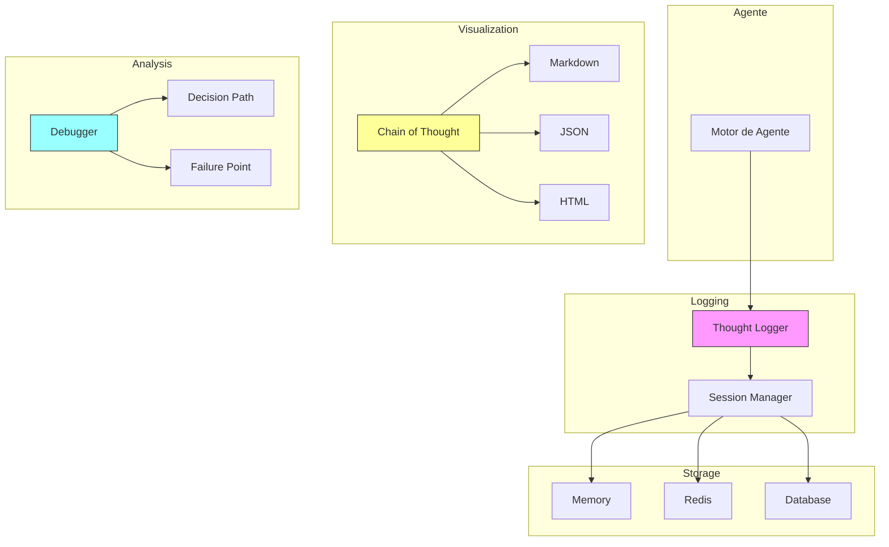

# Clase 10: Tracing de Pensamientos de Agentes

## Duración
4 horas (240 minutos)

## Objetivos de Aprendizaje
- Implementar logging de pensamientos (thought logging)
- Visualizar chain of thought de agentes
- Debuggear decisiones de agentes
- Crear audit trails completos
- Integrar con LangSmith y sistemas de observabilidad

## Contenidos Detallados

### 10.1 Thought Logging (75 minutos)

El thought logging es fundamental para entender cómo los agentes toman decisiones. Cada "pensamiento" del agente debe ser registrado para debugging y auditoría.

```python
import json
import logging
from datetime import datetime
from typing import Dict, List, Any, Optional
from dataclasses import dataclass, field
from enum import Enum
import uuid

logger = logging.getLogger(__name__)


class ThoughtType(Enum):
    REASONING = "reasoning"
    ACTION = "action"
    OBSERVATION = "observation"
    DECISION = "decision"
    TOOL_CALL = "tool_call"
    TOOL_RESULT = "tool_result"
    RESPONSE = "response"
    ERROR = "error"


@dataclass
class Thought:
    """Representa un pensamiento del agente"""
    thought_id: str
    session_id: str
    agent_id: str
    type: ThoughtType
    content: str
    timestamp: datetime
    parent_thought_id: Optional[str] = None
    metadata: Dict = field(default_factory=dict)
    depth: int = 0


class ThoughtLogger:
    """Logger de pensamientos del agente"""
    
    def __init__(self, storage_backend=None):
        self.storage = storage_backend
        self.current_session_thoughts: List[Thought] = []
        self.session_context: Dict = {}
    
    def start_session(self, session_id: str, agent_id: str, context: Dict = None):
        """Inicia una sesión de logging"""
        
        self.current_session_thoughts = []
        self.session_context = context or {}
        
        self._log_thought(
            session_id=session_id,
            agent_id=agent_id,
            type=ThoughtType.REASONING,
            content="Session started",
            metadata=self.session_context
        )
    
    def log_reasoning(
        self,
        session_id: str,
        agent_id: str,
        content: str,
        metadata: Dict = None
    ):
        """Registra un pensamiento de razonamiento"""
        
        self._log_thought(
            session_id=session_id,
            agent_id=agent_id,
            type=ThoughtType.REASONING,
            content=content,
            metadata=metadata
        )
    
    def log_decision(
        self,
        session_id: str,
        agent_id: str,
        decision: str,
        reasoning: str,
        metadata: Dict = None
    ):
        """Registra una decisión"""
        
        self._log_thought(
            session_id=session_id,
            agent_id=agent_id,
            type=ThoughtType.DECISION,
            content=f"Decision: {decision}. Reasoning: {reasoning}",
            metadata=metadata
        )
    
    def log_tool_call(
        self,
        session_id: str,
        agent_id: str,
        tool_name: str,
        parameters: Dict,
        metadata: Dict = None
    ):
        """Registra una llamada a herramienta"""
        
        self._log_thought(
            session_id=session_id,
            agent_id=agent_id,
            type=ThoughtType.TOOL_CALL,
            content=f"Calling tool: {tool_name}",
            metadata={
                "tool_name": tool_name,
                "parameters": parameters,
                **(metadata or {})
            }
        )
    
    def log_tool_result(
        self,
        session_id: str,
        agent_id: str,
        tool_name: str,
        result: Any,
        success: bool,
        metadata: Dict = None
    ):
        """Registra el resultado de una herramienta"""
        
        self._log_thought(
            session_id=session_id,
            agent_id=agent_id,
            type=ThoughtType.TOOL_RESULT,
            content=f"Tool {tool_name} result: {str(result)[:200]}",
            metadata={
                "tool_name": tool_name,
                "success": success,
                **(metadata or {})
            }
        )
    
    def log_action(
        self,
        session_id: str,
        agent_id: str,
        action: str,
        target: str,
        metadata: Dict = None
    ):
        """Registra una acción del agente"""
        
        self._log_thought(
            session_id=session_id,
            agent_id=agent_id,
            type=ThoughtType.ACTION,
            content=f"Action: {action} on {target}",
            metadata=metadata
        )
    
    def log_observation(
        self,
        session_id: str,
        agent_id: str,
        observation: str,
        metadata: Dict = None
    ):
        """Registra una observación del agente"""
        
        self._log_thought(
            session_id=session_id,
            agent_id=agent_id,
            type=ThoughtType.OBSERVATION,
            content=f"Observation: {observation}",
            metadata=metadata
        )
    
    def log_response(
        self,
        session_id: str,
        agent_id: str,
        response: str,
        metadata: Dict = None
    ):
        """Registra la respuesta del agente"""
        
        self._log_thought(
            session_id=session_id,
            agent_id=agent_id,
            type=ThoughtType.RESPONSE,
            content=f"Response: {response[:500]}",
            metadata=metadata
        )
    
    def log_error(
        self,
        session_id: str,
        agent_id: str,
        error: str,
        context: Dict = None
    ):
        """Registra un error"""
        
        self._log_thought(
            session_id=session_id,
            agent_id=agent_id,
            type=ThoughtType.ERROR,
            content=f"Error: {error}",
            metadata=context or {}
        )
    
    def _log_thought(
        self,
        session_id: str,
        agent_id: str,
        type: ThoughtType,
        content: str,
        metadata: Dict = None
    ):
        """Método interno para registrar pensamientos"""
        
        # Calcular profundidad
        depth = self._calculate_depth(type)
        
        thought = Thought(
            thought_id=str(uuid.uuid4()),
            session_id=session_id,
            agent_id=agent_id,
            type=type,
            content=content,
            timestamp=datetime.now(),
            metadata=metadata or {},
            depth=depth
        )
        
        # Agregar a la sesión actual
        self.current_session_thoughts.append(thought)
        
        # Persistir si hay storage configurado
        if self.storage:
            self.storage.save_thought(thought)
        
        # Loguear según tipo
        log_method = {
            ThoughtType.REASONING: logger.debug,
            ThoughtType.DECISION: logger.info,
            ThoughtType.ACTION: logger.info,
            ThoughtType.TOOL_CALL: logger.debug,
            ThoughtType.TOOL_RESULT: logger.debug,
            ThoughtType.RESPONSE: logger.info,
            ThoughtType.ERROR: logger.error
        }
        
        log_method.get(type, logger.debug)(
            f"[{type.value}] {content[:200]}"
        )
    
    def _calculate_depth(self, thought_type: ThoughtType) -> int:
        """Calcula la profundidad del pensamiento"""
        
        depth_map = {
            ThoughtType.REASONING: 0,
            ThoughtType.DECISION: 1,
            ThoughtType.ACTION: 2,
            ThoughtType.TOOL_CALL: 2,
            ThoughtType.TOOL_RESULT: 3,
            ThoughtType.OBSERVATION: 1,
            ThoughtType.RESPONSE: 4,
            ThoughtType.ERROR: 0
        }
        
        return depth_map.get(thought_type, 0)
    
    def get_session_thoughts(self, session_id: str) -> List[Thought]:
        """Obtiene todos los pensamientos de una sesión"""
        
        return [t for t in self.current_session_thoughts if t.session_id == session_id]
    
    def get_thought_chain(self, session_id: str) -> List[Thought]:
        """Obtiene la cadena de pensamientos formateada"""
        
        thoughts = self.get_session_thoughts(session_id)
        
        # Ordenar por timestamp
        return sorted(thoughts, key=lambda t: t.timestamp)


class ThoughtStorage:
    """Backend de almacenamiento para pensamientos"""
    
    def __init__(self, storage_type: str = "memory"):
        self.storage_type = storage_type
        self.thoughts: Dict[str, List[Thought]] = {}
    
    def save_thought(self, thought: Thought):
        """Guarda un pensamiento"""
        
        if thought.session_id not in self.thoughts:
            self.thoughts[thought.session_id] = []
        
        self.thoughts[thought.session_id].append(thought)
    
    def get_thoughts(self, session_id: str) -> List[Thought]:
        """Obtiene pensamientos de una sesión"""
        return self.thoughts.get(session_id, [])
    
    def get_thoughts_by_type(self, session_id: str, thought_type: ThoughtType) -> List[Thought]:
        """Obtiene pensamientos de un tipo específico"""
        
        thoughts = self.thoughts.get(session_id, [])
        return [t for t in thoughts if t.type == thought_type]


class RedisThoughtStorage(ThoughtStorage):
    """Almacenamiento de pensamientos en Redis"""
    
    def __init__(self, redis_client):
        super().__init__("redis")
        self.redis = redis_client
    
    def save_thought(self, thought: Thought):
        """Guarda pensamiento en Redis"""
        
        key = f"thoughts:{thought.session_id}"
        
        thought_data = {
            "thought_id": thought.thought_id,
            "session_id": thought.session_id,
            "agent_id": thought.agent_id,
            "type": thought.type.value,
            "content": thought.content,
            "timestamp": thought.timestamp.isoformat(),
            "metadata": json.dumps(thought.metadata),
            "depth": thought.depth
        }
        
        self.redis.rpush(key, json.dumps(thought_data))
        self.redis.expire(key, 86400)  # 24 horas
    
    def get_thoughts(self, session_id: str) -> List[Thought]:
        """Obtiene pensamientos de Redis"""
        
        key = f"thoughts:{session_id}"
        thought_data = self.redis.lrange(key, 0, -1)
        
        thoughts = []
        
        for data in thought_data:
            t = json.loads(data)
            thoughts.append(Thought(
                thought_id=t["thought_id"],
                session_id=t["session_id"],
                agent_id=t["agent_id"],
                type=ThoughtType(t["type"]),
                content=t["content"],
                timestamp=datetime.fromisoformat(t["timestamp"]),
                metadata=json.loads(t["metadata"]),
                depth=t["depth"]
            ))
        
        return thoughts
```

### 10.2 Chain of Thought Visualization (60 minutos)

```python
from typing import List, Dict
import json


class ChainOfThoughtVisualizer:
    """Visualizador de cadena de pensamientos"""
    
    def __init__(self, thought_logger: ThoughtLogger):
        self.thought_logger = thought_logger
    
    def generate_tree(self, session_id: str) -> Dict:
        """Genera un árbol de pensamientos"""
        
        thoughts = self.thought_logger.get_thought_chain(session_id)
        
        root = None
        nodes = {}
        
        for thought in thoughts:
            node = {
                "id": thought.thought_id,
                "type": thought.type.value,
                "content": thought.content,
                "timestamp": thought.timestamp.isoformat(),
                "depth": thought.depth,
                "children": []
            }
            
            nodes[thought.thought_id] = node
            
            # Encontrar padre (el pensamiento anterior del nivel anterior)
            if thought.depth == 0:
                if root is None:
                    root = node
            else:
                # Buscar padre en nodos anteriores
                for prev_thought in reversed(thoughts):
                    if prev_thought.thought_id in nodes:
                        if nodes[prev_thought.thought_id]["depth"] < thought.depth:
                            nodes[prev_thought.thought_id]["children"].append(node)
                            break
        
        return {"root": root, "total_thoughts": len(thoughts)}
    
    def generate_markdown(self, session_id: str) -> str:
        """Genera representación en markdown"""
        
        thoughts = self.thought_logger.get_thought_chain(session_id)
        
        lines = ["# Chain of Thought\n"]
        
        indent_symbol = "  "
        
        for thought in thoughts:
            # Símbolo según tipo
            symbols = {
                ThoughtType.REASONING: "🔍",
                ThoughtType.DECISION: "🎯",
                ThoughtType.ACTION: "⚡",
                ThoughtType.TOOL_CALL: "🔧",
                ThoughtType.TOOL_RESULT: "📥",
                ThoughtType.OBSERVATION: "👁️",
                ThoughtType.RESPONSE: "💬",
                ThoughtType.ERROR: "❌"
            }
            
            symbol = symbols.get(thought.type, "•")
            
            indent = indent_symbol * thought.depth
            
            lines.append(f"{indent}{symbol} **{thought.type.value}**: {thought.content[:200]}")
            
            # Agregar metadata si existe
            if thought.metadata:
                for key, value in list(thought.metadata.items())[:3]:
                    lines.append(f"{indent}  - {key}: {str(value)[:100]}")
        
        return "\n".join(lines)
    
    def generate_json_trace(self, session_id: str) -> Dict:
        """Genera trace en formato JSON"""
        
        thoughts = self.thought_logger.get_thought_chain(session_id)
        
        return {
            "session_id": session_id,
            "total_steps": len(thoughts),
            "trace": [
                {
                    "step": i,
                    "type": t.type.value,
                    "content": t.content,
                    "timestamp": t.timestamp.isoformat(),
                    "depth": t.depth,
                    "metadata": t.metadata
                }
                for i, t in enumerate(thoughts)
            ]
        }
    
    def generate_html(self, session_id: str) -> str:
        """Genera representación HTML"""
        
        thoughts = self.thought_logger.get_thought_chain(session_id)
        
        html_parts = [
            "<html>",
            "<head><style>",
            "body { font-family: Arial, sans-serif; margin: 20px; }",
            ".thought { margin: 10px 0; padding: 10px; border-radius: 5px; }",
            ".reasoning { background: #e3f2fd; }",
            ".decision { background: #fff3e0; }",
            ".action { background: #e8f5e9; }",
            ".tool_call { background: #f3e5f5; }",
            ".tool_result { background: #fce4ec; }",
            ".error { background: #ffebee; }",
            ".response { background: #fffde7; }",
            ".depth-0 { margin-left: 0px; }",
            ".depth-1 { margin-left: 20px; }",
            ".depth-2 { margin-left: 40px; }",
            ".depth-3 { margin-left: 60px; }",
            ".depth-4 { margin-left: 80px; }",
            "</style></head>",
            "<body>",
            f"<h1>Chain of Thought - Session {session_id}</h1>"
        ]
        
        for thought in thoughts:
            css_class = f"thought {thought.type.value} depth-{thought.depth}"
            
            html_parts.append(f'<div class="{css_class}">')
            html_parts.append(f'<strong>{thought.type.value.upper()}</strong>')
            html_parts.append(f'<p>{thought.content}</p>')
            
            if thought.metadata:
                html_parts.append('<small>')
                for k, v in thought.metadata.items():
                    html_parts.append(f'{k}: {str(v)[:50]}<br>')
                html_parts.append('</small>')
            
            html_parts.append('</div>')
        
        html_parts.append("</body></html>")
        
        return "\n".join(html_parts)
```

### 10.3 Debugging de Decisiones (60 minutos)

```python
import traceback
from typing import Dict, List, Any
from datetime import datetime


class AgentDebugger:
    """Debugger para agentes"""
    
    def __init__(self, thought_logger: ThoughtLogger):
        self.thought_logger = thought_logger
        self.breakpoints: Dict[str, bool] = {}
    
    def set_breakpoint(self, condition: str, enabled: bool = True):
        """Establece un breakpoint"""
        self.breakpoints[condition] = enabled
    
    def check_breakpoint(self, condition: str, context: Dict) -> bool:
        """Verifica si un breakpoint debe activarse"""
        
        if condition not in self.breakpoints:
            return False
        
        if not self.breakpoints[condition]:
            return False
        
        # Evaluar condición
        # (simplificado - en producción usar evaluación segura)
        try:
            return eval(condition, {"context": context})
        except:
            return False
    
    def analyze_decision_path(
        self,
        session_id: str,
        decision_id: str
    ) -> Dict:
        """Analiza el camino de decisiones"""
        
        thoughts = self.thought_logger.get_thought_chain(session_id)
        
        # Encontrar la decisión
        decision_thought = None
        for thought in thoughts:
            if thought.thought_id == decision_id:
                decision_thought = thought
                break
        
        if not decision_thought:
            return {"error": "Decision not found"}
        
        # Recolectar camino
        path = []
        for thought in thoughts:
            if thought.timestamp <= decision_thought.timestamp:
                path.append(thought)
        
        return {
            "decision": decision_thought.content,
            "path_length": len(path),
            "reasoning_steps": [t for t in path if t.type == ThoughtType.REASONING],
            "decisions_made": [t for t in path if t.type == ThoughtType.DECISION],
            "tools_used": [t for t in path if t.type == ThoughtType.TOOL_CALL]
        }
    
    def find_failure_point(
        self,
        session_id: str
    ) -> Dict:
        """Encuentra el punto de fallo"""
        
        thoughts = self.thought_logger.get_thought_chain(session_id)
        
        # Buscar pensamientos de error
        errors = [t for t in thoughts if t.type == ThoughtType.ERROR]
        
        if not errors:
            return {"failure_point": None, "analysis": "No errors found"}
        
        # El primer error es probablemente el punto de fallo
        first_error = errors[0]
        
        # Encontrar el contexto antes del error
        context_before = []
        for thought in thoughts:
            if thought.timestamp < first_error.timestamp:
                context_before.append(thought)
        
        return {
            "failure_point": first_error.thought_id,
            "error_message": first_error.content,
            "error_metadata": first_error.metadata,
            "context_before": context_before[-5:],
            "timestamp": first_error.timestamp.isoformat()
        }
    
    def explain_decision(
        self,
        session_id: str,
        decision_thought_id: str
    ) -> str:
        """Explica una decisión"""
        
        analysis = self.analyze_decision_path(session_id, decision_thought_id)
        
        if "error" in analysis:
            return analysis["error"]
        
        explanation = ["## Decision Explanation\n"]
        
        # Decisión
        explanation.append(f"**Decision**: {analysis['decision']}")
        explanation.append("")
        
        # Razonamiento
        explanation.append("### Reasoning Steps:")
        for i, step in enumerate(analysis["reasoning_steps"], 1):
            explanation.append(f"{i}. {step.content}")
        explanation.append("")
        
        # Decisiones anteriores
        if analysis["decisions_made"]:
            explanation.append("### Previous Decisions:")
            for d in analysis["decisions_made"]:
                explanation.append(f"- {d.content}")
            explanation.append("")
        
        # Herramientas
        if analysis["tools_used"]:
            explanation.append("### Tools Used:")
            for t in analysis["tools_used"]:
                tool_name = t.metadata.get("tool_name", "unknown")
                explanation.append(f"- {tool_name}")
        
        return "\n".join(explanation)


class DecisionTreeAnalyzer:
    """Analizador de árbol de decisiones"""
    
    def __init__(self):
        pass
    
    def build_decision_tree(
        self,
        thoughts: List[Thought]
    ) -> Dict:
        """Construye un árbol de decisiones"""
        
        decisions = [t for t in thoughts if t.type == ThoughtType.DECISION]
        
        if not decisions:
            return {"tree": None, "total_decisions": 0}
        
        # Construir árbol
        root = {
            "decision": decisions[0].content,
            "timestamp": decisions[0].timestamp.isoformat(),
            "children": []
        }
        
        # Agregar hijos
        for decision in decisions[1:]:
            node = {
                "decision": decision.content,
                "timestamp": decision.timestamp.isoformat(),
                "children": []
            }
            root["children"].append(node)
        
        return {
            "tree": root,
            "total_decisions": len(decisions),
            "depth": self._calculate_depth(root)
        }
    
    def _calculate_depth(self, node: Dict) -> int:
        """Calcula la profundidad del árbol"""
        
        if not node.get("children"):
            return 1
        
        return 1 + max(
            self._calculate_depth(child)
            for child in node["children"]
        )
    
    def analyze_branch(
        self,
        thoughts: List[Thought],
        branch_id: str
    ) -> Dict:
        """Analiza una rama específica"""
        
        # Filtrar pensamientos de la rama
        branch_thoughts = [
            t for t in thoughts
            if t.metadata.get("branch_id") == branch_id
        ]
        
        return {
            "branch_id": branch_id,
            "thought_count": len(branch_thoughts),
            "decisions": len([t for t in branch_thoughts if t.type == ThoughtType.DECISION]),
            "errors": len([t for t in branch_thoughts if t.type == ThoughtType.ERROR]),
            "successful": all(t.type != ThoughtType.ERROR for t in branch_thoughts)
        }
```

### 10.4 Audit Trails (45 minutos)

```python
from datetime import datetime, timedelta
from typing import Dict, List
import json


class AuditTrail:
    """Sistema de audit trail para agentes"""
    
    def __init__(self, storage_backend=None):
        self.storage = storage_backend or {}
        self.events: List[Dict] = []
    
    def log_event(
        self,
        event_type: str,
        session_id: str,
        user_id: str,
        agent_id: str,
        action: str,
        details: Dict = None
    ):
        """Registra un evento de auditoría"""
        
        event = {
            "event_id": str(uuid.uuid4()),
            "event_type": event_type,
            "session_id": session_id,
            "user_id": user_id,
            "agent_id": agent_id,
            "action": action,
            "details": details or {},
            "timestamp": datetime.now().isoformat(),
            "ip_address": None,  # Could be added
            "user_agent": None
        }
        
        self.events.append(event)
        
        # Persistir si hay storage
        if self.storage:
            key = f"audit:{session_id}"
            if key not in self.storage:
                self.storage[key] = []
            self.storage[key].append(event)
        
        logger.info(f"AUDIT: {event_type} - {action}")
    
    def get_session_audit(self, session_id: str) -> List[Dict]:
        """Obtiene el audit trail de una sesión"""
        
        if self.storage and session_id in self.storage:
            return self.storage[session_id]
        
        return [e for e in self.events if e["session_id"] == session_id]
    
    def get_user_audit(
        self,
        user_id: str,
        start_date: datetime = None,
        end_date: datetime = None
    ) -> List[Dict]:
        """Obtiene el audit trail de un usuario"""
        
        events = [e for e in self.events if e["user_id"] == user_id]
        
        if start_date:
            events = [
                e for e in events
                if datetime.fromisoformat(e["timestamp"]) >= start_date
            ]
        
        if end_date:
            events = [
                e for e in events
                if datetime.fromisoformat(e["timestamp"]) <= end_date
            ]
        
        return events
    
    def generate_audit_report(
        self,
        session_id: str
    ) -> Dict:
        """Genera reporte de auditoría"""
        
        events = self.get_session_audit(session_id)
        
        return {
            "session_id": session_id,
            "total_events": len(events),
            "event_types": self._count_by_type(events),
            "time_range": self._get_time_range(events),
            "actions": list(set(e["action"] for e in events)),
            "user_id": events[0]["user_id"] if events else None,
            "events": events
        }
    
    def _count_by_type(self, events: List[Dict]) -> Dict:
        """Cuenta eventos por tipo"""
        
        counts = {}
        
        for event in events:
            event_type = event["event_type"]
            counts[event_type] = counts.get(event_type, 0) + 1
        
        return counts
    
    def _get_time_range(self, events: List[Dict]) -> Dict:
        """Obtiene el rango de tiempo"""
        
        if not events:
            return {"start": None, "end": None}
        
        timestamps = [datetime.fromisoformat(e["timestamp"]) for e in events]
        
        return {
            "start": min(timestamps).isoformat(),
            "end": max(timestamps).isoformat(),
            "duration_seconds": (max(timestamps) - min(timestamps)).total_seconds()
        }


class ComplianceLogger:
    """Logger para cumplimiento normativo"""
    
    def __init__(self):
        self.compliance_events: List[Dict] = []
    
    def log_data_access(
        self,
        user_id: str,
        resource_type: str,
        resource_id: str,
        action: str,
        authorized: bool
    ):
        """Registra acceso a datos"""
        
        self.compliance_events.append({
            "event": "data_access",
            "user_id": user_id,
            "resource_type": resource_type,
            "resource_id": resource_id,
            "action": action,
            "authorized": authorized,
            "timestamp": datetime.now().isoformat(),
            "compliance_rule": self._get_applicable_rule(resource_type)
        })
    
    def log_pii_access(
        self,
        user_id: str,
        pii_type: str,
        session_id: str
    ):
        """Registra acceso a PII"""
        
        self.compliance_events.append({
            "event": "pii_access",
            "user_id": user_id,
            "pii_type": pii_type,
            "session_id": session_id,
            "timestamp": datetime.now().isoformat(),
            "gdpr_relevant": True
        })
    
    def log_decision(
        self,
        session_id: str,
        decision_type: str,
        outcome: str,
        rationale: str
    ):
        """Registra decisión automatizada"""
        
        self.compliance_events.append({
            "event": "automated_decision",
            "session_id": session_id,
            "decision_type": decision_type,
            "outcome": outcome,
            "rationale": rationale,
            "timestamp": datetime.now().isoformat(),
            "human_review_required": decision_type in ["credit", "employment", "health"]
        })
    
    def _get_applicable_rule(self, resource_type: str) -> str:
        """Obtiene la regla de cumplimiento aplicable"""
        
        rules = {
            "customer_data": "GDPR Art. 6",
            "financial_data": "SOX Section 404",
            "health_data": "HIPAA",
            "employee_data": "Labor Law"
        }
        
        return rules.get(resource_type, "General")
    
    def generate_compliance_report(
        self,
        start_date: datetime,
        end_date: datetime
    ) -> Dict:
        """Genera reporte de cumplimiento"""
        
        relevant_events = [
            e for e in self.compliance_events
            if start_date <= datetime.fromisoformat(e["timestamp"]) <= end_date
        ]
        
        return {
            "period": {
                "start": start_date.isoformat(),
                "end": end_date.isoformat()
            },
            "total_events": len(relevant_events),
            "pii_access_count": len([e for e in relevant_events if e["event"] == "pii_access"]),
            "automated_decisions": len([e for e in relevant_events if e["event"] == "automated_decision"]),
            "non_authorized_access": len([e for e in relevant_events if not e.get("authorized", True)]),
            "events": relevant_events
        }
```

## Diagramas

### Diagrama 1: Arquitectura de Thought Logging



## Referencias Externas

1. **LangSmith**: https://docs.smith.langchain.com/
2. **OpenTelemetry**: https://opentelemetry.io/
3. **ELK Stack**: https://www.elastic.co/what-is/elk-stack
4. **Python Logging**: https://docs.python.org/3/library/logging.html

## Ejercicios Prácticos Resueltos

### Ejemplo: Sistema de Tracing Completo

```python
"""
Sistema de Tracing de Pensamientos
"""

import json
from typing import List
from datetime import datetime
import uuid


class SimpleThoughtLogger:
    """Logger simple de pensamientos"""
    
    def __init__(self):
        self.thoughts = []
    
    def log(self, session_id: str, agent_id: str, thought_type: str, content: str, metadata: dict = None):
        """Registra un pensamiento"""
        
        thought = {
            "id": str(uuid.uuid4()),
            "session_id": session_id,
            "agent_id": agent_id,
            "type": thought_type,
            "content": content,
            "metadata": metadata or {},
            "timestamp": datetime.now().isoformat()
        }
        
        self.thoughts.append(thought)
        
        # Print para demostración
        print(f"[{thought_type.upper()}] {content[:80]}")
    
    def get_session_trace(self, session_id: str) -> List[dict]:
        """Obtiene el trace de una sesión"""
        return [t for t in self.thoughts if t["session_id"] == session_id]


class AgentWithTracing:
    """Agente con tracing integrado"""
    
    def __init__(self, logger: SimpleThoughtLogger):
        self.logger = logger
    
    def process_request(self, session_id: str, user_message: str) -> str:
        """Procesa request con tracing"""
        
        session_id = session_id or str(uuid.uuid4())
        agent_id = "agent_001"
        
        # Razonamiento
        self.logger.log(session_id, agent_id, "reasoning", 
                       f"Processing user message: {user_message[:50]}")
        
        # Clasificación
        intent = self._classify_intent(user_message)
        self.logger.log(session_id, agent_id, "decision", 
                       f"Intent detected: {intent}", {"intent": intent})
        
        # Ejecutar acción
        if intent == "query":
            result = self._handle_query(user_message)
        else:
            result = self._handle_action(user_message)
        
        # Loggear tool
        self.logger.log(session_id, agent_id, "tool_result", 
                       f"Action completed: {result['action']}", result)
        
        # Respuesta
        self.logger.log(session_id, agent_id, "response", 
                       f"Sending response to user")
        
        return result["response"]
    
    def _classify_intent(self, message: str) -> str:
        """Clasifica la intención"""
        
        message_lower = message.lower()
        
        if any(word in message_lower for word in ["buscar", "consultar", "dime"]):
            return "query"
        elif any(word in message_lower for word in ["crear", "hacer", "ejecutar"]):
            return "action"
        else:
            return "general"
    
    def _handle_query(self, message: str) -> dict:
        """Maneja consulta"""
        
        self.logger.log(None, None, "tool_call", "Database query executed")
        
        return {
            "action": "query_executed",
            "response": "Aquí está la información que solicitaste."
        }
    
    def _handle_action(self, message: str) -> dict:
        """Maneja acción"""
        
        self.logger.log(None, None, "tool_call", "Action processed")
        
        return {
            "action": "action_completed",
            "response": "He completado la acción solicitada."
        }


# ==================== EJEMPLO ====================

def main():
    print("=" * 60)
    print("EJEMPLO: THOUGHT LOGGING")
    print("=" * 60)
    
    # Crear logger
    logger = SimpleThoughtLogger()
    
    # Crear agente con tracing
    agent = AgentWithTracing(logger)
    
    # Procesar request
    print("\n--- Request 1 ---")
    agent.process_request("session_001", "Busca información sobre productos")
    
    print("\n--- Request 2 ---")
    agent.process_request("session_001", "Crea un nuevo pedido")
    
    # Mostrar trace completo
    print("\n" + "=" * 60)
    print("TRACE COMPLETO")
    print("=" * 60)
    
    trace = logger.get_session_trace("session_001")
    
    for t in trace:
        print(f"[{t['timestamp']}] {t['type']}: {t['content'][:60]}")


if __name__ == "__main__":
    main()
```

## Resumen de Puntos Clave

1. **Thought Logging**: Registro de cada pensamiento del agente.

2. **Chain of Thought**: Secuencia de razonamientos que lleva a decisiones.

3. **Visualización**: Representación en markdown, JSON, HTML.

4. **Debugging**: Análisis de caminos de decisión y puntos de fallo.

5. **Audit Trail**: Registro completo de acciones para cumplimiento.

6. **Persistencia**: Redis o base de datos para storing de traces.

7. **Categorización**: Distintos tipos de pensamientos (reasoning, decision, action, etc).

8. **Profundidad**: Track de la profundidad/anidación de pensamientos.

9. **Metadata**: Información adicional sobre cada pensamiento.

10. **Integración**: LangSmith, ELK stack para análisis avanzado.