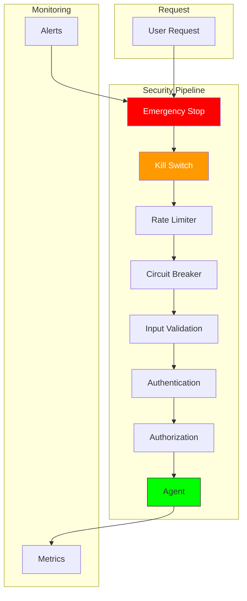

# Clase 11: Kill-Switches y Controles de Seguridad

## Duración
4 horas (240 minutos)

## Objetivos de Aprendizaje
- Implementar circuit breakers para agentes
- Diseñar rate limiting para prevenir abusos
- Crear semantic kill-switches para detener agentes
- Implementar emergency stops seguros
- Construir sistemas de seguridad multi-capa

## Contenidos Detallados

### 11.1 Circuit Breakers (75 minutos)

Los circuit breakers son esenciales para proteger a los agentes de fallos en cascada y sistemas externos no disponibles.

```python
import time
from typing import Dict, Any, Callable, Optional
from dataclasses import dataclass, field
from datetime import datetime, timedelta
from enum import Enum
import logging
import threading

logger = logging.getLogger(__name__)


class CircuitState(Enum):
    CLOSED = "closed"      # Normal operation
    OPEN = "open"          # Failing, reject calls
    HALF_OPEN = "half_open"  # Testing recovery


@dataclass
class CircuitBreakerConfig:
    """Configuración del circuit breaker"""
    failure_threshold: int = 5          # Fallos para abrir
    success_threshold: int = 2           # Éxitos para cerrar (half-open)
    timeout: int = 30                    # Segundos antes de intentar recovery
    half_open_max_calls: int = 3        # Máx llamadas en half-open
    excluded_exceptions: list = None      # Excepciones que no cuentan


class CircuitBreaker:
    """Circuit breaker para proteger agentes"""
    
    def __init__(self, name: str, config: CircuitBreakerConfig = None):
        self.name = name
        self.config = config or CircuitBreakerConfig()
        
        self.state = CircuitState.CLOSED
        self.failure_count = 0
        self.success_count = 0
        self.last_failure_time: Optional[float] = None
        self.half_open_calls = 0
        self.opened_at: Optional[float] = None
        self.total_calls = 0
        self.total_failures = 0
        
        self._lock = threading.RLock()
    
    def call(self, func: Callable, *args, **kwargs) -> Any:
        """Ejecuta función con protección de circuit breaker"""
        
        with self._lock:
            self.total_calls += 1
            
            # Verificar si debe intentar reset
            if self.state == CircuitState.OPEN:
                if self._should_attempt_reset():
                    self._transition_to_half_open()
                else:
                    raise CircuitBreakerOpenError(
                        f"Circuit {self.name} is OPEN. "
                        f"Opened at {datetime.fromtimestamp(self.opened_at).isoformat()}"
                    )
            
            # Verificar límite de llamadas en half-open
            if self.state == CircuitState.HALF_OPEN:
                if self.half_open_calls >= self.config.half_open_max_calls:
                    raise CircuitBreakerOpenError(
                        f"Circuit {self.name} in HALF_OPEN, max calls reached"
                    )
                self.half_open_calls += 1
        
        # Ejecutar función
        try:
            result = func(*args, **kwargs)
            self._on_success()
            return result
        except Exception as e:
            self._on_failure(e)
            raise
    
    def _should_attempt_reset(self) -> bool:
        """Determina si debe intentar reset"""
        
        if self.opened_at is None:
            return True
        
        elapsed = time.time() - self.opened_at
        return elapsed >= self.config.timeout
    
    def _transition_to_half_open(self):
        """Transiciona a estado half-open"""
        
        self.state = CircuitState.HALF_OPEN
        self.half_open_calls = 0
        self.success_count = 0
        
        logger.info(f"Circuit {self.name} transitioned to HALF_OPEN")
    
    def _on_success(self):
        """Maneja éxito"""
        
        with self._lock:
            if self.state == CircuitState.HALF_OPEN:
                self.success_count += 1
                
                if self.success_count >= self.config.success_threshold:
                    self._reset()
            elif self.state == CircuitState.CLOSED:
                self.failure_count = 0
    
    def _on_failure(self, exception: Exception):
        """Maneja fallo"""
        
        with self._lock:
            self.total_failures += 1
            
            # Verificar si es excepción excluida
            if self.config.excluded_exceptions:
                if any(isinstance(exception, exc_type) for exc_type in self.config.excluded_exceptions):
                    logger.debug(f"Exception {type(exception).__name__} excluded from circuit")
                    return
            
            if self.state == CircuitState.HALF_OPEN:
                self._trip()
            elif self.state == CircuitState.CLOSED:
                self.failure_count += 1
                
                if self.failure_count >= self.config.failure_threshold:
                    self._trip()
    
    def _trip(self):
        """Abre el circuit"""
        
        self.state = CircuitState.OPEN
        self.opened_at = time.time()
        self.failure_count = 0
        
        logger.warning(
            f"Circuit {self.name} OPENED after {self.total_failures} failures "
            f"out of {self.total_calls} calls"
        )
    
    def _reset(self):
        """Resetea el circuit"""
        
        self.state = CircuitState.CLOSED
        self.failure_count = 0
        self.success_count = 0
        self.half_open_calls = 0
        self.opened_at = None
        
        logger.info(f"Circuit {self.name} CLOSED (recovered)")
    
    def get_state(self) -> Dict:
        """Obtiene estado actual"""
        
        with self._lock:
            return {
                "name": self.name,
                "state": self.state.value,
                "total_calls": self.total_calls,
                "total_failures": self.total_failures,
                "failure_rate": self.total_failures / max(self.total_calls, 1),
                "failure_count": self.failure_count,
                "success_count": self.success_count,
                "opened_at": datetime.fromtimestamp(self.opened_at).isoformat() if self.opened_at else None
            }
    
    def reset_manual(self):
        """Reseteo manual del circuit"""
        
        with self._lock:
            self._reset()
            logger.info(f"Circuit {self.name} manually reset")


class CircuitBreakerOpenError(Exception):
    """Error cuando el circuit está abierto"""
    pass


class CircuitBreakerRegistry:
    """Registro de circuit breakers"""
    
    def __init__(self):
        self.breakers: Dict[str, CircuitBreaker] = {}
        self._lock = threading.Lock()
    
    def register(self, name: str, breaker: CircuitBreaker):
        """Registra un circuit breaker"""
        
        with self._lock:
            self.breakers[name] = breaker
    
    def get(self, name: str) -> Optional[CircuitBreaker]:
        """Obtiene un circuit breaker"""
        
        return self.breakers.get(name)
    
    def get_all_states(self) -> Dict[str, Dict]:
        """Obtiene estado de todos los circuits"""
        
        return {
            name: breaker.get_state()
            for name, breaker in self.breakers.items()
        }
    
    def reset_all(self):
        """Resetea todos los circuits"""
        
        for breaker in self.breakers.values():
            breaker.reset_manual()


# Decorador para usar con funciones
def circuit_breaker(breaker_name: str, registry: CircuitBreakerRegistry):
    """Decorador para aplicar circuit breaker"""
    
    def decorator(func: Callable) -> Callable:
        
        def wrapper(*args, **kwargs):
            breaker = registry.get(breaker_name)
            
            if not breaker:
                return func(*args, **kwargs)
            
            return breaker.call(func, *args, **kwargs)
        
        return wrapper
    return decorator
```

### 11.2 Rate Limiting (60 minutos)

```python
import time
from typing import Dict, Optional
from dataclasses import dataclass
from datetime import datetime, timedelta
from collections import defaultdict
import threading
import logging

logger = logging.getLogger(__name__)


@dataclass
class RateLimitConfig:
    """Configuración de rate limiting"""
    max_requests: int           # Máximo requests permitidos
    window_seconds: int         # Ventana de tiempo
    burst_allowance: int = 0   # Allowance adicional para bursts


@dataclass
class RateLimitResult:
    """Resultado de verificación de rate limit"""
    allowed: bool
    remaining: int
    reset_time: datetime
    retry_after: Optional[int] = None


class TokenBucket:
    """Implementación de Token Bucket"""
    
    def __init__(self, capacity: int, refill_rate: float):
        self.capacity = capacity
        self.tokens = capacity
        self.refill_rate = refill_rate
        self.last_refill = time.time()
        self._lock = threading.Lock()
    
    def consume(self, tokens: int = 1) -> bool:
        """Intenta consumir tokens"""
        
        with self._lock:
            self._refill()
            
            if self.tokens >= tokens:
                self.tokens -= tokens
                return True
            
            return False
    
    def _refill(self):
        """Rellena tokens según tasa"""
        
        now = time.time()
        elapsed = now - self.last_refill
        
        new_tokens = elapsed * self.refill_rate
        self.tokens = min(self.capacity, self.tokens + new_tokens)
        self.last_refill = now
    
    def get_available(self) -> int:
        """Obtiene tokens disponibles"""
        
        with self._lock:
            self._refill()
            return int(self.tokens)


class RateLimiter:
    """Rate limiter con múltiples estrategias"""
    
    def __init__(self):
        self.limiters: Dict[str, TokenBucket] = {}
        self.counters: Dict[str, list] = defaultdict(list)
        self._lock = threading.Lock()
    
    def add_limiter(self, key: str, capacity: int, refill_rate: float):
        """Agrega un limiter"""
        
        with self._lock:
            self.limiters[key] = TokenBucket(capacity, refill_rate)
    
    def check_rate_limit(
        self,
        identifier: str,
        max_requests: int,
        window_seconds: int
    ) -> RateLimitResult:
        """Verifica rate limit usando sliding window"""
        
        with self._lock:
            now = time.time()
            window_start = now - window_seconds
            
            # Limpiar contador antiguos
            self.counters[identifier] = [
                t for t in self.counters[identifier]
                if t > window_start
            ]
            
            # Verificar límite
            if len(self.counters[identifier]) >= max_requests:
                # Calcular tiempo hasta que expire el más antiguo
                oldest = min(self.counters[identifier])
                retry_after = int(oldest + window_seconds - now) + 1
                
                return RateLimitResult(
                    allowed=False,
                    remaining=0,
                    reset_time=datetime.fromtimestamp(oldest + window_seconds),
                    retry_after=retry_after
                )
            
            # Registrar request
            self.counters[identifier].append(now)
            
            remaining = max_requests - len(self.counters[identifier])
            
            return RateLimitResult(
                allowed=True,
                remaining=remaining,
                reset_time=datetime.now() + timedelta(seconds=window_seconds)
            )
    
    def check_token_bucket(
        self,
        identifier: str,
        capacity: int = 100,
        refill_rate: float = 10.0
    ) -> bool:
        """Verifica usando token bucket"""
        
        with self._lock:
            if identifier not in self.limiters:
                self.limiters[identifier] = TokenBucket(capacity, refill_rate)
            
            return self.limiters[identifier].consume()


class AgentRateLimiter:
    """Rate limiter específico para agentes"""
    
    def __init__(self):
        self.user_limiter = RateLimiter()
        self.session_limiter = RateLimiter()
        self.global_limiter = RateLimiter()
        
        # Configuraciones por defecto
        self.user_config = RateLimitConfig(
            max_requests=100,
            window_seconds=60,
            burst_allowance=20
        )
        
        self.session_config = RateLimitConfig(
            max_requests=500,
            window_seconds=300,
            burst_allowance=50
        )
    
    def check_user_rate(
        self,
        user_id: str,
        action: str = None
    ) -> RateLimitResult:
        """Verifica rate limit por usuario"""
        
        key = f"user:{user_id}"
        
        if action:
            key = f"user:{user_id}:{action}"
        
        return self.user_limiter.check_rate_limit(
            key,
            self.user_config.max_requests,
            self.user_config.window_seconds
        )
    
    def check_session_rate(
        self,
        session_id: str
    ) -> RateLimitResult:
        """Verifica rate limit por sesión"""
        
        return self.session_limiter.check_rate_limit(
            session_id,
            self.session_config.max_requests,
            self.session_config.window_seconds
        )
    
    def check_global_rate(
        self,
        agent_type: str = "default"
    ) -> RateLimitResult:
        """Verifica rate limit global"""
        
        return self.global_limiter.check_rate_limit(
            f"global:{agent_type}",
            1000,
            60
        )
    
    def check_all(
        self,
        user_id: str,
        session_id: str,
        agent_type: str = "default"
    ) -> Dict[str, RateLimitResult]:
        """Verifica todos los límites"""
        
        return {
            "user": self.check_user_rate(user_id),
            "session": self.check_session_rate(session_id),
            "global": self.check_global_rate(agent_type)
        }
```

### 11.3 Semantic Kill-Switches (60 minutos)

```python
from typing import Dict, List, Optional, Callable
from dataclasses import dataclass
from datetime import datetime
import threading
import logging

logger = logging.getLogger(__name__)


@dataclass
class KillSwitchCondition:
    """Condición para activar kill switch"""
    condition_id: str
    name: str
    description: str
    predicate: Callable[[Dict], bool]
    severity: str = "critical"  # critical, high, medium
    enabled: bool = True


class SemanticKillSwitch:
    """Kill switch semántico para agentes"""
    
    def __init__(self):
        self.conditions: Dict[str, KillSwitchCondition] = {}
        self.active_kills: List[Dict] = []
        self._lock = threading.Lock()
        
        # Configurar condiciones por defecto
        self._setup_default_conditions()
    
    def _setup_default_conditions(self):
        """Configura condiciones por defecto"""
        
        # Condición 1: Contenido peligroso
        self.add_condition(KillSwitchCondition(
            condition_id="dangerous_content",
            name="Dangerous Content Detection",
            description="Detecta solicitudes que buscan contenido peligroso",
            predicate=lambda ctx: self._check_dangerous_content(ctx),
            severity="critical"
        ))
        
        # Condición 2: Datos sensibles
        self.add_condition(KillSwitchCondition(
            condition_id="sensitive_data",
            name="Sensitive Data Protection",
            description="Previene exposición de datos sensibles",
            predicate=lambda ctx: self._check_sensitive_data(ctx),
            severity="critical"
        ))
        
        # Condición 3: Rate limit exceeded
        self.add_condition(KillSwitchCondition(
            condition_id="rate_limit",
            name="Rate Limit Exceeded",
            description="Detecta cuando se excede el rate limit",
            predicate=lambda ctx: ctx.get("rate_limit_exceeded", False),
            severity="high"
        ))
        
        # Condición 4: Error repeatedly
        self.add_condition(KillSwitchCondition(
            condition_id="repeated_errors",
            name="Repeated Errors",
            description="Detecta errores repetidos",
            predicate=lambda ctx: ctx.get("error_count", 0) > 5,
            severity="high"
        ))
    
    def add_condition(self, condition: KillSwitchCondition):
        """Agrega una condición de kill switch"""
        
        with self._lock:
            self.conditions[condition.condition_id] = condition
            logger.info(f"Added kill switch condition: {condition.name}")
    
    def remove_condition(self, condition_id: str):
        """Remueve una condición"""
        
        with self._lock:
            if condition_id in self.conditions:
                del self.conditions[condition_id]
                logger.info(f"Removed kill switch condition: {condition_id}")
    
    def enable_condition(self, condition_id: str):
        """Habilita una condición"""
        
        with self._lock:
            if condition_id in self.conditions:
                self.conditions[condition_id].enabled = True
    
    def disable_condition(self, condition_id: str):
        """Deshabilita una condición"""
        
        with self._lock:
            if condition_id in self.conditions:
                self.conditions[condition_id].enabled = False
    
    def check(self, context: Dict) -> Optional[Dict]:
        """Verifica si alguna condición se activa"""
        
        with self._lock:
            for condition_id, condition in self.conditions.items():
                if not condition.enabled:
                    continue
                
                try:
                    if condition.predicate(context):
                        kill_event = {
                            "condition_id": condition_id,
                            "condition_name": condition.name,
                            "severity": condition.severity,
                            "timestamp": datetime.now().isoformat(),
                            "context": context
                        }
                        
                        self.active_kills.append(kill_event)
                        
                        logger.warning(
                            f"KILL SWITCH ACTIVATED: {condition.name} "
                            f"(severity: {condition.severity})"
                        )
                        
                        return kill_event
                        
                except Exception as e:
                    logger.error(f"Error checking condition {condition_id}: {e}")
        
        return None
    
    def get_active_kills(self) -> List[Dict]:
        """Obtiene los kills activos"""
        
        with self._lock:
            return self.active_kills.copy()
    
    def clear_kills(self):
        """Limpia el historial de kills"""
        
        with self._lock:
            self.active_kills.clear()
    
    def _check_dangerous_content(self, context: Dict) -> bool:
        """Verifica contenido peligroso"""
        
        # Palabras clave peligrosas
        dangerous_keywords = [
            "bomb", "weapon", "attack", "kill", "harm",
            "hack", "exploit", "virus", "malware"
        ]
        
        message = context.get("message", "").lower()
        
        return any(keyword in message for keyword in dangerous_keywords)
    
    def _check_sensitive_data(self, context: Dict) -> bool:
        """Verifica si se intenta acceder a datos sensibles"""
        
        # Detectar intentos de acceso a PII
        sensitive_patterns = [
            "ssn", "social security", "credit card",
            "password", "secret", "private key"
        ]
        
        message = context.get("message", "").lower()
        
        return any(pattern in message for pattern in sensitive_patterns)


class EmergencyStop:
    """Sistema de parada de emergencia"""
    
    def __init__(self):
        self.stopped = False
        self.stop_time: Optional[datetime] = None
        self.stop_reason: str = ""
        self._lock = threading.Lock()
    
    def emergency_stop(self, reason: str = "Manual emergency stop"):
        """Ejecuta parada de emergencia"""
        
        with self._lock:
            self.stopped = True
            self.stop_time = datetime.now()
            self.stop_reason = reason
            
            logger.critical(f"EMERGENCY STOP ACTIVATED: {reason}")
    
    def resume(self):
        """Reanuda operación"""
        
        with self._lock:
            self.stopped = False
            self.stop_time = None
            self.stop_reason = ""
            
            logger.info("System resumed from emergency stop")
    
    def is_stopped(self) -> bool:
        """Verifica si está detenido"""
        
        with self._lock:
            return self.stopped
    
    def get_status(self) -> Dict:
        """Obtiene estado"""
        
        with self._lock:
            return {
                "stopped": self.stopped,
                "stop_time": self.stop_time.isoformat() if self.stop_time else None,
                "stop_reason": self.stop_reason
            }
```

### 11.4 Sistema de Seguridad Multi-Capa (45 minutos)

```python
from typing import Dict, List, Optional, Any
import time


class SecurityLayer:
    """Capa base de seguridad"""
    
    def __init__(self, name: str):
        self.name = name
        self.enabled = True
    
    def check(self, request: Dict) -> Optional[Dict]:
        """Verifica la request"""
        return None  # None = pasar, dict = bloquear
    
    def get_config(self) -> Dict:
        """Obtiene configuración"""
        return {"name": self.name, "enabled": self.enabled}


class InputValidationLayer(SecurityLayer):
    """Capa de validación de entrada"""
    
    def __init__(self):
        super().__init__("InputValidation")
        self.max_message_length = 10000
        self.allowed_patterns = None
        self.blocked_patterns = [
            r"<script",
            r"javascript:",
            r"onerror=",
            r"onclick="
        ]
    
    def check(self, request: Dict) -> Optional[Dict]:
        """Valida entrada"""
        
        message = request.get("message", "")
        
        # Longitud
        if len(message) > self.max_message_length:
            return {
                "blocked": True,
                "reason": f"Message too long (max {self.max_message_length})",
                "severity": "medium"
            }
        
        # Patrones bloqueados
        import re
        for pattern in self.blocked_patterns:
            if re.search(pattern, message, re.IGNORECASE):
                return {
                    "blocked": True,
                    "reason": f"Blocked pattern detected: {pattern}",
                    "severity": "high"
                }
        
        return None


class AuthenticationLayer(SecurityLayer):
    """Capa de autenticación"""
    
    def __init__(self):
        super().__init__("Authentication")
    
    def check(self, request: Dict) -> Optional[Dict]:
        """Verifica autenticación"""
        
        token = request.get("auth_token")
        
        if not token:
            return {
                "blocked": True,
                "reason": "Missing authentication token",
                "severity": "high"
            }
        
        # Verificar token (implementación real validaría contra servicio)
        if not self._validate_token(token):
            return {
                "blocked": True,
                "reason": "Invalid authentication token",
                "severity": "high"
            }
        
        return None
    
    def _validate_token(self, token: str) -> bool:
        """Valida token"""
        return token.startswith("valid_")


class AuthorizationLayer(SecurityLayer):
    """Capa de autorización"""
    
    def __init__(self):
        super().__init__("Authorization")
        self.permissions = {}
    
    def check(self, request: Dict) -> Optional[Dict]:
        """Verifica autorización"""
        
        user_id = request.get("user_id")
        action = request.get("action")
        
        if not user_id:
            return None  # Opcional
        
        # Verificar permiso
        user_perms = self.permissions.get(user_id, [])
        
        if action and action not in user_perms:
            return {
                "blocked": True,
                "reason": f"User not authorized for action: {action}",
                "severity": "medium"
            }
        
        return None


class SecurityPipeline:
    """Pipeline de seguridad multi-capa"""
    
    def __init__(self):
        self.layers: List[SecurityLayer] = []
        self.kill_switch = SemanticKillSwitch()
        self.emergency_stop = EmergencyStop()
        self.circuit_breakers: Dict[str, Any] = {}
        self.rate_limiter = AgentRateLimiter()
    
    def add_layer(self, layer: SecurityLayer):
        """Agrega una capa"""
        self.layers.append(layer)
    
    def check(self, request: Dict) -> Dict:
        """Ejecuta todas las capas"""
        
        # Verificar emergency stop
        if self.emergency_stop.is_stopped():
            return {
                "allowed": False,
                "reason": "System is stopped (emergency)",
                "severity": "critical"
            }
        
        # Verificar kill switch
        kill_result = self.kill_switch.check(request)
        if kill_result:
            return {
                "allowed": False,
                "reason": f"Kill switch activated: {kill_result['condition_name']}",
                "severity": kill_result['severity']
            }
        
        # Verificar rate limit
        user_id = request.get("user_id")
        session_id = request.get("session_id")
        
        if user_id:
            rate_result = self.rate_limiter.check_user_rate(user_id)
            if not rate_result.allowed:
                return {
                    "allowed": False,
                    "reason": f"Rate limit exceeded. Retry after {rate_result.retry_after}s",
                    "severity": "medium",
                    "retry_after": rate_result.retry_after
                }
        
        # Ejecutar capas de seguridad
        for layer in self.layers:
            if not layer.enabled:
                continue
            
            try:
                result = layer.check(request)
                
                if result and result.get("blocked"):
                    return {
                        "allowed": False,
                        "reason": result.get("reason", "Security check failed"),
                        "severity": result.get("severity", "medium"),
                        "layer": layer.name
                    }
                    
            except Exception as e:
                logger.error(f"Security layer {layer.name} error: {e}")
        
        return {"allowed": True}
```

## Diagramas

### Diagrama 1: Arquitectura de Seguridad Multi-Capa



## Referencias Externas

1. **Circuit Breaker Pattern**: https://martinfowler.com/bliki/CircuitBreaker.html
2. **Rate Limiting Algorithms**: https://en.wikipedia.org/wiki/Rate_limiting
3. **Security Best Practices**: https://owasp.org/www-project-top-ten/

## Ejercicios Prácticos Resueltos

### Ejemplo: Sistema de Seguridad Completo

```python
"""
Sistema de Seguridad para Agentes
"""

import time
from typing import Dict, Optional
import threading


# ==================== CIRCUIT BREAKER ====================

class SimpleCircuitBreaker:
    """Circuit breaker simple"""
    
    def __init__(self, failure_limit: int = 3, timeout: int = 30):
        self.failure_limit = failure_limit
        self.timeout = timeout
        self.state = "closed"
        self.failures = 0
        self.opened_at = None
    
    def call(self, func, *args, **kwargs):
        """Ejecuta con protección"""
        
        if self.state == "open":
            if time.time() - self.opened_at > self.timeout:
                self.state = "half_open"
                print(f"Circuit: trying half_open")
            else:
                raise Exception("Circuit is OPEN")
        
        try:
            result = func(*args, **kwargs)
            
            if self.state == "half_open":
                self.state = "closed"
                self.failures = 0
                print(f"Circuit: recovered to CLOSED")
            
            return result
            
        except Exception as e:
            self.failures += 1
            
            if self.failures >= self.failure_limit:
                self.state = "open"
                self.opened_at = time.time()
                print(f"Circuit: OPEN (failures: {self.failures})")
            
            raise


# ==================== RATE LIMITER ====================

class SimpleRateLimiter:
    """Rate limiter simple"""
    
    def __init__(self, max_per_minute: int = 60):
        self.max_per_minute = max_per_minute
        self.requests = []
        self.lock = threading.Lock()
    
    def check(self, key: str) -> bool:
        """Verifica rate limit"""
        
        with self.lock:
            now = time.time()
            minute_ago = now - 60
            
            # Limpiar requests antiguos
            self.requests = [r for r in self.requests if r["time"] > minute_ago]
            
            # Contar requests de esta key
            count = sum(1 for r in self.requests if r["key"] == key)
            
            if count >= self.max_per_minute:
                return False
            
            self.requests.append({"key": key, "time": now})
            return True


# ==================== KILL SWITCH ====================

class SimpleKillSwitch:
    """Kill switch simple"""
    
    def __init__(self):
        self.stopped = False
        self.conditions = []
    
    def add_condition(self, name: str, check_fn):
        """Agrega condición"""
        self.conditions.append({"name": name, "check": check_fn})
    
    def check(self, request: Dict) -> Optional[Dict]:
        """Verifica condiciones"""
        
        if self.stopped:
            return {"reason": "Kill switch activated", "severity": "critical"}
        
        for condition in self.conditions:
            try:
                if condition["check"](request):
                    return {
                        "reason": f"Condition: {condition['name']}",
                        "severity": "high"
                    }
            except:
                pass
        
        return None
    
    def stop(self, reason: str = "Manual"):
        """Activa kill switch"""
        self.stopped = True
        print(f"KILL SWITCH ACTIVATED: {reason}")
    
    def resume(self):
        """Reanuda"""
        self.stopped = False
        print("Kill switch deactivated")


# ==================== SECURITY PIPELINE ====================

class SecurityPipeline:
    """Pipeline de seguridad"""
    
    def __init__(self):
        self.rate_limiter = SimpleRateLimiter(100)
        self.circuit_breaker = SimpleCircuitBreaker()
        self.kill_switch = SimpleKillSwitch()
        
        # Agregar condiciones al kill switch
        self.kill_switch.add_condition(
            "dangerous_content",
            lambda r: "bomb" in r.get("message", "").lower()
        )
        self.kill_switch.add_condition(
            "sensitive_data",
            lambda r: "password" in r.get("message", "").lower()
        )
    
    def check(self, request: Dict) -> Dict:
        """Ejecuta seguridad"""
        
        # 1. Kill switch
        kill_result = self.kill_switch.check(request)
        if kill_result:
            return {"allowed": False, **kill_result}
        
        # 2. Rate limit
        user_id = request.get("user_id", "anonymous")
        if not self.rate_limiter.check(user_id):
            return {"allowed": False, "reason": "Rate limit exceeded", "severity": "medium"}
        
        # 3. Circuit breaker
        try:
            # Simular operación
            return {"allowed": True}
        except Exception as e:
            return {"allowed": False, "reason": str(e), "severity": "high"}
    
    def stop_all(self, reason: str):
        """Para todo"""
        self.kill_switch.stop(reason)
    
    def resume_all(self):
        """Reanuda todo"""
        self.kill_switch.resume()


# ==================== EJEMPLO ====================

def main():
    print("=" * 60)
    print("EJEMPLO: SISTEMA DE SEGURIDAD")
    print("=" * 60)
    
    # Crear pipeline
    pipeline = SecurityPipeline()
    
    # Request válida
    print("\n1. Request válida:")
    result = pipeline.check({"user_id": "user1", "message": "Hello"})
    print(f"   Resultado: {result}")
    
    # Request con contenido peligroso
    print("\n2. Request peligrosa:")
    result = pipeline.check({"user_id": "user1", "message": "How to make a bomb"})
    print(f"   Resultado: {result}")
    
    # Request con datos sensibles
    print("\n3. Request con datos sensibles:")
    result = pipeline.check({"user_id": "user1", "message": "Show my password"})
    print(f"   Resultado: {result}")
    
    # Rate limit (simular muchos requests)
    print("\n4. Rate limit:")
    for i in range(105):
        result = pipeline.check({"user_id": "user2", "message": "test"})
        if not result["allowed"]:
            print(f"   Rate limit alcanzado en request {i+1}")
            break
    
    # Stop manuales
    print("\n5. Kill switch manual:")
    pipeline.stop_all("Maintenance")
    result = pipeline.check({"user_id": "user1", "message": "test"})
    print(f"   Después de stop: {result}")
    
    print("\n" + "=" * 60)


if __name__ == "__main__":
    main()
```

## Resumen de Puntos Clave

1. **Circuit Breaker**: Protege contra fallos en cascada, permite recuperación.

2. **Rate Limiting**: Previene abusos, usa token bucket o sliding window.

3. **Semantic Kill-Switch**: Detiene agente según condiciones semánticas.

4. **Emergency Stop**: Parada total inmediata.

5. **Security Pipeline**: Múltiples capas de seguridad en serie.

6. **Input Validation**: Valida entrada del usuario.

7. **Authentication**: Verifica identidad.

8. **Authorization**: Verifica permisos.

9. **Thread Safety**: Todo debe ser thread-safe.

10. **Monitoring**: Métricas y alertas de seguridad.