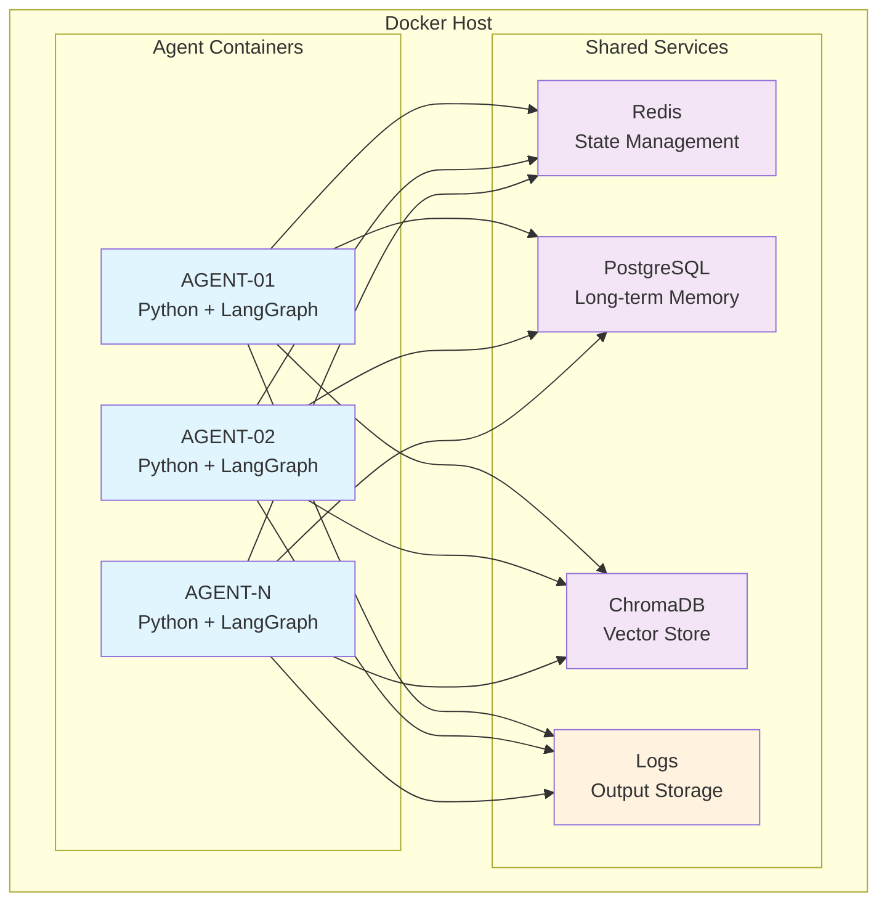

# Clase 13: Docker para Agentes Industriales

## Duración
4 horas (240 minutos)

## Objetivos de Aprendizaje
- Dominar la containerización de agentes industriales con Docker
- Configurar Docker Compose para entornos de desarrollo y producción
- Implementar patrones de diseño para contenedores de agentes
- Optimizar imágenes Docker para cargas de trabajo agénticas
- Manejar persistencia y redes en entornos containerizados

## Contenidos Detallados

### 13.1 Fundamentos de Containerización de Agentes (60 minutos)

La containerización de agentes industriales requiere consideraciones especiales debido a la naturaleza stateful de los agentes y sus dependencias externas. A diferencia de las aplicaciones stateless tradicionales, los agentes mantienen estado en memoria, requieren acceso a bases de datos, y necesitan comunicación con múltiples servicios externos.

#### 13.1.1 Arquitectura de Contenedores para Agentes



#### 13.1.2 Dockerfile Optimizado para Agentes

```dockerfile
# Dockerfile para agente industrial
FROM python:3.11-slim AS builder

# Instalar dependencias del sistema
RUN apt-get update && apt-get install -y \
    gcc \
    libpq-dev \
    && rm -rf /var/lib/apt/lists/*

# Crear entorno virtual
WORKDIR /app
RUN python -m venv /opt/venv
ENV PATH="/opt/venv/bin:$PATH"

# Copiar solo archivos de dependencias
COPY requirements.txt ./
RUN pip install --no-cache-dir --upgrade pip \
    && pip install --no-cache-dir -r requirements.txt

# Segunda etapa: imagen final
FROM python:3.11-slim

# Instalar dependencias mínimas del sistema
RUN apt-get update && apt-get install -y \
    libpq5 \
    curl \
    && rm -rf /var/lib/apt/lists/*

# Copiar entorno virtual de builder
COPY --from=builder /opt/venv /opt/venv
ENV PATH="/opt/venv/bin:$PATH"

# Crear usuario no-root para seguridad
RUN useradd --create-home --shell /bin/bash agent
USER agent

WORKDIR /home/agent

# Copiar código de la aplicación
COPY --chown=agent:agent . .

# Crear directorio para estados
RUN mkdir -p /home/agent/state /home/agent/logs /home/agent/tools
RUN chmod 755 /home/agent/state /home/agent/logs /home/agent/tools

# Variables de entorno
ENV PYTHONDONTWRITEBYTECODE=1
ENV PYTHONUNBUFFERED=1
ENV LOG_LEVEL=INFO

# Exponer puerto para métricas
EXPOSE 8000

# Health check
HEALTHCHECK --interval=30s --timeout=10s --start-period=40s --retries=3 \
    CMD python -c "import requests; requests.get('http://localhost:8000/health')" || exit 1

# Script de inicio
COPY docker/entrypoint.sh /entrypoint.sh
RUN chmod +x /entrypoint.sh
ENTRYPOINT ["/entrypoint.sh"]
```

```dockerfile
# requirements.txt
# Core
langgraph==0.0.20
langchain-core==0.1.10
langchain-openai==0.0.2

# State Management
redis==5.0.1
redis-py-cluster==2.1.3

# Database
asyncpg==0.29.0
sqlalchemy[asyncio]==2.0.23

# Vector Store
chromadb==0.4.22

# Observability
prometheus-client==0.19.0
opentelemetry-api==1.22.0
opentelemetry-sdk==1.22.0

# Utilities
pydantic==2.5.2
pydantic-settings==2.1.0
python-dotenv==1.0.0

# HTTP
fastapi==0.108.0
uvicorn[standard]==0.25.0

# Async
aioredis==2.0.1
httpx==0.25.2
```

### 13.2 Docker Compose para Entornos Agénticos (75 minutos)

#### 13.2.1 Configuración de Desarrollo

```yaml
# docker-compose.dev.yml
version: '3.8'

services:
  # Agente principal
  agent:
    build:
      context: .
      dockerfile: Dockerfile
    container_name: agent-industrial-dev
    environment:
      - REDIS_HOST=redis
      - REDIS_PORT=6379
      - POSTGRES_HOST=postgres
      - POSTGRES_PORT=5432
      - POSTGRES_DB=agent_db
      - POSTGRES_USER=agent
      - POSTGRES_PASSWORD=dev_password
      - CHROMA_HOST=chroma
      - CHROMA_PORT=8000
      - LOG_LEVEL=DEBUG
      - LLM_PROVIDER=openai
      - OPENAI_API_KEY=${OPENAI_API_KEY}
    ports:
      - "8000:8000"
      - "5678:5678"  # Debug port
    volumes:
      - ./src:/home/agent/src
      - agent_state_dev:/home/agent/state
      - agent_logs_dev:/home/agent/logs
    depends_on:
      redis:
        condition: service_healthy
      postgres:
        condition: service_healthy
      chroma:
        condition: service_started
    networks:
      - agent-network
    command: python -m uvicorn src.main:app --host 0.0.0.0 --port 8000 --reload

  # Redis para estado
  redis:
    image: redis:7-alpine
    container_name: redis-agent-dev
    command: redis-server --appendonly yes --maxmemory 256mb --maxmemory-policy allkeys-lru
    ports:
      - "6379:6379"
    volumes:
      - redis_data_dev:/data
    healthcheck:
      test: ["CMD", "redis-cli", "ping"]
      interval: 10s
      timeout: 5s
      retries: 5
    networks:
      - agent-network

  # PostgreSQL para memoria a largo plazo
  postgres:
    image: postgres:15-alpine
    container_name: postgres-agent-dev
    environment:
      - POSTGRES_DB=agent_db
      - POSTGRES_USER=agent
      - POSTGRES_PASSWORD=dev_password
    ports:
      - "5432:5432"
    volumes:
      - postgres_data_dev:/var/lib/postgresql/data
    healthcheck:
      test: ["CMD-SHELL", "pg_isready -U agent"]
      interval: 10s
      timeout: 5s
      retries: 5
    networks:
      - agent-network

  # ChromaDB para embeddings
  chroma:
    image: chromadb/chroma:latest
    container_name: chroma-dev
    ports:
      - "8000:8000"
    volumes:
      - chroma_data_dev:/chroma/chroma
    networks:
      - agent-network

  # Prometheus para métricas
  prometheus:
    image: prom/prometheus:latest
    container_name: prometheus-dev
    ports:
      - "9090:9090"
    volumes:
      - ./docker/prometheus.yml:/etc/prometheus/prometheus.yml
      - ./docker/rules:/etc/prometheus/rules
      - prometheus_data:/prometheus
    command:
      - '--config.file=/etc/prometheus/prometheus.yml'
      - '--storage.tsdb.path=/prometheus'
    networks:
      - agent-network

  # Grafana para dashboards
  grafana:
    image: grafana/grafana:latest
    container_name: grafana-dev
    ports:
      - "3000:3000"
    environment:
      - GF_SECURITY_ADMIN_USER=admin
      - GF_SECURITY_ADMIN_PASSWORD=admin
      - GF_USERS_ALLOW_SIGN_UP=false
    volumes:
      - ./docker/grafana/dashboards:/etc/grafana/provisioning/dashboards
      - grafana_data:/var/lib/grafana
    depends_on:
      - prometheus
    networks:
      - agent-network

  # Jaeger para tracing
  jaeger:
    image: jaegertracing/all-in-one:1.50
    container_name: jaeger-dev
    ports:
      - "16686:16686"
      - "6831:6831"
      - "14268:14268"
    environment:
      - COLLECTOR_OTLP_ENABLED=true
    networks:
      - agent-network

volumes:
  agent_state_dev:
  agent_logs_dev:
  redis_data_dev:
  postgres_data_dev:
  chroma_data_dev:
  prometheus_data:
  grafana_data:

networks:
  agent-network:
    driver: bridge
```

#### 13.2.2 Configuración de Producción

```yaml
# docker-compose.prod.yml
version: '3.8'

services:
  # Nginx como reverse proxy y load balancer
  nginx:
    image: nginx:alpine
    container_name: nginx-prod
    ports:
      - "80:80"
      - "443:443"
    volumes:
      - ./docker/nginx/nginx.conf:/etc/nginx/nginx.conf:ro
      - ./docker/nginx/ssl:/etc/nginx/ssl:ro
    depends_on:
      - agent
    networks:
      - agent-network
    restart: unless-stopped

  # Múltiples instancias del agente con load balancing
  agent:
    deploy:
      replicas: 3
      resources:
        limits:
          cpus: '2'
          memory: 4G
        reservations:
          cpus: '1'
          memory: 2G
      restart_policy:
        condition: on-failure
        delay: 5s
        max_attempts: 3
    image: agent-industrial:latest
    environment:
      - REDIS_HOST=redis-master
      - REDIS_PORT=6379
      - REDIS_PASSWORD=${REDIS_PASSWORD}
      - POSTGRES_HOST=postgres-replica
      - POSTGRES_PORT=5432
      - POSTGRES_DB=agent_prod
      - POSTGRES_USER=agent
      - POSTGRES_PASSWORD=${POSTGRES_PASSWORD}
      - CHROMA_HOST=chroma
      - CHROMA_PORT=8000
      - LOG_LEVEL=INFO
      - LLM_PROVIDER=openai
      - OPENAI_API_KEY=${OPENAI_API_KEY}
      - AGENT_ID=${AGENT_ID:-agent-prod-01}
    healthcheck:
      test: ["CMD", "curl", "-f", "http://localhost:8000/health"]
      interval: 30s
      timeout: 10s
      retries: 3
      start_period: 40s
    networks:
      - agent-network
    restart: unless-stopped

  # Redis cluster para alta disponibilidad
  redis-master:
    image: redis:7-alpine
    container_name: redis-master-prod
    command: redis-server --appendonly yes --requirepass ${REDIS_PASSWORD}
    ports:
      - "6379:6379"
    volumes:
      - redis_data_prod:/data
    networks:
      - agent-network
    restart: unless-stopped

  redis-replica:
    image: redis:7-alpine
    container_name: redis-replica-prod
    command: redis-server --replicaof redis-master 6379 --appendonly yes --requirepass ${REDIS_PASSWORD} --masterauth ${REDIS_PASSWORD}
    depends_on:
      - redis-master
    networks:
      - agent-network
    restart: unless-stopped

  # PostgreSQL con réplicas
  postgres-master:
    image: postgres:15-alpine
    container_name: postgres-master-prod
    environment:
      - POSTGRES_DB=agent_prod
      - POSTGRES_USER=agent
      - POSTGRES_PASSWORD=${POSTGRES_PASSWORD}
      - POSTGRES_MAX_CONNECTIONS=200
    volumes:
      - postgres_master_data:/var/lib/postgresql/data
      - ./docker/postgres/postgresql.conf:/etc/postgresql/postgresql.conf
    networks:
      - agent-network
    restart: unless-stopped
    command: postgres -c config_file=/etc/postgresql/postgresql.conf

  postgres-replica:
    image: postgres:15-alpine
    container_name: postgres-replica-prod
    environment:
      - POSTGRES_DB=agent_prod
      - POSTGRES_USER=agent
      - POSTGRES_PASSWORD=${POSTGRES_PASSWORD}
    volumes:
      - postgres_replica_data:/var/lib/postgresql/data
    networks:
      - agent-network
    restart: unless-stopped
    command: >
      bash -c "echo 'host replication agent 0.0.0.0/0 md5' >> /var/lib/postgresql/data/pg_hba.conf
      && dockerize -template /etc/postgresql/replica.conf:/etc/postgresql/postgresql.conf
      && exec docker-entrypoint.sh postgres"

  # ChromaDB con múltiples nodos
  chroma:
    image: chromadb/chroma:latest
    container_name: chroma-prod
    environment:
      - IS_PERSIST=TRUE
      - ANONYMIZED_TELEMETRY=FALSE
    volumes:
      - chroma_data_prod:/chroma/chroma
    networks:
      - agent-network
    restart: unless-stopped

  # Prometheus con persistencia
  prometheus:
    image: prom/prometheus:latest
    ports:
      - "9090:9090"
    volumes:
      - ./docker/prometheus/prometheus.yml:/etc/prometheus/prometheus.yml
      - ./docker/prometheus/rules:/etc/prometheus/rules
      - prometheus_data:/prometheus
    command:
      - '--config.file=/etc/prometheus/prometheus.yml'
      - '--storage.tsdb.path=/prometheus'
      - '--storage.tsdb.retention.time=30d'
      - '--web.enable-lifecycle'
    networks:
      - agent-network
    restart: unless-stopped

  # Alertmanager
  alertmanager:
    image: prom/alertmanager:latest
    ports:
      - "9093:9093"
    volumes:
      - ./docker/alertmanager/alertmanager.yml:/etc/alertmanager/alertmanager.yml
      - alertmanager_data:/alertmanager
    command:
      - '--config.file=/etc/alertmanager/alertmanager.yml'
      - '--storage.path=/alertmanager'
    networks:
      - agent-network
    restart: unless-stopped

  # Grafana con datasource automático
  grafana:
    image: grafana/grafana:latest
    ports:
      - "3000:3000"
    environment:
      - GF_SECURITY_ADMIN_USER=${GRAFANA_USER}
      - GF_SECURITY_ADMIN_PASSWORD=${GRAFANA_PASSWORD}
      - GF_USERS_ALLOW_SIGN_UP=false
    volumes:
      - ./docker/grafana/dashboards:/etc/grafana/provisioning/dashboards
      - ./docker/grafana/datasources:/etc/grafana/provisioning/datasources
      - grafana_data:/var/lib/grafana
    networks:
      - agent-network
    restart: unless-stopped

  # cAdvisor para métricas de contenedores
  cadvisor:
    image: gcr.io/cadvisor/cadvisor:latest
    ports:
      - "8080:8080"
    volumes:
      - /:/rootfs:ro
      - /var/run:/var/run:ro
      - /sys:/sys:ro
      - /var/lib/docker/:/var/lib/docker:ro
    networks:
      - agent-network

volumes:
  redis_data_prod:
  postgres_master_data:
  postgres_replica_data:
  chroma_data_prod:
  prometheus_data:
  alertmanager_data:
  grafana_data:

networks:
  agent-network:
    driver: bridge
    ipam:
      config:
        - subnet: 172.28.0.0/16
```

#### 13.2.3 Script de Entrada Personalizado

```bash
#!/bin/bash
# docker/entrypoint.sh

set -e

echo "=========================================="
echo "Iniciando Agente Industrial"
echo "=========================================="
echo "Agente ID: ${AGENT_ID:-default}"
echo "Ambiente: ${ENVIRONMENT:-production}"
echo "=========================================="

# Validar configuración requerida
required_vars=("REDIS_HOST" "POSTGRES_HOST" "LLM_PROVIDER")
for var in "${required_vars[@]}"; do
    if [ -z "${!var}" ]; then
        echo "ERROR: Variable de entorno $var no está configurada"
        exit 1
    fi
done

# Verificar conectividad a Redis
echo "Verificando conectividad a Redis..."
redis-cli -h ${REDIS_HOST} -p ${REDIS_PORT:-6379} -a ${REDIS_PASSWORD:-} ping || {
    echo "WARNING: No se pudo conectar a Redis, continuando..."
}

# Verificar conectividad a PostgreSQL
echo "Verificando conectividad a PostgreSQL..."
pg_isready -h ${POSTGRES_HOST} -p ${POSTGRES_PORT:-5432} -U ${POSTGRES_USER:-agent} || {
    echo "WARNING: No se pudo conectar a PostgreSQL, continuando..."
}

# Crear directorios necesarios
mkdir -p /home/agent/state /home/agent/logs /home/agent/tools

# Aplicar permisos
chmod -R 755 /home/agent/state /home/agent/logs /home/agent/tools

echo "=========================================="
echo "Iniciando aplicación principal"
echo "=========================================="

# Ejecutar comando principal
exec "$@"
```

### 13.3 Patrones de Diseño para Contenedores Agénticos (45 minutos)

#### 13.3.1 Patrón: Sidecar para Logging

```yaml
# docker-compose.sidecar.yml
version: '3.8'

services:
  agent:
    build: .
    container_name: agent-industrial
    volumes:
      - agent_logs:/home/agent/logs
    environment:
      - LOG_OUTPUT=/home/agent/logs/app.log

  # Sidecar para procesamiento de logs
  log-agent:
    image: fluent/fluent-bit:latest
    container_name: log-agent-sidecar
    volumes:
      - ./fluent-bit.conf:/fluent-bit/etc/fluent-bit.conf
      - agent_logs:/var/log/agent
    depends_on:
      - agent

volumes:
  agent_logs:
```

```conf
# fluent-bit.conf
[SERVICE]
    Flush        5
    Daemon       Off
    Log_Level    info
    Parsers_File parsers.conf

[INPUT]
    Name              tail
    Path              /var/log/agent/*.log
    Parser            json
    Tag               agent.logs
    Refresh_Interval  5

[OUTPUT]
    Name              stdout
    Match             agent.logs

[OUTPUT]
    Name              forward
    Match             agent.logs
    Host              fluentd
    Port              24224
```

#### 13.3.2 Patrón: Init Container para Migraciones

```yaml
# docker-compose.init.yml
version: '3.8'

services:
  # Init container para migraciones de base de datos
  db-migrations:
    image: agent-industrial:latest
    container_name: agent-migrations
    entrypoint: ["python", "-m", "src.db.migrate"]
    environment:
      - POSTGRES_HOST=postgres
      - POSTGRES_PORT=5432
      - POSTGRES_DB=agent_db
      - POSTGRES_USER=agent
      - POSTGRES_PASSWORD=${POSTGRES_PASSWORD}
    depends_on:
      postgres:
        condition: service_healthy

  agent:
    build: .
    depends_on:
      db-migrations:
        condition: service_completed_successfully
    # ... resto de configuración
```

#### 13.3.3 Patrón: Ambassador para Servicios Externos

```python
# src/infrastructure/ambassador.py
import os
from typing import Optional
import redis.asyncio as redis
import asyncpg

class ServiceAmbassador:
    """Patrón ambassador para conexiones a servicios externos"""
    
    def __init__(self):
        self._redis: Optional[redis.Redis] = None
        self._postgres: Optional[asyncpg.Pool] = None
    
    async def get_redis(self) -> redis.Redis:
        """Obtiene cliente de Redis con reconexión automática"""
        if self._redis is None:
            self._redis = redis.Redis(
                host=os.getenv('REDIS_HOST', 'localhost'),
                port=int(os.getenv('REDIS_PORT', 6379)),
                password=os.getenv('REDIS_PASSWORD'),
                db=int(os.getenv('REDIS_DB', 0)),
                decode_responses=True,
                socket_connect_timeout=5,
                socket_timeout=5,
                retry_on_timeout=True,
                max_connections=50
            )
        return self._redis
    
    async def get_postgres(self) -> asyncpg.Pool:
        """Obtiene pool de conexiones a PostgreSQL"""
        if self._postgres is None:
            self._postgres = await asyncpg.create_pool(
                host=os.getenv('POSTGRES_HOST', 'localhost'),
                port=int(os.getenv('POSTGRES_PORT', 5432)),
                user=os.getenv('POSTGRES_USER', 'agent'),
                password=os.getenv('POSTGRES_PASSWORD'),
                database=os.getenv('POSTGRES_DB', 'agent_db'),
                min_size=5,
                max_size=20,
                command_timeout=60
            )
        return self._postgres
    
    async def close(self):
        """Cierra todas las conexiones"""
        if self._redis:
            await self._redis.close()
        if self._postgres:
            await self._postgres.close()


# Singleton instance
ambassador = ServiceAmbassador()
```

### 13.4 Optimización de Imágenes Docker (35 minutos)

#### 13.4.1 Multi-stage Build para Reducción de Tamaño

```dockerfile
# Dockerfile.optimized
# Etapa 1: Builder con todas las dependencias
FROM python:3.11-slim AS builder

# Instalar herramientas de build
RUN apt-get update && apt-get install -y \
    gcc \
    g++ \
    libpq-dev \
    cargo \
    rustc \
    && rm -rf /var/lib/apt/lists/*

WORKDIR /build

# Instalar Python dependencies primero (cache layer)
COPY requirements.txt .
RUN pip install --user --no-cache-dir -r requirements.txt

# Etapa 2: Runtime minimal
FROM python:3.11-slim

# Instalar solo runtime dependencies
RUN apt-get update && apt-get install -y \
    libpq5 \
    && rm -rf /var/lib/apt/lists/*

# Crear usuario no-root
RUN useradd --create-home --shell /bin/bash agent

# Copiar solo lo necesario del builder
COPY --from=builder /root/.local /home/agent/.local
COPY --from=builder /build /home/agent

# Configurar PATH
ENV PATH=/home/agent/.local/bin:$PATH

USER agent
WORKDIR /home/agent

CMD ["python", "-m", "src.main"]
```

#### 13.4.2 Optimización de Capas

```dockerfile
# Optimización: Ordenar operaciones por frecuencia de cambio
# 1. Dependencias (cambian raramente) - primera capa
COPY requirements.txt .
RUN pip install --no-cache-dir -r requirements.txt

# 2. Código de基础设施 (cambia ocasionalmente)
COPY src/infrastructure/ src/infrastructure/
COPY src/core/ src/core/

# 3. Código de aplicación (cambia frecuentemente) - última capa
COPY src/agents/ src/agents/
COPY src/workflows/ src/workflows/

# 4. Configuración (cambia frecuentemente)
COPY config/ config/
```

### 13.5 Seguridad en Contenedores (25 minutos)

```dockerfile
# Dockerfile con mejores prácticas de seguridad
FROM python:3.11-slim AS builder

# Build en etapa separada para no exponer compiladores en producción

FROM python:3.11-slim

# No ejecutar como root
RUN groupadd --gid 1000 agent && \
    useradd --uid 1000 --gid agent --shell /bin/bash --create-home agent

# Instalar solo lo necesario
RUN apt-get update && \
    apt-get install -y --no-install-recommends \
        libpq5 \
        ca-certificates \
        curl \
    && rm -rf /var/lib/apt/lists/*

# No usar root
USER agent

WORKDIR /home/agent

# Solo lectura para código de aplicación
COPY --chown=agent:agent --from=builder /app /home/agent/app
RUN chmod 500 /home/agent/app

# Directorios escribibles específicos
RUN mkdir -p /home/agent/state /home/agent/logs /home/agent/tmp && \
    chmod 700 /home/agent/state /home/agent/logs /home/agent/tmp

# Deshabilitar Python bytecode
ENV PYTHONDONTWRITEBYTECODE=1

# No permitir privilegiose
ENV SECURITY_MADVISE=1

HEALTHCHECK --interval=60s --timeout=10s --start-period=30s --retries=3 \
    CMD python -c "import requests; requests.get('http://localhost:8000/health', timeout=5)" || exit 1
```

```yaml
# docker-compose.security.yml
version: '3.8'

services:
  agent:
    security_opt:
      - no-new-privileges:true
    read_only: true
    tmpfs:
      - /tmp
    cap_drop:
      - ALL
    networks:
      - agent-network

networks:
  agent-network:
    driver: bridge
    driver_opts:
      com.docker.network.bridge.name: agent-bridge
    enable_ipv6: false
```

## Ejercicios Prácticos

### Ejercicio 1: Crear Imagen Docker para Agente (45 minutos)

**Objetivo:** Crear una imagen Docker optimizada para un agente industrial.

**Solución:**

```dockerfile
# Dockerfile.final
FROM python:3.11-slim AS builder

ENV PYTHONUNBUFFERED=1 \
    PIP_NO_CACHE_DIR=1 \
    PIP_DISABLE_PIP_VERSION_CHECK=1

RUN apt-get update && apt-get install -y \
    gcc \
    libpq-dev \
    && rm -rf /var/lib/apt/lists/*

WORKDIR /app

COPY requirements.txt .
RUN pip install --user -r requirements.txt

FROM python:3.11-slim

RUN apt-get update && apt-get install -y \
    libpq5 \
    && rm -rf /var/lib/apt/lists/*

RUN groupadd --gid 1000 agent && useradd --uid 1000 --gid agent agent

COPY --from=builder /root/.local /home/agent/.local
COPY --chown=agent:agent . /home/agent

ENV PATH=/home/agent/.local/bin:$PATH \
    PYTHONDONTWRITEBYTECODE=1 \
    PYTHONPATH=/home/agent

USER agent
WORKDIR /home/agent

EXPOSE 8000

HEALTHCHECK --interval=30s --timeout=5s --start-period=10s --retries=3 \
    CMD curl -f http://localhost:8000/health || exit 1

CMD ["python", "-m", "uvicorn", "src.main:app", "--host", "0.0.0.0", "--port", "8000"]
```

**Explicación del proceso:**
1. Se usa multi-stage build para separar el entorno de build del runtime
2. El usuario no-root (uid 1000) mejora la seguridad
3. Las dependencias se instalan primero para maximizar el cache de capas
4. Solo las bibliotecas runtime se incluyen en la imagen final
5. El health check permite que Kubernetes/Docker Compose monitoree el estado

### Ejercicio 2: Configurar Docker Compose Completo (60 minutos)

**Objetivo:** Configurar un entorno completo de desarrollo para agentes.

**Solución:** El archivo docker-compose.dev.yml mostrado anteriormente.

**Comandos para ejecutar:**
```bash
# Construir la imagen
docker-compose -f docker-compose.dev.yml build

# Iniciar todos los servicios
docker-compose -f docker-compose.dev.yml up -d

# Ver logs de un servicio específico
docker-compose -f docker-compose.dev.yml logs -f agent

# Escalar el agente (producción)
docker-compose -f docker-compose.prod.yml up -d --scale agent=5

# Detener todos los servicios
docker-compose -f docker-compose.dev.yml down

# Limpiar volúmenes (precaución: elimina datos)
docker-compose -f docker-compose.dev.yml down -v
```

### Ejercicio 3: Implementar Health Checks (30 minutos)

**Objetivo:** Implementar health checks apropiados para agentes.

```python
# src/health.py
from fastapi import FastAPI, Response
import redis.asyncio as redis
import asyncpg
import os
import json

app = FastAPI()

async def check_redis() -> bool:
    try:
        r = redis.Redis(
            host=os.getenv('REDIS_HOST', 'localhost'),
            port=int(os.getenv('REDIS_PORT', 6379)),
            password=os.getenv('REDIS_PASSWORD'),
            socket_connect_timeout=2
        )
        await r.ping()
        return True
    except Exception:
        return False

async def check_postgres() -> bool:
    try:
        conn = await asyncpg.connect(
            host=os.getenv('POSTGRES_HOST', 'localhost'),
            port=int(os.getenv('POSTGRES_PORT', 5432)),
            user=os.getenv('POSTGRES_USER', 'agent'),
            password=os.getenv('POSTGRES_PASSWORD'),
            database=os.getenv('POSTGRES_DB', 'agent_db'),
            timeout=2
        )
        await conn.close()
        return True
    except Exception:
        return False

@app.get("/health")
async def health_check():
    """Endpoint de health check para Kubernetes y Docker Compose"""
    redis_status = await check_redis()
    postgres_status = await check_postgres()
    
    checks = {
        "redis": "connected" if redis_status else "disconnected",
        "postgres": "connected" if postgres_status else "disconnected",
        "status": "healthy" if all([redis_status, postgres_status]) else "degraded"
    }
    
    status_code = 200 if checks["status"] == "healthy" else 503
    return Response(
        content=json.dumps(checks),
        status_code=status_code,
        media_type="application/json"
    )

@app.get("/ready")
async def readiness_check():
    """Endpoint de readiness para Kubernetes"""
    return {"status": "ready"}
```

## Resumen de Puntos Clave

1. **Imágenes Optimizadas**: Usar multi-stage builds, ejecutar como usuario no-root, minimizar superficie de ataque.

2. **Docker Compose**: Configurar entornos de desarrollo y producción con health checks, volúmenes, y networking apropiados.

3. **Patrones de Diseño**: Implementar sidecars para logging, init containers para migraciones, ambassadors para servicios externos.

4. **Seguridad**: No ejecutar como root, usar read-only root filesystem, drop capabilities, no new privileges.

5. **Observabilidad**: Incluir health checks, exponer métricas, configurar logging estructurado.

## Tecnologías Específicas

- **Docker Engine**: 24.0+
- **Docker Compose**: 2.20+
- **Python**: 3.11+ (imagen base)
- **Redis**: 7-alpine
- **PostgreSQL**: 15-alpine
- **ChromaDB**: Latest
- **Prometheus**: Latest
- **Grafana**: Latest
- **Jaeger**: 1.50

## Actividades de Laboratorio

### Laboratorio 1: Configuración Local de Desarrollo (90 minutos)

**Objetivo:** Configurar un entorno de desarrollo completo para agentes industriales.

1. Instalar Docker y Docker Compose
2. Crear la estructura de directorios del proyecto
3. Escribir el Dockerfile optimizado
4. Configurar docker-compose.dev.yml
5. Iniciar todos los servicios
6. Verificar conectividad entre servicios
7. Probar el health check endpoint

### Laboratorio 2: Pipeline de CI/CD con Docker (90 minutos)

**Objetivo:** Implementar un pipeline de build y despliegue con Docker.

1. Configurar Docker Hub o registry privado
2. Crear scripts de build automatizado
3. Implementar tags semánticos
4. Configurar rollback automático
5. Probar despliegue en entorno staging

## Referencias Externas

- [Docker Best Practices](https://docs.docker.com/develop/develop-images/dockerfile_best-practices/)
- [Docker Compose Documentation](https://docs.docker.com/compose/)
- [Python Docker Images](https://hub.docker.com/_/python)
- [Security Best Practices](https://docs.docker.com/engine/security/)
- [Multi-stage Builds](https://docs.docker.com/build/buildkit/)
- [Docker Networking Guide](https://docs.docker.com/network/)
- [Health Check Documentation](https://docs.docker.com/engine/reference/builder/#healthcheck)
