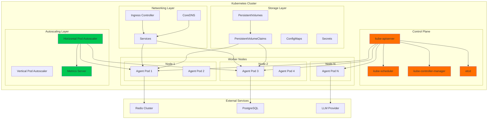
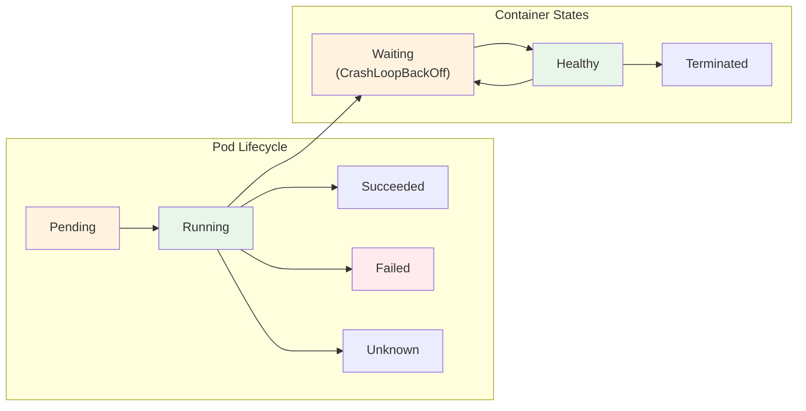
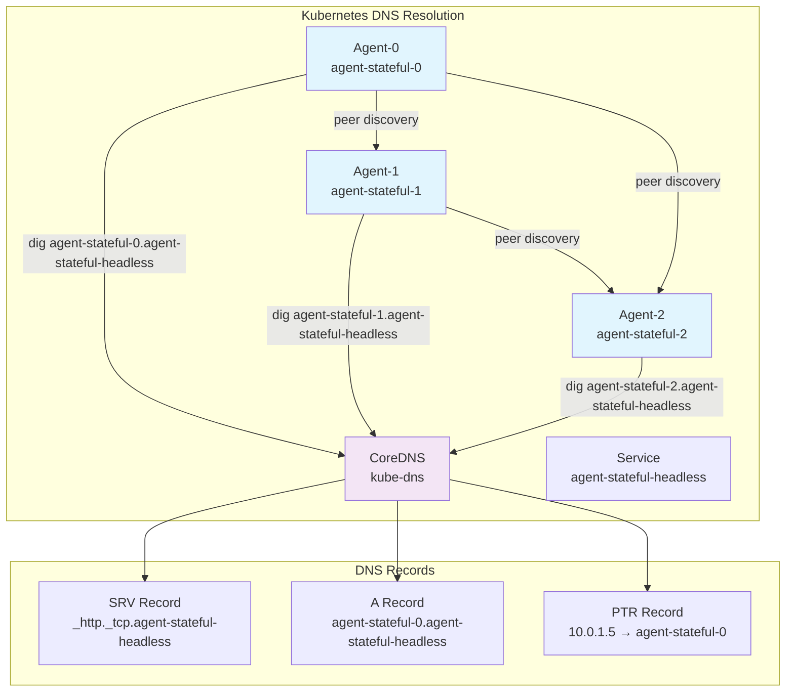
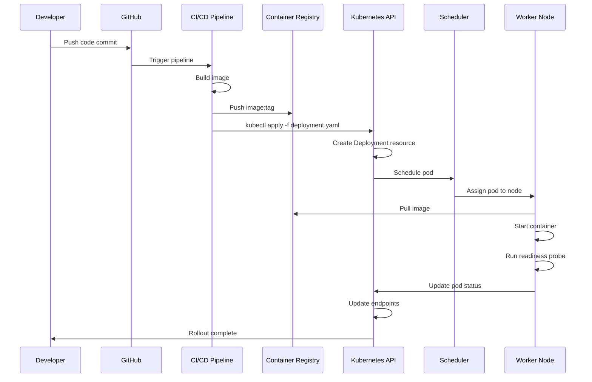
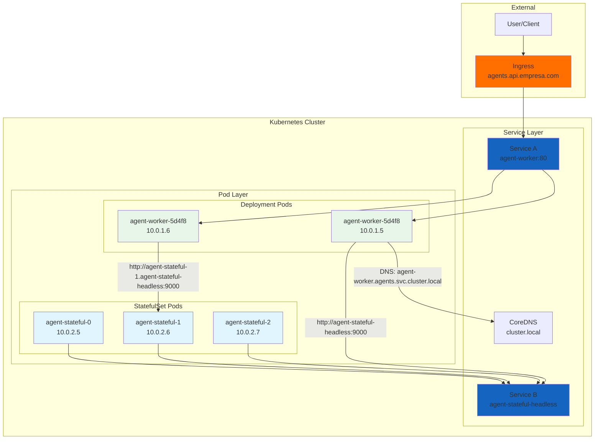

# Clase 14: Kubernetes para Orquestación de Agentes

## Duración
4 horas (240 minutos)

## Objetivos de Aprendizaje
- Desplegar agentes industriales en Kubernetes con Deployments y StatefulSets
- Configurar Services, Ingress y DNS para comunicación entre agentes
- Implementar Horizontal Pod Autoscaler (HPA) con métricas personalizadas
- Gestionar configuración sensible con ConfigMaps y Secrets
- Diseñar estrategias de rollout, rollback y actualización continua
- Desplegar clusters locales con Minikube y k3s para desarrollo

## Contenidos Detallados

### 14.1 Fundamentos de Kubernetes para Agentes (60 minutos)

Kubernetes se ha convertido en el estándar de facto para orquestación de agentes industriales en producción. Proporciona las capacidades necesarias para manejar la naturaleza stateful de los agentes mientras mantiene alta disponibilidad, escalabilidad y resiliencia. A diferencia de aplicaciones web tradicionales, los agentes requieren consideraciones especiales: estado persistente, comunicación entre pares, y ciclos de vida complejos.

#### 14.1.1 Arquitectura de Kubernetes para Agentes



#### 14.1.2 Componentes Clave para Agentes

**Control Plane Components:**
- **kube-apiserver**: Punto de entrada para todas las operaciones del cluster. Los agentes interactúan con la API para registrar su estado y descubrir otros agentes
- **kube-scheduler**: Decide en qué nodo ejecutar cada pod agente, considerando recursos, afinidad y restricciones
- **kube-controller-manager**: Ejecuta controladores que regulan el estado del cluster (ReplicaSet, Deployment, etc.)
- **etcd**: Base de datos clave-valor que almacena todo el estado del cluster. Crítico para la consistencia de la orquestación

**Worker Node Components:**
- **kubelet**: Agente que se ejecuta en cada nodo, asegura que los contenedores estén funcionando
- **kube-proxy**: Maneja las reglas de red en cada nodo, permitiendo la comunicación entre servicios
- **Container Runtime**: Docker, containerd o CRI-O para ejecutar los contenedores

#### 14.1.3 Instalación y Configuración de Clusters Locales

```bash
# Opción 1: Minikube (multiplataforma)
minikube start \
  --cpus=4 \
  --memory=8192 \
  --disk-size=20g \
  --kubernetes-version=v1.28.3 \
  --driver=docker \
  --addons=ingress,metrics-server,dashboard

# Opción 2: k3s (ligero, ideal para edge/agentes)
curl -sfL https://get.k3s.io | sh -s - \
  --write-kubeconfig-mode=644 \
  --disable=traefik \
  --disable=servicelb

# Opción 3: kind (Kubernetes in Docker)
kind create cluster --name agent-cluster --config - <<EOF
kind: Cluster
apiVersion: kind.x-k8s.io/v1alpha4
nodes:
- role: control-plane
- role: worker
  extraMounts:
  - hostPath: ./data
    containerPath: /var/lib/agent-data
- role: worker
EOF

# Verificar el cluster
kubectl cluster-info
kubectl get nodes -o wide
kubectl get pods -A
```

### 14.2 Deployments y StatefulSets para Agentes (70 minutos)

#### 14.2.1 Deployment para Agentes Stateless

Los Deployments son ideales para agentes que no requieren identidad única ni almacenamiento persistente dedicado. Por ejemplo, agentes de procesamiento de mensajes o workers de tareas.

```yaml
# k8s/agent-deployment.yaml
apiVersion: apps/v1
kind: Deployment
metadata:
  name: agent-worker
  namespace: agents
  labels:
    app: agent-worker
    type: processing-agent
    version: v1
spec:
  replicas: 3
  strategy:
    type: RollingUpdate
    rollingUpdate:
      maxSurge: 1
      maxUnavailable: 0
  selector:
    matchLabels:
      app: agent-worker
  template:
    metadata:
      labels:
        app: agent-worker
        type: processing-agent
      annotations:
        prometheus.io/scrape: "true"
        prometheus.io/port: "8000"
        prometheus.io/path: "/metrics"
    spec:
      serviceAccountName: agent-service-account
      securityContext:
        runAsNonRoot: true
        runAsUser: 1000
        runAsGroup: 1000
        fsGroup: 1000
        seccompProfile:
          type: RuntimeDefault
      containers:
      - name: agent
        image: agent-worker:latest
        imagePullPolicy: Always
        ports:
        - containerPort: 8000
          name: http
          protocol: TCP
        - containerPort: 8001
          name: grpc
          protocol: TCP
        env:
        - name: AGENT_ID
          valueFrom:
            fieldRef:
              fieldPath: metadata.name
        - name: POD_IP
          valueFrom:
            fieldRef:
              fieldPath: status.podIP
        - name: REDIS_HOST
          valueFrom:
            configMapKeyRef:
              name: agent-config
              key: redis.host
        - name: REDIS_PORT
          valueFrom:
            configMapKeyRef:
              name: agent-config
              key: redis.port
        - name: OPENAI_API_KEY
          valueFrom:
            secretKeyRef:
              name: agent-secrets
              key: openai-api-key
        resources:
          requests:
            cpu: "250m"
            memory: "512Mi"
          limits:
            cpu: "1000m"
            memory: "2Gi"
        livenessProbe:
          httpGet:
            path: /health
            port: 8000
          initialDelaySeconds: 30
          periodSeconds: 10
          timeoutSeconds: 5
          failureThreshold: 3
        readinessProbe:
          httpGet:
            path: /ready
            port: 8000
          initialDelaySeconds: 10
          periodSeconds: 5
          timeoutSeconds: 3
          successThreshold: 1
          failureThreshold: 3
        startupProbe:
          httpGet:
            path: /startup
            port: 8000
          initialDelaySeconds: 5
          periodSeconds: 5
          failureThreshold: 30
        volumeMounts:
        - name: tmp
          mountPath: /tmp
        - name: agent-config
          mountPath: /home/agent/config
          readOnly: true
      volumes:
      - name: tmp
        emptyDir:
          medium: Memory
          sizeLimit: 100Mi
      - name: agent-config
        configMap:
          name: agent-config
          items:
          - key: agent.yaml
            path: agent.yaml
      affinity:
        podAntiAffinity:
          preferredDuringSchedulingIgnoredDuringExecution:
          - weight: 100
            podAffinityTerm:
              labelSelector:
                matchExpressions:
                - key: app
                  operator: In
                  values:
                  - agent-worker
              topologyKey: kubernetes.io/hostname
      tolerations:
      - key: "agent-dedicated"
        operator: "Equal"
        value: "true"
        effect: "NoSchedule"
```

#### 14.2.2 StatefulSet para Agentes Stateful

Los StatefulSets son necesarios cuando los agentes requieren identidades estables, almacenamiento persistente dedicado, y orden de inicio/terminación garantizado.

```yaml
# k8s/agent-statefulset.yaml
apiVersion: apps/v1
kind: StatefulSet
metadata:
  name: agent-stateful
  namespace: agents
  labels:
    app: agent-stateful
    type: memory-agent
spec:
  serviceName: agent-stateful-headless
  replicas: 3
  podManagementPolicy: OrderedReady
  updateStrategy:
    type: RollingUpdate
    rollingUpdate:
      maxUnavailable: 1
      partition: 0
  selector:
    matchLabels:
      app: agent-stateful
  template:
    metadata:
      labels:
        app: agent-stateful
    spec:
      serviceAccountName: agent-service-account
      terminationGracePeriodSeconds: 60
      containers:
      - name: agent
        image: agent-stateful:latest
        ports:
        - containerPort: 8000
          name: http
        - containerPort: 9000
          name: peer
        env:
        - name: AGENT_ID
          valueFrom:
            fieldRef:
              fieldPath: metadata.name
        - name: AGENT_HOSTNAME
          value: "$(AGENT_NAME).agent-stateful-headless.agents.svc.cluster.local"
        - name: PEER_DISCOVERY
          value: "dns"
        - name: PEER_DOMAIN
          value: "agent-stateful-headless.agents.svc.cluster.local"
        resources:
          requests:
            cpu: "500m"
            memory: "1Gi"
          limits:
            cpu: "2000m"
            memory: "4Gi"
        volumeMounts:
        - name: agent-data
          mountPath: /home/agent/data
        - name: agent-memory
          mountPath: /home/agent/memory
      volumes:
      - name: agent-memory
        emptyDir: {}
  volumeClaimTemplates:
  - metadata:
      name: agent-data
    spec:
      accessModes: [ "ReadWriteOnce" ]
      storageClassName: "standard"
      resources:
        requests:
          storage: 10Gi
```

```python
# src/discovery/dns_discovery.py
import socket
import os
from typing import List, Dict

class DNSBasedDiscovery:
    """
    Descubrimiento de agentes basado en DNS.
    Utiliza el DNS interno de Kubernetes para encontrar peers.
    """
    
    def __init__(self, domain: str = None):
        self.domain = domain or os.getenv(
            'PEER_DOMAIN',
            'agent-stateful-headless.agents.svc.cluster.local'
        )
        self.agent_name = os.getenv('AGENT_ID', 'unknown')
    
    def discover_peers(self) -> List[Dict[str, str]]:
        """Descubre todos los peers del StatefulSet mediante DNS lookup"""
        try:
            # Realizar consulta DNS SRV
            _, _, ips = socket.gethostbyname_ex(self.domain)
            peers = []
            
            for ip in ips:
                try:
                    hostname = socket.gethostbyaddr(ip)[0]
                    peer_id = hostname.split('.')[0]
                    if peer_id != self.agent_name:
                        peers.append({
                            'id': peer_id,
                            'hostname': hostname,
                            'ip': ip,
                            'url': f'http://{hostname}:9000'
                        })
                except socket.herror:
                    continue
            
            return peers
        except socket.gaierror:
            return []
    
    def get_peer_address(self, peer_id: str) -> str:
        """Obtiene la dirección completa de un peer por su ID"""
        return f"{peer_id}.{self.domain}:9000"


# Uso en el agente
discovery = DNSBasedDiscovery()
peers = discovery.discover_peers()
print(f"Agente {discovery.agent_name} descubrió {len(peers)} peers")
for peer in peers:
    print(f"  - {peer['id']} en {peer['url']}")
```

#### 14.2.3 Ciclo de Vida del Pod Agente



**Estados del Pod Agente:**
1. **Pending**: El pod ha sido aceptado pero aún no está en un nodo. Los agentes pueden permanecer aquí si no hay recursos suficientes
2. **Running**: Al menos un contenedor está funcionando. El agente está operativo
3. **Succeeded**: Todos los contenedores terminaron exitosamente (caso de jobs/batch agents)
4. **Failed**: Los contenedores terminaron con error. Kubernetes intentará reiniciar según la política
5. **CrashLoopBackOff**: El contenedor se reinicia repetidamente. Común en agentes con configuraciones incorrectas

### 14.3 Services, Ingress y DNS (50 minutos)

#### 14.3.1 Services para Agentes

```yaml
# k8s/agent-services.yaml
---
# ClusterIP - comunicación interna entre agentes
apiVersion: v1
kind: Service
metadata:
  name: agent-worker
  namespace: agents
  labels:
    app: agent-worker
spec:
  type: ClusterIP
  ports:
  - port: 80
    targetPort: 8000
    protocol: TCP
    name: http
  - port: 9000
    targetPort: 9000
    protocol: TCP
    name: grpc
  selector:
    app: agent-worker

---
# Headless Service - discovery directo de pods (StatefulSet)
apiVersion: v1
kind: Service
metadata:
  name: agent-stateful-headless
  namespace: agents
  labels:
    app: agent-stateful
spec:
  clusterIP: None
  ports:
  - port: 8000
    targetPort: 8000
    protocol: TCP
    name: http
  - port: 9000
    targetPort: 9000
    protocol: TCP
    name: peer
  selector:
    app: agent-stateful

---
# NodePort - acceso externo para desarrollo
apiVersion: v1
kind: Service
metadata:
  name: agent-dev-external
  namespace: agents
spec:
  type: NodePort
  ports:
  - port: 8000
    targetPort: 8000
    nodePort: 30080
    name: http
  selector:
    app: agent-worker
```

#### 14.3.2 DNS Interno para Comunicación entre Agentes



**Patrón de DNS para Agentes:**
```bash
# Formato de DNS para pods individuales (StatefulSet)
# <pod-name>.<service-name>.<namespace>.svc.cluster.local

agent-stateful-0.agent-stateful-headless.agents.svc.cluster.local
agent-stateful-1.agent-stateful-headless.agents.svc.cluster.local
agent-stateful-2.agent-stateful-headless.agents.svc.cluster.local

# Formato de DNS para service (Deployment)
agent-worker.agents.svc.cluster.local

# Verificar resolución DNS desde un pod
kubectl exec -n agents agent-stateful-0 -- nslookup agent-stateful-1.agent-stateful-headless
kubectl exec -n agents agent-stateful-0 -- dig SRV agent-stateful-headless.agents.svc.cluster.local
```

#### 14.3.3 Ingress para Agentes

```yaml
# k8s/agent-ingress.yaml
apiVersion: networking.k8s.io/v1
kind: Ingress
metadata:
  name: agent-api-ingress
  namespace: agents
  annotations:
    nginx.ingress.kubernetes.io/rewrite-target: /$2
    nginx.ingress.kubernetes.io/proxy-body-size: "50m"
    nginx.ingress.kubernetes.io/proxy-read-timeout: "300"
    nginx.ingress.kubernetes.io/proxy-send-timeout: "300"
    nginx.ingress.kubernetes.io/proxy-buffering: "on"
    nginx.ingress.kubernetes.io/proxy-buffer-size: "8k"
    cert-manager.io/cluster-issuer: "letsencrypt-prod"
    nginx.ingress.kubernetes.io/enable-cors: "true"
    nginx.ingress.kubernetes.io/cors-allow-origin: "https://app.empresa.com"
    nginx.ingress.kubernetes.io/limit-rps: "100"
spec:
  ingressClassName: nginx
  tls:
  - hosts:
    - agents.api.empresa.com
    secretName: agent-tls-secret
  rules:
  - host: agents.api.empresa.com
    http:
      paths:
      - path: /api/v1/agents(/|$)(.*)
        pathType: ImplementationSpecific
        backend:
          service:
            name: agent-worker
            port:
              number: 80
      - path: /api/v1/admin(/|$)(.*)
        pathType: ImplementationSpecific
        backend:
          service:
            name: agent-admin
            port:
              number: 80
      - path: /ws(/|$)(.*)
        pathType: ImplementationSpecific
        backend:
          service:
            name: agent-websocket
            port:
              number: 8080
```

```yaml
# k8s/agent-ingress-grpc.yaml
# Ingress separado para tráfico gRPC (requiere nginx-ingress específico)
apiVersion: networking.k8s.io/v1
kind: Ingress
metadata:
  name: agent-grpc-ingress
  namespace: agents
  annotations:
    nginx.ingress.kubernetes.io/backend-protocol: "GRPC"
    nginx.ingress.kubernetes.io/grpc-read-timeout: "3600"
    nginx.ingress.kubernetes.io/grpc-send-timeout: "3600"
spec:
  ingressClassName: nginx
  rules:
  - host: agents-grpc.empresa.com
    http:
      paths:
      - path: /
        pathType: Prefix
        backend:
          service:
            name: agent-worker
            port:
              number: 9000
```

### 14.4 ConfigMaps y Secrets para Agentes (45 minutos)

#### 14.4.1 ConfigMap: Configuración No Sensible

```yaml
# k8s/configmap.yaml
apiVersion: v1
kind: ConfigMap
metadata:
  name: agent-config
  namespace: agents
data:
  # Configuración YAML completa del agente
  agent.yaml: |
    agent:
      name: ${AGENT_ID}
      version: "2.1.0"
      max_retries: 3
      timeout_seconds: 30
      idle_timeout: 300
    
    llm:
      provider: openai
      model: gpt-4-turbo
      temperature: 0.7
      max_tokens: 2000
      streaming: true
    
    memory:
      type: hybrid
      short_term:
        backend: redis
        ttl: 3600
      long_term:
        backend: postgres
        vector_dim: 1536
    
    logging:
      level: INFO
      format: json
      output: stdout
      otel_endpoint: http://otel-collector:4318
    
    features:
      auto_recovery: true
      peer_discovery: true
      circuit_breaker: true
      rate_limiting: true
  
  # Variables individuales
  redis.host: "redis-master"
  redis.port: "6379"
  redis.db: "0"
  postgres.host: "postgres-master"
  postgres.port: "5432"
  postgres.db: "agent_prod"
  chroma.host: "chroma-service"
  chroma.port: "8000"
  log.level: "INFO"
  log.format: "json"
```

#### 14.4.2 Secrets: Configuración Sensible

```yaml
# k8s/secrets.yaml
apiVersion: v1
kind: Secret
metadata:
  name: agent-secrets
  namespace: agents
type: Opaque
stringData:
  redis.password: "redis-secure-password-123"
  postgres.password: "postgres-secure-password-456"
  openai-api-key: "sk-proj-..."
  chroma.api-key: "chroma-api-key-789"
  jwt-secret: "jwt-secret-key-for-agent-auth"
  webhook-signing-key: "whsec_..."
---
# Secrets con Docker Registry para pull de imágenes
apiVersion: v1
kind: Secret
metadata:
  name: registry-credentials
  namespace: agents
type: kubernetes.io/dockerconfigjson
stringData:
  .dockerconfigjson: |
    {"auths":{"https://index.docker.io/v1/":{"username":"agentuser","password":"token","auth":"base64-encoded-creds"}}}
```

```bash
# Comandos para gestionar Secrets
# Crear secret desde archivo
kubectl create secret generic agent-secrets \
  --from-file=secrets/redis-password.txt \
  --from-file=secrets/postgres-password.txt \
  --from-file=secrets/openai-key.txt \
  -n agents

# Crear secret desde literales
kubectl create secret generic agent-secrets \
  --from-literal=redis.password=secure-pass \
  --from-literal=postgres.password=secure-pass \
  -n agents

# Ver secrets (solo metadata)
kubectl get secrets -n agents

# Ver contenido secreto (base64)
kubectl get secret agent-secrets -n agents -o yaml

# Decodificar secret
kubectl get secret agent-secrets -n agents -o jsonpath="{.data.redis\.password}" | base64 -d

# Usar Sealed Secrets para GitOps
# kubeseal < agent-secrets.yaml > sealed-agent-secrets.yaml
```

#### 14.4.3 Service Account y RBAC para Agentes

```yaml
# k8s/service-account.yaml
apiVersion: v1
kind: ServiceAccount
metadata:
  name: agent-service-account
  namespace: agents
  annotations:
    eks.amazonaws.com/role-arn: "arn:aws:iam::123456789:role/agent-role"
---
apiVersion: rbac.authorization.k8s.io/v1
kind: Role
metadata:
  name: agent-role
  namespace: agents
rules:
- apiGroups: [""]
  resources: ["pods", "services", "endpoints"]
  verbs: ["get", "list", "watch"]
- apiGroups: [""]
  resources: ["configmaps", "secrets"]
  verbs: ["get"]
- apiGroups: ["coordination.k8s.io"]
  resources: ["leases"]
  verbs: ["get", "create", "update"]
---
apiVersion: rbac.authorization.k8s.io/v1
kind: RoleBinding
metadata:
  name: agent-role-binding
  namespace: agents
roleRef:
  apiGroup: rbac.authorization.k8s.io
  kind: Role
  name: agent-role
subjects:
- kind: ServiceAccount
  name: agent-service-account
  namespace: agents
```

### 14.5 Horizontal Pod Autoscaler (HPA) para Agentes (60 minutos)

#### 14.5.1 HPA con Métricas de CPU y Memoria

```yaml
# k8s/agent-hpa-resource.yaml
apiVersion: autoscaling/v2
kind: HorizontalPodAutoscaler
metadata:
  name: agent-hpa-resource
  namespace: agents
spec:
  scaleTargetRef:
    apiVersion: apps/v1
    kind: Deployment
    name: agent-worker
  minReplicas: 2
  maxReplicas: 20
  metrics:
  - type: Resource
    resource:
      name: cpu
      target:
        type: Utilization
        averageUtilization: 70
  - type: Resource
    resource:
      name: memory
      target:
        type: Utilization
        averageUtilization: 80
  behavior:
    scaleDown:
      stabilizationWindowSeconds: 300
      policies:
      - type: Percent
        value: 10
        periodSeconds: 60
      - type: Pods
        value: 2
        periodSeconds: 60
      selectPolicy: Min
    scaleUp:
      stabilizationWindowSeconds: 0
      policies:
      - type: Percent
        value: 100
        periodSeconds: 15
      - type: Pods
        value: 4
        periodSeconds: 15
      selectPolicy: Max
```

#### 14.5.2 HPA con Métricas Personalizadas (Prometheus)

```yaml
# k8s/agent-hpa-custom.yaml
apiVersion: autoscaling/v2
kind: HorizontalPodAutoscaler
metadata:
  name: agent-hpa-custom
  namespace: agents
spec:
  scaleTargetRef:
    apiVersion: apps/v1
    kind: Deployment
    name: agent-worker
  minReplicas: 2
  maxReplicas: 20
  metrics:
  # Métrica personalizada: decisiones por segundo
  - type: Pods
    pods:
      metric:
        name: agent_decisions_per_second
      target:
        type: AverageValue
        averageValue: "50"
  # Métrica personalizada: tamaño de cola de requests
  - type: Object
    object:
      describedObject:
        apiVersion: v1
        kind: Service
        name: agent-worker
      metric:
        name: agent_request_queue_depth
      target:
        type: Value
        value: "100"
  # Métrica personalizada: conexiones activas
  - type: Pods
    pods:
      metric:
        name: agent_active_connections
      target:
        type: AverageValue
        averageValue: "20"
  behavior:
    scaleDown:
      stabilizationWindowSeconds: 300
      policies:
      - type: Pods
        value: 1
        periodSeconds: 120
    scaleUp:
      stabilizationWindowSeconds: 0
      policies:
      - type: Percent
        value: 200
        periodSeconds: 30
      - type: Pods
        value: 4
        periodSeconds: 15
      selectPolicy: Max
```

```python
# src/metrics/prometheus_metrics.py
from prometheus_client import Counter, Histogram, Gauge, generate_latest
from fastapi import FastAPI, Response
import time
import random

app = FastAPI()

# Métricas de agente
decisions_total = Counter(
    'agent_decisions_total',
    'Total de decisiones tomadas',
    ['agent_id', 'decision_type', 'status']
)

decisions_duration = Histogram(
    'agent_decision_duration_seconds',
    'Duración de decisiones',
    ['agent_id', 'decision_type'],
    buckets=(0.1, 0.5, 1.0, 2.0, 5.0, 10.0, 30.0)
)

request_queue_depth = Gauge(
    'agent_request_queue_depth',
    'Profundidad actual de la cola de requests',
    ['agent_id']
)

active_connections = Gauge(
    'agent_active_connections',
    'Conexiones activas al agente',
    ['agent_id']
)

memory_usage = Gauge(
    'agent_memory_usage_bytes',
    'Uso de memoria del agente',
    ['agent_id', 'memory_type']
)

llm_calls_total = Counter(
    'agent_llm_calls_total',
    'Total de llamadas a LLM',
    ['agent_id', 'model', 'provider']
)

llm_tokens_total = Counter(
    'agent_llm_tokens_total',
    'Total de tokens usados en LLM',
    ['agent_id', 'direction']  # input/output
)


@app.get("/metrics")
async def metrics():
    """Endpoint de métricas para Prometheus"""
    return Response(
        content=generate_latest(),
        media_type="text/plain"
    )


@app.post("/api/decide")
async def make_decision(agent_id: str, decision_type: str):
    """Ejemplo de endpoint que registra métricas"""
    start = time.time()
    
    try:
        # Simular decisión del agente
        duration = random.uniform(0.1, 3.0)
        time.sleep(duration)
        
        decisions_total.labels(
            agent_id=agent_id,
            decision_type=decision_type,
            status="success"
        ).inc()
        
        decisions_duration.labels(
            agent_id=agent_id,
            decision_type=decision_type
        ).observe(duration)
        
        return {"status": "success", "duration": duration}
    
    except Exception as e:
        decisions_total.labels(
            agent_id=agent_id,
            decision_type=decision_type,
            status="error"
        ).inc()
        raise


# Actualizar métricas de gauge periódicamente
async def update_gauges():
    """Actualiza métricas de gauge en background"""
    agent_id = os.getenv('AGENT_ID', 'unknown')
    while True:
        request_queue_depth.labels(agent_id=agent_id).set(
            random.randint(0, 200)
        )
        active_connections.labels(agent_id=agent_id).set(
            random.randint(5, 50)
        )
        await asyncio.sleep(15)
```

#### 14.5.3 Instalación de Metrics Server y Prometheus Adapter

```bash
# 1. Instalar Metrics Server (métricas de resource)
kubectl apply -f https://github.com/kubernetes-sigs/metrics-server/releases/latest/download/components.yaml

# 2. Instalar Prometheus Stack (incluye adapter)
helm repo add prometheus-community https://prometheus-community.github.io/helm-charts
helm repo update

helm install prometheus prometheus-community/kube-prometheus-stack \
  --namespace monitoring \
  --create-namespace \
  --set prometheus.prometheusSpec.podMonitorSelectorNilUsesHelmValues=false \
  --set prometheus.prometheusSpec.serviceMonitorSelectorNilUsesHelmValues=false

# 3. Verificar que el adapter está funcionando
kubectl get --raw /apis/custom.metrics.k8s.io/v1beta1 | jq .

# 4. Probar métricas personalizadas
kubectl get --raw /apis/custom.metrics.k8s.io/v1beta1/namespaces/agents/pods/*/agent_decisions_per_second | jq .
```

### 14.6 Estrategias de Rollout y Actualización (35 minutos)

#### 14.6.1 Rolling Update

```yaml
# k8s/rolling-update.yaml
apiVersion: apps/v1
kind: Deployment
metadata:
  name: agent-worker
  namespace: agents
spec:
  replicas: 5
  strategy:
    type: RollingUpdate
    rollingUpdate:
      maxSurge: 1
      maxUnavailable: 0
  minReadySeconds: 30
  revisionHistoryLimit: 10
```

```bash
# Comandos de rollout
# Iniciar rollout con nueva imagen
kubectl set image deployment/agent-worker \
  agent=agent-worker:v2.1.0 \
  -n agents

# Ver estado del rollout
kubectl rollout status deployment/agent-worker -n agents --watch

# Pausar rollout
kubectl rollout pause deployment/agent-worker -n agents

# Reanudar rollout
kubectl rollout resume deployment/agent-worker -n agents

# Deshacer rollout (rollback)
kubectl rollout undo deployment/agent-worker -n agents

# Deshacer a revisión específica
kubectl rollout undo deployment/agent-worker -n agents --to-revision=2

# Ver historial de revisiones
kubectl rollout history deployment/agent-worker -n agents

# Ver detalles de una revisión
kubectl rollout history deployment/agent-worker -n agents --revision=3
```

#### 14.6.2 Blue-Green Deployment

```yaml
# k8s/blue-green/blue-deployment.yaml
apiVersion: apps/v1
kind: Deployment
metadata:
  name: agent-worker-blue
  namespace: agents
  labels:
    app: agent-worker
    version: blue
spec:
  replicas: 3
  selector:
    matchLabels:
      app: agent-worker
      version: blue
  template:
    metadata:
      labels:
        app: agent-worker
        version: blue
    spec:
      containers:
      - name: agent
        image: agent-worker:v2.0.0
        # ... resto de configuración
---
# k8s/blue-green/green-deployment.yaml
apiVersion: apps/v1
kind: Deployment
metadata:
  name: agent-worker-green
  namespace: agents
  labels:
    app: agent-worker
    version: green
spec:
  replicas: 3
  selector:
    matchLabels:
      app: agent-worker
      version: green
  template:
    metadata:
      labels:
        app: agent-worker
        version: green
    spec:
      containers:
      - name: agent
        image: agent-worker:v2.1.0
        # ... resto de configuración
```

```yaml
# k8s/blue-green/service.yaml
apiVersion: v1
kind: Service
metadata:
  name: agent-worker
  namespace: agents
spec:
  type: ClusterIP
  ports:
  - port: 80
    targetPort: 8000
  selector:
    app: agent-worker
    version: green  # Cambiar a blue para rollback
```

#### 14.6.3 Canary Deployment

```yaml
# k8s/canary/canary-deployment.yaml
apiVersion: apps/v1
kind: Deployment
metadata:
  name: agent-worker-canary
  namespace: agents
  labels:
    app: agent-worker
    track: canary
spec:
  replicas: 1  # 10% del tráfico (vs 9 de stable)
  selector:
    matchLabels:
      app: agent-worker
      track: canary
  template:
    metadata:
      labels:
        app: agent-worker
        track: canary
    spec:
      containers:
      - name: agent
        image: agent-worker:v2.1.0-rc1
---
# k8s/canary/service.yaml (con header-based routing)
apiVersion: v1
kind: Service
metadata:
  name: agent-worker
  namespace: agents
  annotations:
    nginx.ingress.kubernetes.io/canary: "true"
    nginx.ingress.kubernetes.io/canary-by-header: "X-Canary"
    nginx.ingress.kubernetes.io/canary-by-header-value: "true"
    nginx.ingress.kubernetes.io/canary-weight: "10"
spec:
  selector:
    app: agent-worker
    track: canary
```

### 14.7 Monitoreo y Observabilidad en Kubernetes (25 minutos)

#### 14.7.1 Dashboard y Recursos

```bash
# Ver estado del cluster y agentes
kubectl get nodes -o wide
kubectl get pods -n agents -o wide --watch
kubectl get deployments -n agents
kubectl get statefulsets -n agents
kubectl get services -n agents
kubectl get ingress -n agents

# Ver logs de agentes
kubectl logs -n agents -l app=agent-worker --tail=100
kubectl logs -n agents agent-worker-5d4f8b7c9-abc12 -f

# Ver logs de todos los contenedores en un pod
kubectl logs -n agents agent-stateful-0 --all-containers

# Ver logs anteriores (pod reiniciado)
kubectl logs -n agents agent-worker-5d4f8b7c9-abc12 --previous

# Ejecutar comandos en agente
kubectl exec -n agents agent-stateful-0 -- agentctl status
kubectl exec -it -n agents agent-worker-5d4f8b7c9-abc12 -- /bin/bash

# Ver uso de recursos
kubectl top pods -n agents
kubectl top nodes
kubectl describe node worker-1

# Port forwarding para desarrollo
kubectl port-forward -n agents svc/agent-worker 8080:80
```

#### 14.7.2 Events y Diagnóstico

```bash
# Ver eventos del namespace
kubectl get events -n agents --sort-by='.lastTimestamp'

# Ver eventos de un pod específico
kubectl describe pod agent-worker-5d4f8b7c9-abc12 -n agents

# Diagnóstico de HPA
kubectl describe hpa agent-hpa-custom -n agents
kubectl get hpa agent-hpa-custom -n agents -o yaml

# Ver métricas del HPA en vivo
kubectl get --raw /apis/autoscaling/v2/namespaces/agents/horizontalpodautoscalers/agent-hpa-custom/status | jq .

# Ver health checks del cluster
kubectl get componentstatuses
```

### 14.8 Resolución de Problemas Comunes

```bash
# Problema: Pod stuck en Pending
kubectl describe pod agent-worker-abc12 -n agents
# Buscar: "0/3 nodes are available" -> recursos insuficientes

# Problema: CrashLoopBackOff
kubectl logs agent-worker-abc12 --previous -n agents
kubectl describe pod agent-worker-abc12 -n agents | grep -A 20 "Last State"

# Problema: ImagePullBackOff
kubectl describe pod agent-worker-abc12 -n agents | grep "Failed to pull image"
# Verificar credenciales del registry

# Problema: Agente no responde a health checks
kubectl exec agent-worker-abc12 -n agents -- curl -v http://localhost:8000/health
kubectl describe pod agent-worker-abc12 -n agents | grep -A 10 "Liveness"

# Problema: HPA no escala
kubectl describe hpa agent-hpa-custom -n agents
# Verificar que metrics-server esté funcionando
kubectl top pods -n agents
```

## Diagramas de Arquitectura

### 14.8.1 Flujo de Despliegue de un Agente



### 14.8.2 Comunicación entre Agentes via Services



## Ejercicios Prácticos

### Ejercicio 1: Despliegue Completo de Agente en Kubernetes (60 minutos)

**Objetivo:** Desplegar un agente industrial completo con todos los recursos necesarios.

**Solución:**

```bash
# 1. Crear namespace
cat <<EOF | kubectl apply -f -
apiVersion: v1
kind: Namespace
metadata:
  name: agents
  labels:
    name: agents
    environment: development
EOF

# 2. Aplicar ConfigMap y Secrets
kubectl apply -f k8s/configmap.yaml
kubectl apply -f k8s/secrets.yaml
kubectl apply -f k8s/service-account.yaml

# 3. Crear PersistentVolumeClaim para datos
cat <<EOF | kubectl apply -f -
apiVersion: v1
kind: PersistentVolumeClaim
metadata:
  name: agent-state-pvc
  namespace: agents
spec:
  accessModes:
    - ReadWriteOnce
  resources:
    requests:
      storage: 10Gi
  storageClassName: standard
EOF

# 4. Desplegar el agente
kubectl apply -f k8s/agent-deployment.yaml
kubectl apply -f k8s/agent-service.yaml

# 5. Configurar HPA
kubectl apply -f k8s/agent-hpa-resource.yaml

# 6. Verificar el despliegue
echo "=== Deployments ==="
kubectl get deployments -n agents -o wide

echo "=== Pods ==="
kubectl get pods -n agents -o wide --show-labels

echo "=== Services ==="
kubectl get services -n agents

echo "=== HPA ==="
kubectl get hpa -n agents

echo "=== Endpoints ==="
kubectl get endpoints -n agents

# 7. Probar conectividad
kubectl run test-pod --image=busybox:1.28 --rm -it --restart=Never -- \
  wget -qO- http://agent-worker.agents.svc.cluster.local/health
```

**Explicación:**
1. El namespace `agents` aísla los recursos de agentes del resto del cluster
2. ConfigMap y Secrets proporcionan configuración externa sin reconstruir imágenes
3. El Deployment garantiza 3 réplicas del agente con rolling updates
4. El Service ClusterIP permite comunicación interna estable
5. El HPA escala automáticamente según CPU/memoria

### Ejercicio 2: Configurar Autoscaling con Métricas Personalizadas (45 minutos)

**Objetivo:** Implementar HPA basado en métricas de negocio del agente.

**Solución:**

```bash
# 1. Verificar que el adapter de métricas está instalado
kubectl get apiservices | grep custom.metrics

# 2. Aplicar el HPA con métricas personalizadas
kubectl apply -f k8s/agent-hpa-custom.yaml

# 3. Generar carga en el agente
kubectl run load-test --image=busybox --rm -it --restart=Never -- /bin/sh -c '
  for i in $(seq 1 100); do
    wget -qO- http://agent-worker.agents.svc.cluster.local/api/decide
    sleep 0.5
  done
'

# 4. Ver escalado en tiempo real
watch -n 2 'kubectl get hpa agent-hpa-custom -n agents && echo "---" && kubectl get pods -n agents -l app=agent-worker'

# 5. Ver métricas
kubectl get --raw /apis/custom.metrics.k8s.io/v1beta1/namespaces/agents/pods/*/agent_decisions_per_second | jq .

# 6. Simular baja de carga y ver scale down
echo "Esperando 5 minutos para stabilización..."
sleep 300
kubectl get hpa agent-hpa-custom -n agents
kubectl get pods -n agents -l app=agent-worker
```

**Explicación del HPA:**
```yaml
# Análisis de las políticas de escalado
metrics:
- type: Pods
  pods:
    metric:
      name: agent_decisions_per_second
    target:
      type: AverageValue
      averageValue: "50"
      # Si el promedio de decisiones por segundo por pod > 50, escala UP
      # Si < 50, escala DOWN (después de ventana de estabilización)

behavior:
  scaleUp:
    stabilizationWindowSeconds: 0  # Escalar inmediatamente
    policies:
    - type: Percent
      value: 200  # Puede duplicar el número de pods
      periodSeconds: 30
    - type: Pods
      value: 4    # O agregar hasta 4 pods
      periodSeconds: 15
    selectPolicy: Max  # Usa la política más agresiva
```

### Ejercicio 3: Implementar StatefulSet con Persistencia (45 minutos)

**Objetivo:** Desplegar un agente stateful con almacenamiento persistente.

**Solución:**

```bash
# 1. Crear StorageClass si no existe
cat <<EOF | kubectl apply -f -
apiVersion: storage.k8s.io/v1
kind: StorageClass
metadata:
  name: agent-storage
provisioner: kubernetes.io/no-provisioner
volumeBindingMode: WaitForFirstConsumer
EOF

# 2. Desplegar StatefulSet
kubectl apply -f k8s/agent-statefulset.yaml

# 3. Verificar creación ordenada
echo "Esperando creación de pods..."
sleep 10
kubectl get pods -n agents -l app=agent-stateful -w

# 4. Verificar PVCs creados automáticamente
kubectl get pvc -n agents -l app=agent-stateful

# 5. Ver identidad de cada pod
for i in 0 1 2; do
  echo "=== agent-stateful-$i ==="
  kubectl exec -n agents agent-stateful-$i -- hostname
  kubectl exec -n agents agent-stateful-$i -- cat /home/agent/config/agent.yaml
  echo ""
done

# 6. Ver comunicación entre peers
kubectl exec -n agents agent-stateful-0 -- \
  curl -s http://agent-stateful-1.agent-stateful-headless.agents.svc.cluster.local:9000/health

# 7. Escalar StatefulSet
kubectl scale statefulset agent-stateful -n agents --replicas=5

# 8. Verificar que los nuevos pods mantienen naming consistente
kubectl get pods -n agents -l app=agent-stateful
# Resultado: agent-stateful-3, agent-stateful-4
```

**Explicación del StatefulSet:**
```yaml
# Características clave:
# 1. PodManagementPolicy: OrderedReady
#    - Los pods se crean en orden: agent-stateful-0, agent-stateful-1, agent-stateful-2
#    - Los pods se eliminan en orden inverso: agent-stateful-4, agent-stateful-3, ...
#
# 2. ServiceName: agent-stateful-headless
#    - DNS estable: agent-stateful-0.agent-stateful-headless.agents.svc.cluster.local
#    - Cada pod tiene un hostname único y predecible
#
# 3. VolumeClaimTemplates
#    - Cada pod recibe su propio PVC: agent-data-agent-stateful-0
#    - Los datos persisten incluso si el pod se elimina
#    - Al recrear el pod, el mismo PVC se reasigna
```

## Tecnologías Específicas

- **Kubernetes**: v1.28+ (cluster)
- **Minikube**: v1.32+ (desarrollo local)
- **k3s**: v1.28+ (edge/lightweight)
- **kind**: v0.20+ (testing/local)
- **Metrics Server**: v0.7+ (resource metrics)
- **Prometheus Adapter**: v0.11+ (custom metrics)
- **Ingress-NGINX**: v1.9+ (ingress controller)
- **cert-manager**: v1.13+ (TLS certificates)
- **Helm**: v3.14+ (package manager)

## Actividades de Laboratorio

### Laboratorio 1: Configuración de Cluster Local (90 minutos)

**Objetivo:** Configurar un cluster Kubernetes local y desplegar agentes.

1. **Instalar herramientas**:
   ```bash
   # Windows (Chocolatey)
   choco install kubernetes-cli minikube helm
   
   # Linux (apt)
   curl -LO "https://dl.k8s.io/release/v1.28.3/bin/linux/amd64/kubectl"
   chmod +x kubectl && sudo mv kubectl /usr/local/bin/
   
   curl -LO https://storage.googleapis.com/minikube/releases/latest/minikube-linux-amd64
   sudo install minikube-linux-amd64 /usr/local/bin/minikube
   ```

2. **Iniciar cluster**:
   ```bash
   minikube start --cpus=4 --memory=8192
   minikube addons enable ingress
   minikube addons enable metrics-server
   minikube addons enable dashboard
   ```

3. **Verificar cluster**:
   ```bash
   kubectl cluster-info
   kubectl get nodes
   kubectl get pods -A
   minikube dashboard
   ```

4. **Desplegar stack de monitoreo**:
   ```bash
   helm repo add prometheus-community https://prometheus-community.github.io/helm-charts
   helm install prometheus prometheus-community/kube-prometheus-stack \
     --namespace monitoring --create-namespace
   ```

5. **Desplegar agente de ejemplo** y probar escalado

### Laboratorio 2: Pruebas de Escalado y Resiliencia (90 minutos)

**Objetivo:** Probar estrategias de escalado y recuperación ante fallos.

1. **Probar escalado manual**:
   ```bash
   kubectl scale deployment agent-worker -n agents --replicas=10
   kubectl rollout status deployment/agent-worker -n agents
   ```

2. **Simular fallo de nodo**:
   ```bash
   # En Minikube: detener el nodo
   minikube stop
   
   # Observar cómo Kubernetes reprograma los pods
   kubectl get pods -n agents -o wide
   
   # Reactivar
   minikube start
   ```

3. **Probar auto-recuperación**:
   ```bash
   # Matar un proceso de agente dentro del pod
   kubectl exec -n agents agent-worker-xxxxx -- kill 1
   
   # Ver el reinicio automático
   kubectl get pods -n agents -w
   ```

4. **Probar HPA con carga sintética**:
   Generar carga incrementando requests
   Observar escalado vertical en tiempo real
   Verificar scale down después de la carga

## Resumen de Puntos Clave

1. **Deployments vs StatefulSets**: Usar Deployments para agentes stateless sin identidad fija; StatefulSets cuando los agentes necesitan identidad estable, almacenamiento persistente dedicado y orden de inicio garantizado.

2. **Services y DNS**: Los Services ClusterIP proporcionan balanceo de carga interno; los Headless Services permiten descubrimiento directo de pods para comunicación peer-to-peer entre agentes. CoreDNS maneja la resolución de nombres dentro del cluster.

3. **Configuración externa**: ConfigMaps almacenan configuración no sensible (hosts, puertos, niveles de log); Secrets almacenan credenciales y claves API. Ambos se inyectan como variables de entorno o volúmenes montados.

4. **HPA con métricas múltiples**: Combinar métricas de Resource (CPU/memoria) con métricas personalizadas (decisiones/segundo, cola de requests) permite escalado basado en la carga real de trabajo de los agentes. Las políticas de comportamiento controlan la agresividad del escalado.

5. **Estrategias de actualización**: RollingUpdate para actualizaciones sin downtime; Blue-Green para cambios completos con rollback instantáneo; Canary para releases graduales con validación de tráfico real.

6. **Persistencia**: Los PersistentVolumeClaims (PVC) proporcionan almacenamiento que sobrevive a reinicios de pods. Los StatefulSets usan VolumeClaimTemplates para crear PVCs automáticos por pod.

## Referencias Externas

1. **Kubernetes Documentation** - Documentación oficial de Kubernetes
   https://kubernetes.io/docs/

2. **Horizontal Pod Autoscaler** - Guía completa de HPA
   https://kubernetes.io/docs/tasks/run-application/horizontal-pod-autoscale/

3. **StatefulSet Documentation** - StatefulSets en Kubernetes
   https://kubernetes.io/docs/concepts/workloads/controllers/statefulset/

4. **ConfigMaps y Secrets** - Gestión de configuración
   https://kubernetes.io/docs/concepts/configuration/configmap/

5. **Ingress Controllers** - NGINX Ingress Controller
   https://kubernetes.github.io/ingress-nginx/

6. **Minikube** - Kubernetes local para desarrollo
   https://minikube.sigs.k8s.io/docs/

7. **k3s** - Kubernetes ligero para edge
   https://docs.k3s.io/

8. **Prometheus Adapter** - Métricas personalizadas para HPA
   https://github.com/kubernetes-sigs/prometheus-adapter

9. **Metrics Server** - Métricas de resource para Kubernetes
   https://github.com/kubernetes-sigs/metrics-server

10. **Kubernetes DNS** - CoreDNS y resolución de nombres
    https://kubernetes.io/docs/concepts/services-networking/dns-pod-service/

11. **Kubectl Cheat Sheet** - Comandos rápidos de kubectl
    https://kubernetes.io/docs/reference/kubectl/cheatsheet/

12. **Helm Package Manager** - Gestión de paquetes Kubernetes
    https://helm.sh/docs/
