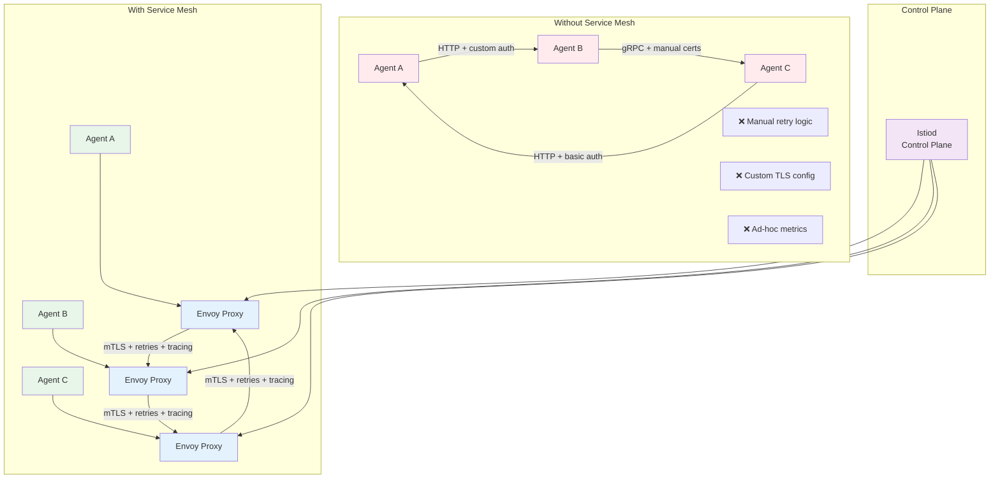
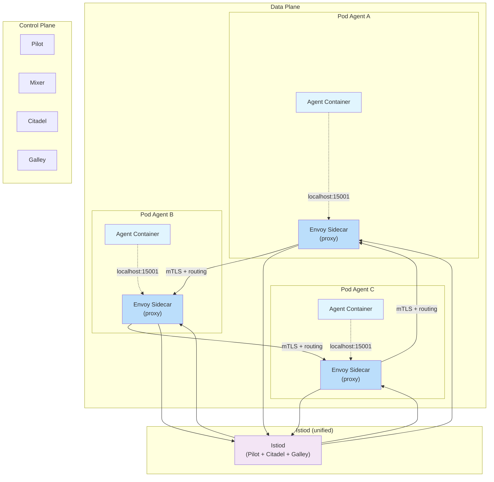
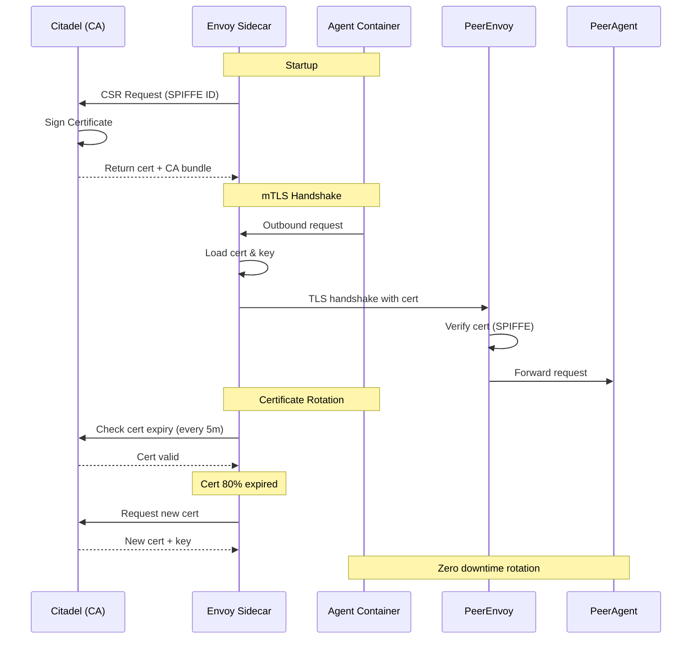
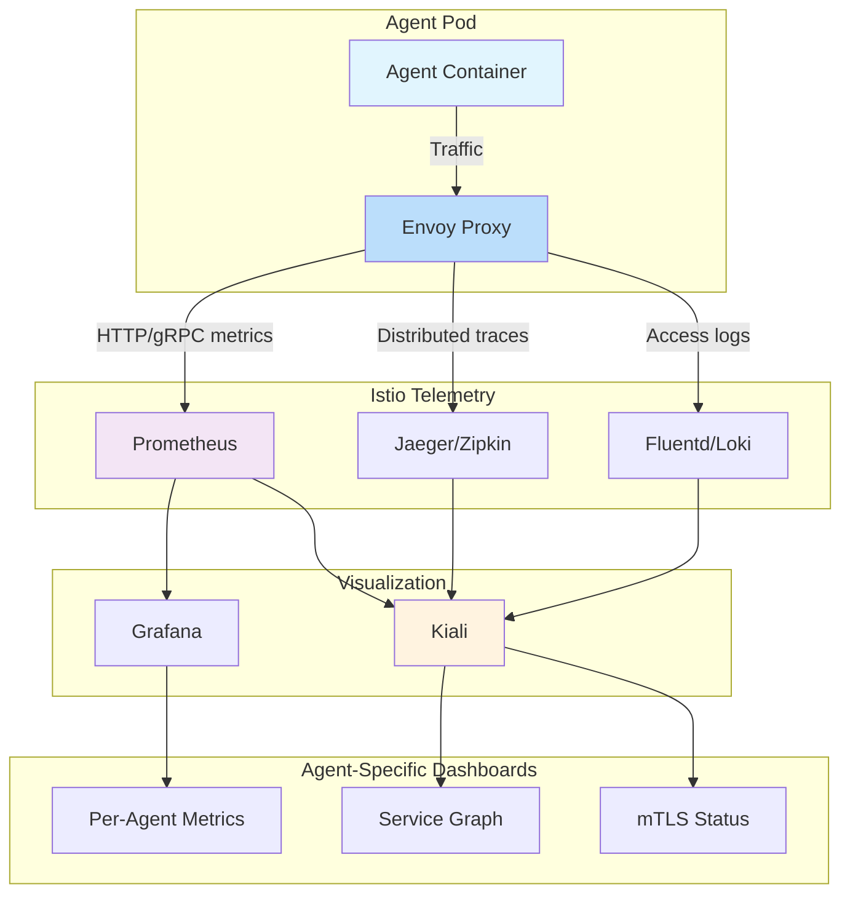

# Clase 15: Service Mesh para Agentes

## Duración
4 horas (240 minutos)

## Objetivos de Aprendizaje
- Comprender los fundamentos de Service Mesh y su aplicabilidad a arquitecturas de agentes
- Implementar Istio en un cluster Kubernetes para gestión de tráfico entre agentes
- Configurar mTLS (mutual TLS) para comunicación segura entre agentes
- Implementar traffic management avanzado: routing, retries, timeouts, circuit breaking
- Utilizar la observabilidad automática del Service Mesh para monitorear agentes
- Desplegar Envoy como proxy sidecar junto a contenedores de agentes

## Contenidos Detallados

### 15.1 Fundamentos de Service Mesh para Agentes (60 minutos)

Un Service Mesh es una capa de infraestructura dedicada que gestiona la comunicación entre servicios mediante proxies sidecar. En el contexto de agentes industriales, el Service Mesh resuelve problemas críticos de comunicación, seguridad y observabilidad que surgen cuando docenas o cientos de agentes necesitan coordinarse.

#### 15.1.1 Problemas de Comunicación en Arquitecturas de Agentes



**Problemas resueltos por Service Mesh:**
1. **Seguridad**: Cada agente necesitaría implementar TLS, manejar certificados y rotarlos manualmente
2. **Resiliencia**: Los agentes deben implementar retries, timeouts, circuit breakers por su cuenta
3. **Observabilidad**: Sin mesh, cada agente debe exponer métricas y traces de forma independiente
4. **Routing**: El descubrimiento de peers y balanceo de carga requiere lógica adicional en cada agente
5. **Protocol Heterogeneity**: Diferentes agentes pueden usar HTTP, gRPC, o protocolos binarios

#### 15.1.2 Arquitectura de Istio



**Componentes de Istio:**

| Componente | Función | Relevancia para Agentes |
|-----------|---------|------------------------|
| **Envoy Proxy** | Proxy sidecar en cada pod | Intercepta todo el tráfico de red del agente |
| **Istiod** | Plano de control unificado | Gestiona configuración, certificados y descubrimiento |
| **Pilot** | Gestión de tráfico | Servicio de descubrimiento y balanceo de carga |
| **Citadel** | Seguridad y certificados | Emisión y rotación automática de certificados mTLS |
| **Galley** | Validación de configuración | Asegura que las configuraciones de malla sean correctas |

#### 15.1.3 Instalación de Istio

```bash
# Descargar Istio
curl -L https://istio.io/downloadIstio | sh -
cd istio-1.21.0
export PATH=$PWD/bin:$PATH

# Instalar Istio en el cluster
istioctl install --set profile=demo -y

# Verificar instalación
istioctl verify-install
kubectl get pods -n istio-system
kubectl get svc -n istio-system

# Habilitar inyección automática de sidecar en namespace de agentes
kubectl label namespace agents istio-injection=enabled

# Verificar que el namespace está etiquetado
kubectl get namespace agents --show-labels

# Instalar addons (Kiali, Prometheus, Grafana, Jaeger)
kubectl apply -f samples/addons
kubectl rollout status deployment/kiali -n istio-system
```

### 15.2 Traffic Management para Agentes (75 minutos)

#### 15.2.1 VirtualService y DestinationRule

```yaml
# 15-istio/virtual-service-agent.yaml
apiVersion: networking.istio.io/v1beta1
kind: VirtualService
metadata:
  name: agent-worker-vs
  namespace: agents
spec:
  hosts:
  - agent-worker
  http:
  # Routing basado en header para canary deployments
  - match:
    - headers:
        x-canary:
          exact: "true"
    route:
    - destination:
        host: agent-worker
        subset: v2
      weight: 100
  # Routing normal con weight-based
  - route:
    - destination:
        host: agent-worker
        subset: v1
      weight: 90
    - destination:
        host: agent-worker
        subset: v2
      weight: 10
    # Retry configuration
    retries:
      attempts: 3
      perTryTimeout: 2s
      retryOn: connect-failure,refused-stream,503
    # Timeout configuration
    timeout: 30s
    # Fault injection (testing only)
    # fault:
    #   delay:
    #     percentage:
    #       value: 0.1
    #     fixedDelay: 5s
---
apiVersion: networking.istio.io/v1beta1
kind: DestinationRule
metadata:
  name: agent-worker-dr
  namespace: agents
spec:
  host: agent-worker
  trafficPolicy:
    connectionPool:
      tcp:
        maxConnections: 100
      http:
        http1MaxPendingRequests: 10
        http2MaxRequests: 1000
        maxRequestsPerConnection: 10
    loadBalancer:
      simple: ROUND_ROBIN
      consistentHash:
        httpHeaderName: x-agent-id
    outlierDetection:
      consecutive5xxErrors: 5
      interval: 30s
      baseEjectionTime: 60s
      maxEjectionPercent: 50
  subsets:
  - name: v1
    labels:
      version: v1
  - name: v2
    labels:
      version: v2
    trafficPolicy:
      loadBalancer:
        simple: ROUND_ROBIN
```

#### 15.2.2 Routing entre Agentes Stateful

```yaml
# 15-istio/virtual-service-stateful.yaml
apiVersion: networking.istio.io/v1beta1
kind: VirtualService
metadata:
  name: agent-stateful-vs
  namespace: agents
spec:
  hosts:
  - agent-stateful-headless
  http:
  - route:
    - destination:
        host: agent-stateful-headless
        port:
          number: 9000
    timeout: 60s
    retries:
      attempts: 5
      perTryTimeout: 10s
      retryOn: connect-failure,refused-stream,503,retriable-status-codes
    # Headers para tracing
    headers:
      request:
        set:
          x-agent-source: "%REQ(USER-AGENT)%"
          x-trace-id: "%ENVIRONMENT(AGENT_ID)%"
---
apiVersion: networking.istio.io/v1beta1
kind: DestinationRule
metadata:
  name: agent-stateful-dr
  namespace: agents
spec:
  host: agent-stateful-headless
  trafficPolicy:
    tls:
      mode: ISTIO_MUTUAL
    connectionPool:
      tcp:
        maxConnections: 50
        connectTimeout: 5s
      http:
        http2MaxRequests: 500
        maxRequestsPerConnection: 100
    loadBalancer:
      simple: ROUND_ROBIN
    outlierDetection:
      consecutiveGatewayErrors: 3
      interval: 20s
      baseEjectionTime: 30s
      maxEjectionPercent: 30
```

#### 15.2.3 Circuit Breaking para Agentes

```yaml
# 15-istio/circuit-breaker.yaml
apiVersion: networking.istio.io/v1beta1
kind: DestinationRule
metadata:
  name: agent-circuit-breaker
  namespace: agents
spec:
  host: agent-worker
  trafficPolicy:
    connectionPool:
      tcp:
        maxConnections: 10
        connectTimeout: 3s
      http:
        http1MaxPendingRequests: 5
        http2MaxRequests: 100
        maxRequestsPerConnection: 5
    outlierDetection:
      consecutiveLocalOriginFailures: 3
      consecutiveGatewayErrors: 5
      interval: 10s
      baseEjectionTime: 60s
      maxEjectionPercent: 60
      minHealthPercent: 25
```

```python
# src/agent/circuit_breaker_aware.py
"""
Agente consciente del circuit breaker de Istio.
Detecta cuándo el circuito está abierto y actúa en consecuencia.
"""
import httpx
import logging
from typing import Optional, Dict, Any
from datetime import datetime, timedelta

logger = logging.getLogger(__name__)


class CircuitBreakerAwareAgent:
    """
    Agente que maneja estados de circuit breaker.
    En lugar de depender solo de Istio, también reacciona a nivel de aplicación.
    """
    
    def __init__(self, agent_id: str, peer_url: str):
        self.agent_id = agent_id
        self.peer_url = peer_url
        self.client = httpx.AsyncClient(
            timeout=30.0,
            limits=httpx.Limits(max_connections=10, max_keepalive_connections=5),
            headers={"x-agent-id": agent_id}
        )
        self.circuit_open = False
        self.last_failure: Optional[datetime] = None
        self.failure_count = 0
        self.threshold = 5
        self.recovery_timeout = timedelta(seconds=60)
    
    async def call_peer(self, endpoint: str, payload: Dict) -> Dict[str, Any]:
        """Llama a un peer agente con manejo de circuit breaker"""
        
        if self.circuit_open:
            if datetime.now() - self.last_failure < self.recovery_timeout:
                logger.warning(f"Circuito abierto para {self.peer_url}, "
                              f"reintentando en {self.recovery_timeout.seconds}s")
                return {"status": "circuit_open", "fallback": True}
            else:
                logger.info("Half-open: probando recuperación")
                self.circuit_open = False
                self.failure_count = 0
        
        try:
            response = await self.client.post(
                f"{self.peer_url}{endpoint}",
                json=payload,
                headers={"x-circuit-test": "true"}
            )
            
            if response.status_code == 503 and "circuit_breaker" in response.text:
                self._record_failure()
                return await self._handle_circuit_breaker()
            
            self.failure_count = 0
            return response.json()
            
        except (httpx.ConnectError, httpx.TimeoutException) as e:
            self._record_failure()
            logger.error(f"Error conectando a peer: {e}")
            return {"status": "error", "message": str(e)}
    
    def _record_failure(self):
        """Registra un fallo y posiblemente abre el circuito"""
        self.failure_count += 1
        self.last_failure = datetime.now()
        
        if self.failure_count >= self.threshold:
            self.circuit_open = True
            logger.warning(f"Circuit breaker abierto [{self.failure_count} fallos]")
    
    async def _handle_circuit_breaker(self) -> Dict[str, Any]:
        """Maneja respuesta de circuit breaker"""
        return {
            "status": "degraded",
            "fallback": True,
            "message": "Usando respuesta en caché",
            "cached_data": await self._get_cached_response()
        }
    
    async def _get_cached_response(self) -> Optional[Dict]:
        """Obtiene respuesta en caché como fallback"""
        # Implementar lógica de caché local
        return None
    
    async def close(self):
        await self.client.aclose()
```

### 15.3 mTLS entre Agentes (45 minutos)

#### 15.3.1 Configuración de Seguridad con mTLS

```yaml
# 15-istio/mtls-config.yaml
---
# Política de mTLS estricta para todo el namespace de agentes
apiVersion: security.istio.io/v1beta1
kind: PeerAuthentication
metadata:
  name: agent-mtls-strict
  namespace: agents
spec:
  mtls:
    mode: STRICT  # STRICT | PERMISSIVE | DISABLE
  portLevelMtls:
    9000:
      mode: STRICT  # Puerto de comunicación entre agentes
    8000:
      mode: PERMISSIVE  # Puerto HTTP para health checks

---
# Política de mTLS específica para comunicación entre agentes stateful
apiVersion: security.istio.io/v1beta1
kind: PeerAuthentication
metadata:
  name: agent-stateful-mtls
  namespace: agents
spec:
  selector:
    matchLabels:
      app: agent-stateful
  mtls:
    mode: STRICT
  portLevelMtls:
    "9000":
      mode: STRICT
```

#### 15.3.2 Authorization Policy para Agentes

```yaml
# 15-istio/authorization-policy.yaml
---
# Política de autorización: solo agentes específicos pueden hablar entre sí
apiVersion: security.istio.io/v1beta1
kind: AuthorizationPolicy
metadata:
  name: agent-worker-auth
  namespace: agents
spec:
  selector:
    matchLabels:
      app: agent-worker
  action: ALLOW
  rules:
  - from:
    - source:
        principals: ["cluster.local/ns/agents/sa/agent-service-account"]
    - source:
        namespaces: ["agents"]
    to:
    - operation:
        ports: ["8000", "9000"]
        methods: ["GET", "POST"]
        paths: ["/api/*", "/health", "/ready"]
    when:
    - key: request.headers[X-Agent-ID]
      values: ["agent-prod-*"]

---
# Denegar acceso explícito desde fuera del mesh
apiVersion: security.istio.io/v1beta1
kind: AuthorizationPolicy
metadata:
  name: agent-deny-external
  namespace: agents
spec:
  selector:
    matchLabels:
      app: agent-worker
  action: DENY
  rules:
  - from:
    - source:
        notPrincipals: ["cluster.local/ns/agents/sa/agent-service-account"]
    - source:
        notNamespaces: ["agents"]

---
# Política para permitir acceso desde el Ingress
apiVersion: security.istio.io/v1beta1
kind: AuthorizationPolicy
metadata:
  name: agent-ingress-auth
  namespace: agents
spec:
  selector:
    matchLabels:
      app: agent-worker
  action: ALLOW
  rules:
  - from:
    - source:
        namespaces: ["istio-system"]
        principals: ["cluster.local/ns/istio-system/sa/istio-ingressgateway-service-account"]
    to:
    - operation:
        ports: ["8000"]
        paths: ["/api/v1/public/*"]
```

#### 15.3.3 Certificados y Rotación Automática



**SPIFFE (Secure Production Identity Framework for Everyone):**
```bash
# Identidad SPIFFE de cada agente en el mesh
# Formato: spiffe://cluster.local/ns/<namespace>/sa/<service-account>

# Ver identidad del sidecar
istioctl proxy-config secret agent-worker-5d4f8b7c9-abc12 -n agents

# Los certificados tienen validez de 24h por defecto
# Rotación automática cada ~20h (80% del periodo)

# Ver certificados desde dentro del pod
kubectl exec -n agents -c istio-proxy agent-worker-abc12 -- \
  openssl s_client -connect agent-stateful-0.agent-stateful-headless:9000 -showcerts
```

### 15.4 Observabilidad Automática (60 minutos)

#### 15.4.1 Métricas Automáticas de Istio



**Métricas automáticas generadas por Envoy para cada agente:**

```yaml
# Métricas de Envoy expuestas automáticamente
# Accesibles en: http://localhost:15090/metrics

# HTTP Metrics
istio_requests_total:
  - source_workload: "agent-worker"
  - destination_workload: "agent-stateful-0"
  - response_code: "200"
  - response_flags: "-"

# Request Duration
istio_request_duration_milliseconds:
  - source_workload: "agent-worker"
  - destination_workload: "agent-stateful-1"
  - p50: 45ms
  - p95: 120ms
  - p99: 500ms

# TCP Metrics
istio_tcp_sent_bytes_total:
  - source_workload: "agent-worker"
  - destination_workload: "redis-master"

# gRPC Metrics
istio_request_messages_total:
  - grpc_status: "OK"
```

#### 15.4.2 Configuración de Telemetría

```yaml
# 15-istio/telemetry.yaml
apiVersion: telemetry.istio.io/v1alpha1
kind: Telemetry
metadata:
  name: agent-telemetry
  namespace: agents
spec:
  selector:
    matchLabels:
      app: agent-worker
  tracing:
  - providers:
    - name: "zipkin"
    randomSamplingPercentage: 100.0
    customTags:
      agent_id:
        environment:
          name: AGENT_ID
      decision_type:
        literal:
          value: "inference"
  accessLogging:
  - providers:
    - name: envoy
    match:
      mode: CLIENT_AND_SERVER
  metrics:
  - providers:
    - name: prometheus
    overrides:
    - match:
        metric: ALL_METRICS
        mode: CLIENT_AND_SERVER
      disabled: false
---
apiVersion: telemetry.istio.io/v1alpha1
kind: Telemetry
metadata:
  name: agent-stateful-telemetry
  namespace: agents
spec:
  selector:
    matchLabels:
      app: agent-stateful
  tracing:
  - providers:
    - name: "zipkin"
    randomSamplingPercentage: 100.0
    customTags:
      peer_id:
        literal:
          value: "stateful-agent"
  accessLogging:
  - providers:
    - name: envoy
    match:
      mode: SERVER
```

#### 15.4.3 Kiali: Visualización del Mesh

```bash
# Abrir Kiali (dashboard visual del mesh)
istioctl dashboard kiali

# Ver el grafo de servicios entre agentes
# http://localhost:20001/kiali/console/graph/agents

# Ver métricas de tráfico por agente
# http://localhost:20001/kiali/console/namespaces/agents/workloads

# Ver configuración mTLS
# http://localhost:20001/kiali/console/namespaces/agents/services
```

```bash
# Comandos de diagnóstico del mesh
# Ver configuración de proxy para un agente específico
istioctl proxy-config all agent-worker-abc12 -n agents

# Ver listeners de Envoy
istioctl proxy-config listeners agent-worker-abc12 -n agents

# Ver clusters (destinos conocidos)
istioctl proxy-config clusters agent-worker-abc12 -n agents

# Ver rutas configuradas
istioctl proxy-config routes agent-worker-abc12 -n agents

# Ver secretos (certificados mTLS)
istioctl proxy-config secret agent-worker-abc12 -n agents

# Ver estado de mTLS en el namespace
istioctl authn tls-check agent-worker.agents.svc.cluster.local

# Ver logs de Envoy
kubectl logs -n agents agent-worker-abc12 -c istio-proxy --tail=50

# Ver estadísticas de Envoy
kubectl exec -n agents agent-worker-abc12 -c istio-proxy -- \
  curl -s http://localhost:15000/stats | grep "agent"
```

### 15.5 Service Mesh con Linkerd (Alternativa Ligera) (35 minutos)

Para entornos de agentes con recursos limitados, Linkerd ofrece una alternativa más ligera a Istio.

```bash
# Instalación de Linkerd
curl --proto '=https' --tlsv1.2 -sSfL https://run.linkerd.io/install | sh
export PATH=$HOME/.linkerd2/bin:$PATH

# Verificar cluster
linkerd check --pre

# Instalar Linkerd
linkerd install --crds | kubectl apply -f -
linkerd install | kubectl apply -f -

# Verificar instalación
linkerd check

# Habilitar mTLS automático
linkerd upgrade --identity | kubectl apply -f -

# Inyectar sidecar en namespace de agentes
kubectl get namespace agents -o yaml | linkerd inject - | kubectl apply -f -

# Ver mesh
linkerd stat namespace agents
linkerd top deploy/agent-worker -n agents
linkerd tap deploy/agent-worker -n agents

# Dashboard
linkerd dashboard &
```

```yaml
# 15-linkerd/service-profile.yaml
# Service Profile para enriquecer métricas
apiVersion: linkerd.io/v1alpha2
kind: ServiceProfile
metadata:
  name: agent-worker.agents.svc.cluster.local
  namespace: agents
spec:
  routes:
  - name: "POST /api/decide"
    condition:
      method: POST
      pathRegex: "/api/decide"
    isRetryable: true
    timeout: 30s
  - name: "GET /health"
    condition:
      method: GET
      pathRegex: "/health"
    isRetryable: false
    timeout: 5s
  - name: "POST /api/decisions/batch"
    condition:
      method: POST
      pathRegex: "/api/decisions/batch"
    isRetryable: true
    timeout: 120s
```

#### Comparativa Istio vs Linkerd para Agentes

| Característica | Istio | Linkerd |
|---------------|-------|---------|
| **Proxy** | Envoy (alto rendimiento) | Rust (ligero) |
| **Latencia añadida** | 2-5ms | <1ms |
| **Memoria sidecar** | 50-500MB | 10-50MB |
| **CPU sidecar** | 0.5-2 vCPU | 0.1-0.5 vCPU |
| **mTLS** | Completo (STRICT/PERMISSIVE) | Automático |
| **Traffic splitting** | Muy granular | Básico (Service Profiles) |
| **Circuit breaking** | Completo (outlier detection) | Básico (retries) |
| **Observabilidad** | Muy completa (Grafana/Kiali/Jaeger) | Buena (linkerd-viz) |
| **Complejidad** | Alta | Media |
| **Mejor para** | Agentes complejos con routing avanzado | Agentes ligeros en edge |

### 15.6 Ingress Gateway para Agentes (25 minutos)

```yaml
# 15-istio/gateway.yaml
apiVersion: networking.istio.io/v1beta1
kind: Gateway
metadata:
  name: agent-gateway
  namespace: istio-system
spec:
  selector:
    istio: ingressgateway
  servers:
  - port:
      number: 443
      name: https
      protocol: HTTPS
    tls:
      mode: SIMPLE
      credentialName: agent-tls-cert
    hosts:
    - "api.agentes.empresa.com"
  - port:
      number: 80
      name: http
      protocol: HTTP
    hosts:
    - "api.agentes.empresa.com"
    tls:
      httpsRedirect: true  # Redirigir HTTP a HTTPS
---
apiVersion: networking.istio.io/v1beta1
kind: VirtualService
metadata:
  name: agent-gateway-vs
  namespace: agents
spec:
  hosts:
  - "api.agentes.empresa.com"
  gateways:
  - istio-system/agent-gateway
  http:
  - match:
    - uri:
        prefix: /api/v1/agents/
    route:
    - destination:
        host: agent-worker
        port:
          number: 80
    headers:
      response:
        set:
          x-istio-gateway: "true"
  - match:
    - uri:
        prefix: /api/v1/admin/
    route:
    - destination:
        host: agent-admin
        port:
          number: 80
    headers:
      request:
        set:
          x-admin-access: "granted"
  - match:
    - uri:
        prefix: /ws/
    route:
    - destination:
        host: agent-websocket
        port:
          number: 8080
    timeout: 3600s
```

### 15.7 Resolución de Problemas en Service Mesh

#### 15.7.1 Diagnóstico de mTLS

```bash
# Verificar estado de mTLS entre dos agentes
istioctl experimental auth check agent-worker.agents.svc.cluster.local

# Ver certificados del sidecar
istioctl proxy-config secret agent-worker-abc12 -n agents -o json

# Verificar que el sidecar está presente
kubectl get pods -n agents -l app=agent-worker -o jsonpath='{.items[0].spec.containers[*].name}'

# Forzar verificación de mTLS
kubectl exec -n agents -c istio-proxy agent-worker-abc12 -- \
  curl -s http://localhost:15000/config_dump | jq '.configs[2].dynamicActiveSecrets'
```

#### 15.7.2 Problemas Comunes

```bash
# Problema: Sidecar no se inyecta
kubectl describe pod agent-worker-abc12 -n agents | grep Init
# Solución: Verificar label istio-injection=enabled en namespace
kubectl label namespace agents istio-injection=enabled --overwrite

# Problema: 503 UPSTREAM_UNAVAILABLE
kubectl exec -n agents -c istio-proxy agent-worker-abc12 -- \
  curl -s http://localhost:15000/clusters | grep agent-worker
# Solución: Verificar que el deployment existe y tiene endpoints

# Problema: mTLS handshake failed
istioctl experimental auth tls-check agent-worker.agents.svc.cluster.local
# Solución: Verificar PeerAuthentication y DestinationRule

# Problema: Alta latencia
istioctl dashboard grafana
# Ver dashboard "Istio Service Dashboard" > "Request Duration"
```

## Ejercicios Prácticos

### Ejercicio 1: Implementar Service Mesh Completo (60 minutos)

**Objetivo:** Desplegar Istio y configurar mTLS entre agentes.

**Solución:**

```bash
# 1. Instalar Istio
curl -L https://istio.io/downloadIstio | sh -
cd istio-1.21.0
export PATH=$PWD/bin:$PATH

istioctl install --set profile=demo -y
kubectl label namespace agents istio-injection=enabled

# 2. Desplegar agentes con sidecar
kubectl apply -f k8s/configmap.yaml
kubectl apply -f k8s/secrets.yaml
kubectl apply -f k8s/agent-deployment.yaml
kubectl apply -f k8s/agent-service.yaml

# 3. Verificar que los sidecars se inyectaron
kubectl get pods -n agents -o jsonpath='{range .items[*]}{.metadata.name}{"\t"}{.spec.containers[*].name}{"\n"}{end}'
# Debe mostrar: agent-worker-xxx    agent istio-proxy

# 4. Configurar mTLS strict
kubectl apply -f - <<EOF
apiVersion: security.istio.io/v1beta1
kind: PeerAuthentication
metadata:
  name: agent-mtls-strict
  namespace: agents
spec:
  mtls:
    mode: STRICT
EOF

# 5. Verificar mTLS
istioctl experimental auth check agent-worker.agents.svc.cluster.local

# 6. Probar comunicación segura entre agentes
kubectl exec -n agents deploy/agent-worker -- \
  curl -s http://agent-worker.agents.svc.cluster.local/health
```

**Explicación:**
1. Istio instala el plano de control (Istiod) y prepara la inyección de sidecars
2. Al etiquetar el namespace, todo nuevo pod recibe automáticamente un sidecar Envoy
3. El sidecar intercepta todo el tráfico (entrante y saliente) del agente
4. mTLS strict asegura que toda comunicación requiere certificados válidos
5. Citadel emite y rota certificados automáticamente (SPIFFE identities)

### Ejercicio 2: Configurar Traffic Management (45 minutos)

**Objetivo:** Implementar routing avanzado entre agentes con retries y timeouts.

**Solución:**

```bash
# 1. Crear subsets para canary
# Primero, etiquetar pods existentes
kubectl label pods -n agents -l app=agent-worker version=v1

# 2. Desplegar versión canary
cat <<EOF | kubectl apply -f -
apiVersion: apps/v1
kind: Deployment
metadata:
  name: agent-worker-v2
  namespace: agents
  labels:
    app: agent-worker
    version: v2
spec:
  replicas: 1
  selector:
    matchLabels:
      app: agent-worker
      version: v2
  template:
    metadata:
      labels:
        app: agent-worker
        version: v2
    spec:
      containers:
      - name: agent
        image: agent-worker:v2-canary
        ports:
        - containerPort: 8000
EOF

# 3. Configurar VirtualService y DestinationRule
kubectl apply -f 15-istio/virtual-service-agent.yaml
kubectl apply -f 15-istio/agent-circuit-breaker.yaml

# 4. Probar routing
echo "=== Prueba de routing (90% v1, 10% v2) ==="
for i in $(seq 1 20); do
  kubectl exec -n agents deploy/agent-worker -- \
    curl -s http://agent-worker.agents.svc.cluster.local/version
done

echo "=== Prueba de canary header ==="
kubectl exec -n agents deploy/agent-worker -- \
  curl -s -H "x-canary: true" http://agent-worker.agents.svc.cluster.local/version

# 5. Probar retries y timeouts
kubectl exec -n agents deploy/agent-worker -- \
  curl -v -X POST http://agent-worker.agents.svc.cluster.local/api/decide \
  -H "Content-Type: application/json" \
  -d '{"agent_id": "test", "decision_type": "priority"}'
```

**Explicación del VirtualService:**
```yaml
# Análisis de la configuración:
# 1. Header-based routing: Si x-canary=true, va 100% a v2
# 2. Weight-based routing: 90% a v1, 10% a v2
# 3. Retries: 3 intentos con timeout de 2s por intento
# 4. Timeout global: 30s para toda la operación
#
# La DestinationRule configura:
# - Circuit breaker (outlierDetection): 5 fallos en 30s = expulsión 60s
# - Connection pool: máx 100 conexiones TCP, 1000 requests HTTP/2
# - Consistent hashing por x-agent-id para sesiones persistentes
```

### Ejercicio 3: Observabilidad y Dashboards (45 minutos)

**Objetivo:** Configurar métricas, tracing y dashboards para agentes.

**Solución:**

```bash
# 1. Instalar addons de observabilidad
kubectl apply -f samples/addons

# 2. Abrir dashboards
echo "=== Kiali (Service Graph) ==="
istioctl dashboard kiali

echo "=== Grafana (Métricas) ==="
istioctl dashboard grafana

echo "=== Jaeger (Tracing) ==="
istioctl dashboard jaeger

# 3. Generar tráfico para ver métricas
kubectl run -it --rm load-test --image=busybox --restart=Never -- /bin/sh -c '
  for i in $(seq 1 100); do
    wget -qO- http://agent-worker.agents.svc.cluster.local/api/decide 2>/dev/null
    sleep 0.5
  done
  echo "Load test complete"
'

# 4. Ver métricas en Kiali
# Service Graph: http://localhost:20001
# Ver: Namespace "agents" → Graph → Display: Traffic Rate, Response Time

# 5. Ver traces distribuidos en Jaeger
# Buscar: Service = "agent-worker.agents"
# Ver: traces con spans para cada salto entre agentes

# 6. Dashboards de Grafana
# Istio Service Dashboard: métricas por servicio
# Istio Workload Dashboard: métricas por workload
# Istio Mesh Dashboard: métricas globales del mesh
```

**Explicación de observabilidad:**
```yaml
# Métricas automáticas generadas por cada sidecar Envoy:
# - istio_requests_total: total de requests (con labels source/dest/response_code)
# - istio_request_duration_milliseconds: histograma de latencia
# - istio_tcp_sent_bytes_total: bytes enviados por conexión TCP
#
# Traces distribuidos:
# - Cada request genera un trace con spans para cada salto
# - Istio propaga headers de tracing (x-request-id, x-b3-traceid)
# - Los spans muestran latencia entre cada par de agentes
#
# Kiali proporciona:
# - Grafo de servicios con tasas de tráfico
# - Estado de mTLS (verde=STRICT, amarillo=PERMISSIVE, rojo=DISABLE)
# - Métricas de error rate por servicio
```

## Tecnologías Específicas

- **Istio**: v1.21+ (service mesh completo)
- **Envoy Proxy**: v1.29+ (sidecar proxy)
- **Linkerd**: v2.15+ (service mesh ligero, alternativa)
- **Kiali**: v1.79+ (visualización del mesh)
- **Jaeger**: v1.55+ (distributed tracing)
- **Prometheus**: v2.50+ (métricas)
- **Grafana**: v10.3+ (dashboards)
- **Cert-manager**: v1.13+ (certificados TLS)

## Actividades de Laboratorio

### Laboratorio 1: Implantación de Service Mesh para Agentes (90 minutos)

**Objetivo:** Implementar un Service Mesh completo con Istio para una flota de agentes.

1. **Preparación del entorno:**
   ```bash
   # Iniciar cluster con recursos suficientes
   minikube start --cpus=6 --memory=12288
   ```

2. **Instalar Istio con perfil demo:**
   ```bash
   istioctl install --set profile=demo -y
   kubectl label namespace default istio-injection=enabled
   ```

3. **Desplegar agentes multi-versión:**
   - Crear deployment v1 (3 réplicas, etiquetadas version=v1)
   - Crear deployment v2 (1 réplica, etiquetada version=v2)

4. **Configurar mTLS estricto** y verificar con `istioctl experimental auth check`

5. **Configurar routing avanzado:**
   - 90% tráfico a v1, 10% a v2
   - Retries: 3 intentos, timeout 30s
   - Circuit breaker: 5 fallos expulsan 60s

6. **Verificar observabilidad:**
   - Abrir Kiali y ver el grafo de servicios
   - Generar tráfico y ver métricas en Grafana
   - Ver traces distribuidos en Jaeger

### Laboratorio 2: Seguridad con mTLS y Authorization (90 minutos)

**Objetivo:** Configurar un modelo de seguridad zero-trust para agentes.

1. **Configurar mTLS STRICT** para todo el namespace

2. **Crear políticas de autorización:**
   - Solo agentes con service-account específico pueden comunicarse
   - Denegar todo el tráfico desde fuera del mesh
   - Permitir acceso desde Ingress Gateway para endpoints públicos

3. **Probar la seguridad:**
   - Crear un pod sin sidecar y verificar que no puede comunicarse
   - Verificar que agentes con sidecar pueden comunicarse
   - Probar que el tráfico cifrado es transparente para los agentes

4. **Verificar rotación de certificados:**
   ```bash
   kubectl exec -n agents -c istio-proxy agent-worker-abc12 -- \
     curl -s http://localhost:15000/config_dump | jq '.configs[2].dynamicActiveSecrets[0].secret'
   ```

5. **Simular un ataque y verificar que es bloqueado:**
   - Intentar acceso directo a un agente sin sidecar
   - Ver logs de denegación en Envoy

## Resumen de Puntos Clave

1. **Service Mesh como infraestructura**: Descarga a los agentes de implementar lógica de comunicación, seguridad y observabilidad. Cada agente solo necesita su lógica de negocio.

2. **Envoy Sidecar**: Intercepta todo el tráfico de red del agente de forma transparente. Proporciona automáticamente métricas, tracing, mTLS, retries y circuit breaking sin cambios en el código del agente.

3. **mTLS Automático**: Istio emite certificados SPIFFE para cada agente y los rota automáticamente. No se requiere configuración manual de certificados ni gestión de secrets en cada agente.

4. **Traffic Management**: VirtualServices permiten routing basado en headers, weights, y reglas. DestinationRules configuran circuit breakers, connection pools, y load balancing. Todo sin modificar el código del agente.

5. **Observabilidad Profunda**: Istio genera automáticamente métricas (Prometheus), traces (Jaeger), y visualización (Kiali) para toda la comunicación entre agentes. Esto incluye latencia, tasas de error, y topología del mesh.

6. **Zero-Trust Security**: Las políticas de PeerAuthentication y AuthorizationPolicy implementan un modelo de seguridad donde ningún agente confía en otro por defecto. Toda comunicación requiere autenticación y autorización explícita.

7. **Linkerd como alternativa**: Para entornos con recursos limitados (edge devices, Raspberry Pi), Linkerd ofrece funcionalidades similares con menor overhead de CPU y memoria.

## Referencias Externas

1. **Istio Documentation** - Documentación oficial de Istio
   https://istio.io/latest/docs/

2. **Istio Installation Guide** - Guía de instalación
   https://istio.io/latest/docs/setup/install/

3. **Traffic Management** - VirtualServices y DestinationRules
   https://istio.io/latest/docs/concepts/traffic-management/

4. **Security (mTLS)** - Autenticación y autorización en Istio
   https://istio.io/latest/docs/concepts/security/

5. **Observability** - Métricas, logs y tracing
   https://istio.io/latest/docs/concepts/observability/

6. **Envoy Proxy** - Documentación del proxy sidecar
   https://www.envoyproxy.io/docs

7. **Linkerd** - Service mesh ligero
   https://linkerd.io/2.15/overview/

8. **Kiali** - Service mesh observability
   https://kiali.io/docs/

9. **Jaeger Tracing** - Distributed tracing
   https://www.jaegertracing.io/docs/

10. **SPIFFE/SPIRE** - Identity framework for microservices
    https://spiffe.io/docs/

11. **Istio Multi-Cluster** - Service mesh multi-cluster
    https://istio.io/latest/docs/setup/install/multicluster/

12. **Kiali: Service Graph** - Visualización de servicios en el mesh
    https://kiali.io/docs/features/graph/
