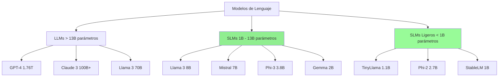
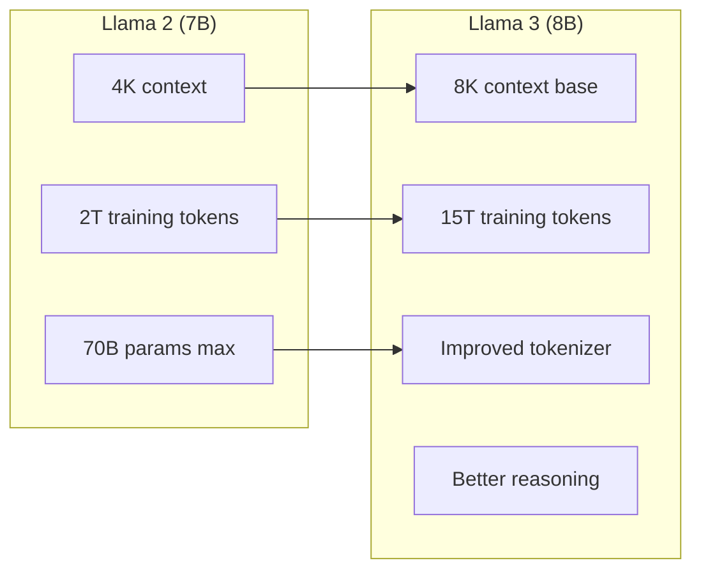
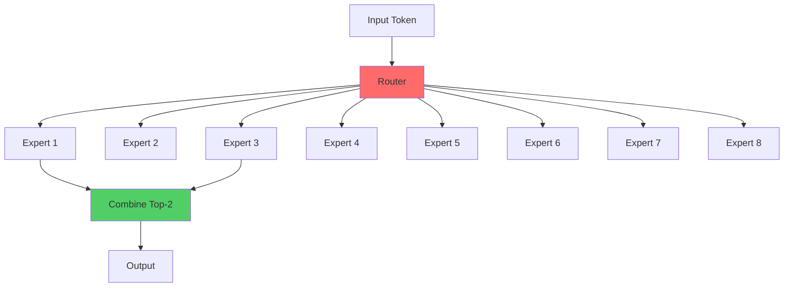
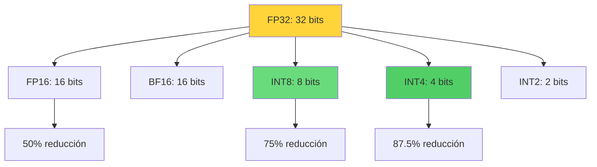
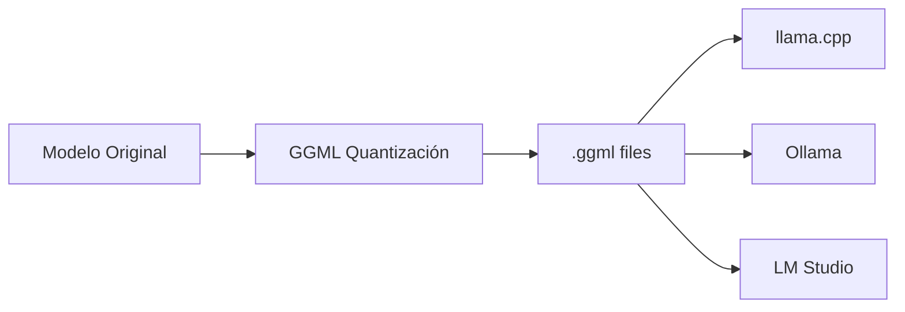
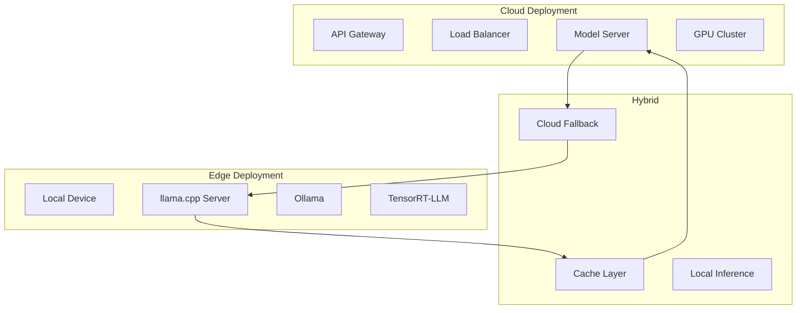
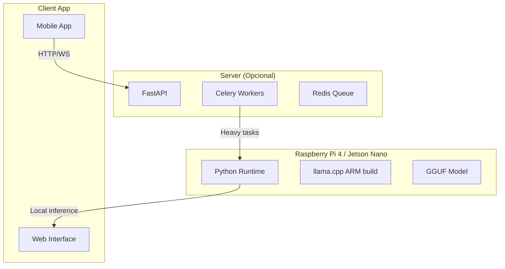
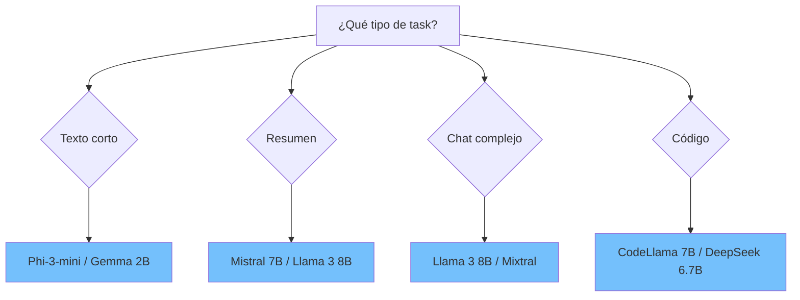

# Clase 17: SLMs - Small Language Models

## Duración
**4 horas** (240 minutos)

---

## Objetivos de Aprendizaje

Al finalizar esta clase, el estudiante será capaz de:

1. Comprender los fundamentos de los Small Language Models (SLMs) y su arquitectura
2. Distinguir entre LLMs y SLMs, identificando casos de uso apropiados para cada uno
3. Implementar quantización de modelos para reducir tamaño y mejorar eficiencia
4. Desplegar modelos en entornos edge y dispositivos con recursos limitados
5. Utilizar herramientas como llama.cpp, GGML y Ollama para inferencia optimizada
6. Evaluar trade-offs entre calidad, velocidad y consumo de recursos

---

## 1. Introducción a los Small Language Models

### 1.1 Definición y Contexto Histórico

Los Small Language Models (SLMs) son modelos de lenguaje con típicamente entre 100 millones y 13 mil millones de parámetros, diseñados para operar eficientemente en hardware convencional. A diferencia de los Large Language Models (LLMs) que requieren clusters de GPUs con cientos de gigabytes de VRAM, los SLMs pueden ejecutarse en:

- Laptops convencionales (8-16 GB RAM)
- Dispositivos edge (Raspberry Pi, Jetson Nano)
- Smartphones modernos
- CPUs sin GPU dedicada

### 1.2 Taxonomía de Modelos por Tamaño



### 1.3 Ventajas de los SLMs

| Característica | LLM (70B+) | SLM (7B) | SLM (1B) |
|---------------|-----------|----------|----------|
| VRAM mínima | 140GB | 14GB | 2GB |
| Latencia (tokens/s) | 5-15 | 20-40 | 30-60 |
| Coste por inference | $0.01 | $0.001 | $0.0001 |
|部署 | Cloud-only | Cloud/Edge | Edge |
| Calidad general | Excelente | Muy buena | Aceptable |

---

## 2. Modelos SLM Prominentes

### 2.1 Meta Llama Family

#### Llama 3 (2024)

Arquitectura optimizada con:
- **Context length**: 8,192 tokens (base), 128K (instruct)
- **Training tokens**: 15+ billones
- **Tokenizer**: TikToken con 128K vocabulario

```python
# Ejemplo de uso de Llama 3 8B con transformers
from transformers import AutoModelForCausalLM, AutoTokenizer

model_name = "meta-llama/Meta-Llama-3-8B-Instruct"

tokenizer = AutoTokenizer.from_pretrained(model_name)
model = AutoModelForCausalLM.from_pretrained(
    model_name,
    torch_dtype=torch.bfloat16,
    device_map="auto"
)

messages = [
    {"role": "system", "content": "Eres un asistente técnico."},
    {"role": "user", "content": "Explica qué es quantización."}
]

input_ids = tokenizer.apply_chat_template(
    messages, 
    add_generation_prompt=True, 
    return_tensors="pt"
).to(model.device)

outputs = model.generate(
    input_ids, 
    max_new_tokens=256,
    temperature=0.7,
    do_sample=True
)
response = tokenizer.decode(outputs[0][input_ids.shape[1]:])
```

#### Llama 2 vs Llama 3: Mejoras



### 2.2 Mistral AI

#### Mistral 7B

Arquitectura revolucionaria con:
- **Grouped Query Attention (GQA)**: Mejor eficiencia
- **Rolling Buffer Cache**: Memoria fija optimizada
- **Byte-fallback BPE tokenizer**: Mejor manejo de tokens especiales

```python
# Mistral 7B con vLLM para máxima eficiencia
from vllm import LLM, SamplingParams

llm = LLM(
    model="mistralai/Mistral-7B-Instruct-v0.2",
    tensor_parallel_size=1,
    gpu_memory_utilization=0.90,
    max_model_len=32768
)

sampling_params = SamplingParams(
    temperature=0.7,
    top_p=0.95,
    max_tokens=512
)

outputs = llm.generate(["Explain quantum entanglement:", "What is RAG?"], sampling_params)
for output in outputs:
    print(f"Output: {output.outputs[0].text}")
```

#### Mixtral 8x7B: Sparse Mixture of Experts



### 2.3 Microsoft Phi-3

Familia diseñada para eficiencia extrema:
- **Phi-3-mini (3.8B)**: 3.8B parámetros, 4K context
- **Phi-3-small (7B)**: 7B parámetros, 128K context
- **Phi-3-medium (14B)**: 14B parámetros, 128K context

Innovación clave: **Textbooks Are All You Need** - entrenamiento con datos de alta calidad similares a textbooks.

### 2.4 Google Gemma

Modelos abiertos basados en Gemini:
- **Gemma 2B**: 2B parámetros, optimizado para CPU
- **Gemma 7B**: 7B parámetros, GPU-optimizado
- **Fine-tuned variants**: Code, Instruct, Safety

### 2.5 Tabla Comparativa Detallada

| Modelo | Params | Context | VRAM (FP16) | VRAM (INT4) | Strengths |
|--------|--------|---------|-------------|-------------|-----------|
| Llama 3 8B | 8.0B | 8K | 16GB | 5GB | General purpose |
| Mistral 7B | 7.3B | 8K | 15GB | 4.5GB | Reasoning |
| Phi-3 mini | 3.8B | 4K | 8GB | 2.5GB | Efficiency |
| Gemma 2B | 2.0B | 8K | 4GB | 1.5GB | CPU-friendly |
| Qwen2 1.5B | 1.5B | 128K | 3GB | 1GB | Long context |
| TinyLlama 1.1B | 1.1B | 2K | 2.5GB | 1GB | Experimentation |

---

## 3. Quantización de Modelos

### 3.1 Fundamentos de Quantización

La quantización reduce la precisión numérica de los pesos del modelo:



### 3.2 Tipos de Quantización

#### 3.2.1 Quantización Post-Training (PTQ)

```python
# Ejemplo con bitsandbytes para INT8
from transformers import AutoModelForCausalLM, BitsAndBytesConfig
import torch

quantization_config = BitsAndBytesConfig(
    load_in_8bit=True,
    llm_int8_threshold=6.0,
    llm_int8_has_fp16_weight=False
)

model = AutoModelForCausalLM.from_pretrained(
    "meta-llama/Meta-Llama-3-8B-Instruct",
    quantization_config=quantization_config,
    device_map="auto"
)
```

#### 3.2.2 Quantización con GPTQ

```python
# GPTQ: Generative Pretrained Transformer Quantization
from auto_gptq import AutoGPTQForCausalLM, BaseQuantizeConfig
from transformers import AutoTokenizer

quantize_config = BaseQuantizeConfig(
    bits=4,
    group_size=128,
    desc_act=True
)

model = AutoGPTQForCausalLM.from_pretrained(
    "meta-llama/Meta-Llama-3-8B-Instruct",
    quantize_config=quantize_config
)

# Calibración con dataset
training_samples = tokenized_dataset["train"][:1024]
model.quantize(training_samples["input_ids"])
model.save_quantized("llama3-8b-gptq-4bit")
```

#### 3.2.3 AWQ: Activation-Aware Weight Quantization

```python
# AWQ - mejor para tasks con outliers
from awq import AutoAWQForCausalLM
from transformers import AutoTokenizer

model = AutoAWQForCausalLM.from_pretrained(
    "meta-llama/Meta-Llama-3-8B-Instruct",
    torch_dtype=torch.float16
)
tokenizer = AutoTokenizer.from_pretrained(
    "meta-llama/Meta-Llama-3-8B-Instruct"
)

quant_config = {
    "zero_point": True,
    "q_group_size": 128,
    "w_bit": 4,
    "version": "GEMM"
}

model.quantize(tokenizer, quant_config=quant_config)
model.save_quantized("llama3-8b-awq-4bit")
```

### 3.3 GGML y GGUF

#### Formato GGML

GGML (Georgi Gerganov Machine Learning) es un framework de quantización desarrollado por Georgi Gerganov que permite ejecutar modelos en CPU con alta eficiencia.



#### Formato GGUF

GGUF (GGML Universal Format) es el successor de GGML con:
- Metadatos autocontenidos
- Mejor versionamiento
- Support para más arquitecturas

```bash
# Conversión a GGUF con llama.cpp
# Paso 1: Instalar llama.cpp
git clone https://github.com/ggerganov/llama.cpp.git
cd llama.cpp
mkdir build && cd build
cmake ..
cmake --build . --config Release

# Paso 2: Convertir modelo HF a GGUF
python ../convert-hf-to-gguf.py \
    --model meta-llama/Meta-Llama-3-8B-Instruct \
    --outfile llama3-8b-instruct.gguf \
    --outtype f16

# Paso 3: Quantizar a Q4_K_M
./quantize \
    llama3-8b-instruct.gguf \
    llama3-8b-instruct-q4_k_m.gguf \
    Q4_K_M
```

### 3.4 Tabla de Tamaños Quantizados

| Quantización | Ratio | Calidad | Uso Recomendado |
|-------------|-------|---------|-----------------|
| F16 | 1.0x | 100% | Fine-tuning |
| Q8_0 | 2.0x | 99% | Alta calidad |
| Q6_K | 2.5x | 98% | Balance |
| Q5_K_M | 3.0x | 96% | Buena calidad |
| Q4_K_M | 3.5x | 94% | Recommended |
| Q4_0 | 3.5x | 93% | Standard |
| Q3_K_M | 4.0x | 90% | Dispositivos受限 |
| Q2_K | 4.5x | 88% | Mínimo aceptable |

---

## 4. Edge Deployment

### 4.1 Arquitecturas de Despliegue



### 4.2 Ollama: Deployment Simplificado

#### Instalación y Uso

```bash
# Instalación en macOS/Linux
curl -fsSL https://ollama.ai/install.sh | sh

# Instalación en Windows (PowerShell)
irm https://ollama.ai/install.ps1 | iex

# Descargar modelo
ollama pull llama3:8b
ollama pull mistral:7b
ollama pull phi3:latest

# Ver modelos disponibles
ollama list

# Ejecutar interactivo
ollama run llama3:8b

# API REST
curl http://localhost:11434/api/generate -d '{
    "model": "llama3:8b",
    "prompt": "Explain quantum computing",
    "stream": false
}'
```

#### Ollama como Servicio

```python
import requests
import json

class OllamaClient:
    def __init__(self, base_url="http://localhost:11434"):
        self.base_url = base_url
    
    def generate(self, model: str, prompt: str, **kwargs):
        payload = {
            "model": model,
            "prompt": prompt,
            "stream": False,
            "options": {
                "temperature": kwargs.get("temperature", 0.7),
                "top_p": kwargs.get("top_p", 0.9),
                "num_predict": kwargs.get("max_tokens", 512)
            }
        }
        
        response = requests.post(
            f"{self.base_url}/api/generate",
            json=payload
        )
        return response.json()
    
    def chat(self, model: str, messages: list):
        payload = {
            "model": model,
            "messages": messages,
            "stream": False
        }
        
        response = requests.post(
            f"{self.base_url}/api/chat",
            json=payload
        )
        return response.json()
    
    def create_model(self, modelfile_path: str, name: str):
        with open(modelfile_path, 'r') as f:
            content = f.read()
        
        payload = {"name": name, "modelfile": content}
        response = requests.post(
            f"{self.base_url}/api/create",
            json=payload
        )
        return response.json()

# Uso
client = OllamaClient()
response = client.chat("llama3:8b", [
    {"role": "system", "content": "You are a helpful assistant."},
    {"role": "user", "content": "What is retrieval augmented generation?"}
])
print(response['message']['content'])
```

#### Modelfile para Personalización

```dockerfile
# Modelfile para un asistente técnico
FROM llama3:8b

PARAMETER temperature 0.3
PARAMETER num_predict 2048
PARAMETER top_k 40
PARAMETER top_p 0.9

TEMPLATE """
<s>[INST] <<SYS>>
{{ .System }}
<</SYS>>
{{ .Prompt }} [/INST]
"""
```

### 4.3 llama.cpp: Inferencia Optimizada

#### Servidor HTTP

```bash
# Compilar servidor
cd llama.cpp
mkdir build && cd build
cmake .. -DLLAMA_SERVER=ON -DLLAMA_BUILD_MODE=release
cmake --build . --config release

# Iniciar servidor
./server \
    -m models/llama3-8b-q4_k_m.gguf \
    -c 4096 \
    -t 8 \
    --host 0.0.0.0 \
    --port 8080 \
    -ngl 99 \
    --embedding
```

#### API del Servidor

```python
import requests
import json

class LlamaCppServer:
    def __init__(self, base_url="http://localhost:8080"):
        self.base_url = base_url
    
    def generate(self, prompt: str, **kwargs):
        payload = {
            "prompt": prompt,
            "n_predict": kwargs.get("max_tokens", 512),
            "temperature": kwargs.get("temperature", 0.7),
            "stop": kwargs.get("stop", []),
            "stream": False
        }
        
        response = requests.post(
            f"{self.base_url}/completion",
            json=payload
        )
        return response.json()['content']
    
    def embeddings(self, text: str):
        payload = {"content": text}
        response = requests.post(
            f"{self.base_url}/embedding",
            json=payload
        )
        return response.json()['embedding']
    
    def infill(self, prefix: str, suffix: str):
        payload = {
            "prompt": prefix,
            "suffix": suffix,
            "n_predict": 128
        }
        response = requests.post(
            f"{self.base_url}/infill",
            json=payload
        )
        return response.json()['content']
    
    def chat(self, messages: list):
        # Construir prompt desde messages
        prompt = self._build_chat_prompt(messages)
        return self.generate(prompt)
    
    def _build_chat_prompt(self, messages: list) -> str:
        prompt = ""
        for msg in messages:
            role = msg['role']
            content = msg['content']
            if role == 'system':
                prompt += f"<<SYS>>\n{content}\n<</SYS>>\n\n"
            elif role == 'user':
                prompt += f"[INST] {content} [/INST]\n"
            elif role == 'assistant':
                prompt += f"{content}\n"
        return prompt
```

### 4.4 TensorRT-LLM para NVIDIA GPUs

```bash
# Instalar TensorRT-LLM
git clone https://github.com/NVIDIA/TensorRT-LLM.git
cd TensorRT-LLM

# Construir motor para Llama 3 8B
python tools/build.py \
    --model_path meta-llama/Meta-Llama-3-8B-Instruct \
    --dtype float16 \
    --tp_size 1 \
    --engine_dir engines/llama3-8b

# Ejecutar inferencia
python run.py \
    --engine_dir engines/llama3-8b \
    --tokenizer meta-llama/Meta-Llama-3-8B-Instruct \
    --input-tokens 512 \
    --max-output-len 256
```

### 4.5 Deployment en Dispositivos IoT



---

## 5. Casos de Uso y Selección de Modelos

### 5.1 Decision Matrix



### 5.2 Guía de Selección por Recursos

```python
def recommend_model(available_ram_gb: float, 
                   has_gpu: bool,
                   task_type: str) -> list:
    """
    Recomienda modelos basados en recursos disponibles.
    """
    recommendations = []
    
    if available_ram_gb >= 16 and has_gpu:
        if task_type == "general":
            recommendations.extend([
                "llama3:70b-instruct-q4_k_m",
                "mixtral:8x7b-instruct",
                "llama3:8b-instruct"
            ])
        elif task_type == "code":
            recommendations.append("codellama:34b-instruct-q4_k_m")
    
    elif available_ram_gb >= 8 and has_gpu:
        recommendations.extend([
            "llama3:8b-instruct",
            "mistral:7b-instruct",
            "phi3:latest"
        ])
    
    elif available_ram_gb >= 6:
        recommendations.extend([
            "llama3:8b-instruct-q4_k_m",
            "mistral:7b-instruct-q4_k_m",
            "phi3:14b"
        ])
    
    elif available_ram_gb >= 4:
        recommendations.extend([
            "mistral:7b-instruct-q4_0",
            "phi3:7b",
            "gemma:7b"
        ])
    
    elif available_ram_gb >= 2:
        recommendations.extend([
            "phi3:3.8b-mini",
            "gemma:2b",
            "qwen2:1.5b"
        ])
    
    return recommendations
```

---

## 6. Ejercicios Prácticos Resueltos

### Ejercicio 1: Cuantización y Benchmark de Modelos

```python
"""
Ejercicio: Cuantizar Llama 3 8B a diferentes precisiones
y comparar latencia y calidad.
"""

import time
import psutil
from transformers import AutoModelForCausalLM, AutoTokenizer
import torch

class ModelBenchmark:
    def __init__(self, model_name: str):
        self.model_name = model_name
        self.results = {}
    
    def benchmark_fp16(self):
        """Benchmark con modelo en FP16 (baseline)."""
        print(f"Benchmarking {self.model_name} en FP16...")
        
        model = AutoModelForCausalLM.from_pretrained(
            self.model_name,
            torch_dtype=torch.float16,
            device_map="auto"
        )
        tokenizer = AutoTokenizer.from_pretrained(self.model_name)
        
        return self._run_inference(model, tokenizer, "fp16")
    
    def benchmark_int8(self):
        """Benchmark con quantización INT8."""
        print(f"Benchmarking {self.model_name} en INT8...")
        
        from transformers import BitsAndBytesConfig
        
        quantization_config = BitsAndBytesConfig(load_in_8bit=True)
        
        model = AutoModelForCausalLM.from_pretrained(
            self.model_name,
            quantization_config=quantization_config,
            device_map="auto"
        )
        tokenizer = AutoTokenizer.from_pretrained(self.model_name)
        
        return self._run_inference(model, tokenizer, "int8")
    
    def _run_inference(self, model, tokenizer, precision: str):
        test_prompts = [
            "Explain the concept of entropy in thermodynamics.",
            "Write a Python function to calculate factorial recursively.",
            "What are the main differences between SQL and NoSQL databases?"
        ]
        
        results = {
            "precision": precision,
            "memory_usage_gb": psutil.Process().memory_info().rss / 1e9,
            "tokens_per_second": [],
            "total_tokens": 0,
            "total_time": 0
        }
        
        for prompt in test_prompts:
            input_ids = tokenizer(prompt, return_tensors="pt").to(model.device)
            
            start_time = time.time()
            with torch.no_grad():
                outputs = model.generate(
                    input_ids["input_ids"],
                    max_new_tokens=100,
                    do_sample=False
                )
            end_time = time.time()
            
            elapsed = end_time - start_time
            num_tokens = outputs.shape[1] - input_ids["input_ids"].shape[1]
            tokens_per_sec = num_tokens / elapsed
            
            results["tokens_per_second"].append(tokens_per_sec)
            results["total_tokens"] += num_tokens
            results["total_time"] += elapsed
            
            print(f"  Prompt: {prompt[:50]}...")
            print(f"  Tokens: {num_tokens}, Time: {elapsed:.2f}s, Speed: {tokens_per_sec:.1f} tok/s")
        
        results["avg_tokens_per_second"] = sum(results["tokens_per_second"]) / len(results["tokens_per_second"])
        
        del model
        torch.cuda.empty_cache()
        
        return results

# Uso
# benchmark = ModelBenchmark("meta-llama/Meta-Llama-3-8B-Instruct")
# results_fp16 = benchmark.benchmark_fp16()
# results_int8 = benchmark.benchmark_int8()

# Comparación
# print(f"\nSpeedup INT8 vs FP16: {results_int8['avg_tokens_per_second'] / results_fp16['avg_tokens_per_second']:.2f}x")
```

### Ejercicio 2: Despliegue Local con Ollama y API

```python
"""
Ejercicio: Crear una API REST completa usando Ollama
para inferencia local con cache de embeddings.
"""

from fastapi import FastAPI, HTTPException
from pydantic import BaseModel
from typing import List, Optional
import requests
import hashlib
import json
import os
from datetime import datetime

app = FastAPI(title="Local LLM API", version="1.0.0")

class CompletionRequest(BaseModel):
    model: str = "llama3:8b"
    prompt: str
    temperature: float = 0.7
    max_tokens: int = 512
    stream: bool = False

class ChatMessage(BaseModel):
    role: str
    content: str

class ChatRequest(BaseModel):
    model: str = "llama3:8b"
    messages: List[ChatMessage]
    temperature: float = 0.7
    max_tokens: int = 512

class EmbeddingRequest(BaseModel):
    model: str = "nomic-embed-text"
    text: str

class CacheManager:
    def __init__(self, cache_dir: str = "./cache"):
        self.cache_dir = cache_dir
        os.makedirs(cache_dir, exist_ok=True)
    
    def _get_cache_key(self, text: str, model: str) -> str:
        content = f"{model}:{text}"
        return hashlib.sha256(content.encode()).hexdigest()
    
    def get(self, text: str, model: str) -> Optional[dict]:
        cache_key = self._get_cache_key(text, model)
        cache_file = os.path.join(self.cache_dir, f"{cache_key}.json")
        
        if os.path.exists(cache_file):
            with open(cache_file, 'r') as f:
                cached = json.load(f)
                print(f"Cache HIT: {cache_key[:8]}...")
                return cached
        
        return None
    
    def set(self, text: str, model: str, result: dict):
        cache_key = self._get_cache_key(text, model)
        cache_file = os.path.join(self.cache_dir, f"{cache_key}.json")
        
        with open(cache_file, 'w') as f:
            json.dump({
                "text": text,
                "model": model,
                "result": result,
                "timestamp": datetime.now().isoformat()
            }, f)
        print(f"Cache SET: {cache_key[:8]}...")

cache = CacheManager()

@app.post("/api/completions")
async def create_completion(request: CompletionRequest):
    """Genera una completion de texto."""
    
    cached = cache.get(request.prompt, request.model)
    if cached:
        return cached["result"]
    
    payload = {
        "model": request.model,
        "prompt": request.prompt,
        "temperature": request.temperature,
        "n_predict": request.max_tokens,
        "stream": request.stream
    }
    
    try:
        response = requests.post(
            "http://localhost:11434/api/generate",
            json=payload,
            timeout=120
        )
        response.raise_for_status()
        result = response.json()
        
        cache.set(request.prompt, request.model, result)
        return result
    
    except requests.exceptions.RequestException as e:
        raise HTTPException(status_code=503, detail=f"Ollama unavailable: {str(e)}")

@app.post("/api/chat")
async def create_chat(request: ChatRequest):
    """Genera una respuesta de chat."""
    
    messages_dict = [msg.model_dump() for msg in request.messages]
    
    payload = {
        "model": request.model,
        "messages": messages_dict,
        "temperature": request.temperature,
        "stream": request.stream
    }
    
    try:
        response = requests.post(
            "http://localhost:11434/api/chat",
            json=payload,
            timeout=120
        )
        response.raise_for_status()
        return response.json()
    
    except requests.exceptions.RequestException as e:
        raise HTTPException(status_code=503, detail=f"Ollama unavailable: {str(e)}")

@app.post("/api/embeddings")
async def create_embedding(request: EmbeddingRequest):
    """Genera embeddings usando Ollama."""
    
    payload = {
        "model": request.model,
        "prompt": request.text
    }
    
    try:
        response = requests.post(
            "http://localhost:11434/api/embeddings",
            json=payload,
            timeout=30
        )
        response.raise_for_status()
        return response.json()
    
    except requests.exceptions.RequestException as e:
        raise HTTPException(status_code=503, detail=f"Ollama unavailable: {str(e)}")

@app.get("/api/models")
async def list_models():
    """Lista modelos disponibles en Ollama."""
    try:
        response = requests.get("http://localhost:11434/api/tags")
        response.raise_for_status()
        return response.json()
    except requests.exceptions.RequestException as e:
        raise HTTPException(status_code=503, detail=f"Ollama unavailable: {str(e)}")

@app.delete("/api/cache")
async def clear_cache():
    """Limpia el cache de respuestas."""
    for filename in os.listdir(cache.cache_dir):
        file_path = os.path.join(cache.cache_dir, filename)
        if os.path.isfile(file_path):
            os.remove(file_path)
    return {"message": "Cache cleared successfully"}

# Uso: uvicorn main:app --host 0.0.0.0 --port 8000
```

---

## 7. Tecnologías Específicas

| Tecnología | Propósito | Uso Principal |
|------------|-----------|----------------|
| **llama.cpp** | Inferencia CPU optimizada | Despliegue sin GPU |
| **GGML/GGUF** | Formatos de modelo quantizados | Reducción de tamaño |
| **Ollama** | Gestión de modelos simplificada | Desarrollo local |
| **vLLM** | Alta throughput con PagedAttention | Producción cloud |
| **GPTQ** | Quantización post-training | Reducción INT4 |
| **AWQ** | Quantización activation-aware | Mejor calidad INT4 |
| **bitsandbytes** | Quantización en transformers | Fácil integración HF |
| **TensorRT-LLM** | Optimización NVIDIA | Máxima performance GPU |

---

## 8. Actividades de Laboratorio

### Laboratorio 1: Deployment de SLM en Raspberry Pi

**Objetivo**: Ejecutar Phi-3-mini en Raspberry Pi 4 con 4GB RAM

**Requisitos**:
- Raspberry Pi 4 con 4GB+ RAM
- SD card 32GB+
- Raspbian OS 64-bit

**Pasos**:

1. **Preparar el sistema**:
```bash
sudo apt update && sudo apt upgrade -y
sudo apt install -y build-essential git cmake libgomp1
```

2. **Instalar llama.cpp ARM64**:
```bash
git clone https://github.com/ggerganov/llama.cpp.git
cd llama.cpp
mkdir build && cd build
cmake .. -DLLAMA_BUILD_SERVER=ON -DCMAKE_CXX_FLAGS="-march=native"
cmake --build . --config release -j$(nproc)
```

3. **Descargar y cuantizar modelo**:
```bash
# Descargar Phi-3-mini en GGUF (usar quantization ya preparada)
wget https://huggingface.co/second-state/Phi-3-mini-4k-instruct-GGUF/resolve/main/phi-3-mini-4k-instruct-q4_k_m.gguf

# Iniciar servidor
./server -m phi-3-mini-4k-instruct-q4_k_m.gguf -c 2048 -p 8080
```

4. **Verificar inferencia**:
```python
import requests
response = requests.post("http://localhost:8080/completion", json={
    "prompt": "Hello, how are you?",
    "n_predict": 100
})
print(response.json())
```

### Laboratorio 2: Benchmark Comparativo

**Objetivo**: Comparar performance de diferentes quantizaciones

```python
"""
Script de benchmark para comparar quantizaciones
"""

import time
import subprocess
import psutil
from pathlib import Path

def benchmark_model(model_path: str, prompt: str, n_tokens: int):
    """Ejecuta benchmark de un modelo GGUF."""
    
    cmd = [
        "./llama-cli",
        "-m", model_path,
        "-p", prompt,
        "-n", str(n_tokens),
        "--no-display-prompt",
        "-t", "8"
    ]
    
    start_mem = psutil.Process().memory_info().rss / 1e9
    start_time = time.time()
    
    result = subprocess.run(cmd, capture_output=True, text=True)
    
    end_time = time.time()
    end_mem = psutil.Process().memory_info().rss / 1e9
    
    elapsed = end_time - start_time
    tokens_per_sec = n_tokens / elapsed
    
    return {
        "model": Path(model_path).name,
        "elapsed": elapsed,
        "tokens_per_sec": tokens_per_sec,
        "memory_delta_gb": end_mem - start_mem,
        "success": result.returncode == 0
    }

# Ejecutar benchmarks
models_to_test = [
    "models/llama3-8b-f16.gguf",
    "models/llama3-8b-q8_0.gguf",
    "models/llama3-8b-q4_k_m.gguf",
    "models/llama3-8b-q3_k_m.gguf",
    "models/llama3-8b-q2_k.gguf"
]

test_prompt = "Explain the theory of relativity in simple terms."
n_tokens = 200

results = []
for model in models_to_test:
    if Path(model).exists():
        result = benchmark_model(model, test_prompt, n_tokens)
        results.append(result)
        print(f"{result['model']}: {result['tokens_per_sec']:.1f} tok/s")
```

---

## 9. Resumen de Puntos Clave

### Conceptos Fundamentales

1. **SLMs vs LLMs**: Los SLMs (1B-13B params) ofrecen un balance entre capacidad y eficiencia, permitiendo deployment en hardware limitado.

2. **Quantización**: Reducción de precisión numérica (FP32 → FP16 → INT8 → INT4) para减小 tamaño y aumentar velocidad.

3. **Formatos GGML/GGUF**: Estándares para distribución de modelos quantizados con soporte para inferencia CPU optimizada.

4. **Herramientas de Deployment**:
   - **Ollama**: Gestión simplificada de modelos
   - **llama.cpp**: Inferencia optimizada en CPU
   - **vLLM**: Alta throughput en GPU

5. **Selección de Modelos**: Depende de recursos disponibles, requisitos de calidad y tipo de tarea.

### Lista de Verificación para Deployment

- [ ] Evaluar recursos de hardware disponibles
- [ ] Seleccionar modelo apropiado por tamaño
- [ ] Elegir nivel de quantización (calidad vs velocidad)
- [ ] Configurar servidor con parámetros óptimos
- [ ] Implementar cache para respuestas repetidas
- [ ] Monitorear usage y ajustar según necesidad

---

## Referencias Externas

1. **Llama 3 Paper**: "The Llama 3 Herd of Models" - Meta AI (2024)
   https://arxiv.org/abs/2407.21783

2. **Mistral 7B Paper**: "Mistral 7B: A 7B Parameter Language Model"
   https://arxiv.org/abs/2310.06825

3. **GPTQ Paper**: "GPTQ: Accurate Post-Training Quantization for Generative Pre-Trained Transformers"
   https://arxiv.org/abs/2210.17323

4. **llama.cpp Repository**:
   https://github.com/ggerganov/llama.cpp

5. **Ollama Official Documentation**:
   https://github.com/ollama/ollama

6. **GGUF Format Specification**:
   https://github.com/ggerganov/ggml/blob/master/docs/gguf.md

7. **Phi-3 Technical Report**: "Phi-3 Technical Report: A Highly Capable Language Model Locally on Your Phone"
   https://arxiv.org/abs/2404.14219

8. **AWQ Paper**: "AWQ: Activation-Aware Weight Quantization for LLM Compression and Acceleration"
   https://arxiv.org/abs/2306.00978

9. **vLLM Documentation**:
   https://docs.vllm.ai/

10. **Hugging Face Quantization Guide**:
    https://huggingface.co/docs/transformers/main/en/quantization

---

**Siguiente Clase**: Clase 18 - Fine-tuning de SLMs con LoRA y QLoRA
