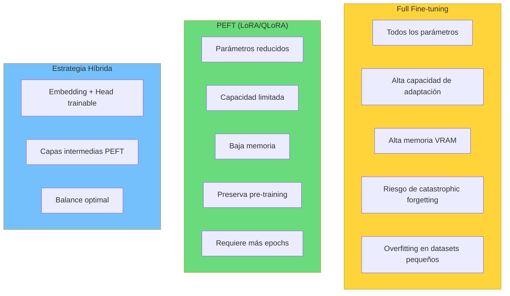
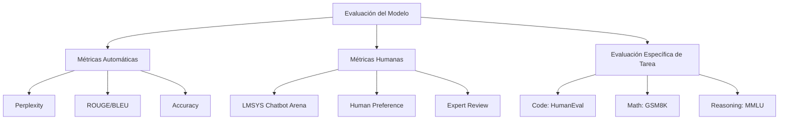
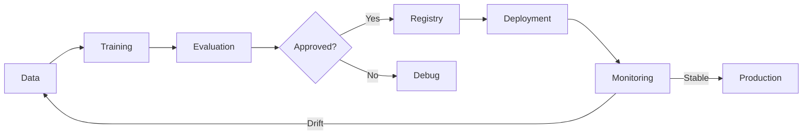

# Clase 19: Fine-tuning Avanzado

## Duración
**4 horas** (240 minutos)

---

## Objetivos de Aprendizaje

Al finalizar esta clase, el estudiante será capaz de:

1. Distinguir entre full fine-tuning y PEFT en términos de performance y requisitos
2. Implementar hyperparameter tuning sistemático con herramientas de tracking
3. Evaluar modelos fine-tuned con métricas apropiadas al caso de uso
4. Desplegar modelos fine-tuned en producción de manera eficiente
5. Implementar continuous training y model versioning
6. Utilizar herramientas como Weights & Biases, MLflow y Triton

---

## 1. Full Fine-tuning vs PEFT

### 1.1 Comparación Detallada



### 1.2 Análisis de Trade-offs

```python
import pandas as pd

def compare_finetuning_strategies():
    """
    Compara diferentes estrategias de fine-tuning.
    """
    
    strategies = [
        {
            "Strategy": "Full FP32",
            "Trainable Params": "8.07B (100%)",
            "VRAM Required": "~80GB",
            "Training Speed": "1x (baseline)",
            "Catastrophic Forgetting": "High",
            "Overfitting Risk": "High",
            "Quality on Small Data": "Poor",
            "Hardware Required": "A100 80GB x2"
        },
        {
            "Strategy": "Full BF16",
            "Trainable Params": "8.07B (100%)",
            "VRAM Required": "~40GB",
            "Training Speed": "1.5x",
            "Catastrophic Forgetting": "High",
            "Overfitting Risk": "High",
            "Quality on Small Data": "Poor",
            "Hardware Required": "A100 40GB"
        },
        {
            "Strategy": "LoRA (r=64)",
            "Trainable Params": "166M (2%)",
            "VRAM Required": "~24GB",
            "Training Speed": "3x",
            "Catastrophic Forgetting": "Low",
            "Overfitting Risk": "Low",
            "Quality on Small Data": "Good",
            "Hardware Required": "A100 40GB"
        },
        {
            "Strategy": "QLoRA NF4",
            "Trainable Params": "166M (2%)",
            "VRAM Required": "~16GB",
            "Training Speed": "4x",
            "Catastrophic Forgetting": "Low",
            "Overfitting Risk": "Low",
            "Quality on Small Data": "Good",
            "Hardware Required": "A100 40GB"
        },
        {
            "Strategy": "QLoRA + Gradient Checkpoint",
            "Trainable Params": "166M (2%)",
            "VRAM Required": "~10GB",
            "Training Speed": "4x",
            "Catastrophic Forgetting": "Low",
            "Overfitting Risk": "Low",
            "Quality on Small Data": "Good",
            "Hardware Required": "RTX 3090 / A5000"
        }
    ]
    
    df = pd.DataFrame(strategies)
    print(df.to_string(index=False))
    
    return strategies

compare_finetuning_strategies()
```

### 1.3 Cuándo Usar Full Fine-tuning

```python
def should_use_full_ft(dataset_size: int, task_complexity: str, 
                       available_vram_gb: float, domain_shift: float) -> dict:
    """
    Determina si usar full fine-tuning o PEFT.
    
    Args:
        dataset_size: Número de ejemplos de entrenamiento
        task_complexity: "low", "medium", "high"
        available_vram_gb: VRAM disponible en GB
        domain_shift: Qué tan diferente es el dominio (0-1)
    """
    
    recommendations = []
    
    # Full fine-tuning justificable cuando:
    if dataset_size > 100000 and available_vram_gb >= 80:
        recommendations.append({
            "strategy": "Full Fine-tuning BF16",
            "reason": "Dataset grande y recursos disponibles"
        })
    
    if domain_shift > 0.7 and task_complexity == "high":
        recommendations.append({
            "strategy": "Full Fine-tuning",
            "reason": "Gran cambio de dominio requiere adaptación completa"
        })
    
    # PEFT recomendado:
    if available_vram_gb < 40:
        recommendations.append({
            "strategy": "QLoRA",
            "reason": "VRAM limitada"
        })
    
    if dataset_size < 50000:
        recommendations.append({
            "strategy": "LoRA/QLoRA",
            "reason": "Evitar overfitting con dataset pequeño"
        })
    
    # Hybrid approach
    if 40000 <= dataset_size <= 100000 and available_vram_gb >= 40:
        recommendations.append({
            "strategy": "Hybrid: Full FT last layers + LoRA others",
            "reason": "Balance entre adaptación y preservación"
        })
    
    return recommendations

# Uso
recs = should_use_full_ft(
    dataset_size=25000,
    task_complexity="high",
    available_vram_gb=24,
    domain_shift=0.5
)
print(f"Recommendations: {recs}")
```

---

## 2. Hyperparameter Tuning

### 2.1 Principales Hiperparámetros

```mermaid
graph TD
    A[Hyperparameters] --> B[Model Architecture]
    A --> C[Training Configuration]
    A --> D[Regularization]
    
    B --> B1[Rank (r)]
    B --> B2[Alpha]
    B --> B3[Target Modules]
    
    C --> C1[Learning Rate]
    C --> C2[Batch Size]
    C --> C3[Epochs]
    C --> C4[Warmup Steps]
    
    D --> D1[Weight Decay]
    D --> D2[Dropout]
    D --> D3[Gradient Clipping]
    
    style A fill:#ffd43b
```

### 2.2 Grid Search con W&B

```python
import wandb
from wandb.keras import WandbMetricsLogger
import sweep_utils

# Inicializar sweep
sweep_config = {
    "method": "bayes",  # Más eficiente que grid
    "metric": {
        "name": "eval/loss",
        "goal": "minimize"
    },
    "parameters": {
        "learning_rate": {
            "values": [1e-4, 2e-4, 3e-4, 5e-4]
        },
        "lora_r": {
            "values": [8, 16, 32, 64]
        },
        "lora_alpha": {
            "values": [16, 32, 64, 128]
        },
        "lora_dropout": {
            "values": [0.0, 0.05, 0.1]
        },
        "batch_size": {
            "values": [4, 8, 16]
        },
        "warmup_ratio": {
            "values": [0.03, 0.05, 0.1]
        }
    }
}

def train_with_sweep():
    """
    Función de training llamada por sweep.
    """
    wandb.init()
    
    config = wandb.config
    
    # Setup modelo con hiperparámetros del sweep
    model, tokenizer = setup_model(config)
    
    # Configuración de training
    training_args = TrainingArguments(
        output_dir=f"./output/run_{wandb.run.id}",
        learning_rate=config.learning_rate,
        per_device_train_batch_size=config.batch_size,
        warmup_ratio=config.warmup_ratio,
        num_train_epochs=3,
        report_to="wandb"
    )
    
    # LoRA config
    lora_config = LoraConfig(
        r=config.lora_r,
        lora_alpha=config.lora_alpha,
        lora_dropout=config.lora_dropout,
        target_modules=["q_proj", "k_proj", "v_proj", "o_proj"]
    )
    
    # Train
    trainer = Trainer(
        model=model,
        args=training_args,
        train_dataset=tokenized_train,
        eval_dataset=tokenized_eval
    )
    
    trainer.train()
    
    # Log metrics finales
    wandb.log({
        "final_loss": trainer.state.log_history[-1]["loss"],
        "final_eval_loss": trainer.state.log_history[-1]["eval_loss"]
    })

# Iniciar sweep desde CLI
# wandb sweep sweep.yaml
# wandb agent <sweep_id>
```

### 2.3 Automatización con Ray Tune

```python
from ray import tune
from ray.tune.schedulers import ASHAScheduler
from ray.tune.search.optuna import OptunaSearch

def run_hyperparameter_search():
    """
    Búsqueda de hiperparámetros con Ray Tune.
    """
    
    config = {
        "learning_rate": tune.loguniform(1e-5, 1e-3),
        "lora_r": tune.choice([8, 16, 32, 64, 128]),
        "lora_alpha": tune.choice([16, 32, 64, 128, 256]),
        "lora_dropout": tune.uniform(0.0, 0.2),
        "batch_size": tune.choice([2, 4, 8]),
        "weight_decay": tune.loguniform(1e-4, 0.1),
        "warmup_ratio": tune.uniform(0.0, 0.2),
    }
    
    scheduler = ASHAScheduler(
        max_t=10,
        grace_period=3,
        reduction_factor=2
    )
    
    search_alg = OptunaSearch()
    
    tuner = tune.Tuner(
        train_with_config,
        param_space=config,
        tune_config=tune.TuneConfig(
            num_samples=50,
            scheduler=scheduler,
            search_alg=search_alg,
            resources_per_trial={"gpu": 1}
        ),
        run_config=tune.RunConfig(
            name="lora_hpo",
            storage_path="s3://my-bucket/ray_results"
        )
    )
    
    results = tuner.fit()
    
    # Mejor configuración
    best_result = results.get_best_result()
    print(f"Best config: {best_result.config}")
    print(f"Best loss: {best_result.metrics['loss']}")

def train_with_config(config):
    """
    Función de training con configuración dada.
    """
    
    model, tokenizer = setup_model(config)
    
    training_args = TrainingArguments(
        output_dir=f"./output/trial_{tune.get_trial_id()}",
        **config
    )
    
    trainer = Trainer(
        model=model,
        args=training_args,
        train_dataset=tokenized_train,
        eval_dataset=tokenized_eval
    )
    
    result = trainer.train()
    
    tune.report(
        loss=result.training_loss,
        epochs=result.training_epochs_trained
    )
```

### 2.4 Guía de Hiperparámetros para LoRA

```python
"""
Guía práctica de hiperparámetros para LoRA.
"""

HYPERPARAMETER_GUIDE = {
    "learning_rate": {
        "small_dataset": {
            "range": [5e-5, 1e-4],
            "recommended": 7e-5,
            "notes": "LR bajo para evitar overfitting"
        },
        "medium_dataset": {
            "range": [1e-4, 3e-4],
            "recommended": 2e-4,
            "notes": "LR moderado balance"
        },
        "large_dataset": {
            "range": [2e-4, 5e-4],
            "recommended": 3e-4,
            "notes": "LR más alto para converger rápido"
        }
    },
    "lora_r": {
        "simple_task": {
            "range": [4, 16],
            "recommended": 8,
            "notes": "Tareas simples requieren menos rank"
        },
        "complex_task": {
            "range": [32, 128],
            "recommended": 64,
            "notes": "Tareas complejas requieren más rank"
        },
        "code_generation": {
            "range": [64, 256],
            "recommended": 128,
            "notes": "Código requiere alta capacidad"
        }
    },
    "lora_alpha": {
        "standard_ratio": {
            "formula": "alpha = 2 * r",
            "notes": "Ratio común proporciona buenos resultados"
        },
        "low_rank_stable": {
            "formula": "alpha = r",
            "notes": "Para ranks muy bajos, usar ratio 1:1"
        },
        "high_rank_expressive": {
            "formula": "alpha = 4 * r",
            "notes": "Para ranks altos, ratio mayor puede ayudar"
        }
    },
    "lora_dropout": {
        "default": 0.05,
        "small_data": 0.1,
        "large_data": 0.0,
        "notes": "Dropout ayuda en datasets pequeños"
    }
}

def get_recommended_config(task_type: str, dataset_size: int) -> dict:
    """
    Retorna configuración recomendada según tarea y dataset.
    """
    
    if dataset_size < 5000:
        data_size_cat = "small_dataset"
        dropout = 0.1
    elif dataset_size < 50000:
        data_size_cat = "medium_dataset"
        dropout = 0.05
    else:
        data_size_cat = "large_dataset"
        dropout = 0.0
    
    if "code" in task_type.lower():
        task_cat = "code_generation"
    elif task_type in ["reasoning", "math", "complex"]:
        task_cat = "complex_task"
    else:
        task_cat = "simple_task"
    
    guide = HYPERPARAMETER_GUIDE
    
    r = guide["lora_r"][task_cat]["recommended"]
    
    return {
        "learning_rate": guide["learning_rate"][data_size_cat]["recommended"],
        "lora_r": r,
        "lora_alpha": 2 * r,
        "lora_dropout": dropout,
        "batch_size": 4 if dataset_size < 10000 else 8,
        "weight_decay": 0.01,
        "warmup_ratio": 0.03
    }
```

---

## 3. Métricas de Evaluación

### 3.1 Framework de Evaluación



### 3.2 Perplexity y Loss

```python
import math
from transformers import AutoModelForCausalLM, AutoTokenizer
import torch

def calculate_perplexity(model, tokenizer, dataset):
    """
    Calcula perplexity del modelo en un dataset.
    """
    
    model.eval()
    total_loss = 0
    total_tokens = 0
    
    for batch in dataset:
        inputs = tokenizer(
            batch["text"],
            return_tensors="pt",
            truncation=True,
            max_length=2048
        )
        
        with torch.no_grad():
            outputs = model(**inputs, labels=inputs["input_ids"])
            loss = outputs.loss.item()
            
            num_tokens = inputs["input_ids"].shape[1]
            
            total_loss += loss * num_tokens
            total_tokens += num_tokens
    
    avg_loss = total_loss / total_tokens
    perplexity = math.exp(avg_loss)
    
    return perplexity, avg_loss

def compare_models(models: list, test_dataset):
    """
    Compara perplexity de múltiples modelos.
    """
    
    results = []
    
    for model_name, model_path in models:
        tokenizer = AutoTokenizer.from_pretrained(model_path)
        model = AutoModelForCausalLM.from_pretrained(model_path)
        
        ppl, loss = calculate_perplexity(model, tokenizer, test_dataset)
        
        results.append({
            "model": model_name,
            "perplexity": ppl,
            "loss": loss
        })
        
        print(f"{model_name}: PPL = {ppl:.2f}, Loss = {loss:.4f}")
    
    return results
```

### 3.3 Evaluación de Generación de Texto

```python
from rouge import Rouge
from bert_score import score as bert_score
import nltk
from nltk.translate.bleu_score import sentence_bleu, SmoothingFunction

class TextGenerationEvaluator:
    """
    Evaluador completo para modelos de generación de texto.
    """
    
    def __init__(self):
        self.rouge = Rouge()
        self.smoother = SmoothingFunction().method1
    
    def evaluate_generation(self, references: list, predictions: list):
        """
        Evalúa predicciones contra referencias.
        """
        
        results = {
            "rouge": self._compute_rouge(references, predictions),
            "bleu": self._compute_bleu(references, predictions),
            "bert_score": self._compute_bertscore(references, predictions),
            "length_stats": self._compute_length_stats(predictions)
        }
        
        return results
    
    def _compute_rouge(self, references, predictions):
        """Compute ROUGE scores."""
        scores = self.rouge.get_scores(predictions, references, avg=True)
        
        return {
            "rouge-1": scores["rouge-1"]["f"],
            "rouge-2": scores["rouge-2"]["f"],
            "rouge-l": scores["rouge-l"]["f"]
        }
    
    def _compute_bleu(self, references, predictions):
        """Compute BLEU score."""
        bleu_scores = []
        
        for ref, pred in zip(references, predictions):
            ref_tokens = ref.split()
            pred_tokens = pred.split()
            
            try:
                bleu = sentence_bleu(
                    [ref_tokens],
                    pred_tokens,
                    smoothing_function=self.smoother
                )
                bleu_scores.append(bleu)
            except:
                bleu_scores.append(0)
        
        return {
            "bleu": sum(bleu_scores) / len(bleu_scores),
            "individual_scores": bleu_scores
        }
    
    def _compute_bertscore(self, references, predictions):
        """Compute BERTScore."""
        P, R, F1 = bert_score(predictions, references, lang="en", verbose=False)
        
        return {
            "precision": P.mean().item(),
            "recall": R.mean().item(),
            "f1": F1.mean().item()
        }
    
    def _compute_length_stats(self, predictions):
        """Compute length statistics."""
        lengths = [len(p.split()) for p in predictions]
        
        return {
            "mean_length": sum(lengths) / len(lengths),
            "min_length": min(lengths),
            "max_length": max(lengths)
        }

# Uso
evaluator = TextGenerationEvaluator()

references = [
    "The quick brown fox jumps over the lazy dog.",
    "Machine learning is a subset of artificial intelligence."
]

predictions = [
    "A quick brown fox jumps over a lazy dog.",
    "ML is part of AI that enables computers to learn."
]

results = evaluator.evaluate_generation(references, predictions)
print(results)
```

### 3.4 Evaluación Específica por Dominio

```python
def evaluate_code_generation(model, tokenizer, test_cases: list):
    """
    Evalúa modelo en generación de código.
    """
    
    from bigcode_eval import evaluate
    
    # Preparar prompts
    prompts = [case["prompt"] for case in test_cases]
    solutions = [case["solution"] for case in test_cases]
    
    # Generar código
    generated_code = []
    for prompt in prompts:
        inputs = tokenizer(prompt, return_tensors="pt")
        outputs = model.generate(**inputs, max_new_tokens=200)
        code = tokenizer.decode(outputs[0], skip_special_tokens=True)
        generated_code.append(code)
    
    # Evaluar con HumanEval-style metrics
    results = {
        "pass_at_1": calculate_pass_at_k(generated_code, solutions, k=1),
        "syntax_valid_rate": calculate_syntax_validity(generated_code),
        "compilable_rate": calculate_compilable_rate(generated_code, "python")
    }
    
    return results

def calculate_pass_at_k(codes, solutions, k=1):
    """
    Calcula pass@k para evaluación de código.
    """
    
    passed = 0
    for code, solution in zip(codes, solutions):
        # Verificar si el código pasa tests
        if code_contains_solution(code, solution):
            passed += 1
    
    return passed / len(codes)

def code_contains_solution(code, solution):
    """Verifica si el código generado contiene la solución correcta."""
    # Implementación simplificada
    return len(code) > 50  # Placeholder
```

---

## 4. Deployment Post Fine-tuning

### 4.1 Exportación de Modelos

```python
from transformers import AutoModelForCausalLM, AutoTokenizer
from peft import PeftModel
import torch

def export_model_for_inference(
    base_model_path: str,
    lora_path: str,
    output_path: str,
    format: str = "merged"
):
    """
    Exporta modelo fine-tuned para inference.
    """
    
    if format == "merged":
        # Cargar base model
        base_model = AutoModelForCausalLM.from_pretrained(
            base_model_path,
            torch_dtype=torch.bfloat16,
            device_map="cpu"  # CPU para save
        )
        
        # Cargar LoRA y merge
        model = PeftModel.from_pretrained(base_model, lora_path)
        model = model.merge_and_unload()
        
        # Guardar
        model.save_pretrained(output_path)
        
    elif format == "gguf":
        # Exportar a GGUF para llama.cpp
        # Usar llama.cpp convert
        import subprocess
        
        subprocess.run([
            "python", "llama.cpp/convert-hf-to-gguf.py",
            "--model", base_model_path,
            "--outfile", f"{output_path}/model.gguf",
            "--outtype", "q4_k_m"
        ])
    
    # Guardar tokenizer
    tokenizer = AutoTokenizer.from_pretrained(base_model_path)
    tokenizer.save_pretrained(output_path)
    
    return output_path

def quantize_for_deployment(model_path: str, output_path: str, bits: int = 4):
    """
    Quantiza modelo exportado para deployment.
    """
    
    from transformers import AutoModelForCausalLM
    import subprocess
    
    if bits == 4:
        # GPTQ quantization
        subprocess.run([
            "python", "-m", "auto_gptq",
            "--model", model_path,
            "--output", output_path,
            "--bits", "4",
            "--group-size", "128"
        ])
    elif bits == 8:
        #bitsandbytes
        pass
```

### 4.2 Servidor de Inference Optimizado

```python
from fastapi import FastAPI, HTTPException
from pydantic import BaseModel
from transformers import AutoModelForCausalLM, AutoTokenizer
from peft import PeftModel
import torch
import asyncio

app = FastAPI(title="Fine-tuned Model API")

class InferenceConfig(BaseModel):
    max_tokens: int = 512
    temperature: float = 0.7
    top_p: float = 0.9
    top_k: int = 50
    repetition_penalty: float = 1.0

class CompletionRequest(BaseModel):
    prompt: str
    config: InferenceConfig = InferenceConfig()

class ChatMessage(BaseModel):
    role: str
    content: str

class ChatRequest(BaseModel):
    messages: list[ChatMessage]
    config: InferenceConfig = InferenceConfig()

class ModelServer:
    def __init__(self, model_path: str, lora_path: str = None, 
                 device: str = "cuda"):
        self.device = device
        
        # Cargar modelo base o merged
        self.tokenizer = AutoTokenizer.from_pretrained(model_path)
        self.model = AutoModelForCausalLM.from_pretrained(
            model_path,
            torch_dtype=torch.bfloat16 if device == "cuda" else torch.float32,
            device_map="auto" if device == "cuda" else None
        )
        
        # Si hay LoRA path, cargar y aplicar
        if lora_path:
            self.model = PeftModel.from_pretrained(
                self.model,
                lora_path
            )
        
        self.model.eval()
        
        # Warmup
        self._warmup()
    
    def _warmup(self):
        """Warmup del modelo para evitar primera inferencia lenta."""
        test_input = self.tokenizer("Hello", return_tensors="pt")
        self.model.generate(**test_input, max_new_tokens=10)
    
    def generate(self, prompt: str, config: InferenceConfig):
        """Genera texto dado un prompt."""
        
        inputs = self.tokenizer(prompt, return_tensors="pt")
        
        if self.device == "cuda":
            inputs = {k: v.cuda() for k, v in inputs.items()}
        
        with torch.no_grad():
            outputs = self.model.generate(
                **inputs,
                max_new_tokens=config.max_tokens,
                temperature=config.temperature,
                top_p=config.top_p,
                top_k=config.top_k,
                repetition_penalty=config.repetition_penalty,
                do_sample=True
            )
        
        response = self.tokenizer.decode(
            outputs[0][inputs["input_ids"].shape[1]:],
            skip_special_tokens=True
        )
        
        return response
    
    def chat(self, messages: list, config: InferenceConfig):
        """Genera respuesta de chat."""
        
        # Construir prompt desde messages
        prompt = self._build_prompt(messages)
        
        response = self.generate(prompt, config)
        
        return response
    
    def _build_prompt(self, messages: list):
        """Construye prompt de chat."""
        
        if hasattr(self.tokenizer, 'chat_template'):
            return self.tokenizer.apply_chat_template(
                messages,
                tokenize=False,
                add_generation_prompt=True
            )
        
        # Fallback manual
        prompt = ""
        for msg in messages:
            if msg["role"] == "system":
                prompt += f"System: {msg['content']}\n\n"
            elif msg["role"] == "user":
                prompt += f"User: {msg['content']}\n\n"
            elif msg["role"] == "assistant":
                prompt += f"Assistant: {msg['content']}\n\n"
        
        prompt += "Assistant:"
        return prompt

# Instancia global del servidor
model_server = None

@app.on_event("startup")
async def load_model():
    global model_server
    model_server = ModelServer(
        model_path="./models/llama3-8b-finetuned",
        device="cuda"
    )

@app.post("/v1/completions")
async def create_completion(request: CompletionRequest):
    """Endpoint de completions."""
    
    if model_server is None:
        raise HTTPException(status_code=503, detail="Model not loaded")
    
    response = model_server.generate(request.prompt, request.config)
    
    return {
        "text": response,
        "model": "fine-tuned-model"
    }

@app.post("/v1/chat/completions")
async def create_chat_completion(request: ChatRequest):
    """Endpoint de chat completions (compatibilidad OpenAI)."""
    
    if model_server is None:
        raise HTTPException(status_code=503, detail="Model not loaded")
    
    messages = [m.model_dump() for m in request.messages]
    response = model_server.chat(messages, request.config)
    
    return {
        "choices": [{
            "message": {
                "role": "assistant",
                "content": response
            }
        }]
    }

@app.get("/health")
async def health_check():
    """Health check endpoint."""
    
    return {
        "status": "healthy",
        "model_loaded": model_server is not None
    }
```

### 4.3 Triton Inference Server

```python
"""
Configuración para Triton Inference Server con modelo fine-tuned.
"""

# config.pbtxt para modelo
triton_config = """
name: "llama-finetuned"
platform: "pytorch_tensorrtllm_backend"
max_batch_size: 8

input [
  {
    name: "input_ids"
    data_type: TYPE_INT64
    dims: [-1]
  },
  {
    name: "max_tokens"
    data_type: TYPE_INT32
    dims: [1]
  }
]

output [
  {
    name: "output_ids"
    data_type: TYPE_INT64
    dims: [-1]
  }
]

instance_group [
  {
    count: 1
    kind: KIND_GPU
  }
]

parameters {
  key: "tokenizer"
  value: {
    string_value: "./tokenizer"
  }
}

optimization {
  input_pinned_memory {
    enable: true
  }
  output_pinned_memory {
    enable: true
  }
}
"""

# Build TensorRT-LLM engine
def build_triton_model():
    """Build modelo para Triton."""
    
    import subprocess
    
    # Compilar modelo a TensorRT
    subprocess.run([
        "python", "TensorRT-LLM/examples/llama/build.py",
        "--model_dir", "./models/llama3-8b-finetuned",
        "--dtype", "bfloat16",
        "--tp_size", "1",
        "--output_dir", "./trt_engine/llama3-8b",
        "--max_input_len", "4096",
        "--max_output_len", "2048"
    ])
    
    # Copiar tokenizer
    import shutil
    shutil.copytree(
        "./models/llama3-8b-finetuned/tokenizer",
        "./triton_model_repo/llama-finetuned/1/tokenizer"
    )
```

---

## 5. Continuous Training y Model Versioning

### 5.1 MLOps Pipeline para Modelos



### 5.2 MLflow Tracking

```python
import mlflow
from mlflow.tracking import MlflowClient

class FineTuningExperiment:
    """
    Experiment tracking con MLflow.
    """
    
    def __init__(self, tracking_uri: str, experiment_name: str):
        mlflow.set_tracking_uri(tracking_uri)
        mlflow.set_experiment(experiment_name)
        self.client = MlflowClient()
    
    def log_training_run(self, config: dict, metrics: dict, 
                         model_path: str, artifacts: dict = None):
        """
        Registra un run de training completo.
        """
        
        with mlflow.start_run(run_name=config.get("run_name")):
            # Log hyperparameters
            mlflow.log_params({
                "model_name": config["model_name"],
                "lora_r": config.get("lora_r", 16),
                "learning_rate": config["learning_rate"],
                "batch_size": config["batch_size"],
                "epochs": config["epochs"]
            })
            
            # Log metrics
            mlflow.log_metrics({
                "train_loss": metrics["train_loss"],
                "eval_loss": metrics["eval_loss"],
                "perplexity": metrics["perplexity"],
                "training_time_hours": metrics.get("training_time", 0) / 3600
            })
            
            # Log model
            mlflow.transformers.log_model(
                transformers_model={
                    "model": model_path,
                    "tokenizer": model_path
                },
                artifact_path="model",
                registered_model_name=config.get("model_name")
            )
            
            # Log artifacts adicionales
            if artifacts:
                for name, path in artifacts.items():
                    mlflow.log_artifact(path, artifact_path=name)
    
    def register_model_version(self, model_name: str, run_id: str,
                               stage: str = "Staging"):
        """
        Registra versión del modelo para deployment.
        """
        
        model_uri = f"runs:/{run_id}/model"
        
        # Crear nueva versión
        model_version = mlflow.register_model(
            model_uri,
            model_name
        )
        
        # Transición de stage
        self.client.transition_model_version_stage(
            name=model_name,
            version=model_version.version,
            stage=stage
        )
        
        return model_version
    
    def compare_runs(self, experiment_name: str):
        """
        Compara runs de un experimento.
        """
        
        experiment = mlflow.get_experiment_by_name(experiment_name)
        runs = mlflow.search_runs(
            experiment_ids=[experiment.experiment_id],
            order_by=["metrics.eval_loss ASC"],
            max_results=10
        )
        
        return runs[[
            "run_id",
            "params.lora_r",
            "params.learning_rate",
            "metrics.train_loss",
            "metrics.eval_loss",
            "metrics.perplexity"
        ]]

# Uso
tracker = FineTuningExperiment(
    tracking_uri="http://localhost:5000",
    experiment_name="llama3-finetuning"
)

# Log de un training run
tracker.log_training_run(
    config={
        "run_name": "llama3-8b-task-specific",
        "model_name": "llama3-8b-finetuned",
        "lora_r": 64,
        "learning_rate": 2e-4,
        "batch_size": 8,
        "epochs": 3
    },
    metrics={
        "train_loss": 1.234,
        "eval_loss": 1.456,
        "perplexity": 4.29,
        "training_time": 7200
    },
    model_path="./models/llama3-8b-finetuned",
    artifacts={
        "logs": "./logs/training.log",
        "eval_samples": "./eval/samples.json"
    }
)
```

### 5.3 Weights & Biases Integration

```python
import wandb

class WandbTracker:
    """
    Tracking con Weights & Biases.
    """
    
    def __init__(self, project: str, entity: str = None):
        self.project = project
        self.entity = entity
        wandb.login()
    
    def create_sweep(self, config: dict, name: str = None):
        """
        Crea un sweep para hyperparameter tuning.
        """
        
        sweep_id = wandb.sweep(
            sweep=config,
            project=self.project,
            entity=self.entity
        )
        
        return sweep_id
    
    def watch_model(self, model):
        """
        Monitorea gradientes y parámetros del modelo.
        """
        
        wandb.watch(
            model,
            log="all",
            log_freq=100
        )
    
    def log_metrics(self, metrics: dict, step: int = None):
        """
        Log métricas durante training.
        """
        
        wandb.log(metrics, step=step)
    
    def log_table(self, name: str, df):
        """
        Log tabla de resultados (ej. ejemplos de evaluación).
        """
        
        table = wandb.Table(dataframe=df)
        wandb.log({name: table})

# Ejemplo de sweep config
sweep_config = {
    "name": "llora-optimization",
    "method": "bayes",
    "metric": {
        "name": "val/loss",
        "goal": "minimize"
    },
    "parameters": {
        "learning_rate": {
            "distribution": "log_uniform",
            "min": 1e-5,
            "max": 1e-3
        },
        "lora_r": {
            "values": [8, 16, 32, 64]
        },
        "batch_size": {
            "values": [2, 4, 8]
        },
        "lora_alpha": {
            "values": [16, 32, 64]
        }
    },
    "early_terminate": {
        "type": "hyperband",
        "s": 2,
        "eta": 3
    }
}
```

---

## 6. Ejercicios Prácticos Resueltos

### Ejercicio 1: Pipeline Completo de Fine-tuning con Logging

```python
"""
Ejercicio: Implementar pipeline completo con:
- Fine-tuning con QLoRA
- Tracking con MLflow
- Evaluación automática
- Registro de modelo
"""

import torch
from transformers import (
    AutoModelForCausalLM, 
    AutoTokenizer,
    TrainingArguments,
    Trainer,
    DataCollatorForLanguageModeling
)
from peft import (
    LoraConfig,
    get_peft_model,
    prepare_model_for_kbit_training
)
import bitsandbytes as bnb
import mlflow
from datasets import load_dataset
import numpy as np
from sklearn.model_selection import train_test_split
import json

class FineTuningPipeline:
    """
    Pipeline completo de fine-tuning con tracking.
    """
    
    def __init__(self, config: dict):
        self.config = config
        self.model = None
        self.tokenizer = None
        self.trainer = None
        
        # Setup MLflow
        mlflow.set_tracking_uri(config.get("mlflow_uri", "http://localhost:5000"))
        mlflow.set_experiment(config.get("experiment_name", "llm-finetuning"))
    
    def setup_model(self):
        """Configura modelo con QLoRA."""
        
        print("Setting up model...")
        
        self.tokenizer = AutoTokenizer.from_pretrained(
            self.config["model_name"]
        )
        self.tokenizer.pad_token = self.tokenizer.eos_token
        
        # Quantization config
        bnb_config = bnb.BitsAndBytesConfig(
            load_in_4bit=True,
            bnb_4bit_quant_type="nf4",
            bnb_4bit_compute_dtype=torch.bfloat16,
            bnb_4bit_use_double_quant=True
        )
        
        self.model = AutoModelForCausalLM.from_pretrained(
            self.config["model_name"],
            quantization_config=bnb_config,
            device_map="auto",
            trust_remote_code=True
        )
        
        self.model = prepare_model_for_kbit_training(self.model)
        
        # LoRA config
        lora_config = LoraConfig(
            r=self.config.get("lora_r", 64),
            lora_alpha=self.config.get("lora_alpha", 128),
            target_modules=self.config.get("target_modules", [
                "q_proj", "k_proj", "v_proj", "o_proj",
                "gate_proj", "up_proj", "down_proj"
            ]),
            lora_dropout=self.config.get("lora_dropout", 0.05),
            bias="none",
            task_type="CAUSAL_LM"
        )
        
        self.model = get_peft_model(self.model, lora_config)
        
        return self.model
    
    def load_and_prepare_data(self):
        """Carga y prepara dataset."""
        
        print("Loading data...")
        
        # Cargar dataset
        dataset = load_dataset(
            self.config["dataset_name"],
            split="train"
        )
        
        # Shuffle y split
        dataset = dataset.shuffle(seed=42)
        split = dataset.train_test_split(
            test_size=self.config.get("test_size", 0.1),
            seed=42
        )
        
        # Formatear según tipo
        def format_example(example):
            if "messages" in example:
                # Chat format
                text = self.tokenizer.apply_chat_template(
                    example["messages"],
                    tokenize=False,
                    add_generation_prompt=False
                )
            elif "instruction" in example:
                # Instruction format
                text = f"""### Instruction:
{example['instruction']}

### Input:
{example.get('input', '')}

### Response:
{example['output']}"""
            else:
                text = example.get("text", "")
            
            return {"text": text}
        
        split["train"] = split["train"].map(
            format_example,
            remove_columns=split["train"].column_names
        )
        split["test"] = split["test"].map(
            format_example,
            remove_columns=split["test"].column_names
        )
        
        # Tokenizar
        def tokenize(examples):
            result = self.tokenizer(
                examples["text"],
                truncation=True,
                max_length=self.config.get("max_length", 2048),
                padding="max_length"
            )
            result["labels"] = result["input_ids"].copy()
            return result
        
        tokenized = {}
        for split_name, ds in split.items():
            tokenized[split_name] = ds.map(
                tokenize,
                batched=True,
                remove_columns=["text"],
                num_proc=4
            )
        
        return tokenized["train"], tokenized["test"]
    
    def setup_trainer(self, train_dataset, eval_dataset):
        """Configura trainer."""
        
        training_args = TrainingArguments(
            output_dir=self.config["output_dir"],
            num_train_epochs=self.config.get("epochs", 3),
            per_device_train_batch_size=self.config.get("batch_size", 4),
            gradient_accumulation_steps=self.config.get("gradient_accumulation", 4),
            gradient_checkpointing=True,
            optim="paged_adamw_32bit",
            learning_rate=self.config.get("learning_rate", 2e-4),
            weight_decay=self.config.get("weight_decay", 0.01),
            fp16=False,
            bf16=True,
            max_grad_norm=self.config.get("max_grad_norm", 0.3),
            warmup_ratio=self.config.get("warmup_ratio", 0.03),
            lr_scheduler_type="cosine",
            logging_steps=self.config.get("logging_steps", 10),
            save_strategy="epoch",
            evaluation_strategy="epoch",
            save_total_limit=2,
            load_best_model_at_end=True,
            metric_for_best_model="eval_loss",
            report_to="mlflow",
            run_name=self.config.get("run_name")
        )
        
        data_collator = DataCollatorForLanguageModeling(
            self.tokenizer,
            mlm=False
        )
        
        self.trainer = Trainer(
            model=self.model,
            args=training_args,
            train_dataset=train_dataset,
            eval_dataset=eval_dataset,
            data_collator=data_collator,
            compute_metrics=self._compute_metrics
        )
        
        return self.trainer
    
    def _compute_metrics(self, eval_pred):
        """Computa métricas de evaluación."""
        
        predictions, labels = eval_pred
        loss = np.mean(predictions)
        
        return {
            "loss": loss,
            "perplexity": np.exp(loss)
        }
    
    def train(self):
        """Ejecuta training completo."""
        
        with mlflow.start_run(run_name=self.config.get("run_name")):
            # Log config
            mlflow.log_params(self.config)
            
            # Setup
            self.setup_model()
            train_ds, eval_ds = self.load_and_prepare_data()
            self.setup_trainer(train_ds, eval_ds)
            
            # Train
            print("Starting training...")
            result = self.trainer.train()
            
            # Log final metrics
            mlflow.log_metrics({
                "final_train_loss": result.training_loss,
                "final_eval_loss": self.trainer.state.log_history[-1]["eval_loss"]
            })
            
            # Save model
            self.trainer.save_model()
            
            # Register if configured
            if self.config.get("register_model"):
                self._register_model()
            
            return result
    
    def _register_model(self):
        """Registra modelo en MLflow registry."""
        
        mlflow.transformers.log_model(
            transformers_model={
                "model": self.trainer.model,
                "tokenizer": self.tokenizer
            },
            artifact_path="model",
            registered_model_name=self.config.get("model_name", "fine-tuned-llm")
        )

# Uso
if __name__ == "__main__":
    pipeline = FineTuningPipeline({
        "model_name": "meta-llama/Meta-Llama-3-8B-Instruct",
        "dataset_name": "yahma/alpaca-cleaned",
        "output_dir": "./output/finetuned",
        "run_name": "llama3-alpaca-v1",
        "experiment_name": "llm-finetuning",
        "mlflow_uri": "http://localhost:5000",
        
        # Hiperparámetros
        "lora_r": 64,
        "lora_alpha": 128,
        "lora_dropout": 0.05,
        "learning_rate": 2e-4,
        "batch_size": 4,
        "gradient_accumulation": 4,
        "epochs": 3,
        "max_length": 2048,
        
        # Registro
        "register_model": True
    })
    
    result = pipeline.train()
```

---

## 7. Tecnologías Específicas

| Tecnología | Propósito | Uso |
|------------|-----------|-----|
| **Weights & Biases** | Experiment tracking | Logging de training y sweeps |
| **MLflow** | MLOps platform | Registry, deployment, tracking |
| **Neptune** | Experiment tracking | Alternativa a W&B |
| **TensorBoard** | Visualization | Monitoreo local |
| **Triton** | Inference server | Deployment production |
| **Ray Tune** | Hyperparameter tuning | Búsqueda eficiente |
| **Optuna** | Hyperparameter tuning | Optimización bayesiana |
| **Comet** | ML experiment tracking | Gestión de experimentos |

---

## 8. Actividades de Laboratorio

### Laboratorio 1: Hyperparameter Tuning Sistemático

**Objetivo**: Encontrar configuración óptima de LoRA para tarea específica

**Duración**: 2 horas

**Pasos**:

1. **Configurar sweep con W&B**:
```python
# sweep_config.py
sweep_configuration = {
    "method": "bayes",
    "name": "lora-optimization",
    "metric": {"goal": "minimize", "name": "eval/loss"},
    "parameters": {
        "learning_rate": {"distribution": "log_uniform", 
                         "min": 1e-5, "max": 1e-3},
        "lora_r": {"values": [8, 16, 32, 64, 128]},
        "lora_alpha": {"distribution": "uniform",
                     "min": 8, "max": 256},
        "batch_size": {"values": [2, 4, 8]}
    }
}

import wandb
sweep_id = wandb.sweep(sweep_configuration, project="llora-optimization")
```

2. **Implementar función de training**:
```python
# train_sweep.py
import wandb
import torch
from transformers import Trainer
from peft import LoraConfig, get_peft_model

def train():
    wandb.init()
    config = wandb.config
    
    # Setup model con config
    model = setup_model(config)
    
    # Training
    trainer = Trainer(
        model=model,
        args=TrainingArguments(
            learning_rate=config.learning_rate,
            per_device_train_batch_size=config.batch_size,
            report_to="wandb"
        ),
        train_dataset=train_ds,
        eval_dataset=eval_ds
    )
    
    trainer.train()
    wandb.finish()

wandb.agent(sweep_id, train, count=50)
```

3. **Analizar resultados**:
```python
# analyze_results.py
import wandb
api = wandb.Api()

runs = api.runs("your-project/lora-optimization")
best_run = min(runs, key=lambda r: r.summary["eval/loss"])

print(f"Best config: {best_run.config}")
print(f"Best loss: {best_run.summary['eval/loss']}")
```

### Laboratorio 2: Deployment con Triton

**Objetivo**: Desplegar modelo fine-tuned en Triton Inference Server

**Duración**: 2 horas

**Pasos**:

1. **Build TensorRT engine**:
```bash
python TensorRT-LLM/examples/llama/build.py \
    --model_dir ./models/llama3-8b-finetuned \
    --dtype bfloat16 \
    --tp_size 1 \
    --output_dir ./trt_engine \
    --max_input_len 4096 \
    --max_output_len 2048
```

2. **Configurar Triton**:
```bash
# Crear config.pbtxt
mkdir -p models/llama/1
cp -r ./tokenizer models/llama/1/
```

3. **Iniciar Triton**:
```bash
docker run --rm -ti \
    --gpus all \
    -p 8000:8000 \
    -v $(pwd)/models:/models \
    nvcr.io/nvidia/tritonserver:24.03-py3 \
    tritonserver --model-repository=/models
```

4. **Client de inference**:
```python
import tritonclient.http as client
import numpy as np

triton_client = client.InferenceServerClient("localhost:8000")

inputs = client.InferInput("input_ids", [1, 512], "INT64")
inputs.set_data_from_numpy(input_ids.astype(np.int64))

outputs = client.InferRequestedOutput("output_ids")

response = triton_client.infer("llama", [inputs], outputs)
```

---

## 9. Resumen de Puntos Clave

### Full Fine-tuning vs PEFT

| Aspecto | Full Fine-tuning | PEFT (LoRA/QLoRA) |
|---------|-----------------|-------------------|
| Parámetros entrenables | 100% | 1-5% |
| VRAM requerida | 40-80GB | 10-24GB |
| Catastrophic forgetting | Alto | Bajo |
| Overfitting risk | Alto (datos pequeños) | Bajo |
| Training time | Largo | Corto |
| Flexibility | Alta | Media |

### Hyperparameters Clave

- **Learning rate**: 1e-4 a 3e-4 para LoRA
- **Rank (r)**: 16-64 para tareas generales, 64-128 para código
- **Alpha**: 2x rank (ratio estándar)
- **Dropout**: 0.05 default, 0.1 para datos pequeños
- **Batch size**: 4-8 con gradient accumulation

### Métricas de Evaluación

- **Perplexity**: Medida fundamental de language modeling
- **ROUGE/BLEU**: Para tasks de generación
- **BERTScore**: Similitud semántica
- **Métricas específicas**: HumanEval para código, MMLU para reasoning

### Deployment

1. Merge LoRA adapters si necesario
2. Quantizar para target hardware
3. Exportar a formato de inference (GGUF, TensorRT)
4. Configurar servidor con batching y caching
5. Implementar health checks y monitoring

---

## Referencias Externas

1. **LoRA Paper**: https://arxiv.org/abs/2106.09685

2. **QLoRA Paper**: https://arxiv.org/abs/2305.14314

3. **Weights & Biases Documentation**:
   https://docs.wandb.ai

4. **MLflow Documentation**:
   https://mlflow.org/docs/latest/index.html

5. **Triton Inference Server**:
   https://docs.nvidia.com/deeplearning/triton-inference-server/

6. **Ray Tune Documentation**:
   https://docs.ray.io/en/latest/tune/index.html

7. **Hugging Face PEFT**:
   https://huggingface.co/docs/peft

8. **DeepSpeed ZeRO**:
   https://www.deepspeed.ai/

9. **Axolotl Fine-tuning Framework**:
   https://github.com/OpenAccess-AI-Collective/axolotl

10. **LLM Evaluation Leaderboards**:
    - MMLU: https://paperswithcode.com/sota/multi-task-language-understanding-on-mmlu
    - HumanEval: https://paperswithcode.com/sota/code-generation-on-humaneval

---

**Siguiente Clase**: Clase 20 - Enjambres de Agentes: Fundamentos
