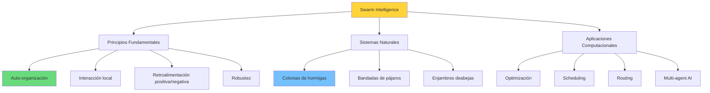
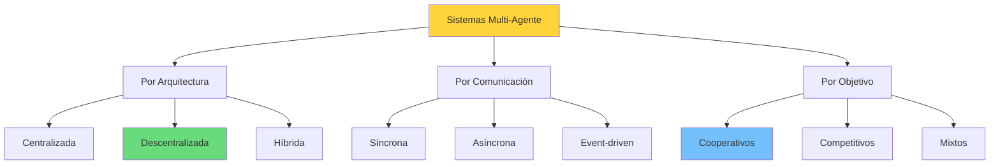
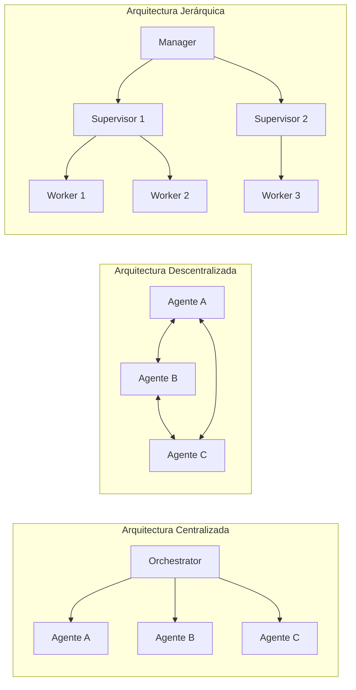
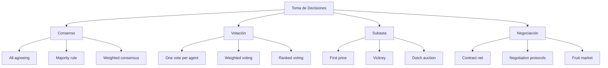
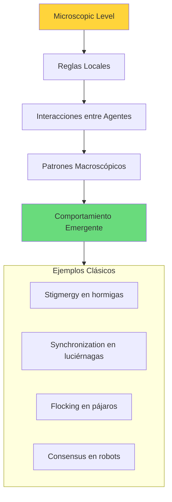

# Clase 20: Enjambres de Agentes - Fundamentos

## Duración
**4 horas** (240 minutos)

---

## Objetivos de Aprendizaje

Al finalizar esta clase, el estudiante será capaz de:

1. Comprender los fundamentos de swarm intelligence y su aplicación a sistemas multi-agente
2. Diseñar arquitecturas de comunicación agent-to-agent
3. Implementar mecanismos de toma de decisiones colectivas
4. Analizar y predecir comportamiento emergente en sistemas de múltiples agentes
5. Implementar sistemas multi-agente básicos con AutoGen y frameworks similares
6. Distinguir entre arquitecturas centralizadas y descentralizadas

---

## 1. Introducción a Swarm Intelligence

### 1.1 Definición y Orígenes

**Swarm Intelligence (SI)** es un paradigma computacional inspirado en el comportamiento colectivo de sistemas descentralizados naturales como:

- Colonias de hormigas
- Bandadas de pájaros
- Cardúmenes de peces
- colonias de termitas
- Enjambres deabejas



### 1.2 Principios de Diseño para Agentes de IA

```python
class AgentPrinciples:
    """
    Principios fundamentales para sistemas multi-agente de IA.
    """
    
    AUTONOMY = """
    Cada agente opera de manera semi-independiente,
    tomando decisiones locales basadas en su conocimiento
    y capacidad de percepción del entorno.
    """
    
    LOCAL_INTERACTION = """
    Los agentes interactúan solo con vecinos directos
    o a través de mecanismos de mensajería específicos,
    no hay control centralizado.
    """
    
    EMERGENCE = """
    El comportamiento colectivo emerge de las interacciones
    locales, sin planificación central. Patrones complejos
    surgen de reglas simples.
    """
    
    ADAPTATION = """
    El sistema se adapta dinámicamente a cambios
    en el entorno, fallos de componentes, y
    variaciones en carga.
    """
    
    HETEROGENEITY = """
    Agentes pueden tener diferentes capacidades,
    roles, y niveles de expertise para especializarse
    en subtareas específicas.
    """
```

### 1.3 Taxonomía de Sistemas Multi-Agente



---

## 2. Arquitecturas de Comunicación Agent-to-Agent

### 2.1 Patrones de Comunicación



### 2.2 Mensajes y Protocolos

```python
from enum import Enum
from typing import Any, Dict, Optional
from dataclasses import dataclass
from datetime import datetime
import json

class MessageType(Enum):
    REQUEST = "request"
    RESPONSE = "response"
    BROADCAST = "broadcast"
    NOTIFICATION = "notification"
    QUERY = "query"
    COMMAND = "command"
    HEARTBEAT = "heartbeat"

class MessagePriority(Enum):
    LOW = 1
    NORMAL = 2
    HIGH = 3
    CRITICAL = 4

@dataclass
class AgentMessage:
    """
    Estructura de mensaje estándar para comunicación entre agentes.
    """
    sender_id: str
    receiver_id: Optional[str]  # None = broadcast
    message_type: MessageType
    content: Dict[str, Any]
    priority: MessagePriority = MessagePriority.NORMAL
    conversation_id: Optional[str] = None
    timestamp: datetime = None
    reply_to: Optional[str] = None
    
    def __post_init__(self):
        if self.timestamp is None:
            self.timestamp = datetime.now()
        if self.conversation_id is None:
            self.conversation_id = f"{self.sender_id}-{self.timestamp.isoformat()}"
    
    def to_dict(self) -> Dict:
        return {
            "sender_id": self.sender_id,
            "receiver_id": self.receiver_id,
            "message_type": self.message_type.value,
            "content": self.content,
            "priority": self.priority.value,
            "conversation_id": self.conversation_id,
            "timestamp": self.timestamp.isoformat(),
            "reply_to": self.reply_to
        }
    
    @classmethod
    def from_dict(cls, data: Dict) -> 'AgentMessage':
        data["message_type"] = MessageType(data["message_type"])
        data["priority"] = MessagePriority(data["priority"])
        data["timestamp"] = datetime.fromisoformat(data["timestamp"])
        return cls(**data)

class MessageBus:
    """
    Bus de mensajes centralizado para comunicación entre agentes.
    """
    
    def __init__(self):
        self.subscribers: Dict[str, list] = {}
        self.message_queue: list = []
        self.handlers: Dict[str, callable] = {}
    
    def subscribe(self, agent_id: str, message_type: MessageType, 
                  handler: callable):
        """Suscribe un agente a un tipo de mensaje."""
        key = f"{agent_id}:{message_type.value}"
        self.handlers[key] = handler
    
    def publish(self, message: AgentMessage):
        """Publica un mensaje en el bus."""
        self.message_queue.append(message)
        self._dispatch(message)
    
    def _dispatch(self, message: AgentMessage):
        """Despacha mensaje al handler apropiado."""
        # Broadcast
        if message.receiver_id is None:
            for key, handler in self.handlers.items():
                if key.endswith(f":{message.message_type.value}"):
                    handler(message)
        else:
            # Direct message
            key = f"{message.receiver_id}:{message.message_type.value}"
            if key in self.handlers:
                self.handlers[key](message)
    
    def broadcast(self, sender_id: str, message_type: MessageType,
                  content: Dict):
        """Envía broadcast a todos los agentes."""
        message = AgentMessage(
            sender_id=sender_id,
            receiver_id=None,
            message_type=message_type,
            content=content
        )
        self.publish(message)
```

### 2.3 Implementación con AutoGen

```python
"""
Sistema multi-agente básico con AutoGen.
"""

from autogen import (
    AssistantAgent,
    UserProxyAgent,
    GroupChat,
    GroupChatManager,
    config_list_from_json
)

# Configuración de LLM
config_list = config_list_from_json(
    "../OAI_CONFIG_LIST",
    filter_dict={
        "model": ["gpt-4", "gpt-3.5-turbo"]
    }
)

# Agente Asistente - Especializado en Código
coding_agent = AssistantAgent(
    name="coding_expert",
    llm_config={
        "config_list": config_list,
        "temperature": 0.2
    },
    system_message="""
    Eres un experto en programación. Tu rol es:
    1. Escribir código limpio y eficiente
    2. Revisar y sugerir mejoras
    3. Explicar conceptos técnicos
    
    Cuando recibas una tarea:
    - Analiza los requisitos
    - Propón una solución
    - Implementa el código
    - Verifica que funcione
    """
)

# Agente Asistente - Especializado en Revisión
review_agent = AssistantAgent(
    name="code_reviewer",
    llm_config={
        "config_list": config_list,
        "temperature": 0.1
    },
    system_message="""
    Eres un revisor de código experto. Tu rol es:
    1. Revisar código en busca de bugs
    2. Verificar adherence a best practices
    3. Sugerir optimizaciones
    4. Asegurar calidad del código
    
    Cuando recibas código:
    - Analiza estructura
    - Identifica issues potenciales
    - Proporciona feedback constructivo
    """
)

# Agente de Testing
testing_agent = AssistantAgent(
    name="testing_expert",
    llm_config={
        "config_list": config_list,
        "temperature": 0.3
    },
    system_message="""
    Eres un experto en testing. Tu rol es:
    1. Diseñar casos de prueba
    2. Escribir tests unitarios
    3. Verificar cobertura de tests
    4. Validar funcionalidad
    
    Cuando recibas código:
    - Diseña casos de prueba
    - Escribe tests exhaustivos
    - Reporta resultados
    """
)

# User Proxy - Interfaz con usuario humano
user_proxy = UserProxyAgent(
    name="user_proxy",
    human_input_mode="NEVER",
    max_consecutive_auto_reply=10,
    code_execution_config={
        "work_dir": "coding_project",
        "use_docker": False
    }
)

def setup_coding_team():
    """
    Configura equipo de agentes para desarrollo de código.
    """
    
    # Group chat con selección automática de speaker
    group_chat = GroupChat(
        agents=[user_proxy, coding_agent, review_agent, testing_agent],
        messages=[],
        max_round=10,
        speaker_selection_method="auto"
    )
    
    # Manager que coordina el grupo
    manager = GroupChatManager(
        groupchat=group_chat,
        llm_config={
            "config_list": config_list,
            "temperature": 0.2
        }
    )
    
    return manager

def run_collaborative_task(task: str):
    """
    Ejecuta una tarea colaborativa con múltiples agentes.
    """
    
    manager = setup_coding_team()
    
    # Iniciar conversación
    chat_result = user_proxy.initiate_chat(
        manager,
        message=f"""
        Tarea: {task}
        
        Por favor, coordina a los agentes para completar esta tarea
        de manera colaborativa. El coding_expert implementará la solución,
        code_reviewer la revisará, y testing_expert creará tests.
        """
    )
    
    return chat_result

# Uso
# result = run_collaborative_task(
#     "Implementar una función que ordene una lista usando quicksort"
# )
```

### 2.4 Comunicación Asíncrona con Mensajes

```python
import asyncio
from typing import Dict, Set
import uuid

class AsyncAgent:
    """
    Agente asíncrono con comunicación basada en mensajes.
    """
    
    def __init__(self, agent_id: str, message_bus: 'AsyncMessageBus'):
        self.agent_id = agent_id
        self.message_bus = message_bus
        self.inbox: asyncio.Queue = asyncio.Queue()
        self.running = False
        self.handlers: Dict[str, callable] = {}
    
    async def start(self):
        """Inicia el agente."""
        self.running = True
        await self.message_bus.subscribe(self.agent_id, self.handle_message)
        asyncio.create_task(self.process_messages())
        await self.on_start()
    
    async def stop(self):
        """Detiene el agente."""
        self.running = False
        await self.on_stop()
    
    async def process_messages(self):
        """Procesa mensajes del inbox."""
        while self.running:
            try:
                message = await asyncio.wait_for(
                    self.inbox.get(),
                    timeout=1.0
                )
                await self.handle_message(message)
            except asyncio.TimeoutError:
                continue
    
    async def handle_message(self, message: Dict):
        """Maneja mensaje recibido."""
        handler_key = message.get("type", "default")
        if handler_key in self.handlers:
            await self.handlers[handler_key](message)
        else:
            await self.default_handler(message)
    
    async def default_handler(self, message: Dict):
        """Handler por defecto."""
        print(f"{self.agent_id} received: {message}")
    
    async def send_message(self, receiver_id: str, 
                          message_type: str, content: Dict):
        """Envía mensaje a otro agente."""
        message = {
            "id": str(uuid.uuid4()),
            "sender": self.agent_id,
            "receiver": receiver_id,
            "type": message_type,
            "content": content,
            "timestamp": asyncio.get_event_loop().time()
        }
        await self.message_bus.send(message)
    
    async def broadcast(self, message_type: str, content: Dict):
        """Broadcast a todos los agentes."""
        message = {
            "id": str(uuid.uuid4()),
            "sender": self.agent_id,
            "receiver": None,  # Broadcast
            "type": message_type,
            "content": content,
            "timestamp": asyncio.get_event_loop().time()
        }
        await self.message_bus.broadcast(message)
    
    def register_handler(self, message_type: str, handler: callable):
        """Registra handler para tipo de mensaje."""
        self.handlers[message_type] = handler
    
    async def on_start(self):
        """Hook para inicialización."""
        pass
    
    async def on_stop(self):
        """Hook para limpieza."""
        pass


class AsyncMessageBus:
    """
    Bus de mensajes asíncrono.
    """
    
    def __init__(self):
        self.subscribers: Dict[str, Set[asyncio.Queue]] = {}
        self.all_messages: Set[asyncio.Queue] = set()
    
    async def subscribe(self, agent_id: str, callback: callable):
        """Suscribe agente a mensajes."""
        queue = asyncio.Queue()
        
        if agent_id not in self.subscribers:
            self.subscribers[agent_id] = set()
        self.subscribers[agent_id].add(queue)
        
        asyncio.create_task(self._deliver_messages(queue, agent_id, callback))
    
    async def _deliver_messages(self, queue: asyncio.Queue,
                                 agent_id: str, callback: callable):
        """Entrega mensajes a suscriptor."""
        while True:
            message = await queue.get()
            await callback(message)
            queue.task_done()
    
    async def send(self, message: Dict):
        """Envía mensaje a receptor específico."""
        receiver = message.get("receiver")
        
        if receiver in self.subscribers:
            for queue in self.subscribers[receiver]:
                await queue.put(message)
    
    async def broadcast(self, message: Dict):
        """Broadcast mensaje a todos los suscriptores."""
        for queues in self.subscribers.values():
            for queue in queues:
                await queue.put(message)


# Ejemplo de agente especializado
class DataProcessingAgent(AsyncAgent):
    """
    Agente especializado en procesamiento de datos.
    """
    
    async def on_start(self):
        self.register_handler("process_data", self.handle_process_data)
        self.register_handler("aggregate", self.handle_aggregate)
    
    async def handle_process_data(self, message: Dict):
        """Procesa datos recibidos."""
        data = message["content"]["data"]
        operation = message["content"]["operation"]
        
        result = await self.process(data, operation)
        
        await self.send_message(
            receiver_id=message["sender"],
            message_type="result",
            content={
                "task_id": message["content"].get("task_id"),
                "result": result
            }
        )
    
    async def handle_aggregate(self, message: Dict):
        """Agrega datos de múltiples fuentes."""
        datasets = message["content"]["datasets"]
        method = message["content"]["method"]
        
        aggregated = await self.aggregate(datasets, method)
        
        await self.send_message(
            receiver_id=message["sender"],
            message_type="aggregated_result",
            content={
                "result": aggregated
            }
        )
    
    async def process(self, data: list, operation: str) -> Dict:
        """Ejecuta operación sobre datos."""
        if operation == "filter":
            return {"filtered": [x for x in data if x > 0]}
        elif operation == "transform":
            return {"transformed": [x * 2 for x in data]}
        elif operation == "analyze":
            return {
                "mean": sum(data) / len(data),
                "count": len(data),
                "sum": sum(data)
            }
        return {}
    
    async def aggregate(self, datasets: list, method: str) -> Dict:
        """Agrega múltiples datasets."""
        if method == "merge":
            return {"merged": [item for ds in datasets for item in ds]}
        elif method == "join":
            # Simplified join
            return {"joined": list(zip(datasets[0], datasets[1] if len(datasets) > 1 else []))}
        return {}
```

---

## 3. Toma de Decisiones Colectivas

### 3.1 Mecanismos de Decisión Distribuida



### 3.2 Implementación de Consenso

```python
import asyncio
from typing import List, Dict, Optional
from dataclasses import dataclass
import random

@dataclass
class Proposal:
    agent_id: str
    value: any
    confidence: float
    justification: str

@dataclass
class Vote:
    voter_id: str
    proposal_id: str
    weight: float
    reasoning: str

class ConsensusProtocol:
    """
    Implementa protocolo de consenso distribuido.
    """
    
    def __init__(self, agents: List[str], threshold: float = 0.5):
        self.agents = set(agents)
        self.proposals: Dict[str, Proposal] = {}
        self.votes: List[Vote] = []
        self.threshold = threshold
        self.decisions: List[any] = []
    
    async def propose(self, agent_id: str, value: any, 
                     confidence: float, justification: str):
        """Un agente propone una solución."""
        proposal_id = f"{agent_id}-{len(self.proposals)}"
        
        proposal = Proposal(
            agent_id=agent_id,
            value=value,
            confidence=confidence,
            justification=justification
        )
        
        self.proposals[proposal_id] = proposal
        return proposal_id
    
    async def vote(self, voter_id: str, proposal_id: str,
                  weight: float, reasoning: str):
        """Un agente vota por una propuesta."""
        if voter_id not in self.agents:
            raise ValueError(f"Unknown agent: {voter_id}")
        
        if proposal_id not in self.proposals:
            raise ValueError(f"Unknown proposal: {proposal_id}")
        
        vote = Vote(
            voter_id=voter_id,
            proposal_id=proposal_id,
            weight=weight,
            reasoning=reasoning
        )
        
        self.votes.append(vote)
        
        # Verificar si hay consenso
        if await self.check_consensus():
            return self.get_decision()
        
        return None
    
    async def check_consensus(self) -> bool:
        """Verifica si se ha alcanzado consenso."""
        if not self.proposals or not self.votes:
            return False
        
        # Calcular score ponderado para cada propuesta
        proposal_scores = {}
        
        for vote in self.votes:
            pid = vote.proposal_id
            if pid not in proposal_scores:
                proposal_scores[pid] = 0
            proposal_scores[pid] += vote.weight
        
        # Normalizar por número de agentes
        max_score = max(proposal_scores.values()) if proposal_scores else 0
        total_agents = len(self.agents)
        
        for pid, score in proposal_scores.items():
            normalized_score = score / total_agents
            if normalized_score >= self.threshold:
                self.decisions.append(self.proposals[pid].value)
                return True
        
        return False
    
    def get_decision(self) -> Optional[any]:
        """Retorna la decisión tomada."""
        if not self.decisions:
            return None
        
        # Retornar la propuesta con mayor score
        proposal_scores = {}
        for vote in self.votes:
            pid = vote.proposal_id
            if pid not in proposal_scores:
                proposal_scores[pid] = 0
            proposal_scores[pid] += vote.weight
        
        best_pid = max(proposal_scores, key=proposal_scores.get)
        return self.proposals[best_pid].value
    
    async def run_round(self, agent_proposals: Dict[str, any]):
        """Ejecuta una ronda completa de consenso."""
        
        # Fase de propuesta
        proposal_ids = []
        for agent_id, value in agent_proposals.items():
            pid = await self.propose(
                agent_id=agent_id,
                value=value,
                confidence=0.8,
                justification=f"Proposed by {agent_id}"
            )
            proposal_ids.append(pid)
        
        # Fase de votación (simulada)
        for agent_id in self.agents:
            # Cada agente vota por la propuesta más cercana a su preferencia
            for pid in proposal_ids:
                vote_weight = random.uniform(0.5, 1.0)
                await self.vote(
                    voter_id=agent_id,
                    proposal_id=pid,
                    weight=vote_weight,
                    reasoning="Best fit for task"
                )
        
        return self.get_decision()


class WeightedMajorityConsensus:
    """
    Consenso por mayoría ponderada con reputación.
    """
    
    def __init__(self, agents: Dict[str, float]):
        """
        Inicializa con agentes y sus pesos/reputación.
        
        Args:
            agents: Dict mapping agent_id -> reputation/weight
        """
        self.agent_weights = agents
        self.votes: Dict[str, float] = {}
    
    async def tally_votes(self, votes: Dict[str, Dict[str, float]]) -> str:
        """
        Cuenta votos ponderados por reputación.
        
        Args:
            votes: {agent_id: {option: confidence_score}}
        
        Returns:
            Opción ganadora
        """
        option_scores: Dict[str, float] = {}
        
        for agent_id, agent_votes in votes.items():
            agent_weight = self.agent_weights.get(agent_id, 1.0)
            
            for option, confidence in agent_votes.items():
                if option not in option_scores:
                    option_scores[option] = 0
                option_scores[option] += agent_weight * confidence
        
        # Retornar opción con mayor score
        if option_scores:
            return max(option_scores, key=option_scores.get)
        
        return None
```

### 3.3 Protocolo Contract Net

```python
"""
Implementación del protocolo Contract Net para negociación
entre agentes.
"""

from enum import Enum
from dataclasses import dataclass
from typing import Optional, Dict
import uuid

class ContractNetPhase(Enum):
    ANNOUNCE = "announce"
    BID = "bid"
    AWARD = "award"
    EXECUTE = "execute"
    TERMINATE = "terminate"

@dataclass
class TaskAnnouncement:
    task_id: str
    manager_id: str
    description: str
    constraints: Dict
    deadline: float
    eligibility_criteria: list

@dataclass
class Bid:
    bid_id: str
    contractor_id: str
    task_id: str
    price: float
    estimated_time: float
    capability_statement: str

@dataclass
class Contract:
    contract_id: str
    task_id: str
    manager_id: str
    contractor_id: str
    price: float
    terms: Dict

class ContractNetManager:
    """
    Agente manager que usa Contract Net para delegar tareas.
    """
    
    def __init__(self, agent_id: str):
        self.agent_id = agent_id
        self.active_tasks: Dict[str, TaskAnnouncement] = {}
        self.received_bids: Dict[str, list] = {}
        self.contracts: Dict[str, Contract] = {}
    
    def announce_task(self, description: str, constraints: Dict,
                     deadline: float, eligibility: list) -> str:
        """Anuncia una tarea a contractors potenciales."""
        task_id = str(uuid.uuid4())
        
        announcement = TaskAnnouncement(
            task_id=task_id,
            manager_id=self.agent_id,
            description=description,
            constraints=constraints,
            deadline=deadline,
            eligibility_criteria=eligibility
        )
        
        self.active_tasks[task_id] = announcement
        self.received_bids[task_id] = []
        
        # En mundo real, esto se broadcastearía a la red
        return announcement
    
    def receive_bid(self, bid: Bid):
        """Recibe bid de un contractor."""
        if bid.task_id in self.received_bids:
            self.received_bids[bid.task_id].append(bid)
    
    def evaluate_bids(self, task_id: str, 
                     criteria: Dict) -> Optional[Bid]:
        """
        Evalúa bids recibidos y selecciona el mejor.
        
        Criteria puede incluir: precio, tiempo, calidad, reputación
        """
        bids = self.received_bids.get(task_id, [])
        
        if not bids:
            return None
        
        # Evaluación ponderada
        best_bid = None
        best_score = -float('inf')
        
        for bid in bids:
            score = (
                criteria.get('price_weight', 0.3) * (1 / bid.price) +
                criteria.get('time_weight', 0.3) * (1 / bid.estimated_time) +
                criteria.get('quality_weight', 0.4) * 1.0  # Simplified
            )
            
            if score > best_score:
                best_score = score
                best_bid = bid
        
        return best_bid
    
    def award_contract(self, bid: Bid) -> Contract:
        """Adjudica contrato al contractor seleccionado."""
        contract = Contract(
            contract_id=str(uuid.uuid4()),
            task_id=bid.task_id,
            manager_id=self.agent_id,
            contractor_id=bid.contractor_id,
            price=bid.price,
            terms={
                "deadline": self.active_tasks[bid.task_id].deadline,
                "constraints": self.active_tasks[bid.task_id].constraints
            }
        )
        
        self.contracts[contract.contract_id] = contract
        
        # Remover task activa
        if bid.task_id in self.active_tasks:
            del self.active_tasks[bid.task_id]
        
        return contract


class ContractNetContractor:
    """
    Agente contractor que responde a announcements.
    """
    
    def __init__(self, agent_id: str, capabilities: list):
        self.agent_id = agent_id
        self.capabilities = capabilities
        self.active_contracts: Dict[str, Contract] = {}
    
    def is_eligible(self, announcement: TaskAnnouncement) -> bool:
        """Verifica si el contractor es eligible para la tarea."""
        return all(
            cap in self.capabilities
            for cap in announcement.eligibility_criteria
        )
    
    def evaluate_opportunity(self, announcement: TaskAnnouncement) -> Dict:
        """
        Evalúa oportunidad de pujar por una tarea.
        Retorna feasibility y price estimation.
        """
        # Lógica de evaluación simplificada
        feasible = self.is_eligible(announcement)
        base_cost = 100  # Simplified
        estimated_time = 60
        
        return {
            "feasible": feasible,
            "estimated_price": base_cost * 1.2,  # 20% margin
            "estimated_time": estimated_time,
            "confidence": 0.9 if feasible else 0.0
        }
    
    def submit_bid(self, announcement: TaskAnnouncement,
                  manager: ContractNetManager) -> Optional[Bid]:
        """Prepara y envía bid al manager."""
        evaluation = self.evaluate_opportunity(announcement)
        
        if not evaluation["feasible"]:
            return None
        
        bid = Bid(
            bid_id=str(uuid.uuid4()),
            contractor_id=self.agent_id,
            task_id=announcement.task_id,
            price=evaluation["estimated_price"],
            estimated_time=evaluation["estimated_time"],
            capability_statement=f"Capable of: {', '.join(self.capabilities)}"
        )
        
        manager.receive_bid(bid)
        return bid
    
    def receive_award(self, contract: Contract):
        """Recibe notificación de award."""
        self.active_contracts[contract.contract_id] = contract
    
    async def execute_task(self, contract: Contract) -> Dict:
        """Ejecuta la tarea contratada."""
        # Simular ejecución
        result = {
            "contract_id": contract.contract_id,
            "status": "completed",
            "output": {"result": "Task completed successfully"},
            "actual_time": contract.terms.get("deadline", 60) * 0.9
        }
        
        return result
```

---

## 4. Comportamiento Emergente

### 4.1 Conceptos de Emergencia



### 4.2 Simulación de Comportamiento Emergente

```python
import numpy as np
import matplotlib.pyplot as plt
from typing import List, Tuple
import random

class Boid:
    """
    Implementación de Boid (Bird-oid) para simular
    comportamiento de bandada.
    """
    
    def __init__(self, x: float, y: float, 
                 max_speed: float = 2.0, max_force: float = 0.03):
        self.position = np.array([x, y], dtype=float)
        self.velocity = np.random.rand(2) * 2 - 1
        self.acceleration = np.array([0.0, 0.0])
        self.max_speed = max_speed
        self.max_force = max_force
        self.history = [self.position.copy()]
    
    def apply_force(self, force: np.ndarray):
        """Aplica una fuerza al boid."""
        self.acceleration += force
    
    def separation(self, boids: List['Boid'], 
                   perception_radius: float = 25) -> np.ndarray:
        """Regla de separación: evitar colisiones."""
        steering = np.array([0.0, 0.0])
        total = 0
        
        for other in boids:
            distance = np.linalg.norm(self.position - other.position)
            if other != self and distance < perception_radius and distance > 0:
                diff = self.position - other.position
                diff /= distance  # Peso inverso a distancia
                steering += diff
                total += 1
        
        if total > 0:
            steering /= total
            steering = self._limit_vector(steering, self.max_force)
        
        return steering
    
    def alignment(self, boids: List['Boid'],
                  perception_radius: float = 50) -> np.ndarray:
        """Regla de alineación: ir en misma dirección."""
        steering = np.array([0.0, 0.0])
        total = 0
        
        for other in boids:
            distance = np.linalg.norm(self.position - other.position)
            if other != self and distance < perception_radius:
                steering += other.velocity
                total += 1
        
        if total > 0:
            steering /= total
            steering = self._limit_vector(steering, self.max_force)
            steering -= self.velocity / np.linalg.norm(self.velocity)
        
        return steering
    
    def cohesion(self, boids: List['Boid'],
                 perception_radius: float = 50) -> np.ndarray:
        """Regla de cohesión: moverse hacia centro local."""
        center = np.array([0.0, 0.0])
        total = 0
        
        for other in boids:
            distance = np.linalg.norm(self.position - other.position)
            if other != self and distance < perception_radius:
                center += other.position
                total += 1
        
        if total > 0:
            center /= total
            return self.seek(center)
        
        return np.array([0.0, 0.0])
    
    def seek(self, target: np.ndarray) -> np.ndarray:
        """Busca un objetivo."""
        desired = target - self.position
        desired = self._limit_vector(desired, self.max_speed)
        steering = desired - self.velocity
        return self._limit_vector(steering, self.max_force)
    
    def _limit_vector(self, vec: np.ndarray, max_magnitude: float) -> np.ndarray:
        """Limita magnitud de vector."""
        magnitude = np.linalg.norm(vec)
        if magnitude > max_magnitude:
            return vec * (max_magnitude / magnitude)
        return vec
    
    def update(self):
        """Actualiza posición y velocidad."""
        self.velocity += self.acceleration
        self.velocity = self._limit_vector(self.velocity, self.max_speed)
        self.position += self.velocity
        self.acceleration = np.array([0.0, 0.0])
        self.history.append(self.position.copy())
    
    def edges(self, width: float, height: float):
        """Wrap around screen edges."""
        if self.position[0] > width:
            self.position[0] = 0
        elif self.position[0] < 0:
            self.position[0] = width
        
        if self.position[1] > height:
            self.position[1] = 0
        elif self.position[1] < 0:
            self.position[1] = height


class FlockSimulation:
    """
    Simulación de bandada con reglas de Boids.
    """
    
    def __init__(self, num_boids: int = 100,
                 width: float = 800, height: float = 600):
        self.boids = [
            Boid(random.uniform(0, width), random.uniform(0, height))
            for _ in range(num_boids)
        ]
        self.width = width
        self.height = height
        
        # Pesos para cada regla
        self.separation_weight = 1.5
        self.alignment_weight = 1.0
        self.cohesion_weight = 1.0
    
    def step(self):
        """Ejecuta un paso de simulación."""
        for boid in self.boids:
            # Calcular fuerzas de cada regla
            separation = self.separation_weight * boid.separation(self.boids)
            alignment = self.alignment_weight * boid.alignment(self.boids)
            cohesion = self.cohesion_weight * boid.cohesion(self.boids)
            
            # Aplicar fuerzas
            boid.apply_force(separation)
            boid.apply_force(alignment)
            boid.apply_force(cohesion)
        
        # Actualizar posiciones
        for boid in self.boids:
            boid.update()
            boid.edges(self.width, self.height)
    
    def get_positions(self) -> List[Tuple[float, float]]:
        """Retorna posiciones de todos los boids."""
        return [(b.position[0], b.position[1]) for b in self.boids]
    
    def calculate_flock_metrics(self) -> dict:
        """
        Calcula métricas del flock.
        """
        positions = np.array([b.position for b in self.boids])
        velocities = np.array([b.velocity for b in self.boids])
        
        # Centroide
        centroid = np.mean(positions, axis=0)
        
        # Velocidad promedio (cohesión de movimiento)
        avg_velocity = np.mean(velocities, axis=0)
        avg_speed = np.linalg.norm(avg_velocity)
        
        # Dispersión (qué tan spread está el flock)
        distances_to_centroid = np.linalg.norm(positions - centroid, axis=1)
        dispersion = np.std(distances_to_centroid)
        
        # Polarización (qué tan alineados están)
        velocity_magnitudes = np.linalg.norm(velocities, axis=1)
        normalized_velocities = velocities / velocity_magnitudes[:, np.newaxis]
        polarization = np.linalg.norm(np.mean(normalized_velocities, axis=0))
        
        return {
            "centroid": centroid.tolist(),
            "avg_speed": avg_speed,
            "dispersion": dispersion,
            "polarization": polarization,
            "num_boids": len(self.boids)
        }


def demonstrate_emergence():
    """
    Demuestra comportamiento emergente en simulación.
    """
    
    # Crear simulación
    sim = FlockSimulation(num_boids=150)
    
    # Simular varios pasos
    metrics_history = []
    
    for step in range(500):
        sim.step()
        
        if step % 10 == 0:
            metrics = sim.get_flock_metrics()
            metrics_history.append({
                "step": step,
                **metrics
            })
    
    # Analizar convergencia
    initial_metrics = metrics_history[0]
    final_metrics = metrics_history[-1]
    
    print("=== Análisis de Comportamiento Emergente ===")
    print(f"\nEstado Inicial:")
    print(f"  Polarización: {initial_metrics['polarization']:.3f}")
    print(f"  Dispersión: {initial_metrics['dispersion']:.1f}")
    print(f"  Velocidad promedio: {initial_metrics['avg_speed']:.3f}")
    
    print(f"\nEstado Final:")
    print(f"  Polarización: {final_metrics['polarization']:.3f}")
    print(f"  Dispersión: {final_metrics['dispersion']:.1f}")
    print(f"  Velocidad promedio: {final_metrics['avg_speed']:.3f}")
    
    print(f"\n=== Interpretación ===")
    if final_metrics['polarization'] > 0.8:
        print("✓ Alta polarización: Boids muestran comportamiento alineado")
    if final_metrics['dispersion'] < initial_metrics['dispersion']:
        print("✓ Reducción de dispersión: Flock se ha compactado")
    
    return sim, metrics_history

# Uso
# sim, history = demonstrate_emergence()
```

---

## 5. Implementación Multi-Agente con AutoGen

### 5.1 Sistema de Agentes Cooperativos

```python
"""
Sistema multi-agente cooperativo para análisis de datos.
"""

from autogen import AssistantAgent, UserProxyAgent
from autogen.agentchat.contrib.agent_builder import AgentBuilder
from typing import Dict, List

class AgentSwarm:
    """
    Sistema de enjambre de agentes cooperativos.
    """
    
    def __init__(self, config_list: List[Dict]):
        self.config_list = config_list
        self.agents: Dict[str, AssistantAgent] = {}
        self.user_proxy = None
    
    def create_data_analyst(self) -> AssistantAgent:
        """Crea agente analista de datos."""
        return AssistantAgent(
            name="data_analyst",
            llm_config={
                "config_list": self.config_list,
                "temperature": 0.3
            },
            system_message="""
            Eres un analista de datos experto. Tu rol es:
            - Analizar datasets y extraer insights
            - Identificar patrones y anomalías
            - Proponer hipótesis basadas en datos
            - Crear visualizaciones informativas
            
            Trabajas colaborativamente con otros agentes.
            Comunica tus hallazgos de manera clara.
            """
        )
    
    def create_statistics_expert(self) -> AssistantAgent:
        """Crea agente experto en estadísticas."""
        return AssistantAgent(
            name="statistics_expert",
            llm_config={
                "config_list": self.config_list,
                "temperature": 0.1
            },
            system_message="""
            Eres un experto en estadística. Tu rol es:
            - Realizar análisis estadísticos rigurosos
            - Diseñar pruebas de hipótesis
            - Validar resultados con métodos apropiados
            - Interpretar intervalos de confianza y p-values
            
            Cuando trabajas con otros agentes, asegúrate
            de que los métodos usados sean estadísticamente válidos.
            """
        )
    
    def create_viz_specialist(self) -> AssistantAgent:
        """Crea especialista en visualización."""
        return AssistantAgent(
            name="viz_specialist",
            llm_config={
                "config_list": self.config_list,
                "temperature": 0.4
            },
            system_message="""
            Eres un especialista en visualización de datos. Tu rol es:
            - Crear gráficos claros y efectivos
            - Seleccionar tipos de visualización apropiados
            - Asegurar accesibilidad y legibilidad
            - Explicar cómo interpretar las visualizaciones
            """
        )
    
    def create_researcher(self) -> AssistantAgent:
        """Crea agente investigador."""
        return AssistantAgent(
            name="researcher",
            llm_config={
                "config_list": self.config_list,
                "temperature": 0.2
            },
            system_message="""
            Eres un investigador riguroso. Tu rol es:
            - Buscar información relevante y fuentes
            - Verificar hechos y datos
            - Proporcionar contexto y background
            - Citar fuentes apropiadas
            """
        )
    
    def setup_team(self):
        """Configura el equipo completo de agentes."""
        
        self.agents["data_analyst"] = self.create_data_analyst()
        self.agents["statistics_expert"] = self.create_statistics_expert()
        self.agents["viz_specialist"] = self.create_viz_specialist()
        self.agents["researcher"] = self.create_researcher()
        
        self.user_proxy = UserProxyAgent(
            name="user_proxy",
            human_input_mode="NEVER",
            max_consecutive_auto_reply=5
        )
    
    def run_collaborative_analysis(self, task: str) -> Dict:
        """
        Ejecuta análisis colaborativo.
        """
        
        if not self.agents:
            self.setup_team()
        
        # Orquestación manual para demo
        from autogen import GroupChat, GroupChatManager
        
        group_chat = GroupChat(
            agents=list(self.agents.values()) + [self.user_proxy],
            messages=[],
            max_round=8,
            speaker_selection_method="round_robin"
        )
        
        manager = GroupChatManager(
            groupchat=group_chat,
            llm_config={"config_list": self.config_list}
        )
        
        # Iniciar conversación
        result = self.user_proxy.initiate_chat(
            manager,
            message=f"""
            Tarea: {task}
            
            El equipo debe colaborar:
            1. Researcher busca información relevante
            2. Data Analyst examina el dataset
            3. Statistics Expert valida métodos
            4. Viz Specialist crea visualizaciones
            
            Coordinen entre ustedes para completar la tarea.
            """
        )
        
        return {
            "chat_history": group_chat.messages,
            "summary": result.summary
        }


class HierarchicalAgentSwarm:
    """
    Sistema jerárquico de agentes con Manager.
    """
    
    def __init__(self, config_list: List[Dict]):
        self.config_list = config_list
        self.manager = None
        self.supervisors: Dict[str, AssistantAgent] = {}
        self.workers: Dict[str, List[AssistantAgent]] = {}
    
    def create_manager(self) -> AssistantAgent:
        """Crea agente manager/supervisor general."""
        return AssistantAgent(
            name="manager",
            llm_config={"config_list": self.config_list},
            system_message="""
            Eres el manager de un equipo de agentes.
            Tu rol es:
            - Descomponer tareas complejas en subtareas
            - Asignar trabajo a supervisores especializados
            - Monitorear progreso y calidad
            - Integrar resultados de diferentes equipos
            - Tomar decisiones cuando hay conflictos
            
            Delegas trabajo pero mantienes visión global.
            """
        )
    
    def create_supervisor(self, name: str, domain: str) -> AssistantAgent:
        """Crea supervisor para un dominio específico."""
        return AssistantAgent(
            name=f"{name}_supervisor",
            llm_config={"config_list": self.config_list},
            system_message=f"""
            Eres supervisor del equipo de {domain}.
            Tu rol es:
            - Coordinar workers en tu equipo
            - Verificar calidad del trabajo
            - Escalar problemas al manager
            - Reportar progreso regularmente
            """
        )
    
    def create_worker(self, name: str, specialization: str) -> AssistantAgent:
        """Crea worker especializado."""
        return AssistantAgent(
            name=f"{name}_worker",
            llm_config={"config_list": self.config_list},
            system_message=f"""
            Eres un worker especializado en {specialization}.
            Tu rol es:
            - Ejecutar tareas específicas eficientemente
            - Seguir instrucciones del supervisor
            - Reportar resultados claramente
            - Pedir clarificación cuando sea necesario
            """
        )
    
    def setup_hierarchy(self):
        """Configura estructura jerárquica."""
        
        # Manager
        self.manager = self.create_manager()
        
        # Supervisors
        self.supervisors["coding"] = self.create_supervisor("coding", "código")
        self.supervisors["testing"] = self.create_supervisor("testing", "testing")
        self.supervisors["documentation"] = self.create_supervisor("docs", "documentación")
        
        # Workers
        self.workers["coding"] = [
            self.create_worker("backend", "backend development"),
            self.create_worker("frontend", "frontend development")
        ]
        
        self.workers["testing"] = [
            self.create_worker("unit", "unit testing"),
            self.create_worker("integration", "integration testing")
        ]
        
        self.workers["documentation"] = [
            self.create_worker("api", "API documentation"),
            self.create_worker("user", "user guides")
        ]
```

---

## 6. Tecnologías Específicas

| Tecnología | Propósito | Uso |
|------------|-----------|-----|
| **AutoGen** | Framework multi-agente | Orquestación de agentes |
| **CrewAI** | Agentes autonomous | Automation de tareas |
| **LangGraph** | Grafo de estados | Workflows complejos |
| **Swarm (OpenAI)** | Agentes ligeros | Prototyping rápido |
| **Magentic** | Integración con LLMs | Agentes basados en LLM |
| **Redis** | Message broker | Comunicación async |
| **RabbitMQ** | Message broker | Colas de mensajes |
| **Apache Kafka** | Streaming | Eventos distribuidos |

---

## 7. Actividades de Laboratorio

### Laboratorio 1: Implementación de Sistema Multi-Agente con AutoGen

**Objetivo**: Crear equipo de agentes para desarrollo de código colaborativo

**Duración**: 2 horas

**Pasos**:

1. **Instalar AutoGen**:
```bash
pip install pyautogen
```

2. **Crear archivos del proyecto**:
```python
# agents.py
from autogen import AssistantAgent, UserProxyAgent, GroupChat, GroupChatManager

# Configuración
config_list = [
    {
        "model": "gpt-4",
        "api_key": os.environ["OPENAI_API_KEY"]
    }
]

# Agente Codificador
coder = AssistantAgent(
    name="coder",
    llm_config={"config_list": config_list},
    system_message="Eres un programador experto..."
)

# Agente Revisor
reviewer = AssistantAgent(
    name="reviewer",
    llm_config={"config_list": config_list},
    system_message="Eres un revisor de código..."
)

# User Proxy
user = UserProxyAgent(name="user", human_input_mode="NEVER")

# Group Chat
group_chat = GroupChat(
    agents=[user, coder, reviewer],
    messages=[],
    max_round=5
)

manager = GroupChatManager(groupchat=group_chat, llm_config={"config_list": config_list})

# Ejecutar
user.initiate_chat(manager, message="Escribe una función para...")
```

3. **Ejecutar y observar comportamiento emergente**:
```bash
python agents.py
```

### Laboratorio 2: Simulación de Boids

**Objetivo**: Implementar y analizar comportamiento emergente

**Duración**: 2 horas

**Pasos**:

1. **Implementar simulación**:
```python
import numpy as np
import matplotlib.pyplot as plt
from matplotlib.animation import FuncAnimation

class Boid:
    # ... (implementación completa de la sección 4.2)

class FlockSimulation:
    # ... (implementación completa de la sección 4.2)

# Main
sim = FlockSimulation(num_boids=200)

def animate(frame):
    sim.step()
    positions = sim.get_positions()
    scat.set_offsets(positions)
    return scat,

fig, ax = plt.subplots()
scat = ax.scatter([], [], s=10)
ax.set_xlim(0, 800)
ax.set_ylim(0, 600)

anim = FuncAnimation(fig, animate, frames=500, interval=50)
plt.show()
```

2. **Experimentar con parámetros**:
```python
# Variar pesos y observar cambios
for sep_weight in [0.5, 1.0, 2.0, 3.0]:
    sim = FlockSimulation(num_boids=100)
    sim.separation_weight = sep_weight
    
    for _ in range(200):
        sim.step()
    
    metrics = sim.get_flock_metrics()
    print(f"Separation={sep_weight}: Polarization={metrics['polarization']:.2f}")
```

---

## 8. Resumen de Puntos Clave

### Swarm Intelligence Fundamentos

1. **Auto-organización**: Comportamiento global emerge de interacciones locales
2. **Interacción local**: Agentes solo interactúan con vecinos directos
3. **Retroalimentación**: Feedback positivo y negativo guía el sistema
4. **Robustez**: El sistema tolera fallos individuales

### Comunicación Entre Agentes

1. **Patrones de mensaje**: Request/Response, Publish/Subscribe, Broadcast
2. **Orquestación centralizada**: Un agente coordina a otros
3. **Comunicación descentralizada**: Agentes negocian directamente
4. **Message buses**: Middleware para desacoplar comunicación

### Toma de Decisiones Colectivas

1. **Consenso**: Todos los agentes acuerdan una decisión
2. **Votación**: Preferencia mayoritaria decide
3. **Contract Net**: Manager emite RFP, contractors pujan
4. **Negociación**: Agentes barganean por recursos

### Comportamiento Emergente

1. **Reglas simples**: Comportamiento complejo de reglas simples
2. **Flocking**: Separación, alineación, cohesión
3. **Stigmergy**: Comunicación indirecta a través del entorno
4. **Self-organization**: Patrones espontáneos sin control central

---

## Referencias Externas

1. **AutoGen Documentation**:
   https://microsoft.github.io/autogen/

2. **Swarm Intelligence: Concepts, Models and Technologies**:
   https://arxiv.org/abs/2103.06718

3. **Boids Algorithm (Craig Reynolds)**:
   https://www.red3d.com/cwr/boids/

4. **Contract Net Protocol**:
   https://www.cs.cmu.edu/~softagents/papers/Smith80.pdf

5. **Multi-Agent Systems: A Modern Approach**:
   https://www.cs.cmu.edu/~softagents/maa/

6. **CrewAI Framework**:
   https://github.com/joaomdmoura/crewAI

7. **LangGraph Documentation**:
   https://langchain-ai.github.io/langgraph/

8. **Emergence in Multi-Agent Systems**:
   https://en.wikipedia.org/wiki/Emergence

9. **Stigmergy**:
   https://en.wikipedia.org/wiki/Stigmergy

10. **Consensus Algorithms in Multi-Agent Systems**:
    https://en.wikipedia.org/wiki/Consensus_(computer_science)

---

**Siguiente Clase**: Clase 21 - Enjambres de Agentes: Implementación
