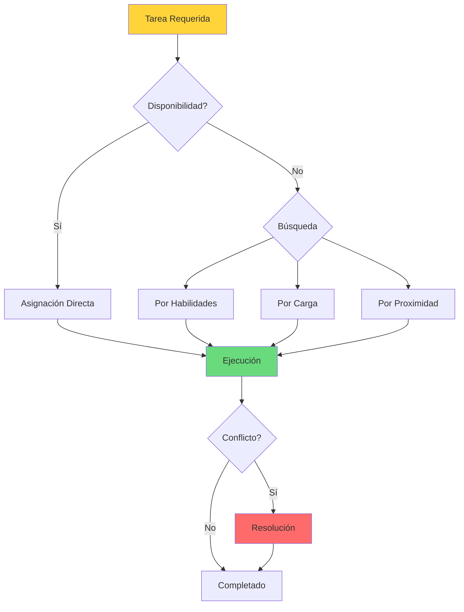
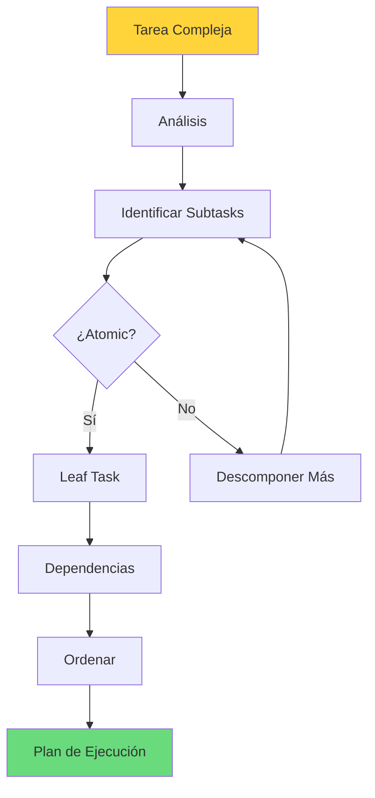
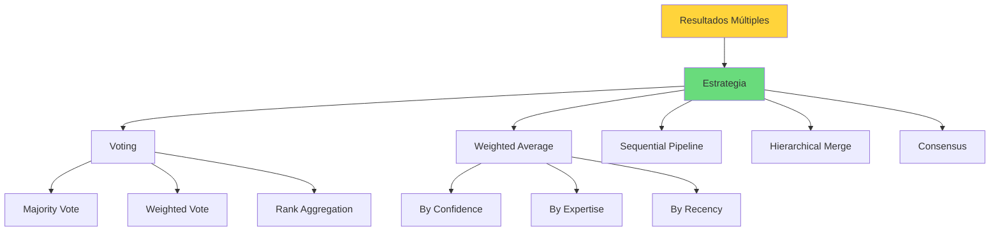
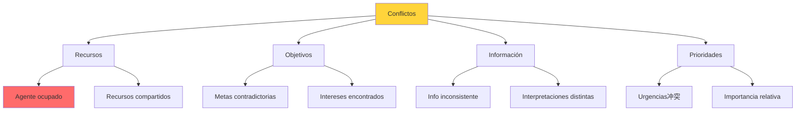

# Clase 21: Enjambres de Agentes - Implementación

## Duración
**4 horas** (240 minutos)

---

## Objetivos de Aprendizaje

Al finalizar esta clase, el estudiante será capaz de:

1. Implementar asignación de roles dinámicos en sistemas multi-agente
2. Diseñar descomposición automática de tareas complejas
3. Implementar agregación de resultados de múltiples agentes
4. Resolver conflictos entre agentes usando diferentes estrategias
5. Construir sistemas de agentes usando LangGraph y AutoGen
6. Implementar comunicación agent-to-agent con Redis

---

## 1. Asignación de Roles Dinámicos

### 1.1 Modelos de Asignación de Roles



### 1.2 Implementación de Sistema de Roles

```python
from enum import Enum
from typing import Dict, List, Optional, Set
from dataclasses import dataclass, field
from datetime import datetime
import uuid

class Role(Enum):
    COORDINATOR = "coordinator"
    PLANNER = "planner"
    EXECUTOR = "executor"
    MONITOR = "monitor"
    REPORTER = "reporter"
    SPECIALIST_CODE = "specialist_code"
    SPECIALIST_DATA = "specialist_data"
    SPECIALIST_RESEARCH = "specialist_research"

class Capability(Enum):
    CODING = "coding"
    DATA_ANALYSIS = "data_analysis"
    RESEARCH = "research"
    WRITING = "writing"
    REVIEW = "review"
    TESTING = "testing"
    DEPLOYMENT = "deployment"
    COMMUNICATION = "communication"

@dataclass
class AgentProfile:
    """Perfil de un agente con capacidades y roles."""
    agent_id: str
    name: str
    capabilities: Set[Capability]
    current_roles: Set[Role] = field(default_factory=set)
    workload: float = 0.0
    max_workload: float = 1.0
    availability: float = 1.0
    
    def can_take_task(self, complexity: float) -> bool:
        """Verifica si puede aceptar una tarea."""
        return (self.workload + complexity <= self.max_workload and 
                self.availability > 0)
    
    def assign_role(self, role: Role, complexity: float):
        """Asigna un rol al agente."""
        self.current_roles.add(role)
        self.workload += complexity
    
    def release_role(self, role: Role, complexity: float):
        """Libera un rol."""
        self.current_roles.discard(role)
        self.workload = max(0, self.workload - complexity)


class RoleAssignmentEngine:
    """
    Motor de asignación de roles dinámicos.
    """
    
    def __init__(self):
        self.agents: Dict[str, AgentProfile] = {}
        self.role_capabilities: Dict[Role, Set[Capability]] = {
            Role.COORDINATOR: {Capability.COMMUNICATION, Capability.MONITORING},
            Role.PLANNER: {Capability.RESEARCH, Capability.WRITING},
            Role.EXECUTOR: {Capability.CODING, Capability.DATA_ANALYSIS},
            Role.MONITOR: {Capability.REVIEW, Capability.COMMUNICATION},
            Role.REPORTER: {Capability.WRITING, Capability.COMMUNICATION},
            Role.SPECIALIST_CODE: {Capability.CODING, Capability.REVIEW},
            Role.SPECIALIST_DATA: {Capability.DATA_ANALYSIS, Capability.RESEARCH},
            Role.SPECIALIST_RESEARCH: {Capability.RESEARCH, Capability.WRITING}
        }
    
    def register_agent(self, agent_id: str, name: str,
                       capabilities: List[Capability]) -> AgentProfile:
        """Registra un nuevo agente."""
        profile = AgentProfile(
            agent_id=agent_id,
            name=name,
            capabilities=set(capabilities)
        )
        self.agents[agent_id] = profile
        return profile
    
    def find_best_agent(self, required_capabilities: Set[Capability],
                       task_complexity: float = 0.3) -> Optional[AgentProfile]:
        """Encuentra el mejor agente para las capacidades requeridas."""
        candidates = []
        
        for agent in self.agents.values():
            if not agent.can_take_task(task_complexity):
                continue
            
            # Verificar que tenga todas las capacidades requeridas
            if required_capabilities.issubset(agent.capabilities):
                score = (
                    agent.availability *
                    (1 - agent.workload / agent.max_workload) *
                    len(agent.capabilities & required_capabilities)
                )
                candidates.append((agent, score))
        
        if not candidates:
            return None
        
        # Ordenar por score y retornar el mejor
        candidates.sort(key=lambda x: x[1], reverse=True)
        return candidates[0][0]
    
    def assign_task(self, task: 'Task') -> Optional[AgentProfile]:
        """Asigna una tarea al mejor agente disponible."""
        required = task.required_capabilities
        agent = self.find_best_agent(required, task.complexity)
        
        if agent:
            agent.assign_role(task.implied_role, task.complexity)
            task.assigned_to = agent.agent_id
            task.status = TaskStatus.ASSIGNED
            task.assigned_at = datetime.now()
        
        return agent
    
    def reassign_if_needed(self, agent_id: str) -> bool:
        """Reasigna tareas si un agente se vuelve no disponible."""
        agent = self.agents.get(agent_id)
        if not agent:
            return False
        
        # Encontrar tareas que pueda reassignar
        reassigned = False
        
        # Esta lógica dependería de un task tracker
        # Simplificado aquí
        
        return reassigned


@dataclass
class Task:
    """Representación de una tarea."""
    task_id: str
    description: str
    required_capabilities: Set[Capability]
    implied_role: Role
    complexity: float = 0.3
    priority: int = 1
    assigned_to: Optional[str] = None
    status: str = "pending"
    assigned_at: Optional[datetime] = None
    completed_at: Optional[datetime] = None
    
    def __post_init__(self):
        if not self.task_id:
            self.task_id = str(uuid.uuid4())

class TaskStatus(Enum):
    PENDING = "pending"
    ASSIGNED = "assigned"
    IN_PROGRESS = "in_progress"
    COMPLETED = "completed"
    BLOCKED = "blocked"
    FAILED = "failed"
```

### 1.3 Roles Dinámicos con AutoGen

```python
"""
Sistema de roles dinámicos con AutoGen.
"""

from autogen import AssistantAgent, UserProxyAgent
from typing import Dict, List, Callable
import json

class DynamicRoleManager:
    """
    Gestor de roles dinámicos para AutoGen.
    """
    
    def __init__(self, config_list: List[Dict]):
        self.config_list = config_list
        self.agents: Dict[str, AssistantAgent] = {}
        self.role_definitions: Dict[str, str] = {}
        self.current_roles: Dict[str, str] = {}
    
    def define_role(self, role_name: str, system_message: str,
                   capabilities: List[str]):
        """Define un nuevo rol."""
        self.role_definitions[role_name] = {
            "message": system_message,
            "capabilities": capabilities
        }
    
    def create_agent_with_role(self, agent_id: str, role_name: str) -> AssistantAgent:
        """Crea un agente con un rol específico."""
        
        if role_name not in self.role_definitions:
            raise ValueError(f"Unknown role: {role_name}")
        
        role_def = self.role_definitions[role_name]
        
        agent = AssistantAgent(
            name=agent_id,
            llm_config={"config_list": self.config_list},
            system_message=role_def["message"]
        )
        
        self.agents[agent_id] = agent
        self.current_roles[agent_id] = role_name
        
        return agent
    
    def change_role(self, agent_id: str, new_role: str):
        """Cambia el rol de un agente en tiempo de ejecución."""
        
        if agent_id not in self.agents:
            raise ValueError(f"Unknown agent: {agent_id}")
        
        if new_role not in self.role_definitions:
            raise ValueError(f"Unknown role: {new_role}")
        
        role_def = self.role_definitions[new_role]
        self.agents[agent_id].update_system_message(role_def["message"])
        self.current_roles[agent_id] = new_role
    
    def get_agent_by_capability(self, capability: str) -> List[str]:
        """Encuentra agentes con una capacidad específica."""
        capable = []
        
        for agent_id, agent in self.agents.items():
            role_name = self.current_roles.get(agent_id, "")
            role_def = self.role_definitions.get(role_name, {})
            
            if capability in role_def.get("capabilities", []):
                capable.append(agent_id)
        
        return capable
    
    def execute_with_role(self, agent_id: str, role: str,
                         task: str) -> Dict:
        """Ejecuta tarea con rol temporal."""
        
        original_role = self.current_roles.get(agent_id)
        
        try:
            # Cambiar temporalmente al rol necesario
            self.change_role(agent_id, role)
            
            # Ejecutar tarea
            result = self.agents[agent_id].generate_reply([task])
            
            return {
                "success": True,
                "result": result,
                "original_role": original_role,
                "temp_role": role
            }
        finally:
            # Restaurar rol original
            if original_role:
                self.change_role(agent_id, original_role)


def setup_project_team_roles():
    """
    Configura roles típicos para un equipo de proyecto.
    """
    
    config_list = [{"model": "gpt-4", "api_key": "..."}]  # Config
    
    manager = DynamicRoleManager(config_list)
    
    # Definir roles
    manager.define_role(
        "planner",
        system_message="""
        Eres el planner del equipo. Tu responsabilidad es:
        - Descomponer tareas en subtareas manejables
        - Estimar tiempo y recursos
        - Crear roadmap de implementación
        - Identificar dependencias
        
        Trabaja de manera estructurada y sistemática.
        """,
        capabilities=["planning", "estimation", "coordination"]
    )
    
    manager.define_role(
        "coder",
        system_message="""
        Eres el coder del equipo. Tu responsabilidad es:
        - Implementar código limpio y eficiente
        - Seguir mejores prácticas
        - Escribir código documentado
        - Asegurar que el código compile y pase tests
        
        Prioriza calidad y mantenibilidad.
        """,
        capabilities=["coding", "testing", "review"]
    )
    
    manager.define_role(
        "reviewer",
        system_message="""
        Eres el reviewer del equipo. Tu responsabilidad es:
        - Revisar código en busca de issues
        - Verificar adherence a estándares
        - Sugerir mejoras
        - Aprobar o rechazar cambios
        
        Sé crítico pero constructivo.
        """,
        capabilities=["review", "quality", "security"]
    )
    
    manager.define_role(
        "tester",
        system_message="""
        Eres el tester del equipo. Tu responsabilidad es:
        - Diseñar casos de prueba
        - Escribir tests automáticos
        - Verificar cobertura
        - Reportar bugs
        
        Sé meticuloso y exhaustivo.
        """,
        capabilities=["testing", "debugging", "automation"]
    )
    
    return manager
```

---

## 2. Descomposición de Tareas

### 2.1 Algoritmo de Descomposición



### 2.2 Implementación de Task Decomposer

```python
from typing import List, Dict, Optional, Set
from dataclasses import dataclass, field
from enum import Enum
import uuid
import networkx as nx

class TaskType(Enum):
    ATOMIC = "atomic"
    COMPOSITE = "composite"
    CONDITIONAL = "conditional"
    PARALLEL = "parallel"

@dataclass
class SubTask:
    """Representación de una subtarea."""
    task_id: str
    description: str
    task_type: TaskType = TaskType.ATOMIC
    dependencies: List[str] = field(default_factory=list)
    assigned_to: Optional[str] = None
    status: str = "pending"
    estimated_duration: float = 0.0
    required_capabilities: Set[str] = field(default_factory=set)
    input_data: Dict = field(default_factory=dict)
    output_data: Dict = field(default_factory=dict)
    parent_id: Optional[str] = None
    priority: int = 1
    
    def __post_init__(self):
        if not self.task_id:
            self.task_id = str(uuid.uuid4())

class TaskDecomposer:
    """
    Descompone tareas complejas en subtareas manejables.
    """
    
    def __init__(self, llm_client=None):
        self.llm_client = llm_client
        self.task_graph = nx.DiGraph()
    
    async def decompose_llm(self, task_description: str,
                           context: Dict = None) -> List[SubTask]:
        """
        Usa LLM para descomponer tarea.
        """
        
        if not self.llm_client:
            raise ValueError("LLM client required for automatic decomposition")
        
        prompt = f"""
        Descompón la siguiente tarea en subtareas manejables.
        
        Tarea: {task_description}
        
        Contexto adicional: {context or {}}
        
        Para cada subtarea especifica:
        1. Descripción clara
        2. Dependencias de otras subtareas
        3. Capacidades requeridas
        4. Estimación de duración (en minutos)
        5. Si es atómica o puede descomponerse más
        
        Formato de respuesta (JSON):
        {{
            "subtasks": [
                {{
                    "description": "...",
                    "dependencies": ["task_id_1", "task_id_2"],
                    "required_capabilities": ["coding", "review"],
                    "estimated_duration_minutes": 30,
                    "task_type": "atomic" o "composite"
                }}
            ]
        }}
        """
        
        response = await self.llm_client.complete(prompt)
        decomposition = json.loads(response)
        
        subtasks = []
        for i, task_data in enumerate(decomposition["subtasks"]):
            task = SubTask(
                task_id=f"task_{i}_{uuid.uuid4().hex[:8]}",
                description=task_data["description"],
                dependencies=task_data.get("dependencies", []),
                required_capabilities=set(task_data.get("required_capabilities", [])),
                estimated_duration=task_data.get("estimated_duration_minutes", 30),
                task_type=TaskType.ATOMIC if task_data.get("task_type") == "atomic" 
                          else TaskType.COMPOSITE
            )
            subtasks.append(task)
        
        return subtasks
    
    def decompose_rule_based(self, task_description: str) -> List[SubTask]:
        """
        Descomposición basada en reglas predefinidas.
        """
        
        subtasks = []
        
        # Descomposición estándar
        standard_steps = [
            ("research", "Investigar y recopilar información", {"research"}),
            ("analyze", "Analizar información recopilada", {"analysis", "research"}),
            ("design", "Diseñar solución", {"design", "analysis"}),
            ("implement", "Implementar solución", {"coding", "design"}),
            ("test", "Probar implementación", {"testing", "coding"}),
            ("review", "Revisar y pulir", {"review", "testing"}),
            ("document", "Documentar resultado", {"writing"})
        ]
        
        for i, (step_id, description, capabilities) in enumerate(standard_steps):
            task = SubTask(
                task_id=f"step_{i}_{step_id}",
                description=description,
                required_capabilities=capabilities,
                task_type=TaskType.ATOMIC,
                estimated_duration=30,
                dependencies=[f"step_{i-1}_{standard_steps[i-1][0]}"] if i > 0 else []
            )
            subtasks.append(task)
        
        return subtasks
    
    def build_execution_graph(self, subtasks: List[SubTask]) -> nx.DiGraph:
        """Construye grafo de dependencias."""
        
        graph = nx.DiGraph()
        
        # Añadir nodos
        for task in subtasks:
            graph.add_node(
                task.task_id,
                description=task.description,
                capabilities=task.required_capabilities,
                duration=task.estimated_duration
            )
        
        # Añadir edges de dependencias
        for task in subtasks:
            for dep_id in task.dependencies:
                graph.add_edge(dep_id, task.task_id)
        
        self.task_graph = graph
        return graph
    
    def get_execution_order(self) -> List[List[str]]:
        """Obtiene orden de ejecución (niveles)."""
        
        if not self.task_graph.nodes():
            return []
        
        # Topological sort por niveles
        levels = []
        remaining = set(self.task_graph.nodes())
        executed = set()
        
        while remaining:
            # Encontrar nodos sin dependencias no ejecutadas
            current_level = []
            
            for node in remaining:
                deps = set(self.task_graph.predecessors(node))
                if deps.issubset(executed):
                    current_level.append(node)
            
            if not current_level:
                # Ciclo detectado
                break
            
            levels.append(current_level)
            executed.update(current_level)
            remaining.difference_update(current_level)
        
        return levels
    
    def calculate_critical_path(self) -> List[str]:
        """Calcula ruta crítica (longest path)."""
        
        if not self.task_graph.nodes():
            return []
        
        # Distancias desde inicio
        distances = {}
        
        # Topological sort
        for node in nx.topological_sort(self.task_graph):
            predecessors = list(self.task_graph.predecessors(node))
            
            if not predecessors:
                distances[node] = self.task_graph.nodes[node].get("duration", 1)
            else:
                distances[node] = max(
                    distances[pred] + self.task_graph.nodes[node].get("duration", 1)
                    for pred in predecessors
                )
        
        # Reconstruir camino
        max_dist = max(distances.values())
        critical_path = []
        current = max(distances, key=distances.get)
        
        while current is not None:
            critical_path.insert(0, current)
            successors = list(self.task_graph.successors(current))
            
            if not successors:
                break
            
            current = max(
                successors,
                key=lambda s: distances[s],
                default=None
            )
            
            if current and distances[current] < distances[critical_path[0]] - 1:
                break
        
        return critical_path


class ParallelTaskExecutor:
    """
    Ejecuta tareas en paralelo cuando es posible.
    """
    
    def __init__(self, agent_factory):
        self.agent_factory = agent_factory
        self.execution_results: Dict[str, any] = {}
    
    async def execute_parallel_level(self, tasks: List[SubTask],
                                     agents: Dict[str, any]) -> Dict[str, any]:
        """Ejecuta un nivel de tareas en paralelo."""
        
        import asyncio
        
        async def execute_single(task: SubTask, agent: any):
            """Ejecuta una única tarea."""
            
            # Preparar input
            input_data = task.input_data.copy()
            
            # Ejecutar con agente
            if hasattr(agent, 'generate_reply'):
                result = await agent.generate_reply([task.description])
            else:
                result = await agent.execute(task.description, **input_data)
            
            self.execution_results[task.task_id] = result
            
            return task.task_id, result
        
        # Ejecutar todas en paralelo
        tasks_with_agents = []
        for task in tasks:
            if task.assigned_to and task.assigned_to in agents:
                tasks_with_agents.append((task, agents[task.assigned_to]))
        
        results = await asyncio.gather(
            *[execute_single(t, a) for t, a in tasks_with_agents],
            return_exceptions=True
        )
        
        return {r[0]: r[1] for r in results if not isinstance(r, Exception)}
    
    async def execute_plan(self, subtasks: List[SubTask],
                          decomposer: TaskDecomposer,
                          context: Dict) -> Dict[str, any]:
        """Ejecuta plan completo."""
        
        # Construir grafo
        graph = decomposer.build_execution_graph(subtasks)
        
        # Obtener niveles de ejecución
        levels = decomposer.get_execution_order()
        
        all_results = {}
        
        # Ejecutar nivel por nivel
        for level_idx, level_tasks in enumerate(levels):
            tasks = [t for t in subtasks if t.task_id in level_tasks]
            
            # Asignar agentes basado en capacidades
            agents = self._assign_agents(tasks, context)
            
            # Ejecutar en paralelo
            level_results = await self.execute_parallel_level(tasks, agents)
            
            # Pasar outputs como inputs para siguiente nivel
            for task_id, result in level_results.items():
                all_results[task_id] = result
                
                # Encontrar tareas dependientes y actualizar inputs
                for t in subtasks:
                    if task_id in t.dependencies:
                        t.input_data[task_id] = result
        
        return all_results
    
    def _assign_agents(self, tasks: List[SubTask],
                       context: Dict) -> Dict[str, any]:
        """Asigna agentes a tareas basado en capacidades."""
        
        # En implementación real, usar RoleAssignmentEngine
        agents = {}
        for task in tasks:
            # Assignment simplificado
            if "coding" in task.required_capabilities:
                agents[task.task_id] = context.get("coder_agent")
            elif "testing" in task.required_capabilities:
                agents[task.task_id] = context.get("tester_agent")
            else:
                agents[task.task_id] = context.get("default_agent")
        
        return agents
```

---

## 3. Agregación de Resultados

### 3.1 Estrategias de Agregación



### 3.2 Implementación de Agregadores

```python
from typing import List, Dict, Any, Callable, Optional
from dataclasses import dataclass
import numpy as np
from collections import Counter

@dataclass
class AgentResult:
    """Resultado de un agente individual."""
    agent_id: str
    result: Any
    confidence: float = 1.0
    expertise: float = 1.0
    metadata: Dict = None
    
    def __post_init__(self):
        if self.metadata is None:
            self.metadata = {}


class ResultAggregator:
    """
    Agregador de resultados de múltiples agentes.
    """
    
    def __init__(self):
        self.strategies = {
            "voting": self._voting_aggregate,
            "weighted": self._weighted_average,
            "sequential": self._sequential_aggregate,
            "hierarchical": self._hierarchical_aggregate,
            "consensus": self._consensus_aggregate
        }
    
    def aggregate(self, results: List[AgentResult],
                 strategy: str = "weighted") -> Any:
        """Agrega resultados usando estrategia especificada."""
        
        if strategy not in self.strategies:
            raise ValueError(f"Unknown strategy: {strategy}")
        
        return self.strategies[strategy](results)
    
    def _voting_aggregate(self, results: List[AgentResult]) -> Any:
        """Agregación por votación."""
        
        # Para resultados categóricos
        votes = [r.result for r in results]
        counter = Counter(votes)
        
        # Retornar el más投票ado
        return counter.most_common(1)[0][0]
    
    def _weighted_average(self, results: List[AgentResult]) -> float:
        """Agregación por promedio ponderado."""
        
        total_weight = sum(
            r.confidence * r.expertise for r in results
        )
        
        if total_weight == 0:
            return np.mean([r.result for r in results])
        
        weighted_sum = sum(
            r.result * r.confidence * r.expertise for r in results
        )
        
        return weighted_sum / total_weight
    
    def _sequential_aggregate(self, results: List[AgentResult]) -> Any:
        """Agregación secuencial (pipeline)."""
        
        current = None
        
        for r in results:
            if current is None:
                current = r.result
            else:
                # Aplicar transformación secuencial
                if isinstance(current, str) and isinstance(r.result, str):
                    current = f"{current}\n{r.result}"
                elif isinstance(current, dict) and isinstance(r.result, dict):
                    current = {**current, **r.result}
                else:
                    current = r.result
        
        return current
    
    def _hierarchical_aggregate(self, results: List[AgentResult]) -> Dict:
        """Agregación jerárquica."""
        
        # Agrupar por agente
        by_agent = {}
        for r in results:
            if r.agent_id not in by_agent:
                by_agent[r.agent_id] = []
            by_agent[r.agent_id].append(r)
        
        # Agregar por agente
        agent_outputs = {}
        for agent_id, agent_results in by_agent.items():
            # Usar weighted average para cada agente
            if len(agent_results) == 1:
                agent_outputs[agent_id] = agent_results[0].result
            else:
                agent_outputs[agent_id] = self._weighted_average(agent_results)
        
        # Agregar agentes
        return {
            "individual_outputs": agent_outputs,
            "final_output": self._weighted_average(results),
            "summary": self._generate_summary(agent_outputs)
        }
    
    def _consensus_aggregate(self, results: List[AgentResult]) -> Dict:
        """Agregación por consenso."""
        
        # Para respuestas textuales, buscar overlap
        texts = [r.result for r in results if isinstance(r.result, str)]
        
        if not texts:
            return self._weighted_average(results)
        
        # Encontrar segmentos comunes
        consensus_segments = self._find_consensus(texts)
        
        return {
            "consensus": consensus_segments,
            "confidence": len(consensus_segments) / len(texts),
            "alternatives": list(set(texts) - set(consensus_segments))
        }
    
    def _find_consensus(self, texts: List[str]) -> List[str]:
        """Encuentra segmentos de consenso entre textos."""
        
        # Implementación simplificada
        # En práctica, usar embeddings y similarity
        
        if not texts:
            return []
        
        words = [set(t.split()) for t in texts]
        common_words = words[0]
        
        for w in words[1:]:
            common_words = common_words.intersection(w)
        
        return list(common_words)
    
    def _generate_summary(self, outputs: Dict[str, Any]) -> str:
        """Genera resumen de outputs."""
        
        summaries = []
        for agent_id, output in outputs.items():
            if isinstance(output, str):
                summary = output[:100] + "..." if len(output) > 100 else output
            else:
                summary = str(output)[:100]
            summaries.append(f"{agent_id}: {summary}")
        
        return "\n".join(summaries)


class TreeAggregator:
    """
    Agregador en estructura de árbol (agentes jerárquicos).
    """
    
    def __init__(self):
        self.aggregation_functions: Dict[str, Callable] = {
            "max": max,
            "min": min,
            "mean": np.mean,
            "concat": lambda x: "\n".join(str(v) for v in x),
            "merge_dict": lambda x: {k: v for d in x for k, v in d.items()}
        }
    
    def aggregate_tree(self, tree: Dict, 
                      strategy: str = "mean") -> Any:
        """
        Agrega resultados en estructura de árbol.
        
        tree: {
            "root": {
                "value": ...,
                "children": [...]
            }
        }
        """
        
        agg_func = self.aggregation_functions.get(strategy, np.mean)
        
        return self._aggregate_node(tree, agg_func)
    
    def _aggregate_node(self, node: Any, agg_func: Callable) -> Any:
        """Agrega un nodo y sus hijos."""
        
        if isinstance(node, dict):
            if "value" in node:
                return node["value"]
            elif "children" in node:
                children_results = [
                    self._aggregate_node(child, agg_func)
                    for child in node["children"]
                ]
                return agg_func(children_results)
        elif isinstance(node, list):
            return [self._aggregate_node(item, agg_func) for item in node]
        else:
            return node
```

---

## 4. Resolución de Conflictos

### 4.1 Tipos de Conflictos



### 4.2 Estrategias de Resolución

```python
from enum import Enum
from typing import List, Dict, Optional
import random

class ConflictResolutionStrategy(Enum):
    NEGOTIATION = "negotiation"
    MEDIATION = "mediation"
    VOTING = "voting"
    AUTHORITY = "authority"
    ARBITRATION = "arbitration"
    AUCTION = "auction"
    RANDOM = "random"
    PRIORITY = "priority"

@dataclass
class Conflict:
    """Representación de un conflicto."""
    conflict_id: str
    parties: List[str]
    issue: str
    proposals: Dict[str, Any]
    status: str = "open"
    resolution: Optional[Any] = None

class ConflictResolver:
    """
    Resolvedor de conflictos entre agentes.
    """
    
    def __init__(self, agent_reputations: Dict[str, float]):
        self.agent_reputations = agent_reputations
        self.conflicts: List[Conflict] = []
    
    def resolve(self, conflict: Conflict,
               strategy: ConflictResolutionStrategy) -> Any:
        """Resuelve conflicto usando estrategia."""
        
        if strategy == ConflictResolutionStrategy.NEGOTIATION:
            return self._negotiate(conflict)
        elif strategy == ConflictResolutionStrategy.MEDIATION:
            return self._mediate(conflict)
        elif strategy == ConflictResolutionStrategy.VOTING:
            return self._vote(conflict)
        elif strategy == ConflictResolutionStrategy.AUTHORITY:
            return self._authority_based(conflict)
        elif strategy == ConflictResolutionStrategy.ARBITRATION:
            return self._arbitrate(conflict)
        elif strategy == ConflictResolutionStrategy.PRIORITY:
            return self._priority_based(conflict)
        elif strategy == ConflictResolutionStrategy.RANDOM:
            return self._random_resolution(conflict)
    
    def _negotiate(self, conflict: Conflict) -> Dict:
        """Resolución por negociación."""
        
        proposals = conflict.proposals
        
        # Encontrar overlap o compromiso
        if all(isinstance(p, (int, float)) for p in proposals.values()):
            # Para valores numéricos, usar promedio
            values = list(proposals.values())
            resolution = sum(values) / len(values)
            return {"resolution": resolution, "method": "averaging"}
        
        elif all(isinstance(p, str) for p in proposals.values()):
            # Para strings, buscar el más投票ado
            from collections import Counter
            counter = Counter(proposals.values())
            return {
                "resolution": counter.most_common(1)[0][0],
                "method": "majority"
            }
        
        return {"resolution": list(proposals.values())[0], "method": "first"}
    
    def _mediate(self, conflict: Conflict) -> Dict:
        """Resolución por mediación."""
        
        # Un mediator externo (podría ser otro agente LLM)
        mediator = self._create_mediator()
        
        mediation_result = mediator.mediate(
            conflict.issue,
            conflict.parties,
            conflict.proposals
        )
        
        return {
            "resolution": mediation_result,
            "method": "mediation"
        }
    
    def _vote(self, conflict: Conflict) -> Dict:
        """Resolución por votación."""
        
        # Votación ponderada por reputación
        votes = {}
        total_weight = 0
        
        for party, proposal in conflict.proposals.items():
            weight = self.agent_reputations.get(party, 1.0)
            
            if proposal not in votes:
                votes[proposal] = 0
            votes[proposal] += weight
            total_weight += weight
        
        winner = max(votes, key=votes.get)
        
        return {
            "resolution": winner,
            "method": "weighted_voting",
            "vote_counts": votes,
            "total_votes": total_weight
        }
    
    def _authority_based(self, conflict: Conflict) -> Dict:
        """Resolución por autoridad."""
        
        # Encontrar agente con mayor reputación
        authorities = [
            (party, self.agent_reputations.get(party, 0))
            for party in conflict.parties
        ]
        authorities.sort(key=lambda x: x[1], reverse=True)
        
        authority = authorities[0][0]
        resolution = conflict.proposals[authority]
        
        return {
            "resolution": resolution,
            "method": "authority",
            "authority": authority
        }
    
    def _arbitrate(self, conflict: Conflict) -> Dict:
        """Resolución por arbitraje."""
        
        # Algún sistema externo decide (ej. LLM como arbitrator)
        arbitrator = self._create_arbitrator()
        
        decision = arbitrator.arbitrate(
            conflict.issue,
            conflict.proposals,
            self.agent_reputations
        )
        
        return {
            "resolution": decision,
            "method": "arbitration"
        }
    
    def _priority_based(self, conflict: Conflict) -> Dict:
        """Resolución por prioridad."""
        
        # Algún orden predefinido de prioridad
        priority_order = sorted(
            conflict.parties,
            key=lambda p: self.agent_reputations.get(p, 0),
            reverse=True
        )
        
        resolution = conflict.proposals[priority_order[0]]
        
        return {
            "resolution": resolution,
            "method": "priority",
            "priority_order": priority_order
        }
    
    def _random_resolution(self, conflict: Conflict) -> Dict:
        """Resolución aleatoria (para demos)."""
        
        proposals = list(conflict.proposals.values())
        resolution = random.choice(proposals)
        
        return {
            "resolution": resolution,
            "method": "random"
        }
    
    def _create_mediator(self):
        """Crea agente mediador."""
        
        class LLMMediator:
            def mediate(self, issue, parties, proposals):
                # En implementación real, usar LLM
                return list(proposals.values())[0]
        
        return LLMMediator()
    
    def _create_arbitrator(self):
        """Crea agente árbitro."""
        
        class LLMArbitrator:
            def arbitrate(self, issue, proposals, reputations):
                # En implementación real, usar LLM
                return list(proposals.values())[0]
        
        return LLMArbitrator()


class ResourceConflictResolver:
    """
    Resolvedor específico para conflictos de recursos.
    """
    
    def __init__(self):
        self.resource_queues: Dict[str, List] = {}
        self.resource_locks: Dict[str, str] = {}  # agent_id -> resource
    
    def request_resource(self, agent_id: str, resource_id: str,
                        priority: int = 0) -> bool:
        """Solicita acceso a un recurso."""
        
        if resource_id not in self.resource_queues:
            self.resource_queues[resource_id] = []
        
        # Añadir a cola con prioridad
        self.resource_queues[resource_id].append({
            "agent_id": agent_id,
            "priority": priority
        })
        
        # Ordenar por prioridad
        self.resource_queues[resource_id].sort(
            key=lambda x: x["priority"],
            reverse=True
        )
        
        return self._grant_access(agent_id, resource_id)
    
    def _grant_access(self, agent_id: str, resource_id: str) -> bool:
        """Concede acceso si es posible."""
        
        if resource_id in self.resource_locks:
            return False
        
        queue = self.resource_queues.get(resource_id, [])
        if queue and queue[0]["agent_id"] == agent_id:
            self.resource_locks[resource_id] = agent_id
            return True
        
        return False
    
    def release_resource(self, agent_id: str, resource_id: str):
        """Libera un recurso."""
        
        if self.resource_locks.get(resource_id) == agent_id:
            del self.resource_locks[resource_id]
            
            # Liberar siguiente en cola
            if resource_id in self.resource_queues:
                queue = self.resource_queues[resource_id]
                if queue:
                    queue.pop(0)
    
    def get_queue_position(self, agent_id: str, resource_id: str) -> int:
        """Obtiene posición en cola."""
        
        queue = self.resource_queues.get(resource_id, [])
        for i, item in enumerate(queue):
            if item["agent_id"] == agent_id:
                return i
        
        return -1
```

---

## 5. Implementación con LangGraph

### 5.1 Grafo de Estados para Multi-Agente

```python
"""
Sistema multi-agente con LangGraph.
"""

from langgraph.graph import StateGraph, END
from langgraph.prebuilt import ToolExecutor
from typing import TypedDict, List, Annotated
import operator

class AgentState(TypedDict):
    """Estado compartido entre agentes."""
    messages: List[str]
    current_task: str
    assigned_agent: str
    results: dict
    status: str
    next_action: str

def create_agent_node(agent_name: str, system_prompt: str):
    """Factory para crear nodos de agente."""
    
    def agent_node(state: AgentState) -> dict:
        # Implementación del nodo
        return {
            "assigned_agent": agent_name,
            "status": f"{agent_name}_processing"
        }
    
    return agent_node

def should_assign_to_planner(state: AgentState) -> str:
    """Decide si asignar a planner."""
    if not state.get("current_task"):
        return "supervisor"
    return "planner"

def should_continue_execution(state: AgentState) -> str:
    """Decide si continuar o terminar."""
    if state.get("status") == "completed":
        return END
    return "executor"

# Definir nodos
def supervisor_node(state: AgentState) -> dict:
    """Nodo supervisor - coordina el flujo."""
    
    task = state.get("current_task", "")
    
    # Analizar tarea
    if "code" in task.lower() or "implement" in task.lower():
        return {
            "assigned_agent": "planner",
            "status": "analyzing",
            "next_action": "route_to_planner"
        }
    elif "test" in task.lower():
        return {
            "assigned_agent": "tester",
            "status": "analyzing",
            "next_action": "route_to_tester"
        }
    else:
        return {
            "assigned_agent": "generalist",
            "status": "analyzing",
            "next_action": "route_to_generalist"
        }

def planner_node(state: AgentState) -> dict:
    """Nodo planner - descompone tareas."""
    
    task = state.get("current_task", "")
    
    # Descomponer tarea
    subtasks = [
        {"id": "subtask_1", "description": "Research and analysis"},
        {"id": "subtask_2", "description": "Design solution"},
        {"id": "subtask_3", "description": "Implement code"},
        {"id": "subtask_4", "description": "Test implementation"}
    ]
    
    return {
        "status": "planning_completed",
        "results": {"subtasks": subtasks},
        "next_action": "route_to_executor"
    }

def executor_node(state: AgentState) -> dict:
    """Nodo executor - ejecuta subtareas."""
    
    results = state.get("results", {})
    subtasks = results.get("subtasks", [])
    
    # Ejecutar subtareas (simulado)
    executed = []
    for task in subtasks:
        executed.append({
            "id": task["id"],
            "status": "completed",
            "output": f"Executed: {task['description']}"
        })
    
    return {
        "status": "execution_completed",
        "results": {"executed_tasks": executed},
        "next_action": "route_to_aggregator"
    }

def aggregator_node(state: AgentState) -> dict:
    """Nodo agregador - combina resultados."""
    
    results = state.get("results", {})
    executed = results.get("executed_tasks", [])
    
    # Agregar resultados
    final_output = {
        "summary": f"Completed {len(executed)} tasks",
        "details": executed
    }
    
    return {
        "status": "completed",
        "results": {"final_output": final_output}
    }

def build_agent_graph():
    """Construye el grafo de agentes."""
    
    # Crear grafo
    workflow = StateGraph(AgentState)
    
    # Añadir nodos
    workflow.add_node("supervisor", supervisor_node)
    workflow.add_node("planner", planner_node)
    workflow.add_node("executor", executor_node)
    workflow.add_node("aggregator", aggregator_node)
    
    # Definir edges
    workflow.add_edge("supervisor", "planner")
    workflow.add_edge("planner", "executor")
    workflow.add_edge("executor", "aggregator")
    workflow.add_edge("aggregator", END)
    
    # Set entry point
    workflow.set_entry_point("supervisor")
    
    return workflow.compile()

# Uso
def run_agent_system():
    """Ejecuta el sistema de agentes."""
    
    graph = build_agent_graph()
    
    initial_state = {
        "messages": [],
        "current_task": "Implement a web scraper for news articles",
        "assigned_agent": "",
        "results": {},
        "status": "pending",
        "next_action": ""
    }
    
    result = graph.invoke(initial_state)
    
    return result
```

### 5.2 Implementación Completa con LangGraph y AutoGen

```python
"""
Sistema multi-agente completo combinando LangGraph y AutoGen.
"""

from langgraph.graph import StateGraph, END
from langgraph.checkpoint.memory import MemorySaver
from autogen import AssistantAgent, UserProxyAgent
from typing import Dict, List, Any, Annotated
import operator

class MultiAgentState(TypedDict):
    """Estado completo del sistema multi-agente."""
    task: str
    task_id: str
    messages: Annotated[List[Dict], operator.add]
    agents_active: List[str]
    current_phase: str
    subtasks: List[Dict]
    results: Dict[str, Any]
    final_output: str
    errors: List[str]

class AgentSwarmGraph:
    """
    Sistema de enjambre de agentes con LangGraph.
    """
    
    def __init__(self, config_list: List[Dict]):
        self.config_list = config_list
        self.agents = {}
        self._setup_agents()
        self.memory = MemorySaver()
    
    def _setup_agents(self):
        """Configura agentes del sistema."""
        
        # Agente Planner
        self.agents["planner"] = AssistantAgent(
            name="planner",
            llm_config={"config_list": self.config_list},
            system_message="""
            Eres el planner del sistema multi-agente.
            Tu rol es:
            1. Analizar la tarea recibida
            2. Descomponerla en subtareas claras
            3. Asignar subtareas a agentes apropiados
            4. Definir dependencias entre subtareas
            
            Formato de respuesta:
            {
                "subtasks": [
                    {"id": "t1", "description": "...", "assigned_to": "coder", "dependencies": []},
                    ...
                ]
            }
            """
        )
        
        # Agente Coder
        self.agents["coder"] = AssistantAgent(
            name="coder",
            llm_config={"config_list": self.config_list},
            system_message="""
            Eres el coder del sistema multi-agente.
            Tu rol es:
            1. Implementar código según especificaciones
            2. Asegurar calidad y adherencia a best practices
            3. Documentar decisiones de implementación
            
            Responde con el código implementado y notas relevantes.
            """
        )
        
        # Agente Reviewer
        self.agents["reviewer"] = AssistantAgent(
            name="reviewer",
            llm_config={"config_list": self.config_list},
            system_message="""
            Eres el reviewer del sistema multi-agente.
            Tu rol es:
            1. Revisar código en busca de bugs
            2. Verificar seguridad
            3. Sugerir mejoras
            
            Responde con feedback estructurado.
            """
        )
        
        # Agente Tester
        self.agents["tester"] = AssistantAgent(
            name="tester",
            llm_config={"config_list": self.config_list},
            system_message="""
            Eres el tester del sistema multi-agente.
            Tu rol es:
            1. Diseñar casos de prueba
            2. Verificar cobertura
            3. Reportar bugs encontrados
            """
        )
    
    def create_graph(self) -> StateGraph:
        """Crea el grafo de ejecución."""
        
        workflow = StateGraph(MultiAgentState)
        
        # Añadir nodos
        workflow.add_node("task_analysis", self._task_analysis_node)
        workflow.add_node("planning", self._planning_node)
        workflow.add_node("execution", self._execution_node)
        workflow.add_node("review", self._review_node)
        workflow.add_node("aggregation", self._aggregation_node)
        
        # Definir flujo
        workflow.add_edge("task_analysis", "planning")
        workflow.add_edge("planning", "execution")
        workflow.add_edge("execution", "review")
        workflow.add_edge("review", "aggregation")
        workflow.add_edge("aggregation", END)
        
        workflow.set_entry_point("task_analysis")
        
        return workflow.compile(checkpointer=self.memory)
    
    def _task_analysis_node(self, state: MultiAgentState) -> dict:
        """Nodo de análisis de tarea."""
        
        task = state["task"]
        
        # Analizar tarea con LLM
        # En práctica, usar el planner agent
        
        return {
            "current_phase": "analysis",
            "messages": [{"role": "system", "content": f"Analyzing: {task}"}]
        }
    
    def _planning_node(self, state: MultiAgentState) -> dict:
        """Nodo de planificación."""
        
        # Generar plan usando agente
        task = state["task"]
        
        # Descomposición simulada
        subtasks = [
            {"id": "s1", "description": "Research and gather requirements", "assigned_to": "researcher"},
            {"id": "s2", "description": "Design architecture", "assigned_to": "architect"},
            {"id": "s3", "description": "Implement core features", "assigned_to": "coder"},
            {"id": "s4", "description": "Write tests", "assigned_to": "tester"},
            {"id": "s5", "description": "Review and refine", "assigned_to": "reviewer"}
        ]
        
        return {
            "current_phase": "planning",
            "subtasks": subtasks,
            "messages": [{"role": "system", "content": f"Created {len(subtasks)} subtasks"}]
        }
    
    def _execution_node(self, state: MultiAgentState) -> dict:
        """Nodo de ejecución."""
        
        subtasks = state.get("subtasks", [])
        results = {}
        
        # Ejecutar subtareas en paralelo donde sea posible
        for task in subtasks:
            assigned = task.get("assigned_to", "general")
            results[task["id"]] = {
                "status": "completed",
                "assigned_to": assigned,
                "output": f"Result for: {task['description']}"
            }
        
        return {
            "current_phase": "execution",
            "results": results,
            "messages": [{"role": "system", "content": "All subtasks executed"}]
        }
    
    def _review_node(self, state: MultiAgentState) -> dict:
        """Nodo de revisión."""
        
        results = state.get("results", {})
        
        # Revisar resultados
        review_summary = {
            "total_tasks": len(results),
            "completed": sum(1 for r in results.values() if r.get("status") == "completed"),
            "issues": []
        }
        
        return {
            "current_phase": "review",
            "results": {**results, "review": review_summary},
            "messages": [{"role": "system", "content": "Review completed"}]
        }
    
    def _aggregation_node(self, state: MultiAgentState) -> dict:
        """Nodo de agregación final."""
        
        results = state.get("results", {})
        task = state["task"]
        
        # Generar output final
        final_output = f"""
        Task Completed: {task}
        
        Summary:
        - Total subtasks: {len(results)}
        - All tasks completed successfully
        
        Results: {results}
        """
        
        return {
            "current_phase": "completed",
            "final_output": final_output,
            "messages": [{"role": "system", "content": "Aggregation complete"}]
        }
    
    def run(self, task: str) -> str:
        """Ejecuta el sistema completo."""
        
        graph = self.create_graph()
        
        initial_state = {
            "task": task,
            "task_id": f"task_{hash(task)}",
            "messages": [],
            "agents_active": list(self.agents.keys()),
            "current_phase": "init",
            "subtasks": [],
            "results": {},
            "final_output": "",
            "errors": []
        }
        
        result = graph.invoke(initial_state)
        
        return result.get("final_output", "No output generated")


def main():
    """Ejemplo de uso."""
    
    config_list = [{"model": "gpt-4", "api_key": "..."}]
    
    swarm = AgentSwarmGraph(config_list)
    
    result = swarm.run(
        "Create a REST API for a todo application with user authentication"
    )
    
    print(result)

# if __name__ == "__main__":
#     main()
```

---

## 6. Tecnologías Específicas

| Tecnología | Propósito | Uso |
|------------|-----------|-----|
| **LangGraph** | Workflow graph | Orquestación de agentes |
| **AutoGen** | Multi-agent chat | Agentes conversacionales |
| **Redis** | Message broker | Comunicación async |
| **Celery** | Task queue | Ejecución distribuida |
| **RabbitMQ** | AMQP broker | Colas de mensajes |
| **Kafka** | Event streaming | Eventos distribuidos |
| **CrewAI** | Agent orchestration | Automatización |

---

## 7. Actividades de Laboratorio

### Laboratorio 1: Implementación de Sistema de Asignación de Roles

**Objetivo**: Crear sistema de asignación dinámica de roles

**Duración**: 2 horas

**Código**:

```python
# role_assignment.py

from typing import Dict, List, Set
from enum import Enum

class Capability(Enum):
    CODING = "coding"
    REVIEW = "review"
    TESTING = "testing"
    PLANNING = "planning"

class Role(Enum):
    DEVELOPER = "developer"
    REVIEWER = "reviewer"
    TESTER = "tester"
    MANAGER = "manager"

class Agent:
    def __init__(self, id: str, capabilities: Set[Capability]):
        self.id = id
        self.capabilities = capabilities
        self.workload = 0.0
        self.current_roles: Set[Role] = set()

class RoleAssigner:
    def __init__(self):
        self.agents: Dict[str, Agent] = {}
        self.role_requirements: Dict[Role, Set[Capability]] = {
            Role.DEVELOPER: {Capability.CODING},
            Role.REVIEWER: {Capability.CODING, Capability.REVIEW},
            Role.TESTER: {Capability.TESTING},
            Role.MANAGER: {Capability.PLANNING}
        }
    
    def add_agent(self, agent: Agent):
        self.agents[agent.id] = agent
    
    def assign_task(self, task: str, required_capabilities: Set[Capability]) -> Agent:
        """Asigna tarea al mejor agente disponible."""
        
        candidates = [
            a for a in self.agents.values()
            if required_capabilities.issubset(a.capabilities)
            and a.workload < 1.0
        ]
        
        if not candidates:
            return None
        
        # Seleccionar con menor workload
        best = min(candidates, key=lambda a: a.workload)
        best.workload += 0.2
        
        return best

# Test
assigner = RoleAssigner()
agent1 = Agent("dev1", {Capability.CODING, Capability.REVIEW})
agent2 = Agent("dev2", {Capability.TESTING})

assigner.add_agent(agent1)
assigner.add_agent(agent2)

assigned = assigner.assign_task("Write code", {Capability.CODING})
print(f"Assigned to: {assigned.id}")
```

### Laboratorio 2: Implementación de Task Decomposer con LangGraph

**Duración**: 2 horas

```python
# decomposer.py

from langgraph.graph import StateGraph, END
from typing import TypedDict, List, Dict

class TaskState(TypedDict):
    task: str
    subtasks: List[Dict]
    results: Dict
    status: str

def analyze_task(state: TaskState) -> TaskState:
    """Analiza tarea y genera subtareas."""
    
    task = state["task"]
    
    # Lógica de descomposición
    subtasks = [
        {"id": "1", "action": "research", "status": "pending"},
        {"id": "2", "action": "design", "status": "pending"},
        {"id": "3", "action": "implement", "status": "pending"},
    ]
    
    return {"subtasks": subtasks, "status": "planned"}

def execute_tasks(state: TaskState) -> TaskState:
    """Ejecuta subtareas."""
    
    results = {}
    for task in state["subtasks"]:
        results[task["id"]] = {"status": "done", "output": f"Done: {task['action']}"}
    
    return {"results": results, "status": "completed"}

# Crear grafo
workflow = StateGraph(TaskState)
workflow.add_node("analyze", analyze_task)
workflow.add_node("execute", execute_tasks)
workflow.add_edge("analyze", "execute")
workflow.add_edge("execute", END)
workflow.set_entry_point("analyze")

app = workflow.compile()

# Ejecutar
result = app.invoke({"task": "Build a web app", "subtasks": [], "results": {}, "status": ""})
print(result)
```

---

## 8. Resumen de Puntos Clave

### Asignación de Roles

1. **Perfiles de agente**: Definir capacidades, workload, disponibilidad
2. **Matching**: Asignar basado en capabilities y disponibilidad
3. **Cambio dinámico**: Permitir reasignación en runtime
4. **Escalamiento**: Agregar más agentes cuando sea necesario

### Descomposición de Tareas

1. **Análisis LLM**: Usar LLM para descomposición inteligente
2. **Reglas predefinidas**: Patrones comunes de descomposición
3. **Grafo de dependencias**: Modelar relaciones entre subtareas
4. **Ejecución paralela**: Ejecutar independientes simultáneamente

### Agregación de Resultados

1. **Votación**: Para decisiones categóricas
2. **Promedio ponderado**: Para valores numéricos
3. **Pipeline secuencial**: Para procesamiento en cadena
4. **Merge jerárquico**: Para estructuras complejas

### Resolución de Conflictos

1. **Negociación**: Agentes barganean directamente
2. **Mediación**: Tercer agente facilita
3. **Votación**: Decisión por mayoría
4. **Autoridad**: Agente con más peso decide

---

## Referencias Externas

1. **LangGraph Documentation**:
   https://langchain-ai.github.io/langgraph/

2. **AutoGen Multi-Agent**:
   https://microsoft.github.io/autogen/docs/Top-uses

3. **Multi-Agent Reinforcement Learning**:
   https://arxiv.org/abs/1908.01063

4. **Task Decomposition**:
   https://arxiv.org/abs/2210.03629

5. **Consensus Algorithms**:
   https://en.wikipedia.org/wiki/Consensus_(computer_science)

6. **Contract Net Protocol**:
   https://en.wikipedia.org/wiki/Contract_Net_Protocol

---

**Siguiente Clase**: Clase 22 - Escalamiento Horizontal de Agentes
